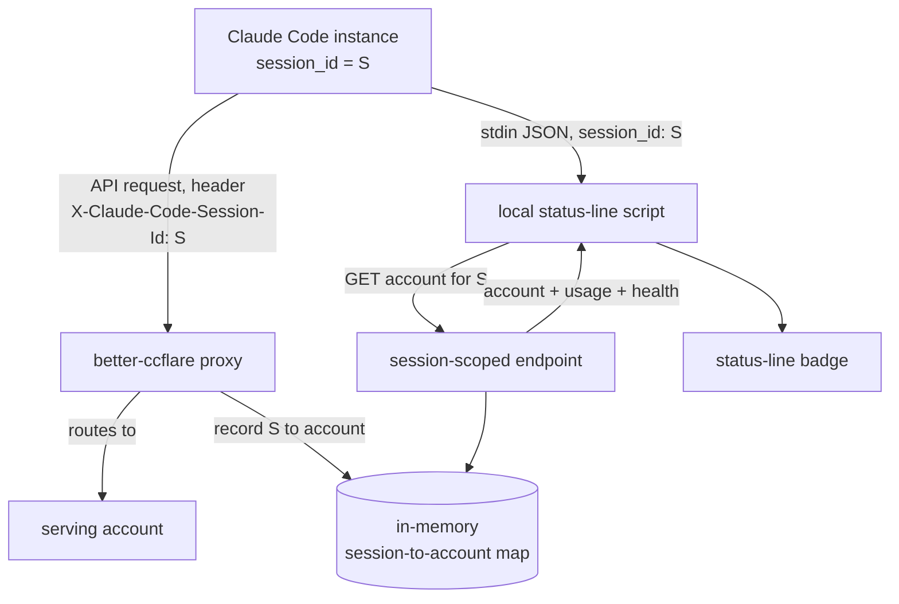

# Status Line Account Display - Plan

## Goal Capsule

| Field | Value |
|---|---|
| Objective | Show, in each Claude Code instance's status line, which better-ccflare account is currently serving that chat, along with its usage-toward-limit and rate-limit/paused state. |
| Product authority | Product Contract requirements, repo `CLAUDE.md`, existing proxy/config/status-line patterns, then implementation judgment. |
| Open blockers | None block planning. Correlation depends on the Claude Code session-id header matching the status-line `session_id` (high confidence; edge cases recorded under Assumptions). |

---

## Product Contract

### Summary

Add a per-chat account badge to the Claude Code status line. better-ccflare reads the `X-Claude-Code-Session-Id` header Claude Code already sends, records which account served each session, and exposes it through a session-scoped read endpoint that the local status-line script polls, rendering the account name with its usage-toward-limit and health. This is the read-only foundation the future "pin this chat to an account" capability will sit on.

### Problem Frame

The operator runs many Claude Code instances through better-ccflare and, at any moment, wants to drive one specific account's usage hard before its limit resets. Today there is no way to see which account is serving a given chat: the proxy response returns only a request id, never the account, and the account never appears in the session transcript. The status line already shows *model* routing (derived locally from the transcript, where better-ccflare's model rewrite is recorded), but the same trick cannot surface the account, because the account is not written anywhere the client can read.

A second, quieter motivation: under session-based routing the operator expects a chat to stay on one account for prompt-cache reasons. A visible account badge doubles as a check that stickiness is actually holding.

### Key Decisions

- **Correlate on the session-id header, not the request body.** Claude Code has sent `X-Claude-Code-Session-Id` since CLI v2.1.86, specifically so proxies can group requests by session without parsing the body, and its value is the same `session_id` the status line receives on stdin. The proxy's current per-session id (`clientSessionId`, taken verbatim from `metadata.user_id`) is a JSON blob (`{device_id, account_uuid, session_id}`) and is not usable as the match key.
- **Hold the association in memory, not the database.** The session-to-account link is live, short-lived state. A persisted column would force a SQLite and PostgreSQL migration for no durable benefit; an in-memory map bounded by TTL and size (mirroring the existing session-affinity map) is sufficient.
- **Read-only foundation.** The feature reports the serving account; it adds no lever to move a chat onto a chosen account. Steering an account into use stays with existing account controls (pause, priority, force-route), and manual pinning is deferred, reusing this same session-to-account mapping.
- **HTTP call from the status-line script.** The existing model badge reads the transcript locally, but the account is not recorded in the transcript, so the script must query better-ccflare's API to learn the account.

The same session id `S` reaches the proxy as a header and the status-line script as stdin; the endpoint joins them through the map.

### Requirements

**Proxy correlation and state**

- R1. The proxy reads the `X-Claude-Code-Session-Id` request header and records, keyed by that session id, the account that served the request.
- R2. The recorded account is the one that actually served the request, reflecting force-routing and failover outcomes rather than the initially selected account.
- R3. The association is held in process memory with no new database column or migration, bounded by a TTL and a maximum entry count comparable to the existing session-affinity map.

**Read API**

- R4. A session-scoped read endpoint returns, for a given session id, the serving account's name plus its usage-toward-limit and rate-limit/paused state.
- R5. When no association exists for the requested session id, the endpoint returns a well-formed "unknown" result rather than an error.

**Status-line rendering and degradation**

- R6. The status-line script reads its own `session_id` from the stdin JSON Claude Code provides and queries the endpoint for that session.
- R7. The badge renders the account name with its usage-toward-limit and rate-limit/paused/refreshing state, extending the existing model-routing line rather than replacing it.
- R8. The script caches the endpoint response briefly so frequent status-line redraws do not issue one HTTP call per render.
- R9. On an unknown or unreachable result, the badge degrades to a neutral state without breaking the existing model-routing display.

### Acceptance Examples

- AE1. Mapped session. **Given** the current chat has made at least one request and the proxy recorded its account, **when** the status line renders, **then** the badge shows that account with its usage-toward-limit and health. **Covers R4, R7.**
- AE2. Unmapped session. **Given** a fresh chat that has issued no request yet, or the proxy restarted and lost its in-memory map, **when** the status line renders, **then** the endpoint returns unknown and the badge shows a neutral state. **Covers R5, R9.**
- AE3. Unhealthy account. **Given** the serving account is rate-limited or paused, **when** the status line renders, **then** the badge reflects that state. **Covers R4, R7.**
- AE4. No session header. **Given** a client older than CLI v2.1.86 or a non-Claude-Code client that sends no session header, **when** it issues requests, **then** no association is recorded and the badge stays neutral for that session. **Covers R1, R5, R9.**
- AE5. Concurrent chats under `session` strategy. **Given** two chats active at once while the load balancer runs the `session` strategy, **when** both status lines render, **then** both show the same account, because the whole fleet shares one active account. **Covers R4.**

### Scope Boundaries

- Manual pinning (forcing a chat onto a chosen account) is deferred; it would reuse this session-to-account mapping as a forced, rather than observed, link.
- The target-account signal (naming an account and coloring the badge when the chat is on it) is deferred.
- No new control lever to change which account is active; pause, priority, and force-route stay as they are.
- No change to the load-balancing strategy. Genuine per-chat account variety only appears under `session-affinity`; switching strategy is out of scope.
- No persistence of the session-to-account association to the database.

### Dependencies / Assumptions

- Assumes Claude Code CLI at or above v2.1.86 sends `X-Claude-Code-Session-Id` (the repo currently tracks 2.1.206). Older or non-Claude-Code clients are not correlated and degrade to a neutral badge (R5, R9).
- Assumes the stdin `session_id` equals the header value in the normal case (high confidence). Known divergences: the `--session-id` flag makes the injected id an API/telemetry id distinct from local persistence, and `--resume` issues a new session id. Both are rare and opt-in; treat a mismatch as an unmapped session (AE2).
- Assumes the header keeps passing through the proxy untouched; it is not in the current header-sanitization strip list and client headers are copied verbatim to the upstream call.
- Assumes per-account usage-toward-limit and rate-limit/paused state are already available to the API layer (accounts row plus token-health), so the endpoint composes existing data rather than computing new metrics.

### Outstanding Questions

Deferred to planning:

- Exact badge format and how it composes with the existing `requested to served` model line, including what "usage-toward-limit" reads as (a percentage of the session request budget, a reset countdown, or both) subject to what the API already exposes.
- Endpoint path and response shape, and the script's cache TTL for polling it.
- TTL and maximum-entry values for the in-memory session-to-account map.

### Sources / Research

- `X-Claude-Code-Session-Id` header, added in Claude Code CLI v2.1.86 ("so proxies can aggregate requests by session without parsing the body"); the repo tracks CLI 2.1.206 in `packages/core/src/version.ts`. The header value shares the session id used by hooks, the `CLAUDE_CODE_SESSION_ID` env var, and the status-line stdin payload.
- Existing per-session id path: `packages/proxy/src/request-body-context.ts` (`getClientId` reads `metadata.user_id` verbatim) threaded to `clientSessionId` in `packages/proxy/src/proxy.ts`; this value is a JSON blob and unsuitable as the match key.
- Header pass-through: not stripped by `sanitizeRequestHeaders` in `packages/http-common/src/headers.ts`; client headers copied verbatim in `packages/providers/src/providers/anthropic/provider.ts`.
- Routing strategy resolved by `ConfigManager.getStrategy()` in `packages/config/src/index.ts`, default `session` in `packages/core/src/strategy.ts`. Under `session`, one account holds the active window and serves the whole fleet; per-chat stickiness is the separate `session-affinity` strategy in `packages/load-balancer/src/strategies/session-affinity.ts`, whose TTL and entry-cap pattern is the model to mirror for R3.
- Read-side building blocks: `GET /api/accounts`, `GET /api/requests` (recent `account_used` / `account_name`), and `GET /api/requests/stream` (SSE with live `accountId`), routed in `packages/http-api/src/router.ts`.
- The existing status-line model badge reads the session transcript locally and diffs requested vs served model; the account is absent from the transcript, which is why R6 requires an API call.
