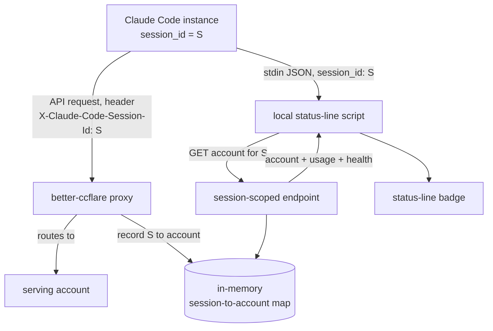
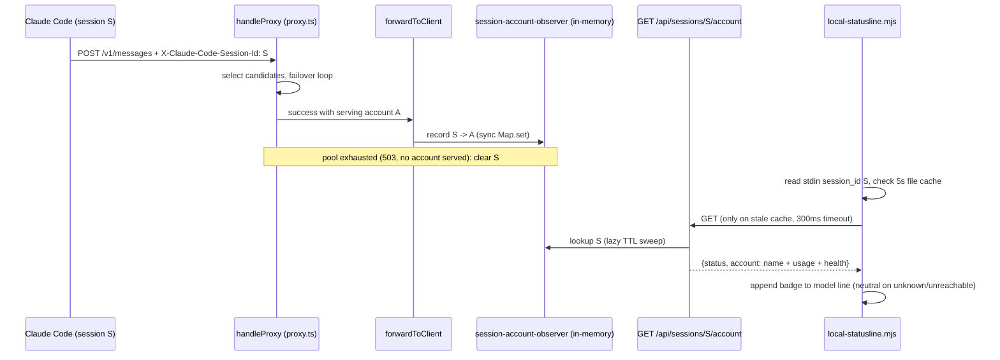

# Status Line Account Display - Plan

## Goal Capsule

| Field | Value |
|---|---|
| Objective | Show, in each Claude Code instance's status line, which better-ccflare account is currently serving that chat, along with its usage-toward-limit and rate-limit/paused state. |
| Product authority | Product Contract requirements, repo `CLAUDE.md`, existing proxy/config/status-line patterns, then implementation judgment. |
| Open blockers | None. All formerly deferred questions are resolved in the Planning Contract. |
| Product Contract preservation | Requirements and Acceptance Examples text unchanged. The three Outstanding Questions (all deferred-to-planning) are resolved into KTD-3, KTD-6, and KTD-7 and the section removed. Review clarifications: the Problem Frame's stickiness motivation now names `session-affinity`, and Dependencies / Assumptions wording was aligned with verification status. Planning adds one behavior clarification within the R2/R5 spirit: any request served by no account clears the session's map entry (KTD-5). |
| Target surfaces | This repo (proxy + HTTP API), plus one file outside the repo: the operator's status-line script at `~/.config/statusline-stack/local-statusline.mjs` (U3). |

---

## Product Contract

### Summary

Add a per-chat account badge to the Claude Code status line. better-ccflare reads the `X-Claude-Code-Session-Id` header Claude Code already sends, records which account served each session, and exposes it through a session-scoped read endpoint that the local status-line script polls, rendering the account name with its usage-toward-limit and health. This is the read-only foundation the future "pin this chat to an account" capability will sit on.

### Problem Frame

The operator runs many Claude Code instances through better-ccflare and, at any moment, wants to drive one specific account's usage hard before its limit resets. Today there is no way to see which account is serving a given chat: the proxy response returns only a request id, never the account, and the account never appears in the session transcript. The status line already shows *model* routing (derived locally from the transcript, where better-ccflare's model rewrite is recorded), but the same trick cannot surface the account, because the account is not written anywhere the client can read.

A second, quieter motivation: when per-chat stickiness is in play, the operator expects a chat to stay on one account for prompt-cache reasons, and a visible account badge doubles as a check that stickiness is actually holding. Per-chat drift is only possible under the `session-affinity` strategy; under the default `session` strategy the whole fleet shares one active account, so the badge is fleet-wide by construction and cannot diverge per chat (AE5).

### Key Decisions

- **Correlate on the session-id header, not the request body.** Claude Code has sent `X-Claude-Code-Session-Id` since CLI v2.1.86, specifically so proxies can group requests by session without parsing the body, and its value is the same `session_id` the status line receives on stdin. The proxy's current per-session id (`clientSessionId`, taken verbatim from `metadata.user_id`) is a JSON blob (`{device_id, account_uuid, session_id}`) and is not usable as the match key.
- **Hold the association in memory, not the database.** The session-to-account link is live, short-lived state. A persisted column would force a SQLite and PostgreSQL migration for no durable benefit; an in-memory map bounded by TTL and size (mirroring the existing session-affinity map) is sufficient.
- **Read-only foundation.** The feature reports the serving account; it adds no lever to move a chat onto a chosen account. Steering an account into use stays with existing account controls (pause, priority, force-route), and manual pinning is deferred, reusing this same session-to-account mapping.
- **HTTP call from the status-line script.** The existing model badge reads the transcript locally, but the account is not recorded in the transcript, so the script must query better-ccflare's API to learn the account.

The same session id `S` reaches the proxy as a header and the status-line script as stdin; the endpoint joins them through the map.

### Requirements

**Proxy correlation and state**

- R1. The proxy reads the `X-Claude-Code-Session-Id` request header and records, keyed by that session id, the account that served the request.
- R2. The recorded account is the one that actually served the request, reflecting force-routing and failover outcomes rather than the initially selected account.
- R3. The association is held in process memory with no new database column or migration, bounded by a TTL and a maximum entry count comparable to the existing session-affinity map.

**Read API**

- R4. A session-scoped read endpoint returns, for a given session id, the serving account's name plus its usage-toward-limit and rate-limit/paused state.
- R5. When no association exists for the requested session id, the endpoint returns a well-formed "unknown" result rather than an error.

**Status-line rendering and degradation**

- R6. The status-line script reads its own `session_id` from the stdin JSON Claude Code provides and queries the endpoint for that session.
- R7. The badge renders the account name with its usage-toward-limit and rate-limit/paused/refreshing state, extending the existing model-routing line rather than replacing it.
- R8. The script caches the endpoint response briefly so frequent status-line redraws do not issue one HTTP call per render.
- R9. On an unknown or unreachable result, the badge degrades to a neutral state without breaking the existing model-routing display.

### Acceptance Examples

- AE1. Mapped session. **Given** the current chat has made at least one request and the proxy recorded its account, **when** the status line renders, **then** the badge shows that account with its usage-toward-limit and health. **Covers R4, R7.**
- AE2. Unmapped session. **Given** a fresh chat that has issued no request yet, or the proxy restarted and lost its in-memory map, **when** the status line renders, **then** the endpoint returns unknown and the badge shows a neutral state. **Covers R5, R9.**
- AE3. Unhealthy account. **Given** the serving account is rate-limited or paused, **when** the status line renders, **then** the badge reflects that state. **Covers R4, R7.**
- AE4. No session header. **Given** a client older than CLI v2.1.86 or a non-Claude-Code client that sends no session header, **when** it issues requests, **then** no association is recorded and the badge stays neutral for that session. **Covers R1, R5, R9.**
- AE5. Concurrent chats under `session` strategy. **Given** two chats active at once while the load balancer runs the `session` strategy, **when** both status lines render, **then** both show the same account, because the whole fleet shares one active account. **Covers R4.**

### Scope Boundaries

- Manual pinning (forcing a chat onto a chosen account) is deferred; it would reuse this session-to-account mapping as a forced, rather than observed, link.
- The target-account signal (naming an account and coloring the badge when the chat is on it) is deferred.
- No new control lever to change which account is active; pause, priority, and force-route stay as they are.
- No change to the load-balancing strategy. Genuine per-chat account variety only appears under `session-affinity`; switching strategy is out of scope.
- No persistence of the session-to-account association to the database.
- No dashboard UI changes; the read endpoint serves the status-line script only.

### Dependencies / Assumptions

- Assumes Claude Code CLI at or above v2.1.86 sends `X-Claude-Code-Session-Id` (the repo currently tracks 2.1.206). Older or non-Claude-Code clients are not correlated and degrade to a neutral badge (R5, R9).
- Assumes the stdin `session_id` equals the header value in the normal case (high confidence). Suspected divergences (reported, not yet verified): the `--session-id` flag makes the injected id an API/telemetry id distinct from local persistence, and `--resume` issues a new session id. Both are rare and opt-in; treat a mismatch as an unmapped session (AE2). A cheap empirical check during implementation is optional, not blocking.
- Assumes the header keeps passing through the proxy untouched. Verified: `sanitizeRequestHeaders` in `packages/http-common/src/headers.ts` strips only encoding/auth/cookie headers, and only on the persisted copy; the live `Headers` object reaches the response path unmodified, and `Headers.get()` is case-insensitive.
- Assumes per-account usage-toward-limit and rate-limit/paused state are already available to the API layer. Verified: `usageUtilization`, `usageWindow`, `paused`, `rateLimitStatus`, `rateLimitedUntil`, and the usage-throttled state are already assembled for `GET /api/accounts` in `packages/http-api/src/handlers/accounts.ts`; the reusable provider-aware pieces are `usageCache` and `getRepresentativeUtilizationForProvider` in `packages/providers/src/usage-fetcher.ts`, composed as in `packages/http-api/src/handlers/health.ts` (which exists to avoid duplicating per-provider guards across handlers).

### Sources / Research

- `X-Claude-Code-Session-Id` header, added in Claude Code CLI v2.1.86 ("so proxies can aggregate requests by session without parsing the body"); the repo tracks CLI 2.1.206 in `packages/core/src/version.ts`. The header value shares the session id used by hooks, the `CLAUDE_CODE_SESSION_ID` env var, and the status-line stdin payload.
- Existing per-session id path: `packages/proxy/src/request-body-context.ts` (`getClientId` reads `metadata.user_id` verbatim) threaded to `clientSessionId` in `packages/proxy/src/proxy.ts`; this value is a JSON blob and unsuitable as the match key.
- Header pass-through: not stripped by `sanitizeRequestHeaders` in `packages/http-common/src/headers.ts`; client headers copied verbatim in `packages/providers/src/providers/anthropic/provider.ts`.
- Routing strategy resolved by `ConfigManager.getStrategy()` in `packages/config/src/index.ts`, default `session` in `packages/core/src/strategy.ts`. Under `session`, one account holds the active window and serves the whole fleet; per-chat stickiness is the separate `session-affinity` strategy in `packages/load-balancer/src/strategies/session-affinity.ts`, whose TTL and entry-cap pattern is the model to mirror for R3.
- Read-side building blocks: `GET /api/accounts`, `GET /api/requests` (recent `account_used` / `account_name`), and `GET /api/requests/stream` (SSE with live `accountId`), routed in `packages/http-api/src/router.ts`.
- The existing status-line model badge reads the session transcript locally and diffs requested vs served model; the account is absent from the transcript, which is why R6 requires an API call.
- Status-line script ground truth: the badge lives in `~/.config/statusline-stack/local-statusline.mjs` (Node v24 ESM, 165 lines, invoked per render, synchronous today, no HTTP). It is chained behind an ad-injector wrapper with a 5s hard timeout. It reads `session_id`, `model.id`, and `transcript_path` from stdin JSON. Claude Code's env carries `ANTHROPIC_BASE_URL=http://127.0.0.1:8788` (production guard port), inherited by the script process.

---

## Planning Contract

### Key Technical Decisions

- KTD-1. **Record the association inside `forwardToClient`.** `forwardToClient` (`packages/proxy/src/response-handler.ts:118`) is the single success point where the definitive serving account (`options.account`) and the original request headers (`options.requestHeaders`) are both in scope, after force-routing and the failover loop have settled. A synchronous `Map.set` there satisfies R1/R2 with one touch point; force-routed requests flow through the same call (`packages/proxy/src/handlers/account-selector.ts:90-127` only changes candidate selection). Guard on `account !== null` (an unauthenticated passthrough variant calls it with `null`). Do not defer the write to the async usage collector; it is a cheap in-memory set and must not race the status-line read. Trade-off accepted on the write side, mirroring KTD-3's read-side framing: the map trusts the client-supplied session-id header with no ownership check, so any proxy caller can overwrite another session's recorded account. Accepted because the mapping is observational and read-only with no secrets; revisit before the deferred pinning feature reuses this map, since a forced link would make header spoofing controlling rather than cosmetic.
- KTD-2. **Module-level singleton in `packages/proxy`, imported directly by `packages/http-api`.** New module `packages/proxy/src/session-account-observer.ts` exports `recordServedAccount`, `clearSession`, and `getServedAccount`. `packages/http-api` already depends on `@better-ccflare/proxy` and imports from it in `handlers/token-health.ts`; `usageCache` (`packages/providers/src/usage-fetcher.ts`) sets the singleton precedent. Alternative considered: constructing the map in `apps/server/src/server.ts` and injecting it into both `ProxyContext` and `APIRouter` (the pattern `packages/types/src/context.ts:51-55` advocates). Rejected for now: larger diff for no behavioral gain; revisit if proxy/http-api decoupling becomes a goal.
- KTD-3. **Endpoint `GET /api/sessions/:sessionId/account`, exempt from API-key auth.** Route it in `packages/http-api/src/router.ts` using the existing manual path-parse precedent (`GET /api/oauth/qwen/status/:sessionId`, router.ts:869-879). Add the path to `isStaticPathExempt` (`packages/http-api/src/services/auth-service.ts:133`) as a prefix match like the existing `/api/oauth` exemption, since the path carries a dynamic segment (`/api/version/check` is the read-only-exemption precedent), because the caller is a local status-line script with no credential store. Trade-off accepted, with the realistic threat named: session ids are not secrets an attacker must guess; any local process inheriting the Claude Code environment (a third-party hook script, for example) already holds `CLAUDE_CODE_SESSION_ID` and can derive the proxy address from `ANTHROPIC_BASE_URL`, so it can read that chat's serving account name plus coarse usage/health with no credential. That payload is coarse operational state with no secrets, so this plan adds no extra gating (such as a loopback-only source check); revisit if the payload grows or the production guard is found to expose `/api/*` beyond localhost. Without the exemption the endpoint would 401 on any keyed instance and be blocked for `api-only` roles. The existing `GET /api/requests/stream` SSE feed already carries a live `accountId` but is not reused: the status-line script is a fresh short-lived process per render and cannot hold a persistent SSE connection, so a short-timeout polling GET fits.
- KTD-4. **Unknown is a 200, not a 404.** The endpoint always returns `jsonResponse({success: true, data: {...}})` with `status: "known" | "unknown"`; a mapping that points at a since-deleted account also resolves to `unknown`. This keeps the script's parse path single-shape (R5).
- KTD-5. **Any request that completes without a serving account clears the session's entry.** The rule, not a site list, is the contract: whenever `handleProxy` finishes a request with no non-null serving account, delete that session id's map entry so the badge degrades to unknown instead of showing the last healthy account. Current exit inventory in `packages/proxy/src/proxy.ts` needing the `clearSession` call: inside the `accounts.length === 0` block, the usage-throttled early return, the `CCFLARE_PASSTHROUGH_ON_EMPTY_POOL` passthrough (which reaches `forwardToClient` with `account: null`, so this exit can instead be handled in `forwardToClient`'s null-account branch), and the pool-exhausted 503 return; after the retry loop, both all-candidates-failed `ServiceUnavailableError` throw sites (the needs-reauth variant and the final generic throw); and the combo-fallback throttled return after step 10. Place the calls at these exits in `proxy.ts` (or the null-account branch where noted), not in the generic error catch in `apps/server/src/server.ts`, since that catch handles all proxy errors, not just these. This is a planning clarification within R2/R5: after a failed request no account "actually served", so the association degrades to unknown.
- KTD-6. **Map bounds mirror the session-affinity strategy.** `Map<string, {accountId, recordedAt}>` with TTL `TIME_CONSTANTS.ANTHROPIC_SESSION_DURATION_DEFAULT` (5h, `packages/core/src/constants.ts:15`), lazy expiry sweep on access (no timers), max 10,000 entries with oldest-entry eviction, mirroring `SessionAffinityStrategy` (`packages/load-balancer/src/strategies/session-affinity.ts`: map at line 78, cap and `evictOldestIfFull` at lines 36 and 158-169, lazy sweep at 195-199).
- KTD-7. **Script derives the base URL from `ANTHROPIC_BASE_URL` and caches per session for ~5s.** The status-line script inherits the Claude Code process env, so `process.env.ANTHROPIC_BASE_URL` names exactly the better-ccflare instance this chat's requests go through (dev 8080/8081, prod guard 8788); when unset, the chat is not proxied and the script skips the badge and the fetch entirely. Responses (including `unknown` and fetch failures) are cached in a small JSON file keyed by session id with a ~5s freshness window; renders fire every few hundred ms while a failover the operator is watching for surfaces within one turn, so 5s de-noises renders without visible lag. The fetch uses `AbortSignal.timeout(~300ms)` so a down proxy degrades to neutral without slowing the render.

### High-Level Technical Design

### Assumptions

Recorded here because this run resolved its scoping without a user confirmation gate:

- The guard on :8788 passes `/api/*` through to the binary on :8789. Verified from source only for `/health` (`scripts/deploy-ccflare.sh` polls the guard's health endpoint "passed through to the real server"); the guard itself is not in this repo. Verify after deploy; fallback is pointing the script at `http://127.0.0.1:8789` directly.
- Editing `~/.config/statusline-stack/local-statusline.mjs` is in scope even though it lives outside the repo and any git tracking. Keep a timestamped backup next to it before editing (the directory already holds `.bak.*` files by convention).
- The `--session-id` divergence claim is carried from the brainstorm unverified; if implementation finds header and stdin ids identical under `--session-id`, nothing changes except AE2 covering one fewer case.
- The API surface stays script-only; no dashboard consumption of the new endpoint in this plan.

### Sequencing

U1 (proxy map) then U2 (endpoint) land together in this repo on the existing branch and PR. U3 (script) is a local, out-of-repo edit applied once a server with U1+U2 is running; against production it additionally waits on merge to `main` and a `scripts/deploy-ccflare.sh` deploy.

---

## Implementation Units

### U1. Session-account observation map in the proxy

- **Goal:** Record, per Claude Code session id, the account that actually served the most recent request; expose lookup; clear on pool exhaustion.
- **Requirements:** R1, R2, R3 (AE4 for the no-header case).
- **Dependencies:** None.
- **Files:** `packages/proxy/src/session-account-observer.ts` (new), `packages/proxy/src/response-handler.ts` (record in `forwardToClient`), `packages/proxy/src/proxy.ts` (clear on pool-exhaustion paths), `packages/proxy/src/index.ts` (export the read/clear functions), `packages/proxy/src/__tests__/session-account-observer.test.ts` (new).
- **Approach:** Singleton module per KTD-2 with mechanics per KTD-6, with the TTL and max-entry bound injectable (optional factory or function parameters with production defaults, mirroring `SessionAffinityStrategy`'s constructor injection) so the TTL and eviction test scenarios run fast without global `Date.now` mocking. `forwardToClient` reads `options.requestHeaders?.get("x-claude-code-session-id")` and, when non-empty and `options.account` is non-null, records `sessionId -> account.id` synchronously (KTD-1). Every no-account-served exit in `handleProxy` calls `clearSession(sessionId)` when the header is present, per KTD-5's rule and its current exit inventory. Store the account id, not a snapshot; the endpoint resolves name and health at read time so the badge never shows stale usage.
- **Patterns to follow:** `SessionAffinityStrategy` map/TTL/eviction mechanics (`packages/load-balancer/src/strategies/session-affinity.ts`); `usageCache` singleton export (`packages/providers/src/usage-fetcher.ts`); existing proxy test fixtures in `packages/proxy/src/handlers/__tests__/proxy-operations-failover.test.ts`.
- **Execution note:** Write the observer tests first; the module is pure in-memory logic and test-first is cheap here.
- **Test scenarios:**
  - Record then get returns the account id for that session id (happy path).
  - Second record for the same session with a different account overwrites (failover, R2).
  - No header on the request: nothing recorded; get returns undefined. Covers AE4.
  - `account === null` (unauthenticated passthrough variant): nothing recorded.
  - Entry older than the TTL: get returns undefined and the entry is swept on access.
  - At 10,000 entries, inserting one more evicts the oldest entry, not the newest.
  - `clearSession` removes an existing entry; clearing an absent session id is a no-op.
  - Integration: driving `handleProxy` into each no-account-served exit with a session header present clears a previously recorded entry: the no-accounts 503, the all-candidates-failed throws, the usage-throttled return, the `CCFLARE_PASSTHROUGH_ON_EMPTY_POOL` passthrough, and the combo-fallback throttled return (verifies the KTD-5 wiring, not just the observer module).
- **Verification:** `bun test packages/proxy` green; `bun run lint && bun run typecheck && bun run format` clean.

### U2. Session-scoped account endpoint in the HTTP API

- **Goal:** `GET /api/sessions/:sessionId/account` returns the serving account's name, usage-toward-limit, and rate-limit/paused state, or a well-formed unknown.
- **Requirements:** R4, R5 (AE1, AE2, AE3, AE5).
- **Dependencies:** U1.
- **Files:** `packages/http-api/src/handlers/sessions.ts` (new), `packages/http-api/src/router.ts` (route + handler registration), `packages/http-api/src/services/auth-service.ts` (auth exemption), `docs/api-http.md` (document the endpoint), `packages/http-api/src/handlers/__tests__/sessions.test.ts` (new).
- **Approach:** Handler factory `createSessionAccountHandler(dbOps, ...)` following the closure-injection pattern of `handlers/token-health.ts`; route parsing follows the `GET /api/oauth/qwen/status/:sessionId` precedent (KTD-3). Look up the session via `getServedAccount` from `@better-ccflare/proxy`; resolve the account row and compose `name`, `usageUtilization`, `usageWindow`, `paused`, `rateLimitStatus`, `rateLimitedUntil`, and the usage-throttled state (`usageThrottledUntil`/`usageThrottledWindows` or an equivalent flag, computed as `createAccountsListHandler` does from the throttling config). Use the provider-aware composition `packages/http-api/src/handlers/health.ts` already uses: `usageCache.get(accountId)` plus `getRepresentativeUtilizationForProvider` and `getRepresentativeUsageResetMs` (`packages/providers/src/usage-fetcher.ts:348`). Do not mirror `createAccountsListHandler`'s per-provider dispatch block; health.ts's composition exists to avoid duplicating those guards (see its PR #299 split-brain note). Response per KTD-4: always `{success: true, data: {status, account?}}`. Empty session id segment is a `BadRequest`. Add the path to `isStaticPathExempt` with a comment stating why (local status-line caller, read-only, no secrets).
- **Test scenarios:**
  - Covers AE1. Mapped session with a healthy account: 200, `status: "known"`, account name and `usageUtilization`/`usageWindow` present.
  - Covers AE2. Unknown session id: 200, `status: "unknown"`, no error shape.
  - Covers AE3. Mapped account is rate-limited: `rateLimitStatus`/`rateLimitedUntil` reflect it; paused account: `paused: true`.
  - Usage-throttled account (throttling enabled, window exhausted): the response carries the throttled state while `paused` is false and the rate-limit fields are clear.
  - Mapping points at an account id no longer in the DB: 200, `status: "unknown"`.
  - Auth enabled (API keys exist): the endpoint responds without any key (exemption effective).
  - Empty/whitespace session id: 400 BadRequest.
- **Verification:** `bun test packages/http-api` green; curl smoke against a dev server on 8081 returns both known and unknown shapes; lint/typecheck/format clean.

### U3. Account badge in the local status-line script

- **Goal:** The status line renders the serving account with usage and health next to the existing model-routing segment, degrading neutrally.
- **Requirements:** R6, R7, R8, R9 (AE1, AE2, AE3, AE4).
- **Dependencies:** U2 (a running server with U1+U2).
- **Files:** `~/.config/statusline-stack/local-statusline.mjs` (outside this repo; take a timestamped backup first). No repo files change in this unit.
- **Approach:** Per KTD-7: resolve base URL from `process.env.ANTHROPIC_BASE_URL`, and when unset render no badge and issue no fetch. Read the per-session cache file (under the `statusline-stack` directory or `os.tmpdir()`), keyed by `session_id`, fresh for ~5s, caching known, unknown, and failure results alike. On stale cache, `fetch` the U2 endpoint with `AbortSignal.timeout(~300ms)`; on any error fall back to the cached or neutral state. The script's stdin `end` handler currently calls a synchronous `main(buf)` and writes the result in one step; the fetch requires making that flow async (an async `main`, awaited in the `end` handler before `process.stdout.write`) so the process cannot exit or emit a pending Promise before the fetch settles. Render appended to the existing model line: account name plus utilization percentage and window when known, colored to distinguish healthy from rate-limited/paused, and a dim neutral placeholder when unknown. Wrap the whole badge computation in try/catch so no failure disturbs the existing three-line render. Note for acceptance testing: `--resume` and `--session-id` chats legitimately render neutral until their next request (AE2).
- **Execution note:** This file has no test harness; prefer smoke verification over unit coverage. `Test expectation: none -- out-of-repo script, verified by the enumerated smoke checks below.`
- **Smoke checks (manual, enumerated):**
  - Mapped session: pipe a captured stdin JSON with a live session id; badge shows account, utilization, window.
  - Unknown session: unmapped id renders the neutral placeholder; model segment intact.
  - Proxy down: fetch times out at ~300ms; render completes with neutral badge and no visible stall.
  - `ANTHROPIC_BASE_URL` unset: no badge, no HTTP call.
  - Rate-limited or paused account: badge color/state reflects it.
  - Two renders within 5s normally issue one HTTP call (verify via proxy request logs); an occasional duplicate call at a cache-boundary crossing is acceptable, since independent per-render processes share no single-flight lock.
- **Verification:** All smoke checks pass; status-line total render time stays within the wrapper's tolerance with the proxy stopped.

---

## Verification Contract

| Gate | Command / Action | Applies to |
|---|---|---|
| Lint, typecheck, format | `bun run lint && bun run typecheck && bun run format` | U1, U2 (mandatory per repo `CLAUDE.md` after code changes) |
| Unit tests | `bun test packages/proxy packages/http-api`, then repo-wide `bun test` | U1, U2 |
| End-to-end smoke (dev) | Start `bun start --serve --port 8081`; POST `/v1/messages` with `X-Claude-Code-Session-Id: <id>` and `x-better-ccflare-account-id` force-routed to a non-Anthropic account (never exercise the `claude` account via curl, per repo `CLAUDE.md`); then GET `/api/sessions/<id>/account` and assert `status: "known"` with that account; GET with a random id and assert `status: "unknown"` | U1+U2 (AE1, AE2) |
| Status-line smoke | Pipe captured stdin JSON samples through `node ~/.config/statusline-stack/local-statusline.mjs`; run the U3 smoke checks | U3 |
| Production pass-through | After merge to `main` and deploy via `scripts/deploy-ccflare.sh`, `curl http://127.0.0.1:8788/api/sessions/<id>/account` to confirm the guard forwards `/api/*`; if blocked, repoint the script at `:8789` | U3 rollout |

---

## Definition of Done

- U1 and U2 merged with all Verification Contract gates green; no database migration added (R3 negative check).
- AE1 through AE4 demonstrated via the end-to-end and status-line smoke checks (AE5 needs no separate check; it is the `session`-strategy consequence of AE1).
- The endpoint is documented in `docs/api-http.md`.
- `~/.config/statusline-stack/local-statusline.mjs` updated with a timestamped backup retained, badge visible in a live chat, and neutral degradation confirmed with the proxy stopped.
- No dead-end or experimental code left in the diff; abandoned approaches removed.

---

## Deferred / Open Questions

### From 2026-07-12 review

- **R7's "refreshing" badge state has no data source, design, or test** - Product Contract R7 / U2 / U3 (P1, coherence, confidence 100)

  R7 requires the badge to render a "refreshing" state alongside rate-limit/paused, but nothing downstream operationalizes it: AE3 only exercises rate-limited and paused, the Dependencies/Assumptions field list has no refresh-related entry, and neither KTD-4's response shape, U2's composed fields, nor U3's render logic mention it. An implementer building strictly from the units would ship this third state silently unimplemented and untested. Resolve by either dropping "refreshing" from R7 or naming its data source and threading it through U2 and U3.
