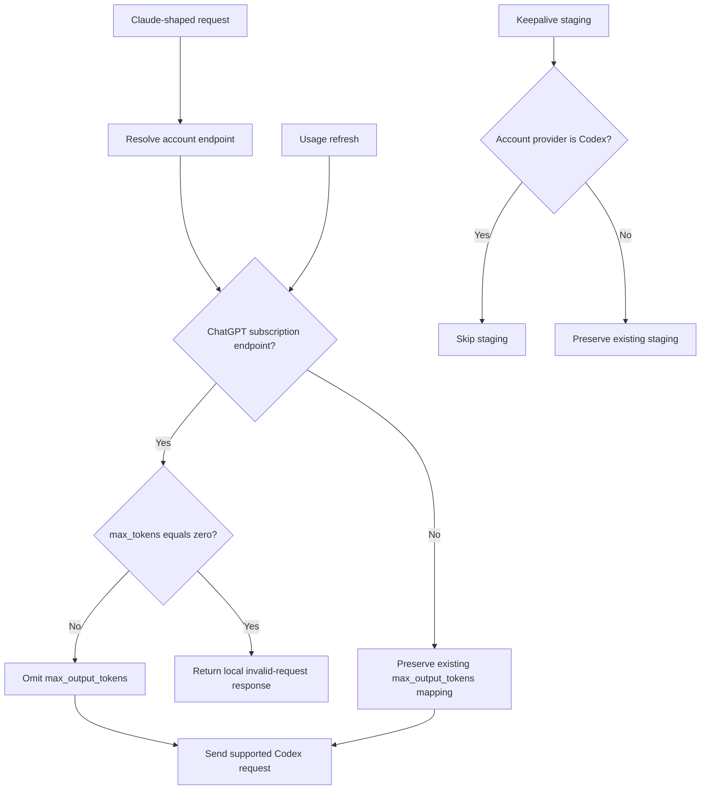

# Codex Subscription Output Parameter Compatibility - Plan

## Goal Capsule

- **Objective:** Restore Claude Code requests routed through Codex Pro by matching the ChatGPT subscription request contract while preserving supported custom-endpoint behavior and unrelated Codex response fixes.
- **Authority:** Repository safety rules and the official Codex request contract override assumptions inherited from local commit `57490591`.
- **Execution profile:** Test-first, focused changes on a fresh branch, independent review, then merge and guarded deployment from `refs/heads/main`.
- **Stop conditions:** Stop if the fix would require scripted Codex or Anthropic traffic, if current `origin/main` changes overlap the target files, or if live health does not report the exact merged SHA.
- **Tail ownership:** The executor owns implementation, review findings, merge, deployment, health verification, and passive observation of naturally initiated Claude Code traffic.

---

## Product Contract

### Summary

The fix makes Codex request serialization follow the contract of the resolved upstream endpoint. The ChatGPT subscription endpoint omits unsupported `max_output_tokens`, explicitly rejects zero-output prewarm requests, and avoids recurring Codex keepalive replays; non-default custom endpoints retain their existing output-cap behavior.

### Problem Frame

Local-fork PR #2 introduced unconditional translation from Anthropic `max_tokens` to Responses `max_output_tokens`. The deployed ChatGPT Codex subscription endpoint rejects that field with HTTP 400, so ordinary Claude Code requests fail after routing or failover reaches `pro-primary`.

The production build is current rather than stale: the running service and `origin/main` both identify SHA `4e85b510`. The regression is therefore in the deployed request contract, not deployment drift.

### Requirements

**Request compatibility**

- R1. Requests resolved to the default ChatGPT Codex subscription endpoint must never serialize `max_output_tokens`.
- R2. Requests resolved to a non-default custom endpoint must retain the existing positive, fractional-floor, and zero-clamp output-cap behavior.
- R3. The serialization decision must use the resolved request URL so invalid custom endpoints that fall back to ChatGPT receive the subscription contract.
- R4. A zero-token request resolved to ChatGPT must fail locally with an Anthropic-shaped invalid-request response instead of becoming an uncapped generation.
- R5. Response streaming, tool-call assembly, `response.incomplete` handling, and Codex error classification introduced alongside the regression must remain unchanged.

**Synthetic traffic safety**

- R6. Default-endpoint usage refresh must omit `max_output_tokens`, retain its minimal input and reasoning shape, and abort or cancel the response immediately after preserving headers.
- R7. Custom-endpoint usage refresh must retain its existing one-token cap unless that endpoint contract is changed separately.
- R7a. Usage refresh must validate and resolve custom endpoints through the same fallback policy as normal Codex requests; an invalid custom endpoint therefore uses the default subscription contract.
- R8. Codex accounts must not be staged for recurring cache-keepalive replay because the subscription contract cannot express the scheduler's one-token bound; when failover reaches Codex, any earlier staged entry for the same request ID must be discarded.
- R9. Anthropic and other supported keepalive lanes must preserve their existing replay behavior.

**Verification and rollout**

- R10. Tests must prove request shapes and cancellation without sending traffic through Codex or Anthropic accounts.
- R11. Deployment must come from merged `refs/heads/main` through `scripts/deploy-ccflare.sh` and is successful only when both health endpoints are healthy and the embedded `git_sha` equals the merged commit.
- R12. Account priorities and pause state must remain unchanged by this code fix.

### Acceptance Examples

- AE1. Given a normal Claude request with positive `max_tokens`, when the resolved target is ChatGPT Codex, then the transformed request has no `max_output_tokens` property and otherwise preserves its model, input, tools, reasoning, stream, and store fields.
- AE2. Given the same request targeting a non-default custom endpoint, when it is transformed, then the existing integer output cap is preserved.
- AE3. Given `max_tokens: 0` targeting ChatGPT Codex, when it is transformed, then the proxy returns a local invalid-request response and performs no upstream fetch.
- AE4. Given an on-demand refresh targeting ChatGPT Codex, when upstream headers arrive, then the request omits `max_output_tokens`, snapshots status and rate-limit headers, and terminates the body without reading it to completion.
- AE5. Given an ordinary request assigned to a Codex account, when keepalive staging is considered, then no replay entry is stored; an Anthropic account under the same conditions remains eligible. If the request first staged on Anthropic and then failed over to Codex, the Anthropic staging entry is discarded before the Codex attempt continues.

### Scope Boundaries

**In scope**

- Endpoint-aware Codex request serialization.
- Fail-closed subscription handling for zero-token prewarm requests.
- Default and custom usage-refresh request parity.
- A guard preventing Codex cache-keepalive staging.
- Focused tests, independent review, merge, guarded deployment, and live health verification.

**Out of scope**

- Changing account priorities, pause state, or session-affinity routing.
- Reverting the full `57490591` commit or changing its response-side behavior.
- Sending scripted model requests through Codex or Anthropic accounts.
- Publishing the fix to the upstream `tombii/better-ccflare` repository in this run.

#### Deferred to Follow-Up Work

- Enforcing Claude's requested output budget locally for ordinary ChatGPT Codex turns. Correct enforcement requires stream-aware token and tool-call accounting and must not truncate a tool call mid-frame.
- A capability declaration for custom endpoints that need contract selection beyond URL resolution.

---

## Planning Contract

### Key Technical Decisions

- KTD1. **Use the resolved request URL as the contract seam.** `CodexProvider.transformRequestBody` already receives the URL produced by `buildUrl`, including invalid-custom fallback, so no second endpoint resolver is needed.
- KTD2. **Gate rather than globally delete output-cap translation.** The default ChatGPT subscription contract rejects the field, while a non-default custom Responses endpoint may support it; preserving custom behavior narrows the regression surface.
- KTD3. **Fail closed for zero-token subscription requests.** Omitting the unsupported field would turn a no-output intent into an uncapped generation, so a local invalid-request response is safer and explicit.
- KTD4. **Disable recurring keepalive staging for Codex accounts and clear cross-provider residue.** The scheduler relies on `max_tokens: 1` and drains the response; without a supported subscription cap, replay is not safely bounded. A Codex attempt also discards any staging entry left by an earlier provider attempt under the same request ID.
- KTD5. **Bound usage refresh with transport cancellation.** Default-endpoint refresh relies on a tiny streaming request plus abort/body cancellation after headers, while custom endpoints keep the current one-token cap.
- KTD5a. **Share endpoint validation and normalization.** Normal requests and usage refresh use the same resolver and subscription-endpoint predicate, including invalid-custom fallback, trailing-slash normalization, and query-insensitive default matching.
- KTD6. **Keep runtime verification passive.** Unit and contract tests prove serialization; production proof is health/SHA plus observation of naturally initiated Claude Code traffic.

### High-Level Technical Design

### Assumptions

- The default contract is identified by the normalized origin and pathname of `CODEX_DEFAULT_ENDPOINT`; query parameters do not change the contract.
- A non-default custom endpoint retains current behavior because its accepted schema cannot be inferred safely from this incident.
- Deployment restart clears any previously staged in-memory Codex keepalive entries.
- The existing `max-*` priorities remain an operational configuration choice and are not part of this compatibility fix.

### Sequencing

1. Establish failing default-vs-custom request-shape and usage-refresh tests.
2. Add the shared endpoint-contract predicate and correct provider serialization.
3. Correct usage-refresh construction and cancellation documentation.
4. Add the Codex keepalive-staging guard and its regression coverage.
5. Run focused and full validation, independent review, merge, deploy, and verify the live SHA.

### Execution Preflight

Before implementation, record `git status`, fetch `origin/main`, fast-forward `refs/heads/main`, and create a fresh `codex/` feature branch. Preserve and identify any pre-existing changes before touching implementation files.

### Risks and Dependencies

- **HIGH request-path blast radius:** `CodexProvider.transformRequestBody` serves every Claude-shaped Codex request. Mitigation: endpoint-specific predicate, request-shape tests, and full Codex provider regression suite.
- **Output-budget gap:** Ordinary ChatGPT Codex turns cannot honor Claude's requested `max_tokens` upstream. Mitigation: remove the invalid field, fail closed only for zero-token requests, and defer correct local budgeting.
- **Synthetic quota consumption:** Removing the usage probe's cap could allow upstream generation before or after cancellation. Mitigation: streaming request, minimal input/reasoning, immediate abort plus body cancellation, and cancellation tests. Cancellation is best-effort and is not a guaranteed upstream token bound.
- **Keepalive replay risk:** Recurring replays could generate complete Codex turns. Mitigation: prevent Codex traffic from entering the replay store.
- **Deployment false positive:** The deploy script can warn rather than hard-fail on a mismatch. Mitigation: independently require healthy endpoints and exact embedded SHA equality.

### Sources and Research

- Local regression commit `574905913de33c626f383002f0ee411a93306060` and local-fork PR #2.
- `packages/providers/src/providers/codex/provider.ts` for endpoint resolution, request translation, and synthetic-response patterns.
- `packages/providers/src/providers/codex/provider.test.ts` for request-shape and on-demand refresh coverage.
- `packages/proxy/src/cache-keepalive-scheduler.ts` and `packages/proxy/src/handlers/proxy-operations.ts` for replay staging and draining behavior.
- OpenAI Codex `rust-v0.144.1` `ResponsesApiRequest`, which omits `max_output_tokens`: https://github.com/openai/codex/blob/rust-v0.144.1/codex-rs/codex-api/src/common.rs#L215-L239
- OpenAI Codex issue #4138, which records the decision not to support the parameter: https://github.com/openai/codex/issues/4138

---

## Implementation Units

### U1. Correct the resolved-endpoint request contract

- **Goal:** Make default ChatGPT subscription requests omit the unsupported field while preserving custom-endpoint behavior and rejecting unsafe zero-token subscription prewarms.
- **Requirements:** R1-R5; AE1-AE3.
- **Dependencies:** None.
- **Files:** `packages/providers/src/providers/codex/provider.ts`, `packages/providers/src/providers/codex/provider.test.ts`.
- **Approach:** Add a pure normalized endpoint predicate, apply it to `max_output_tokens` serialization using `request.url`, and reuse the existing synthetic-response mechanism for zero-token subscription requests.
- **Execution note:** Start with failing request-shape tests for default, custom, and invalid-custom fallback paths.
- **Patterns to follow:** `CODEX_DEFAULT_ENDPOINT`, `buildUrl`, `createSyntheticErrorResponse`, and existing prompt-cache endpoint gating on the related branch history.
- **Test scenarios:**
  - Covers AE1. Positive and fractional `max_tokens` resolved to ChatGPT omit the property while preserving the rest of the request envelope.
  - Covers AE2. Positive integers and fractions at or above one on a custom endpoint retain floor behavior; positive sub-unit fractions retain the legacy floor-to-zero behavior; exact zero retains the legacy clamp-to-one behavior.
  - Default endpoint variants with a trailing slash or query string still use the subscription contract.
  - Covers AE3. Zero on ChatGPT materializes a local Anthropic-shaped invalid-request response without upstream fetch.
  - Invalid custom endpoint fallback resolves to ChatGPT and follows the omission or fail-closed rules.
  - Absent and negative `max_tokens` preserve existing behavior.
  - Existing `response.incomplete`, error-code, tool-choice, and tool-terminal tests remain unchanged and green.
- **Verification:** Focused provider tests prove both endpoint contracts and the complete Codex provider suite has no response-side regressions.

### U2. Correct on-demand usage refresh and cancellation

- **Goal:** Keep operator-triggered usage refresh compatible with the subscription endpoint without relying on an unsupported hard cap.
- **Requirements:** R6, R7, R7a, R10; AE4.
- **Dependencies:** U1.
- **Files:** `packages/providers/src/providers/codex/on-demand-fetch.ts`, `packages/providers/src/providers/codex/provider.test.ts`, `apps/server/src/server.ts`, `packages/http-api/src/handlers/accounts.ts`.
- **Approach:** Reuse the normal-request endpoint resolver and predicate to omit the field on ChatGPT (including invalid-custom fallback), preserve the custom-endpoint cap, abort and cancel after header snapshot, and correct comments that claim a universal one-token bound.
- **Execution note:** Add mocked transport tests before changing request construction or cancellation order.
- **Patterns to follow:** Existing `fetchCodexUsageOnDemand` timeout, header snapshot, body cancellation, and status-preservation tests.
- **Test scenarios:**
  - Covers AE4. Default endpoint omits the field, retains tiny input/minimal reasoning/streaming, snapshots headers, and terminates the body.
  - Custom endpoint retains `max_output_tokens: 1`.
  - Invalid custom endpoints fall back to the default endpoint and omit `max_output_tokens`; trailing-slash and query variants of the default endpoint do the same.
  - Cancellation failure does not discard already captured status, headers, or parsed usage data.
  - Empty token, timeout, and upstream non-success behavior remain unchanged.
- **Verification:** On-demand refresh tests prove request shape, timeout signal, cancellation, header parsing, and status preservation without live provider traffic.

### U3. Prevent unsafe Codex cache-keepalive replay

- **Goal:** Ensure the compatibility fix cannot turn recurring synthetic keepalives into uncapped Codex generations.
- **Requirements:** R8-R10; AE5.
- **Dependencies:** U1.
- **Files:** `packages/proxy/src/handlers/proxy-operations.ts`, `packages/proxy/src/__tests__/auto-refresh-probe-filter.test.ts`, `packages/proxy/src/__tests__/cache-keepalive-scheduler.test.ts` if scheduler-level coverage is needed.
- **Approach:** Extract a pure staging-eligibility predicate, call it from the production `cacheBodyStore` staging path, and exercise that same exported predicate in tests. Exclude Codex accounts before their request bodies enter the store and call `discardStaged(requestMeta.id)` so a prior non-Codex failover attempt cannot leave a promotable entry. Preserve synthetic-header and other non-Codex behavior. Deployment restart clears any entries predating the fix.
- **Execution note:** Characterize the production predicate first; do not duplicate its logic in the test. Avoid mocking `cacheBodyStore` in ways known to poison Bun's module registry.
- **Patterns to follow:** The existing `isSyntheticInternal` staging guard and probe-filter characterization tests.
- **Test scenarios:**
  - Covers AE5. A Codex account is ineligible for staging even without synthetic headers.
  - Covers AE5. An Anthropic account with the same request remains eligible.
  - Covers AE5. Anthropic-to-Codex failover discards the earlier staging entry for the shared request ID, so a later usage summary cannot promote it.
  - Existing keepalive and auto-refresh headers remain ineligible for every provider.
  - Existing Anthropic keepalive sanitizer and replay tests remain green.
- **Verification:** Focused proxy tests prove the policy and existing scheduler behavior for supported providers is unchanged.

---

## Verification Contract

| Gate | Applies to | Done signal |
|---|---|---|
| Focused Codex provider tests | U1, U2 | Default/custom/zero request contracts and refresh cancellation pass |
| Focused proxy keepalive tests | U3 | Codex staging is blocked and supported-provider behavior remains green |
| Complete Codex provider test file | U1, U2 | Existing request, streaming, tool, incomplete, and error behavior passes |
| Full repository test suite | U1-U3 | No cross-workspace regression |
| `bun run lint` | U1-U3 | No lint diagnostics |
| `bun run typecheck` | U1-U3 | No TypeScript diagnostics |
| `bun run format` | U1-U3 | Formatter completes and only intended files differ |
| Change-impact analysis | U1-U3 | Expected request and synthetic-traffic flows only; no unexplained HIGH/CRITICAL change |
| Independent code review | U1-U3 | No unresolved correctness, regression, or safety findings |
| Deployment verification | Global | `ccflare-stack.service` and guard healthy; `/health.git_sha` equals merged SHA |
| Passive production observation | Global | Naturally initiated Claude Code traffic no longer returns the unsupported-parameter 400 |

Scripted requests through Codex or Anthropic accounts are forbidden. If no approved non-Anthropic account is available for a runtime smoke request, skip that smoke and rely on tests, health checks, and passive real-client observation.

---

## Definition of Done

- U1 is done when the default and custom endpoint contracts are separately tested, unsafe zero-token subscription requests fail locally, and unrelated `57490591` behavior remains green.
- U2 is done when default and invalid-custom-fallback refreshes omit the unsupported field, valid custom refresh retains its cap, and best-effort abort/body cancellation preserves headers/status under success and cancellation-error paths.
- U3 is done when the production staging predicate prevents Codex traffic from entering recurring keepalive staging and existing supported-provider replay tests remain green.
- All focused, full-test, lint, typecheck, format, impact-analysis, and independent-review gates pass.
- The focused branch is merged to `refs/heads/main`, pushed, and deployed only from that merged commit.
- Live health reports the exact merged SHA and the guard is healthy.
- No account priorities, pause state, versions, excluded generated files, or unrelated working-tree changes are modified.
- Experimental or abandoned code from attempted approaches is removed from the final diff.
