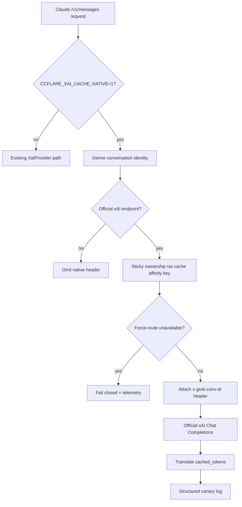

# Grok Cache-Native Vertical Slice - Plan

## Goal Capsule

- **Objective:** Prove a correct, opt-in native Grok Chat cache path on official xAI: conversation-partitioned identity, sticky account ownership, fail-closed force-route, and fixture-backed cache-token telemetry.
- **Product authority:** Product Contract below. Seeded from `docs/ideation/2026-07-15-native-grok-cache-routing-ideation.html` idea 1.
- **Execution profile:** test-first for identity, transport, routing, and usage fixtures; no real Anthropic automated traffic.
- **Stop conditions:** stop if official xAI rejects the Chat affinity header in smoke tests, or if Claude session metadata cannot yield a stable conversation seed for the request shapes better-ccflare already handles.
- **Open blockers:** None.
- **Product Contract preservation:** Product Contract unchanged from ce-brainstorm; planning only resolved Deferred-to-Planning questions into KTDs.

## Product Contract

### Summary

Ship an opt-in Grok Chat vertical slice that attaches a conversation-partitioned native affinity identifier on official xAI, binds that conversation to a sticky account owner, fails closed when a forced owner is unavailable, and proves mechanism correctness with fixtures plus structured canary telemetry. Done means the mechanism works, not that hit rate already improved.

### Problem Frame

better-ccflare already routes Claude Code traffic to xAI through a thin Chat Completions adapter. Official xAI documents automatic exact-prefix caching and a Chat-native affinity control, but the current provider emits no native identity, does not bind that identity to account locality, and has no xAI-specific proof that cached-token usage is observed correctly.

The Codex path already solved the related failure mode where one Claude session multiplexes many conversations. Without conversation partitioning and ownership, a Grok cache feature can look enabled while still colliding subagents or bouncing between accounts that do not share warm state. The cheapest useful product step is therefore a mechanism proof, not a broader scheduler or protocol rewrite.

### Key Decisions

- **Mechanism proof is the done bar.** The slice is complete when identity, ownership, official-endpoint gating, force-route fail-closed behavior, cached-token fixtures, and canary telemetry all work. A production hit-rate lift is a later success signal, not a release gate.
- **Opt-in first.** The feature stays off by default and is enabled through an explicit configuration or environment flag for canaries.
- **Conversation-partitioned identity.** Native identity is derived from a validated Claude session ID plus a stable conversation seed, not from the whole Claude session alone. Sibling and subagent conversations get different IDs.
- **Sticky ownership is required when enabled.** When the feature is on, the conversation has a sticky xAI account owner. Temporary failover may still serve availability, but the owner mapping is preserved for restore rather than forgotten.
- **Force-route fails closed under the feature.** If a request force-routes to an unavailable account while the feature is on, the system returns an explicit unavailable outcome instead of silently selecting another account.
- **Telemetry is logs and traces for v1.** Structured canary telemetry is required. Dashboard and cache-insights wiring are deferred unless planning finds them free.
- **Official xAI only at first.** Custom or self-hosted xAI-compatible endpoints stay gated off until capability is verified.

### Actors

- A1. Operator running better-ccflare with one or more official xAI accounts.
- A2. Claude Code client sending multi-turn and multi-conversation traffic through the proxy.
- A3. Official xAI Chat Completions endpoint receiving the adapted request and returning usage.

### Key Flows

- F1. Opt-in official Grok turn
  - **Trigger:** Feature flag enabled; request routes to an official xAI Chat account.
  - **Actors:** A1, A2, A3
  - **Steps:** Derive conversation identity; ensure sticky account ownership; attach native Chat affinity identifier; forward request; record canary telemetry including identity hash, serving account, prefix fingerprint, and cache outcome.
  - **Covered by:** R1, R2, R3, R4, R8, R9

- F2. Sibling or subagent separation
  - **Trigger:** Two concurrent conversations share a Claude session but differ in conversation seed.
  - **Actors:** A2, A3
  - **Steps:** Each conversation receives a distinct native identity; each keeps its own sticky owner contract.
  - **Covered by:** R2, R3, R4

- F3. Unavailable force-route
  - **Trigger:** Feature flag enabled and request force-routes to an unavailable xAI account.
  - **Actors:** A1, A2
  - **Steps:** Do not silently fall back to another account; return an explicit unavailable outcome; emit telemetry that the ownership contract blocked fallback.
  - **Covered by:** R5, R9

- F4. Custom endpoint request
  - **Trigger:** Feature flag enabled but the account targets a non-official or unverified endpoint.
  - **Actors:** A1, A2
  - **Steps:** Do not attach the native affinity identifier; do not claim the feature is active for that request.
  - **Covered by:** R6

### Requirements

**Activation and identity**

- R1. The feature is off by default and becomes active only through an explicit operator-controlled opt-in.
- R2. When active for an official xAI Chat request, the system derives a privacy-safe conversation identity from a validated Claude session ID plus a stable conversation seed.
- R3. Successive turns of the same conversation reuse the same native identity; sibling or subagent conversations under the same Claude session receive different identities.
- R4. When the feature is active, the conversation is bound to sticky xAI account ownership for the duration of the cache lineage, with temporary failover allowed only under the existing restore-preserving ownership model.

**Routing safety**

- R5. When the feature is active and a request force-routes to an unavailable account, the system fails closed with an explicit unavailable outcome rather than silently selecting another account.
- R6. The native Chat affinity identifier is attached only for verified official xAI endpoints. Custom or self-hosted endpoints remain gated off for this feature until separately verified.
- R7. When identity cannot be derived safely from request metadata, the system omits the native identifier rather than inventing an unstable or colliding one.

**Proof and telemetry**

- R8. Streaming and non-streaming official xAI responses that report cached-token usage are translated into the proxy's existing cache-read accounting path, with fixtures covering both cases.
- R9. While the feature is active, each canary-eligible request records structured telemetry for native identity hash, serving account, prefix fingerprint, and cache outcome, including an explicit unknown state when cache telemetry is absent.
- R10. Acceptance for this slice is mechanism correctness under fixtures and canary telemetry. A production cached-token or latency lift is not required for done.

### Acceptance Examples

- AE1. Same conversation, two turns
  - **Covers:** R2, R3, R4, R9
  - **Given:** Feature enabled, official xAI account, valid Claude session metadata, and a stable conversation seed.
  - **When:** Two successive turns of the same conversation are sent.
  - **Then:** Both turns use the same native identity, stay under the sticky owner contract, and emit canary telemetry for that identity and account.

- AE2. Sibling conversations under one Claude session
  - **Covers:** R2, R3
  - **Given:** Feature enabled and one Claude session containing two conversations with different seeds.
  - **When:** Both conversations send a turn.
  - **Then:** Each receives a different native identity.

- AE3. Force-route to unavailable owner
  - **Covers:** R5, R9
  - **Given:** Feature enabled and a force-route targeting an unavailable xAI account.
  - **When:** The request is processed.
  - **Then:** The proxy does not silently select another account, returns an explicit unavailable outcome, and records that the ownership contract blocked fallback.

- AE4. Custom endpoint remains inert
  - **Covers:** R6
  - **Given:** Feature enabled and an xAI-provider account pointed at an unverified custom endpoint.
  - **When:** A request is processed.
  - **Then:** No native Chat affinity identifier is attached and the request is not counted as an active official-xAI canary.

- AE5. Cached-token translation
  - **Covers:** R8, R10
  - **Given:** Official xAI streaming and non-streaming fixtures that include cached-token usage details.
  - **When:** Those responses are translated.
  - **Then:** Cache-read accounting is populated correctly, and a fixture with absent cache details records `unknown` rather than inventing a zero-hit result.

### Success Criteria

- An operator can enable the feature, send repeated official xAI Chat turns through Claude Code-shaped requests, and inspect structured telemetry proving identity stability, account ownership, and cache-outcome recording.
- Fixture coverage proves conversation partitioning, official-endpoint gating, force-route fail-closed behavior, and streaming plus non-streaming cached-token translation.
- No real Anthropic account is required or used for automated validation of this slice.

### Scope Boundaries

**In scope**

- Official xAI Chat Completions path only.
- Conversation-partitioned native affinity identity.
- Sticky account ownership for active conversations.
- Fail-closed force-route when the feature is active.
- Cached-token translation fixtures.
- Structured logs/traces canary telemetry.

**Deferred for later**

- xAI Responses API path and `prompt_cache_key`.
- Compaction-aware cache epochs.
- Dashboard or cache-insights UI for the new fields.
- Value-aware scheduling, working-set admission, or continuous policy tournaments.
- Durable reasoning-history WAL beyond what is required to keep current Chat conversion correct.
- Custom-endpoint enablement after capability verification.
- Distinct telemetry for every temporary normal-path failover lineage break (v1 only requires force-route fail-closed telemetry).

**Outside this product slice**

- Automated traffic against real Anthropic accounts.
- Free secondary-account prewarming or multi-account cache insurance.
- A provider-wide rewrite of all cache systems beyond the Grok vertical slice.

### Dependencies / Assumptions

- Official xAI Chat continues to accept a conversation affinity identifier and continues to report cached tokens through an OpenAI-compatible usage path or a fixture-provable equivalent.
- Claude Code continues to expose enough session metadata for validated conversation identity derivation on the requests better-ccflare already handles.
- Existing session-affinity ownership semantics are sufficient as the sticky-owner foundation when the feature is enabled.
- Existing shared OpenAI-compatible usage translation is a viable base for cached-token proof, subject to fixture confirmation for actual xAI response shapes.

### Outstanding Questions

**Deferred to Planning** — resolved in Planning Contract KTDs below.

**Deferred to Implementation**

- Exact smoke-test harness for optional live official xAI canary traffic on non-Anthropic accounts.
- Whether a future second flag is needed for session-only identity mode; v1 ships conversation-partitioned only.
- How feature-active Grok ownership is established before strategy selection without changing non-xAI stickiness (provider-eligible account partition vs strategy wrap).
- Discriminated force-route terminal result shape (status, error type, history, canary fields) so empty-account arrays do not enter passthrough.
- Completion-side canary ownership boundary: request-scoped context store + stream/non-stream observer for hit/miss/unknown.
- Whether identity/fingerprint derivation uses plain hash or deployment-scoped HMAC, and the telemetry retention/access policy for canary logs.

### Sources / Research

- `docs/ideation/2026-07-15-native-grok-cache-routing-ideation.html` — ranked idea 1 and sequencing rationale.
- `packages/providers/src/providers/xai/provider.ts` — current thin Chat Completions adapter with no native affinity field.
- `packages/providers/src/providers/codex/provider.ts` and related tests — conversation-partitioned cache identity, opt-in posture, endpoint gating, and fixture patterns.
- `packages/load-balancer/src/strategies/session-affinity.ts` — sticky account ownership and temporary failover restore semantics.
- `packages/proxy/src/handlers/account-selector.ts` — current force-route fallback behavior for unavailable targets.
- `packages/providers/src/providers/openai/provider.ts` and `packages/openai-formats/src/stream.ts` — existing `cached_tokens` translation path.
- xAI prompt-caching documentation — automatic exact-prefix caching, Chat header `x-grok-conv-id`, usage `prompt_tokens_details.cached_tokens`.

---

## Planning Contract

### High-Level Technical Design

Request-scoped identity is derived once from Claude metadata and a stable conversation seed, then projected into three places: sticky account ownership, the official Chat affinity header, and privacy-safe canary fields. Custom endpoints never receive the header. Force-route fail-closed is scoped to the feature and does not rewrite global auto-refresh bypass behavior.

### Key Technical Decisions

- **KTD1. Opt-in flag `CCFLARE_XAI_CACHE_NATIVE=1`.** Follow the Codex strict `"1"` env pattern. Default off. Request-time read so tests can toggle without process restarts where practical.
- **KTD2. Native Chat control is HTTP header `x-grok-conv-id`.** Do not put OpenAI-style `prompt_cache_key` on Chat Completions for xAI. Value is a privacy-safe stable string derived from conversation identity, never raw session UUID or prompt text.
- **KTD3. Conversation seed mirrors Codex partitioning lesson.** Validated Claude `metadata.user_id.session_id` plus a stable seed from system/instructions and the first conversation input item. Sibling conversations with different seeds get different IDs. Malformed metadata omits the header (R7).
- **KTD4. Official endpoint gate uses resolved host allowlist.** Official when the account's resolved endpoint host is `api.x.ai` (or an explicit verified allowlist). Custom endpoints stay inert even when the flag is on. Accounts whose custom_endpoint still resolves to official xAI may attach.
- **KTD5. Request-scoped post-conversion hook for headers.** Current `afterConvert(body)` cannot attach headers. Prefer a request-scoped hook or `transformRequestBody` override that can set `x-grok-conv-id` from the original body without mutable provider-instance state.
- **KTD6. Sticky ownership uses a conversation affinity key when the feature is active.** Existing `SessionAffinityStrategy` keys on raw `metadata.user_id` (session-level). For feature-active Grok traffic, thread a conversation-level affinity key into account selection so sibling conversations do not forced-share ownership, while still reusing restore-preserving failover semantics.
- **KTD7. Force-route fail-closed is feature-scoped to eligible Grok-native requests.** Fail closed only when the flag is on and the forced target is a known official-xAI account (or the request is otherwise marked Grok-native-eligible before selection). Unknown forced IDs with no account record keep today's fallback unless planning later chooses global fail-closed. Preserve authenticated auto-refresh / `x-better-ccflare-bypass-session` probe behavior. Default flag-off behavior remains today's silent fallback.
- **KTD8. Usage proof rides shared OpenAI-compatible translation.** Continue mapping `usage.prompt_tokens_details.cached_tokens` into cache-read accounting. Add xAI-shaped fixtures for stream and non-stream. Distinguish absent cache details as unknown in canary telemetry when the response lacks the field.
- **KTD9. Canary telemetry is compact structured logs.** Logger component such as `XaiCacheNative`. Fields: request id, account id/name, official-endpoint boolean, key-present, truncated identity fingerprint, prefix fingerprint, cache outcome (`hit`/`miss`/`unknown`/`fail_closed`), cached tokens, input tokens. No prompt bodies, raw session UUIDs, or auth material. Full Codex JSONL is out of scope.
- **KTD10. No dashboard work in v1.** Request DB already has cache-read columns; if stream/non-stream translation already populates them, leave UI untouched.

### Assumptions

- xAI continues to honor `x-grok-conv-id` as a routing affinity hint and continues to emit `prompt_tokens_details.cached_tokens` on Chat Completions usage.
- Conversation seed inputs available on current Claude Code request shapes are stable enough for turn-to-turn identity reuse.
- Feature-scoped fail-closed force-route will not break keepalive or auto-refresh because those paths use the authenticated bypass header.
- Sticky ownership can be layered without requiring every deployment to change global `LB_STRATEGY` permanently, though enabling the feature implies ownership semantics for active Grok conversations.

### Sequencing

1. Pure identity + official-endpoint helpers and tests.
2. xAI transport attachment of `x-grok-conv-id`.
3. Routing: conversation affinity key + force-route fail-closed.
4. Usage fixtures and cache-outcome canary logging.
5. End-to-end provider/proxy regression suite for AE1–AE5.

### Risks

- **Header rejection unknown:** xAI docs do not prove unknown-header behavior. Mitigate with official-only gate and optional live smoke on non-Anthropic xAI accounts.
- **Affinity key collision with session governor:** changing stickiness key shape can alter pacing/session metrics. Mitigate by adding a dedicated field rather than overloading raw `clientSessionId` semantics globally.
- **Fail-closed surprises operators:** force-route that previously fell back will start failing when the feature is on. Mitigate with explicit error/telemetry and docs note in config comments.
- **Absent cached_tokens misread as zero hit:** mitigate with explicit `unknown` canary state.

---

## Implementation Units

### U1. Conversation identity and official-endpoint helpers

- **Goal:** Pure, testable helpers for opt-in detection, official xAI endpoint recognition, validated session extraction, conversation identity derivation, and privacy-safe fingerprints.
- **Requirements:** R1, R2, R3, R6, R7
- **Dependencies:** none
- **Files:**
  - create `packages/providers/src/providers/xai/cache-native.ts` (or equivalent pure helper module)
  - create `packages/providers/src/providers/xai/cache-native.test.ts`
  - modify `packages/providers/src/providers/xai/provider.ts` only if exporting constants
- **Approach:** Export `CCFLARE_XAI_CACHE_NATIVE` constant and `isXaiCacheNativeEnabled()`. Parse Claude `metadata.user_id` like Codex (JSON + UUID validation). Derive conversation identity from session + stable seed (system/instructions + first input). Produce header value and truncated fingerprints without raw content. Resolve official endpoint from account custom_endpoint / default `https://api.x.ai/v1` host allowlist.
- **Execution note:** Implement test-first for identity stability, sibling separation, malformed metadata, and endpoint gating.
- **Patterns to follow:** Codex `derivePromptCacheKey` / session extraction and strict `"1"` env opt-in in `packages/providers/src/providers/codex/provider.ts`.
- **Test scenarios:**
  - Covers AE2. Same session, different seeds → different identities.
  - Covers AE1. Same session and seed across turns → same identity.
  - Flag unset or not `"1"` → feature disabled.
  - Malformed/missing session metadata → no identity (omit, do not invent).
  - Official host `api.x.ai` → allowed; custom host → disallowed.
  - Identity and fingerprints never contain raw session UUID text.
- **Verification:** helper unit tests pass; no network calls.

### U2. Attach `x-grok-conv-id` on official xAI Chat transforms

- **Goal:** When the feature is enabled and the account resolves to official xAI, attach `x-grok-conv-id` on the outbound Chat Completions request.
- **Requirements:** R1, R2, R3, R6, R7
- **Dependencies:** U1
- **Files:**
  - modify `packages/providers/src/providers/xai/provider.ts`
  - modify `packages/providers/src/providers/openai/provider.ts` if a request-scoped post-convert hook is the cleanest shared extension
  - modify `packages/providers/src/providers/xai/provider.test.ts`
- **Approach:** Use a request-scoped path that can see original Anthropic body and final headers/body. Prefer not expanding mutable instance fields on `OpenAICompatibleProvider`. Attach header only when enabled + official endpoint + identity present. Keep existing `stream_options.include_usage` behavior.
- **Execution note:** Start with failing provider tests for default-off, official attach, custom omit, sibling separation.
- **Patterns to follow:** xAI `afterConvert` streaming usage injection; Codex endpoint gating spirit; OpenAICompatible `transformRequestBody` lifecycle.
- **Test scenarios:**
  - Covers AE4. Custom endpoint: no header even when flag on.
  - Flag off: no header on official endpoint.
  - Flag on + official + valid metadata: header present and stable across turns.
  - Flag on + official + sibling seeds: different header values.
  - Flag on + official + bad metadata: no header.
  - Existing streaming `include_usage` still set.
- **Verification:** xAI provider tests green; no real network required.

### U3. Conversation sticky ownership for feature-active Grok traffic

- **Goal:** When the feature is active, bind the conversation to sticky account ownership using a conversation-level affinity key while preserving restore-on-recovery failover semantics.
- **Requirements:** R4
- **Dependencies:** U1
- **Files:**
  - modify `packages/types/src/api.ts` (`RequestMeta` affinity field if needed)
  - modify `packages/proxy/src/request-body-context.ts` and/or `packages/proxy/src/proxy.ts`
  - modify `packages/load-balancer/src/strategies/session-affinity.ts` if it must prefer a dedicated affinity key
  - modify `packages/load-balancer/src/strategies/__tests__/session-affinity.test.ts`
  - targeted proxy tests as needed
- **Approach:** Populate a conversation affinity key early from the same identity helper used for the header. Prefer a dedicated `RequestMeta` field over silently changing global `clientSessionId` semantics for all providers. SessionAffinity should sticky on that key for feature-active Grok requests and keep temporary failover restore behavior.
- **Execution note:** Add characterization tests for current sticky restore behavior before changing key selection.
- **Patterns to follow:** `SessionAffinityStrategy` temporary failover comments and tests; proxy population of `clientSessionId` today.
- **Test scenarios:**
  - Covers AE1. Two turns same conversation identity map to the same sticky owner when available.
  - Sibling conversation identities can select independently rather than forced-sharing one owner solely because Claude session matches.
  - Temporary owner unavailability preserves mapping for later restore (existing behavior retained).
  - Feature off: no Grok-specific ownership override.
- **Verification:** load-balancer and proxy selection tests pass.

### U4. Feature-scoped force-route fail-closed

- **Goal:** When the feature is active, force-routing to an unavailable account fails closed with explicit unavailable handling and telemetry, instead of silent fallback.
- **Requirements:** R5, R9
- **Dependencies:** U1
- **Files:**
  - modify `packages/proxy/src/handlers/account-selector.ts`
  - modify `packages/proxy/src/handlers/__tests__/account-selector.test.ts`
  - modify proxy response path as needed to surface explicit unavailable outcome
- **Approach:** After forced-account lookup, if feature active and account missing/unavailable (outside authenticated auto-refresh bypass), stop normal fallback. Preserve `x-better-ccflare-bypass-session` probe allowances. Emit fail-closed canary reason. Flag-off keeps current fallback.
- **Execution note:** Update existing tests that currently expect silent fallback so flag-off still passes and flag-on fails closed.
- **Patterns to follow:** existing force-route availability matrix and pause-reason comments in `account-selector.ts`.
- **Test scenarios:**
  - Covers AE3. Flag on + forced unavailable account → no silent alternate account; explicit unavailable.
  - Flag off + forced unavailable account → existing fallback retained.
  - Flag on + forced available account → forced account used.
  - Auto-refresh bypass cases still work for legitimate probe headers.
- **Verification:** account-selector tests green; no accidental break of auto-refresh paths.

### U5. Cached-token fixtures and canary telemetry

- **Goal:** Prove stream and non-stream cached-token translation for xAI-shaped usage, and emit compact structured canary logs for mechanism proof.
- **Requirements:** R8, R9, R10
- **Dependencies:** U2, U3, U4
- **Files:**
  - modify `packages/providers/src/providers/xai/provider.test.ts`
  - modify `packages/openai-formats/src/__tests__/converters.test.ts` and/or stream tests if response-side cache fields need coverage
  - create or modify a small canary logger helper under `packages/providers/src/providers/xai/` or `packages/proxy/src/`
  - optional: `packages/proxy/src/handlers/response-processor.ts` only if completion-side cache outcome logging needs a hook
- **Approach:** Fixture OpenAI-compatible usage with `prompt_tokens_details.cached_tokens` for non-stream and final stream usage chunks. Confirm internal cache-read accounting populates. Log canary fields without prompt content. Represent missing cache details as `unknown` rather than forced zero-hit when distinguishable.
- **Execution note:** Prefer unit/fixtures over live xAI. Optional manual smoke on real xAI non-Anthropic accounts is operator-side only.
- **Patterns to follow:** shared OpenAI `extractUsageInfo` / stream usage parsing; Codex trace privacy field style without full JSONL.
- **Test scenarios:**
  - Covers AE5. Non-stream usage with `cached_tokens` → cache-read populated.
  - Stream final usage chunk with `cached_tokens` → cache-read populated.
  - Usage without `prompt_tokens_details` → canary outcome `unknown`.
  - Canary log includes truncated identity fingerprint and account id, never raw session UUID/prompt.
  - Fail-closed path logs distinct reason.
- **Verification:** provider/format/proxy tests covering AE5 and telemetry fields pass; `bun run lint && bun run typecheck` clean for touched packages.

### U6. End-to-end regression matrix for AE1–AE5

- **Goal:** One focused suite or documented test set that maps directly to acceptance examples and prevents silent regression of the vertical slice.
- **Requirements:** R1–R10
- **Dependencies:** U1–U5
- **Files:**
  - modify/create `packages/providers/src/providers/xai/provider.test.ts`
  - modify/create proxy account-selector and affinity tests as needed
  - optional short note in `docs/configuration.md` or xAI provider docs for the opt-in flag only if docs are already the local pattern for env flags
- **Approach:** Table-driven coverage for flag off/on, official/custom endpoint, same-conversation stability, sibling separation, force-route fail-closed, and cached-token stream/non-stream. Keep docs minimal.
- **Execution note:** No automated Anthropic calls. Do not require live xAI for CI green.
- **Patterns to follow:** Codex prompt_cache_key test matrix style in `provider.test.ts`.
- **Test scenarios:**
  - AE1–AE5 each have at least one automated test reference.
  - Flag-off compatibility: existing xAI mapping and streaming usage behavior unchanged.
- **Verification:** full targeted test set green; lint/typecheck/format for changed files.

---

## Verification Contract

| Gate | Command / check | Applies to |
|---|---|---|
| Unit / package tests | `bun test packages/providers` and targeted proxy/load-balancer tests for changed files | U1–U6 |
| Lint | `bun run lint` | all units |
| Typecheck | `bun run typecheck` | all units |
| Format | `bun run format` | all units |
| Product acceptance | Automated coverage of AE1–AE5 without real Anthropic traffic | U6 |
| Optional live smoke | Manual official xAI canary on non-Anthropic accounts only | operator, not CI |

Never curl real Anthropic or force-route the `claude` account for scripted tests.

## Definition of Done

- Opt-in flag defaults off and enables the slice only when set to `"1"`.
- Official xAI Chat requests can attach stable conversation-partitioned `x-grok-conv-id` values.
- Custom endpoints never receive the native header under this slice.
- Sticky conversation ownership is active for feature-enabled Grok traffic and preserves restore-capable temporary failover.
- Force-route to unavailable accounts fails closed when the feature is on.
- Stream and non-stream cached-token fixtures prove cache-read accounting.
- Structured canary telemetry records identity fingerprint, account, prefix fingerprint, and cache outcome including unknown/fail-closed.
- AE1–AE5 are covered by automated tests.
- `bun run lint && bun run typecheck && bun run format` pass for the change set.
- No dashboard, Responses API, compaction epochs, or scheduler work is required for this slice.
