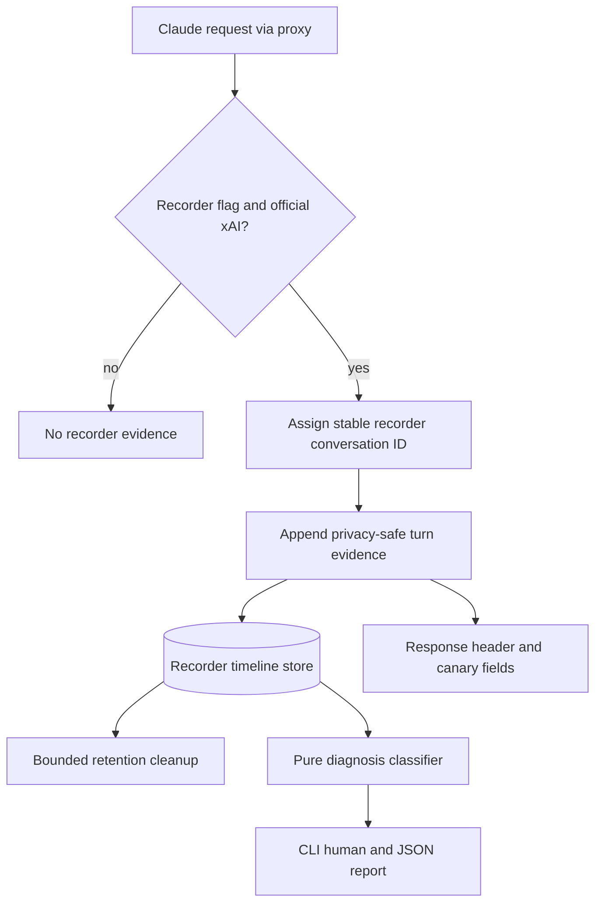

# Grok Cache Flight Recorder Core - Plan

## Goal Capsule

- **Objective:** Explain the first observable continuity break when an established official-xAI Grok cache lineage unexpectedly misses after a prior hit.
- **Product authority:** Product Contract below. Planning Contract and Implementation Units resolve how, without changing product scope.
- **Product Contract preservation:** Product Contract unchanged from ce-brainstorm; planning resolved Deferred-to-Planning questions into KTDs and units.
- **Execution profile:** test-first for diagnosis, collection integrity, retention, CLI report parity, and privacy boundaries; no real Anthropic automated traffic.
- **Stop conditions:** stop if durable evidence cannot stay privacy-safe, if collection cannot remain non-blocking on the proxy hot path, or if dual SQLite/PostgreSQL retention cannot expire timelines without inventing a second analytics product.
- **Open blockers:** None.
- **Tail ownership:** local verification through Verification Contract and Definition of Done, then draft PR when shipping.

---

## Product Contract

### Summary

Build a Grok-first Flight Recorder that gives operators a privacy-safe conversation timeline for unexpected cache misses. Each report names one defensible cause category, shows its supporting transitions, exposes evidence gaps, and returns `telemetry unknown` rather than guessing.

### Problem Frame

The shipped Grok cache-native path proves that official xAI can reuse almost all input tokens when conversation identity, account ownership, and prefix continuity align. A later miss still leaves the operator unable to tell whether identity changed, the serving account moved, the cacheable prefix changed, xAI missed despite stable observed lineage, or the required telemetry was absent.

Existing cache outcome fields prove that a hit or miss occurred, but an isolated outcome does not reconstruct the conversation conditions that preceded it. Without an ordered and internally consistent timeline, operators can mistake correlation for cause, optimize the wrong layer, or trust a diagnosis assembled from incomplete evidence.

### Key Decisions

- **Diagnose the first continuity break.** The primary scenario is a conversation that has already produced a cache hit and then unexpectedly misses. The first supported lineage break becomes the headline cause; later changes remain supporting evidence.
- **Prefer a cause category to false precision.** The recorder distinguishes identity change, serving-account change, cacheable-prefix change, stable-lineage upstream miss, and telemetry unknown. Exact prompt-component attribution is deferred.
- **Make uncertainty explicit.** Missing, contradictory, or incomplete evidence yields `telemetry unknown`. The recorder never fills gaps with a best guess.
- **Use the conversation as the investigation unit.** The first eligible turn establishes a baseline. Later turns form an ordered timeline, while hit-only timelines provide continuity proof without inventing a miss diagnosis.
- **Retain evidence, not content.** Durable records may contain privacy-safe fingerprints, transitions, counts, timings, routing outcomes, and cache telemetry. They never contain raw prompts, reasoning content, tool payloads, response bodies, or equivalent recoverable content.
- **Define shared language but ship Grok first.** Cause categories, completeness states, and timeline concepts are provider-neutral. V1 records and diagnoses only eligible official-xAI Chat traffic.
- **Keep recording independently controlled.** Operators enable the recorder separately from Grok cache-native routing. Recorder-only operation captures partial eligible evidence and marks unavailable dimensions.
- **Keep model traffic independent of observability.** Recorder persistence failures warn operators and mark evidence incomplete, but never block or alter model requests.
- **Prove diagnosis before experimentation.** Controlled cohorts, baseline comparisons, automated recommendations, and optimization policies consume this foundation later and are not part of this slice.

### Actors

- A1. Operator enabling recording, retaining bounded evidence, and diagnosing a conversation by recorder ID.
- A2. Claude Code client producing successive turns through better-ccflare.
- A3. better-ccflare recorder collecting privacy-safe events, preserving timeline integrity, and classifying outcomes.
- A4. Official xAI Chat endpoint serving Grok requests and reporting available cache usage.

### Key Flows

- F1. Establish a baseline and prove continuity
  - **Trigger:** The recorder is enabled and an eligible official-xAI conversation sends its first turn.
  - **Actors:** A2, A3, A4
  - **Steps:** Assign a stable privacy-safe recorder conversation ID; record the first eligible turn as the baseline; append later turns in deterministic order; preserve the available identity, account, prefix, timing, routing, and token evidence.
  - **Outcome:** Hits after the baseline produce continuity proof, not a miss diagnosis.
  - **Covered by:** R1-R8, R15-R18

- F2. Diagnose an unexpected miss
  - **Trigger:** A conversation with a prior proven hit receives an explicit miss outcome.
  - **Actors:** A1, A3, A4
  - **Steps:** Compare the miss turn with the established lineage; find the earliest supported continuity break; retain later changes as evidence; render the headline cause and supporting transitions.
  - **Outcome:** The operator sees one defensible cause category or `telemetry unknown`.
  - **Covered by:** R9-R14, R19-R22

- F3. Report incomplete evidence honestly
  - **Trigger:** An eligible turn, persistence operation, or provider response leaves a gap, contradiction, or unavailable diagnostic dimension.
  - **Actors:** A1, A3
  - **Steps:** Preserve the observable events; mark the gap and completeness state; avoid inferring missing evidence; expose the condition in the conversation report and recorder health.
  - **Outcome:** Model traffic continues and the report cannot present an unsupported causal story.
  - **Covered by:** R14, R20-R22, R27-R30

- F4. Diagnose with cache-native routing disabled
  - **Trigger:** The recorder is enabled while Grok cache-native routing is disabled.
  - **Actors:** A1, A2, A3, A4
  - **Steps:** Record eligible official-xAI evidence; identify native identity or ownership dimensions that are unavailable; retain cache outcomes and other observable evidence.
  - **Outcome:** The timeline remains useful but cannot claim evidence that the inactive cache-native path did not produce.
  - **Covered by:** R23-R25

- F5. Retrieve and expire a timeline
  - **Trigger:** The operator requests a retained conversation or the retention window elapses.
  - **Actors:** A1, A3
  - **Steps:** Resolve the privacy-safe recorder ID; render equivalent human-readable and structured reports while retained; remove expired evidence automatically.
  - **Outcome:** Recent evidence is diagnosable and expired evidence is unavailable.
  - **Covered by:** R1-R2, R31-R36

### Requirements

**Conversation identity and timeline integrity**

- R1. Each recorded conversation has a privacy-safe recorder conversation ID suitable for operator lookup.
- R2. The recorder conversation ID remains stable for that conversation throughout its retained lifetime.
- R3. The recorder represents eligible turns as a deterministically ordered conversation timeline.
- R4. The first eligible turn establishes the comparison baseline and receives no continuity-break diagnosis.
- R5. Each later turn records all available privacy-safe fingerprints, transitions, counts, timings, routing outcomes, and cache telemetry required by the supported cause categories.
- R6. Missing or dropped turns and events create machine-detectable explicit gaps rather than an apparently continuous timeline.
- R7. Token totals, cached-token counts, cache outcomes, and timeline transitions reconcile internally or mark the affected evidence contradictory and incomplete.
- R8. A hit-only timeline after the baseline shows the stable observations that constitute continuity proof.

**Diagnosis semantics**

- R9. An explicit miss after a prior proven hit receives exactly one headline diagnosis from the supported cause set.
- R10. `identity changed` applies when a change in observed cache identity is the first supported continuity break.
- R11. `serving account changed` applies when identity remains stable and an account change is the first supported continuity break.
- R12. `cacheable prefix changed` applies when identity and account remain stable and a prefix-fingerprint change is the first supported continuity break.
- R13. `upstream miss despite stable observed lineage` applies only when identity, serving account, and cacheable prefix remain stable and upstream telemetry supports a miss.
- R14. `telemetry unknown` applies when missing, contradictory, incomplete, or unavailable evidence prevents a stronger diagnosis.
- R15. The first supported continuity break determines the headline diagnosis.
- R16. Later relevant changes remain visible as supporting transitions without replacing the headline diagnosis.
- R17. Every non-baseline diagnosis identifies the transitions or stable observations that support it.
- R18. Diagnosis certainty never exceeds the timeline's evidence completeness.

**Privacy and evidence boundaries**

- R19. Recorded evidence uses non-reversible or privacy-safe identifiers and fingerprints.
- R20. The recorder never retains or exposes raw prompts, reasoning content, tool payloads, response bodies, or equivalent recoverable content.
- R21. Missing provider telemetry remains unavailable and is not inferred from unrelated signals.
- R22. Human-readable and structured reports expose the same diagnosis, supporting evidence, gaps, unavailable dimensions, and completeness state.

**Activation and provider scope**

- R23. Recorder activation is controlled independently from Grok cache-native activation.
- R24. With both features active, eligible official-xAI Chat turns can provide the full v1 evidence set.
- R25. With only the recorder active, eligible official-xAI Chat turns record partial evidence and mark cache-native dimensions unavailable.
- R26. V1 does not claim recording or diagnosis support for custom xAI-compatible endpoints or other providers.

**Failure behavior and recorder health**

- R27. Recorder persistence or processing failures never block, fail, reroute, or otherwise alter model traffic.
- R28. A recorder failure emits an operator-visible warning and marks affected evidence incomplete where a report can still be produced.
- R29. Recorder health reports enabled state, persistence health, retained timeline count, active expiry policy, and dropped or incomplete evidence counts.
- R30. Recorder health does not expand into cause-rate, account, model, token, or latency analytics in v1.

**Operator reports and retention**

- R31. Operators can retrieve a retained conversation by recorder conversation ID through an on-demand CLI diagnosis report.
- R32. The CLI provides concise human-readable output and equivalent structured output for automation.
- R33. Each report includes the baseline, ordered turns, headline diagnosis when applicable, supporting transitions, token and routing outcomes, explicit gaps, unavailable dimensions, and completeness state.
- R34. Recorded conversation evidence expires automatically after a bounded operator-visible retention period.
- R35. Expired conversation evidence cannot be retrieved through the report interface.
- R36. Retention cleanup and recorder health make expiry distinguishable from unexplained evidence loss.

### Acceptance Examples

- AE1. Stable hit-only conversation
  - **Covers:** R1-R8, R17-R18, R31-R33
  - **Given:** Recording and Grok cache-native routing are enabled for official xAI, and a conversation produces a baseline followed by cache hits.
  - **When:** The operator retrieves the conversation by recorder ID.
  - **Then:** The ID is stable, turns are ordered, token accounting reconciles, stable identity/account/prefix observations are shown, and no miss diagnosis is invented.

- AE2. Identity changes before an unexpected miss
  - **Covers:** R9-R10, R15-R18
  - **Given:** A conversation has a prior hit and later changes identity before an explicit miss.
  - **When:** The report diagnoses the miss.
  - **Then:** The headline cause is `identity changed`, the identity transition is cited, and later account or prefix changes remain supporting evidence only.

- AE3. Serving account changes with stable identity
  - **Covers:** R9, R11, R15-R18
  - **Given:** A conversation has a prior hit, identity remains stable, and the serving account changes before an explicit miss.
  - **When:** The report diagnoses the miss.
  - **Then:** The headline cause is `serving account changed` and the account transition is shown.

- AE4. Cacheable prefix changes with stable identity and account
  - **Covers:** R9, R12, R15-R18
  - **Given:** A conversation has a prior hit, identity and serving account remain stable, and the prefix fingerprint changes before an explicit miss.
  - **When:** The report diagnoses the miss.
  - **Then:** The headline cause is `cacheable prefix changed` and the prefix transition is shown without exposing prompt content.

- AE5. Upstream miss with stable observed lineage
  - **Covers:** R9, R13, R15-R18
  - **Given:** A conversation has a prior hit and then reports an explicit miss while identity, serving account, and prefix fingerprint remain stable.
  - **When:** The report diagnoses the miss.
  - **Then:** The headline cause is `upstream miss despite stable observed lineage` and each required stable observation is shown.

- AE6. Missing or contradictory evidence
  - **Covers:** R6-R7, R14, R17-R18, R21-R22, R28-R29, R33
  - **Given:** A conversation has a prior hit but a later turn is missing, cache telemetry is absent, or token accounting contradicts the recorded outcome.
  - **When:** The operator retrieves the report.
  - **Then:** The headline cause is `telemetry unknown`, gaps or contradictions are machine-detectable and human-visible, and the report does not claim a stronger cause.

- AE7. Multiple changes before a miss
  - **Covers:** R15-R17
  - **Given:** Identity changes first, then the account and prefix change before an explicit miss.
  - **When:** The report diagnoses the miss.
  - **Then:** `identity changed` is the headline cause and the later changes remain ordered supporting transitions.

- AE8. Recorder-only partial timeline
  - **Covers:** R18, R21-R25
  - **Given:** Recording is enabled, Grok cache-native routing is disabled, and official-xAI traffic is eligible.
  - **When:** Turns are recorded and retrieved.
  - **Then:** Available outcomes and routing evidence appear, native identity or ownership dimensions are marked unavailable, and certainty does not exceed the partial evidence.

- AE9. Persistence failure during model traffic
  - **Covers:** R27-R29
  - **Given:** An eligible request succeeds upstream while recorder persistence fails.
  - **When:** The request and later diagnostic lookup complete.
  - **Then:** Model traffic is unchanged, an operator-visible warning exists, recorder health reports incomplete or dropped evidence, and any surviving timeline is marked incomplete.

- AE10. Bounded expiry
  - **Covers:** R29, R34-R36
  - **Given:** A retained timeline is readable before its configured expiry boundary.
  - **When:** The retention period elapses and cleanup runs.
  - **Then:** The timeline is no longer retrievable, health reflects the active expiry policy, and the removal is distinguishable from an unexplained gap.

- AE11. Live official-xAI canary
  - **Covers:** R1-R8, R19-R22, R24, R31-R33
  - **Given:** The recorder and cache-native routing are enabled for a canary conversation on official xAI.
  - **When:** The conversation sends multiple turns and the operator retrieves its persisted report.
  - **Then:** The live timeline is coherent, privacy-safe, internally reconciled, and readable in both report forms; the canary need not naturally reproduce every miss category.

### Success Criteria

- Deterministic fixtures prove the baseline, hit-only continuity, all five diagnosis outcomes, precedence across multiple changes, explicit gaps, contradictory evidence, partial recording, persistence failure, and expiry.
- One live official-xAI canary proves that a real multi-turn timeline persists and renders coherently without retaining raw conversation content.
- Every non-baseline diagnosis is reproducible from the evidence shown in both human-readable and structured reports.
- Evidence-integrity failures are treated as correctness defects rather than cosmetic report defects.
- No cache hit-rate or latency improvement is required for this slice to be complete.

### Scope Boundaries

**Deferred for later**

- Controlled cohorts, baseline-versus-intervention comparisons, experiment hypotheses, observation windows, and keep/change/rollback conclusions.
- Aggregate cause rates, account/model breakdowns, cache-value analytics, and dashboard visualization.
- Exact prefix-component attribution for system prompts, tools, messages, reasoning history, images, or proxy mutations.
- Compaction- and resume-specific cache epochs or lifecycle categories.
- Official xAI Responses support and `prompt_cache_key` diagnosis.
- Codex and other provider implementations of the shared event vocabulary.
- Automated remediation, routing recommendations, optimization, or policy changes.
- Operator-enabled raw request or response capture.

**Outside this slice**

- Automated traffic against real Anthropic accounts.
- Diagnosis claims for custom or unverified xAI-compatible endpoints.
- Blocking model traffic to preserve recorder completeness.
- Treating a cold first turn as an unexpected continuity break.

### Dependencies / Assumptions

- The shipped Grok cache-native slice continues to provide privacy-safe identity, serving-account, prefix-fingerprint, and cache-outcome evidence for eligible official-xAI Chat traffic.
- Official xAI continues to report enough cached-token usage to distinguish explicit hits and misses when telemetry is present.
- Existing request accounting can supply internally reconcilable token and routing outcomes without storing conversation content.
- A bounded retention policy can remove recorder evidence independently from longer-lived aggregate request accounting.
- Shared vocabulary in v1 does not require other providers to adopt or emit the recorder contract.

### Outstanding Questions

**Deferred to Planning** — resolved in Planning Contract KTDs below.

**Deferred to Implementation**

- Exact live canary script packaging for force-routed official-xAI traffic on non-Anthropic accounts.
- Whether response-header emission needs an additional opt-out for operators who want recording without client-visible IDs.
- Exact health field names once the repository health endpoint conventions are inspected during implementation.

### Sources / Research

- `docs/ideation/2026-07-15-native-grok-cache-routing-ideation.html` ranks the Flight Recorder as the next capability after the native vertical slice and defines the causal dimensions it should distinguish.
- `docs/plans/2026-07-15-001-feat-grok-cache-native-vertical-slice-plan.md` defines the shipped identity, ownership, official-endpoint gating, and cache-outcome foundation this recorder observes.
- Existing Grok canary helpers and collection points: `packages/core/src/xai.ts`, `packages/providers/src/providers/xai/cache-native.ts`, `packages/proxy/src/usage-collector.ts`, `packages/proxy/src/proxy.ts`.
- Existing but non-reusable Anthropic raw-body diagnosis path: `packages/proxy/src/cache-diagnosis.ts`.
- Privacy-safe Codex trace analysis precedent: `packages/providers/src/providers/codex/analyze-trace.ts`.
- Retention and async write precedents: `packages/config/src/index.ts`, `packages/database/src/database-operations.ts`, `packages/database/src/async-writer.ts`, `apps/server/src/server.ts`.
- CLI command registration precedent: `packages/cli-commands/src/runner.ts`, `packages/cli-commands/src/commands/analyze.ts`.

---

## Planning Contract

### Key Technical Decisions

- **KTD1. Dedicated short-retention store, not request history or raw diagnosis snapshots.**
  - Persist privacy-safe conversation timelines and turns in dedicated recorder tables with their own retention cleanup.
  - Do not overload `requests` / `request_payloads` for diagnosis reconstruction.
  - Do not reuse `packages/proxy/src/cache-diagnosis.ts`, which captures raw request bodies for Anthropic beta replay.

- **KTD2. Pure post-hoc diagnosis engine.**
  - Collect ordered turn evidence first.
  - Classify diagnosis only when rendering a report or when a miss is finalized against retained turns.
  - Diagnosis must be a pure function of the retained timeline so fixtures can prove every cause category without live routing side effects.

- **KTD3. Independent recorder activation.**
  - Introduce a recorder-specific opt-in env flag, strict `"1"`, separate from `CCFLARE_XAI_CACHE_NATIVE`.
  - When recorder is on and cache-native is off, still record eligible official-xAI partial evidence and mark unavailable dimensions.

- **KTD4. Stable privacy-safe recorder conversation ID.**
  - The recorder conversation ID is independent of whether `x-grok-conv-id` is attached.
  - When cache-native is active, derive the lookup ID from the same conversation-partitioned identity material already used by Grok cache-native.
  - When cache-native is off, still assign a stable privacy-safe recorder ID for eligible official-xAI traffic, but mark native identity and ownership dimensions unavailable rather than inventing affinity ownership.
  - Expose the ID during eligible traffic through a response header in the existing `x-better-ccflare-*` namespace and through canary/log fields so operators can capture it without raw session metadata.

- **KTD5. Shared vocabulary, Grok-only emitter in v1.**
  - Place cause categories, completeness states, and report shapes in a provider-neutral core module.
  - Emit and accept only official-xAI Chat evidence in this slice.

- **KTD6. Retention default 72 hours, operator-visible and bounded.**
  - Default retention is 72 hours.
  - Configurable override range is 1 hour to 14 days.
  - Cleanup joins the existing startup-plus-hourly retention path used for request cleanup, but only for recorder tables.
  - Expired removal is counted separately from dropped or incomplete writes.

- **KTD7. Best-effort async writes.**
  - Enqueue recorder persistence through `AsyncDbWriter`.
  - Persistence or classification failures warn and mark incomplete or dropped evidence.
  - They never throw into the model-response path.

- **KTD8. CLI is the operator surface.**
  - Add a typed diagnosis command in `packages/cli-commands` and wire it through the shipped CLI entry in `apps/cli/src/main.ts`.
  - Because the CLI has no shared human/JSON formatter today, return a typed result object and render human text by default plus equivalent structured JSON via an explicit flag.
  - Include a minimal health subcommand or flag for recorder enabled state, retention policy, retained count, dropped count, and incomplete count.

### High-Level Technical Design

Directional guidance only:

1. Collection observes already-derived Grok identity, account, prefix fingerprint, cache outcome, and token fields.
2. The store retains ordered turns, explicit gap markers, completeness state, and unavailable dimensions.
3. The classifier walks turns after the first proven hit and returns the first supported continuity break or `telemetry unknown`.
4. The CLI never needs raw prompts or response bodies to render a trustworthy report.

### Assumptions

- Existing Grok canary fields remain available on official-xAI success paths when cache-native is enabled.
- Official-xAI eligibility can still be detected when cache-native is disabled, allowing partial recording.
- Dual SQLite and PostgreSQL migrations remain mandatory for any new tables.
- Operators can read response headers or logs to obtain the recorder conversation ID.

### Sequencing

1. Shared vocabulary and pure diagnosis first, because fixtures can lock semantics without storage or hot-path coupling.
2. Persistence and retention second, because collection and CLI depend on a durable lookup model.
3. Hot-path collection third, after the write path can fail closed into incomplete/dropped counters without blocking traffic.
4. CLI report and health fourth, over the same stored timeline model.
5. Cross-cutting fixture matrix and live canary notes last, once each seam exists.

### Risks and Mitigations

- **Hot-path cost:** keep collection to already-computed privacy-safe fields and async enqueue; never re-hash full bodies on every stream chunk.
- **False confidence:** treat incomplete, contradictory, or gap-marked timelines as `telemetry unknown` rather than best-effort guesses.
- **Privacy regression:** fixture tests assert absence of prompt text, tool payloads, reasoning content, and response bodies in stored rows and CLI output.
- **Retention confusion:** health and report errors distinguish expired, incomplete, and not-found states.
- **Migration drift:** every SQLite schema change is dual-ported to PostgreSQL migrations in the same unit.

---

## Implementation Units

### U1. Shared vocabulary and pure diagnosis classifier

- **Goal:** Define provider-neutral cause categories, completeness states, turn evidence shape, and the pure first-break diagnosis algorithm.
- **Requirements:** R4, R6-R18, R21
- **Dependencies:** None
- **Files:**
  - Create: `packages/core/src/cache-flight-recorder.ts`
  - Modify: `packages/core/src/index.ts`
  - Test: `packages/core/src/__tests__/cache-flight-recorder.test.ts`
- **Approach:**
  - Model turn evidence as privacy-safe fields only: recorder ID, turn sequence, timestamps, identity fingerprint, serving account, prefix fingerprint, cache outcome, token counts, unavailable dimensions, completeness flags, and explicit gap markers.
  - Implement pure helpers for baseline handling, continuity-proof rendering, first-break precedence, token reconciliation, and `telemetry unknown` selection.
  - Keep the module free of DB, CLI, and proxy I/O so fixtures can pin semantics independently.
- **Execution note:** Implement test-first for all five cause categories, multi-change precedence, baseline-only turns, hit-only continuity, and contradictory or gapped evidence.
- **Patterns to follow:** `packages/core/src/xai.ts` for compact privacy-safe enums and helpers; `packages/providers/src/providers/codex/analyze-trace.ts` for content-free analysis over fingerprints.
- **Test scenarios:**
  - Happy path: after a hit, an identity change before a miss yields `identity changed` with supporting transitions.
  - Happy path: stable identity and account with prefix change yields `cacheable prefix changed`.
  - Happy path: all lineage fields stable with explicit miss yields `upstream miss despite stable observed lineage`.
  - Edge: first turn never receives a continuity-break diagnosis.
  - Edge: hit-only timeline returns continuity proof, not a miss cause.
  - Edge: multiple changes before a miss keep the earliest break as headline.
  - Error: missing cache details, sequence gap, or contradictory token counts yield `telemetry unknown` and never invent a stronger cause.
- **Verification:** Focused pure-function tests cover AE1-AE7 diagnosis semantics without database or network.

### U2. Recorder persistence, dual migrations, and bounded retention

- **Goal:** Persist ordered privacy-safe timelines with stable lookup IDs, completeness metadata, and automatic expiry.
- **Requirements:** R1-R3, R6-R7, R19-R20, R27-R29, R34-R36
- **Dependencies:** U1
- **Files:**
  - Modify: `packages/database/src/migrations.ts`
  - Modify: `packages/database/src/migrations-pg.ts`
  - Create: `packages/database/src/repositories/cache-flight-recorder.repository.ts`
  - Modify: `packages/database/src/database-operations.ts`
  - Modify: `packages/config/src/index.ts`
  - Modify: `apps/server/src/server.ts` retention scheduling path
  - Test: `packages/database/src/repositories/__tests__/cache-flight-recorder.repository.test.ts`
  - Test: `packages/config/src/__tests__/cache-flight-recorder-retention.test.ts` or adjacent retention test file
- **Approach:**
  - Add dedicated recorder tables for conversation metadata and ordered turns, not request-payload storage.
  - Dual-port every schema change to SQLite and PostgreSQL.
  - Support append-turn, load-timeline-by-recorder-id, mark-incomplete, count-retained, count-dropped/incomplete, and expire-older-than operations.
  - Default retention 72 hours; config clamp 1 hour to 14 days.
  - Cleanup distinguishes expired deletions from dropped writes.
- **Execution note:** Prove retention and privacy-safe storage before wiring the hot path.
- **Patterns to follow:** existing dual migrations, `cleanupOldRequests`, and repository test style under `packages/database/src/repositories/__tests__/`.
- **Test scenarios:**
  - Happy path: append two turns under one recorder ID and reload ordered timeline.
  - Happy path: expiry removes only aged timelines and updates retained count.
  - Edge: incomplete or gap markers survive reload.
  - Edge: retention config clamps outside the allowed range.
  - Error: repository operations never require or store content fields.
  - Integration: SQLite and PostgreSQL schema paths both create the new tables or columns.
- **Verification:** Repository and retention tests pass; migrations compile for both adapters.

### U3. Hot-path collection and recorder ID emission

- **Goal:** Best-effort append privacy-safe turn evidence for eligible official-xAI traffic without blocking model responses.
- **Requirements:** R1-R2, R5, R19-R21, R23-R28
- **Dependencies:** U1, U2
- **Files:**
  - Create or modify: `packages/providers/src/providers/xai/cache-flight-recorder.ts` or extend `packages/providers/src/providers/xai/cache-native.ts`
  - Modify: `packages/proxy/src/proxy.ts`
  - Modify: `packages/proxy/src/usage-collector.ts`
  - Modify: `packages/proxy/src/response-handler.ts` and/or `packages/proxy/src/worker-messages.ts` as needed for metadata plumbing
  - Modify: `packages/types/src/api.ts` request-meta fields if required
  - Test: `packages/proxy/src/__tests__/cache-flight-recorder-collection.test.ts`
  - Test: extend `packages/proxy/src/__tests__/usage-collector-lifecycle.test.ts`
- **Approach:**
  - Gate collection on the independent recorder flag and official-xAI eligibility.
  - When cache-native is also active, record full identity, account, prefix, and cache-outcome evidence.
  - When cache-native is off, record partial eligible evidence and mark unavailable dimensions.
  - Emit a stable recorder conversation ID on eligible responses through an `x-better-ccflare-*` header and canary/log fields.
  - Enqueue persistence through `AsyncDbWriter`; catch failures into warning + incomplete/dropped counters without affecting the upstream response.
- **Execution note:** Characterization-test the current usage-collector canary path first, then extend it so recorder collection cannot regress cache-native canaries.
- **Patterns to follow:** `CCFLARE_XAI_CACHE_NATIVE` strict `"1"` gating; usage-collector finalization around the existing Grok canary block; non-blocking `asyncWriter.enqueue`.
- **Test scenarios:**
  - Happy path: recorder + cache-native on official xAI appends a full turn and exposes a stable recorder ID.
  - Happy path: successive turns reuse the same recorder ID.
  - Edge: recorder on and cache-native off records partial evidence with unavailable dimensions.
  - Edge: non-official or non-xAI traffic is not recorded.
  - Error: forced persistence failure leaves model response successful, marks incomplete/dropped, and emits a warning.
  - Integration: usage-collector completion path still emits existing Grok canary fields when cache-native is active.
- **Verification:** Focused proxy/collector tests cover F1, F3, F4, AE8, AE9 without live Anthropic traffic.

### U4. CLI report, structured parity, and recorder health

- **Goal:** Let operators retrieve a retained conversation by recorder ID and inspect minimal recorder health.
- **Requirements:** R22, R29-R36
- **Dependencies:** U1, U2, U3
- **Files:**
  - Create: `packages/cli-commands/src/commands/cache-flight-recorder.ts`
  - Modify: `packages/cli-commands/src/index.ts`
  - Modify: `apps/cli/src/main.ts`
  - Modify: `packages/cli-commands/src/commands/help.ts` and/or CLI help text in `apps/cli/src/main.ts`
  - Test: `packages/cli-commands/src/commands/__tests__/cache-flight-recorder.test.ts`
  - Optional pure report helpers: `packages/core/src/cache-flight-recorder.ts` or adjacent formatter module
- **Approach:**
  - Add a typed CLI command family for conversation report and health in `cli-commands`, then register flags or subcommands in the shipped `apps/cli` entrypoint.
  - Default output is concise human-readable text; an explicit structured mode emits the same fields as JSON.
  - Report includes baseline, ordered turns, headline diagnosis when applicable, supporting transitions, gaps, unavailable dimensions, completeness, and token/routing outcomes.
  - Health includes enabled state, retention policy, retained timeline count, dropped count, incomplete count, and persistence health.
  - Expired and not-found states are distinct from incomplete timelines.
- **Execution note:** Snapshot human and JSON outputs from the same fixture timeline to prove parity.
- **Patterns to follow:** `apps/cli/src/main.ts` flag registration; doctor-style exit codes; typed result objects rather than embedding presentation inside persistence logic.
- **Test scenarios:**
  - Happy path: lookup by recorder ID renders continuity proof for a hit-only timeline.
  - Happy path: miss timeline renders headline cause and supporting transitions in both output modes.
  - Edge: expired or missing ID returns a clear non-success without inventing data.
  - Edge: incomplete timeline is labeled incomplete and still shows available evidence.
  - Integration: health reflects enabled state, retention window, retained count, and dropped/incomplete counters.
- **Verification:** CLI unit tests cover AE1, AE6, AE10 report and health behaviors.

### U5. Fixture matrix and live official-xAI canary proof

- **Goal:** Prove the full Product Contract with deterministic fixtures and one live official-xAI multi-turn canary path.
- **Requirements:** R1-R36 success criteria and AE1-AE11
- **Dependencies:** U1-U4
- **Files:**
  - Create or extend: `packages/proxy/src/__tests__/cache-flight-recorder-matrix.test.ts`
  - Create or extend: `packages/core/src/__tests__/cache-flight-recorder.test.ts`
  - Optional docs note under existing plan or operator docs only if needed for canary steps
  - Do not touch generated inline worker files
- **Approach:**
  - Build a fixture matrix that covers baseline, hit-only continuity, all five cause categories, multi-change precedence, gaps, contradictions, partial recording, persistence failure, and expiry.
  - Add one operator-runnable live canary recipe for force-routed official Grok traffic that proves a real multi-turn timeline persists and renders.
  - The live canary must never use automated Anthropic traffic.
- **Execution note:** Keep the live canary optional in automated CI if credentials or limits are absent; fixtures remain the merge gate.
- **Patterns to follow:** existing Grok cache-native lifecycle and provider fixture style; production validation approach used for the vertical slice.
- **Test scenarios:**
  - Happy path matrix: AE1-AE5 and AE7.
  - Integrity matrix: AE6, AE8, AE9, AE10.
  - Live canary: AE11 on official xAI only.
  - Privacy: stored rows and CLI output contain no raw prompts, tool payloads, reasoning content, or response bodies.
- **Verification:** Focused matrix is green; live canary either passes against official xAI or is documented as operator-run with fixtures still satisfying the merge gate.

---

## Verification Contract

| Gate | Command / action | Applies to | Done signal |
|---|---|---|---|
| Pure diagnosis | `bun test packages/core/src/__tests__/cache-flight-recorder.test.ts` | U1, U5 | All cause categories, precedence, baseline, and unknown paths pass |
| Persistence and retention | `bun test packages/database/src/repositories/__tests__/cache-flight-recorder.repository.test.ts` and retention config tests | U2 | Append, reload, expiry, and dual-schema expectations pass |
| Collection path | `bun test packages/proxy/src/__tests__/cache-flight-recorder-collection.test.ts packages/proxy/src/__tests__/usage-collector-lifecycle.test.ts` | U3 | Full, partial, and failure-collection paths pass without blocking responses |
| CLI and health | `bun test packages/cli-commands/src/commands/__tests__/cache-flight-recorder.test.ts` | U4 | Human/JSON parity, lookup, and health pass |
| Full matrix | `bun test packages/proxy/src/__tests__/cache-flight-recorder-matrix.test.ts packages/core/src/__tests__/cache-flight-recorder.test.ts` | U5 | AE1-AE10 fixtures pass |
| Repo quality | `bun run lint && bun run typecheck && bun run format` | all units | Clean |
| Live canary | Force-route multi-turn official Grok conversation with recorder enabled, then CLI lookup | U5 / AE11 | Persisted privacy-safe timeline renders; no Anthropic automation |

---

## Definition of Done

- All Product Contract requirements R1-R36 are covered by one or more implementation units and tests.
- Deterministic fixtures prove baseline handling, hit-only continuity, all five diagnoses, multi-change precedence, gaps, contradictions, partial recording, persistence failure, and expiry.
- Human-readable and structured CLI reports expose the same diagnosis and evidence fields.
- Recorder failures never alter model traffic.
- Dual SQLite and PostgreSQL migrations exist for any new schema.
- No raw prompts, reasoning content, tool payloads, or response bodies are retained or printed.
- Live official-xAI canary either passes or is explicitly operator-run while fixtures remain green.
- `bun run lint && bun run typecheck && bun run format` is clean.
- Abandoned experimental code from implementation attempts is removed before ship.
