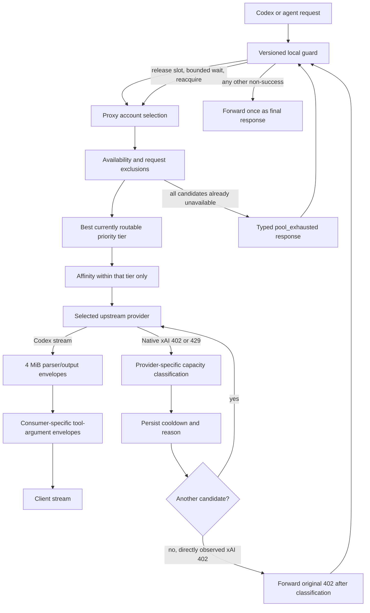

# Routing Reliability Recovery - Plan

## Goal Capsule

- **Objective:** Restore reliable long-running Codex chats by accepting legitimate bounded SSE frames, converting native xAI capacity failures into ordinary account failover, making configured priority stronger than affinity, and replacing the unversioned production guard with a bounded, deploy-owned retry layer.
- **Product authority:** The Product Contract below, synthesized from the 2026-07-16 production incident, current `origin/main`, and the user's decision to include guard hardening.
- **Execution profile:** Test-first, four focused forward-fix PRs with independent rollback boundaries; no wholesale revert of PR #42 or the upstream xAI/session-affinity work.
- **Safety boundary:** Never automate traffic against Anthropic or the configured Codex account. Use fixtures, fake upstreams, and explicitly force-routed non-Anthropic accounts; reserve a real Codex chat for operator-driven post-deploy dogfooding.
- **Stop conditions:** Stop a unit if its change weakens an unrelated resource bound, makes generic OpenAI-compatible status handling provider-specific, lets affinity cross a priority tier, or cannot be deployed and identified from `refs/heads/main`.
- **Open blockers:** No design blocker. WSL exec and the deployed `2c5a3fbd` service recovered during planning; Windows loopback currently depends on temporary SSH forwarding after the native WSL relay wedged. Re-verify WSL exec, direct 8789, guarded 8788, the deployed SHA, and the forwarding path before each deploy, and preserve active agents rather than terminating the distro as a shortcut.

## Product Contract

### Summary

Ship four narrow reliability corrections:

1. Separate SSE transport-envelope limits from semantic accumulation limits so a valid 110,079-byte Codex lifecycle frame succeeds without weakening tool-argument protection.
2. Treat native xAI 402/429 responses as provider-specific capacity signals that bench that account and fail over before client-visible bytes.
3. Enforce numeric priority as the outer routing invariant; affinity may choose only within the best currently routable tier.
4. Put the production guard under source/deploy control and let it wait only on the proxy's explicit pool-exhausted contract, with bounded attempts, time, and concurrency occupancy.

### Problem Frame

The incident was observed on deployed SHA `f5b92292`. During planning, PR #48 advanced `origin/main` and the systemd pin to `2c5a3fbd`; this planning branch was fast-forwarded and the overlapping `proxy-operations.ts` changes were re-inspected before finalizing the work units. The original incident exposed four interacting failures:

- **PR #42 regression:** A valid 110,079-byte Codex SSE frame exceeded a 64 KiB transport cap. That cap is also reused for Codex tool arguments and OpenAI Responses adapter text/tool accumulation, so simply raising it would silently weaken unrelated protections.
- **Upstream PR #281 integration gap:** Native xAI inherits the generic OpenAI-compatible rule that never marks an account rate-limited. Its exhausted 402 response therefore reached the client instead of causing same-request failover.
- **Upstream PR #285 integration gap:** `SessionAffinityStrategy` honors a healthy sticky mapping before reconsidering priority. The newer xAI cache-affinity layer can also reorder candidates without preserving account or combo-slot priority.
- **Local guard amplification (not a merged PR):** The host-local guard retries broad 5xx/429/529 classes for as long as 30 minutes while retaining an active slot. It retried a deterministic failure 12 times over roughly five minutes and logged a terminal 402 as `proxy_success`.

The valuable behavior from the causal PRs remains: bounded linear SSE buffering, CRLF handling, body cancellation on failover, restore-preserving affinity, cache-native xAI ownership, and the existing cooldown/probe machinery.

Recovery note at handoff: the root `ccflare-stack.service` process never restarted and continued serving `2c5a3fbd`. The outage was a wedged native WSL relay; exact Windows loopback access was restored through temporary SSH forwarding, after which `/health` reported `status: ok` and WSL could start new processes again. PR #48 changes the Claude request path rather than startup or health routing, so do not infer causality or revert it from that symptom. Treat native relay maintenance as separate host work, record the active forwarding path before deployment, and do not terminate the distro while active agents need preservation.

### Adjacent OAuth control-plane gap (separate hotfix)

After the routing incident, two Anthropic accounts repeatedly appeared to disable themselves. Anthropic had rejected both stored refresh tokens with `400 invalid_grant: Refresh token expired`. PR #41, included in PR #47, correctly converted that terminal credential failure into `paused=1` with `pause_reason=oauth_invalid_grant`; it did not invalidate the tokens. The misleading loop came from incomplete control-plane wiring:

- Generic Resume clears `paused` and `pause_reason` without replacing or validating credentials.
- The roughly 90-second Anthropic usage poll then reaches the token-refresh chokepoint, observes the same `invalid_grant`, and pauses the account again.
- `/api/accounts` reads `pause_reason` for strategy prediction but omits it from `AccountResponse`, so the dashboard can show only generic `Paused` and a Resume action instead of `Re-authentication required`.
- Successful reauthentication already replaces tokens and conditionally clears `oauth_invalid_grant`; both affected accounts completed that recovery during the incident and the live pool returned to two routable accounts.

Keep the terminal-auth pause behavior. Implement its missing API/UI invariant as a small focused hotfix outside the four routing PRs: expose a safe typed `pauseReason`, reject generic Resume for `oauth_invalid_grant` with a typed reauthentication-required response, make reauthentication the primary dashboard action, and await any temporary paused-state restoration in usage polling so a generic/manual reason cannot race with the terminal reason. Test manual-pause resume, terminal-pause refusal, successful reauth auto-resume, dashboard copy/action selection, and the polling restoration race. This adjacent hotfix does not change the routing requirements or their rollout order.

### Actors

- **A1. Operator:** Configures accounts, priorities, the load-balancing strategy, guard limits, and production deployment.
- **A2. Codex/agent client:** Runs long conversations with large instruction/tool registries and expects one coherent terminal outcome.
- **A3. Proxy/router:** Filters account availability, orders candidates, performs provider transforms, and fails over before writing client bytes.
- **A4. Native xAI upstream:** Returns successful responses, 429 rate limits, or provider-specific 402 capacity failures.
- **A5. Local guard:** Admits concurrent requests and may wait/replay only when the proxy explicitly reports that the whole pool is unavailable.

### Key Flows

- **F1. Rich Codex stream succeeds**
  - **Trigger:** A Codex lifecycle event carries a large but bounded request/context echo.
  - **Flow:** The guard admits the request; priority and affinity select an account; the Codex translator accepts the complete frame; downstream receives normal terminal events.
  - **Terminal states:** Completed response, client cancellation, or one typed stream-limit error if a true bound is crossed.
  - **Covered by:** R1-R4.

- **F2. Native xAI capacity failure fails over**
  - **Trigger:** An ordinarily routed native xAI account returns 402 or 429 before client-visible bytes.
  - **Flow:** `XaiProvider` classifies the response; the response processor enriches any reset evidence, persists cooldown state, releases the failed body, and continues to the next selected account.
  - **Terminal states:** A later account succeeds; a directly observed 402/429 from the final attempted xAI candidate is classified on a clone and forwarded intact; a later request that finds every account already unavailable receives the existing pool-exhausted response.
  - **Covered by:** R5-R10.

- **F3. Explicit force-route remains explicit**
  - **Trigger:** An operator deliberately force-routes to one xAI account for diagnosis.
  - **Flow:** That account is the only candidate. A 402/429 updates its state but does not silently substitute a different account.
  - **Terminal states:** The first directly observed capacity response is forwarded intact after classification; a later request that finds the forced account already cooled receives the existing force-route-unavailable response. Neither path selects another account.
  - **Covered by:** R9-R10.

- **F4. Better priority tier recovers**
  - **Trigger:** A session is temporarily using priority 50 while a priority 10 account is unavailable; priority 10 becomes routable again.
  - **Flow:** The router selects from priority 10, replaces the lower-tier session mapping, and leaves lower tiers as ordered fallbacks.
  - **Terminal state:** This and subsequent requests use priority 10 while it remains routable.
  - **Covered by:** R11-R15.

- **F5. Preferred owner is temporarily unavailable**
  - **Trigger:** The mapped account in the best configured tier enters cooldown.
  - **Flow:** The router temporarily uses the best currently routable lower tier without destroying the better-tier mapping; recovery permits snapback.
  - **Terminal state:** Temporary fallback or restored preferred owner, never a priority inversion.
  - **Covered by:** R12-R15.

- **F6. Guard receives explicit pool exhaustion**
  - **Trigger:** The proxy returns its typed pool-exhausted status before any upstream accepts the request.
  - **Flow:** The guard consumes/cancels the error body, releases only its active-upstream lease, retains bounded pending/body reservations, waits within the absolute attempt/deadline budget, fairly reacquires an active lease, and retries.
  - **Terminal states:** A successful proxy response, attempt/deadline/pending/body-budget exhaustion, or client abort with exact lease/reservation cleanup.
  - **Covered by:** R16-R20.

- **F7. Guard receives any other error**
  - **Trigger:** The proxy returns 402, 429, 529, a generic 5xx, a governor rejection, or a deterministic typed error.
  - **Flow:** The guard forwards it once and records a final-response/error event; provider/account retry remains owned by the proxy.
  - **Terminal state:** Immediate response propagation with no guard amplification.
  - **Covered by:** R16-R19.

### Requirements

**SSE transport and accumulation**

- **R1.** Complete SSE transport frames up to 4 MiB are accepted; the exact observed 110,079-byte LF and CRLF cases must succeed, including delimiters split across chunks.
- **R2.** Unterminated SSE tails remain independently capped at 4 MiB and retain the current fragment-based linear accumulation behavior.
- **R3.** Tool-call arguments remain capped at 64 KiB per call in both translators. Codex retains its existing 64 KiB aggregate tool-argument cap. The OpenAI Responses adapter does not gain that stricter cap: all of its buffered translated output is instead bounded by one 4 MiB per-stream aggregate envelope, so several individually valid tool calls may exceed 64 KiB in total while the combined output remains bounded.
- **R4.** A true frame, tail, translated-output, or tool bound violation cancels upstream work and emits exactly one typed terminal failure; no response-completed event or account replay may follow client-visible stream bytes.

**Native xAI availability**

- **R5.** `XaiProvider` classifies native xAI 402 and 429 as failover-worthy capacity responses; other status codes retain existing behavior.
- **R6.** Generic `OpenAICompatibleProvider` behavior is unchanged, including its deliberate inline treatment of generic 402/429 responses.
- **R7.** The rate-limit result can carry a provider-supplied typed operational reason. Native xAI 402 uses a neutral xAI-capacity reason rather than being mislabeled as an upstream 429.
- **R8.** A future cached xAI credit reset may enrich a direct 402 cooldown; missing, invalid, past, or stale reset evidence falls back to the existing bounded no-reset probe cooldown.
- **R9.** On ordinary routing, a classified xAI response is discarded/cancelled before client bytes and the same request continues to the next candidate. If a directly observed 402/429 belongs to the final attempted candidate, classification runs on a clone and the original response is forwarded intact; a later request that finds all candidates already cooled receives the existing typed pool-exhausted response. Direct capacity evidence must become visible to selection before the request completes so an immediate retry cannot re-enter xAI through an async persistence window.
- **R10.** Force-route remains single-account and fail-closed. A cooldown expiry admits a bounded recovery probe, and only a later successful upstream response clears the relevant cooldown/reason through existing success/probe behavior; a non-rate-limited error response is not recovery.

**Priority and affinity**

- **R11.** Lower numeric priority is the outer ordering invariant after availability, request exclusions, auto-unpause, and combo eligibility are applied.
- **R12.** Session affinity may reorder accounts only inside the best currently routable priority tier. Same-tier affinity remains sticky, and lower tiers remain in the candidate list as priority-ordered reactive fallbacks rather than being truncated.
- **R13.** When a better tier becomes routable, a lower-tier mapping is immediately preempted and replaced. When a better-tier owner is temporarily unavailable, lower-tier service does not overwrite that owner, preserving legal snapback.
- **R14.** xAI conversation cache ownership has one authoritative owner store. The post-selection cache-affinity orderer cannot leapfrog account-priority tiers or combo-slot-priority tiers.
- **R15.** Combo account/model associations, least-used same-tier spreading, TTL expiry, auto-unpause behavior, and the 10,000-entry affinity bound remain intact.

**Guard ownership and retry policy**

- **R16.** The guard, pure retry policy, and stack lifecycle runner are versioned in the repository, installed with a digest manifest as one content-addressed artifact, and pinned alongside the binary by the main-only deployment path.
- **R17.** The guard consumes the proxy's existing stable `x-better-ccflare-pool-status: exhausted` header and retains bounded structured-body detection only as a rolling-upgrade fallback; the incident does not add a second pool-exhaustion protocol.
- **R18.** The guard retries only explicit pool exhaustion. Generic 5xx, 402, 429, 529, governor rejections, and deterministic typed errors are final at the guard layer.
- **R19.** Pool waiting is bounded by three total attempts and one absolute 120-second retry-decision deadline covering request admission/body read through pre-success response classification. The guard never sleeps past it, aborts pre-header work when it expires, and never starts a post-deadline fetch; a successful response stream is not cut off by that retry deadline.
- **R20.** Backoff does not occupy an active-upstream lease but does retain bounded pending/body reservations. The deployed defaults are 12 active, 36 pending, 24 queued, 4 MiB per body, 64 MiB aggregate buffered bodies, and 64 KiB legacy error-body inspection. Client abort and queue handoff release/transfer every lease, reservation, byte, timer, and listener exactly once.
- **R21.** Guard health and structured logs expose manifest-backed guard/runner identity, artifact path/digests, process start identity, upstream target, effective limits, lifecycle counts/high-water marks, attempts, final status, stop cause, and budget/cancellation counters. Only successful HTTP responses are logged as success.

### Acceptance Examples

- **AE1. Exact incident frame**
  - **Given:** A valid `response.created` SSE event whose encoded frame is exactly 110,079 bytes, followed by normal terminal events.
  - **When:** It is split across arbitrary LF or CRLF chunk boundaries.
  - **Then:** Translation completes, no limit error is emitted, and the upstream reader is not cancelled early.

- **AE2. Independent resource limits**
  - **Given:** A frame larger than 64 KiB but smaller than 4 MiB, one tool call of 64 KiB plus one byte, several valid Responses tool calls totaling more than 64 KiB, and translated output larger than 64 KiB but smaller than 4 MiB.
  - **When:** Each is processed independently.
  - **Then:** The frame, multi-tool Responses case, and translated output succeed; the oversized individual tool call fails once; Codex still rejects aggregate tool arguments over 64 KiB; a frame/tail/translated-output accumulator above its own 4 MiB bound fails with the matching limit kind.

- **AE3. xAI 402 ordinary failover**
  - **Given:** Candidate one is native xAI and returns 402; candidate two returns 200.
  - **When:** The request is ordinarily routed.
  - **Then:** Candidate one's body is released, its xAI-capacity cooldown/reason is persisted, candidate two serves the request, and the client never sees the 402.

- **AE4. xAI compatibility boundaries**
  - **Given:** Native xAI returns 429, generic OpenAI-compatible returns 402/429, and a force-routed native xAI account returns 402.
  - **When:** Each path executes.
  - **Then:** Native xAI 429 enters failover; generic responses retain existing inline semantics; a direct forced response is preserved and a later already-cooled forced request returns the existing unavailable marker without switching accounts.

- **AE4a. Final observed xAI capacity response**
  - **Given:** Native xAI is the final attempted candidate and returns 402 or 429 before client bytes.
  - **When:** The proxy classifies and persists its cooldown.
  - **Then:** Classification consumes only a clone, the original response status, headers, and post-provider body reach the client intact, and the guard forwards it once; a subsequent request skips the cooled account and may receive `pool_exhausted`.

- **AE5. Priority recovery**
  - **Given:** A session mapped to priority 50 because all priority 10 candidates were unavailable.
  - **When:** A priority 10 candidate recovers or auto-unpauses.
  - **Then:** The current request selects priority 10, the mapping is replaced, and subsequent requests remain in priority 10 while it is routable.

- **AE6. Legal snapback and same-tier stickiness**
  - **Given:** A mapped priority 10 owner becomes unavailable while priority 50 is available, plus another scenario with two healthy priority 10 accounts.
  - **When:** Requests arrive during and after the outage.
  - **Then:** Priority 50 is temporary and does not overwrite the priority 10 mapping; the recovered owner can snap back; the same-tier mapping remains sticky.

- **AE7. Cache/combo priority**
  - **Given:** An xAI cache owner exists in a worse account tier or combo-slot tier than another currently routable xAI candidate.
  - **When:** Cache affinity is applied.
  - **Then:** The better tier remains first, ownership upgrades within that tier, and every model override stays paired with its original combo slot.

- **AE8. Guard amplification stops**
  - **Given:** A fake upstream returns 402, generic 502, 429, 529, governor rejection, deterministic `sse_limit_exceeded`, or typed pool exhaustion.
  - **When:** Each response reaches the guard.
  - **Then:** Only pool exhaustion is retried; it stops at attempt/deadline limits; active/pending/body invariants hold through backoff and abort races; every other response is forwarded once and logged as final/error.

- **AE9. Deploy identity**
  - **Given:** The four PRs have landed on `refs/heads/main` and the tree is clean.
  - **When:** The production deploy path installs and restarts the stack.
  - **Then:** `/health` reports the deployed binary SHA prefix, `/_guard/health` reports the exact manifest commit/file digests, runner identity, artifact path, upstream target, and effective budgets, and every identity points to content produced from main.

### Success Criteria

- A real operator-driven Codex chat with a rich tool registry completes without the observed SSE limit failure.
- A fixture-backed xAI 402 transparently reaches a later account, while a forced xAI request and generic OpenAI-compatible response remain explicit.
- Account and combo routing never return a lower-priority candidate ahead of a routable higher-priority tier because of affinity.
- A deterministic proxy 502 is no longer replayed by the guard; pool-exhausted waiting is bounded, does not consume an active lease while asleep, and cannot create an unbounded pending/body population.
- The deployed guard and lifecycle runner are digest-bound to the same landed SHA discipline as the binary.

### Scope Boundaries

**In scope**

- Codex and OpenAI Responses SSE frame/accumulation policy separation.
- Native xAI 402/429 provider classification, cooldown attribution, failover, recovery probe, API/dashboard reason display.
- Session and xAI cache affinity priority enforcement, including combo-slot priority.
- Repo-owned guard/policy/runner source, consumption of the explicit pool-exhausted response contract, bounded/fair retry, deployment pinning, health, and logs.
- Four focused PRs and sequential main-only deployment verification.

**Deferred**

- Full WHATWG SSE parser conformance for lone-CR line endings and multi-line `data:` concatenation; the incident path uses the already-supported LF/CRLF shape.
- Treating a polled xAI 100% snapshot as a hard routing exclusion. The current reverse-engineered usage shape cannot prove whether extra credits remain available.
- General consolidation of every strategy's affinity implementation beyond the duplicated xAI conversation-owner path.
- A general cross-provider retry-class protocol beyond the explicit local pool-exhausted header.

**Out of scope**

- Wholesale reverts of PR #42, upstream xAI usage work, or upstream session-affinity work.
- Global reinterpretation of HTTP 402 or generic OpenAI-compatible provider behavior.
- Replaying a stream after any bytes have reached the client.
- Database schema changes or migrations.
- Automated Anthropic/Codex traffic.

### Dependencies and Assumptions

- `SseFrameBuffer` remains the shared bounded frame primitive for Codex and the OpenAI Responses adapter.
- Four MiB is a deliberate bounded operational envelope with substantial headroom over the 110,079-byte incident frame; the similarly sized analytics/request-copy limits are not treated as proof that every accepted lifecycle event fits.
- `processProxyResponse` still runs before client bytes and the account loop still releases discarded responses before trying the next account.
- `isAccountAvailable` treats persisted `rate_limited_until` as unavailable, so the established cooldown store is the durable routing seam.
- Combo slots remain ordered by their own numeric `priority`, independently of `Account.priority`.
- The legacy systemd runner's `GUARD_SCRIPT` support provides first-rollout rollback compatibility, but the target state replaces and pins the guard, policy, and versioned runner together so lifecycle behavior is identifiable and atomic.

### Outstanding Questions

None block implementation. The deferred items above require separate product/architecture decisions if pursued.

### Sources and Research

- `packages/core/src/constants.ts` and `packages/core/src/sse-frame-buffer.ts` — current coupled limits and bounded fragment algorithm.
- `packages/providers/src/providers/codex/provider.ts` and `packages/providers/src/providers/codex/provider.test.ts` — Codex frame translation, tool buffering, terminal errors, and cancellation.
- `packages/openai-responses-adapter/src/stream-translator.ts` and its tests — second consumer of the coupled frame/text/tool cap.
- `packages/providers/src/providers/xai/provider.ts`, `packages/providers/src/providers/openai/provider.ts`, and `packages/providers/src/usage-fetcher.ts` — native xAI behavior, generic compatibility boundary, and cached reset data.
- `packages/proxy/src/handlers/response-processor.ts`, `packages/proxy/src/handlers/rate-limit-cooldown.ts`, and `packages/proxy/src/handlers/proxy-operations.ts` — pre-byte failover, durable cooldown, response release, and pool-exhausted response.
- `packages/load-balancer/src/strategies/session-affinity.ts`, `packages/proxy/src/cache-affinity-orderer.ts`, and `packages/proxy/src/handlers/account-selector.ts` — the two affinity stores and normal/combo priority seams.
- `docs/plans/2026-07-15-001-feat-grok-cache-native-vertical-slice-plan.md` — cache-native ownership contract that this fix must preserve.
- `scripts/deploy-ccflare.sh` — main-only binary deployment, pin backup, runtime SHA verification, and pruning patterns to extend to the guard.
- WHATWG HTML, Server-sent events: <https://html.spec.whatwg.org/multipage/server-sent-events.html> — SSE has no protocol-level field/event length maximum and supports multiple line-ending shapes; the 4 MiB cap is an internal resource policy.
- RFC 9110: <https://www.rfc-editor.org/rfc/rfc9110.html> — HTTP 402 is reserved without generic semantics, supporting provider-specific rather than global classification.
- xAI Grok FAQ: <https://docs.x.ai/grok/faq> — weekly usage pools can pause paid features, while extra credits can extend use beyond the included pool.
- xAI debugging guide: <https://docs.x.ai/developers/debugging> — official API guidance uses HTTP 429 for rate limiting.

---

## Planning Contract

### High-Level Technical Design

The priority tier is selected only after availability and request-specific exclusions. Session affinity and xAI cache ownership may change ordering inside that tier but cannot substitute a worse tier. Provider response classification occurs before client bytes, where the existing account loop can safely discard and fail over. The guard recognizes only a proxy-owned pool-exhausted contract; it does not duplicate provider semantics.

### Key Technical Decisions

- **KTD1. Use a 4 MiB complete-frame ceiling and a separate 4 MiB unterminated-tail ceiling.** This is a deliberate bounded operational envelope with roughly 38x headroom over the 110,079-byte incident frame, not an inference from the separate 4 MiB analytics/request-copy caps. Unlimited frames and a one-off incident-sized exception are rejected.
- **KTD2. Separate parser errors from transformer resource errors.** `SseLimitError` remains the parser-specific compatibility surface for complete-frame and unterminated-tail failures. A shared `StreamResourceLimitError` base carries exact discriminants, limit bytes, and actual bytes for `sse_frame`, `sse_tail`, `translated_output_total`, `tool_arguments_per_call`, and `tool_arguments_total`; translators can catch the base without teaching the parser about semantic accumulation.
- **KTD3. Preserve amortized-linear frame extraction, not a particular fragment representation.** Retain LF/CRLF behavior and the carry-based no-rescan invariant. If tiny-chunk profiling shows unbounded fragment-object overhead, bounded fragment coalescing is allowed. Full lone-CR and multi-`data:` conformance remains a separate follow-up.
- **KTD4. Classify capacity at the xAI provider boundary.** `XaiProvider` handles 402 and official 429; selecting provider `xai` opts an account (including a configured custom endpoint) into those semantics, while differently behaved compatible endpoints must use `openai-compatible`. `OpenAICompatibleProvider` remains deliberately generic. A provider-supplied reason flows through the existing response processor/cooldown seam instead of adding a second availability system.
- **KTD5. Name 402 operationally, not as generic payment semantics.** Use a reason such as `xai_capacity_402` because RFC 9110 does not define a universal meaning. Dashboard copy can explain observed credits/entitlement exhaustion without teaching the whole proxy that every 402 is retryable.
- **KTD6. Direct response evidence outranks polled utilization.** A native xAI 402/429 immediately changes availability. A valid direct `Retry-After`/reset from that response outranks a fresh future cached `credits.resets_at`, which outranks the bounded no-reset probe cooldown. A bare 100% snapshot remains advisory because extra credits may still permit requests. Concurrent already-started 402s may each fail over, but in-memory and durable cooldown writes must converge without shortening the latest active deadline.
- **KTD7. Priority is an outer invariant, not another affinity score.** Determine the minimum currently routable numeric tier first. Sticky owners may lead only inside that tier. A mapping to a worse tier is replaced when a better tier recovers; a mapping to a better but temporarily unavailable tier is preserved for legal snapback.
- **KTD8. Make `CacheAffinityOrderer` the sole xAI conversation-owner store.** Remove the duplicate cache-key ownership branch from `SessionAffinityStrategy`. Store only stable owner identity—account ID for normal routing and combo-slot ID for combo routing—and refresh its current tier from a request-local catalog on every selection; a stored tier is never authoritative after runtime edits.
- **KTD9. Retry only the existing explicit proxy pool contract at the guard.** Consume `x-better-ccflare-pool-status: exhausted`; accept at most 64 KiB of the structured body as a rolling-upgrade fallback. Raw 402/429/529/5xx responses are final because provider/account failover belongs inside the proxy and arbitrary replay can amplify deterministic errors.
- **KTD10. Separate pending reservations from active-upstream leases.** A request reserves pending capacity before body read and retains it through `reading + queued + active + backingOff + reacquiring`; it holds a revocable active lease only while fetching/streaming. The deployed profile preserves `maxActive=12`, sets `maxPending=36`, caps each request body at 4 MiB and aggregate buffered bodies at 64 MiB, and requires exact permit/byte conservation. With three attempts, one saturated admitted cohort can create at most 108 upstream attempts; that explicit ceiling is accepted instead of an unsafe unkeyed global gate whose pools may differ by route/model/combo/force-route.
- **KTD11. Use one absolute retry-decision deadline.** The 120-second deadline starts at request acceptance and covers pending admission, body read, queueing, pre-header fetch, pool-error classification, backoff, and reacquisition. It aborts a fetch that has not produced headers by the deadline. Once a successful response begins streaming, the retry deadline is disarmed and normal client/shutdown cancellation owns the stream.
- **KTD12. Deploy the complete lifecycle from one authority.** Source-control the guard policy, guard entrypoint, and stack runner. Install them with a manifest containing the full source commit and file digests, make the systemd pin execute the versioned runner, verify binary/guard/runner/config/process identity, and retain the previous complete artifact set for rollback.
- **KTD13. Land focused forward fixes.** Use four PRs: guard containment/deployment, SSE limits, native xAI availability, and priority-aware affinity. Each must be independently revertible and deployed from main before moving to the next behavioral slice.

The stream policy is intentionally consumer-specific:

| Resource | Codex translator | OpenAI Responses adapter |
|---|---:|---:|
| Complete SSE frame | 4 MiB | 4 MiB |
| Unterminated SSE tail | 4 MiB | 4 MiB |
| Buffered translated output | not accumulated by this path | 4 MiB total across text and tool arguments |
| Tool arguments per call | 64 KiB | 64 KiB |
| Tool arguments across calls | 64 KiB, preserving current behavior | no new 64 KiB aggregate; included in the 4 MiB output total |

### Assumptions

- Four MiB is a policy ceiling, not expected steady-state allocation. A quantitative concurrency/chunking profile must pass before rollout; the implementation may coalesce fragments if the current representation fails the retained-memory gate.
- A force-routed request intentionally names one account and therefore must not inherit ordinary next-account failover.
- A 402 from native xAI is safe to treat as temporary operational unavailability, but not safe to assign universal HTTP semantics or an unbounded cooldown.
- The current response-body cancellation work on `origin/main` remains the standard failover cleanup path.
- The current host-local runner is deployment-critical and its five-second child stop loop defeats the configured guard drain grace; it must be versioned and pinned with the guard rather than treated as trusted static infrastructure.

### Sequencing and PR Boundaries

1. **Guard containment and ownership (U6-U7):** Stop replay amplification first, establish the explicit pool contract, and make the deployed guard traceable.
2. **SSE resource separation (U1-U2):** Remove the immediate rich-context chat killer while retaining every independent resource bound.
3. **Native xAI availability (U3):** Convert 402/429 into durable account state and transparent ordinary failover.
4. **Priority-aware affinity (U4-U5):** Enforce the scheduling invariant across session, cache-native, and combo routes.

Do not bundle these into one PR. They have distinct rollback signals and can be reviewed/deployed independently. Before each review, compare the branch merge base with current `origin/main` because all four touch high-churn request-path code.

### System-Wide Impact

- **Interfaces:** `RateLimitInfo` gains an optional typed operational reason; the guard consumes the already-present pool-exhausted header; the cache orderer accepts routable candidates plus a request-local owner catalog rather than inferring every route from `Account.priority`.
- **State lifecycle:** Direct xAI evidence writes the existing cooldown fields and reason. Expiry admits the existing guarded probe; success clears cooldown. No new table/column is required, so SQLite/PostgreSQL migrations are not involved.
- **Failure propagation:** A middle-candidate pre-byte xAI failure stays inside the account loop; a final directly observed xAI 402/429 is classified on a clone and forwarded intact. Midstream stream-limit failures terminate once and never fail over. Guard retry is restricted to a response proving no upstream accepted the request.
- **Caching:** Session affinity remains responsible for client-session locality. `CacheAffinityOrderer` alone owns xAI conversation locality after base selection. Both are subordinate to the active priority tier.
- **Combo routing:** Candidate records must keep account, slot priority, and model override together through filtering and affinity ordering; parallel arrays or account-id-only maps are insufficient.
- **Memory/performance:** The frame/output ceiling rises to 4 MiB, while parser tail, consumer-specific tool limits, pending bodies, affinity maps, attempts, and deadlines remain explicit. Profiling must show linear concurrency/byte scaling and stable post-GC retained heap under repeated tiny-chunk and near-limit waves.
- **Operations:** Production gains manifest-backed guard and runner identity at `/_guard/health`. The deploy transaction stages and verifies an immutable artifact directory, atomically replaces the managed pin, verifies the new process pair, and cannot prune until commit.
- **Dashboard/API:** The new xAI reason must survive the accounts API allowlist and receive provider-aware error/recovery copy. Unknown historical strings must remain safely handled.
- **Security/privacy:** Logs expose limit kind, sizes, status, account identifier, request/upstream IDs, and stop cause, never prompt/tool bodies, raw tokens, or xAI response bodies.
- **Agent behavior:** Long agent loops receive either a coherent completion or one prompt terminal failure. No new agent tool/API surface is needed.

### Risks and Mitigations

- **Higher per-stream memory:** A 4 MiB frame may temporarily allocate decoded/encoded copies. Mitigate with explicit concurrency observation, aggregate semantic bounds, retained linear buffering, and a max-plus-one rejection test.
- **Incorrect 402 semantics:** xAI may use 402 for more than included-credit depletion. Mitigate with native-provider-only classification, neutral audit naming, bounded cooldown, and no global 402 behavior.
- **Stale usage reset:** Cached reset data may be old. Mitigate by accepting only finite future values from the existing freshness-bounded cache and falling back to probe cooldown.
- **Affinity oscillation:** Repeated recovery/failure can churn mappings. Mitigate by replacing only when a strictly better tier is routable and preserving better-tier mappings during temporary fallback.
- **Combo model mismatch:** Reordering accounts separately from slots can send the wrong model. Mitigate by ordering candidate records atomically and asserting account/model pair preservation.
- **Guard starvation or double-release:** Releasing during backoff changes admission lifecycle. Mitigate with fake-clock integration tests for acquire/release/reacquire, queue fairness, abort at every state, and active-count invariants.
- **Guard sleeper/body amplification:** Releasing an active lease must not release the request's pending/body reservations. Mitigate with `pending <= maxPending`, `bufferedBodyBytes <= maxBufferedBodyBytes`, a 4 MiB per-body cap, exact lifecycle counters, and saturation tests.
- **Deploy partial failure:** Binary and guard pins could diverge. Mitigate with one backed-up pin transaction, post-restart dual-SHA verification, and automatic restoration on failed verification.
- **Formatting churn:** Repository-wide lint/format may touch unrelated files. Record the pre-run status, inspect the final diff, and stage only the plan unit's explicit files; never include protected generated files.

### Resolved During Planning

- **Cap size:** 4 MiB, not 1 MiB or unlimited, as a bounded operational policy with substantial incident headroom; similarly sized analytics/request-copy caps are not the justification.
- **xAI 100% behavior:** Advisory until direct failure; do not preemptively bench accounts that may have extra credits.
- **402 reason:** Provider-specific neutral capacity reason; do not label it as a generic 429 or universal payment failure.
- **Affinity authority:** Session affinity handles session mapping; the post-selection cache orderer exclusively handles xAI conversation mapping.
- **Guard policy:** Retry typed pool exhaustion only; pass all other statuses through once; bound both active work and the larger pending/body population.
- **Guard amplification ceiling:** Preserve 12 active upstream leases, admit at most 36 pending requests/64 MiB of buffered bodies, and allow three attempts per request (108 attempts for one saturated cohort). Do not add a global single-flight key in this incident.
- **Lifecycle ownership:** Version and pin the stack runner with the guard because shutdown ordering and effective retry configuration are part of correctness.
- **Delivery:** Forward-fix in four PRs rather than reverting merged work.

---

## Implementation Units

### U1. Define independent stream resource policies

- **Goal:** Replace the accidental one-constant coupling with explicit transport, tail, translated-text, and tool-argument limits plus typed limit attribution.
- **Requirements:** R1-R4.
- **Dependencies:** none.
- **Files:**
  - modify `packages/core/src/constants.ts`
  - modify `packages/core/src/sse-frame-buffer.ts`
  - modify `packages/core/src/index.ts` if the typed limit discriminant/export changes
  - modify `packages/core/src/__tests__/sse-frame-buffer.test.ts`
- **Approach:** Split the constants into complete-frame, unterminated-tail, translated-output, per-call tool, and Codex aggregate-tool policies. Add `StreamResourceLimitError` with structured kind/limit/actual fields and retain `SseLimitError` as its parser-specific subclass/compatibility surface. Preserve carry-based delimiter detection, but permit bounded fragment coalescing if profiling shows the fragment count itself is a memory hazard. Recheck the tail cap after `TextDecoder.flush()` appends its final decoded bytes and before clearing state.
- **Execution note:** Write the exact-size and max-plus-one tests before changing constants.
- **Patterns to follow:** Existing `SseFrameBuffer` byte accounting and current CRLF/split-delimiter tests.
- **Test scenarios:**
  - AE1: exact 110,079-byte LF frame succeeds.
  - AE1: exact 110,079-byte CRLF frame with delimiter split over chunks succeeds.
  - Complete frame at 4 MiB succeeds; 4 MiB plus one fails as `sse_frame`.
  - Unterminated tail at 4 MiB succeeds until EOF/flush; plus one fails as `sse_tail`.
  - A split multibyte code point whose final bytes appear during decoder flush cannot bypass the tail cap.
  - Slow-drip chunks retain bounded/linear behavior and no delimiter is missed.
  - Limit metadata reports the selected policy, limit bytes, and actual bytes without including payload text.
- **Verification:** Core suite proves independent boundaries and unchanged frame extraction order.

### U2. Wire Codex and Responses translators to the correct limits

- **Goal:** Accept agent-context-sized frames and long valid translated output while retaining strict per-call and consumer-specific aggregate tool bounds plus one terminal failure.
- **Requirements:** R1-R4.
- **Dependencies:** U1.
- **Files:**
  - modify `packages/providers/src/providers/codex/provider.ts`
  - modify `packages/providers/src/providers/codex/provider.test.ts`
  - modify `packages/openai-responses-adapter/src/stream-translator.ts`
  - modify `packages/openai-responses-adapter/src/__tests__/stream-translator.test.ts`
  - create `scripts/bench-sse-resource-limits.ts`
- **Approach:** Point both frame parsers at the transport/tail policies. Keep Codex tool buffers at 64 KiB per call and 64 KiB across calls. In the Responses adapter, retain 64 KiB per tool call but track one 4 MiB logical translated-output total across buffered text and tool arguments; do not add Codex's 64 KiB aggregate-tool restriction. Remove completed block buffers when safe so maps do not retain duplicate strings beyond the output representation. Catch the shared resource-limit base and preserve terminal close/cancel sequencing.
- **Execution note:** Use fixture streams only. Never curl Codex or Anthropic.
- **Patterns to follow:** Existing `closeOpenBlockAndWriteError`, `handleLimitError`, source-reader cancellation, and no-completed-after-error assertions.
- **Test scenarios:**
  - AE1: a 110,079-byte `response.created` event followed by a terminal event completes in Codex translation.
  - AE2: tool arguments over 64 KiB fail even though the frame ceiling is now 4 MiB.
  - Multiple Codex tool calls whose aggregate crosses 64 KiB fail once.
  - Multiple Responses tool calls that are each valid and total over 64 KiB succeed while the 4 MiB translated-output total remains available.
  - Translated text over 64 KiB and below the 4 MiB combined output total succeeds and appears intact in done/completed output.
  - Combined Responses text/tool output over 4 MiB fails once, cancels upstream, and never emits completed.
  - Frame and tail overflow retain one typed terminal event and source cancellation.
  - The benchmark covers concurrency 1/12/24; the exact incident and near-4 MiB frames; whole-frame, 64 KiB, 256-byte, and pathological tiny chunks; and repeated waves under explicit GC.
- **Verification:** Both translator suites pass. On the same host and Bun version, the median typical-frame throughput regression versus current main is at most 15%; peak heap delta is proportional to concurrency (24-stream delta no more than 2.25x the 12-stream delta after subtracting idle); and post-GC retained heap after repeated waves stays within 10% of the first settled wave rather than growing monotonically. Record raw benchmark output in the PR.

### U3. Make native xAI capacity a first-class failover state

- **Goal:** Convert native xAI 402/429 responses into correctly attributed durable cooldown and ordinary pre-byte account failover without changing generic OpenAI-compatible behavior.
- **Requirements:** R5-R10.
- **Dependencies:** none.
- **Files:**
  - modify `packages/providers/src/types.ts`
  - modify `packages/providers/src/base.ts` only if standard `Retry-After` parsing is extracted for reuse
  - modify `packages/providers/src/providers/xai/provider.ts`
  - modify `packages/providers/src/providers/xai/provider.test.ts`
  - modify `packages/proxy/src/handlers/response-processor.ts`
  - modify `packages/proxy/src/handlers/rate-limit-cooldown.ts`
  - modify `packages/proxy/src/handlers/proxy-operations.ts`
  - modify `packages/proxy/src/handlers/__tests__/response-processor.test.ts`
  - modify `packages/proxy/src/handlers/__tests__/response-handler-midstream.test.ts`
  - modify `packages/proxy/src/handlers/__tests__/proxy-operations-failover.test.ts`
  - modify `packages/proxy/src/handlers/__tests__/response-body-cancel-on-failover.test.ts`
  - modify `packages/proxy/src/handlers/__tests__/rate-limit-cooldown-reentry.test.ts`
  - modify `packages/database/src/repositories/account.repository.ts`
  - modify `packages/database/src/repositories/__tests__/account-rate-limit-audit.test.ts`
  - modify `packages/types/src/account.ts`
  - modify `packages/http-api/src/handlers/accounts.ts`
  - modify `packages/http-api/src/handlers/__tests__/accounts-integration.test.ts`
  - modify `packages/dashboard-web/src/components/overview/system-status/errorCodeMeta.ts`
  - modify `packages/dashboard-web/src/components/overview/system-status/__tests__/errorCodeMeta.test.ts`
- **Approach:** Add an optional provider-supplied cooldown reason. Override only `XaiProvider`: 402 uses `xai_capacity_402`; 429 uses standard rate-limit parsing. Preserve a direct valid `Retry-After`/reset first; only when it is absent may `response-processor.ts` enrich the 402 from a fresh future xAI credit reset in `usageCache`; otherwise use the normal no-reset backoff. Both reset and no-reset branches must pass through the provider reason. Route both through `applyRateLimitCooldown`, but make direct capacity evidence visible to process-local selection before failover returns—either await the durable update or install a process-wide direct-evidence breaker that converges with the DB write—so an immediate retry with the same conversation identity cannot re-enter xAI through the async writer window. Clamp a new cooldown against the account's current future deadline and make `markAccountRateLimited` atomically retain the later durable deadline/reason while still incrementing the audit counter, so concurrent writers cannot shorten recovery. Middle-candidate responses follow the existing discard loop; final-candidate 402/429 classification uses a clone so the original post-provider response can be forwarded through the existing final-rate-limited-response seam. Clear the cooldown/reason only after an actual provider-approved success, never merely because a later response is not classified as rate-limited. Expose the new reason through API/dashboard allowlists.
- **Execution note:** Start with provider and failover regressions. No schema migration is needed because the reason column already stores strings. This unit touches `proxy-operations.ts`, which current main changed in PR #48; preserve its `clear_thinking` pre-strip/reactive retry and response-release behavior and run that regression suite after rebasing.
- **Patterns to follow:** Anthropic/Zai provider-specific parsing, `applyRateLimitCooldown`, reset clamping, `discardUnusedResponse`, and provider-aware dashboard error metadata.
- **Test scenarios:**
  - AE3: xAI 402 plus fallback 200 returns only the fallback response and cancels/releases the 402 body.
  - AE4a: a final-candidate xAI 402/429 updates cooldown from a clone and forwards the original status, headers, and post-provider body intact.
  - Future cached xAI reset is used; missing, invalid, stale, or past reset uses bounded no-reset cooldown.
  - A direct valid `Retry-After` outranks a conflicting cached xAI credit reset; both paths retain `xai_capacity_402` rather than being relabeled as 429.
  - Native xAI 429 classifies; native xAI 400/500 do not.
  - AE4: generic OpenAI-compatible 402/429 behavior is unchanged.
  - AE4: force-routed xAI 402 does not select a different account.
  - A later request that starts with all candidates already cooled produces the existing typed pool-exhausted outcome.
  - With the same conversation/cache identity, turn one receives a middle-candidate xAI 402 and succeeds through the next account; an immediate turn two skips xAI before affinity/cache ordering can select it again.
  - Cooldown expiry admits a probe; successful xAI response clears the relevant cooldown/reason path.
  - Native xAI 400/500 and other non-rate-limited error responses do not clear an existing cooldown or `rate_limited_reason`.
  - A polled 100% snapshot without direct failure does not independently hard-bench an account.
  - Concurrent xAI 402 observations converge on a cooldown that is never shortened by a later stale/shorter write.
  - Existing midstream 429/529 error attribution remains unchanged when `RateLimitInfo.reason` is introduced.
  - PR #48's `clear_thinking` request rewrite/retry/body-release tests remain green.
  - Accounts API and dashboard render `xai_capacity_402` with recovery guidance; unknown legacy reasons remain safe.
- **Verification:** Provider, proxy failover/cancellation, cooldown re-entry, API, and dashboard reason tests pass with no network calls.

### U4. Make session affinity subordinate to the best priority tier

- **Goal:** Preserve session locality only when it does not violate configured account priority.
- **Requirements:** R11-R13, R15.
- **Dependencies:** none.
- **Files:**
  - modify `packages/load-balancer/src/strategies/session-affinity.ts`
  - modify `packages/load-balancer/src/strategies/__tests__/session-affinity.test.ts`
- **Approach:** Resolve a mapped owner from the original account catalog before transient availability filtering so an unavailable priority-10 owner can be distinguished from an unavailable priority-50 owner. Read its current priority on every request, delete mappings whose account disappeared, then derive the minimum routable tier after auto-unpause/availability filtering. Honor a routable mapped account only inside that tier; preserve an unavailable owner only while its current tier is strictly better than the temporary fallback. Replace lower-tier mappings using existing least-used/recency selection inside the best tier, and keep the returned fallback list nondecreasing by priority.
- **Execution note:** Add characterization tests for same-tier stickiness, temporary fallback, spread, TTL, and map bounds before changing mapping logic.
- **Patterns to follow:** `SessionStrategy` priority-before-stickiness precedent, `rankByLeastUsed`, `pickAndMark`, and `wouldAutoUnpause`.
- **Test scenarios:**
  - AE5: priority 50 mapping is preempted/remapped as soon as priority 10 recovers.
  - Runtime priority edit from 50 to 10 or 10 to 50 takes effect on the next selection, including while the mapped owner is unavailable.
  - A mapping whose account was deleted is removed rather than retained as a phantom snapback owner.
  - Auto-unpause of priority 10 triggers the same upgrade.
  - AE6: unavailable priority 10 owner temporarily uses priority 50 without overwriting the owner, then legally snaps back.
  - Two healthy accounts in the same priority tier remain sticky and spread new sessions via recency penalty.
  - Fallback order never decreases in preference after the sticky first element.
  - TTL expiration, no-client selection, and 10,000-entry eviction remain unchanged.
- **Verification:** Session-affinity tests prove the invariant under recovery, edits, outage, concurrency spread, and bounded state.

### U5. Consolidate xAI cache ownership and preserve combo-slot priority

- **Goal:** Make the post-selection cache orderer the single xAI conversation-owner layer and prevent cache affinity from changing account or combo-slot tier.
- **Requirements:** R11, R14-R15.
- **Dependencies:** U4.
- **Files:**
  - modify `packages/load-balancer/src/strategies/session-affinity.ts`
  - modify `packages/proxy/src/cache-affinity-orderer.ts`
  - modify `packages/proxy/src/__tests__/cache-affinity-orderer.test.ts`
  - modify `packages/proxy/src/handlers/account-selector.ts`
  - modify `packages/proxy/src/handlers/__tests__/account-selector.test.ts`
  - modify `packages/types/src/api.ts`
- **Approach:** Remove `SessionAffinityStrategy`'s cache-key owner branch and delete the leaked `xaiCacheEligibleAccountIds`/stale ownership comment from `RequestMeta`. Keep the candidate type proxy-local: `{identity, slotId?, account, tier, modelOverride?}`. Normal identity/tier is account ID/`Account.priority`; combo identity/tier is slot ID/`ComboSlot.priority`. Pass the orderer both the ordered routable candidates and a request-local owner catalog built after structural route eligibility but before transient availability. Store identity only, refresh owner tier/eligibility from that catalog every request, remove missing/ineligible owners, reorder only inside one routable tier, and unwrap account/model pairs afterward.
- **Execution note:** Prefer a proxy-local candidate type over adding mutable priority maps to `RequestMeta`; priority is a selection concern, not request identity.
- **Patterns to follow:** Current `CacheAffinityOrderer` TTL/LRU behavior, account-selector exclusion order, and `ComboSlotInfo` model pairing.
- **Test scenarios:**
  - AE7: an xAI priority 50 owner cannot move ahead of an available priority 10 xAI account.
  - Recovered priority 10 upgrades/remaps a priority 50 xAI owner.
  - Unavailable priority 10 owner temporarily uses a lower tier without losing snapback; edits to either owner's current tier are honored before the next request.
  - Same-tier xAI conversation ownership remains sticky.
  - Non-xAI candidates retain their base positions.
  - Combo affinity cannot cross slot-priority tiers and never detaches a model override from its account/slot, including repeated-account edge cases.
  - Duplicate combo slots referencing the same account but different models remain distinguishable by slot identity.
  - A deleted, disabled, or structurally ineligible owner is removed instead of being retained from a stale catalog entry.
  - Normal routing under `SessionAffinityStrategy` has exactly one xAI cache owner decision, not two competing maps.
- **Verification:** Cache-orderer and account-selector integration tests prove tier monotonicity and account/model association for normal and combo flows.

### U6. Source-control the guard and narrow its retry contract

- **Goal:** Replace broad host-local replay with a bounded lifecycle controller whose retry, admission, buffering, cancellation, and shutdown invariants are testable.
- **Requirements:** R16-R21.
- **Dependencies:** none.
- **Files:**
  - create `scripts/ccflare-guard-policy.mjs`
  - create `scripts/ccflare-guard.mjs`
  - create `scripts/run-ccflare-stack.sh`
  - create `scripts/__tests__/ccflare-guard-policy.test.ts`
  - create `scripts/__tests__/ccflare-guard.integration.test.ts`
  - create `scripts/__tests__/ccflare-stack-runner.test.ts`
  - modify `packages/proxy/src/__tests__/pool-exhausted.test.ts`
- **Approach:** Extract response classification, retry-budget evaluation, and delay calculation into pure functions. Characterize the proxy's existing pool-exhausted header; the guard treats header confirmation or a body match within a 64 KiB inspection cap as the only retryable result. Reserve `pending` before body read and track `pending = reading + queued + active + backingOff + reacquiring`; reserve body bytes incrementally; use an explicit revocable active lease only during upstream fetch/streaming. Enforce `pending <= 36`, `queued <= 24`, `active <= 12`, `bufferedBodyBytes <= 64 MiB`, a 4 MiB body cap, three total attempts, 120 seconds, and at most 2 seconds of jitter. Before backoff, consume or cancel the pool response, release the active lease, retain the pending/body reservations, and fairly reacquire. One absolute deadline aborts every pre-success state/fetch and is disarmed after successful response headers. Every timer/listener/lease/reservation cleanup path is idempotent and exact, not counter clamping. Non-success responses use final/error logging.
- **Execution note:** Test policy first, then process behavior against a fake local upstream. The guard must not require a real provider.
- **Patterns to follow:** Existing pool/governor/force-route markers, `Retry-After` parsing, queue abort listener cleanup, structured JSON logging, and systemd shutdown grace. The runner must stop admission and drain the guard first, keep upstream alive for the full configured guard grace, and only then terminate upstream/tunnel.
- **Test scenarios:**
  - AE8: 402, generic 500/502/503/504, 429, 529, the governor marker, the force-route-unavailable marker, and typed deterministic errors are forwarded once.
  - Header-confirmed pool exhaustion retries; legacy structured-body pool exhaustion retries during rolling upgrade; body inspection never exceeds 64 KiB and every discarded body is consumed/cancelled.
  - Attempt three is terminal; the absolute deadline covers admission/body read/queue/fetch/classification/backoff/reacquisition, aborts a never-returning pre-header fetch, and never starts a post-deadline fetch. A successful streaming response is not killed by the retry deadline.
  - Active count drops during backoff, pending/body reservations remain, a queued unrelated request can run, and the retry fairly reacquires.
  - Pending saturation, queue saturation, per-body overflow, and aggregate-body exhaustion reject deterministically without violating counters or becoming guard-retryable pool failures.
  - Abort while reading, queued, fetching, classifying, backing off, or reacquiring—including races with queue handoff—leaves every state/permit/byte count exact and writes one final response at most.
  - Repeated waits do not accumulate abort listeners after timers resolve.
  - Only 2xx is logged as success; terminal 402 records final status/reason rather than `proxy_success`.
  - Health exposes immutable attempts/deadline/jitter/body limits, current lifecycle counts, buffered bytes, high-water marks, manifest identity, `startedAt`, and per-stop-cause counters.
  - `/_guard/health` bypasses pending/active admission and remains responsive under full active, queue, and body-budget saturation.
  - With the production profile (`maxActive=12`, `maxPending=36`) and a 24-active stress profile, maximum-size bodies and aborts at every state never exceed configured active/pending/byte limits.
  - A long-lived fake SSE shutdown proves the runner allows the guard to drain for its configured 75-second grace while upstream remains alive; tests use fake time and do not wait 75 real seconds.
- **Verification:** Pure policy, fake-upstream, saturation, cancellation-race, and runner lifecycle suites pass deterministically on isolated non-production ports with fake time/randomness where needed.

### U7. Install, pin, verify, and roll back the guard with the binary

- **Goal:** Extend the main-only deploy path so production cannot run an unreviewed or unidentified guard artifact.
- **Requirements:** R16, R21.
- **Dependencies:** U6.
- **Files:**
  - modify `scripts/deploy-ccflare.sh`
  - create `scripts/__tests__/deploy-ccflare.test.ts`
  - modify root `README.md` only if the production/deployment contract is documented there; do not touch `apps/cli/README.md`
- **Approach:** Acquire a single-deployer `flock`. Stage the guard, policy, and runner in a temporary SHA-addressed directory; generate a manifest containing the full commit and SHA-256 digest of each file; verify modes, imports, and digests; then atomically publish the directory. Build one canonical drop-in that removes duplicate managed keys while preserving unrelated lines, resets/pins `ExecStart` to the versioned runner, pins the binary/artifact/manifest paths, and explicitly pins attempts/deadline/jitter/active/pending/queue/body budgets so no legacy 30-minute default leaks through. Atomically replace the pin under a rollback trap. Require a drain-safe guard (`pending=0`) before restart unless the operator supplies an explicit maintenance override. The first replacement cannot prove `pending=0` because the legacy guard exposes only active/queued state; require a documented quiet window with both legacy counts at zero followed by an explicit first-rollout maintenance override, or abort. Any reload/restart/process/health/identity/config failure is fatal: restore the prior pin, daemon-reload, restart the old pair, and verify both prior identities; if rollback verification fails, exit in a distinct hard-failure state. Commit the transaction only after verification, then prune artifacts while protecting every path parsed from the live and backup pins.
- **Execution note:** Keep deployment host paths parameterizable inside the test harness so pin mutation, rollback, and pruning can run entirely in a temporary fixture.
- **Patterns to follow:** Current ancestry/clean-tree/version gates, pin backup, health polling, SHA verification, and conservative artifact retention in `scripts/deploy-ccflare.sh`.
- **Test scenarios:**
  - A pin without guard lines gains exactly one `GUARD_SCRIPT` and guard-SHA entry while preserving all other lines.
  - First rollout adds the `ExecStart` reset/versioned-runner pin while preserving the base host runner as rollback fallback; later rollouts replace only the managed lifecycle/identity/config lines.
  - First-rollout tests prove the legacy active/queued quiet-window check cannot silently masquerade as `pending=0` and requires the explicit maintenance override.
  - Concurrent deploy attempts are excluded; interruption after pin mutation invokes rollback.
  - Simulated staging, digest, reload, restart, process, binary-health, guard-health, identity, or config failure restores/restarts/verifies the prior pair and never deletes its artifacts.
  - Rollback verification failure produces a distinct hard failure and no success/pruning output.
  - Pruning retains artifacts referenced by current and backup pins regardless of mtime and removes only excess unpinned versions after transaction commit.
  - `--check` remains read-only and enforces ancestry/tree/version gates without installing guard files.
  - AE9: a successful fixture deploy requires a new process identity, guard listener on 8788, direct upstream health on 127.0.0.1:8789, guarded health, exact upstream target, binary short-SHA prefix match, exact manifest full commit/digests/path, runner identity, and all effective budgets.
- **Verification:** Deployment fixture tests and shell syntax validation pass before an actual main-only deployment. No fake-upstream test repoints production ports.

---

## Verification Contract

| Gate | Command or check | Observable result |
|---|---|---|
| Core SSE policy | `bun test packages/core/src/__tests__/sse-frame-buffer.test.ts` | Exact incident frame accepted; independent max-plus-one failures typed correctly. |
| Stream integrations | `bun test packages/providers/src/providers/codex/provider.test.ts packages/openai-responses-adapter/src/__tests__/stream-translator.test.ts` | Codex/Responses complete correctly; text/tool bounds and cancellation stay independent. |
| Stream resource profile | `bun --expose-gc scripts/bench-sse-resource-limits.ts` on current main and the PR using the same Bun/host profile | Typical median throughput regression is at most 15%; peak heap scales linearly; repeated-wave retained heap stays within the recorded envelope. |
| Native xAI | `bun test packages/providers/src/providers/xai/provider.test.ts packages/proxy/src/handlers/__tests__/response-processor.test.ts packages/proxy/src/handlers/__tests__/response-handler-midstream.test.ts packages/proxy/src/handlers/__tests__/proxy-operations-failover.test.ts packages/proxy/src/handlers/__tests__/proxy-operations-clear-thinking.test.ts packages/proxy/src/handlers/__tests__/response-body-cancel-on-failover.test.ts packages/proxy/src/handlers/__tests__/rate-limit-cooldown-reentry.test.ts packages/database/src/repositories/__tests__/account-rate-limit-audit.test.ts` | 402/429 fail over, direct/cached reset precedence holds, concurrent cooldowns cannot shorten, and forced/generic/midstream/PR-48 boundaries remain. |
| xAI reason surfaces | `bun test packages/http-api/src/handlers/__tests__/accounts-integration.test.ts packages/dashboard-web/src/components/overview/system-status/__tests__/errorCodeMeta.test.ts` | New reason survives API allowlist and renders correct operator guidance. |
| Priority and affinity | `bun test packages/load-balancer/src/strategies/__tests__/session-affinity.test.ts packages/proxy/src/__tests__/cache-affinity-orderer.test.ts packages/proxy/src/handlers/__tests__/account-selector.test.ts` | Priority tiers are monotonic; legal stickiness/snapback and combo model pairing remain. |
| Guard policy/process | `bun test scripts/__tests__/ccflare-guard-policy.test.ts scripts/__tests__/ccflare-guard.integration.test.ts scripts/__tests__/ccflare-stack-runner.test.ts packages/proxy/src/__tests__/pool-exhausted.test.ts` | Only the existing pool contract retries; pending/active/body budgets, deadlines, shutdown, abort races, logs, and health are exact. |
| Deploy path | `bun test scripts/__tests__/deploy-ccflare.test.ts` plus `bash -n scripts/deploy-ccflare.sh scripts/run-ccflare-stack.sh` | Locking, staging/manifest verification, atomic pin, fatal verification, rollback/restart verification, pruning, and check-only behavior are safe in fixtures. |
| Regression | `bun test` | Repository test suite passes without real upstream traffic. |
| Required quality gates | `bun run lint && bun run typecheck && bun run format` | All required gates pass; inspect status afterward and keep only intended files. |
| Protected-file audit | Inspect the final changed-file list | No generated inline worker or `apps/cli/README.md` is read, modified, staged, or committed. |
| Main-only deploy | Run the repository deployment path only after each PR lands on `refs/heads/main` | New process identity reports the landed binary prefix and exact guard/runner manifest commit/digests/config. |
| Operator dogfood | Start one real Codex chat with a rich tool registry through `localhost:8788` | Chat reaches normal terminal events; no scripted/curl Codex traffic is used. |
| Non-Anthropic smoke | Optional fake/local or force-routed non-Anthropic account only | Failover and pool contract work without risking Anthropic accounts. |

### Deployment Go/No-Go and Rollback

**Before each deploy**

- Record the currently reported binary/manifest/runner identities, guard health/config, active/pending/lifecycle/body-byte counts, process `startedAt`, and recent guard stop-cause counters.
- Stop immediately if WSL cannot start a trivial process or if direct 8789 and guard 8788 health do not both answer; restoring host execution/transport is a prerequisite, not part of an application deploy.
- Confirm the target commit is landed on `origin/main`, the deployment tree is clean, and only that PR's intended files changed from its merge base.
- Require `pending=0` before restart, or record an explicit maintenance override acknowledging that in-flight chats may be terminated.
- Preserve the current binary/guard/runner pin, manifest, and artifacts as the rollback set.
- Stop if targeted/full tests or required quality gates fail, if a protected file changed, or if the guard fixture cannot prove exact acquire/release accounting.

**Within five minutes after each deploy**

- Verify new `startedAt`/PID identity, direct 8789 health, guarded `/health.git_sha`, and `/_guard/health` manifest/path/digests/config all match the target.
- Guard PR: confirm effective active/pending/body/attempt/deadline budgets and that an isolated fake-upstream generic error is not replayed.
- SSE PR: run fixtures/profile, then an operator-driven rich Codex chat; stop if any valid frame reports a resource-limit error, terminal events corrupt, or retained heap grows outside the benchmark envelope. Do not require RSS to return to baseline.
- xAI PR: confirm a fixture/native non-Anthropic 402 records the xAI reason and either reaches the next account or produces one pool-exhausted outcome.
- Affinity PR: confirm priority-10 accounts lead while routable and logs show a single remap when a better tier recovers.

Do not advance to the next PR until the current slice has at least 15 minutes and 30 successfully routed ordinary requests under the new process identity, plus its slice-specific fixture/dogfood check. Do not manufacture Anthropic/Codex traffic to reach the sample.

**Rollback triggers**

- Any terminal-stream corruption, missing terminal event, or retained-memory growth outside the benchmark envelope.
- Generic OpenAI-compatible responses begin failing over unexpectedly.
- A lower priority tier leads while a higher tier is routable, or combo account/model associations diverge.
- Any guard retry reason other than explicit pool exhaustion; more than three attempts; a post-deadline fetch; or active/pending/body/permit invariant violation.
- Binary/guard/runner/pin/manifest identity mismatch, stale process identity after restart, or an unexpected service restart.

**Rollback method**

- Revert only the offending focused PR on `refs/heads/main` and redeploy from main.
- For an immediate lifecycle startup/identity failure, let the deploy transaction restore the backed-up complete pin, daemon-reload, restart, and verify the prior binary/guard/runner identities; escalate its distinct hard-failure result rather than claiming rollback succeeded.
- Re-run that slice's targeted gates, direct/guarded health, and complete identity verification after rollback. No data restoration is required because this plan adds no migration.

### Monitoring Window

For 24 hours after the final deploy, review at +1h, +4h, and +24h:

- Counts of `sse_limit_exceeded` by limit kind and actual/limit bytes.
- Native xAI 402/429 cooldown applications, fallback successes, pool-exhausted outcomes, and recovery probes.
- Serving-account distribution by priority tier, plus priority-upgrade and temporary-fallback logs.
- Guard attempts, pool waits, deadline/attempt stops, final non-2xx statuses, client aborts, active/pending/lifecycle/body-byte high-water marks, and process restarts.
- Binary/guard/runner/manifest consistency after any service restart; key counter deltas by `startedAt`/process identity because health counters reset.

Alert when guard pending/body-capacity rejection exceeds 1% of requests or three events in five minutes, but treat that as a capacity signal rather than an automatic code rollback unless an invariant or identity check also fails. Likewise, genuine pool exhaustion/attempt exhaustion is operational capacity data, not by itself proof of a regression.

## Definition of Done

- Exact 110,079-byte Codex lifecycle frames succeed for LF, CRLF, and split delimiters.
- Complete-frame, unterminated-tail, translated-output, per-tool, and consumer-specific aggregate-tool limits are independently named, tested, and correctly attributed.
- Long valid translated text no longer fails at the tool-argument ceiling; real overflows cancel upstream and terminate once.
- Native xAI 402/429 enters provider-specific cooldown and same-request ordinary failover before client bytes; generic OpenAI-compatible behavior stays unchanged, while force-route remains single-account and preserves a direct final response versus a later already-unavailable marker.
- The xAI reason is persisted and visible through the API/dashboard; recovery uses bounded cooldown/probe semantics and no database migration.
- Session affinity, xAI cache ownership, and combo routing cannot invert their authoritative priority tier; same-tier stickiness and legal snapback remain.
- xAI conversation ownership exists in one layer and combo account/model pairs remain atomic through ordering.
- The guard/policy/runner are repo-owned and manifest-pinned; only explicit pool exhaustion retries for at most three attempts/120 seconds, and backoff holds bounded pending/body reservations but no active-upstream lease.
- Guard health/logging accurately distinguishes success, final errors, attempts, lifecycle states, stop causes, cancellation, high-water marks, and manifest-backed build/config/process identity.
- Four focused PRs land and deploy independently from `refs/heads/main`; each passes targeted/full tests and `bun run lint && bun run typecheck && bun run format`.
- Production reports matching binary/guard/runner identity, each PR clears its canary window, operator-driven Codex dogfooding completes, and the 24-hour monitoring window shows no recurrence or priority inversion.
