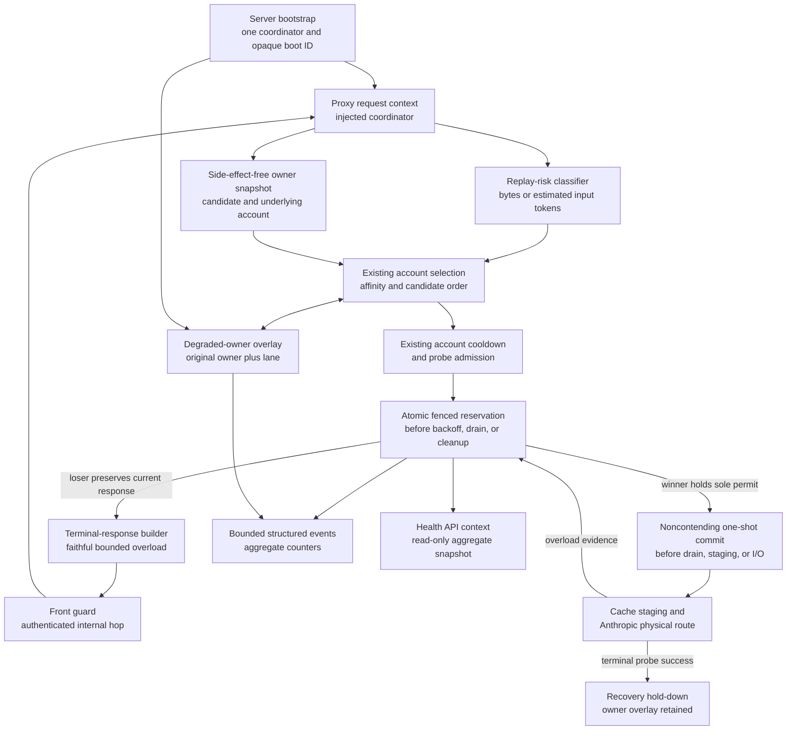
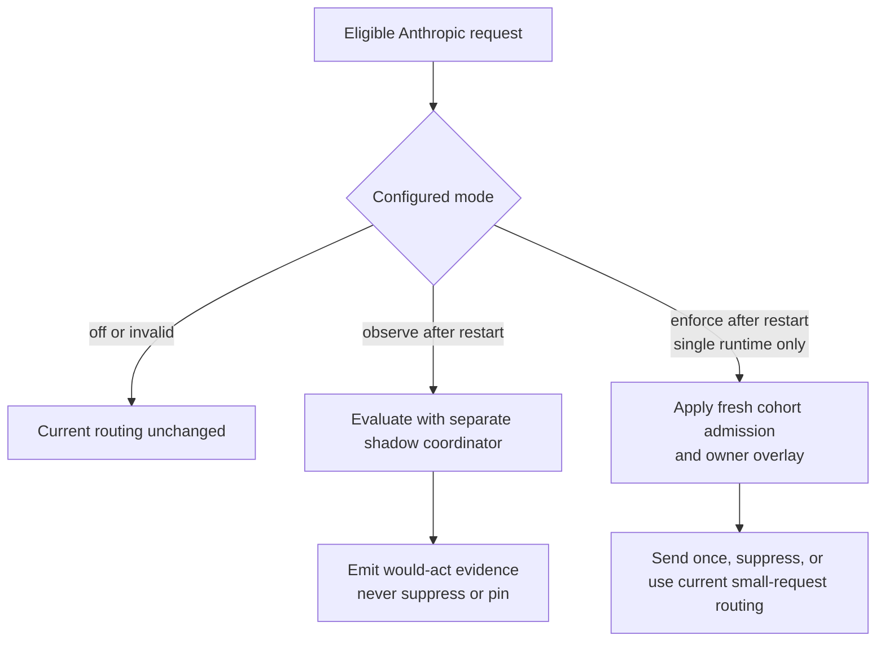
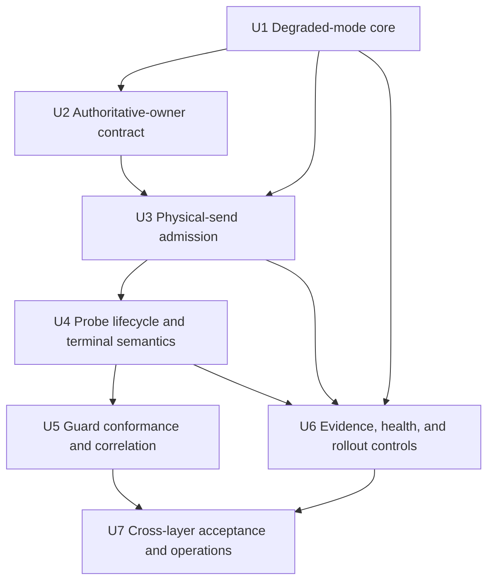

# Degraded-Mode Hardening - Plan

## Goal Capsule

- **Objective:** Preserve useful availability during intermittent Anthropic-wide overloads while preventing large-context requests from being repeatedly transmitted across accounts and replayed again by the guard.
- **Product authority:** The Product Contract below is the source of truth. The Planning Contract resolves implementation mechanics but cannot weaken the replay, cache-owner, client-semantics, privacy, or testing boundaries.
- **Planning authority:** Key Technical Decisions define the implementation posture. Implementation Units may refine local details only where the plan leaves judgment to the executor.
- **Execution profile:** test-first with deterministic fake or non-Anthropic providers; no scripted requests to real Anthropic accounts.
- **Stop conditions:** stop if enforcement cannot distinguish provider-wide overload evidence from account-local failures, if a protected request can still be replayed by the guard, or if diagnostics require retaining prompt or response content.
- **Open blockers:** None. Product and planning decisions are resolved; implementation may choose exact field and symbol names within the stated contracts.
- **Tail ownership:** Execute in the isolated feature worktree, satisfy the Verification Contract, and publish through a focused draft PR. Production deployment remains a post-merge operation from `refs/heads/main`.

---

## Product Contract

### Summary

Add an adaptive Anthropic degraded mode that keeps ordinary failover available for small requests but bounds physical sends for large-context sessions once overload evidence spans two distinct accounts. During protection, an established session retains its cache owner, at most one normal incoming request acts as the cohort's recovery probe within one enforcing server runtime, and suppressed requests receive a faithful Anthropic-compatible `529 overloaded_error` with bounded retry guidance that the guard must return without replay.

The implementation extends current per-account cooldown, probe, affinity, route-ledger, and guard behavior with a bounded Anthropic cohort coordinator at the physical-send boundary. It uses process-local state, an observation-first rollout, privacy-safe structured evidence, and no new database schema.

### Problem Frame

better-ccflare already has useful account-level cooldown, recovery-probe, owner-retention, route-attempt, and faithful-overload foundations. A provider-wide intermittent outage exposes a remaining coordination gap: one logical request can still transmit the same large body across multiple underlying Anthropic accounts, then have the front guard restart that proxy fanout. Each layer is locally reasonable, but together they amplify load, latency, and account churn precisely when the provider is degraded.

The July 29 incident demonstrated both sides of the tradeoff. Some requests succeeded after failover, so disabling failover globally would discard real intermittent capacity. Large conversations, however, could cross several accounts and guard attempts, with one successful request carrying roughly 290,000 input tokens. Failed attempts do not report usage, so neither billed-token duplication nor cache loss can be claimed from this evidence. The product goal is therefore narrower and measurable: retain small-request availability, bound large-request physical sends, preserve cache-owner continuity, and expose the real overload condition without retaining user content.

### Key Decisions

- **Adapt behavior by replay risk rather than disabling failover globally.** Small requests keep normal failover during degradation; large requests enter a protected send budget after a cross-account overload quorum. (session-settled: user-approved — chosen over globally disabling failover: intermittent capacity remained useful and small requests should retain availability)
- **Treat overloads from two distinct underlying Anthropic accounts within a bounded window as cohort-level degradation evidence.** Candidate aliases or multiple attempts against one account do not satisfy the quorum, and unrelated endpoint or model cohorts do not contaminate each other. (session-settled: user-approved — chosen over reacting to one account-local overload: the protection should represent provider-cohort evidence rather than one account's condition)
- **Keep the established cache owner and stop large-context cross-account fanout while protected.** Transient overload may cause a temporary attempt outcome but must not permanently remap the session; normal ownership resumes after recovery. (session-settled: user-approved — chosen over equal-tier owner remapping and repeated fallback: continuity and bounded replay matter more than speculative large-request availability during a confirmed cohort event)
- **Return a faithful protected overload response.** A locally suppressed large replay returns an Anthropic-compatible `529 overloaded_error` plus bounded `Retry-After`; the guard treats it as terminal and performs no full-body replay. (session-settled: user-approved — chosen over a generic 503 or another guard recovery cycle: clients should see the real retryable condition without multiplying the request)
- **Use one single-flight recovery probe drawn from normal incoming traffic within the supported enforcing runtime.** No synthetic Anthropic probe is introduced. Concurrent large requests sharing that coordinator cannot each become probes, and a failed probe cannot release a retry surge. (session-settled: user-approved — chosen over per-request probing: one controlled recovery signal preserves capacity and respects the ban on scripted Anthropic traffic)
- **Extend existing recovery foundations instead of replacing them.** The new product delta is cross-account cohort detection, context-aware send admission, explicit cache-owner pinning during that cohort, and complete amplification telemetry. Existing 529 classification, per-account cooldowns, single-flight primitives, trusted-response forwarding, guard ownership, and fallback-owner retention remain authoritative.
- **Let protected large-request admission take precedence over the existing all-accounts-probe-suppressed escape hatch.** That escape hatch remains useful outside an open cohort and for small requests, but it cannot grant every concurrent large request one more ungated full-context send.
- **Make replay avoidance observable without storing content.** Operators must be able to reconcile logical requests, physical attempts, guard attempts, owner changes, quorum decisions, probe state, and final outcomes using privacy-safe identifiers and size bands.

### Actors

- A1. Claude Code client sending small and large Anthropic requests and consuming Anthropic-compatible overload responses.
- A2. better-ccflare proxy selecting accounts, tracking the session cache owner, classifying replay risk, and enforcing cohort protection.
- A3. better-ccflare front guard deciding whether a response is terminal or eligible for guard recovery.
- A4. Anthropic account pool providing account-local and cohort-level overload evidence.
- A5. Operator configuring the feature, observing degraded state, and diagnosing replay amplification without access to conversation content.
- A6. Maintainer validating behavior through deterministic fake or non-Anthropic test providers.

### Key Flows

- F1. Healthy or below-quorum routing
  - **Trigger:** No active overload quorum exists for the request's Anthropic cohort.
  - **Actors:** A1, A2, A4
  - **Steps:** Route with existing account selection, cooldown, affinity, and failover behavior; record qualifying overload evidence when it occurs.
  - **Outcome:** Existing availability behavior remains unchanged until two distinct underlying accounts establish cohort degradation.
  - **Covered by:** R1-R6, R15

- F2. Small request during cohort degradation
  - **Trigger:** A cohort is degraded and the request is below the large-context risk threshold.
  - **Actors:** A1, A2, A4
  - **Steps:** Keep existing account-level cooldown and failover behavior; record each physical attempt and its relationship to the logical request.
  - **Outcome:** The request can still use intermittent capacity without weakening large-request protection.
  - **Covered by:** R7-R9, R23-R27

- F3. Large request with an established cache owner
  - **Trigger:** A cohort is degraded and a large-context session already has a valid cache owner.
  - **Actors:** A1, A2, A4
  - **Steps:** Retain that owner; admit the request only if it owns the cohort's single recovery-probe slot; never fan the body out to another account; otherwise suppress before another provider send.
  - **Outcome:** The session remains owner-stable and incurs at most the controlled physical send allowed by degraded mode.
  - **Covered by:** R7, R10-R14, R19-R22

- F4. Large request without a valid cache owner
  - **Trigger:** A cohort is degraded and the large request has no prior valid owner.
  - **Actors:** A1, A2, A4
  - **Steps:** Admit at most one selected account only when the request owns the recovery-probe slot; otherwise suppress before a provider send; do not fan out after an overload.
  - **Outcome:** New large sessions receive a bounded availability attempt without recreating cross-account amplification.
  - **Covered by:** R10-R12, R15, R19-R22

- F5. Protected overload reaches the client
  - **Trigger:** A large request is suppressed or its admitted probe confirms continued overload.
  - **Actors:** A1, A2, A3
  - **Steps:** Produce or preserve an Anthropic-compatible `529 overloaded_error`; use status 529 itself as the machine-readable terminal signal, attach bounded retry guidance, and have the guard return the response without another attempt.
  - **Outcome:** Claude Code receives truthful retry semantics and the large body is not replayed by better-ccflare.
  - **Covered by:** R16-R18

- F6. Controlled recovery
  - **Trigger:** The degraded cohort becomes eligible for another recovery probe.
  - **Actors:** A1, A2, A4
  - **Steps:** Elect only one normal incoming request; keep concurrent large requests protected; close or step down degraded state only after a qualifying same-cohort success; retain protection after another overload.
  - **Outcome:** Ordinary behavior returns automatically without a thundering herd or permanent cache-owner churn.
  - **Covered by:** R19-R22

- F7. Non-overload owner invalidation
  - **Trigger:** A preserved owner becomes paused, expired, unauthorized, or otherwise invalid for a non-overload reason.
  - **Actors:** A2, A4
  - **Steps:** Apply existing account-validity and ownership rules; do not count the fault toward the overload quorum; do not use reassignment as permission for large-context fanout while the cohort remains degraded.
  - **Outcome:** Correct account-local recovery remains possible without conflating it with provider degradation.
  - **Covered by:** R5, R13-R15

- F8. Operator diagnosis
  - **Trigger:** An operator investigates an outage or reviews degraded-mode health.
  - **Actors:** A5, A2, A3
  - **Steps:** Use aggregate health for routine state and, during an explicitly enabled bounded diagnostic window, correlate logical request, physical proxy attempts, guard attempts, owner continuity, cohort evidence, suppressed sends, probe transitions, and final outcome from the host-restricted structured service event stream.
  - **Outcome:** The operator can quantify amplification and replay avoidance without reconstructing user content.
  - **Covered by:** R23-R28

### Requirements

**Cohort detection and state**

- R1. Existing routing behavior remains unchanged while no degraded cohort is active.
- R2. A degraded cohort opens only after overload evidence from at least two distinct underlying Anthropic accounts within a bounded evidence window.
- R3. Qualifying evidence includes a faithful Anthropic overload outcome whether it arrives as an HTTP 529 or as a pre-commit Anthropic semantic `overloaded_error`.
- R4. Multiple candidate aliases, in-place retries, or guard replays against the same underlying account count as one distinct-account source for quorum purposes.
- R5. Authentication, authorization, quota, malformed-request, client-cancellation, transport, and other account-local or non-overload failures do not establish or refresh the overload quorum.
- R6. Cohort scope must be narrow enough that unrelated providers, endpoints, and incompatible model families do not share degraded state. Pre-quorum evidence expires automatically; an open cohort remains protected until a qualifying recovery success, explicit mode-off restart, or process restart.

**Context classification and physical-send budget**

- R7. Every eligible request receives one deterministic privacy-safe replay-risk classification from the final normalized Anthropic body after agent interception and before account-specific transforms, using its actual UTF-8 byte length, the best available nonthrowing input-token estimate, or a conservative combination; exact thresholds are operator-configurable within safe bounds.
- R8. Requests below the large-context threshold retain existing failover and recovery behavior during degradation.
- R9. Small-request behavior must not bypass existing account validity, cooldown, priority, forced-route, or post-commit safety rules.
- R10. A protected large request with a valid cache owner may physically target only that owner and only when admitted as the cohort's recovery probe.
- R11. A protected large request without a valid owner may make at most one physical provider send, only when admitted as the cohort's recovery probe, and may not fan out after an overload.
- R12. A protected large request that does not own the probe slot is suppressed before another physical provider send.
- R13. The large-request send budget covers every physical send throughout open, probing, and recovering states, including in-place provider retries, cross-account failover, the existing all-accounts-probe-suppressed ungated escape hatch, and guard recovery, so independently correct layers cannot multiply the same body.
- R14. No request may be replayed after response commitment or after a streaming response has begun.
- R15. An explicit force-route remains single-account and cannot broaden into cohort fanout; its existing account-validity semantics remain authoritative. Force-routed outcomes cannot establish or refresh shared cohort quorum, but force-routed requests still obey protection for an already-open matching cohort.

**Cache-owner continuity**

- R16. Transient overload and degraded-mode suppression do not permanently replace a session's established cache owner.
- R17. Any temporary fallback state remains distinguishable from authoritative ownership and snaps back to the preserved owner when normal routing resumes.
- R18. A non-overload condition that makes the owner invalid may invoke existing reassignment rules, but does not increase the protected large-request physical-send budget.

**Client and guard semantics**

- R19. A locally protected response uses Anthropic-compatible HTTP 529 and an `overloaded_error` body rather than a generic `503 route_unavailable`.
- R20. A protected 529 includes a bounded `Retry-After`; an upstream value may be preserved or clamped within the local bounds. The client-visible response forwards only an explicit safe-header allowlist: content type, sanitized retry guidance, and an upstream request ID only if deliberately approved.
- R21. The guard can unambiguously recognize the protected terminal response and performs zero request-body replays for it.
- R22. Existing faithful forwarding of trusted upstream overload responses must not regress, including useful retry guidance that is safe to expose; internal correlation, hop-by-hop, cookie, authorization, and tracing headers never cross the client or provider boundary.

**Recovery behavior**

- R23. At most one recovery probe is active per degraded cohort at any time across concurrent requests within the supported single enforcing server runtime.
- R24. A recovery probe is a naturally arriving eligible request, never a synthetic or scripted Anthropic request.
- R25. For a session with a valid owner, its recovery probe targets only that owner; for a session without an owner, it targets only one existing-policy-selected eligible account.
- R26. A qualifying same-cohort success closes or steps down protection according to a bounded stabilization rule; another qualifying overload keeps or returns the cohort to degraded state.
- R27. Probe failure does not release queued or concurrent large requests into simultaneous physical sends, and non-overload probe failures do not masquerade as successful recovery.

**Privacy-safe observability and rollout**

- R28. Telemetry distinguishes a logical client request from each physical provider attempt and each guard attempt.
- R29. Typed diagnostic records use a separately authenticated guard-correlation envelope when available and otherwise generate local correlation. General logs expose replay-risk and size buckets, domain-separated opaque runtime identifiers, bounded candidate/attempt facts, owner/quorum/probe decisions, suppression reasons, and terminal outcomes. Exact bounded token or byte estimates and detailed joins are available only through an explicit diagnostic event mode that is disabled by default and writes to the existing host-restricted structured service log stream; no public HTTP route exposes them.
- R30. Physical-attempt accounting includes in-place retries, account failovers, recovery probes, and guard replays rather than counting only final logical requests.
- R31. General liveness and health expose only fixed-schema aggregate state such as configured mode, opaque boot ID, active-state counts, coarse age bands, active probes, suppressed-send counts, and dropped-evidence or dropped-event counts. Bounded cohort detail, if needed, is emitted only by the default-off diagnostic event mode to the host-restricted structured service log stream and is never returned by an ordinary API caller.
- R32. Diagnostics never retain or expose raw prompts, reasoning content, tool payloads, response bodies, credentials, arbitrary error serialization, or reversible user/session identifiers. Event delivery is bounded and nonblocking, and telemetry failure cannot change routing, response, or lease cleanup.
- R33. Rollout is operator-controlled and exposes a non-enforcing observation path before enforcement; disabled mode preserves existing behavior. Mode changes require a restart, and observation shadow state is never promoted into enforcement state.
- R34. Validation uses deterministic fixtures, concurrency tests, and fake or non-Anthropic providers. It never curls or scripts the Anthropic endpoint, directly or through a real Anthropic/Codex account.
- R35. Any durable state or telemetry schema added for the feature has equivalent SQLite and PostgreSQL behavior.

### Acceptance Examples

- AE1. Small request preserves intermittent availability
  - **Covers:** R1-R9
  - **Given:** The cohort is degraded after overloads from accounts A and B.
  - **When:** A small request overloads on A and succeeds on an otherwise eligible B.
  - **Then:** Existing failover is allowed, the success reaches the client, and both physical attempts correlate to one logical request.

- AE2. Two-account quorum protects an established large session
  - **Covers:** R2-R6, R10, R12-R13, R16-R18
  - **Given:** Distinct accounts A and B overload within the evidence window and a roughly 290,000-token session is owned by A.
  - **When:** The session sends a large request that does not own the probe slot.
  - **Then:** The body is sent to neither A, B, nor C, the authoritative owner remains A, and a suppressed-send event is observable.

- AE3. One controlled large recovery probe
  - **Covers:** R10-R13, R23-R27
  - **Given:** Ten large requests arrive concurrently for one degraded cohort in one supported enforcing server runtime and one is eligible to probe.
  - **When:** Admission decisions are made.
  - **Then:** At most one request performs a physical provider send, owner-bound sessions do not target another account, and the other requests receive protected overload responses.

- AE4. Guard does not restart protected work
  - **Covers:** R13, R19-R22
  - **Given:** The proxy returns a protected Anthropic-compatible 529 with bounded retry guidance.
  - **When:** The response reaches the front guard.
  - **Then:** The guard returns that response and performs zero full-body recovery replays.

- AE5. Failed probe preserves protection and ownership
  - **Covers:** R16-R18, R23-R27
  - **Given:** A large owner-bound recovery probe targets A.
  - **When:** A returns a qualifying overload.
  - **Then:** The cohort remains degraded, concurrent large requests are not released, and A remains the session's authoritative owner.

- AE6. Successful probe restores ordinary behavior
  - **Covers:** R16-R18, R23-R27
  - **Given:** A degraded cohort admits a valid owner-bound recovery probe.
  - **When:** The probe produces a qualifying same-cohort success and the stabilization rule is satisfied.
  - **Then:** Protection closes or steps down automatically, the session owner remains stable, and later requests resume ordinary routing.

- AE7. Account-local failure does not create provider degradation
  - **Covers:** R2-R6, R18
  - **Given:** Account A returns an authentication error and account B returns one overload.
  - **When:** Cohort evidence is evaluated.
  - **Then:** No two-account overload quorum exists, the authentication failure follows existing account-invalidity handling, and large-context cohort protection does not open.

- AE8. New large session cannot fan out
  - **Covers:** R11-R13, R19-R27
  - **Given:** A large request without a cache owner arrives while the cohort is degraded.
  - **When:** It does not own the probe slot.
  - **Then:** It performs no provider send and receives the protected 529; if it owns the slot, it targets at most one eligible account and never falls through to another.

- AE9. Diagnostics reconcile amplification without content
  - **Covers:** R28-R32
  - **Given:** A mix of in-place retries, account failovers, suppressed requests, and a guard attempt occurs in deterministic fixtures.
  - **When:** The fixture inspects aggregate health and an explicitly injected detailed event sink.
  - **Then:** Logical and physical counts reconcile, owner and cohort transitions are explainable, ordinary APIs expose no detail, and no retained or emitted field can reconstruct prompt or response content.

- AE10. Safe staged rollout
  - **Covers:** R33-R35
  - **Given:** Fresh test runtimes start separately in disabled, observation, and enforcement modes.
  - **When:** The same deterministic outage scenario runs in each mode.
  - **Then:** Disabled behavior matches the current baseline, observation mode reports the decisions it would take without suppressing sends, enforcement satisfies the physical-send bounds, and no real Anthropic request is generated.

### Success Criteria

- Deterministic tests prove healthy routing, below-quorum behavior, small-request failover, two-distinct-account quorum, owner-bound and ownerless large-request protection, concurrency single-flight, probe success/failure, account-local exclusions, faithful 529 semantics, and zero guard replay.
- After protection opens, a non-probe large request performs zero additional provider sends; a selected large probe performs no more than one send and never crosses accounts.
- Ten concurrent protected large requests routed through one enforcing server runtime produce no more than one active recovery send for the cohort.
- Cache-owner telemetry proves that transient overload, suppression, and failed probes do not permanently remap an established session.
- Logical-request, physical-attempt, guard-attempt, suppressed-send, and final-outcome counts reconcile in test fixtures.
- Operators can quantify sends avoided and owner changes without raw content. No cache-hit-rate, latency, billing, or provider-capacity improvement is required or claimed for this slice.
- All automated validation completes without scripted traffic to a real Anthropic account.

### Scope Boundaries

**In scope**

- Anthropic overload evidence from distinct accounts and bounded provider/model cohort state.
- Context-aware admission and physical-send budgeting for large requests.
- Cache-owner preservation during transient cohort degradation.
- One normal-traffic recovery probe and thundering-herd prevention.
- Faithful protected 529 responses, bounded retry guidance, and terminal guard behavior.
- Privacy-safe amplification and recovery observability.
- Safe staged rollout and deterministic validation.

**Deferred to Planning**

- Exact large-request classifier, default threshold, and configuration surface.
- Exact overload evidence window, degraded-state lifetime, and cohort-key representation.
- Exact `Retry-After` lower/upper bounds, upstream-value clamping, and jitter guidance.
- Exact recovery-success definition, stabilization period, and state-transition timings.
- Reuse boundaries for the existing per-account circuit, recovery-probe, affinity, route-attempt, and guard-response machinery.
- In-memory versus durable cohort state and the persistence shape of optional diagnostic evidence.
- Exact observation/enforcement controls and rollout sequence.

**Outside this slice**

- Disabling ordinary failover for small requests.
- Replacing existing account-level cooldown, circuit, affinity, or guard ownership systems.
- Changing Claude Code's own retry algorithm or user interface.
- Automatically translating Anthropic requests to another provider or model.
- A universal degraded-mode breaker for every provider and error category.
- Treating authentication, quota, malformed requests, or other account-local failures as provider-wide overload.
- Midstream replay or recovery after response commitment.
- Persisting raw request or response content.
- Claiming improved Anthropic cache hits, reduced billing, or reduced provider processing without provider-reported evidence.
- Synthetic health probes or automated traffic against real Anthropic accounts.
- Cross-process, multi-replica, or distributed cohort consensus and single-flight coordination.

### Dependencies / Assumptions

- Current main at planning base `d5d7ab13e` has faithful 529 classification/forwarding, per-account cooldown recovery, a single-flight probe gate, route-attempt accounting, fallback-owner retention, and guard retry ownership; these remain the foundations this slice extends.
- The proxy can resolve candidate identities to distinct underlying accounts before evaluating quorum.
- The buffered request exposes serialized size and enough metadata for a conservative risk classification without persisting content.
- The production topology routes enforcing traffic through one server process and one injected coordinator. Multi-runtime deployments remain `off` or `observe` until distributed coordination exists.
- The stack launcher can generate a distinct 32-byte guard-correlation secret for each full stack start and pass it separately to the guard and backend. It is not reused for the higher-privilege in-process refresh/probe token. Caller-provided correlation is never routing or admission authority and is discarded when the signed hop cannot be proven.
- Cache-owner validity can be distinguished from a transient overload outcome.
- Existing aggregate health, the structured service event stream captured by journald in production, and request-accounting surfaces can host privacy-safe counters/events; no database schema is planned, and any later durable schema would require equivalent SQLite and PostgreSQL behavior.

### Outstanding Questions

**Resolved During Planning**

- Large-context classification uses the final normalized Anthropic body's actual UTF-8 byte length and the existing nonthrowing input-token estimate. The initial defaults are `100,000` estimated input tokens or `256 KiB` of serialized body, with either threshold sufficient to classify a request as large.
- Two distinct-account overloads within `30 seconds` open the cohort. Uncommitted evidence expires with that window; an open cohort does not close on time alone. Its next-probe delay follows sanitized upstream retry guidance with a `10-second` fallback and a `5-60 second` clamp.
- Cohort identity uses the physical Anthropic provider, normalized endpoint authority and path class, allowlisted concrete model family, request protocol, and canonical bounded beta signature. Unknown/noncanonical and force-routed outcomes cannot establish quorum, which counts distinct underlying account IDs.
- Only a successfully completed large same-cohort recovery request closes protection. Small-request success does not unlock large fanout; failed, aborted, cancelled, or post-commit-incomplete probes retain protection.
- One injected server-process coordinator and one injected owner overlay compose the existing account cooldown/probe gate, route-attempt ledger, session-affinity state, and trusted terminal response. Atomic fenced reservation occurs before destructive retry work; one-shot commit occurs before drain/staging/I/O. The design does not create a second guard retry authority or replace generic affinity.
- Cohort, permit, and owner-overlay state is bounded, process-local, and restart-cleared. Expired/closed and oldest live pre-quorum entries are evictable; open, recovering, and leased entries are not. Protected-cap exhaustion drops new evidence with an aggregate counter.
- General health is aggregate-only. Detailed event mode is default-off and writes only to the host-restricted structured service log stream with no application retention or public HTTP route.
- `off`, `observe`, and `enforce` are startup modes. Observation uses separate shadow state, and enabling enforcement requires a restart with a fresh coordinator rather than promoting shadow evidence.

**Deferred to Implementation**

- Exact configuration names, response-header names, metric names, and health-field names after the owning modules and conventions are confirmed.
- Exact test fixture and fake-provider packaging that proves HTTP 529 and semantic pre-commit overload parity.

### Sources / Research

- [Claude Status: Elevated errors across all models](https://status.claude.com/incidents/q2kg8n613kr3) establishes the provider-wide incident that motivated the degraded-mode scenario.
- Current-session read-only incident evidence for the fixed 2026-07-29 19:45:39-20:33:00 UTC window found 679 logical `/v1/messages` requests, 155 structured Anthropic-overload attempts across 62 affected request IDs, 44 requests crossing accounts, and 25 requests reaching all three eligible accounts with no eventual success. Nine affected requests eventually succeeded, which is why small-request failover remains in scope.
- The same incident evidence found one successful request with roughly 290,000 input tokens after overloads on two accounts, as well as guard recovery restarting full proxy routing. Failed attempts had no provider usage rows, so the contract deliberately avoids billing or cache-loss claims.
- `docs/plans/2026-07-16-001-fix-routing-reliability-plan.md` defines the existing guard retry authority, trusted terminal-response behavior, bounded guard recovery, owner snapback, and route-attempt foundations that this contract must extend rather than duplicate.
- `docs/plans/2026-07-15-001-feat-grok-cache-native-vertical-slice-plan.md` provides the repository's product precedent for authoritative cache ownership, temporary fallback behavior, and snapback.
- `packages/proxy/src/handlers/rate-limit-cooldown.ts` and `packages/proxy/src/proxy.ts` contain the current per-account 529 cooldown, recovery-probe gate, and all-candidates-suppressed escape path introduced upstream through PRs #323 and #342.
- `packages/proxy/src/handlers/proxy-operations.ts`, `packages/proxy/src/handlers/routing-attempt-ledger.ts`, and `packages/proxy/src/handlers/routing-terminal.ts` contain the request-local ledger and trusted terminal-overload preservation; this slice must not add a second terminal-response store.
- `packages/load-balancer/src/strategies/session-affinity.ts` contains current fallback-owner and snapback behavior. Its generic equal-tier remap behavior remains intact outside an open degraded cohort.
- `scripts/ccflare-guard-policy.mjs` and `scripts/ccflare-guard.mjs` contain the current guard authority under which 529 is already terminal; implementation should prove conformance rather than create another guard retry policy.
- `packages/proxy/src/opaque-runtime-id.ts` provides a privacy-safe identifier precedent for the new amplification telemetry.
- `AGENTS.md` supplies the non-negotiable prohibition on scripted Anthropic testing and the SQLite/PostgreSQL migration parity rule.

---

## Planning Contract

### Key Technical Decisions

- KTD1. **Classify replay risk once from the final normalized Anthropic body.** After agent interception is complete and before account/provider-specific transforms, compute one immutable classification from `finalBodyBuffer.byteLength` and the existing nonthrowing Anthropic input-token estimate. A request is large when the estimate is at least `100,000` or the actual UTF-8 body is at least `256 KiB`; either threshold is sufficient and both are configurable. This places a conservative byte fallback below the roughly 290,000-token incident example while observation mode calibrates size buckets without retaining content. (session-settled: user-approved — chosen over globally disabling failover: only large replays lose speculative cross-account availability)
- KTD2. **Key trusted quorum evidence from physical routes, not logical candidates.** The cohort key combines resolved Anthropic provider identity, normalized endpoint authority and path class, allowlisted concrete model family, protocol, and canonical bounded beta signature. Unknown or noncanonical model/beta values create no retained quorum key, and explicit force-route outcomes cannot establish or refresh shared quorum. The evidence window is `30 seconds`, and only distinct underlying account IDs count toward the default quorum of two. Locally synthesized protected responses never feed this collector. (session-settled: user-approved — chosen over reacting to one account or counting candidate aliases: protection must represent cross-account cohort degradation)
- KTD3. **Use one bounded process-local state machine per server process.** Inject one coordinator through the proxy context rather than creating module-global instances. Pre-quorum evidence expires after `30 seconds`; an open cohort does not close on elapsed time alone and remains protected until terminal probe success, mode-off restart, or process restart. Next-probe timing uses sanitized upstream guidance with a `10-second` fallback and a `5-60 second` clamp. Terminal success enters a `30-second` recovery window in which each large request still has a one-physical-send budget. Size caps evict expired/closed entries first and then the oldest live pre-quorum evidence, but never open, recovering, or leased state. If protected entries fill the cap, new evidence fails open and increments a dropped-evidence counter. (session-settled: user-approved — chosen over database-persisted outage state: transient suppression should not survive a restart or require dual-database migrations)
- KTD4. **Use an atomic fenced reservation plus one-shot commit around every physical provider send.** After account admission, the shared executor inside `proxyWithAccount` atomically reserves the cohort permit before retry backoff, stream draining, or cleanup. A loser receives a typed denial while its current trusted response is untouched. A winner holds the sole fenced permit through non-destructive waiting, then performs a noncontending single-use commit immediately before any destructive drain, cache-body staging, or network I/O; abandoned preparation explicitly cancels the permit and applies bounded next-probe delay. The same authority covers initial sends, in-place 529 retries, semantic pre-commit recovery, implicit-model routes, combo fallbacks, and the all-candidates-suppressed escape path.
- KTD5. **Keep degraded ownership in a server-owned typed overlay.** Inject one overlay with the coordinator rather than creating module-global state. Before account selection can mutate affinity, obtain a side-effect-free snapshot preserving both authoritative candidate identity and underlying account identity. Whenever the matching cohort is already open, probing, or recovering, materialize the request's retention directive before selection even if another session opened the cohort; also retain the first qualifying large-request owner snapshot that later participates in quorum. Treat pre-quorum and small-request fallbacks as temporary, keep the overlay through the existing anti-thrash interval after recovery, and let the load balancer consume typed owner context without importing proxy cohort state. (session-settled: user-approved — chosen over equal-tier owner remapping: the original cache lineage remains authoritative during transient provider degradation)
- KTD6. **Use one fenced owner-aware large request as the recovery probe.** Acquire the cohort lease only after the selected account clears its existing account-level gate. Owner-bound sessions probe only their owner; ownerless sessions probe one existing-policy-selected account. A `10-minute` watchdog aborts the upstream transport, advances the lease generation, and fences late completion before releasing eligibility, so a timed-out probe and its successor cannot overlap. Every non-success outcome, including cancellation, truncation, timeout, or inability to establish terminal lifecycle success, applies at least the minimum next-probe delay. Diagnostic sink failure is orthogonal and cannot alter the outcome. No protected large request can use an in-place retry or another account, and each large request remains limited to one physical send during recovery hold-down. (session-settled: user-approved — chosen over synthetic or per-request probes: normal traffic supplies one credible capacity signal without a retry surge)
- KTD7. **Make 529 itself the guard terminal contract and construct it at the terminal boundary.** The pure coordinator returns typed decisions and retry timing, never an HTTP `Response`. `routing-terminal` preserves an actual trusted upstream 529 when available or constructs the same Anthropic-compatible shape for local suppression and semantic pre-commit overload exhaustion. It allows only content type, sanitized `Retry-After`, and a deliberately approved upstream request ID; it excludes internal correlation, hop-by-hop, cookie, authorization, and tracing headers. Pool-recovery markers remain absent, so existing guard policy forwards the response once without a second terminal store or broader guard repair. (session-settled: user-approved — chosen over generic 503 synthesis or another guard cycle: the client receives truthful overload semantics without replay)
- KTD8. **Treat correlation and telemetry as bounded diagnostics, never authority.** At full stack start, `run-ccflare-stack.sh` generates a distinct 32-byte guard-correlation secret and passes it to both children; the guard signs a versioned bounded request-ID/attempt envelope, and the backend verifies it in constant time. The credential rotates only with the whole stack, is never the in-process refresh/probe token, and is never sent over HTTP. Missing, mismatched, child-only-restarted, or malformed credentials cause correlation to be discarded and regenerated locally without affecting routing. Use domain-separated per-runtime opaque identifiers with at least 128 bits of PRF output, fixed enums, bounded error fields, a per-request event budget, nonblocking sinks, saturating aggregate counters, and dropped-event counts. General health receives a read-only aggregate snapshot through API-context dependency injection. Exact sizes and detailed joins are available only in a default-off diagnostic event mode written to structured service logs captured by journald in production; the application retains no event history, host journal ACLs/retention remain authoritative, and no public HTTP endpoint exposes the detail.
- KTD9. **Ship one restart-scoped `off | observe | enforce` behavior contract.** `off` preserves current behavior, clears or leaves inert all feature state, and is the safe fallback for invalid configuration. `observe` runs a separate shadow coordinator and emits would-open, would-suppress, would-pin, and would-probe decisions without changing candidate order, ownership, transport, responses, or retries. `enforce` starts with fresh state after an operator restart and is supported only when all routed enforcing requests share one server-process coordinator. Multi-runtime topologies remain `off` or `observe` until distributed coordination exists. (session-settled: user-approved — chosen over immediate default-on enforcement: an observation-first rollout exposes false positives before availability is traded away)

### High-Level Technical Design

These sketches are directional. They identify authority boundaries and state transitions without prescribing exact symbols or data structures.

#### Component and data flow



#### Cohort lifecycle

```mermaid
stateDiagram-v2
  [*] --> Closed
  Closed --> Collecting: first trusted-account overload
  Collecting --> Open: second distinct account within 30 seconds
  Collecting --> Closed: evidence window expires
  Open --> Probing: eligible large request acquires sole lease
  Open --> Open: stale raw evidence pruned; protection remains
  Probing --> Open: overload, abort, timeout, cancellation, or incomplete result
  Probing --> Recovering: terminal same-cohort success
  Recovering --> Closed: 30-second recovery window completes
  Recovering --> Open: fresh qualifying overload
```



`Open` suppresses non-probe large sends while small requests retain current failover and does not close merely because time passes. `Probing` admits exactly one large physical send within the enforcing runtime. `Recovering` permits at most one physical send per large request for `30 seconds`, with no in-place retry or cross-account fallback, and retains the original-owner overlay through the existing anti-thrash interval. A mode-off restart or process restart clears all process-local states.

#### Protected request sequence

```mermaid
sequenceDiagram
  participant C as Claude Code
  participant G as Front guard
  participant P as Proxy
  participant A as Account-level gate
  participant O as Cohort coordinator
  participant U as Upstream account

  C->>G: Large Anthropic request
  G->>P: Forward over authenticated internal hop
  P->>P: Classify final body and snapshot owner
  P->>A: Check selected account admission
  A-->>P: Account may send
  P->>O: Atomically reserve before backoff, drain, or cleanup
  alt follower while cohort is open or probing
    O-->>P: Deny; preserve current response
    P-->>G: Faithful overload and retry guidance
    G-->>C: Forward once
  else elected owner-aware probe
    O-->>P: Return sole fenced permit
    P->>P: Perform only non-destructive wait/preparation
    P->>O: Commit once before drain, staging, or I/O
    O-->>P: Noncontending committed permit
    P->>U: Send to owner or one selected account
    alt upstream overload or incomplete result
      U-->>P: Overload or failure
      P->>O: Abort/fence if needed, delay next probe, reopen
      P-->>G: Faithful overload
      G-->>C: Forward once
    else terminal success
      U-->>P: Complete successful response
      P->>O: Enter recovery hold-down
      P-->>G: Successful response
      G-->>C: Successful response
    end
  end
```

#### Rollout-mode decision flow



### Sequencing and Dependency Strategy

Build the pure policy and cohort state first, then expose authoritative affinity ownership before changing routing behavior. Physical-send admission follows those foundations; response-lifecycle completion owns probe release and faithful terminal synthesis. Guard conformance, observability, and rollout surfaces then integrate the completed path before final acceptance proof.



### System-Wide Impact

| Surface | Planned impact | Boundary |
|---|---|---|
| Proxy request lifecycle | Classify the final normalized body once, take a side-effect-free owner snapshot, atomically reserve before backoff/destructive retry work, and commit the fenced permit once before drain, cache staging, or network I/O. | Reservation losers preserve the current terminal; no prompt inspection, denied-path draining, post-commit replay, or second physical-send authority. |
| Account cooldown and circuits | Consume existing account admission before acquiring a cohort lease; feed only confirmed pre-commit overload outcomes into quorum evidence. | Do not replace per-account cooldown, route-circuit, or half-open logic. |
| Session affinity | Add one server-owned typed degraded-owner overlay keyed by the existing lane and cohort, sourced before selection for every matching open/probing/recovering request, then restore ordinary selection after hold-down. | Generic equal-tier remap semantics remain unchanged outside degradation; the load balancer never imports proxy cohort state. |
| Server and API context | Construct one coordinator per server process, inject it through `ProxyContext`, and inject a read-only aggregate snapshot callback through the HTTP API context. | No module-global coordinator and no HTTP API import of proxy implementation. |
| Guard boundary | Rely on existing terminal treatment for faithful overload responses and sign correlation with a dedicated per-stack runner-generated credential shared only with guard/backend children. | Correlation is diagnostic only, invalid envelopes regenerate locally, and the higher-privilege in-process token is never reused. |
| Observability | Add bounded typed physical-attempt events, owner/cohort transitions, saturating counters, dropped-event/evidence counters, aggregate health, and a default-off detailed event mode in the structured service log stream. | General health/public APIs have no cohort/account/owner pseudonyms or exact sizes; the app retains no event history and relies on host journal ACLs/retention. |
| Configuration and lifecycle | Add restart-scoped `off`, observation, and enforcement modes plus bounded threshold/window settings. Restart clears transient cohort state and rotates an opaque boot ID. | V1 enforcement coordinates exactly one server process; multi-replica consensus is deferred. |
| Performance and capacity | Add constant-time bounded-map lookups, one nonthrowing token estimate, one UTF-8 byte-length comparison, and nonblocking bounded event emission per eligible request. | Unknown keys and forced-route evidence cannot churn quorum state; protected entries are never evicted to admit new evidence. |

### Alternatives Considered

| Alternative | Decision | Reason |
|---|---|---|
| Disable Anthropic failover during any outage | Rejected | It would discard demonstrated intermittent capacity for small requests. |
| Generalize a provider-neutral breaker in v1 | Rejected | It broadens scope before Anthropic cohort semantics and physical-attempt accounting are proven. |
| Reuse lane-local session-affinity circuits as cohort state | Rejected | Their candidate scope and owner lifecycle do not represent distinct-account provider evidence. |
| Enforce only in outer candidate loops | Rejected | In-place retries, semantic recovery, implicit-model sends, and ungated escape paths could bypass the budget. |
| Persist cohort and probe state in the database | Rejected | Restart-cleared outage state is safer and avoids stale suppression plus SQLite/PostgreSQL migration scope. |
| Send synthetic canaries | Rejected | Repository safety rules prohibit scripted Anthropic traffic and normal large requests provide the relevant capacity signal. |
| Add a new guard retry policy | Rejected | Existing policy already makes overload terminal; the missing work is proxy semantics and conformance proof. |

### Risks and Mitigations

| Risk | Consequence | Mitigation |
|---|---|---|
| A nested send bypasses admission | One logical large request still produces multiple physical bodies. | Use the shared two-phase physical-send executor and test initial, in-place, semantic, combo, all-suppressed, and recovering paths. |
| Two contenders both pass a preliminary check | The loser drains its retained failure or a second probe overlaps. | Atomically reserve a fenced permit before any destructive work, make commit noncontending and single-use, require explicit cancellation, and test the two-contender loser path. |
| Cohort identity merges, splits, or is poisoned | False suppression, missed degradation, or cardinality exhaustion. | Normalize and allowlist endpoint/model/beta facts, exclude forced routes from quorum, count distinct underlying accounts only, and drop new evidence rather than evict protected entries. |
| Probe lease leaks or a timed-out probe completes late | Large requests remain suppressed or two probes overlap. | Abort transport at watchdog expiry, generation-fence late completions, delay every non-success successor, and test timeout/success races plus abort storms. |
| Small-request fallback overwrites ownership | Recovery resumes on the wrong cache lineage. | Keep authoritative ownership in the separate overlay and cover equal-tier plus non-overload invalidation cases. |
| One success causes oscillation | A short recovery opens large fanout too quickly. | Require terminal large-probe success and retain a recovery hold-down that immediately reopens on fresh overload. |
| Internal correlation is spoofed, desynchronized, or leaks outward | Untrusted input contaminates diagnostics or internal identifiers reach providers/clients. | Generate a dedicated 32-byte per-stack secret in the runner, sign/version envelopes, verify in constant time, regenerate locally on mismatch/child-only restart, strip reserved headers, and test rotation plus injection. |
| Structured events leak identity, block routing, or explode cardinality | Privacy, availability, and operational cost regress. | Use domain-separated per-runtime opaque IDs, fixed enums, bounded fields, per-request event budgets, nonblocking sinks, saturating counters, and aggregate-only health. |
| Restart or multiple processes diverge | Protection disappears or two runtimes each elect a probe. | Expose an opaque boot ID, require one coordinator topology for enforcement, test that two coordinators are independent by design, and keep multi-replica enforcement out of scope. |
| Observe state is promoted or modes classify differently | Stale shadow evidence suppresses traffic or observation cannot predict behavior. | Share pure decision logic but keep shadow/enforcement stores separate; require a restart and fresh coordinator for every mode change. |
| Protected response forwards unsafe headers | Cookies, auth, tracing, or internal transport details leak to the client. | Build at the terminal boundary from an explicit allowlist and test malicious upstream headers plus provider echo. |
| Guard changes expand into unrelated retry work | Scope grows and recent reliability fixes regress. | Prefer zero guard-policy change; limit edits to correlation or conformance that the protected path demonstrably needs. |

### Operational and Rollout Notes

- Start with mode `off` as the compatibility baseline; invalid configuration also resolves to `off` with an operator-visible warning.
- Run `observe` through deterministic outage fixtures and a normal production observation window. Compare logical requests, physical attempts, would-suppress decisions, owner changes, and false-positive cohort openings.
- Change modes only through configuration plus restart. Never promote observation shadow state into enforcement.
- Enable `enforce` only after observation shows that one-account overloads, forced-route outcomes, unknown model/beta values, unrelated cohorts, and account-local failures remain outside quorum, and after topology confirms all enforcing traffic shares one coordinator.
- Roll back by returning the mode to `off` and restarting the stack. No database rollback or data repair is required.
- Expose an opaque boot ID, configured mode, coarse state/evidence age bands, aggregate active-state/probe counts, suppressed sends, dropped evidence/events, and recovery transitions through bounded health/log surfaces. Emit cohort details only through the explicitly enabled structured service event stream.
- Keep detailed diagnostic events disabled by default. When an operator enables them for an observation window, write only to the structured service log stream, verify host journal-reader ACLs plus size/time retention first, and disable them after the bounded investigation; no application buffer or public HTTP detail endpoint is added.
- Generate the guard-correlation secret once in the stack runner, pass it independently to both children, rotate it on full stack restart, and treat a child-only restart or mismatch as loss of correlation rather than a routing failure.
- Do not use a live Anthropic canary. Production deployment is permitted only after merge to `refs/heads/main` and must use the repository deployment script and runtime `git_sha` verification.

#### Enforcement Go/No-Go

Before enforcement, the same deterministic outage matrix must run in `off` and `observe` with identical client statuses/bodies, selected accounts, physical-send counts, owner mutations, and guard attempts. Observation may add only separate shadow state and `would-*` evidence. Health must report the expected runtime `git_sha`, configured mode and thresholds, a fresh opaque boot ID, zero stale cohorts or leases at startup, bounded coordinator/event capacity, and a topology check showing one server-process coordinator receives all enforcing traffic.

Proceed from observation to enforcement only when:

- retries, aliases, and guard attempts against one underlying account never satisfy quorum;
- force-routed, unknown-model, unknown-beta, endpoint, protocol, model-family, and beta-signature fixtures cannot poison or cross cohort boundaries;
- ten concurrent protected large requests elect at most one send and every follower sends zero bodies;
- two simultaneous would-be probes produce one atomic reservation winner; the loser preserves its current trusted terminal and performs zero destructive cleanup or provider sends;
- a probe cannot use an in-place retry, another account, model fallback, combo route, or ungated escape, and a timed-out probe cannot overlap its successor;
- protected overloads preserve the owner and reach the client through one guard fetch with bounded retry guidance;
- only terminal large-probe success enters recovery, while cancellation, truncation, overload, and non-overload failure do not;
- general health and every ordinary API stay aggregate-only, detailed events are default-off and visible only in the host-restricted structured journal, signed internal correlation rejects spoofing/mismatch, and no raw session, account, endpoint, prompt, response, tool, cookie, auth, or trace data appears;
- coordinator capacity has no protected-entry eviction, event/counter saturation tests pass, and unexpected dropped-evidence or dropped-event growth is zero during the observation window.

Return immediately to `off` if any small request is suppressed, a protected large request exceeds its budget, the guard replays a protected overload, an owner changes because of transient overload, cohort evidence crosses a key boundary, a probe overlaps its successor, a protected entry is evicted, internal correlation affects routing, or dropped-evidence/event counters grow unexpectedly.

Rollback is complete when a restart reports `off`, zero active cohorts and leases, suppression/probe counters stop increasing, baseline routing fixtures match current-main behavior, proxy and guard health identities match the deployed main build, and no cohort or owner-overlay state survives. No migration, backfill, or database restoration is involved.

---

## Implementation Units

Every feature-bearing unit is test-first. Add a failing deterministic test for the unit's behavior, implement against fake or non-Anthropic providers, and keep the test green while integrating later units.

### U1. Degraded-mode policy, configuration, and cohort state

- **Goal:** Provide one pure, bounded authority for replay-risk classification, cohort identity, trusted distinct-account quorum, recovery leasing, retry timing, modes, and typed admission decisions.
- **Requirements:** R2-R7, R19-R20, R23-R27, R33-R35; F1, F4, F6; AE3, AE5-AE8, AE10; KTD1-KTD3, KTD6, KTD9.
- **Dependencies:** None.
- **Files:**
  - `packages/proxy/src/anthropic-degraded-mode.ts` (new)
  - `packages/proxy/src/__tests__/anthropic-degraded-mode.test.ts` (new)
  - `packages/proxy/src/index.ts`
  - `packages/config/src/index.ts`
- **Patterns:** Follow the clock-driven bounded lease behavior in `packages/proxy/src/handlers/rate-limit-cooldown.ts`, the model-family normalization already used by routing, and the process-secret identifier pattern in `packages/proxy/src/opaque-runtime-id.ts`.
- **Approach:** Keep parsing and state transitions deterministic through injected time and bounded configuration. Compute classification from an actual UTF-8 buffer and a nonthrowing estimator. Build cohort keys only from allowlisted normalized physical-route facts, deduplicate evidence by underlying account ID, reject force-routed/unknown-key evidence, and lazily prune pre-quorum entries. Cap retained state by evicting expired/closed entries and then oldest live pre-quorum evidence; never evict protected state, and drop new evidence with a saturating counter only when protected entries fill the cap. Model admission as atomic fenced reservation, noncontending single-use commit, and explicit cancel. Keep observe state separate from enforcement state. Return typed decisions and sanitized retry timing without importing HTTP or constructing `Response` objects.
- **Test Scenarios:**
  - **Happy path:** account A then distinct account B overload within `30 seconds`; the matching cohort opens and one eligible large probe can acquire the lease.
  - **Alias edge:** multiple candidate aliases and retries for account A count once and never satisfy quorum.
  - **Isolation edge:** endpoint, allowlisted model-family, protocol, or canonical beta-signature changes produce separate cohorts; unknown model/beta values create no retained quorum key.
  - **Poisoning edge:** two explicit force-route overloads cannot establish ordinary shared quorum but a forced request obeys an already-open matching cohort.
  - **Exclusion path:** authentication, authorization, quota, 429, generic transport, cancellation, and post-commit failures do not open or refresh the cohort.
  - **Threshold boundaries:** requests exactly below and at both defaults classify predictably by `Buffer.byteLength`; emoji, multibyte Unicode, malformed JSON, estimator failure, and numeric overflow remain safe and nonthrowing.
  - **Lifecycle:** pre-quorum evidence expires after `30 seconds`, open protection does not expire on time alone, retry guidance clamps absent/malformed/negative/huge values, and a fresh instance starts closed.
  - **Capacity:** thousands of unique untrusted model/beta values remain bounded; expired/closed and then oldest live pre-quorum entries evict first; one-account churn cannot block a legitimate two-account quorum; open, recovering, and leased entries survive churn; protected-cap exhaustion drops new evidence and increments the counter.
  - **Concurrency:** simultaneous lease acquisition has one winner; generation-fenced terminal transitions are idempotent and stale completions cannot mutate a successor lease.
  - **Mode behavior:** `off`, separate-shadow `observe`, fresh-state `enforce`, and invalid configuration share pure classification, but only enforcement decisions authorize suppression or pinning.
- **Verification:** Focused tests prove the pure state machine, deterministic time boundaries, bounded retention, typed decisions, and mode separation without starting the proxy or issuing provider traffic.

### U2. Authoritative affinity owner and degraded-owner overlay

- **Goal:** Expose the session's authoritative owner before selection mutates it and preserve that owner only for the matching degraded cohort.
- **Requirements:** R10-R18, R25; F3, F4, F6, F7; AE2, AE5-AE8; KTD5-KTD6.
- **Dependencies:** U1.
- **Files:**
  - `packages/proxy/src/degraded-owner-overlay.ts` (new)
  - `packages/proxy/src/__tests__/degraded-owner-overlay.test.ts` (new)
  - `packages/proxy/src/handlers/account-selector.ts`
  - `packages/proxy/src/handlers/proxy-types.ts`
  - `apps/server/src/server.ts`
  - `packages/types/src/api.ts`
  - `packages/types/src/context.ts`
  - `packages/load-balancer/src/strategies/session-affinity.ts`
  - `packages/load-balancer/src/strategies/__tests__/session-affinity.test.ts`
- **Patterns:** Preserve the existing distinction between preferred and temporary fallback candidates in `SessionAffinityStrategy` and the occurrence-aligned ordering used by `CacheAffinityOrderer`.
- **Approach:** Add a side-effect-free pre-selection snapshot API that returns request-local authoritative owner metadata separately from the selected candidate, including both candidate identity and underlying account identity. Construct one overlay at server bootstrap and inject it through proxy context. Before selection, materialize an enforcement-only typed retention directive whenever the request matches an open, probing, or recovering cohort, regardless of which session established quorum; also preserve the owner snapshot associated with qualifying pre-quorum large evidence. Keep small-request fallback temporary. The load balancer accepts typed owner context but does not import proxy cohort state. Clear or bypass the overlay for pause, deletion, authentication failure, hard exclusion, or another existing non-overload invalidation.
- **Test Scenarios:**
  - **Happy path:** an equal-tier owner overloads during an open cohort; a small request may use a temporary fallback while the authoritative owner remains unchanged.
  - **Snapback:** a successful owner-bound recovery returns later routing to the original owner and retains the overlay through hold-down.
  - **Normal-mode regression:** equal-tier unavailability still follows current remap behavior when mode is off, observe-only, or the cohort does not match.
  - **Invalid owner:** paused, deleted, authentication-invalid, or hard-excluded owners follow existing reassignment rather than overload pinning.
  - **Ownerless session:** no owner is invented; one existing-policy-selected account can be identified for a probe without becoming authoritative before success.
  - **Snapshot ordering:** selection-side mutation cannot change the owner snapshot used by the current request or retroactively rewrite the degraded overlay.
  - **Cross-session opening:** small or unrelated sessions can establish cohort quorum; the first later large follower snapshots and retains its own owner before suppression.
  - **Probing follower:** while another request holds the cohort permit, a concurrent owner-bound follower is suppressed without losing or remapping its owner.
  - **Privacy:** logs and test diagnostics never expose caller-derived affinity values, raw account IDs, or session IDs.
- **Verification:** Focused load-balancer and overlay tests prove the narrow overload exception while preserving all existing priority, anti-thrash, fallback, route-circuit, and equal-tier behavior outside the cohort.

### U3. Physical-send admission and overload observation

- **Goal:** Apply the large-request send budget at the single transport choke point and feed both HTTP and semantic pre-commit overloads into the cohort before another send can occur.
- **Requirements:** R1, R3-R15, R18, R23-R27, R30, R34; F1-F4, F6-F7; AE1-AE3, AE5-AE8; KTD1-KTD6.
- **Dependencies:** U1, U2.
- **Files:**
  - `packages/proxy/src/proxy.ts`
  - `packages/proxy/src/handlers/proxy-operations.ts`
  - `packages/proxy/src/handlers/proxy-types.ts`
  - `packages/types/src/context.ts`
  - `apps/server/src/server.ts`
  - `packages/proxy/src/handlers/routing-attempt-ledger.ts`
  - `packages/proxy/src/__tests__/anthropic-degraded-mode-routing.test.ts` (new)
  - `packages/proxy/src/__tests__/anthropic-semantic-preflight.test.ts`
  - `packages/proxy/src/__tests__/proxy-anthropic-semantic-failover.test.ts`
  - `packages/proxy/src/__tests__/probe-gate-all-suppressed.test.ts`
  - `packages/proxy/src/__tests__/proxy-combo-fallback.test.ts`
  - `packages/proxy/src/handlers/__tests__/proxy-operations-failover.test.ts`
  - `packages/proxy/src/handlers/__tests__/routing-attempt-ledger.test.ts`
- **Patterns:** Reuse `RequestBodyContext`, `estimateAnthropicAdmissionTokens`, the existing account probe admission, and request-local retained-terminal ledger. Treat the generic route ledger as route uniqueness, not physical-attempt telemetry.
- **Approach:** Construct one coordinator at server bootstrap and inject it through `ProxyContext`. Create one immutable risk classification after agent interception produces the final normalized body and before account/provider-specific transforms. Thread a request-scoped admission handle to the shared transport executor. After account admission, atomically reserve a fenced permit before retry backoff, response draining, or cleanup. A denied reservation returns a typed suppression result immediately with the current terminal untouched. A winner performs only non-destructive wait/preparation, then single-use commits the already-exclusive permit before any destructive drain, cache-body staging, or provider fetch; abandoned preparation explicitly cancels. No outer loop, model fallback, combo route, or all-probes-suppressed escape can continue after denial or a committed send. Record qualifying trusted overload evidence before any next reservation.
- **Test Scenarios:**
  - **Small availability:** after a cohort opens, a small request can still fail over from A to B and succeed.
  - **Below quorum:** one account overload does not change large-request behavior.
  - **Quorum during one request:** A then B overload; C is never sent the large body and B's retained overload remains available.
  - **Denied retry preservation:** a denied in-place or outer retry performs no drain/cleanup that destroys the current trusted 529, which remains the terminal response.
  - **Two-contender race:** two simultaneous eligible callers produce one fenced reservation; the loser preserves its current response and sends nothing, while the winner's later commit cannot lose to another caller.
  - **Abandoned preparation:** abort or failure between reservation and commit explicitly cancels once, applies bounded next-probe delay, and cannot leak or transfer the permit.
  - **Follower suppression:** a non-probe large request performs zero provider sends.
  - **Ownerless probe:** an ownerless large probe performs at most one physical send and never falls through to another account.
  - **Concurrency:** ten large requests against one open cohort produce exactly one active physical recovery send.
  - **Bypass matrix:** initial send, in-place 529 retry, semantic rescue, implicit-model route, deferred route, combo fallback, all-candidates-suppressed escape, and recovering hold-down all honor the same per-request budget.
  - **Forced route:** an explicit account route remains single-account, cannot expand into fallback, and does not contribute quorum evidence.
  - **Classification seam:** account-specific transforms and retries reuse the one classification computed from the final normalized body.
  - **Commit boundary:** post-commit and midstream overloads can inform later health but never replay or replace the current response.
  - **Account-gate ordering:** an account denied by its existing cooldown never consumes the cohort lease.
- **Verification:** Focused proxy tests reconcile logical routes and actual fake-provider fetches, proving that every large protected path is bounded while small and unrelated traffic remains unchanged.

### U4. Recovery-probe response lifecycle and faithful terminal semantics

- **Goal:** Hold the cohort lease through the real response lifecycle, close protection only on credible terminal success, and preserve or synthesize one faithful overload response on every protected terminal path.
- **Requirements:** R3, R13-R14, R19-R27; F5-F6; AE3-AE6, AE8; KTD3, KTD6-KTD7.
- **Dependencies:** U1, U3.
- **Files:**
  - `packages/proxy/src/handlers/proxy-operations.ts`
  - `packages/proxy/src/handlers/routing-terminal.ts`
  - `packages/proxy/src/handlers/__tests__/routing-terminal.test.ts` (new)
  - `packages/proxy/src/response-handler.ts`
  - `packages/proxy/src/proxy.ts`
  - `packages/proxy/src/__tests__/proxy-anthropic-semantic-failover.test.ts`
  - `packages/proxy/src/handlers/__tests__/response-handler-midstream.test.ts`
  - `packages/proxy/src/__tests__/response-handler-worker-protocol.test.ts`
  - `packages/providers/src/providers/anthropic/__tests__/streaming.test.ts`
  - `packages/proxy/src/__tests__/proxy-usage-throttling.test.ts`
- **Patterns:** Extend current trusted upstream-529 retention and pre-commit SSE classification. Use existing response-finalization hooks so returning a streaming `Response` is not mistaken for probe success.
- **Approach:** For non-streaming success, complete the lease after the response is fully consumed and accepted. For streaming success, require Anthropic `message_stop` plus clean EOF. A watchdog-owned abort controller cancels the upstream transport at `10 minutes`, generation-fences late completion, applies at least the minimum next-probe delay, and only then releases eligibility. Overload and every other non-success return to open state without authorizing another account. `routing-terminal` prefers the same-request trusted 529 and synthesizes only for local suppression or semantic overload exhaustion using the protected header allowlist.
- **Test Scenarios:**
  - **Non-stream success:** a fully consumed qualifying response enters recovery hold-down.
  - **Streaming success:** headers or the first content event do not close the cohort; clean terminal completion does.
  - **Semantic overload:** an HTTP-200 pre-commit `overloaded_error` records evidence and produces faithful overload semantics instead of generic route-unavailable output.
  - **Post-commit failure:** a midstream overload or incomplete stream does not replay, claim recovery, or replace already-committed bytes.
  - **Cancellation matrix:** client abort, upstream abort, timeout, transform error, and truncated EOF release the lease without a leaked probe.
  - **Watchdog race:** a timed-out probe is transport-aborted and fenced; a late success cannot close the cohort or overlap/mutate the successor lease.
  - **Abort storm:** repeated cancellations and timeouts respect the minimum next-probe delay, keep physical-send rate bounded, and eventually permit a new natural request.
  - **Non-overload probe failure:** the original failure follows existing semantics, no second account is attempted, and cohort recovery is not claimed.
  - **Retry guidance:** delta seconds, HTTP dates, absent, malformed, negative, and oversized values are preserved or clamped to the planning bounds.
  - **Header allowlist:** malicious cookie, authorization, tracing, hop-by-hop, internal-correlation, duplicate, and provider-echo headers never appear in the client response; approved content type, sanitized retry guidance, and any explicitly approved upstream request ID do.
- **Verification:** Response-handler tests prove lease completion from terminal lifecycle evidence rather than response creation, and terminal proxy tests prove one truthful client response for each protected outcome.

### U5. Guard conformance and cross-layer attempt correlation

- **Goal:** Prove the guard forwards a protected overload exactly once and correlate guard attempts with proxy physical-attempt evidence without expanding retry authority.
- **Requirements:** R13-R14, R19-R22, R28-R30, R34; F5, F8; AE4, AE9; KTD7-KTD8.
- **Dependencies:** U3, U4.
- **Files:**
  - `scripts/ccflare-guard-policy.mjs`
  - `scripts/ccflare-guard.mjs`
  - `scripts/__tests__/ccflare-guard-policy.test.ts`
  - `scripts/__tests__/ccflare-guard.test.ts`
  - `packages/http-common/src/headers.ts`
  - `packages/http-common/src/__tests__/headers.test.ts`
  - `packages/proxy/src/handlers/guard-correlation-auth.ts` (new)
  - `packages/proxy/src/handlers/__tests__/guard-correlation-auth.test.ts` (new)
  - `packages/proxy/src/handlers/internal-transport-headers.ts`
  - `packages/proxy/src/handlers/request-handler.ts`
  - `packages/config/src/index.ts`
  - `apps/server/src/server.ts`
  - `scripts/run-ccflare-stack.sh`
  - `scripts/deploy-ccflare.sh`
  - `scripts/__tests__/run-ccflare-stack.test.ts` (new)
  - `scripts/__tests__/deploy-ccflare.test.ts`
  - `packages/proxy/src/handlers/__tests__/proxy-operations-count-tokens.test.ts`
  - `packages/proxy/src/__tests__/reserved-header-stripping.test.ts`
- **Patterns:** Follow the established fixed-size and constant-time validation style, but do not reuse the module-private higher-privilege internal refresh/probe token. Overwrite or discard client-spoofed internal values and strip transport credentials/correlation before provider dispatch.
- **Approach:** At every full stack start, have `run-ccflare-stack.sh` generate one cryptographically random 32-byte correlation secret and pass it independently to the backend and guard child environments; deployment tests prove the production runner preserves that wiring. The guard signs a versioned bounded request ID plus attempt ordinal, and the backend verifies it in constant time. Missing, mismatched, rotated, malformed, or child-only-restarted credentials discard the envelope and generate local diagnostics without failing the request. Keep status 529 outside trusted 503 pool recovery. Never let correlation influence routing, admission, retry, or response semantics, and never forward it or the credential to providers or clients.
- **Test Scenarios:**
  - **Protected pass-through:** status, Anthropic error body, safe headers, and `Retry-After` pass through with exactly one guard upstream fetch.
  - **Policy regression:** trusted pool/model exhaustion remains the only guard-retry authority; ordinary overload and other errors do not become retryable.
  - **Spoof resistance:** mixed-case duplicates, multi-value headers, oversized IDs, negative/huge ordinals, missing or invalid internal authentication, and direct-backend injection are rejected or locally regenerated and never reach the provider/client.
  - **Credential lifecycle:** full-stack start supplies matching high-entropy credentials to both children; full restart rotates them; a child-only restart, missing value, mismatch, old signature, wrong version, or timing-sensitive comparison path degrades to local correlation only.
  - **Attempt join:** two guard fetches for a genuinely retryable pool response produce distinct guard ordinals that join to their proxy physical attempts.
  - **Non-authority:** changing correlation values cannot change cohort keys, leases, candidate order, retry count, or terminal response.
  - **Leak prevention:** provider echo, error forwarding, and protected-response synthesis strip internal correlation and secret headers.
  - **Scope fence:** unrelated marked-pool attempt exhaustion keeps current behavior and is not repaired by this unit.
- **Verification:** Guard and transport-header tests prove one-fetch overload passthrough, internal-header trust and stripping, and stable existing 503 policy.

### U6. Privacy-safe evidence, health, and rollout controls

- **Goal:** Give operators enough bounded evidence to explain amplification, owner continuity, cohort state, and staged decisions without a database or reconstructable content.
- **Requirements:** R28-R35; F8; AE9-AE10; KTD3, KTD8-KTD9.
- **Dependencies:** U1, U3, U4, U5.
- **Files:**
  - `packages/core/src/request-events.ts`
  - `packages/config/src/index.ts`
  - `packages/proxy/src/worker-messages.ts`
  - `packages/proxy/src/opaque-runtime-id.ts`
  - `packages/proxy/src/handlers/routing-attempt-ledger.ts`
  - `packages/proxy/src/proxy.ts`
  - `packages/proxy/src/handlers/proxy-operations.ts`
  - `packages/types/src/context.ts`
  - `packages/types/src/stats.ts`
  - `packages/http-api/src/types.ts`
  - `packages/http-api/src/handlers/health.ts`
  - `packages/http-api/src/router.ts`
  - `apps/server/src/server.ts`
  - `packages/http-api/src/handlers/__tests__/health-runtime.test.ts`
  - `packages/proxy/src/__tests__/routing-terminal-observability.test.ts`
  - `packages/proxy/src/__tests__/cache-flight-recorder-matrix.test.ts`
  - `.env.example`
  - `docs/systemd.md`
- **Patterns:** Generalize the attempt ID, ordinal, and bounded-cause vocabulary documented in `docs/systemd.md`; use `opaqueRuntimeId` for process-local pseudonyms, the existing structured request-event stream captured by journald in production for operator-only detail, and existing health dependency injection for read-only snapshots.
- **Approach:** Attempt to emit typed events for physical sends, would-suppress/suppress decisions, quorum transitions, probe transitions, owner transitions, and terminal outcomes within a bounded per-request budget and nonblocking sink. Domain-separate account/lane/cohort/owner pseudonyms with a per-runtime secret and at least 128-bit opaque output; rotate them with the opaque boot ID on restart. General logs use size buckets and bounded fixed error enums. A distinct detailed-diagnostic setting is off by default; when explicitly enabled, exact bounded estimates and joins go only to the structured service event stream, which the application does not retain and production journald protects through host reader ACLs and operator-verified size/time retention. Inject a read-only coordinator snapshot callback through HTTP API context so general health exposes only fixed-schema mode/threshold, coarse age-band, aggregate state/probe/suppression, and dropped-event/evidence counters. Add no detailed HTTP endpoint. Sink failure or counter saturation never changes routing, response, or lease cleanup.
- **Test Scenarios:**
  - **Reconciliation:** deterministic diagnostic fixtures join logical request, guard attempt, physical send, account, suppression, and final outcome without double counting in-place retries; production aggregate counters remain reliable even when detailed events are dropped.
  - **Privacy allowlist:** no raw prompt, request/response body, endpoint URL, account name/UUID, session ID, affinity value, credentials, arbitrary `Error`, or unbounded model value appears in events or health.
  - **Default-off access:** default configuration emits no detailed events; ordinary health and API callers cannot retrieve exact sizes, cohort joins, or opaque cohort/account/owner identifiers; enabling detail changes only the host-restricted event stream.
  - **Retention boundary:** the application keeps no queryable diagnostic history, documentation requires journal reader ACL plus size/time retention verification, and disabling detail stops new detailed events.
  - **Pseudonym safety:** identifier domains do not cross-link, restart rotates output, and newline/control/Unicode input cannot inject or forge structured fields.
  - **Cardinality and pressure:** high-cardinality IDs remain out of metric labels; general health contains no cohort/account/owner pseudonyms; per-request budget, nonblocking sink, saturating counters, overflow, and dropped-event paths remain bounded.
  - **Failure isolation:** a throwing, blocked, or saturated telemetry sink cannot alter selection, send admission, terminal response, watchdog fencing, or lease cleanup.
  - **Observation parity:** observe and enforce produce the same hypothetical decision fields; observe may elect a shadow probe but changes no candidate order, owner mapping, enforcement lease, response, or retry count.
  - **Health freshness:** the existing short health cache may delay aggregate state briefly but cannot claim an expired lease or retain a prior opaque boot ID beyond the documented bound.
  - **Lifecycle:** restart rotates opaque identifiers and boot ID, starts the configured mode with fresh state, and clears cohorts, leases, shadow state, and owner overlays.
  - **No persistence:** request database rows and migrations remain unchanged.
- **Verification:** Deterministic injected event-sink fixtures prove exact logical-to-physical reconciliation, configuration tests prove detailed diagnostics default off, general-health/API fixtures prove fixed aggregate schema with no detailed route, and pressure/failure tests prove bounded best-effort events plus reliable aggregate counters while database packages remain outside the implementation diff.

### U7. Cross-layer acceptance, documentation, and operational proof

- **Goal:** Prove the entire Product Contract across modes and document safe activation, rollback, and runtime interpretation.
- **Requirements:** R1-R35; F1-F8; AE1-AE10; KTD1-KTD9.
- **Dependencies:** U1-U6.
- **Files:**
  - `packages/proxy/src/__tests__/anthropic-degraded-mode-routing.test.ts`
  - `packages/proxy/src/__tests__/proxy-anthropic-semantic-failover.test.ts`
  - `packages/proxy/src/__tests__/probe-gate-all-suppressed.test.ts`
  - `packages/load-balancer/src/strategies/__tests__/session-affinity.test.ts`
  - `scripts/__tests__/ccflare-guard-policy.test.ts`
  - `scripts/__tests__/ccflare-guard.test.ts`
  - `packages/http-api/src/handlers/__tests__/health-runtime.test.ts`
  - `.env.example`
  - `docs/configuration.md`
  - `docs/routing-architecture.md`
  - `docs/systemd.md`
  - `README.md`
- **Patterns:** Use existing fake-provider and injected-clock fixtures. Keep root `README.md` as the only README eligible for change and leave `apps/cli/README.md` untouched.
- **Approach:** Build one acceptance matrix that runs the same scenarios under restart-separated `off`, `observe`, and `enforce`. Cover HTTP 529 and semantic pre-commit overload, owner-bound and ownerless sessions, small and large requests, forced routes, endpoint/model isolation, concurrency, watchdog races, restart, privacy, guard passthrough, telemetry pressure, and unrelated-provider regression. Document defaults, safe bounds, startup mode semantics, aggregate health fields, restricted diagnostic joins, observation criteria, single-runtime enforcement gate, rollback, and the process-local/multi-replica boundary.
- **Test Scenarios:**
  - **Off baseline:** current routing, affinity, errors, and guard behavior remain byte-for-byte compatible where the feature is inactive.
  - **Observe:** all would-open, would-pin, would-probe, and would-suppress decisions are visible while fetch count and owner state match the off baseline; restarting into enforce begins without shadow evidence.
  - **Enforce:** every acceptance example passes within one injected coordinator, including one large probe among ten concurrent requests and zero guard replay for followers.
  - **Topology boundary:** two independently constructed coordinators may each elect one probe by design, proving why multi-runtime enforcement is unsupported rather than implying fleet-wide single-flight.
  - **Provider isolation:** non-Anthropic and unrelated Anthropic endpoint/model cohorts remain unchanged.
  - **Configuration failure:** invalid or out-of-range values resolve safely to off with a warning rather than partial enforcement.
  - **Restart and rollback:** a new runtime begins with no retained outage state, and returning to off removes all behavioral effects.
  - **Safety:** the complete suite uses only deterministic fake, localhost, invalid, or non-Anthropic providers and never scripts a real Anthropic/Codex account.
- **Verification:** Focused suites, the full repository suite, formatting, static checks, and build all pass; documentation matches effective defaults and no excluded generated file, CLI README, database migration, version field, or unrelated retry subsystem enters the diff.

---

## Verification Contract

All automated verification uses deterministic fake, localhost, `.invalid`, or non-Anthropic providers. No command or fixture may issue scripted traffic to Anthropic directly or through a real Anthropic/Codex account.

| Gate | Command or review | Required result |
|---|---|---|
| Cohort policy | `bun test packages/proxy/src/__tests__/anthropic-degraded-mode.test.ts` | Actual UTF-8 sizing, nonthrowing estimates, trusted quorum, poisoning resistance, key isolation, restart-scoped modes, retry bounds, atomic fenced permits, non-expiring open protection, live pre-quorum eviction, and non-evictable protected state are deterministic. |
| Affinity ownership | `bun test packages/proxy/src/__tests__/degraded-owner-overlay.test.ts packages/load-balancer/src/strategies/__tests__/session-affinity.test.ts` | Server-owned pre-selection retention covers open/probing/recovering requests and cross-session quorum while ordinary equal-tier and invalid-owner behavior remains unchanged. |
| Proxy admission | `bun test packages/proxy/src/__tests__/anthropic-degraded-mode-routing.test.ts packages/proxy/src/__tests__/anthropic-semantic-preflight.test.ts packages/proxy/src/__tests__/proxy-anthropic-semantic-failover.test.ts packages/proxy/src/__tests__/probe-gate-all-suppressed.test.ts packages/proxy/src/__tests__/proxy-combo-fallback.test.ts packages/proxy/src/handlers/__tests__/proxy-operations-failover.test.ts packages/proxy/src/handlers/__tests__/routing-attempt-ledger.test.ts` | One injected coordinator atomically reserves before destructive work and noncontending-commits once before I/O for every send path; a two-contender loser preserves the trusted failure and sends nothing, abandoned preparation cancels safely, protected/recovering requests obey the budget, and small requests retain current failover. |
| Probe lifecycle | `bun test packages/proxy/src/handlers/__tests__/routing-terminal.test.ts packages/proxy/src/handlers/__tests__/response-handler-midstream.test.ts packages/proxy/src/__tests__/response-handler-worker-protocol.test.ts packages/providers/src/providers/anthropic/__tests__/streaming.test.ts packages/proxy/src/__tests__/proxy-usage-throttling.test.ts` | Only fully consumed nonstream responses or `message_stop` plus clean EOF recover; timeout abort/fencing, late completion, abort storms, overload, truncation, cancellation, and post-commit errors never replay or overlap leases, while terminal synthesis uses the safe header allowlist. |
| Guard boundary | `bun test scripts/__tests__/ccflare-guard-policy.test.ts scripts/__tests__/ccflare-guard.test.ts scripts/__tests__/run-ccflare-stack.test.ts scripts/__tests__/deploy-ccflare.test.ts packages/http-common/src/__tests__/headers.test.ts packages/proxy/src/handlers/__tests__/guard-correlation-auth.test.ts packages/proxy/src/__tests__/reserved-header-stripping.test.ts packages/proxy/src/handlers/__tests__/proxy-operations-count-tokens.test.ts` | The runner provisions a distinct high-entropy per-stack credential to both children, rotation/mismatch/child restart fail safely to local diagnostics, protected overload is forwarded once through a safe response-header allowlist, signed correlation is constant-time-verified, non-authoritative, spoof-resistant, and stripped, and existing 503 recovery authority does not expand. |
| Evidence and health | `bun test packages/http-api/src/handlers/__tests__/health-runtime.test.ts packages/proxy/src/__tests__/routing-terminal-observability.test.ts packages/proxy/src/__tests__/cache-flight-recorder-matrix.test.ts` | Injected event fixtures reconcile attempts exactly, detailed events are default-off and absent from every ordinary API, aggregate counters remain reliable under event drops, sinks cannot affect routing, identifiers rotate and resist injection, and general health remains fixed-schema, aggregate-only, bounded, and non-routing. |
| Mode and topology | Run the cross-mode acceptance matrix with fresh server instances and a two-coordinator fixture. | Off/observe transport parity holds, observe state is not promoted, single-runtime enforce elects one probe, and two independent coordinators are explicitly documented as outside the enforcement guarantee. |
| Full regression | `bun test` | The complete repository suite passes without real-provider traffic. |
| Static quality | `bun run lint` and `bun run typecheck` | Lint and TypeScript checks pass. |
| Formatting | `bun run format` followed by `git diff --check` | Formatting is applied and no whitespace errors remain. |
| Build | `bun run build` | Dashboard, CLI, proxy, and server packages build successfully. |
| Scope and safety review | Review the final changed-file manifest, fake-provider targets, structured-log defaults, and production journal policy. | No forbidden generated file, `apps/cli/README.md`, database migration, version bump, raw-content capture, public detailed-diagnostic route, real Anthropic target, or unrelated retry refactor is present; detailed events default off and any observation window has verified host journal ACLs plus size/time retention. |

### Behavioral Exit Signals

- A two-distinct-account quorum opens only for the matching physical Anthropic cohort.
- A protected large follower performs zero provider sends; the elected probe performs no more than one.
- Two would-be probes produce one fenced reservation; the loser preserves its current terminal response, the winner's commit is noncontending, and an abandoned permit cancels exactly once.
- Ten concurrent protected large requests routed through one enforcing server runtime produce at most one active recovery send.
- Pre-quorum evidence expires, but an open cohort remains protected until qualifying terminal success, mode-off restart, or process restart.
- A watchdog-aborted probe cannot overlap its successor or close the cohort through late completion.
- Small requests retain current failover, including the all-suppressed recovery escape where existing policy permits it.
- The original affinity owner remains authoritative across transient overload and returns after recovery; non-overload invalidation still reassigns.
- A large follower retains its owner when another session opened the cohort or another request is already probing.
- A protected overload reaches Claude Code as one Anthropic-compatible 529 with bounded retry guidance and zero guard replay.
- Off and observe modes match baseline transport and owner behavior; observe and enforce share pure classification, but each mode starts with fresh isolated state.
- Deterministic injected diagnostics reconcile logical, guard, and physical attempts; detailed service-log events default off, and general health/ordinary APIs expose only reliable aggregates and never exact sizes, content, raw identities, or cohort pseudonyms.
- Restart rotates the opaque boot ID, clears transient and shadow state, and returns to the configured startup mode without database cleanup.

---

## Definition of Done

### Global Completion Criteria

- The artifact remains traceable from every implemented Product Requirement and material Flow/Acceptance Example to at least one unit and verification gate.
- All KTDs are implemented without weakening the session-settled product choices.
- Every feature-bearing unit lands with its deterministic tests first and all gates in the Verification Contract pass.
- The final diff contains no scripted Anthropic traffic, raw prompt/response capture, durable cohort schema, forbidden generated file, CLI README change, version bump, or unrelated retry-system rewrite.
- Health and structured evidence are privacy-safe, bounded, restart-aware, and unable to change process liveness or request routing by failing.
- Effective configuration, restart-scoped mode semantics, observation criteria, single-runtime enforcement gate, aggregate health schema, restricted diagnostics, rollback, and process-local limitations are documented.
- Dead-end experiments, duplicate state machines, unused compatibility shims, debug logging, and other abandoned-attempt code are removed before review.
- Work is committed only on the feature branch and handed off through a focused draft PR; production deployment is not performed from the worktree.

### Per-Unit Completion

| Unit | Done when |
|---|---|
| U1 | The pure coordinator deterministically classifies actual UTF-8 risk, isolates trusted cohorts, rejects poisoning, counts distinct accounts, atomically reserves/fences/commits one permit, preserves open state, evicts live pre-quorum evidence before protected state, and returns typed decisions across isolated modes. |
| U2 | One server-owned overlay uses a side-effect-free authoritative-owner snapshot before selection for every matching open/probing/recovering request, covers cross-session cohort opening, snaps back after recovery, and does not alter normal invalidation or equal-tier behavior. |
| U3 | Every fake physical provider fetch passes one injected reservation/commit authority, the two-contender loser and denied retries preserve their terminal failure, abandoned preparation cancels safely, all qualifying trusted overloads feed the cohort, and no outer or inner retry path bypasses the large-request budget. |
| U4 | Probe leases follow complete response lifecycles, watchdog abort and generation fencing prevent overlap, only terminal success recovers, and every protected terminal path returns one allowlisted faithful response without post-commit mutation. |
| U5 | Runner, deployment, guard, and proxy tests prove distinct per-stack credential provisioning/rotation, constant-time signed-envelope validation, safe mismatch/child-restart fallback, one-fetch overload passthrough, non-authoritative correlation, bidirectional stripping, and unchanged trusted 503 recovery. |
| U6 | Bounded best-effort events and reliable aggregate counters preserve privacy under pressure, injected diagnostics reconcile attempts, detailed structured-log events default off with no HTTP route or app retention, general health stays aggregate-only, and telemetry failure cannot change routing or leases. |
| U7 | The restart-separated mode/topology matrix and all Product Acceptance Examples pass, operator documentation matches the single-runtime guarantee, and full repository quality/build gates succeed. |
