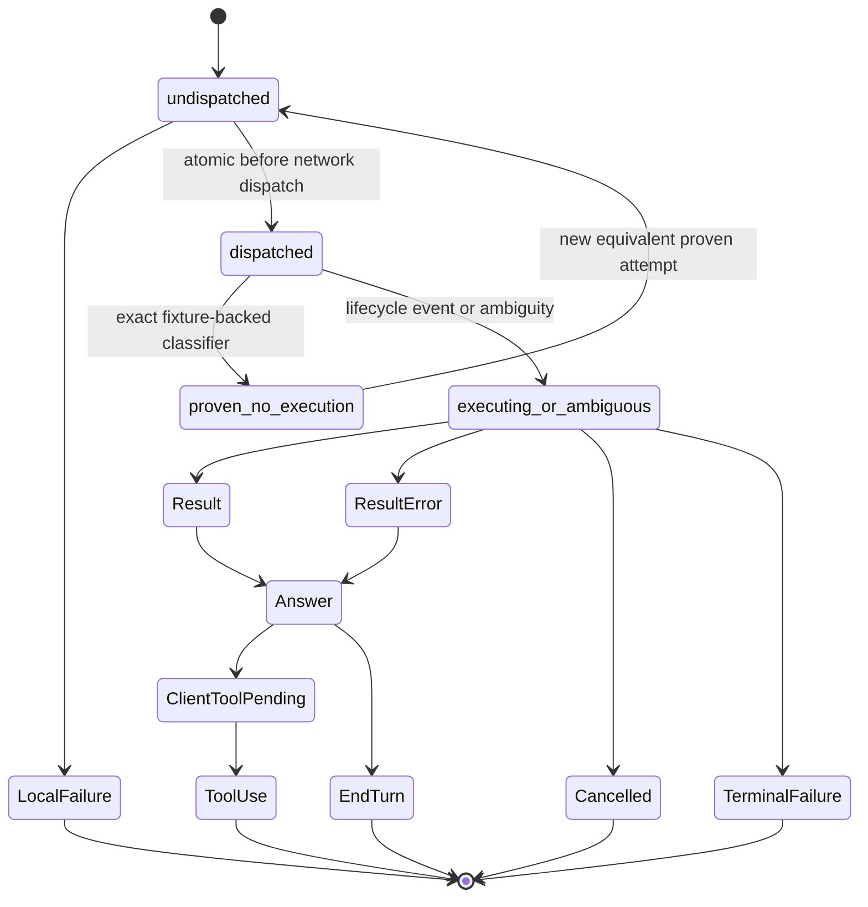

# Provider Server-Tool Capability Architecture and Native Web Search - Plan

## Goal Capsule

- **Objective:** Make Anthropic server tools a first-class, capability-routed protocol in better-ccflare, then ship `web_search_20250305` through a fixture-proven Codex Responses contract without silently converting it into a client function.
- **Product authority:** This Product Contract synthesizes the 2026-07-29 Claude Code incident, the user's decision to build a generic provider-capability architecture with Codex first, current `origin/main`, and current official Anthropic, OpenAI, Codex, and xAI contracts.
- **Execution profile:** Test-first, implementation in a fresh worktree, focused draft PRs, static capability proof plus a default-off production gate, and operator-driven Claude Code dogfooding only after fake-upstream and fixture gates pass.
- **Performance posture:** Derive requirements once from the already parsed request, use frozen in-memory capability descriptors, add no ordinary-path network or database operation, retain no request in a capability cache, and stream bounded semantic state.
- **Safety boundary:** Never automate or `curl` the Anthropic endpoint or the configured Codex subscription account. Use fake upstreams and committed sanitized fixtures; use a real Claude Code session for the final Codex canary. Do not claim that WebFetch is fixed by this work.
- **Stop conditions:** Stop Codex-specific implementation after fixture characterization—and stop enablement in every case—if the exact endpoint/auth/model fixture does not prove native web search, if requested restrictions cannot be preserved, if result provenance cannot be emitted honestly, if a retry can duplicate hosted execution, or if replay-key backup, restoration, rotation, disablement, or downgrade preflight fails. Provider-neutral U1-U4 may proceed inactive while the Codex proof gate is unresolved.
- **Open blocker:** The public OpenAI Responses contract is not proof of the private ChatGPT Codex subscription endpoint. U5 may perform fixture-only characterization, but no production Codex request, response, retry, or capability implementation begins until a naturally initiated Claude Code search through the exact endpoint/auth/model tuple yields a sanitized manifest that passes the private-endpoint proof gate.

## Product Contract

### Summary

The incident was not a search-quality failure. Claude Code sent an Anthropic server-tool declaration:

- `type: "web_search_20250305"`
- `name: "web_search"`
- server-owned limits and filters such as `max_uses` and `allowed_domains`

The Codex adapter erased that execution contract, converted the declaration to a Responses `function`, received a `function_call`, and translated it back to Anthropic `tool_use`. Claude Code correctly treated that as a client-executed tool call rather than the expected server-owned search lifecycle, resulting in `Did 0 searches`.

The permanent correction is a semantic architecture:

1. Distinguish client functions from provider-hosted server tools by protocol type, never by display name.
2. Derive an immutable request requirement once and route only to exact capability-proven account/endpoint/model tuples.
3. Let the provider build one immutable per-attempt transport plan after the concrete model is known, while the proxy separately owns the request execution ledger that governs dispatch, retries, cancellation, and failover.
4. Translate provider-native hosted-search events into valid Anthropic server-tool blocks, citations, errors, usage, and terminal behavior.
5. Preserve later-turn continuity with versioned authenticated-encryption envelopes and a provider-neutral projection of the evidence the upstream actually exposed.
6. Treat dispatch of a hosted search as a stricter retry boundary than ordinary downstream byte commitment.
7. Keep WebFetch separate because its failed domain-safety preflight is owned by the Claude Code client and did not traverse better-ccflare.

### Actors

- **A1. Claude Code / agent client:** Declares client functions and Anthropic server tools, consumes streamed or JSON Anthropic responses, and replays prior assistant content on later turns.
- **A2. Operator:** Configures accounts, endpoints, models, rollout flags, replay keys, and deployment; performs the final real-client canary.
- **A3. Proxy/router:** Parses the request once, filters candidates, preserves affinity and priority only among capable candidates, and owns failover before hosted execution becomes ambiguous.
- **A4. Provider capability resolver:** Evaluates the exact account/auth/endpoint/model/tool/options tuple using static proof descriptors plus bounded process-local drift suppression.
- **A5. Provider transport adapter:** Builds a request-scoped transport plan and maps between Anthropic semantics and a provider-native API.
- **A6. Hosted-search lifecycle reducer:** Converts native tool activity, sources, citations, usage, and errors into one canonical semantic lifecycle shared by streaming and non-streaming output.
- **A7. Replay codec:** Issues and validates proxy-owned opaque envelopes without persistent state.
- **A8. Codex Responses upstream:** Executes provider-owned search and returns native lifecycle/output items. xAI remains an explicitly unsupported routing candidate in this plan.
- **A9. Claude Code WebFetch preflight:** A separate client-owned safety boundary that may call Anthropic domain metadata directly and is outside the proxy data path.

### Key Flows

#### F1. Ordinary client functions remain ordinary

- **Trigger:** A Claude request contains only input-schema tools, including a client function whose name happens to be `WebSearch`.
- **Flow:** Requirement extraction returns no server-tool requirement. Existing account selection, provider URL, request translation, response translation, tool-use stop reason, caching, and failover behavior continue unchanged.
- **Terminal state:** The client receives the same ordinary `tool_use` behavior as before this feature.
- **Covered by:** R1, R5, R17, R28-R31.

#### F2. Streaming native WebSearch succeeds

- **Trigger:** A streaming request declares the exact supported `web_search_20250305` contract and a capable route is available.
- **Flow:** The router admits only a proven tuple; the attempt plan selects the native Responses contract; the upstream executes search; the reducer emits paired `server_tool_use` and `web_search_tool_result` blocks, grounded text and citations, usage, and one terminal sequence.
- **Terminal state:** `end_turn` when no client function remains outstanding, or `tool_use` only when a separate client function call is outstanding.
- **Covered by:** R2-R11, R18-R24, R30.

#### F3. Non-streaming parity

- **Trigger:** The same semantic request has `stream: false`.
- **Flow:** Codex still streams upstream. One canonical reducer emits typed semantic events directly to independent Anthropic SSE and JSON sinks; the JSON path never encodes SSE and parses it back.
- **Terminal state:** JSON content, usage, and stop reason are logically identical to F2.
- **Covered by:** R6-R11.

#### F4. Mixed server and client tools preserve ownership

- **Trigger:** A request declares native WebSearch plus client functions such as `Read`, `Bash`, or `StructuredOutput`.
- **Flow:** Only the server declaration becomes a native hosted tool. Client functions remain Responses functions. Native search may complete before a later client function call.
- **Terminal state:** Search blocks precede the client `tool_use`; Claude Code executes only the client function; only that outstanding client call produces `stop_reason: "tool_use"`.
- **Covered by:** R1-R7, R9-R11.

#### F5. Capability-aware routing and fallback

- **Trigger:** The candidate pool contains a mix of supported, unsupported, unknown, cooled, or model-incompatible tuples.
- **Flow:** Capability filtering occurs before priority, affinity, combo ordering, token refresh, and upstream I/O. Every physical-model fallback is rechecked. Only semantically equivalent candidates enter the attempt queue.
- **Terminal states:** A capable candidate succeeds; all capable candidates are temporarily unavailable; or no configured tuple implements the requested contract.
- **Covered by:** R17-R23.

#### F6. No capable route fails explicitly

- **Trigger:** The request is valid, but every configured route is unsupported or unknown.
- **Flow:** The proxy performs no provider request and returns an Anthropic-shaped, machine-readable capability-unavailable error. A valid contract with temporarily unavailable proven routes stays distinct from an unsupported contract.
- **Terminal state:** One local error; no account health, usage, affinity, or cooldown mutation.
- **Covered by:** R18-R21.

#### F7. Forced routing remains exact

- **Trigger:** An operator force-routes to one account.
- **Flow:** That exact account/endpoint/model tuple is evaluated. An unsupported, unknown, cooled, or drift-suppressed target fails closed.
- **Terminal state:** The selected account serves the request or a typed force-route error is returned; another account is never substituted.
- **Covered by:** R18-R21.

#### F8. Later-turn continuation does not repeat search

- **Trigger:** A later Claude turn replays proxy-issued `server_tool_use`, `web_search_tool_result`, and citation blocks.
- **Flow:** The codec authenticates and decrypts every proxy envelope against the trusted replay audience, conversation lineage, call ID, exact tool variant, visible query digest, result/error state, and ordered evidence. It then projects bounded source evidence through a length-framed structured untrusted-data representation. Historical search blocks never become a new hosted-tool declaration.
- **Terminal states:** Continuation succeeds across any provider that declares the required input replay projection, or fails before upstream I/O when an envelope is invalid or the required input/output replay mode is unavailable.
- **Covered by:** R12-R16, R40.

#### F9. Native Anthropic replay stays native

- **Trigger:** A conversation contains opaque Anthropic `encrypted_content` or `encrypted_index` that was not issued by better-ccflare.
- **Flow:** The requirement extractor marks the history as native-Anthropic replay. The proxy neither decrypts nor normalizes the payload and admits only a native Anthropic-capable route.
- **Terminal state:** Native passthrough succeeds, or the proxy reports that no compatible replay route is available.
- **Covered by:** R15, R18-R21.

#### F10. Failure, zero-result, and cancellation semantics stay distinct

- **Trigger:** A search returns no matches, a provider-native search error, malformed/out-of-order events, an ambiguous disconnect, or a client cancellation.
- **Flow:** Empty results remain successful; proven hosted-tool failures map to an Anthropic result error; protocol loss after dispatch terminates once; client cancellation aborts the upstream and releases state.
- **Terminal state:** One honest result/error/cancellation outcome with no fabricated sources and no duplicate hosted search.
- **Covered by:** R7-R10, R24-R26, R30.

#### F11. Capability drift is contained

- **Trigger:** A tuple recorded as proven returns a fixture-recognized pre-execution unsupported-tool or unsupported-field response.
- **Flow:** The request execution ledger first proves that the provider rejected the attempt without executing search. Only then is the exact candidate proof tuple marked drifted in a bounded process-local registry for the service lifetime; the attempt may move to another proven-equivalent tuple and emits an operator-visible low-cardinality event naming the proof owner and required revalidation. The operator disables affected admission until refreshed fixtures, a new proof revision, focused gates, and a reviewed release restore support.
- **Terminal state:** Another capable route succeeds or one explicit capability-drift error is returned. Ordinary account health and durable cooldown state are not changed.
- **Covered by:** R21, R24-R25, R33.

#### F12. Rollout and WebFetch boundaries remain honest

- **Trigger:** The feature is enabled, disabled, rolled back, or a WebFetch domain preflight fails.
- **Flow:** The rollout gate controls new server-tool admission only. Replay readers, response parsers, and the required decryption key IDs remain deployed at or above the decoder-compatible rollback floor. WebFetch failures are documented as client-owned and are not converted into server-tool routing.
- **Terminal state:** Existing search-bearing conversations remain parseable after rollback; WebFetch remains a separately diagnosable client behavior.
- **Covered by:** R34-R39.

### Requirements

#### Protocol and response fidelity

- **R1.** Parse Anthropic tools as a discriminated union. Client functions and server tools with the same name remain different execution classes.
- **R2.** The first production contract is exactly `web_search_20250305`. Later dated variants, unknown server tools, and provider-specific extras remain unsupported until separately proven; dated Anthropic variants are capability keys, not an automatic upgrade chain.
- **R3.** Validate every requested semantic before upstream I/O. For the first Codex profile this includes allow/block domain exclusivity, domain/path preservation, approximate user location, `max_uses`, mixed-tool behavior, and the supported `tool_choice`/parallelism subset.
- **R4.** Never silently drop, broaden, rename, or convert an unsupported server-tool option. An unrepresentable restriction fails explicitly.
- **R5.** Requests without a server-tool requirement preserve the existing ordinary client-function path, including a client function named `WebSearch`.
- **R6.** Represent hosted search with a canonical lifecycle independent of the native provider event names: declared, dispatched, query-known, searching, result or result-error, cited answer text, and terminal.
- **R7.** Emit valid paired Anthropic `server_tool_use` and `web_search_tool_result` blocks with stable linkage and correct ordering. A server tool never becomes client `tool_use`.
- **R8.** Construct result and citation evidence only from provider-exposed source records and URL annotations. Preserve URL, title, page age, and cited text when present; never invent page content, source titles, queries, or citation provenance.
- **R9.** Distinguish successful zero results from hosted-tool failure. Map only fixture-proven native failures to Anthropic `web_search_tool_result_error`; unknown post-dispatch loss maps conservatively to unavailable/protocol failure.
- **R10.** Add `usage.server_tool_use.web_search_requests` only when the exact completed search-call count is known. Preserve current token/cache accounting and do not infer successful or billable calls from HTTP status or token usage alone.
- **R11.** Streaming and non-streaming responses consume the same typed canonical lifecycle and produce logically identical content blocks, citations, usage, and stop reason through separate direct sinks. The non-streaming path must not serialize Anthropic SSE and parse it back.

#### Continuation and evidence integrity

- **R12.** Enabling hosted search requires a stable, separately purposed AEAD keyring loaded through proxy configuration from a protected key file. The file names an explicit active key ID plus retained decrypt-only keys; array order never selects the writer. No provider singleton reads key material from the environment, and there is no plaintext fallback or ephemeral process key.
- **R13.** Emit versioned bounded envelopes in `encrypted_content` and `encrypted_index`. Canonical associated data contains only values reconstructible before decryption from the protected token header plus surrounding visible conversation: protocol/version/suite/key ID, exact server-tool variant, trusted replay audience and conversation lineage, call ID, normalized visible-query keyed digest, result/error state, evidence ordinal/linkage, and visible-field digests. Authenticated ciphertext stores provider/model provenance, fidelity level, issuance time, bounded evidence, and keyed digests rather than duplicating large visible strings; it contains no credentials, prompt bodies, or unexposed page content.
- **R14.** Validate envelope prefix, key ID, AEAD tag, schema, size, audience, conversation/call linkage, query/result state, evidence order, and visible-field digests before using replay evidence. Unknown key, bad tag, malformed schema, wrong linkage, truncation, and context mismatch return the same client-visible invalid-envelope class. Cap aggregate envelopes at 512, encrypted input at 1 MiB, replay tokens at 4 KiB each, and decrypt attempts at the number of unique envelopes before any provider I/O.
- **R15.** Project valid proxy-owned results into a canonical length-framed structured untrusted-data representation containing only normalized source metadata and cited excerpts. Accept only canonical HTTP(S) URLs without credentials or control characters; never dereference replay URLs, forward proxy envelopes upstream, include raw provider error/page bodies, or treat retrieved text as instructions or system context.
- **R16.** Preserve native Anthropic opaque search payloads byte-for-byte and route them only where that native replay contract is supported. Do not present proxy-owned evidence as native Anthropic hidden state.
- **R17.** Historical server-tool blocks never trigger a new search. Mixed chronology among prior server results, assistant text, client function calls, and client tool results must be preserved.

#### Capability, planning, and routing

- **R18.** Derive a frozen, bounded server-tool requirement from the winning final post-interception `RequestBodyContext` and carry it in `RequestMeta`; retain that parsed context rather than reparsing its buffer, and do not retain or clone the full tool registry in capability state. `sourceBodyParseCount` may reflect adapter-owned parsing but must not increase versus the ordinary baseline.
- **R19.** Resolve support as `proven`, `unsupported`, or `unknown` for each concrete routing candidate, keyed by candidate ID, provider alias/fallback resolution, auth/endpoint contract, normalized endpoint, concrete physical model or proven family, exact tool variant, requested option profile, `inputReplayMode`, and `outputReplayMode`. A pre-indexed proof descriptor records fixture/contract revision, provenance, owner, last verification, and revalidation triggers. Revalidation is mandatory when the exact tuple, endpoint/auth contract, admitted tool profile, provider/client contract version, replay decoder, or observed behavior changes. After a drift event, process restart or a flag toggle cannot count as restoration: refreshed fixtures, a new proof revision, focused gates, code review, and a release are required.
- **R20.** Filter unsupported, unknown, drift-suppressed, or keyring-ineligible candidates before session affinity, cache affinity, combo ordering, token refresh, or transport. Store the decision/proof key on the candidate sidecar or by candidate ID; account-wide exclusions are insufficient for duplicate combo slots and model overrides. If capability filtering empties the pool, return the semantic local error before any unauthenticated-forwarding fallback.
- **R21.** Force routes fail closed. Local errors distinguish invalid/unsupported semantics, no configured implementation, temporarily unavailable proven capacity, invalid replay, and force-route incapability. Capability mismatch does not mutate account health or usage.
- **R22.** After the concrete physical model is finalized and before credential resolution, materialize an immutable provider attempt plan through an optional provider planning seam. It binds target URL/API family, physical model, request/response mappers, exact capability proof key, input/output replay modes, data-only retry policy, and a provider-specific proven-no-execution classifier. Proxy execution state is not stored in this plan. Legacy providers synchronously snapshot current `prepareRequest()`/`buildUrl()`/transform behavior into the same immutable shape using one request-scoped account view across every hook; legacy temporary fields may never mutate or be read from the shared `Account`.
- **R23.** Recompute the plan for every account, combo slot, and physical-model fallback. Immediately before transform/transport, resolve the provider through the same alias/fallback path used for execution and require exact equality with the candidate-scoped proof key; configuration/model races fail over locally without sending an incompatible request.

#### Retry, cancellation, and drift

- **R24.** One request-level dispatch ledger governs account/model fallback, thinking retry, cache-control retry, prompt-breakpoint retry, 529 retry, context-overflow handling, retained terminals, degraded-mode recovery probes, semantic rescue/liveness, and account failover. Its monotonic states are `undispatched -> dispatched -> proven_no_execution | executing_or_ambiguous`. The transition to `dispatched` occurs atomically before network dispatch; only the attempt plan's fixture-proven classifier can reopen equivalent-route failover through `proven_no_execution`. Missing/ambiguous policy, redirects, generic 400/5xx, generic context-length classification, EOF, raw-silence timeout, protocol loss, cancellation, or any hosted lifecycle event become non-replayable even if no client byte was written.
- **R25.** A fixture-recognized unsupported-tool/field rejection from a proven tuple may mark only that exact tuple as drifted in a bounded process-local registry for the service lifetime. It does not become an account cooldown, a database write, or an opportunistic probe of an unknown tuple. The drift event must identify the proof revision and owner, trigger the documented admission-disable and revalidation runbook, and remain unresolved operationally until R19's proof-renewal release completes.
- **R26.** Client cancellation at any phase aborts the active upstream, releases readers/listeners/buffers, emits no synthetic completion, and never starts fallback.
- **R27.** Server-tool-bearing requests are ineligible for cache keepalive, generic body replay, or any outer retry/rescue path that could repeat a hosted search. Every in-process retry entry point must consult the single dispatch ledger, including response abandonment and provider-specific fallback paths. The proxy may emit `RECOVERY_STATUS_HEADER=exhausted` plus `RECOVERY_SCOPE_HEADER` and thereby authorize a guard-correlated finite-recovery retry only while hosted state remains `undispatched` and no provider send occurred. Once state is `dispatched` or ambiguous, the response omits recovery authorization and terminates non-replayably. A client-supplied recovery marker or guard-correlation value never authorizes replay.

#### Performance, resource, and privacy

- **R28.** Ordinary requests add zero network calls, zero database reads or writes, zero durable state, and zero increase in `sourceBodyParseCount` versus the current baseline.
- **R29.** Requirement extraction performs one `tools` scan plus one bounded historical-block scan. Let `T` be tools, `B` history blocks, `A` distinct concrete candidate/model tuples after combo/model expansion, `Q` capability atoms (new exact server-tool declarations plus distinct input/output replay obligations), `E` attempts reaching the pretransport proof-equality gate, and `D` actual network dispatches. Request work is `O(T+B+A×Q)` using pre-indexed O(1) proof descriptors. Hard counters require `historyBlockVisits <= B`, `proofLookups <= A×Q`, `candidateEvaluations <= A`, `pretransportEqualityChecks <= E`, and `D <= E`; benchmark declaration-bearing, replay-only, long-history, and duplicate-account combo cases as well as 145 tools.
- **R30.** Reuse the independent SSE frame/tail and 4 MiB translated-output policies while adding explicit hosted-state bounds: at most 8 active hosted calls, 64 unique sources per call and 256 per response, 256 citations per response, 8 KiB URL, 2 KiB title, 8 KiB cited text, 4 KiB replay token, 512 aggregate envelopes, and 1 MiB live compact hosted semantic state. The reducer emits typed events directly to streaming and JSON sinks, releases one call's assembly at its item completion or in-band result error, releases citation assembly at block completion, retains compact provenance until message terminal, and never shares the 64 KiB function-argument buffer.
- **R31.** On the same host and fixture, the ordinary 145-function-tool path must show no more than 5% median transform/routing wall-time regression and no more than 0.25 ms p95 added batch-average CPU per request. Each run has 10,000 measured iterations partitioned into 100 consecutive batches of 100; each CPU sample is the batch `process.cpuUsage` delta divided by 100. Use at least five fresh-process ABBA baseline/branch pairs with a fixed Bun version, disabled logging/I/O, defined warmup, and monotonic wall time; apply thresholds to the median of paired run-median wall deltas and paired run-p95 CPU-sample deltas and report dispersion. Heap observations are informational; deterministic no-I/O, parse/visit/capability counts, allocation-retention, backpressure, and buffer-cleanup assertions are merge gates.
- **R32.** One redaction contract covers logger fields, provider traces, request analytics/history, exception serialization, health output, committed fixtures, and client errors. Default output must not contain search queries, raw source URLs/titles, result bodies, replay plaintext/ciphertext, keys/key IDs tied to content, auth state, provider error bodies, or client prompt text; invalid-envelope variants are deliberately indistinguishable to the client.
- **R33.** Extend existing low-cardinality tracing with requested/applied variant, candidate-scoped capability/proof decision, endpoint contract, lifecycle counts, source/citation counts, observed versus provider-reported search usage, translation-loss flags, input/output replay modes, ledger state/retry eligibility, and drift events. Hash native lifecycle identifiers using the existing opaque-runtime-ID pattern.

#### Rollout and provider boundaries

- **R34.** New hosted-search admission is guarded by the strict default-off `CCFLARE_SERVER_TOOL_WEB_SEARCH=1` feature flag. Capability descriptors, output-replay readiness, and exact keyring configuration remain authoritative; the flag cannot make an unknown tuple supported.
- **R35.** Rollout first deploys compatible readers plus identical keyrings everywhere with admission off, proves old/new cross-process decoding, and only then enables writers. Before enablement, the operator must prove a protected backup can restore the full active/retained keyring into a clean reader, exercise rotation without changing the selected writer unexpectedly, disable new admission without losing history decode, and pass downgrade/rollback preflight at the decoder-compatible floor. A missing backup, failed restore, missing retained key, or incompatible downgrade blocks writers. Rollback disables new admission while leaving request-history decoding and response parsers at or above the decoder-compatible floor; after envelopes are emitted, rolling back below that floor or removing a required retained key is invalid. Normal key retirement is separate from emergency compromised-key revocation.
- **R36.** Before any production Codex request/response/retry/capability implementation begins, U5's bounded non-production characterization path must produce sanitized streaming and non-streaming fixtures from the exact private subscription endpoint/auth/model tuple and prove the admitted provider-wire profile. After U5-U8 are implemented and automated gates pass, a naturally initiated Claude Code canary must prove at least one recognized search and a successful following turn before production admission may be enabled. Public OpenAI support alone is insufficient for either gate.
- **R37.** Grok/xAI remains `unknown` and ineligible throughout this plan; ordinary xAI traffic remains Chat Completions. Only a separately approved follow-on plan may characterize the exact official-endpoint Responses contract and propose support after fixtures prove declaration, filters and limits, sources/citations, streaming and JSON, mixed tools, errors, usage, cancellation, and continuation.
- **R38.** WebFetch remains a separate Claude Code client/preflight boundary. This slice does not intercept domain metadata, enable undocumented bypasses, or advertise provider capability for WebFetch.
- **R39.** No database schema or persisted search-cost column is added. Wire-level search usage and low-cardinality logs are sufficient for this slice; any later persistence requires matching SQLite and PostgreSQL migrations.
- **R40.** Web results are untrusted data. The replay projection must preserve role/chronology, use canonical structured fields with escaping and length framing, normalize safe HTTP(S) URLs, and prevent delimiter closure, bidirectional/zero-width control tricks, result text, or provider errors from being promoted into system instructions, tool declarations, trusted routing metadata, or active URLs.

### Acceptance Examples

- **AE1. Ordinary client tool regression**
  - **Given:** A request contains 145 ordinary functions, including a client function named `WebSearch`.
  - **When:** It routes through Codex.
  - **Then:** No native server tool is created, existing function-call behavior and stop reason remain unchanged, and no new DB/network operation occurs.

- **AE2. Exact server-tool classification**
  - **Given:** Two declarations share a display name but one has `type: "web_search_20250305"` and the other has an input schema.
  - **When:** Requirements are extracted.
  - **Then:** Only the typed server declaration becomes a hosted-search requirement.

- **AE3. Unsupported semantics fail before transport**
  - **Given:** A request combines unsupported option fields, incompatible allow/block restrictions, or an unproved dated variant.
  - **When:** Validation runs.
  - **Then:** The proxy returns one typed Anthropic error with zero token refreshes and zero fetch calls.

- **AE4. Streaming search**
  - **Given:** A proven Codex tuple and a valid `web_search_20250305` request.
  - **When:** Codex performs one search and returns source-backed text.
  - **Then:** Claude receives ordered `server_tool_use`, successful `web_search_tool_result`, cited text, correct known search count, final text, and one terminal sequence.

- **AE5. Server-tool-only stop reason**
  - **Given:** Search completes and the model produces a final answer without a client function call.
  - **When:** Translation completes.
  - **Then:** `stop_reason` is `end_turn`, not `tool_use`.

- **AE6. Mixed tools**
  - **Given:** Native search and a client `Read` function coexist.
  - **When:** Search completes and the model calls `Read`.
  - **Then:** Search evidence precedes `Read`, only `Read` is emitted as `tool_use`, and `stop_reason` is `tool_use`.

- **AE7. Non-streaming parity**
  - **Given:** The same canonical lifecycle as AE4 and `stream: false`.
  - **When:** The direct JSON sink consumes the typed semantic events.
  - **Then:** Content blocks, citations, usage, and stop reason are logically identical to the streaming transcript, with zero hosted SSE reparses and one final JSON serialization.

- **AE8. Exact capability filtering**
  - **Given:** A higher-priority unknown tuple, a sticky unsupported tuple, duplicate combo slots for one account with different physical models, and a lower-priority proven tuple.
  - **When:** Selection runs.
  - **Then:** Only candidate IDs with exact proven proof keys are eligible; neither account-wide exclusion, priority, nor affinity restores an incapable route.

- **AE9. Physical-model recheck**
  - **Given:** An admitted account later selects a model fallback whose server-tool capability differs.
  - **When:** The attempt plan is recomputed.
  - **Then:** The fallback is used only if its exact tuple is proven; otherwise the attempt moves locally without upstream I/O.

- **AE10. No capable route**
  - **Given:** Every candidate is unsupported or unknown.
  - **When:** A valid server-search request arrives.
  - **Then:** No provider request occurs and the client receives a capability-unavailable error distinct from temporary pool exhaustion.

- **AE11. Force route**
  - **Given:** The request is forced to an unsupported, unknown, cooled, or drift-suppressed tuple.
  - **When:** Selection runs.
  - **Then:** It fails closed and does not substitute another account.

- **AE12. Successful zero results**
  - **Given:** The provider proves that search ran and returned no sources.
  - **When:** Translation runs.
  - **Then:** The result content is an empty success, search usage is counted when known, and no failover occurs.

- **AE13. Provider search error**
  - **Given:** The provider emits a fixture-proven hosted-tool failure.
  - **When:** Translation runs.
  - **Then:** The matching Anthropic result error is emitted without inventing a source or treating it as empty success.

- **AE14. No duplicate after dispatch**
  - **Given:** The ledger atomically entered `dispatched` and the connection becomes ambiguous before the first hosted-search event.
  - **When:** any account/model, thinking, cache-control, prompt-breakpoint, 529, semantic-rescue, or response-abandonment retry path evaluates the request.
  - **Then:** No same-account or cross-account replay occurs; one non-replayable terminal failure is returned.

- **AE15. Proven pre-execution failover**
  - **Given:** A proven tuple returns the exact fixture-backed status/code/header combination that guarantees no search executed, and an equivalent proven tuple remains.
  - **When:** classification runs.
  - **Then:** The ledger reaches `proven_no_execution`, the first proof tuple is suppressed for the process lifetime, and the second tuple may serve the request without changing account health. Matching prose in an error body alone cannot reopen replay.

- **AE16. Cancellation**
  - **Given:** The client disconnects before dispatch, while searching, after a result, or during final text.
  - **When:** cancellation propagates.
  - **Then:** the active reader/fetch is aborted, all state is released, no fallback begins, and no completion is fabricated.

- **AE17. Replay round trip**
  - **Given:** A prior response contains valid proxy-issued result and citation envelopes.
  - **When:** a later turn is routed through a different projection-capable provider.
  - **Then:** every envelope validates, visible fields match, evidence chronology is preserved as untrusted prior context, and the historical search is not executed again.

- **AE18. Replay tamper, recovery, and key rotation**
  - **Given:** An explicit active key ID, retained previous keys, a protected backup restored into a clean codec process, valid cross-process tokens, plus tampered, unknown/revoked-key, reordered-key-file, oversized, cross-conversation, wrong-call, reordered-evidence, query-substitution, and visible-field-mismatch tokens.
  - **When:** replay decoding runs in a fresh codec instance.
  - **Then:** backup restoration and rotation preserve active and retained previous-key decoding regardless of file ordering; every invalid token produces the same invalid-envelope class before upstream I/O; no plaintext or native-payload fallback exists.

- **AE19. Native Anthropic history**
  - **Given:** Prior blocks contain non-proxy Anthropic opaque payloads.
  - **When:** the next turn is routed.
  - **Then:** only a native-Anthropic replay-capable route is admitted and the bytes remain unchanged.

- **AE20. Rollback**
  - **Given:** Compatible readers and one keyring were deployed everywhere before writers; protected backup/restore, rotation, admission-disable, and decoder-floor downgrade preflights passed; then new search admission is disabled after conversations contain proxy replay envelopes.
  - **When:** old/new processes cross-decode during rolling deployment or an existing conversation continues after rollback.
  - **Then:** history decoding still works at the declared decoder floor; a newly declared search fails explicitly or selects another still-enabled proven route, and no emitted token depends on removed code or a lost normal-rotation key.

- **AE21. xAI unsupported boundary**
  - **Given:** xAI lacks any required fixture, including a lossless `max_uses` control for the actual request profile.
  - **When:** routing considers Grok.
  - **Then:** xAI remains unknown/ineligible and ordinary xAI Chat traffic is untouched.

- **AE22. WebFetch honesty**
  - **Given:** Claude Code rejects a WebFetch domain preflight without sending a nested proxy request.
  - **When:** the incident is diagnosed.
  - **Then:** logs/docs identify the client boundary; better-ccflare does not claim a provider or routing fix.

### Scope Boundaries

#### In scope now

- Generic typed request requirements and tri-state provider capability resolution.
- Immutable per-attempt transport planning and capability-aware account/model routing.
- Provider-neutral replay envelopes and prior-search evidence projection.
- Codex request/response/history support for fixture-proven `web_search_20250305`.
- Streaming/JSON parity, mixed client/server tools, citations, errors, usage, cancellation, and non-replayable dispatch semantics.
- Fake-upstream integration coverage, same-host performance evidence, feature-gated rollout, rollback-safe readers, and root documentation.

#### Deferred to a separate follow-on plan

- xAI Responses fixture characterization and implementation are not execution units in this plan. This plan proves only that xAI stays `unknown`/ineligible for Anthropic server tools and that ordinary xAI Chat behavior is unchanged. Any xAI work requires a new plan with its own Product Contract, fixture matrix, implementation units, verification contract, and focused PR.

#### Out of scope

- WebFetch preflight interception or undocumented Claude Code bypass settings.
- Anthropic search variants later than `web_search_20250305`.
- Other hosted tools such as code execution, file search, computer use, MCP, image search, or provider-specific tools.
- A public capability dashboard/API or persisted per-search cost analytics.
- Changes to `packages/openai-responses-adapter`; it translates the opposite direction and currently skipping built-ins is not this incident's causal path.
- A wholesale migration of ordinary xAI Chat traffic to Responses.
- A generic cross-provider protocol-model consolidation.
- Provider capability discovery via opportunistic production probes.
- Database-backed replay state.

### Success Measures

- A naturally initiated Claude Code WebSearch through a proven Codex tuple reports at least one search when the fixture query has sources, and the next Claude Code turn succeeds without re-running that historical search.
- A client function named `WebSearch` remains an ordinary function in request and response snapshots.
- All unsupported/unknown requests stop before provider I/O; all force routes remain exact.
- No generic retry occurs after hosted-search dispatch; zero results, provider errors, cancellation, and protocol corruption remain distinguishable.
- Ordinary traffic adds no DB/network operation, no `sourceBodyParseCount` increase, no retained capability state, and meets R31's fresh-process same-host benchmark.
- New admission can be disabled without breaking replay parsing for existing conversations.
- Grok remains explicitly unknown/ineligible for Anthropic server tools in this plan; no xAI Responses characterization or implementation is part of this Definition of Done.

## Planning Contract

### Current Architecture and Causal Seams

- `packages/proxy/src/request-body-context.ts` already owns one parsed representation of the request body.
- `packages/proxy/src/proxy.ts` finishes agent/model interception before `selectAccountsForRequest()`, making it the correct point to derive the final server-tool requirement.
- `packages/types/src/api.ts` carries request-local routing state through selection and attempts.
- `packages/proxy/src/handlers/account-selector.ts` owns forced, normal, and combo candidate filtering/ordering.
- `packages/proxy/src/handlers/proxy-operations.ts` resolves each provider and physical model, then builds the URL, transforms the request, performs fetch, classifies retry/failover, and invokes response translation.
- `packages/proxy/src/handlers/routing-attempt-ledger.ts`, added by `8be63a30a` and extended on current main by `2981805038`, already owns request-local account/model deduplication, retained terminal ownership, degraded-mode physical-attempt accounting, and `recoveryProbe` classification above normal/combo/model fallback loops. Hosted dispatch state must extend this authoritative ledger without replacing its degraded tracker or creating a parallel retry authority.
- Current main through `1933690a53` also adds degraded-mode ownership and trusted finite route-circuit recovery across `account-selector.ts`, `proxy-operations.ts`, `anthropic-semantic-preflight.ts`, `packages/types/src/routing-recovery.ts`, and the guard. The stable `RECOVERY_STATUS_HEADER`/`RECOVERY_SCOPE_HEADER` response contract and signed `GUARD_REQUEST_ID_HEADER` correlation envelope are pre-existing outer-recovery boundaries that server-tool routing must preserve and constrain by hosted dispatch state.
- `packages/providers/src/types.ts` has model capability and transform hooks but no feature/protocol capability or immutable request plan.
- `packages/providers/src/request-capabilities.ts` is the precedent for pure, network-free tri-state capability logic; server-tool support is orthogonal and belongs beside it, not inside context-window metadata.
- `packages/providers/src/providers/codex/provider.ts` currently:
  - types every Anthropic tool as an input-schema function;
  - maps every current tool to a Responses `function`;
  - understands only `text`, `tool_use`, and `tool_result` history;
  - commits/streams only output text and `function_call`;
  - reconstructs non-streaming JSON from that limited Anthropic SSE subset.
- `packages/providers/src/providers/xai/provider.ts` currently maps `/v1/messages` to `/v1/chat/completions`; official xAI hosted tools require a request-scoped Responses path.
- `packages/core/src/constants.ts` already separates 4 MiB SSE frame/tail and translated-output limits from 64 KiB function-argument limits.
- `packages/proxy/src/anthropic-sse-frame-classifier.ts` is the semantic progress/commit seam that must recognize populated server-result blocks.
- `packages/providers/src/providers/codex/stream-liveness.ts`, added by `465f34c48`, already serializes upstream reads, downstream heartbeat capacity, raw-silence deadlines, and cleanup. Hosted decoding must preserve its single-read/backpressure contract; synthetic heartbeats never prove execution or reopen retry.
- `packages/proxy/src/anthropic-semantic-preflight.ts` and `anthropic-semantic-liveness.ts` own current precommit rescue and postcommit liveness. Their ordinary retry semantics must be subordinate to hosted dispatch state once a server tool could execute.
- `packages/providers/src/providers/codex/trace.ts` and `opaque-runtime-id.ts` provide low-cardinality and privacy-safe observability patterns.
- The Bedrock response parser is the citation-safety precedent: validate representability and omit unsupported metadata rather than fabricate provenance.

### Official Contract Facts Versus Recommendations

| Topic | Current catalog/contract fact | Planning consequence |
|---|---|---|
| Anthropic server tool | `web_search_20250305`, `web_search_20260209`, and `web_search_20260318` are distinct current dated contracts. Server responses pair `server_tool_use` and `web_search_tool_result`; usage exposes `server_tool_use.web_search_requests`. | Key support by exact variant. Implement only `20250305` now and emit the native Anthropic lifecycle rather than client `tool_use`. |
| Anthropic replay | Search results and citations carry opaque `encrypted_content`/`encrypted_index` that must be echoed unchanged to native Anthropic. | Never fabricate native Anthropic state. Use an explicitly proxy-owned AEAD namespace for bridged evidence and keep native payloads pinned to native replay. |
| OpenAI web search | New Responses integrations use `{type:"web_search"}`. Output includes `web_search_call`, message URL citations, optional full sources, and streaming lifecycle events. `max_tool_calls` caps all built-in tools. | Request full sources. Map `max_uses` only when web search is the sole hosted tool. Treat private Codex parity as unknown until exact fixtures. |
| Codex | Official Codex material documents web-search features and public model support, but not the private `chatgpt.com/backend-api/codex/responses` wire contract. | Private-endpoint characterization fixtures are mandatory before production implementation; a final real-client canary is mandatory after U5-U8 and before production enablement. Public docs satisfy neither gate. |
| xAI | Official xAI Responses supports native `web_search`; Chat Completions supports functions, not hosted tools. Domain filters are limited to five and documented cap semantics are not equivalent to Anthropic `max_uses`. | This plan keeps Chat unchanged and xAI server-tool capability `unknown`. A separate follow-on plan must prove any future Responses attempt profile before implementation. |
| WebFetch | The observed failure occurs in Claude Code's direct domain-safety preflight and no corresponding better-ccflare request exists. | Document and diagnose separately; no proxy provider capability is claimed. |

Official references:

- Anthropic server tools: https://platform.claude.com/docs/en/agents-and-tools/tool-use/server-tools
- Anthropic web search: https://platform.claude.com/docs/en/agents-and-tools/tool-use/web-search-tool
- Anthropic tool versions: https://platform.claude.com/docs/en/agents-and-tools/tool-use/tool-reference
- OpenAI tools: https://developers.openai.com/api/docs/guides/tools
- OpenAI web search: https://developers.openai.com/api/docs/guides/tools-web-search
- OpenAI Responses streaming events: https://developers.openai.com/api/reference/resources/responses/streaming-events
- OpenAI deprecations: https://developers.openai.com/api/docs/deprecations
- Official Codex web search feature: https://learn.chatgpt.com/docs/web-search
- xAI web search: https://docs.x.ai/developers/tools/web-search
- xAI tool usage and billing: https://docs.x.ai/developers/tools/tool-usage-details
- xAI Chat versus Responses: https://docs.x.ai/developers/model-capabilities/text/comparison

### High-Level Technical Design

The diagrams express contracts and ownership, not exact implementation syntax.

```mermaid
flowchart LR
    CC["Claude Code / Anthropic Messages"] --> RBC["RequestBodyContext<br/>single parsed body"]
    RBC --> REQ["ServerToolRequirements<br/>frozen summary"]
    REQ --> META["RequestMeta"]
    META --> CAP["Candidate-scoped tri-state resolver<br/>endpoint + model + tool + options + input/output replay"]
    CAP --> SEL["Capability-first candidate filter<br/>proof key on candidate sidecar"]
    SEL --> PLAN["Immutable ProviderAttemptPlan<br/>provider-owned transport decision"]
    PLAN --> LED["Request Execution Ledger<br/>proxy-owned dispatch/retry state"]
    LED --> LEG["Legacy provider adapter<br/>ordinary requests"]
    LED --> CWA["Codex web-search decoder"]
    CAP -. "unsupported in this plan" .-> XAI["xAI remains unknown<br/>separate follow-on plan"]
    CWA --> UP["Provider Responses endpoint"]
    UP --> RED["Provider-specific native-event decoder"]
    RED --> LIFE["Shared canonical hosted-search lifecycle"]
    LIFE --> SSE["Direct Anthropic SSE sink"]
    LIFE --> JSON["Direct Anthropic JSON sink"]
    SSE --> CC
    JSON --> CC
    LIFE --> AEAD["Audience-bound AEAD replay envelope codec"]
    AEAD --> SSE
    AEAD --> JSON
```



```mermaid
sequenceDiagram
    participant C as Claude Code
    participant P as Proxy
    participant R as Capability Router
    participant U as Codex Responses
    C->>P: /v1/messages with web_search_20250305
    P->>P: Parse once and derive requirements
    P->>R: Candidate tuples + exact requirement
    R-->>P: Proven candidate + exact proof key
    P->>P: Build immutable provider plan; create undispatched ledger
    P->>P: Atomically mark dispatched
    P->>U: Native web_search request
    Note over P,U: Only an exact proven-no-execution classifier can reopen failover
    U-->>P: web_search_call started / query known
    P-->>C: server_tool_use
    U-->>P: completed call + sources
    P-->>C: web_search_tool_result with proxy AEAD envelopes
    U-->>P: cited answer text + usage
    P-->>C: text/citation deltas + end_turn
```



The provider-planning seam and proxy executor have deliberately different ownership:

- The optional provider planner receives one concrete candidate/model context and returns immutable data and bound mappers: target URL/API family, physical model, exact capability proof key, request mapper, native response decoder, `inputReplayMode`, `outputReplayMode`, data-only retry policy, and a bounded fixture-backed no-execution classifier.
- The proxy creates that plan after physical-model resolution and before credential refresh. It owns the mutable execution ledger, cancellation, account/model transitions, response commitment, retry/rescue decisions, and terminal client outcome.
- Legacy providers use a synchronous adapter that creates one request-scoped account view and snapshots `prepareRequest()`, `buildUrl()`, transform, process, and finalization behavior against that same view. Shared account objects are never decorated with temporary model/protocol fields. The default provider base class need not gain mutable state or change only to provide a no-op implementation.
- Every transform, response-finalization, retry, and failover call site receives the same plan and ledger explicitly. No singleton/account mutation or internal request header selects the protocol.

### Capability Contract

`ServerToolRequirements` is a compact request-local summary:

- new declarations, separated from historical server-tool blocks;
- exact family/version;
- normalized required option bits and bounded counts, never query text;
- whether client functions coexist;
- supported tool-choice/parallelism profile;
- separate input and output replay requirements: none, proxy-evidence-v1, or native-Anthropic;
- validation result and a stable low-cardinality requirement profile ID.

Each candidate produces a `ServerToolCapabilityDecision`:

- `status`: proven, unsupported, or unknown;
- candidate ID plus provider identity resolved through the same alias/fallback rules used by transport;
- `provider` and auth/endpoint contract;
- normalized endpoint identity without credentials or query strings;
- physical model or fixture-proven model family;
- tool version and option profile;
- `inputReplayMode` and `outputReplayMode`;
- request and response transport family;
- proof provenance, fixture manifest revision, and reason.

A bounded process-local drift overlay may turn a `proven` proof key into `drifted` only after the request ledger reaches `proven_no_execution` through the plan's exact classifier. Unknown tuples are never promoted by runtime traffic. A first-turn search still requires output replay readiness even when it has no replay input.

### Codex Option Profile

The first capability profile is admitted only when every requested field is lossless:

| Anthropic request semantic | Codex Responses mapping | Admission rule |
|---|---|---|
| `type: web_search_20250305` | `type: web_search` | Exact private-endpoint fixture required. Never use legacy `web_search_preview`. |
| `allowed_domains` | `filters.allowed_domains` | Preserve paths/order after validation; exact fixture required. |
| `blocked_domains` | `filters.blocked_domains` | Mutually exclusive with allowed domains; exact fixture required. |
| approximate `user_location` | native user location | Admit only fixture-proven fields; reject unknown fields. |
| `max_uses` | `max_tool_calls` | First profile admits integer values 1-8 only and only when web search is the sole hosted built-in. Ordinary client functions do not consume this built-in cap; larger values remain unsupported until resource/profile proof changes the declared bound. |
| no explicit or `auto` tool choice | provider auto | First supported profile. Forced server-tool choice and incompatible parallelism remain unsupported until fixtures prove them. |
| mixed client functions | Responses `function` tools beside native web search | Function names/schema and existing orchestration filtering remain unchanged. |
| full sources | `include: ["web_search_call.action.sources"]` | Required for a proven result-fidelity profile. URL annotations are a secondary source record, not permission to invent missing evidence. |

### Response and Replay Contract

- A provider-specific decoder consumes native events and emits canonical lifecycle events. The shared lifecycle and Anthropic encoder live under `packages/providers/src/server-tools/`; the Codex adapter decodes only its fixture-proven native event shapes. Any future xAI adapter must be designed and proven in its separate follow-on plan.
- `server_tool_use` is emitted when a stable call ID and query/input are known.
- `web_search_tool_result` is emitted as one complete block when source evidence or a proven empty-result state is known.
- URL citations are attached only when offsets can be validated against the exact emitted text. `cited_text` is sliced from that output; invalid offsets are a fidelity error, not a guessed citation.
- Proxy envelopes pin the v1 wire suite as `bccf1.A256GCM.<kid>.<nonce>.<ciphertext-and-tag>` using unpadded base64url segments, AES-256-GCM, a 32-byte key, a fresh independent 12-byte nonce from the OS CSPRNG, and a 16-byte authentication tag. Header/AAD and plaintext use schema-defined positional UTF-8 JSON tuples so byte encoding is deterministic across processes. Version and suite are authenticated; unknown versions/suites, padded/non-canonical encodings, unsafe key IDs, RNG failure, and downgrade attempts reject uniformly. Nonces are never derived from time, user input, or plaintext. This stateless design provides probabilistic nonce uniqueness, not an atomic cross-process guarantee: the operational AES-GCM budget is fewer than `2^32` envelopes per key, with rotation/alert at `2^31`, based on trustworthy fleet telemetry. If that fleet count is unavailable, admission remains off.
- `CCFLARE_SERVER_TOOL_REPLAY_KEYS_FILE` points to a protected service-readable JSON key file containing an explicit `activeKeyId` and keys with stable IDs/status. The path may be configured through the environment; key material may not. The loader rejects duplicate IDs, weak keys, absent active IDs, group/world-readable files, and invalid retention/revocation state, then injects the codec through config -> `ProxyContext` -> attempt plan.
- A trusted replay audience is derived from the authenticated ingress API-key identity plus a stable client session/affinity lineage. If the request lacks enough trusted identity to bind durable replay, output replay is ineligible and a new hosted search fails before upstream I/O.
- The decoded projection contains only evidence the provider exposed, represented as escaped, length-framed structured fields. URLs must be canonical credential-free HTTP(S), are never dereferenced during replay, and remain ordinary untrusted text in assistant-history chronology. The projection does not claim hidden provider state and never becomes a new tool declaration.
- Normal rotation retains old readers and keys until the documented conversation drain passes. Compromised-key revocation is an explicit incident action that may intentionally invalidate affected history and must not be disguised as normal rollback.

### Error Taxonomy

| Class | Example | Client/result behavior | Routing effect |
|---|---|---|---|
| Invalid or unsupported request semantics | Unknown server tool, later variant, unrepresentable restriction | Anthropic `invalid_request_error`, HTTP 400, stable capability code | No provider call |
| Invalid replay envelope | Unknown/revoked key, bad tag, malformed/truncated token, wrong audience/call/query/order/linkage | One uniform Anthropic invalid-replay error with no oracle detail | No provider call and no native fallback |
| Server configuration unavailable | Replay keyring absent/invalid while feature is requested | Anthropic-shaped API/configuration error, HTTP 503 | No provider call; operator action |
| No configured implementation | All tuples unsupported/unknown | Typed capability-unavailable error | No provider call; no account mutation |
| Proven capacity temporarily unavailable | Capable tuples exist but are cooled/paused/exhausted | Existing typed pool/route unavailable semantics with capability detail | Retry only at existing safe outer boundary |
| Forced tuple incapable | Unsupported/unknown/cooled/drifted target | Typed force-route-unavailable error | No substitute account |
| Proven no-execution rejection | Exact unsupported field/tool, auth, or capacity response backed by fixture | Fail over only to an equivalent proven tuple when policy allows | Optional process-local drift suppression |
| Hosted-tool result error | Native search error with proven mapping | In-band `web_search_tool_result_error` | No duplicate search |
| Ambiguous post-dispatch failure | EOF/timeout/protocol loss after request could execute | One non-replayable terminal error | No fallback |
| Client cancellation | Abort at any lifecycle phase | No fabricated completion | Abort and release |

### Key Technical Decisions

- **KTD1. session-settled: Build a generic capability architecture and ship Codex first.** Provider/tool contracts are generic; the first proven vertical slice is `web_search_20250305` over Codex. Grok remains `unknown` in this plan, and a separate follow-on plan owns any future fixture gate.
- **KTD2. session-settled: Fail explicitly instead of silently degrading.** A server tool never becomes a client function, and an unsupported restriction is never dropped.
- **KTD3. Use candidate-scoped exact tri-state proof, not provider/account booleans.** Duplicate combo slots and physical-model overrides can differ even on one account. Candidate ID, endpoint/auth mode, resolved provider alias, physical model, tool version, option profile, and separate input/output replay modes all participate in the proof key.
- **KTD4. Filter capability before affinity and transport.** Capability is a hard eligibility predicate; priority and stickiness choose only among eligible candidates.
- **KTD5. Split immutable provider planning from mutable proxy execution.** The provider plan binds URL, mappers, proof key, replay modes, retry data, and the exact no-execution classifier after the concrete model is known. A separate request execution ledger owns dispatch, retries, and terminal state. Mutable provider-singleton flags, account mutation, client-controlled internal headers, and transform-time URL inference are rejected.
- **KTD6. Keep the ordinary provider interface compatible without preserving shared-account mutation.** Optional `Provider.createAttemptPlan(context)` wraps legacy providers synchronously using one request-scoped account view across prepare, URL, transform, response, and finalization hooks. This preserves behavior without leaking temporary fields across concurrent requests; the provider base class need not change merely to supply a default.
- **KTD7. Share lifecycle and Anthropic encoding, not unproved provider wires.** Put the canonical hosted-search reducer and Anthropic server-tool encoder in shared `server-tools` modules. Codex and future xAI adapters decode native events only until fixtures prove any wire-level reuse.
- **KTD8. Pin an audience-bound replay wire suite with explicit key activation.** One-shot-only success would break the next Claude turn; bearer tokens without conversation/call/query binding are transferable; algorithm agility without an authenticated suite invites downgrade; order-selected or environment-carried keys make rotation unsafe. `bccf1` pins AES-256-GCM, canonical tuple encoding, independent 96-bit OS-CSPRNG nonces, 128-bit tags, unpadded base64url, protected key files, explicit active key IDs, retained decryptors, keyed visible-field digests, an honestly operational—not atomically enforced—fleet issuance budget, and decoder-floor rollout.
- **KTD9. Distinguish proxy evidence from native Anthropic hidden state.** Proxy evidence is portable through an explicit untrusted projection. Native Anthropic opaque content stays byte-exact and native-route-only.
- **KTD10. One request-level dispatch ledger is the duplicate-execution authority.** Generic precommit retry is too late for billable hosted tools, and separate flags drift across rescue paths. The atomic ledger covers every account/model/provider retry; only an exact fixture-proven no-execution classifier can reopen equivalent failover after dispatch.
- **KTD11. Keep drift suppression process-local and proof-scoped.** It contains a newly rejected proven tuple without turning capability into account health or adding a DB write. Recovery requires refreshed fixtures, a superseding proof revision, focused gates, review, and a release; restart or a flag toggle never restores proof, and an opportunistic unknown-provider probe cannot do so.
- **KTD12. Use explicit hosted-state bounds inside existing independent envelopes.** Typed semantic events flow directly to SSE and JSON sinks; non-streaming never reparses SSE. Per-field, call, source, citation, envelope, decrypt-attempt, and 1 MiB live-state caps sit inside the existing 4 MiB translated-output policy and never reuse the 64 KiB function-argument cap.
- **KTD13. Preserve wire usage without expanding persistence.** Emit known Anthropic server-tool usage and low-cardinality trace counters; defer DB schema/cost analytics.
- **KTD14. Keep parsers active through rollback.** The flag stops new declarations but cannot strand history already containing proxy envelopes.
- **KTD15. session-settled: WebFetch is separate.** The proxy neither intercepts Claude Code's domain metadata preflight nor enables undocumented bypasses.
- **KTD16. Land focused forward changes.** Foundation/routing, the Codex vertical slice, and rollout/performance remain independently reviewable and reversible. xAI support is not one of these changes, and the reverse-direction OpenAI Responses adapter remains untouched.
- **KTD17. Treat search projection as structured hostile data.** Delimiters alone are not an isolation boundary. Escape and length-frame source fields, reject unsafe URL schemes/userinfo/control characters, omit raw pages/provider errors, and never dereference replay evidence.

### Alternatives Rejected

- **Name-based `WebSearch` handling:** Confuses ordinary client functions with Anthropic server tools.
- **Convert server search to a function and let Claude Code execute it:** Recreates the incident and changes ownership, billing, result shape, and retry semantics.
- **Provider-level `supportsWebSearch: boolean`:** Cannot represent endpoint, model, option, replay, or proof differences.
- **Select first and let transform fail:** Wastes credentials/latency, contaminates account health, and lets affinity pin an incapable route.
- **Mutable state on provider singletons:** Concurrent Chat/Responses requests can leak protocol state across attempts.
- **Account-wide hard exclusions:** Cannot distinguish duplicate combo slots or physical-model overrides on the same account.
- **Encode non-streaming output as SSE and parse it back:** Adds avoidable CPU, allocations, parser divergence, and a second resource envelope.
- **Unconditional xAI Responses migration:** Changes ordinary Grok caching, headers, usage, and response semantics outside the incident scope.
- **Signed but plaintext replay tokens:** Expose source metadata in an opaque field and do not meet the privacy posture.
- **Random placeholder `encrypted_content`:** Breaks continuation and falsely resembles provider-native state.
- **Database-backed replay:** Adds migrations, hot-path persistence, cleanup, and a new availability dependency.
- **Comma-ordered key material in an environment variable:** Makes active-key selection order-sensitive, exposes secrets broadly, and cannot express rotation versus emergency revocation safely.
- **Unpinned “any AEAD” envelope:** Makes cross-process decoding, rolling deploys, nonce discipline, and downgrade rejection impossible to verify as one stable wire contract.
- **Upstream response IDs as the replay contract:** Provider-specific, often unavailable, and not portable across failover.
- **Retry until downstream bytes commit:** Can duplicate a search that already executed upstream.
- **Automatically probe unknown capabilities:** Adds latency/cost and turns user traffic into an unsafe discovery mechanism.
- **Patch WebFetch by enabling a client bypass:** Weakens a separate safety boundary and is not a provider-routing correction.

### Resolved During Planning

- Continuation uses a stable AEAD keyring and proxy-owned evidence namespace; one-shot-only support is rejected.
- Unknown capabilities are ineligible on ordinary traffic.
- Proxy-owned evidence is provider-neutral and explicitly untrusted; native Anthropic opaque replay remains native-only.
- Input and output replay are separate capabilities; first-turn search requires an output-ready codec and trusted replay audience.
- `max_uses` maps to OpenAI `max_tool_calls` only when web search is the sole hosted built-in.
- The no-duplicate boundary is one atomic request ledger beginning before dispatch, with only fixture-proven no-execution exceptions.
- Streaming and JSON are direct sinks over one typed reducer; hosted SSE is never an internal JSON interchange.
- Key activation is explicit, key material comes from a protected file, protected backup/restore and rotation are proven before enablement, and rollback cannot cross the decoder-compatible floor after writers emit envelopes.
- Capability mismatch is not account health and causes no durable cooldown/write.
- Rollback keeps readers/decoders active.
- WebFetch remains out of scope.

### Deferred to Implementation Proof

These are contract gates, not permission to guess:

- Exact private Codex accepted request fields and event names for the selected model/auth tuple.
- Whether the private endpoint returns query text, full sources, zero-result evidence, URL annotation deltas, and exact search usage in the public Responses shapes.
- The exact provider-native failures that prove no search executed.
- xAI contract characterization is owned by a separate follow-on plan; this plan neither guesses nor gathers that proof and keeps xAI ineligible.

### System-Wide Impact

#### Interfaces and data flow

- `RequestMeta` gains a compact immutable requirements/replay constraint.
- The proxy request execution context owns the optional server-tool dispatch ledger; ordinary requests allocate none.
- `RoutingCandidateMetadata` gains a candidate-scoped capability decision/proof key so duplicate account slots and physical models remain distinct.
- `Provider` gains an optional pure capability resolver and optional attempt-plan seam; legacy behavior remains the default.
- `ProxyContext` receives the validated replay codec/keyring and feature admission state from central configuration; providers never read replay secrets or rollout flags directly.
- `proxy.ts` derives requirements after interception and before the first selection.
- `account-selector.ts` treats capability as a hard candidate exclusion while preserving aligned normal/combo metadata.
- `proxy-operations.ts` materializes one provider attempt plan after model resolution, creates/updates the separate execution ledger, and threads both through URL, transform, fetch, response translation, and every retry classification.
- Shared `server-tools` modules own the canonical lifecycle, Anthropic encoding, replay codec, and hostile-data projection; Codex owns only native request/event decoding plus its exact capability proof.
- The semantic SSE classifier learns that populated server-tool/result blocks are meaningful progress/commitment.

#### State lifecycle

- Request requirement: created once, immutable, released with the request.
- Attempt plan: created per concrete candidate/model attempt after model resolution and before credentials, immutable, released at terminal.
- Execution ledger: created once per logical request; monotonic across every account/model/provider retry and released only at terminal.
- Transient hosted-call assembly: at most 8 active calls; each entry is released at that call's native item completion or in-band result error.
- Compact provenance: at most 64 sources per call and 256 per response; retained only until citation/message terminal.
- Citation assembly: at most 256 citations; released at content-block completion.
- Field/envelope state: 8 KiB URL, 2 KiB title, 8 KiB cited text, 4 KiB replay token, 512 aggregate envelopes, 1 MiB encrypted input and 1 MiB live compact hosted state.
- Replay envelope: returned to the client and later validated statelessly; no server-side row/map survives the request.
- Drift overlay: bounded by proven tuples and service lifetime; no raw request/source data.
- Replay keyring: protected configuration injected through `ProxyContext`, initialized once with an explicit active key ID, never logged, and kept consistent across compatible readers.

#### Failure propagation

- Local validation/capability errors bypass provider/account health.
- Proven pre-execution capacity/auth handling may reuse existing provider-specific cooldown behavior.
- Generic server errors, redirects, cancellation races, and ambiguous transport failures do not replay a hosted search.
- Post-dispatch protocol/resource errors terminate exactly once and cancel upstream.
- Rollback disables admission while preserving historical readers.

#### Caching and synthetic traffic

- Existing prompt-cache semantics remain for ordinary requests.
- Server-tool-bearing bodies are never staged/promoted for keepalive or generic replay.
- Historical proxy evidence is context, not a new hosted declaration, and therefore does not re-execute.
- xAI cache-native Chat behavior remains unchanged unless a future request-scoped Responses plan is proven and selected.

#### Security and privacy

- AEAD provides confidentiality and integrity; trusted audience/conversation/call/query/state/order binding prevents cross-context bearer replay.
- Explicit active and retained key IDs support normal rotation; compromised-key revocation is a separate operator incident.
- Visible result fields are checked through authenticated keyed digests without duplicating large strings in ciphertext.
- Search content is escaped, length-framed hostile data; only canonical credential-free HTTP(S) URLs are retained and none are dereferenced during replay.
- One redaction contract covers logs, traces, analytics/history, exceptions, health, fixtures, and client errors. Invalid envelope causes are client-indistinguishable.
- Native Anthropic opaque payloads are never decoded or relabeled.

#### Operations and deployment

- Feature admission defaults off through `CCFLARE_SERVER_TOOL_WEB_SEARCH`.
- Deploy decoder-compatible readers and identical protected keyrings everywhere with admission off; verify old/new cross-process decoding before enabling a writer.
- Restore the protected backup into a clean reader, exercise active-key rotation with retained decryptors, prove admission disablement, and complete decoder-floor downgrade preflight before enabling a writer.
- Capability proof manifests and sanitized fixtures are code-reviewed artifacts with a named owner, last-verification record, revalidation triggers, and a release-based restoration procedure after drift.
- The final Codex check is a human-initiated Claude Code search through a test service, never a scripted provider call.
- Production deploy still builds from merged `refs/heads/main` using `scripts/deploy-ccflare.sh`; runtime SHA is verified through health.
- Disabling the flag is the first rollback. Decoder removal, downgrade below the decoder floor, or normal removal of a still-required decrypt key is invalid while conversations may contain emitted envelopes.

### Risks and Dependencies

| Risk/dependency | Impact | Mitigation / stop condition |
|---|---|---|
| Private Codex endpoint differs from public Responses | Request rejected or response silently empty | Exact sanitized fixture gate; capability remains unknown until proven. |
| Sources/citations unavailable or differently ordered | Fabricated or mismatched provenance | Require source/annotation proof; validate offsets; stop enablement if honest blocks cannot be built. |
| `max_uses` is not lossless | Search can exceed client limit | Map only for a single hosted built-in; reject otherwise; xAI remains unknown without proof. |
| Replay key loss/rotation or incompatible rollback | Existing conversations cannot validate envelopes | Protected key file and backup with explicit active ID; clean-reader restore test; reader-first rollout; old/new cross-decryption; rotation/disablement/downgrade preflight; decoder floor; retained prior keys; normal retirement and compromised-key revocation documented separately. |
| Replay token copied across contexts | Evidence from one tenant/conversation/call is accepted elsewhere | Bind AAD to trusted audience, conversation lineage, call/tool/query/state/order and fail uniformly before provider I/O. |
| Replay envelope/source state grows | Response, decrypt, or memory inflation | Numeric call/source/citation/field/token/envelope/live-state caps; keyed visible-field digests; release state at item/block terminal; N-1/N/N+1 tests. |
| Prompt injection or unsafe URL in web evidence | Later model follows retrieved instructions or a consumer activates hostile links | Escaped length-framed structured projection; HTTP(S)-only canonical URLs without credentials/control characters; no raw pages/errors or replay dereference; adversarial Unicode/scheme/delimiter tests. |
| Duplicate billable search | Cost and conflicting evidence | Dispatch-level non-replayable policy; allow only proven no-execution exceptions. |
| Retry path bypasses the duplicate guard | Thinking/cache/prompt-breakpoint/529/rescue/failover repeats execution | One request-level ledger checked at every retry boundary; default ambiguous/no-policy state is non-replayable; await-boundary and cancellation-race tests. |
| Capability drift | Repeated 400s, silent downgrade pressure, or support restored without renewed evidence | Exact process-local suppression and owner alert; disable affected admission; require refreshed fixtures, a new proof revision, focused gates, review, and release; no generic 400 classifier or restart-as-restoration. |
| Capability filter breaks combo/affinity alignment | Wrong account/model selected | Candidate-ID proof sidecars, duplicate-slot tests, shared provider alias resolution, exact equality recheck, and no unauthenticated fallback after semantic exhaustion. |
| Stream backpressure or state leak | Aggregate memory rises under slow clients or terminal waves | Explicit queue high-water, upstream read pause proof, per-stream aggregate formula, `P`/`2P` typical-load tests where `P` is at least 12 and no lower than configured/observed peak concurrency, isolated max-envelope tests, and counters returning to zero. |
| Ordinary-path regression | Higher latency or broken function tools | Legacy attempt-plan snapshot, Vertex same-account/different-model concurrency test, byte snapshots, no-I/O/count assertions, and fresh-process ABBA benchmark. |
| Decryption/logging oracle | Attackers distinguish key/tag/linkage errors or secrets escape diagnostics | Uniform invalid-envelope response plus a single sentinel-tested redaction contract across all output surfaces. |
| Rollback strands history | Next turn fails after feature disable | Readers/codec always active; only new declaration admission is gated. |
| xAI is accidentally admitted by the generic architecture | Ordinary Grok behavior or unsupported server-tool semantics change | Keep xAI explicitly `unknown`, assert ordinary Chat snapshots and local rejection, and require a separate follow-on plan before any Responses implementation. |
| WebFetch is mistaken for fixed | User still sees domain verification errors | Explicit README boundary and diagnostic checklist based on proxy request presence. |

### Sources and Local Precedents

- `packages/providers/src/request-capabilities.ts` — pure tri-state model/context capability precedent.
- `packages/providers/src/types.ts` and `packages/providers/src/registry.ts` — provider contract and registry seams.
- `packages/proxy/src/request-body-context.ts` and `packages/proxy/src/proxy.ts` — single parse and pre-selection request metadata.
- `packages/proxy/src/handlers/account-selector.ts` — forced/normal/combo filtering and candidate identity.
- `packages/proxy/src/handlers/proxy-operations.ts` — per-attempt provider/model/fetch/failover lifecycle.
- `packages/providers/src/providers/codex/provider.ts` — causal request/history/stream/JSON translation gap.
- `packages/providers/src/providers/codex/provider.fidelity.test.ts` — exact outbound serialization and no-raw-fallback precedent.
- `packages/providers/src/providers/codex/trace.ts` — bounded low-cardinality trace schema.
- `packages/providers/src/providers/xai/provider.ts` — current ordinary Chat contract to snapshot and protect; no Responses change is in this plan.
- `packages/providers/src/providers/bedrock/response-parser.ts` — citation representability precedent.
- `packages/core/src/constants.ts` and `packages/core/src/sse-frame-buffer.ts` — independent stream resource policies.
- `docs/plans/2026-07-13-001-fix-codex-max-output-tokens-plan.md` — endpoint-aware contract gate, exact fixture, and passive runtime proof precedent.
- `docs/plans/2026-07-15-001-feat-grok-cache-native-vertical-slice-plan.md` — official-endpoint gating and ordinary xAI Chat preservation.
- `docs/plans/2026-07-16-001-fix-routing-reliability-plan.md` — commit-aware failover, resource bounds, cancellation, focused-PR, and informational benchmark precedent.
- Current-main commits `465f34c48` and `8be63a30a` — Codex single-reader stream liveness/backpressure and request-local routing-attempt/semantic-failover ownership that this plan extends rather than replaces.
- Historical PR #233 is the opposite translation direction and is not the implementation seam: https://github.com/tombii/better-ccflare/pull/233

## Implementation Units

### U1. Add exact server-tool requirements and capability proof types

- **Goal:** Give the proxy one typed, content-minimal representation of what the request requires and what each concrete provider tuple proves.
- **Covers:** F1, F5-F7, F9; R1-R5, R18-R21, R28-R29; AE1-AE3, AE8-AE11, AE19.
- **Depends on:** None.
- **Files:**
  - add `packages/types/src/provider-capabilities.ts`
  - modify `packages/types/src/index.ts`
  - modify `packages/types/src/api.ts`
  - add `packages/providers/src/server-tool-capabilities.ts`
  - add `packages/providers/src/server-tool-capabilities.test.ts`
  - modify `packages/providers/src/types.ts`
  - modify `packages/providers/src/index.ts`
  - modify `packages/proxy/src/request-body-context.ts`
  - modify `packages/proxy/src/proxy.ts`
- **Approach:** Start with failing pure tests for the discriminated request union and exact option profiles. Derive the requirement from the final post-interception `RequestBodyContext`, store only normalized feature bits/counts plus separate input/output replay modes in `RequestMeta`, and add an optional candidate/endpoint/model-aware provider resolver. Proof descriptors carry the exact contract revision plus owner, last verification, revalidation triggers, and superseding revision. Keep logical-model and context-window capabilities separate while following their pure tri-state pattern. Treat malformed declarations as invalid, later variants as unsupported, unknown providers/custom endpoints as unknown, and ordinary functions as no requirement.
- **Test scenarios:**
  - Input-schema `WebSearch`, typed `web_search_20250305`, and same-name mixed declarations classify independently.
  - Allow/block exclusivity, bounded domain counts/paths, location, `max_uses`, unknown fields, tool choice, and parallelism produce exact profiles or local rejection.
  - Historical proxy/native server blocks affect replay requirements but do not create a new declaration.
  - The post-interception body, not the stale original body, is the source of truth.
  - Empty requirements allocate no retained tool list and invoke no account/provider I/O.
  - Tuple, contract-version, admitted-profile, decoder, and drift changes require revalidation; a restart or flag toggle never changes the proof revision or marks renewal complete.
  - With measured `B`, `A`, `Q`, `E`, and `D`, declaration-bearing and replay-only long-history/duplicate-combo fixtures assert `historyBlockVisits <= B`, `proofLookups <= A×Q`, `candidateEvaluations <= A`, `pretransportEqualityChecks <= E`, and `D <= E`; `sourceBodyParseCount` does not increase against the same ordinary-path adapter baseline.
- **Verification outcome:** A pure decision table can explain every candidate ID as proven/unsupported/unknown for the exact request profile without reading the database/network or reparsing the winning source body.

### U2. Implement the proxy-owned replay envelope and history projection

- **Goal:** Preserve next-turn and cross-provider continuity without pretending to possess Anthropic-native hidden state or adding durable replay storage.
- **Covers:** F8-F9; R12-R17, R32, R40; AE17-AE20.
- **Depends on:** U1.
- **Files:**
  - add `packages/providers/src/server-tools/replay-envelope.ts`
  - add `packages/providers/src/server-tools/history-projection.ts`
  - add `packages/providers/src/server-tools/replay-envelope.test.ts`
  - add `packages/providers/src/server-tools/history-projection.test.ts`
  - modify `packages/providers/src/index.ts`
  - modify `packages/config/src/index.ts`
  - add `packages/config/src/server-tool-replay-keys.test.ts`
  - modify `packages/proxy/src/handlers/proxy-types.ts`
  - modify root `README.md`
- **Approach:** Write failing codec and hostile-projection tests first. Load a protected key file through central configuration, require an explicit active key ID and 256-bit keys, reject unsafe file permissions/reordering ambiguity, and inject the initialized codec through `ProxyContext`. Pin `bccf1` to AES-256-GCM with an independent 12-byte OS-CSPRNG nonce, 16-byte tag, unpadded base64url, and schema-defined positional UTF-8 JSON tuples; authenticate the version/suite and fail if entropy is unavailable. Build AAD only from pre-decryption reconstructible header/context values: protocol/tool, trusted ingress audience, session/affinity lineage, call ID, visible-query keyed digest, result/error state, evidence order/linkage, and visible digests. Keep provider/model provenance, fidelity, issuance time, and bounded evidence inside authenticated ciphertext. Validate all aggregate/per-token limits before decryption or provider input construction, then render escaped length-framed structured evidence with canonical credential-free HTTP(S) URLs. Detect non-proxy Anthropic opaque payloads separately and preserve them byte-for-byte for native routes. Never import the database payload-encryption helper because its optional plaintext behavior and package ownership do not meet this wire contract.
- **Test scenarios:**
  - Fixed cross-process vectors pin exact `bccf1.A256GCM` segment encoding, 12-byte nonce, 16-byte tag, canonical tuple bytes, explicit-active-key encode/decode, retained-previous-key decode, key-array reordering, process restart, and old/new-process cross-decryption.
  - A protected backup restored into a clean process reproduces the active/retained key IDs and decodes pre-rotation envelopes; rotation, admission disablement, missing-backup, lost-key, and incompatible-downgrade preflight paths pass or block writers exactly as documented.
  - Unknown version/suite, non-canonical or padded base64url, unsafe key ID, injected RNG failure, and algorithm downgrade fail closed. Tests prove one OS-CSPRNG request per issuance and no caller/time/plaintext nonce input; they do not claim detection of an unpredictable cross-process random collision.
  - Injected fleet-counter tests exercise the `2^31` rotate/stop signal and missing-telemetry admission gate; documentation explicitly treats the `<2^32` budget as operational rather than an atomic codec invariant.
  - Tamper, unknown/revoked/lost key, duplicate ID, malformed key file, unsafe permissions, missing active ID, oversized token/aggregate, source-count overflow, cross-audience/conversation/call/version/query/state/order mismatch, wrong linkage, and truncation all produce one invalid-envelope client class.
  - Query/prompt/auth material and duplicated visible URL/title/text are absent from ciphertext and every diagnostic surface; sentinel secrets prove the common redaction contract.
  - Mixed prior search, answer text, client function, and tool result chronology survives projection.
  - Delimiter closure, tool impersonation, bidi/zero-width controls, CRLF/userinfo, `javascript:`/`data:`/`file:` URLs, and oversized fields stay inert or reject before upstream; replay never dereferences a URL.
  - N-1/N/N+1 tests cover the 4 KiB token, 512-envelope, 1 MiB encrypted-input, source/citation, and field-byte caps; decrypt attempts never exceed unique envelopes.
  - Native Anthropic payloads pass unchanged only to the native replay mode.
- **Verification outcome:** A search-bearing response remains usable on a later turn with no server-side row/map, and invalid evidence cannot reach an upstream.

### U3. Add immutable per-attempt provider transport planning

- **Goal:** Make capability, URL/API family, model, request mapper, response mapper, input/output replay modes, and retry policy one request-scoped provider decision while execution state remains proxy-owned.
- **Covers:** F1, F5-F7; R19-R23, R28-R29; AE1, AE8-AE11.
- **Depends on:** U1.
- **Files:**
  - modify `packages/providers/src/types.ts`
  - add `packages/providers/src/provider-attempt-plan.ts`
  - add `packages/providers/src/provider-attempt-plan.test.ts`
  - modify `packages/proxy/src/handlers/proxy-operations.ts`
  - modify `packages/proxy/src/handlers/proxy-types.ts`
  - modify `packages/proxy/src/handlers/__tests__/proxy-operations-failover.test.ts`
  - modify `packages/proxy/src/handlers/__tests__/proxy-operations-codex-websocket.test.ts`
  - add `packages/providers/src/providers/vertex-ai/provider.concurrency.test.ts`
- **Approach:** Add optional `Provider.createAttemptPlan(context)` and a proxy-owned legacy adapter that creates one request-scoped account view, then synchronously snapshots `prepareRequest()`, `buildUrl()`, transform, process, and finalization behavior against that view. Materialize a fresh immutable plan after the concrete account/model is finalized and before credential refresh. Bind target URL/API family, physical model, exact proof key, bound request/response mappers, separate input/output replay modes, data-only retry policy, and provider-specific no-execution classifier. Thread the plan explicitly through transform, fetch, finalization, retry, and failover; keep mutable dispatch state in the proxy ledger, not the plan, provider, or shared account, and keep provider-name branching out of proxy retry code. Recompute after every account, combo-slot, or physical-model change; no BaseProvider change is required merely to supply a default.
- **Test scenarios:**
  - Snapshot ordinary Anthropic, Codex function-only, and xAI Chat URLs/bodies/responses before and after the legacy wrapper.
  - Interleave simultaneous ordinary Codex function-only and hosted-search attempt plans on the singleton Codex provider and prove no request-scoped URL/body/replay-mode leakage; keep ordinary xAI Chat snapshots unchanged without constructing an xAI Responses plan.
  - Account and model fallback creates new plans; retries of one concrete safe attempt reuse only that attempt's plan.
  - Concurrent Vertex requests using the same shared account object but different models retain separate request-scoped account views across prepare, URL, transform, response, and finalization hooks; neither can observe or overwrite the other's temporary model/URL state.
  - A local planning failure occurs before token refresh/fetch.
  - WebSocket and non-WebSocket Codex ordinary transports retain existing decisions.
- **Verification outcome:** Every fetch and response translator consumes one coherent plan, while legacy providers and ordinary paths remain byte-compatible.

### U4. Enforce capability-aware selection and local errors

- **Goal:** Exclude incapable tuples before priority/affinity/combo selection and return machine-readable errors without contaminating account health.
- **Covers:** F5-F7; R18-R23; AE8-AE11.
- **Depends on:** U1-U3.
- **Files:**
  - modify `packages/proxy/src/handlers/account-selector.ts`
  - modify `packages/proxy/src/handlers/proxy-operations.ts`
  - modify `packages/proxy/src/proxy.ts`
  - add `packages/proxy/src/server-tool-routing-errors.ts`
  - modify `packages/proxy/src/handlers/__tests__/account-selector.test.ts`
  - modify `packages/proxy/src/handlers/__tests__/proxy-operations-failover.test.ts`
  - add `packages/proxy/src/__tests__/server-tool-routing.integration.test.ts`
- **Approach:** Extend `RoutingCandidateMetadata` and the central candidate-exclusion path with candidate-scoped capability decisions/proof keys. Preserve candidate IDs/aligned sidecars through normal, combo, duplicate-account, model-override, degraded-owner, and recovery-probe ordering; never use account-wide hard exclusions for semantic capability. Resolve provider aliases/fallbacks through the same registry path as transport, filter before strategy ordering, and require exact proof-key equality immediately before transform. Add local errors for invalid semantics, no implementation, temporary capable-pool unavailability, output-replay/keyring incapability, and forced incapability. If semantic filtering empties the pool, bypass any unauthenticated-forwarding fallback and stop locally. Preserve the current stable recovery marker/scope contract only for genuinely finite, pre-dispatch capacity recovery; semantic incapability never masquerades as recoverable pool exhaustion.
- **Test scenarios:**
  - Higher-priority and sticky incapable accounts cannot outrank a capable account.
  - Normal, combo, duplicate-account combo slots, and physical model overrides preserve alignment/order after filtering.
  - Forced routes fail closed for unsupported, unknown, drifted, and temporarily unavailable tuples.
  - No-capability errors cause zero token refresh/fetch/account mutation.
  - Provider alias resolution and pre-transform equality checks use the exact same resolved identity as the transport plan.
  - Capability exhaustion cannot fall through to unauthenticated forwarding or mutate account health/usage.
  - Degraded-owner directives, route-circuit leases, and `recoveryProbe` metadata retain candidate/proof-key alignment after capability filtering.
  - Invalid, unsupported, unknown, force-incapable, and replay-key-ineligible outcomes emit no trusted finite-recovery marker; temporarily unavailable proven capacity may preserve the existing scoped marker only before provider dispatch.
- **Verification outcome:** Routing selects only semantically valid attempts and exposes why nothing can serve the request.

### U5. Prove, then map the Codex native WebSearch request and history contract

- **Goal:** Convert only the proven Anthropic server-search profile to the exact private Codex Responses request while preserving ordinary functions and replay history.
- **Covers:** F1-F5, F8-F9; R1-R5, R15-R17, R22-R23, R34, R36; AE1-AE4, AE6, AE9, AE17, AE19.
- **Depends on:** U1-U4. Only the fixture-characterization subphase may start while the private-endpoint proof gate is unresolved.
- **Files:**
  - add `packages/providers/src/providers/codex/server-tools.ts`
  - add `packages/providers/src/providers/codex/provider.server-tools.test.ts`
  - add sanitized fixtures under `packages/providers/src/providers/codex/__fixtures__/server-tools/`
  - modify `packages/providers/src/providers/codex/provider.ts`
  - modify `packages/providers/src/providers/codex/provider.fidelity.test.ts`
  - modify `packages/providers/src/providers/codex/provider.continuation-characterization.test.ts`
  - modify `packages/core/src/constants.ts` only if a separately named existing-size policy is required
- **Approach:** Split the unit into fixture characterization and production mapping. Before the gate passes, changes are limited to test-service capture instrumentation, sanitized fixture artifacts, and the proof manifest; do not add or merge a production Codex mapper, decoder, retry classifier, or `proven` capability descriptor. After the gate passes, begin with exact outbound fixture failures. Expand local tool/request/history unions instead of casting server declarations through `AnthropicTool`. Through the U3 plan, map filters, location, source inclusion, and `max_uses` only under the approved profile; leave client functions in the existing function mapping and orchestration filtering. Require both U4's exact candidate proof and output-replay readiness even on a first search with no historical input. Consume U2 proxy evidence as historical context and preserve native-Anthropic input-replay constraints. Prevent the broad transform fallback from forwarding raw Anthropic JSON after a server-tool conversion error.
- **Prerequisite private endpoint proof gate:**
  - Use fake upstreams for all automated tests.
  - Run a dedicated feature-enabled test service and initiate WebSearch from real Claude Code using the configured Codex account.
  - Capture only sanitized request/event shapes needed for the fixture manifest.
  - Do not `curl` or script the Anthropic or Codex account.
  - Mark the tuple fixture-proven for implementation only when request acceptance, event family, sources, usage, and raw provider continuation request/response shapes are observed. This is not the end-to-end canary and does not authorize production admission.
  - If the gate fails, commit only safe characterization evidence and the exact missing-proof reason, retain `unknown`, and stop U5 production mapping plus U6-U8. Provider-neutral U1-U4 remain valid inactive foundations.
- **Test scenarios:**
  - Exact native tool schema, include-sources field, filters, location, and single-hosted-tool call cap.
  - Later variants, extra fields, multiple hosted built-ins, forced server choice, and unsupported parallelism reject locally.
  - Ordinary `WebSearch`, `StructuredOutput`, Agent/Task filtering, and function tool choice remain unchanged.
  - Provider plan selects the private Responses endpoint contract, exact model proof, separate input/output replay modes, and bound no-execution classifier.
  - Historical proxy evidence becomes context, not another tool declaration.
  - Raw Anthropic source JSON never leaks on conversion failure.
- **Verification outcome:** A proven request contains one native web-search tool plus unchanged client functions; an unproved tuple remains ineligible.

### U6. Translate Codex hosted-search lifecycle, citations, usage, and JSON parity

- **Goal:** Emit a complete Anthropic server-tool response rather than an ignored native output item or fake client tool.
- **Covers:** F2-F4, F8-F10; R6-R17, R30, R33; AE4-AE7, AE12-AE13, AE17.
- **Depends on:** U2, U5.
- **Files:**
  - add `packages/providers/src/providers/codex/server-tool-response.ts`
  - add `packages/providers/src/providers/codex/server-tool-response.test.ts`
  - add `packages/providers/src/server-tools/hosted-search-lifecycle.ts`
  - add `packages/providers/src/server-tools/hosted-search-lifecycle.test.ts`
  - add `packages/providers/src/server-tools/anthropic-server-tool-encoder.ts`
  - add `packages/providers/src/server-tools/anthropic-server-tool-encoder.test.ts`
  - modify `packages/providers/src/providers/codex/provider.ts`
  - modify `packages/providers/src/providers/codex/provider.test.ts`
  - modify `packages/providers/src/providers/codex/provider-stream-abandonment.test.ts`
  - modify `packages/providers/src/providers/codex/stream-liveness.ts`
  - modify `packages/providers/src/providers/codex/stream-liveness.test.ts`
  - modify `packages/providers/src/providers/codex/trace.ts`
  - modify `packages/providers/src/providers/codex/trace.test.ts`
- **Approach:** Keep Codex responsible only for decoding fixture-proven search-call/source/annotation/usage events. Feed those into a shared bounded canonical lifecycle reducer and shared Anthropic encoder that emit typed semantic events directly to independent streaming and JSON sinks. The JSON sink performs one final serialization and never reparses hosted SSE. Issue stable Anthropic linkage, create audience-bound result/citation envelopes, validate citation offsets against exact emitted text, reconcile observed calls with provider usage, and map in-band errors conservatively. Keep function-call buffers and `sawToolUse` semantics separate. Release transient call assembly at item completion, citation assembly at content-block completion, and compact provenance at message terminal.
- **Test scenarios:**
  - One/multiple searches, query-known transitions, open-page/find-in-page native actions where exposed, zero results, and result errors.
  - Sources from requested source inclusion plus annotation-derived deduplication; missing/invalid source proof never fabricates results.
  - Citation offsets, adjacent/overlapping annotations, missing titles, unicode text, and malformed offsets.
  - Search-only `end_turn`, mixed function `tool_use`, incomplete/max-token/refusal/error terminal paths.
  - Stream and JSON block/usage parity.
  - The JSON path records zero hosted SSE reparses and one final JSON serialization.
  - Unknown, duplicate, missing-delta, item-done-only, and out-of-order events fail or preserve forward-compatible diagnostics according to pre/post-dispatch state.
  - Hosted output preserves the current one-pending-read heartbeat gate and raw-silence cleanup; synthetic comments neither count as hosted execution evidence nor bypass downstream capacity.
  - Synthetic pings never reset the independent raw-upstream-silence deadline, never enter the JSON sink, and never create lifecycle/result/usage state.
  - N-1/N/N+1 cases cover 8 active calls, 64 sources per call/256 per response, 256 citations, each field/token cap, 512 envelopes, 1 MiB live semantic state, and 4 MiB translated output.
  - Crypto operations are bounded by unique sources plus unique citation linkages; repeated duplicates do not re-encrypt.
  - Call assembly reaches zero at native item completion; an in-band result error clears only that failed call's assembly. Citation assembly reaches zero at content-block completion, compact provenance only at message terminal, and all request-scoped state only on parser-fatal error, cancellation, or message terminal.
- **Verification outcome:** Claude Code sees a real server-owned search lifecycle with honest evidence, not `Did 0 searches`.

### U7. Make hosted execution non-replayable and cancellation-safe

- **Goal:** Prevent duplicate paid searches across proxy, semantic-rescue, cache-replay, and failover paths.
- **Covers:** F5, F10-F11; R24-R27, R30; AE14-AE16.
- **Depends on:** U3-U6.
- **Files:**
  - modify `packages/proxy/src/handlers/proxy-operations.ts`
  - modify `packages/proxy/src/handlers/response-processor.ts`
  - modify `packages/proxy/src/anthropic-sse-frame-classifier.ts`
  - modify `packages/proxy/src/anthropic-stream-outcome.ts`
  - modify `packages/proxy/src/cache-keepalive-scheduler.ts`
  - modify `packages/proxy/src/cache-body-store.ts`
  - modify `packages/proxy/src/handlers/routing-attempt-ledger.ts`
  - modify `packages/proxy/src/handlers/__tests__/routing-attempt-ledger.test.ts`
  - add `packages/proxy/src/server-tool-drift-registry.ts`
  - modify `packages/proxy/src/anthropic-semantic-preflight.ts`
  - modify `packages/proxy/src/anthropic-semantic-liveness.ts`
  - modify `packages/proxy/src/__tests__/anthropic-semantic-preflight.test.ts`
  - modify `packages/proxy/src/__tests__/anthropic-semantic-liveness.test.ts`
  - modify `packages/proxy/src/__tests__/proxy-anthropic-semantic-failover.test.ts`
  - modify `packages/proxy/src/handlers/__tests__/proxy-operations-failover.test.ts`
  - modify `packages/proxy/src/handlers/__tests__/response-handler-midstream.test.ts`
  - modify `packages/proxy/src/__tests__/anthropic-stream-outcome.test.ts`
  - modify `packages/proxy/src/__tests__/cache-keepalive-scheduler.test.ts`
  - add `packages/proxy/src/__tests__/server-tool-retry-boundary.test.ts`
- **Approach:** Extend the existing request-level `RoutingAttemptLedger` with one optional monotonic hosted-execution substate rather than adding a second ledger. Preserve its current degraded tracker and `recoveryProbe` physical-attempt classification. Consult hosted state at every account/model fallback, thinking, cache-control, prompt-breakpoint, 529, degraded-mode send/recovery decision, semantic-rescue, response-abandonment, semantic preflight/liveness recovery, route-circuit terminal, and account-failover decision. Transition `undispatched -> dispatched` atomically before the network dispatch await; default missing/ambiguous policy to no replay. Only the attempt plan's provider-specific bounded classifier may transition to `proven_no_execution`, using exact fixture-backed status/code/header fields rather than message regex or arbitrary body text. Any hosted lifecycle signal or ambiguous outcome transitions to `executing_or_ambiguous`. Gate `RECOVERY_STATUS_HEADER`/`RECOVERY_SCOPE_HEADER` emission on still-undispatched state; the signed guard correlation envelope identifies a trusted outer retry but is never itself proof that hosted execution is safe to repeat. Populate the proof-keyed drift registry only from `proven_no_execution`. Recognize server-tool results as semantic progress, keep synthetic heartbeat/comments semantically neutral, exclude server-tool bodies from keepalive staging/promotion, and thread client abort through every new buffer/reader.
- **Test scenarios:**
  - Local planning rejection and exact fixture-backed no-execution capacity/auth/capability responses may use an equivalent proven route.
  - Every await boundary around dispatch, header receipt, response classification, and ledger transition is race-tested; redirects, ambiguous pre-header disconnect, stream EOF, generic 400/5xx, protocol corruption, spoofed error prose, and resource failure after dispatch never replay.
  - The same logical request cannot bypass the ledger through model fallback, thinking/cache-control/prompt-breakpoint/529 retry, semantic preflight/liveness rescue, response abandonment, retained-terminal handling, or account failover.
  - Pre-dispatch degraded-mode denial or route-circuit exhaustion may emit the existing trusted scoped recovery marker; a guard-correlated retry can then produce at most one later hosted dispatch. After dispatch or ambiguity, no recovery marker is emitted and the guard forwards one non-replayable terminal instead of retrying.
  - Forged/unsigned guard correlation, client-supplied recovery headers, degraded recovery probes, and route-circuit leases cannot reset hosted state or open a second provider send.
  - Generic Codex `context_length_exceeded`, precommit context-overflow handling, and retained-terminal ownership cannot reopen hosted execution; fallback requires the exact plan classifier to prove that the fixture-matched response executed no server tool.
  - Synthetic ping/comment activity is ledger-neutral, and raw-upstream-silence timeout after dispatch is terminal/non-replayable.
  - Exact drift rejection suppresses only its candidate proof key; generic errors never populate drift state.
  - Populated `web_search_tool_result` in `content_block_start` is meaningful progress.
  - Cancellation before dispatch, during search, after result, and during text releases all resources and never retries.
  - Server-tool bodies cannot enter cache staging even after an earlier non-server attempt or shared request ID.
  - Ordinary requests retain existing safe failover/rescue behavior.
- **Verification outcome:** Every logical search has at most one ambiguous/executing provider attempt and one terminal client outcome.

### U8. Prove end-to-end behavior, performance, rollout, and supportability

- **Goal:** Turn the Codex slice into an operable default-off feature with regression, performance, deployment, rollback, and boundary documentation.
- **Covers:** All Codex flows plus the explicit xAI/WebFetch boundaries; R28-R40; AE1-AE22, with AE21 asserting that xAI remains unsupported.
- **Depends on:** U1-U7.
- **Files:**
  - add `packages/proxy/src/__tests__/server-tool-web-search.e2e.test.ts`
  - add `scripts/benchmark-server-tool-routing.ts`
  - modify `scripts/__tests__/ccflare-guard-policy.test.ts`
  - modify `scripts/__tests__/ccflare-guard.test.ts`
  - add `docs/architecture/provider-server-tools.md`
  - modify root `README.md`
  - modify focused tests/trace analyzer files identified by U1-U7
- **Approach:** Exercise the real `/v1/messages` handler with fake upstreams and mixed pools. Add deterministic spies for source-body parse count, history visits, proof lookups, DB/network calls, serializer count, crypto count, state cleanup, and ordinary snapshots. Add backpressure instrumentation at the actual upstream-reader/downstream-queue boundary. Benchmark the 145-function request, long-history request, duplicate-account combo routing, and bounded typical server results with at least five fresh-process ABBA baseline/branch runs. Document capability states and proof ownership/renewal, protected key-file creation/permissions/backup/restore, explicit activation, rotation/retention/revocation, admission disablement, decoder-floor downgrade preflight, exact flag/error codes, canary, rollback, redaction, trace fields, and the WebFetch diagnostic boundary.
- **Test scenarios:**
  - Full streaming and JSON requests select only a capable account and emit the same logical transcript.
  - Root and descendant Claude agents retain native search access without disturbing Agent/Task orchestration filtering.
  - Mixed pool, force route, combo slot, model fallback, drift, cancellation, and rollback paths match the Product Contract.
  - Ordinary request instrumentation reports no `sourceBodyParseCount` increase and no added DB/network call; long-history/duplicate-slot work matches the declared count bounds.
  - Five or more fresh-process ABBA runs of 10,000 measured iterations meet R31 on the implementation host with fixed Bun/logging/I/O/warmup settings and reported dispersion.
  - Let `P` be the larger of 12 and the current configured or observed peak hosted-stream concurrency recorded with the benchmark artifact. `P` typical-result streams and `2P` stress streams obey downstream queue high-water; when downstream reads pause, upstream reads stop, aggregate live bytes stay within the declared sum of each stream's queue high-water, SSE frame/tail state, hosted live-state limit, and fixed reader overhead, plus one measured shared constant. Repeated completion/error/cancel waves return all counters to zero.
  - Maximum 4 MiB translated output and maximum hosted-state envelopes are exercised separately rather than multiplied across 24 streams.
  - Feature-off rejects new declarations but accepts valid prior proxy replay history.
  - Mixed-version reader/writer deployment, protected backup restoration into a clean reader, key rotation/reordering, admission disablement, downgrade preflight, rollback floor, lost/revoked key, and cross-process old/new decryption follow the documented rollout contract.
  - A drift event names the proof owner and revision, disables affected admission through the runbook, and cannot be declared restored until refreshed fixtures and a superseding proof revision pass focused gates in a reviewed release.
  - Full-stack fake-upstream coverage proves pre-dispatch route-circuit exhaustion can use the signed guard correlation and scoped recovery marker to reach exactly one later provider dispatch, while every post-dispatch/ambiguous failure omits recovery authorization and causes zero guard retries. Forged correlation/recovery headers are stripped or rejected and never change the count.
  - xAI remains locally `unknown`/ineligible and ordinary xAI Chat snapshots stay unchanged; no xAI Responses request is emitted.
  - README troubleshooting distinguishes no nested proxy request (WebFetch client boundary) from a proxied server-tool capability error.
- **Verification outcome:** Automated evidence plus an operator-run real Claude Code canary proves the user-visible search and next-turn experience; the feature can be disabled without removing readers.

### Implementation Sequence and PR Boundaries

1. **Foundation PR:** U1-U4 — typed requirements, protected replay codec/configuration, immutable attempt plans, and candidate-scoped capability-first routing with the feature off.
2. **Codex proof checkpoint:** Run only U5's fixture-characterization subphase. A failed gate stops Codex production work and records the missing evidence; it does not block the inactive U1-U4 foundation.
3. **Codex vertical-slice PR:** After the proof checkpoint passes, complete U5-U7 — exact request mapping, shared lifecycle/Anthropic sinks, request-level dispatch ledger, and proof-scoped drift suppression. U2 is a prerequisite already landed inactive in the foundation.
4. **Rollout/performance PR:** U8 — fake-upstream E2E, benchmark, documentation, canary evidence, proof-renewal and key-recovery runbooks, and operational enablement.

xAI characterization or implementation requires a separate follow-on plan and PR; it cannot be appended to these units or used to delay Codex delivery.

Each PR must start from current `origin/main`, check the merge base and overlapping post-branch files, remain draft until its focused gates pass, and avoid unrelated provider/protocol consolidation.

## Verification Contract

### Test-First Contract

- Every feature-bearing unit starts with a failing scenario from its acceptance examples.
- Use sanitized fixtures and fake upstreams for automation.
- Never issue an automated Anthropic or Codex provider request.
- Provider-native error classifiers require a committed fixture proving the no-execution meaning; generic status/message matching is insufficient.

### Focused Automated Gates

Run the exact focused files added/changed by each unit. The expected consolidated commands are:

```bash
bun test packages/providers/src/server-tool-capabilities.test.ts \
  packages/providers/src/provider-attempt-plan.test.ts \
  packages/providers/src/server-tools/replay-envelope.test.ts \
  packages/providers/src/server-tools/history-projection.test.ts \
  packages/providers/src/server-tools/hosted-search-lifecycle.test.ts \
  packages/providers/src/server-tools/anthropic-server-tool-encoder.test.ts \
  packages/providers/src/providers/vertex-ai/provider.concurrency.test.ts \
  packages/config/src/server-tool-replay-keys.test.ts
```

```bash
bun test packages/providers/src/providers/codex/provider.server-tools.test.ts \
  packages/providers/src/providers/codex/server-tool-response.test.ts \
  packages/providers/src/providers/codex/provider.fidelity.test.ts \
  packages/providers/src/providers/codex/provider.continuation-characterization.test.ts \
  packages/providers/src/providers/codex/provider-stream-abandonment.test.ts \
  packages/providers/src/providers/codex/stream-liveness.test.ts \
  packages/providers/src/providers/codex/trace.test.ts
```

```bash
bun test packages/proxy/src/handlers/__tests__/account-selector.test.ts \
  packages/proxy/src/handlers/__tests__/proxy-operations-failover.test.ts \
  packages/proxy/src/handlers/__tests__/routing-attempt-ledger.test.ts \
  packages/proxy/src/handlers/__tests__/response-handler-midstream.test.ts \
  packages/proxy/src/__tests__/anthropic-semantic-preflight.test.ts \
  packages/proxy/src/__tests__/anthropic-semantic-liveness.test.ts \
  packages/proxy/src/__tests__/proxy-anthropic-semantic-failover.test.ts \
  packages/proxy/src/__tests__/anthropic-stream-outcome.test.ts \
  packages/proxy/src/__tests__/cache-keepalive-scheduler.test.ts \
  packages/proxy/src/__tests__/server-tool-routing.integration.test.ts \
  packages/proxy/src/__tests__/server-tool-retry-boundary.test.ts \
  packages/proxy/src/__tests__/server-tool-web-search.e2e.test.ts \
  scripts/__tests__/ccflare-guard-policy.test.ts \
  scripts/__tests__/ccflare-guard.test.ts
```

### Full Repository Gates

```bash
bun test
bun run lint
bun run typecheck
bun run format
git diff --check
```

After formatting, rerun focused tests affected by formatter changes and confirm `git status` contains only intended files. Stage specific paths, never `git add .`.

### Deterministic Performance and Resource Gates

- Instrument the ordinary fixture to assert:
  - no increase in `sourceBodyParseCount` relative to the same adapter baseline;
  - for measured `B` history blocks, `A` concrete candidate/model tuples, `Q` declaration/replay capability atoms, `E` attempts reaching pretransport equality, and `D` network dispatches: `historyBlockVisits <= B`, `proofLookups <= A×Q`, `candidateEvaluations <= A`, `pretransportEqualityChecks <= E`, and `D <= E`;
  - zero added database operations;
  - zero added network calls;
  - zero capability/drift/replay entries retained after completion;
  - no hosted lifecycle map created for a function-only request.
- Record the current configured or observed peak hosted-stream concurrency with the artifact, set `P = max(12, recorded peak)`, and exercise typical hosted results at `P` streams plus stress at `2P`; if no production observation exists, label 12/24 as a minimum smoke floor rather than a production claim. Assert:
  - pausing downstream consumption holds the queue at its per-stream high-water and stops upstream reads;
  - aggregate live bytes remain within `Σ(queue high-water + SSE frame/tail state + hosted live-state limit + fixed reader overhead) + one measured shared constant`;
  - one call's assembly clears on its item completion or result error without clearing unrelated provenance; citation assembly clears at block completion, compact provenance at message terminal, and every request-scoped map/ledger/crypto counter returns to zero through repeated parser-fatal failure and cancellation waves;
  - readers and abort listeners return to baseline;
  - maximum hosted-state and 4 MiB translated-output cases are tested separately rather than multiplying maximum output by 24 streams;
  - the explicit call/source/citation/field/token/envelope/live-state caps and independent SSE frame/tail policies fail with their own typed kinds at N+1;
  - function-argument caps remain unchanged.
- Run:

```bash
bun run scripts/benchmark-server-tool-routing.ts --iterations 10000
```

- On the same host and fixed Bun version, disable logging and external I/O, define one warmup policy, and collect at least five fresh-process ABBA baseline/branch pairs using monotonic wall time plus `process.cpuUsage`.
- In each process, run 10,000 measured requests as 100 consecutive batches of 100. Record request wall time and one CPU sample per batch as the batch CPU delta divided by 100 requests.
- Apply merge thresholds to the median paired run-median wall delta and median paired run-p95 batch-average CPU delta:
  - median ordinary transform/routing wall-time regression is at most 5%;
  - p95 batch-average incremental CPU is at most 0.25 ms/request;
  - report each run, ordering, batch size/count, warmup, medians, p95s, paired deltas, and dispersion.
- Treat heap deltas as diagnostic only; deterministic allocation ownership, state release, parse/visit/lookup/serialization/crypto counts, and backpressure remain hard gates.
- Do not make cross-host CI timing a brittle blocker; the deterministic invariants above remain hard merge gates.

### Fixture and Contract Gate

The Codex manifest must name:

- endpoint contract and normalized host class;
- auth mode;
- physical model/family;
- client/provider versions;
- accepted tool declaration and options;
- streaming event names/order;
- source and citation fields;
- zero-result and error evidence;
- usage fields/count reconciliation;
- mixed-tool behavior;
- continuation behavior;
- input/output replay modes and the trusted replay-audience inputs required by the profile;
- exact `bccf1.A256GCM` wire vectors, suite/version downgrade behavior, nonce/tag/encoding rules, active/retained key behavior, and probabilistic-nonce/operational-budget rotation evidence;
- exact status/code/header fields, bounded parse rule, and fixture evidence for every proven-no-execution classifier;
- declared source/citation/field/envelope/live-state limits and any fixture-driven profile reduction;
- fields redacted during sanitization;
- verification date, proof revision, owner, last-verification record, revalidation triggers, and the superseding-revision restoration procedure.

Capability status remains `unknown` until every behavior admitted by its profile has fixture evidence. This gate must pass before U5 production mapping and U6-U8 begin; U1-U4 may land inactive. A failed proof updates only the safe characterization manifest/reason, stops Codex production work, and never causes a silent fallback mapping.

### Operator-Driven Codex Canary

1. Build the branch in its worktree and start a dedicated test instance on the documented non-production port with a permission-checked replay key file and `CCFLARE_SERVER_TOOL_WEB_SEARCH=1`.
2. Point a real Claude Code session at that test instance and let existing routing select the intended Codex account; do not script or `curl` the provider.
3. Ask Claude Code to run one narrow WebSearch with a stable allowed-domain query.
4. Confirm:
   - the trace records one admitted/proven native hosted-search profile;
   - Claude Code reports at least one search when the fixture has sources;
   - the response contains sources/citations and a normal terminal;
   - the next user turn succeeds and does not execute the historical search again;
   - no query, URL, token, or replay plaintext appears in default logs.
5. Disable the admission flag and confirm the prior conversation can continue while a new search declaration fails explicitly.

### Deployment and Rollback Gate

- Rebase/recheck against current `origin/main`, especially Codex request fidelity, response protocol, account selection, failover, SSE limits, and cache replay.
- Merge focused PRs before deployment; production deploy must use `scripts/deploy-ccflare.sh` from `refs/heads/main`.
- Verify health and embedded `git_sha` after deploy.
- Establish the decoder-compatible floor: deploy compatible replay/history/response readers plus the identical protected keyring to every instance with admission off.
- Verify active key ID, retained key IDs, file permissions, and old/new cross-process encode/decode without logging key material. Reordering the key file must not change the writer.
- Restore the protected backup into a clean reader and prove it decodes pre-rotation envelopes; exercise active-key rotation, admission disablement, and the exact decoder-floor downgrade path before any writer is enabled. Any failure keeps admission off.
- Verify trustworthy aggregate hashed-key issuance telemetry across all writers and rotate before `2^31`; if the fleet count is unavailable, keep admission off. The plan makes no atomic stateless guarantee: the operational stop condition is below the documented `2^32` budget.
- Roll out admission to Codex only after every instance is above the decoder floor and the exact production tuple matches the fixture proof.
- Watch low-cardinality counts for:
  - capability-unavailable/drift;
  - native search start/result/error;
  - source/citation count;
  - observed/reported usage mismatch;
  - invalid replay;
  - non-replayable terminal;
  - ordinary-path latency.
- A capability-drift alert names the descriptor owner and proof revision. Disable affected admission, capture refreshed sanitized fixtures, issue a superseding proof revision, rerun focused gates, and restore support only through a reviewed release; process restart or flag toggling is not restoration evidence.
- First rollback: disable new admission. Keep replay/history/response readers at or above the decoder floor and retain every normal-rotation key still needed by emitted conversations.
- Never roll back below the decoder floor after writers emit envelopes. Treat compromised-key revocation as a separate incident procedure with an explicit decision to invalidate affected history; do not model it as routine key retirement.

### Traceability Matrix

| Concern | Requirements | Units | Acceptance |
|---|---|---|---|
| Client/server distinction | R1-R5 | U1, U5 | AE1-AE3 |
| Native request mapping | R2-R4, R22-R23, R36 | U3, U5 | AE3-AE4, AE9 |
| Response/citations/usage | R6-R11 | U6 | AE4-AE7, AE12-AE13 |
| Continuation/replay | R12-R17, R40 | U2, U5-U6 | AE17-AE20 |
| Capability routing | R18-R23, R25 | U1, U3-U4 | AE8-AE11, AE15 |
| Retry/cancellation/cache safety | R24-R27 | U7 | AE14-AE16 |
| Performance/privacy/observability | R28-R33 | U1-U8 | AE1, AE16-AE18 |
| Rollout/Codex proof | R34-R36, R39 | U5, U8 | AE4, AE17, AE20 |
| xAI unsupported boundary | R37 | U1, U4, U8 | AE21 |
| WebFetch boundary | R38 | U8 | AE22 |

## Definition of Done

- The request protocol distinguishes ordinary functions from exact server-tool variants without name heuristics.
- The final request body yields one immutable bounded requirement before account selection.
- Every selected candidate/endpoint/model/tool/options/input-output-replay tuple has an exact proof key; unsupported, unknown, keyring-ineligible, and drifted candidates cannot be restored by account-wide exclusions, priority, affinity, combo routing, or model fallback.
- Every proof descriptor has a named owner, last-verification record, explicit revalidation triggers, and a superseding-revision release path; drift cannot be declared restored by restart or a flag toggle.
- Forced routing remains exact and all no-capability paths perform zero provider I/O and zero account-health mutation.
- One immutable provider attempt plan binds URL, model, request/response adapters, proof key, input/output replay modes, retry data, and exact no-execution classifier without mutable provider/account state; one separate request ledger owns all execution transitions.
- Codex maps the fixture-proven `web_search_20250305` profile to native Responses web search while ordinary client functions remain byte-compatible.
- Streaming and non-streaming direct sinks consume one typed canonical lifecycle and contain valid server-tool/result blocks, honest sources/citations, exact known search usage, and correct terminal reasons; JSON performs no hosted SSE reparse.
- Zero results, hosted-tool errors, malformed protocol, cancellation, and ambiguous post-dispatch failure are distinct and covered.
- No account/model/thinking/cache-control/prompt-breakpoint/529/degraded-mode/rescue/abandonment path retries a hosted search after atomic dispatch except an exact fixture-proven no-execution classification recorded by the single ledger.
- Stable finite-recovery marker/scope headers are emitted for a server-tool-bearing request only before provider dispatch; signed guard correlation, route-circuit recovery, degraded probes, and client-forged headers cannot authorize a second hosted execution.
- Cache keepalive, body replay, and semantic rescue cannot duplicate a server-tool-bearing request.
- Proxy-owned `bccf1.A256GCM` envelopes pin key/nonce/tag/base64url/canonical-tuple bytes, survive process restart, key reordering/rotation, compatible rolling deploy, and decoder-floor rollback. Independent OS-CSPRNG nonces plus trustworthy fleet telemetry support the explicitly probabilistic nonce model and prove rotation before the operational budget. Envelopes bind audience/conversation/call/tool/query/state/order, reject invalid/downgrade variants uniformly, preserve bounded evidence through keyed visible-field digests, and support the next Claude turn without DB state or re-execution.
- Native Anthropic opaque replay remains byte-exact and route-constrained.
- Search projection is escaped/length-framed hostile data, includes only canonical credential-free HTTP(S) source metadata/cited excerpts, and never dereferences replay URLs or promotes content into instructions/tools.
- A single redaction contract keeps queries, raw source metadata, provider error/page bodies, replay secrets, credentials, prompt bodies, and decryption-oracle detail out of logs, traces, analytics/history, exceptions, health, fixtures, and client errors.
- Ordinary traffic adds no network/DB operation or `sourceBodyParseCount` increase, leaves no retained capability state, and meets the fresh-process ABBA performance target.
- Production/stress backpressure, explicit N-1/N/N+1 resource limits, serializer/crypto counts, and repeated terminal-wave cleanup all pass.
- Fake-upstream E2E, focused tests, full tests, lint, typecheck, format, diff checks, resource checks, and the real-client Codex canary all pass.
- New hosted-search admission defaults off through `CCFLARE_SERVER_TOOL_WEB_SEARCH`; reader-first deployment, explicit active key ID, protected key file and backup, clean-reader restoration, rotation, admission disablement, downgrade preflight, retained decryptors, decoder floor, and separate compromised-key revocation are documented and proven.
- Root `README.md` and `docs/architecture/provider-server-tools.md` document support profiles, errors, key rotation, rollout/rollback, privacy, and the separate WebFetch boundary.
- Grok/xAI remains explicitly `unknown`/ineligible in this plan and ordinary xAI Chat behavior is unchanged; any characterization or implementation requires a separate follow-on plan and focused PR.
- No database migration, reverse-direction Responses-adapter change, autogenerated-file change, version bump, or undocumented WebFetch bypass is included.

## Appendix

### Required Codex Fixture Matrix

This matrix is Codex-only. A future xAI effort must define and approve its own matrix in a separate plan before characterization or implementation begins.

| Dimension | Codex gate |
|---|---:|
| Native declaration accepted/rejected | Required |
| Exact endpoint/auth/model | Required |
| Allowed domains | Required |
| Blocked/excluded domains | Required if admitted |
| Approximate location | Required if admitted |
| Lossless `max_uses` | Required |
| One and multiple searches | Required |
| Query/search/open-page/find-in-page events | Record all observed |
| Full sources and URL citations | Required |
| Zero results | Required |
| Hosted-tool error | Required |
| Mixed client/server tools | Required |
| Streaming/JSON parity | Required |
| Usage attempted/completed/billable | Required |
| Cancellation | Required |
| Ambiguous disconnect | Required |
| Continuation/replay projection | Required |
| Replay audience/call/query/order binding | Required |
| Old/new reader and retained-key cross-decode | Required |
| Unknown event preservation/terminal | Required |

### Cleanup Criteria

- Completed/failed/cancelled hosted-call maps are empty.
- Transient call assembly is released at item completion, citation assembly at block completion, compact provenance at message terminal, and request dispatch ledgers at terminal.
- Response readers, timers, and abort listeners are released on every terminal path.
- Drift entries contain only tuple hashes/reasons and are bounded to known proof descriptors.
- Downstream queues and upstream-read pause counters return to zero after repeated completion/error/cancel waves.
- Fixture capture scratch data is deleted after sanitized committed fixtures are reviewed.
- Old replay keys are removed only after the operator's documented conversation drain/retention window and decoder-floor check; removal is never automatic during rollback. Compromised-key revocation follows its separate incident procedure.
- The isolated implementation worktree is removed only after all intended work is pushed to its draft PR branch; no stranded changes remain in the launch-pad checkout.
