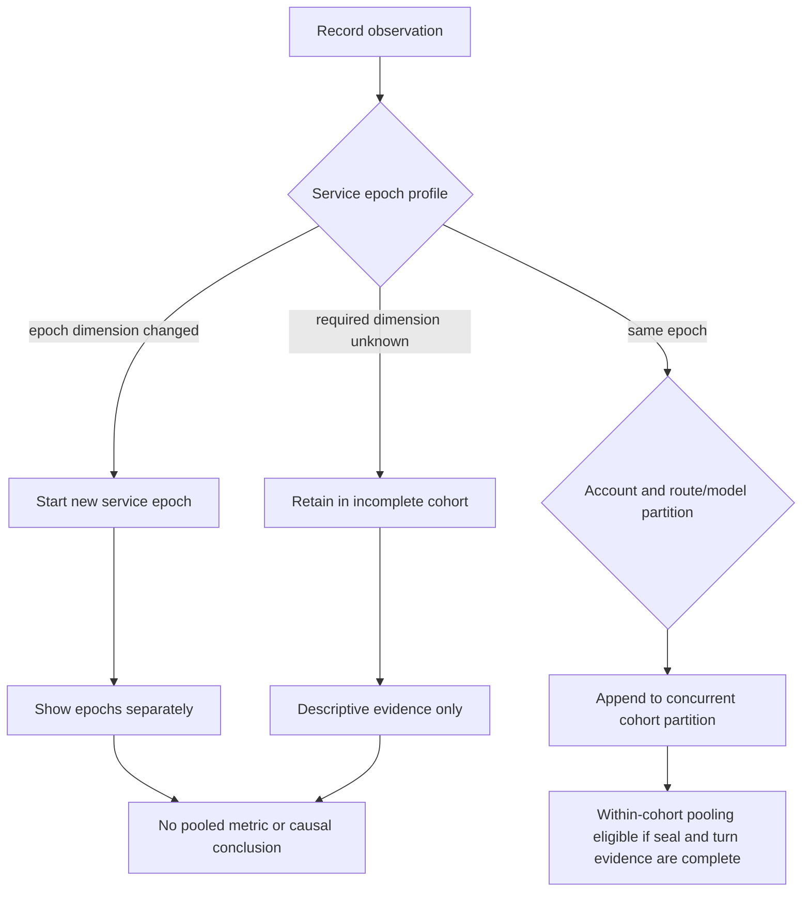

# Service-Lifetime Cohort Seal - Plan

## Goal Capsule

- **Objective:** Make Grok cache evidence comparable only within an immutable, fully described service-lifetime cohort so restarts, deployments, configuration changes, account changes, and route/model changes cannot produce misleading aggregate conclusions.
- **Product authority:** This contract governs evidence provenance, cohort boundaries, and cohort-aware reporting for opt-in cache-flight observations on the official xAI path. The existing cache flight recorder remains authoritative for turn-level lineage, outcomes, token evidence, and unknown-state semantics.
- **Open blockers:** None before planning. Representation, persistence, and integration details are deferred to planning without changing the product rules below.

---

## Product Contract

### Summary

Extend the Grok cache flight recorder with a write-time Service-Lifetime Cohort Seal that partitions observations into strict, non-combinable cohorts. Reports retain every observation, summarize each cohort separately, and explain why evidence cannot be aggregated instead of silently merging, dropping, or reconstructing it.

### Problem Frame

The recorder can currently show identity, serving-account, prefix, cache-outcome, token, and completeness evidence for a conversation timeline. Cache ownership and keepalive coordination are process-local, while deployment provenance, cache controls, account scope, and route/model context can change independently of that timeline.

Without a durable boundary around those conditions, evidence collected before and after a restart or policy change can look like one retention experiment. This can turn a process reset, deployment, account transition, model-route change, or keepalive change into a false conclusion about xAI cache residency.

### Key Decisions

- **Use a strict evidence firewall, not best-effort normalization.** Governs R1-R11. Sparse but defensible cohorts are preferable to a larger dataset whose provenance has been reconstructed or selectively ignored.
- **Seal observations when they are recorded.** Governs R2-R7. Query-time snapshots cannot recover the historical conditions under which an observation was produced.
- **Separate service epochs from observation partitions.** Governs R5-R6. Deployment, process, and policy changes create epochs, while account and route/model facts create concurrent partitions inside an epoch.
- **Keep evidence provenance separate from cache control.** Governs R16. A seal can describe routing, account, and keepalive conditions but cannot change them.
- **Make rejected aggregation useful.** Governs R9, R12-R15. Reports must identify safe within-cohort evidence and explain the dimensions that prevent broader aggregation.

### Requirements

**Seal contract**

- R1. Every in-scope cache-flight observation carries an immutable seal that identifies its service epoch occurrence and observation partition from the conditions observed when that evidence is recorded.
- R2. The seal captures the observed deployment revision, an opaque service-instance identity, and process-start evidence that changes on restart.
- R3. The seal captures the active native-cache and recorder state plus the active keepalive state and effective xAI keepalive policy values that can alter cache observation or renewal behavior.
- R4. The seal captures the privacy-safe serving-account scope, observed route/model epoch, and seal-receipt completeness available for that observation.
- R5. The seal semantics, deployment, service instance, process start, native-cache, recorder, and keepalive-policy dimensions define a service epoch; any change starts a new epoch, and an earlier profile returning later remains a new epoch occurrence.
- R6. Account scope and route/model epoch define concurrent observation partitions inside a service epoch; interleaved partitions do not terminate or merge one another.
- R7. A missing required dimension remains `unknown` at write time and is never reconstructed from current configuration, source history, later observations, or historical logs.

**Comparability and integrity**

- R8. Only observations in the same complete service epoch and the same complete observation partition are eligible to be pooled into one metric, sample, or within-cohort conclusion.
- R9. Observations from different service epochs or observation partitions may be displayed or explicitly contrasted but must remain partitioned; this feature cannot pool them or emit its own causal conclusion across them.
- R10. An observation with an incomplete seal remains available as raw timeline evidence and in descriptive counts, but it is ineligible for comparative or causal analysis.
- R11. Existing turn-level completeness, unavailable dimensions, gaps, and contradictions remain visible and can only further restrict analysis; a complete cohort seal cannot upgrade incomplete turn evidence.

**Operator reporting**

- R12. Cohort-aware reports expose each service epoch and observation partition's privacy-safe identifiers, observed intervals, observation counts, seal completeness, descriptive cache outcomes, and visible seal dimensions.
- R13. Every aggregate retains traceability to its contributing sealed observations, and no aggregate remains after its last contributing observation expires or is deleted.
- R14. When requested evidence spans incompatible or incomplete cohorts, the report names every blocking dimension, distinguishes `changed` from `unknown`, and directs the operator to the safe within-cohort subsets without recommending a cache policy change.
- R15. Human-readable and structured report forms represent the same cohort boundaries, eligibility decisions, unknowns, and rejection reasons.

**Scope, safety, and compatibility**

- R16. Sealing is opt-in and limited to official-xAI cache-flight observations; when inactive or inapplicable, provider, routing, cache, and keepalive behavior remains unchanged.
- R17. The feature stores no prompt text, request body, credential, raw cache key, raw host identity, or secret configuration value; account and runtime dimensions use privacy-safe identifiers.
- R18. Pre-seal historical observations remain readable but are explicitly unsealed and ineligible for cohort aggregation; the feature does not backfill inferred seals.
- R19. Runtime verification uses only non-Anthropic accounts with fail-closed account routing and cannot automate traffic through an Anthropic account.

### Actors

- A1. **Operator or investigator:** Uses cache-flight evidence to evaluate native Grok cache behavior and needs to know which observations can support one conclusion.
- A2. **Cache-flight recorder:** Captures turn evidence and the contemporaneous seal without altering request execution.
- A3. **Cohort-aware reporter:** Partitions retained evidence, applies eligibility rules, and explains rejected aggregation in human-readable and structured forms.

### Key Flows

- F1. **Seal an observation**
  - **Trigger:** An in-scope official-xAI cache-flight observation is ready to be recorded.
  - **Actors:** A2
  - **Steps:** Capture the contemporaneous required dimensions; preserve unavailable dimensions as `unknown`; resolve the service epoch and concurrent observation partition under R5-R6; append the immutable seal with the turn evidence.
  - **Outcome:** The observation has durable provenance without affecting the request path.
  - **Covers:** R1-R7, R16-R19.

- F2. **Inspect one cohort**
  - **Trigger:** An operator requests evidence that resolves to one service epoch and observation partition.
  - **Actors:** A1, A3
  - **Steps:** Show the cohort summary and underlying timeline; evaluate seal and turn completeness; expose which analyses are eligible.
  - **Outcome:** The operator can use complete within-cohort evidence without inferring missing conditions.
  - **Covers:** R8, R10-R15.

- F3. **Reject unsafe aggregation**
  - **Trigger:** A requested window or selection spans incompatible service epochs, observation partitions, or an incomplete seal.
  - **Actors:** A1, A3
  - **Steps:** Preserve all matching observations in separate cohort summaries; withhold pooled metrics and causal conclusions from this feature; identify each changed or unknown blocking dimension; point to safe within-cohort subsets.
  - **Outcome:** The report remains useful while refusing an unsupported conclusion.
  - **Covers:** R9-R15.

### Cohort Boundary Model

The diagram illustrates R5-R11. It does not define storage or service boundaries.

### Acceptance Examples

- AE1. **Stable service epoch and partition**
  - **Covers:** R1-R8.
  - **Given:** The service-epoch dimensions and one account-and-route/model partition remain unchanged and known.
  - **When:** Several cache observations are recorded.
  - **Then:** They share one service epoch and observation partition and are eligible for within-cohort pooling when their turn evidence is complete.

- AE2. **Restart under identical configuration**
  - **Covers:** R2, R5, R9, R12, R14.
  - **Given:** A service restarts with the same deployment revision and configuration.
  - **When:** The next observation is recorded.
  - **Then:** Its new process-lifetime identity starts a new service epoch occurrence, and this feature cannot pool pre-restart and post-restart metrics.

- AE3. **Configuration changes and later reverts**
  - **Covers:** R3, R5, R9, R12, R14.
  - **Given:** The effective xAI keepalive policy changes from A to B and later returns to A.
  - **When:** Observations span all three intervals.
  - **Then:** The report shows three service epoch occurrences and does not merge the two A intervals.

- AE4. **Concurrent account and route/model partitions**
  - **Covers:** R4, R6, R8-R9, R11-R14.
  - **Given:** Interleaved observations use different serving accounts or observed route/model epochs while the service epoch is stable.
  - **When:** The recorder appends those observations.
  - **Then:** The report keeps concurrent partitions inside the same service epoch, preserves timeline transitions, and does not pool their cache evidence.

- AE5. **Unknown deployment or route evidence**
  - **Covers:** R7-R10, R12, R14-R15.
  - **Given:** The runtime cannot observe a required deployment or route/model dimension.
  - **When:** It records and reports the cache observation.
  - **Then:** The dimension remains `unknown`, the observation remains visible, and the report identifies the incomplete seal as the reason comparative analysis is unavailable.

- AE6. **Turn evidence is incomplete inside a complete cohort**
  - **Covers:** R8, R10-R11.
  - **Given:** The cohort seal is complete but token evidence or timeline integrity is incomplete.
  - **When:** The operator requests analysis.
  - **Then:** The report preserves the cohort summary but does not upgrade the turn evidence or emit an unsupported cache conclusion.

- AE7. **Historical evidence predates sealing**
  - **Covers:** R7, R13, R18.
  - **Given:** Retained recorder observations were written before this feature existed.
  - **When:** They appear in a cohort-aware report.
  - **Then:** They are marked unsealed, remain readable until normal retention removes them, and are never assigned an inferred historical seal.

- AE8. **Feature is inactive or provider is out of scope**
  - **Covers:** R16-R17.
  - **Given:** Sealing is disabled or a request does not use the eligible official-xAI cache path.
  - **When:** The request executes.
  - **Then:** No cohort-control behavior is introduced, no provider behavior changes, and no sensitive request or configuration material is stored.

- AE9. **Runtime verification is force-routed away from Anthropic**
  - **Covers:** R19.
  - **Given:** Runtime verification needs a request through the proxy.
  - **When:** The verification is exercised.
  - **Then:** It uses a non-Anthropic account with fail-closed routing, and the verification fails rather than falling back to an Anthropic account.

### Success Criteria

- Every retained in-scope observation can be traced to one service epoch and observation partition or is visibly classified as unsealed.
- A restart or any service-epoch dimension change is observable as an epoch boundary in both human-readable and structured reports.
- No report silently pools evidence across service epochs or observation partitions or converts an unknown dimension into a known value.
- Every aggregate can be traced to its retained sealed observations and disappears when its last contributor is removed.
- An operator can see why aggregation was rejected and which within-cohort evidence remains usable.
- Existing request routing, native cache identity, account selection, keepalive replay, and provider transport behavior are unchanged when the feature is enabled or disabled.

### Scope Boundaries

- This work does not alter `x-grok-conv-id`, prompt-prefix identity, cache affinity ownership, account selection, model routing, provider requests, or keepalive scheduling.
- This work does not estimate xAI cache TTL, prove provider cache residency, perform retention survival analysis, or decide whether replay preserved a later natural request.
- This work does not define controlled cross-cohort experiments; a later experiment contract may contrast separately sealed cohorts with explicit interventions and confounders without pooling them or weakening R8.
- This work does not add distributed cache-home coordination or merge process-local ownership across replicas.
- This work does not build the three-stage final-wire receipt, compiler compatibility epoch registry, or a native Responses continuation lane; it records only the route/model and completeness evidence made available to it.
- This work does not generalize cohort sealing to Anthropic or other providers.

<!-- ce-section: work-relationships -->

### How This Work Fits Together

This plan owns the evidence boundary required before stronger claims can be made from native Grok cache observations. The surrounding areas below are contextual candidates from the current ideation, not a committed roadmap.

- **Three-stage prefix receipts:** Can enrich seal completeness and route/model evidence later; this plan does not require or invent their final-wire witness.
- **Compiler compatibility epochs:** Can provide a stronger route/model epoch later; this plan preserves `unknown` until such evidence exists.
- **Locality premise falsification:** Depends on sealed cohorts to distinguish service and routing changes from locality effects.
- **Retention survival analysis:** Depends on sealed cohorts so censored observations are not combined across restarts or policy changes.
- **Keepalive safety and economics:** Can consume cohort evidence later but can proceed independently as a replay-safety feature.
- **Lossless Responses continuation:** Can proceed independently and does not change this plan's official-xAI Chat evidence scope.

### Dependencies and Assumptions

- The cache flight recorder remains the durable source for turn-level evidence and unknown-state semantics.
- The runtime can always create a privacy-safe process-lifetime identity even when build or route/model provenance is unavailable.
- Cache-related effective settings can be observed at record time without reading or persisting secrets.
- Existing account identifiers can be represented in a privacy-safe form suitable for operational evidence.
- The recorder's current retention and explicit-deletion semantics remain authoritative for sealed observations.

### Outstanding Questions

**Deferred to Planning**

- How should the seal, service epoch occurrence, and observation partition be represented and persisted consistently across SQLite and PostgreSQL?
- At which existing recorder boundary should contemporaneous settings and route/model evidence be captured so the write remains atomic from the Product Contract's perspective?
- How should existing CLI, structured output, and health surfaces expose cohort summaries without duplicating one normative eligibility engine?
- Which current settings contribute to the effective native-cache and keepalive policy profile, and how should future settings declare that they are cohort-breaking?
- How should the planner version the seal contract so a semantic change to a captured dimension starts a new service epoch occurrence rather than reinterpreting old evidence?

### Sources and Research

- `packages/core/src/cache-flight-recorder.ts` — turn evidence, completeness, contradictions, and unknown-first diagnosis.
- `packages/proxy/src/usage-collector.ts` — current recorder write boundary and dropped/incomplete evidence behavior.
- `packages/proxy/src/cache-affinity-orderer.ts` — process-local native xAI cache ownership.
- `packages/proxy/src/cache-body-store.ts` and `packages/proxy/src/cache-keepalive-scheduler.ts` — process-local body retention and keepalive policy behavior.
- `packages/proxy/src/opaque-runtime-id.ts` — restart-rotating, privacy-safe runtime identity precedent.
- `packages/http-api/src/handlers/health.ts` — runtime build provenance and explicit `unknown` values.
- `packages/types/src/api.ts` — account candidate and route/model metadata currently available to request handling.
- `docs/plans/2026-07-15-002-feat-grok-cache-flight-recorder-core-plan.md` — existing recorder Product Contract and deferred cohort analytics.
- `docs/ideation/2026-07-15-native-grok-cache-routing-ideation.html` — refreshed ranked ideation and surrounding work relationships.
