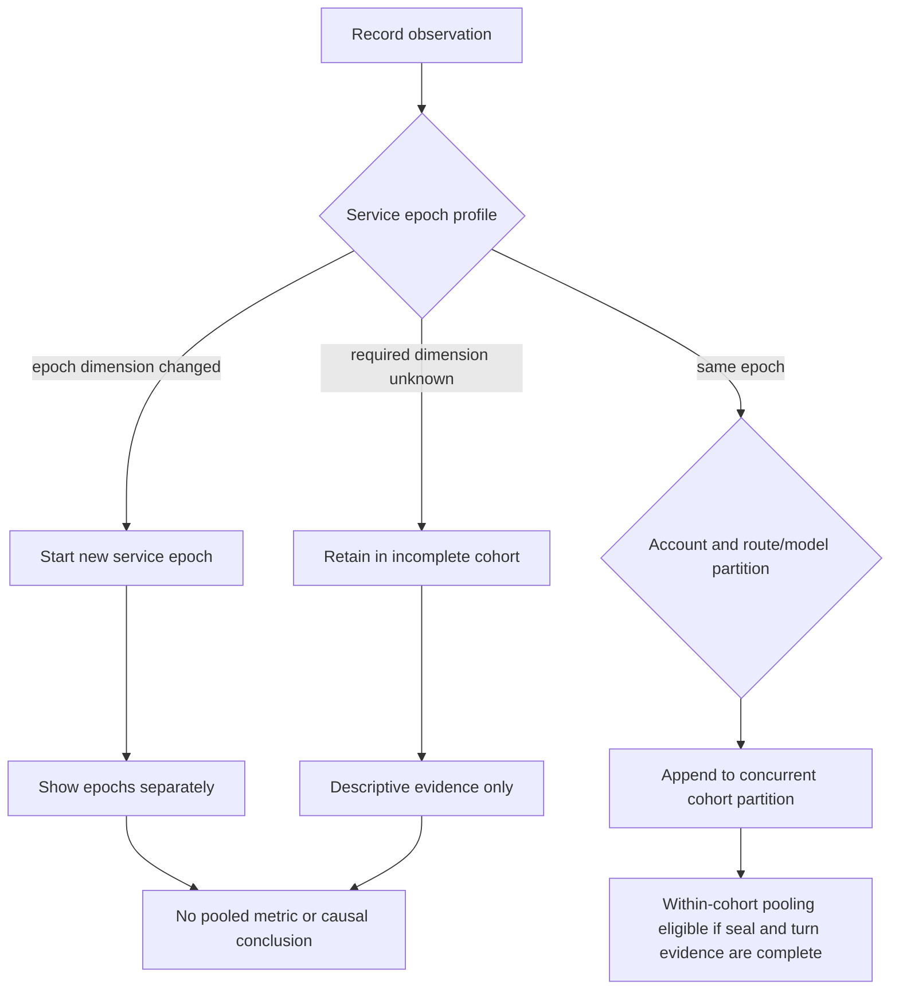
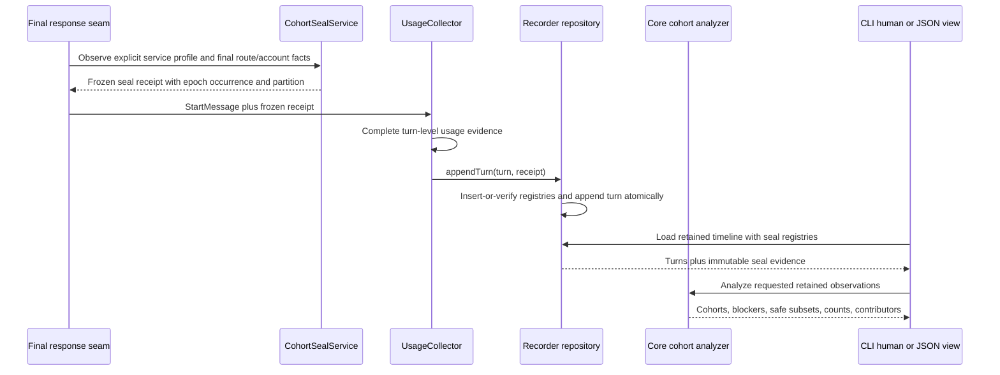

# Service-Lifetime Cohort Seal - Plan

## Goal Capsule

- **Objective:** Make Grok cache evidence comparable only within an immutable, fully described service-lifetime cohort so restarts, deployments, configuration changes, account changes, and route/model changes cannot produce misleading aggregate conclusions.
- **Product authority:** This contract governs evidence provenance, cohort boundaries, and cohort-aware reporting for opt-in cache-flight observations on the official xAI path. The existing cache flight recorder remains authoritative for turn-level lineage, outcomes, token evidence, and unknown-state semantics.
- **Authority:** The Product Contract owns product behavior. The Planning Contract owns implementation mechanism. A conflict is resolved in that order.
- **Execution profile:** Implement test-first in six ordered units. Keep core/database/CLI tests in processes separate from proxy tests because Bun `mock.module` state can leak across files.
- **Stop conditions:** Stop rather than infer a missing seal dimension, weaken cohort eligibility, persist a durable aggregate, or send automated verification traffic through an Anthropic account.
- **Tail ownership:** U6 owns documentation and runtime proof. Normal recorder retention owns observation expiry; U3 adds registry cleanup after contributors disappear.
- **Open blockers:** None. The five implementation questions from the Product Contract are resolved by KTD1-KTD10.

---

## Product Contract

### Summary

Extend the Grok cache flight recorder with a write-time Service-Lifetime Cohort Seal that partitions observations into strict, non-combinable cohorts. Reports retain every observation, summarize each cohort separately, and explain why evidence cannot be aggregated instead of silently merging, dropping, or reconstructing it.

### Problem Frame

The recorder can currently show identity, serving-account, prefix, cache-outcome, token, and completeness evidence for a conversation timeline. Cache ownership and keepalive coordination are process-local, while deployment provenance, cache controls, account scope, and route/model context can change independently of that timeline.

Without a durable boundary around those conditions, evidence collected before and after a restart or policy change can look like one retention experiment. This can turn a process reset, deployment, account transition, model-route change, or keepalive change into a false conclusion about xAI cache residency.

### Key Decisions

- **Use a strict evidence firewall, not best-effort normalization.** Governs R1-R11. Sparse but defensible cohorts are preferable to a larger dataset whose provenance has been reconstructed or selectively ignored.
- **Seal observations when they are recorded.** Governs R2-R7. Query-time snapshots cannot recover the historical conditions under which an observation was produced.
- **Separate service epochs from observation partitions.** Governs R5-R6. Deployment, process, and policy changes create epochs, while account and route/model facts create concurrent partitions inside an epoch.
- **Keep evidence provenance separate from cache control.** Governs R16. A seal can describe routing, account, and keepalive conditions but cannot change them.
- **Make rejected aggregation useful.** Governs R9, R12-R15. Reports must identify safe within-cohort evidence and explain the dimensions that prevent broader aggregation.

### Requirements

**Seal contract**

- R1. Every in-scope cache-flight observation carries an immutable seal that identifies its service epoch occurrence and observation partition from the conditions observed when that evidence is recorded.
- R2. The seal captures the observed deployment revision, an opaque service-instance identity, and process-start evidence that changes on restart.
- R3. The seal captures the active native-cache and recorder state plus the active keepalive state and effective xAI keepalive policy values that can alter cache observation or renewal behavior.
- R4. The seal captures the privacy-safe serving-account scope, observed route/model epoch, and seal-receipt completeness available for that observation.
- R5. The seal semantics, deployment, service instance, process start, native-cache, recorder, and keepalive-policy dimensions define a service epoch; any change starts a new epoch, and an earlier profile returning later remains a new epoch occurrence.
- R6. Account scope and route/model epoch define concurrent observation partitions inside a service epoch; interleaved partitions do not terminate or merge one another.
- R7. A missing required dimension remains `unknown` at write time and is never reconstructed from current configuration, source history, later observations, or historical logs.

**Comparability and integrity**

- R8. Only observations in the same complete service epoch and the same complete observation partition are eligible to be pooled into one metric, sample, or within-cohort conclusion.
- R9. Observations from different service epochs or observation partitions may be displayed or explicitly contrasted but must remain partitioned; this feature cannot pool them or emit its own causal conclusion across them.
- R10. An observation with an incomplete seal remains available as raw timeline evidence and in descriptive counts, but it is ineligible for comparative or causal analysis.
- R11. Existing turn-level completeness, unavailable dimensions, gaps, and contradictions remain visible and can only further restrict analysis; a complete cohort seal cannot upgrade incomplete turn evidence.

**Operator reporting**

- R12. Cohort-aware reports expose each service epoch and observation partition's privacy-safe identifiers, observed intervals, observation counts, seal completeness, descriptive cache outcomes, and visible seal dimensions.
- R13. Every aggregate retains traceability to its contributing sealed observations, and no aggregate remains after its last contributing observation expires or is deleted.
- R14. When requested evidence spans incompatible or incomplete cohorts, the report names every blocking dimension, distinguishes `changed` from `unknown`, and directs the operator to the safe within-cohort subsets without recommending a cache policy change.
- R15. Human-readable and structured report forms represent the same cohort boundaries, eligibility decisions, unknowns, and rejection reasons.

**Scope, safety, and compatibility**

- R16. Sealing is opt-in and limited to official-xAI cache-flight observations; when inactive or inapplicable, provider, routing, cache, and keepalive behavior remains unchanged.
- R17. The feature stores no prompt text, request body, credential, raw cache key, raw host identity, or secret configuration value; account and runtime dimensions use privacy-safe identifiers.
- R18. Pre-seal historical observations remain readable but are explicitly unsealed and ineligible for cohort aggregation; the feature does not backfill inferred seals.
- R19. Runtime verification uses only non-Anthropic accounts with fail-closed account routing and cannot automate traffic through an Anthropic account.

### Actors

- A1. **Operator or investigator:** Uses cache-flight evidence to evaluate native Grok cache behavior and needs to know which observations can support one conclusion.
- A2. **Cache-flight recorder:** Captures turn evidence and the contemporaneous seal without altering request execution.
- A3. **Cohort-aware reporter:** Partitions retained evidence, applies eligibility rules, and explains rejected aggregation in human-readable and structured forms.

### Key Flows

- F1. **Seal an observation**
  - **Trigger:** An in-scope official-xAI cache-flight observation is ready to be recorded.
  - **Actors:** A2
  - **Steps:** Capture the contemporaneous required dimensions; preserve unavailable dimensions as `unknown`; resolve the service epoch and concurrent observation partition under R5-R6; append the immutable seal with the turn evidence.
  - **Outcome:** The observation has durable provenance without affecting the request path.
  - **Covers:** R1-R7, R16-R17.

- F2. **Inspect one cohort**
  - **Trigger:** An operator requests evidence that resolves to one service epoch and observation partition.
  - **Actors:** A1, A3
  - **Steps:** Show the cohort summary and underlying timeline; evaluate seal and turn completeness; expose which analyses are eligible.
  - **Outcome:** The operator can use complete within-cohort evidence without inferring missing conditions.
  - **Covers:** R8, R10-R15.

- F3. **Reject unsafe aggregation**
  - **Trigger:** A requested window or selection spans incompatible service epochs, observation partitions, or an incomplete seal.
  - **Actors:** A1, A3
  - **Steps:** Preserve all matching observations in separate cohort summaries; withhold pooled metrics and causal conclusions from this feature; identify each changed or unknown blocking dimension; point to safe within-cohort subsets.
  - **Outcome:** The report remains useful while refusing an unsupported conclusion.
  - **Covers:** R9-R15.

### Cohort Boundary Model

The diagram illustrates R5-R11. It does not define storage or service boundaries.

### Acceptance Examples

- AE1. **Stable service epoch and partition**
  - **Covers:** R1-R8.
  - **Given:** The service-epoch dimensions and one account-and-route/model partition remain unchanged and known.
  - **When:** Several cache observations are recorded.
  - **Then:** They share one service epoch and observation partition and are eligible for within-cohort pooling when their turn evidence is complete.

- AE2. **Restart under identical configuration**
  - **Covers:** R2, R5, R9, R12, R14.
  - **Given:** A service restarts with the same deployment revision and configuration.
  - **When:** The next observation is recorded.
  - **Then:** Its new process-lifetime identity starts a new service epoch occurrence, and this feature cannot pool pre-restart and post-restart metrics.

- AE3. **Configuration changes and later reverts**
  - **Covers:** R3, R5, R9, R12, R14.
  - **Given:** The effective xAI keepalive policy changes from A to B and later returns to A.
  - **When:** Observations span all three intervals.
  - **Then:** The report shows three service epoch occurrences and does not merge the two A intervals.

- AE4. **Concurrent account and route/model partitions**
  - **Covers:** R4, R6, R8-R9, R11-R14.
  - **Given:** Interleaved observations use different serving accounts or observed route/model epochs while the service epoch is stable.
  - **When:** The recorder appends those observations.
  - **Then:** The report keeps concurrent partitions inside the same service epoch, preserves timeline transitions, and does not pool their cache evidence.

- AE5. **Unknown deployment or route evidence**
  - **Covers:** R7-R10, R12, R14-R15.
  - **Given:** The runtime cannot observe a required deployment or route/model dimension.
  - **When:** It records and reports the cache observation.
  - **Then:** The dimension remains `unknown`, the observation remains visible, and the report identifies the incomplete seal as the reason comparative analysis is unavailable.

- AE6. **Turn evidence is incomplete inside a complete cohort**
  - **Covers:** R8, R10-R11.
  - **Given:** The cohort seal is complete but token evidence or timeline integrity is incomplete.
  - **When:** The operator requests analysis.
  - **Then:** The report preserves the cohort summary but does not upgrade the turn evidence or emit an unsupported cache conclusion.

- AE7. **Historical evidence predates sealing**
  - **Covers:** R7, R13, R18.
  - **Given:** Retained recorder observations were written before this feature existed.
  - **When:** They appear in a cohort-aware report.
  - **Then:** They are marked unsealed, remain readable until normal retention removes them, and are never assigned an inferred historical seal.

- AE8. **Feature is inactive or provider is out of scope**
  - **Covers:** R16-R17.
  - **Given:** Sealing is disabled or a request does not use the eligible official-xAI cache path.
  - **When:** The request executes.
  - **Then:** No cohort-control behavior is introduced, no provider behavior changes, and no sensitive request or configuration material is stored.

- AE9. **Runtime verification is force-routed away from Anthropic**
  - **Covers:** R19.
  - **Given:** Runtime verification needs a request through the proxy.
  - **When:** The verification is exercised.
  - **Then:** It uses a non-Anthropic account with fail-closed routing, and the verification fails rather than falling back to an Anthropic account.

### Success Criteria

- Every retained in-scope observation can be traced to one service epoch and observation partition or is visibly classified as unsealed.
- A restart or any service-epoch dimension change is observable as an epoch boundary in both human-readable and structured reports.
- No report silently pools evidence across service epochs or observation partitions or converts an unknown dimension into a known value.
- Every aggregate can be traced to its retained sealed observations and disappears when its last contributor is removed.
- An operator can see why aggregation was rejected and which within-cohort evidence remains usable.
- Existing request routing, native cache identity, account selection, keepalive replay, and provider transport behavior are unchanged when the feature is enabled or disabled.

### Scope Boundaries

- This work does not alter `x-grok-conv-id`, prompt-prefix identity, cache affinity ownership, account selection, model routing, provider requests, or keepalive scheduling.
- This work does not estimate xAI cache TTL, prove provider cache residency, perform retention survival analysis, or decide whether replay preserved a later natural request.
- This work does not define controlled cross-cohort experiments; a later experiment contract may contrast separately sealed cohorts with explicit interventions and confounders without pooling them or weakening R8.
- This work does not add distributed cache-home coordination or merge process-local ownership across replicas.
- This work does not build the three-stage final-wire receipt, compiler compatibility epoch registry, or a native Responses continuation lane; it records only the route/model and completeness evidence made available to it.
- This work does not generalize cohort sealing to Anthropic or other providers.

<!-- ce-section: work-relationships -->

### How This Work Fits Together

This plan owns the evidence boundary required before stronger claims can be made from native Grok cache observations. The surrounding areas below are contextual candidates from the current ideation, not a committed roadmap.

- **Three-stage prefix receipts:** Can enrich seal completeness and route/model evidence later; this plan does not require or invent their final-wire witness.
- **Compiler compatibility epochs:** Can provide a stronger route/model epoch later; this plan preserves `unknown` until such evidence exists.
- **Locality premise falsification:** Depends on sealed cohorts to distinguish service and routing changes from locality effects.
- **Retention survival analysis:** Depends on sealed cohorts so censored observations are not combined across restarts or policy changes.
- **Keepalive safety and economics:** Can consume cohort evidence later but can proceed independently as a replay-safety feature.
- **Lossless Responses continuation:** Can proceed independently and does not change this plan's official-xAI Chat evidence scope.

### Dependencies and Assumptions

- The cache flight recorder remains the durable source for turn-level evidence and unknown-state semantics.
- The runtime can always create a privacy-safe process-lifetime identity even when build or route/model provenance is unavailable.
- Cache-related effective settings can be observed at record time without reading or persisting secrets.
- Existing account identifiers can be represented in a privacy-safe form suitable for operational evidence.
- The recorder's current retention and explicit-deletion semantics remain authoritative for sealed observations.

### Planning Resolutions

- The seal is stored through immutable normalized service-epoch and observation-partition registry rows. Each sealed turn references its partition, and the partition supplies its epoch; historical turns keep a null partition reference.
- The definitive response seam captures a frozen receipt before `UsageCollector` and its asynchronous database writer can observe later configuration.
- Shared core logic owns grouping, eligibility, blockers, safe subsets, descriptive aggregates, and contributor traceability. CLI human and JSON views project the same result.
- An explicit versioned service-policy profile includes only the current native-cache, recorder, and effective xAI keepalive controls. Future controls become cohort-breaking only when added to that allowlist.
- The seal contract version is a service-epoch dimension. A semantic change increments the version and cannot reinterpret retained evidence.

### Sources and Research

- `packages/core/src/cache-flight-recorder.ts` — turn evidence, completeness, contradictions, and unknown-first diagnosis.
- `packages/proxy/src/response-handler.ts` — definitive serving-account and final-attempt response seam.
- `packages/proxy/src/usage-collector.ts` — current recorder write boundary and dropped/incomplete evidence behavior.
- `packages/proxy/src/cache-affinity-orderer.ts` — process-local native xAI cache ownership.
- `packages/proxy/src/cache-body-store.ts` and `packages/proxy/src/cache-keepalive-scheduler.ts` — process-local body retention and keepalive policy behavior.
- `packages/proxy/src/opaque-runtime-id.ts` — restart-rotating, privacy-safe runtime identity precedent.
- `packages/http-api/src/handlers/health.ts` and `packages/core/src/version.ts` — runtime build provenance and explicit unknown-state behavior.
- `packages/types/src/api.ts` — account candidate and route/model metadata currently available to request handling.
- `packages/database/src/repositories/cache-flight-recorder.repository.ts` — atomic append, validation, loading, and retention ownership.
- `packages/database/src/migrations.ts` and `packages/database/src/migrations-pg.ts` — SQLite and PostgreSQL schema parity.
- `docs/plans/2026-07-15-002-feat-grok-cache-flight-recorder-core-plan.md` — existing recorder Product Contract and deferred cohort analytics.
- `docs/ideation/2026-07-15-native-grok-cache-routing-ideation.html` — refreshed ranked ideation and surrounding work relationships.

---

## Planning Contract

The Product Contract's behavior and stable identifiers are unchanged. This section resolves representation, lifecycle, integration, and verification without changing R1-R19, A1-A3, F1-F3, or AE1-AE9.

### Key Technical Decisions

- KTD1. **Use immutable normalized registries referenced by turns.** Store one immutable service-epoch row per occurrence and one immutable observation-partition row per account-and-route/model partition under that occurrence. Add one nullable observation-partition reference to `cache_flight_recorder_turns`; derive the epoch through the partition instead of duplicating an epoch foreign key on every turn. Do not persist aggregate results. This satisfies R1, R5-R6, R13, and R18 while avoiding repeated dimension payloads and a second turn-level consistency invariant.
- KTD2. **Make occurrence identity process-local and monotonic.** Add one `CohortSealService` instance to `ProxyContext`. It owns an opaque boot identity, process-start evidence, the current canonical service-policy profile, and a monotonic occurrence counter. It synchronously recomputes the effective profile for every mutable allowlisted `Config` event and rotates only when that canonical profile changes; it also compares the current profile at capture as a backstop. A to B to A therefore creates three occurrences even when no eligible observation is recorded while B is active, while a no-op write or a file value shadowed by an environment override creates no false epoch. Restart-scoped environment and build dimensions are captured at startup and rechecked at capture. This implements R2 and R5.
- KTD3. **Freeze the receipt at the final response seam.** `packages/proxy/src/response-handler.ts` captures the current service profile and the final serving account, attempted transport model, and route candidate before it constructs `StartMessage`. `UsageCollector` carries this immutable receipt unchanged. No queued database closure reads mutable configuration or route state. This implements R1-R7 at the point where the final facts coexist.
- KTD4. **Commit the complete observation through `appendTurn`.** Extend the existing `CacheFlightRecorderRepository.appendTurn` transaction to validate and insert-or-verify the epoch and partition registries before it inserts the referencing turn. An ID conflict with different dimensions or any failed statement rolls back the entire observation. A failed or rejected receipt therefore cannot leave a half-sealed turn or rewrite retained history under R1, R7, R13, and R17.
- KTD5. **Keep comparability in shared core logic.** Add a separate cohort-seal domain module rather than extending the existing turn-level `EvidenceDimension` union. Core owns seal completeness, grouping, eligibility, `changed` versus `unknown` blockers, safe subsets, descriptive outcome counts, and contributor references. Database code only persists and loads evidence. CLI human and JSON renderers consume the same core result. This preserves R8-R15 and keeps current timeline diagnosis independently authoritative.
- KTD6. **Declare cohort-breaking policy with an explicit versioned profile.** The v1 profile contains the seal contract version, deployment revision, native xAI cache state, recorder state, global keepalive TTL, xAI keepalive TTL, and resolved effective xAI TTL/enabled state. Do not reflect arbitrary configuration. Add a future setting only by changing the profile type, builder, and tests. This bounds R3 and R7 to observable non-secret inputs.
- KTD7. **Share runtime policy and build-provenance resolvers.** Extract a cycle-safe effective keepalive policy helper used by both `CacheKeepaliveScheduler` and `CohortSealService`; preserve `resolveKeepaliveTtlMinutes` at its current module as a compatibility re-export. Extract the health handler's build-provenance read into a shared core helper while preserving `/health` response semantics. This prevents the captured profile from drifting from the behavior it describes.
- KTD8. **Version seal semantics and fail closed on missing evidence.** Include a numeric seal contract version in every service profile. Increment it when a captured dimension changes meaning or canonicalization. Represent required unavailable dimensions as unknown in the immutable registry and mark the receipt incomplete. Null historical references, missing registry rows, malformed identifiers, and conflicting rows remain unsealed or incomplete; no query reconstructs them. This implements R7, R10, and R18.
- KTD9. **Make reporting additive and selection-bounded.** Extend the existing recorder report DTO with a cohort projection over the retained turns selected by its existing recorder-conversation ID; v1 does not add an unbounded all-recorder scan or a second CLI selector. Keep the core analyzer selection-agnostic so a later explicit window can reuse the same rules. Add sealed, unsealed, and incomplete-seal **turn counts** to recorder health while preserving the existing retained **conversation count**, timeline fields, diagnosis, exit codes, and configuration surfaces. General HTTP `/health` may continue to expose build provenance but does not become the cohort analysis engine. This satisfies R12-R16 without narrowing compatibility or making report cost depend on the entire retained corpus.
- KTD10. **Verify runtime behavior in an Anthropic-free test runtime.** Any proxy smoke test must use a disposable database and runtime whose account catalog contains only the intended non-Anthropic official-xAI fixture. It may also force-route with `x-better-ccflare-account-id`, but that header is not the safety boundary because an unavailable target can fall back to normal selection. Preflight must prove the isolated catalog and target provider before startup; verification must inspect the persisted serving account/provider afterward. If isolation or the target is unavailable, abort before transport. No automated traffic may use an Anthropic account. This operationalizes R19.

### High-Level Technical Design

The service profile and observation partition have different lifecycles. The service listens for every mutable allowlisted profile key, synchronously recomputes the effective canonical profile, and increments the occurrence only when that profile changes, including a later revert. It also compares the full allowlisted profile for every eligible final response as a backstop for startup state and missed events. Account and route/model evidence only selects or creates a concurrent partition under the current occurrence. Interleaved traffic cannot rotate or mutate another partition.

### Persistence Shape

Use the following names unless implementation discovers a collision with an existing SQL identifier:

- `cache_flight_recorder_service_epochs`: immutable `id`, `seal_contract_version`, opaque `service_instance_id`, `process_started_at`, deployment revision and known-state fields, native-cache state, recorder state, global and xAI TTLs, resolved effective xAI TTL/enabled state, and `created_at`.
- `cache_flight_recorder_partitions`: immutable `id`, `service_epoch_id`, privacy-safe `serving_account_scope`, privacy-safe `route_model_epoch`, known-state/completeness fields, and `created_at`.
- `cache_flight_recorder_turns.observation_partition_id`: one nullable reference. Its partition supplies the service epoch. Historical rows remain null and receive no backfill.

Use opaque, bounded identifiers compatible with the recorder's existing safe-identifier validation. The epoch ID frames the restart-scoped service identity and monotonic occurrence. The partition ID frames the epoch ID, account scope, attempted model, and route candidate. Hash inputs may include raw runtime values transiently, but only domain-separated opaque outputs are persisted. Do not persist a raw account ID in the new partition registry even though legacy `serving_account_id` remains unchanged for turn diagnosis compatibility.

The repository must verify every dimension when an existing registry ID is reused. `INSERT ... ON CONFLICT DO NOTHING` alone is insufficient because a collision could otherwise attach new evidence to old dimensions. Keep both registry operations and the turn insert in the current `runBatchWithChanges` transaction or an equivalent single adapter transaction, using checked affected-row expectations or equivalent read-back assertions for both adapters. Add indexes for turn-to-partition, partition-to-epoch, and retention cleanup in both database implementations.

Query-time cohort summaries derive only from retained turns in the existing conversation-scoped report selection. Retention keeps orphan cleanup in the same checked batch as the existing conversation/turn expiry: after contributors are removed, delete partitions with no referencing turn, then epochs with no remaining partition. Foreign-key cascades remain useful for downward deletion but do not replace this upward cleanup. The migration is additive and has no data backfill; rollback means deploying a binary that ignores the nullable turn reference while leaving the new tables/column in place. Destructive schema removal is a separate, explicitly approved migration, never an automatic rollback step.

### Seal and Analysis Contracts

The frozen receipt has two parts:

- A service-epoch receipt with the explicit v1 profile, opaque service identity, process-start evidence, occurrence ID, completeness, and unavailable dimensions.
- An observation-partition receipt with the epoch ID, privacy-safe serving-account scope, privacy-safe route/model epoch, partition ID, completeness, and unavailable dimensions.

Use a dedicated seal-dimension vocabulary. Do not add deployment, process, policy, account-scope, or route/model fields to the existing turn-level `EvidenceDimension` union. The analyzer treats seal completeness and turn completeness as independent gates. Only a complete seal and complete turn evidence enter a safe pooled subset. Descriptive counts include unsealed and incomplete observations.

A contributor reference is the pair of recorder conversation ID and persisted turn sequence. Every cohort summary returns its ordered contributor references, first/last observation timestamps as the observed interval, seal dimensions, observation count, cache hit/miss/unknown counts, eligibility, and blocker list. A blocker names its dimension and classifies it as `changed` or `unknown`. The existing CLI report analyzes one retained conversation at a time, so v1 cohorts and safe subsets are bounded to that selection; the core result can accept broader explicit selections later without changing eligibility semantics. Cross-cohort output is a partitioned comparison only; it has no pooled metric and no policy recommendation.

### System-Wide Impact and Constraints

- **Privacy:** New seal fields accept only bounded enums, numbers, booleans, timestamps, explicit unknown markers, and opaque identifiers. Validation must reject raw credentials, cache keys, hosts, request content, and unbounded strings. Existing worker/account/model compatibility fields are outside the new seal payload; the new receipt must not duplicate their raw values.
- **Compatibility:** Existing recorder tables, historical reads, CLI fields, exit codes, environment flags, keepalive behavior, and `/health` fields remain available. New fields and output are additive.
- **Cardinality:** One process advances its epoch occurrence on each effective allowlisted service-profile change, but it persists a registry row only when an eligible observation references that occurrence. Partitions are bounded by observed account-and-route/model combinations and normal recorder retention. Conversation-scoped reporting avoids an unbounded corpus scan, and orphan cleanup prevents registries from outliving all evidence.
- **Failure posture:** Recorder failure remains non-authoritative for request delivery. Persistence failure follows the existing dropped/incomplete evidence path, but no partial seal state may commit. A registry conflict is evidence corruption, not an overwrite opportunity: reject that observation, mark the timeline incomplete through the existing path, and retain the conflicting registry unchanged.
- **Database parity:** Every SQLite fresh-schema and upgrade change in `packages/database/src/migrations.ts` has an equivalent PostgreSQL fresh-schema and upgrade change in `packages/database/src/migrations-pg.ts`.
- **Generated files:** Do not read, edit, search, stage, or commit `packages/proxy/src/inline-worker.ts`, `packages/database/src/inline-vacuum-worker.ts`, or `packages/database/src/inline-integrity-check-worker.ts`.
- **Execution isolation:** Run database/CLI suites separately from proxy suites because Bun module mocks can leak across one combined test process.

### Dependencies and Sequencing

U1 defines the shared domain contract. U2 depends on U1 and provides the receipt producer. U3 depends on U1 and provides durable storage. U4 depends on U1-U3 and connects capture to persistence. U5 depends on U1 and U3 because it analyzes loaded retained evidence. U6 depends on all prior units and owns end-to-end verification and documentation.

---

## Implementation Units

### U1. Define the core seal and cohort analysis contract

- **Goal:** Create the shared types and pure analysis engine that all persistence and presentation layers use.
- **Requirements:** R4, R7-R15, R17-R18; AE4-AE7.
- **Dependencies:** None.
- **Files:**
  - `packages/core/src/cache-flight-cohort-seal.ts` (new)
  - `packages/core/src/__tests__/cache-flight-cohort-seal.test.ts` (new)
  - `packages/core/src/index.ts`
  - `packages/core/src/cache-flight-recorder.ts` (only if a shared timeline type needs an additive reference; preserve existing diagnosis behavior)
- **Approach and patterns:** Follow the pure-function and unknown-first patterns in `packages/core/src/cache-flight-recorder.ts`. Define immutable service-epoch, partition, receipt, persisted seal, blocker, contributor, cohort summary, and analysis result types. Keep a dedicated seal-dimension allowlist. Implement grouping and eligibility without database or CLI imports.
- **Test scenarios:**
  1. Complete observations with one epoch and partition form one eligible cohort with ordered contributor references.
  2. Different epoch IDs remain separate and produce `changed` blockers for every differing known service dimension.
  3. Different partitions under one epoch remain separate without reporting a service-epoch change.
  4. A complete A epoch, B epoch, and later A-shaped epoch remain three occurrences when their occurrence IDs differ.
  5. Missing deployment, account scope, or route/model evidence produces `unknown` blockers and descriptive-only cohorts.
  6. A complete seal cannot upgrade a partial, incomplete, contradictory, or gap-bearing turn.
  7. Historical null references remain unsealed and contribute only to descriptive counts.
  8. Every summary includes its first/last observation timestamps, visible seal dimensions, observation and cache hit/miss/unknown counts, seal completeness, eligibility, blockers, and ordered contributors; those fields include only their retained contributors and never create a pooled cross-cohort metric.
- **Verification:** Run `bun test packages/core/src/__tests__/cache-flight-cohort-seal.test.ts packages/core/src/__tests__/cache-flight-recorder.test.ts` in one non-proxy process.

### U2. Capture versioned service occurrences and privacy-safe partitions

- **Goal:** Produce one frozen, privacy-safe receipt from contemporaneous service policy and final route/account facts.
- **Requirements:** R1-R7, R16-R17; AE1-AE5, AE8.
- **Dependencies:** U1.
- **Files:**
  - `packages/proxy/src/cache-flight-cohort-seal.ts` (new)
  - `packages/proxy/src/__tests__/cache-flight-cohort-seal.test.ts` (new)
  - `packages/proxy/src/cache-keepalive-policy.ts` (new cycle-safe policy helper)
  - `packages/proxy/src/cache-keepalive-scheduler.ts`
  - `packages/proxy/src/__tests__/cache-keepalive-scheduler.test.ts`
  - `packages/proxy/src/opaque-runtime-id.ts`
  - `packages/core/src/build-provenance.ts` (new)
  - `packages/core/src/version.ts`
  - `packages/core/src/version.test.ts`
  - `packages/core/src/index.ts`
  - `packages/http-api/src/handlers/health.ts`
  - `packages/http-api/src/handlers/__tests__/health-runtime.test.ts`
  - `packages/proxy/src/handlers/proxy-types.ts`
  - `apps/server/src/server.ts`
- **Approach and patterns:** Create an explicit v1 profile builder rather than reflecting `Config`. Reuse the existing strict provider flags and config getters. Share the keepalive resolver with the scheduler and preserve its current export. Share build provenance with `/health` while preserving its explicit unknown values. Subscribe the service to every mutable profile key, synchronously recompute the effective profile on each event, advance the monotonic occurrence only when that profile changes, and recompare the full profile at capture as a backstop. Use the restart-scoped opaque ID factory plus that occurrence to create epoch IDs. Derive partition IDs from opaque account and final route/model facts under the current epoch. Construct the service once in server startup, add it to `ProxyContext`, and unregister its listener during normal shutdown.
- **Test scenarios:**
  1. Stable known profiles reuse one occurrence and stable account/model facts reuse one partition.
  2. Restart-scoped service identities produce different epochs under identical settings.
  3. Each change to the effective allowlisted profile rotates the occurrence through the synchronous service listener.
  4. A to B to A rotates twice and does not reuse the first A occurrence even when no eligible observation occurs during B.
  5. A repeated no-op setting write or a file setting shadowed by an environment override does not rotate the occurrence.
  6. Interleaved accounts and models create concurrent partitions without rotating the epoch.
  7. A missed config event still rotates on the next observation because capture compares the current explicit profile.
  8. xAI-specific TTL override and global fallback match scheduler behavior for enabled and disabled combinations.
  9. Missing build revision or final route/model facts remain unknown and mark the relevant receipt incomplete.
  10. The new receipt contains no raw account ID, candidate ID, model string, host, credential, cache key, or request content, even though existing `StartMessage` compatibility fields remain unchanged.
  11. `/health` retains its existing version, SHA, ref, and build-date semantics after helper extraction.
  12. Disabled recorder/native cache and non-official-xAI routes produce no receipt and do not alter request behavior.
- **Verification:** Run `bun test packages/core/src/version.test.ts packages/http-api/src/handlers/__tests__/health-runtime.test.ts` in one core/HTTP process, then run `bun test packages/proxy/src/__tests__/cache-flight-cohort-seal.test.ts packages/proxy/src/__tests__/cache-keepalive-scheduler.test.ts` in a separate proxy process.

### U3. Persist immutable seals with SQLite and PostgreSQL parity

- **Goal:** Store registry evidence and turn references atomically, load it without reconstruction, and remove registry rows when their final contributor disappears.
- **Requirements:** R1, R7, R10, R13, R17-R18; AE5, AE7.
- **Dependencies:** U1.
- **Files:**
  - `packages/database/src/migrations.ts`
  - `packages/database/src/migrations.test.ts`
  - `packages/database/src/migrations-pg.ts`
  - `packages/database/src/migrations-pg.test.ts` (extend the live-test gate to require a disposable loopback database with `test` in its name)
  - `packages/database/src/repositories/cache-flight-recorder.repository.ts`
  - `packages/database/src/database-operations.ts`
  - `packages/database/src/repositories/__tests__/cache-flight-recorder.repository.test.ts`
  - `packages/database/src/adapters/__tests__/bun-sql-adapter-batch.test.ts`
- **Approach and patterns:** Add equivalent fresh-install and upgrade schemas for both databases. Keep historical turn references nullable and do not backfill. Extend `appendTurn` and the database facade to accept the frozen receipt. Validate bounded identifiers and exact dimension vocabularies before SQL. Insert-or-verify immutable epoch and partition rows and append the turn in one transaction. Join registries when loading timelines. Extend health counts additively. Run upward orphan cleanup after the existing turn/conversation retention statements.
- **Test scenarios:**
  1. Fresh SQLite and PostgreSQL schemas contain equivalent epoch/partition tables, one nullable turn-to-partition reference, foreign keys, and indexes.
  2. Upgrades add the same structures without assigning seals to historical turns, and the prior binary can operate with the additive schema left in place.
  3. A sealed append creates one epoch, one partition, and one referencing turn atomically.
  4. Reusing identical immutable IDs is idempotent; reusing an ID with different dimensions rejects and rolls back the turn.
  5. A failed registry or turn statement leaves no partial registry/turn state and enters the existing dropped/incomplete path at the caller.
  6. Loading returns complete sealed turns, null historical seals, and malformed/missing relation evidence as incomplete rather than reconstructed.
  7. Multiple partitions coexist under one epoch and enforce partition-to-epoch consistency.
  8. Pruning some contributors preserves referenced registries and marks normal timeline gaps as today.
  9. Deleting or expiring the final contributor deletes its partition and then an unreferenced epoch in the same transaction; a forced cleanup failure rolls back contributor deletion, gap marking, and registry cleanup together.
  10. Sealed, unsealed, and incomplete-seal turn counts remain correct after append, prune, and tombstone expiry while the existing retained count remains conversation-scoped.
  11. Validation rejects unsafe, overlength, unexpected, or secret-shaped new fields without narrowing legacy turn compatibility.
- **Verification:** Run `bun test packages/database/src/migrations.test.ts packages/database/src/migrations-pg.test.ts` for fresh-schema and legacy-upgrade parity, then run `bun test packages/database/src/repositories/__tests__/cache-flight-recorder.repository.test.ts packages/database/src/adapters/__tests__/bun-sql-adapter-batch.test.ts` in a separate process for immutable append, loading, retention, cleanup, and checked rollback. When `DATABASE_URL` safely names a disposable loopback PostgreSQL database with `test` in its name, extend and run the feature-specific live round trip in `packages/database/src/migrations-pg.test.ts` for migration, append, immutability, and cleanup; otherwise record the integration check as skipped while the static DDL parity test remains mandatory.

### U4. Transport the frozen receipt through the final-attempt lifecycle

- **Goal:** Attach the receipt at the final response seam and persist it with completed turn evidence without reading mutable state later.
- **Requirements:** R1-R7, R11, R16-R19; AE1-AE6, AE8-AE9.
- **Dependencies:** U1-U3.
- **Files:**
  - `packages/proxy/src/worker-messages.ts`
  - `packages/proxy/src/response-handler.ts`
  - `packages/proxy/src/handlers/proxy-operations.ts`
  - `packages/proxy/src/usage-collector.ts`
  - `packages/proxy/src/__tests__/response-handler-worker-protocol.test.ts`
  - `packages/proxy/src/__tests__/usage-collector-lifecycle.test.ts`
  - `packages/proxy/src/__tests__/usage-collector-attribution-tristate.test.ts`
  - `packages/proxy/src/__tests__/usage-collector-stream-terminal-state.test.ts`
  - `packages/proxy/src/handlers/__tests__/response-handler-midstream.test.ts`
- **Approach and patterns:** Add the typed opaque receipt to `StartMessage`; do not duplicate the raw account/model/candidate values already carried elsewhere for compatibility. Build it only at the response handler's definitive serving-account seam from `ProxyContext`, actual account, official endpoint status, `attemptedModel`, and `routeCandidateId`. Preserve the receipt in `RequestState`. Pass it unchanged to `appendCacheFlightRecorderTurn` after usage reconciliation. Keep request delivery independent from recorder success. Ensure retained terminal capacity/rate-limit responses carry final attempted model and route candidate when those facts are known.
- **Test scenarios:**
  1. An eligible official-xAI final response attaches one frozen receipt with the actual serving account and final attempted route/model facts.
  2. Failover records only the account/model/candidate that produced the delivered response, not an earlier request-level candidate.
  3. A configuration change after `handleStart` but before queued persistence does not alter the frozen receipt.
  4. Streaming and non-streaming completion persist the same receipt semantics.
  5. Midstream error, truncation, client cancellation, and contradictory token evidence preserve the seal while independently restricting turn eligibility.
  6. Queue rejection or append failure marks dropped/incomplete evidence and commits no half-sealed turn.
  7. Disabled, ineligible, non-official, and non-xAI routes omit the receipt and retain current behavior.
  8. A retained terminal capacity or rate-limit response preserves known attempted model and route candidate; an unavailable fact remains unknown rather than inferred.
  9. Worker protocol serialization adds only the bounded privacy-safe receipt; it does not add raw route/account/model inputs or duplicate existing compatibility fields.
- **Verification:** Run response-handler and usage-collector proxy suites in a fresh process after U1-U3 tests. Do not combine them with database/CLI suites that install `mock.module` replacements.

### U5. Add one cohort-aware CLI and health projection

- **Goal:** Expose cohort boundaries, safe subsets, blockers, contributors, and recorder seal health without creating a second eligibility engine.
- **Requirements:** R8-R15, R18; AE2-AE7.
- **Dependencies:** U1 and U3.
- **Files:**
  - `packages/cli-commands/src/commands/cache-flight-recorder.ts`
  - `packages/cli-commands/src/commands/__tests__/cache-flight-recorder.test.ts`
  - `packages/database/src/database-operations.ts`
  - `apps/cli/src/main.ts` (only if additive help text or argument plumbing is required)
- **Approach and patterns:** Extend the existing conversation-scoped report DTO with an additive `cohortAnalysis` projection built from the core result; do not add an all-recorder scan or new selector in v1. Preserve baseline, turns, diagnosis, gaps, unavailable dimensions, completeness, dropped evidence, and existing exit codes. Render human output from the DTO that JSON serializes. Add sealed, unsealed, and incomplete-seal turn counts to existing recorder health and derive persistence health without weakening current dropped/incomplete logic or changing the existing retained-conversation count.
- **Test scenarios:**
  1. Human and JSON output contain identical cohort IDs, observed first/last timestamps, visible seal dimensions, observation and cache outcome counts, seal completeness, eligibility, blockers, safe subsets, and ordered contributor references.
  2. One complete cohort reports every mandatory summary field and an eligible safe subset while preserving existing turn diagnosis.
  3. Multiple epochs or partitions remain separate and produce changed blockers without a pooled metric.
  4. Unknown and historical unsealed observations remain visible and produce unknown blockers.
  5. A complete seal with incomplete turn evidence remains ineligible and the current diagnosis authority is unchanged.
  6. Deleting the final contributor removes the summary on the next query because no durable aggregate exists.
  7. Recorder health reports sealed, unsealed, and incomplete-seal turn counts, preserves the retained-conversation count, and retains current healthy/degraded/unhealthy precedence.
  8. Not-found, expired, invalid-ID, human, and JSON compatibility behavior remains unchanged.
- **Verification:** Run `bun test packages/cli-commands/src/commands/__tests__/cache-flight-recorder.test.ts` in a non-proxy process.

### U6. Document and verify the end-to-end evidence boundary

- **Goal:** Document operator-visible behavior and prove opt-in sealing without risking an Anthropic account or changing cache control.
- **Requirements:** R15-R19; AE8-AE9.
- **Dependencies:** U1-U5.
- **Files:**
  - `README.md`
  - `docs/configuration.md`
  - `docs/plans/2026-08-08-001-feat-service-lifetime-cohort-seal-plan.md` (reference only; execution does not add progress state)
- **Approach and patterns:** Document activation, unknown semantics, service epochs versus concurrent partitions, additive CLI/health fields, retention cleanup, and the prohibition on cross-cohort pooling. Do not modify `apps/cli/README.md`. For runtime proof, create a disposable database and start a test runtime whose complete account catalog contains only the approved non-Anthropic official-xAI fixture. Verify that catalog and provider before startup. Force-route by account ID as an attribution assertion, but do not treat the header as fail-closed. Verify the persisted serving account/provider and cohort report after the request. If an Anthropic account is present, the target is unavailable, or no safe official-xAI non-Anthropic fixture exists, skip live traffic before transport and report that limitation rather than weakening R19.
- **Test scenarios:**
  1. Feature disabled: an eligible-shaped request produces no seal and routing/cache/keepalive behavior is unchanged.
  2. Feature enabled with a safe official-xAI non-Anthropic fixture: the persisted turn references one complete or explicitly incomplete receipt captured from the delivered response.
  3. Repeating within stable conditions reuses the occurrence and partition; a controlled allowlisted policy change starts a new occurrence.
  4. A preflight catalog containing any Anthropic account or an unavailable target aborts before the proxy request.
  5. Persisted account/provider attribution matches the preflight-approved non-Anthropic target.
  6. Human and JSON reports show the same boundary and contributor evidence after runtime capture.
  7. No automated request targets an Anthropic endpoint or uses an Anthropic account through the proxy.
- **Verification:** Run the full Verification Contract. Record live runtime verification as passed only when catalog isolation, target availability, and persisted attribution checks succeed. A missing safe fixture is a documented skip, not permission to route normally.

---

## Verification Contract

| Gate                   | Scope  | Command or procedure                                                                                                                                                                                                                                                                              | Required signal                                                                                                                                                                  |
| ---------------------- | ------ | ------------------------------------------------------------------------------------------------------------------------------------------------------------------------------------------------------------------------------------------------------------------------------------------------- | -------------------------------------------------------------------------------------------------------------------------------------------------------------------------------- |
| Core contract          | U1-U2  | Run `bun test packages/core/src/__tests__/cache-flight-cohort-seal.test.ts packages/core/src/__tests__/cache-flight-recorder.test.ts packages/core/src/version.test.ts`, then separately run `bun test packages/http-api/src/handlers/__tests__/health-runtime.test.ts`.                          | All mandatory summary fields, seal grouping, eligibility, blockers, legacy diagnosis, build-provenance, and health compatibility tests pass.                                     |
| Database contract      | U3     | Run `bun test packages/database/src/migrations.test.ts packages/database/src/migrations-pg.test.ts`, then separately run `bun test packages/database/src/repositories/__tests__/cache-flight-recorder.repository.test.ts packages/database/src/adapters/__tests__/bun-sql-adapter-batch.test.ts`. | SQLite fresh/upgrade migration and PostgreSQL DDL parity tests pass; checked-batch atomicity, loading, retention, cleanup, and rollback behavior pass.                           |
| PostgreSQL integration | U3     | Extend and run the feature-specific recorder integration in `packages/database/src/migrations-pg.test.ts` when `DATABASE_URL` targets a disposable loopback PostgreSQL database with `test` in its name.                                                                                          | Fresh and upgrade schema, append, immutable conflict, and orphan cleanup pass; otherwise report an explicit environment skip.                                                    |
| Proxy capture          | U2, U4 | Run the new seal-service, keepalive-policy, response-handler, and usage-collector test files in a fresh Bun process.                                                                                                                                                                              | Final-attempt capture, frozen transport, terminal paths, failures, and ineligible paths pass without importing excluded generated files.                                         |
| CLI contract           | U5     | `bun test packages/cli-commands/src/commands/__tests__/cache-flight-recorder.test.ts`                                                                                                                                                                                                             | Human and JSON parity, compatibility, blockers, contributors, and health counts pass.                                                                                            |
| Baseline regression    | U1-U5  | Run adjacent recorder, keepalive, response-handler, usage-collector, HTTP health, and provider native-cache tests in isolated groups.                                                                                                                                                             | No new failure versus `origin/main`; existing unrelated baseline failures are disclosed rather than repaired in this feature.                                                    |
| Static quality         | U1-U6  | `bun run lint && bun run typecheck && bun run format`                                                                                                                                                                                                                                             | Commands complete successfully; formatting leaves no unintended changes.                                                                                                         |
| Diff hygiene           | U1-U6  | `git diff --check` and inspect `git status --short`.                                                                                                                                                                                                                                              | No whitespace errors, version bump, excluded generated file, `apps/cli/README.md`, secret file, or unrelated change appears.                                                     |
| Runtime safety         | U6     | Preflight a disposable database and runtime whose complete account catalog contains only one approved official-xAI non-Anthropic fixture; force-route as an assertion, then inspect persisted serving account/provider and both report forms.                                                     | Catalog isolation and target availability passed before transport; the intended non-Anthropic account served the request; otherwise the smoke test was skipped before transport. |

Run proxy suites separately from database and CLI suites. A single broad `bun test` process is not a substitute because module mocks can leak between files. The known unrelated baseline failure in `apps/server/src/device-setup-lifecycle.test.ts` is outside this plan; compare it with `origin/main` and do not classify it as a feature regression unless the branch changes the implicated behavior.

---

## Definition of Done

### Global Completion

- R1-R19 and AE1-AE9 have test or documented-verification coverage, with no Product Contract behavior weakened by implementation.
- One shared core analyzer owns cohort boundaries, completeness, blockers, safe subsets, descriptive aggregates, and contributor traceability.
- Every eligible recorded observation has either an immutable epoch/partition reference or an explicit unsealed/incomplete classification. No historical observation is backfilled.
- SQLite and PostgreSQL fresh-install and upgrade schemas are equivalent, the additive schema remains operable by the prior binary for rollback, and PostgreSQL integration is either passed or explicitly skipped for lack of a safe local test database.
- Registry and turn persistence is atomic. Conflicting immutable evidence rolls back and cannot rewrite history; retention and upward orphan cleanup also succeed or roll back as one checked batch.
- Reports compute from the retained turns in their explicit selection, expose contributor references, and lose a summary after its final contributor is removed; v1 CLI analysis remains bounded to one recorder conversation.
- Existing provider, routing, native-cache, keepalive, recorder diagnosis, CLI exit-code, environment-flag, and health behavior remains compatible.
- Privacy review confirms that no new prompt text, body, credential, raw cache key, raw host, raw account ID, raw candidate ID, or raw model string is persisted in seal registries or added by the new worker receipt; existing compatibility fields are neither duplicated nor narrowed.
- All required tests, lint, typecheck, format, and diff hygiene gates pass. Any pre-existing baseline failure is separately identified with evidence.
- Runtime verification either proves a fail-closed official-xAI non-Anthropic path and persisted attribution or records an explicit pre-transport skip. It never falls back to Anthropic.
- Abandoned experiments, duplicate helpers, temporary diagnostics, unused migrations, and dead test fixtures are removed from the final diff.
- Only `README.md` and `docs/configuration.md` are changed for user documentation; `apps/cli/README.md` and all excluded generated files remain untouched.

### Per-Unit Completion

| Unit | Done signal                                                                                                                                                                                                                               |
| ---- | ----------------------------------------------------------------------------------------------------------------------------------------------------------------------------------------------------------------------------------------- |
| U1   | Shared exported types and pure analysis pass all complete, changed, unknown, historical, and turn-incomplete scenarios.                                                                                                                   |
| U2   | One process-local service emits versioned occurrences and concurrent opaque partitions from the explicit runtime profile while `/health` and keepalive semantics remain compatible.                                                       |
| U3   | Both databases persist and load seals atomically, preserve null historical rows, expose additive turn counts, support prior-binary rollback with the additive schema retained, and remove orphan registries in the retention transaction. |
| U4   | Every eligible final response path freezes one receipt before async usage persistence; failures never create half-sealed turns.                                                                                                           |
| U5   | Human and JSON projections match the same conversation-scoped core result; seal health is turn-counted while existing retained health stays conversation-counted.                                                                         |
| U6   | Documentation is current, static gates pass, and runtime verification is safely passed or explicitly skipped before transport for lack of a suitable fixture.                                                                             |
