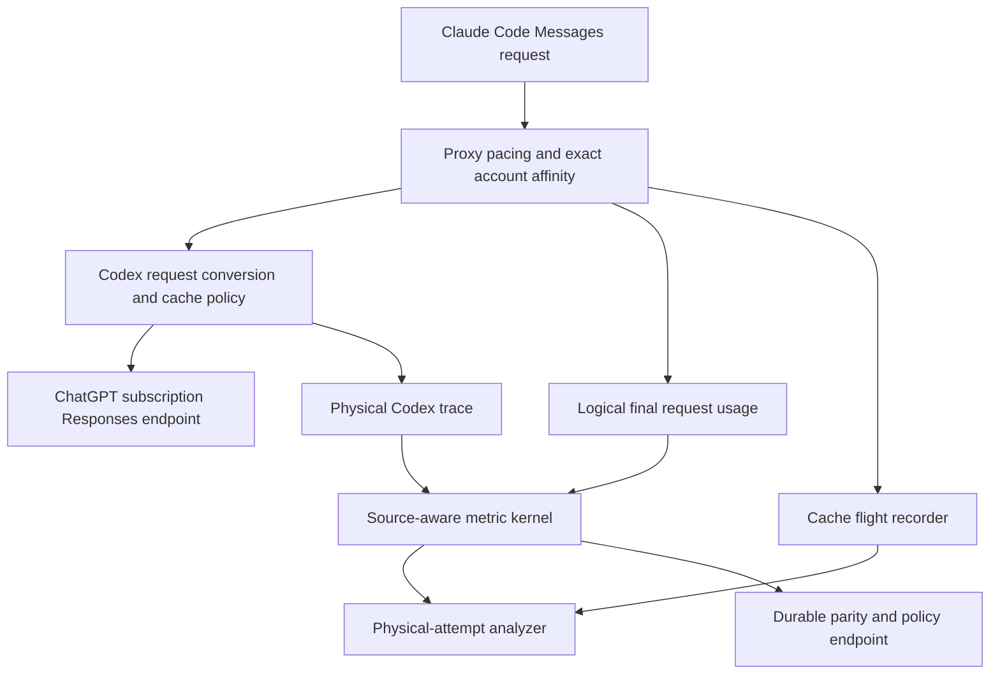
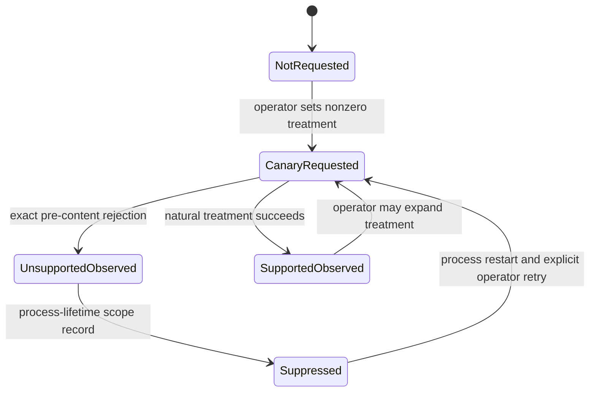

# OpenAI Prompt-Cache Parity Control Plane - Plan

## Goal Capsule

- **Objective:** Make Anthropic-class prompt-cache reuse a permanent, measurable capability of the Claude Code → better-ccflare → ChatGPT OAuth path, with an honest backend-blocked state when the private endpoint prevents parity.
- **Means:** Preserve the proven local controls, add one source-correct parity read model, and attribute the remaining pacing/backend boundary without adding another request-shaping experiment (KTD1-KTD7).
- **Authority:** Naturally initiated production evidence outranks private-endpoint assumptions; the private endpoint's observed contract outranks the public API contract for live routing; the public OpenAI contract defines the future re-entry target.
- **Execution profile:** Add characterization coverage before changing shared metric or trace behavior. Do not send scripted traffic to Anthropic-backed or Codex accounts.
- **Stop conditions:** Stop any implementation path that requires replaying a successful tool-bearing request, weakening exact-account routing, sending an unsupported cache field without the existing pre-content recovery, or adding a second telemetry store.
- **Tail ownership:** Fork issue [#174](https://github.com/StartupBros-com/better-ccflare/issues/174) owns parity. Planning issue [#228](https://github.com/StartupBros-com/better-ccflare/issues/228) owns this implementation. OpenAI issue [#35300](https://github.com/openai/codex/issues/35300) owns the private-backend capability gap.

---

## Product Contract

### Summary

This plan turns cache parity from a sequence of canaries into one bounded product capability. It keeps the controls that can affect the live Claude Code path, reports a sustained parity verdict from durable usage, and leaves unsupported explicit cache boundaries dormant until the ChatGPT subscription endpoint proves that it accepts them.

### Problem Frame

The remaining gap is real and not explained by the usual local causes. In the seven days ending 2026-08-20, successful Codex follow-ups read 78.91% of input from cache with a 9.36% zero-hit rate. Anthropic follow-ups read 96.63% with a 0.90% zero-hit rate. Restricting the comparison to same-account follow-ups under one minute still leaves Codex at 79.71% versus Anthropic at 97.66%.

Current schema-19 traces show `prompt_cache_key` on all eligible Codex traffic, no instruction changes, tool stability on all but a small fraction of turns, and no key above OpenAI's approximate 15 requests/minute guidance. They also show 1,402 zero-cache responses while runtime pacing recorded only seven cap releases. Key absence, ordinary idle expiry, instruction drift, account remapping, key concentration, and follower-cap release therefore cannot explain most of the residual loss.

The remaining causal boundary is the private backend. A 26-request natural-traffic treatment proved that `chatgpt.com/backend-api/codex/responses` rejects GPT-5.6 explicit breakpoints on Sol and Terra. Same-key, same-model, same-account, exact-prefix turns can still miss between highly cached neighbors. Public OpenAI documentation describes the missing explicit-boundary remedy, but public API support does not prove support on the ChatGPT subscription endpoint.

### Key Decisions

- **Only the production path is in scope.** (session-settled: user-directed — chosen over Codex CLI changes: the user does not use Codex CLI and those changes cannot improve better-ccflare's live provider path.) Governs R1, R13.
- **Codex remains available while cache behavior is optimized.** (session-settled: user-directed — chosen over disabling or shedding Codex traffic: the goal is parity, not avoidance.) Governs R2, R3, R12.
- **Every new local change must distinguish a causal lever from an external dependency.** The measured negative canaries make another generic experiment scaffold more expensive than useful. Governs R4-R12.

### Requirements

#### Production path and proven controls

- R1. Scope all behavior to Claude Code Anthropic-shaped Messages requests translated by better-ccflare to the ChatGPT Codex Responses subscription endpoint.
- R2. Preserve conversation-scoped `prompt_cache_key`, fail-closed exact-account routing, session affinity, 60-second first-chunk pacing, and bounded orchestration continuity.
- R3. Do not disable Codex, reduce its eligible traffic, or route around the provider as a cache optimization.
- R4. Treat turn-state replay, session-wide keys, prefix-shared shard keys, active WebSocket locality, terminal settle delay, and successful-response replay as unavailable parity mechanisms.

#### Parity and attribution

- R5. Compute cache-read share from the source's actual semantics: additive durable request usage uses `read / (uncached + read + write)`, while cache-inclusive Codex trace usage uses `read / total_input`.
- R6. Report token-weighted share, request median, P25, P75, positive-hit rate, and zero-hit rate together; no single statistic may stand in for parity.
- R7. Report first-observed and follow-up turns separately, and break follow-ups down by gap band, context band, physical model, serving account, and same-account status.
- R8. Label durable request metrics as logical-final usage and trace metrics as physical-attempt usage so retries and failovers cannot be compared as if they were the same population.
- R9. Attribute each Codex trace request to pacing role, wait duration, and leader-versus-cap release; legacy traces without these fields remain `unknown` rather than being imputed.

#### Backend capability and safety

- R10. Preserve the current account/model/endpoint-scoped suppression of rejected explicit breakpoints and its one pre-content retry without the rejected marker.
- R11. Expose the effective cache policy and observed explicit-breakpoint capability state without prompt text, raw session IDs, account IDs, full cache keys, or credentials.
- R12. Require an explicit operator rollout to re-test a backend capability; a successful probe never auto-promotes a percentage or changes request shape globally.
- R13. Defer stable developer-boundary placement and explicit-only mode until the private subscription endpoint accepts the documented marker on naturally initiated traffic.
- R14. Never retry a successful response because its usage reports zero cached tokens; tool-bearing requests may already have produced external effects.

#### Operator contract

- R15. Provide one read-only cache-parity endpoint that returns 24-hour advisory metrics, the authoritative rolling seven-day verdict, active policy, backend capability state, and evidence sufficiency; the Follow-Up Audit and configuration docs own the static KEEP / DEFER / RETIRE classifications.
- R16. Keep retired environment variables compatible and default-off; document that they are diagnostic compatibility surfaces rather than promotion candidates.
- R17. Keep rollback restart-scoped and migration-free for every cache policy in this plan.
- R18. Return `insufficient_evidence` when synthetic Codex keepalives can enter the durable cohort without a persisted origin marker; never count an unattributed replay as natural traffic.

### Success Criteria

The authoritative verdict uses successful measured Codex follow-ups over a rolling seven-day window. It reports `insufficient_evidence` until it has at least 1,000 follow-ups and 10 million input tokens. It reports `at_parity` only when all of these are true:

- token-weighted cache-read share is at least 96%;
- positive-hit rate is at least 99%;
- zero-hit rate is at most 1%;
- each qualified physical Codex model meets the same thresholds;
- when a contemporaneous Anthropic cohort is sufficiently sampled, Codex is no worse on all three cache metrics;
- success, fallback, and context-overflow rates do not regress from the pre-change baseline.

The 24-hour view is advisory and cannot declare sustained parity by itself. First turns are reported but excluded from the parity verdict.

### Acceptance Examples

- AE1. **Sustained miss:** Given a seven-day Codex follow-up cohort at 90% weighted reuse and a 4% zero-hit rate, when the parity endpoint is read, then it returns `below_parity` even if the latest short window exceeds 96%.
- AE2. **Source-correct math:** Given identical token counts represented once as additive durable usage and once as cache-inclusive trace usage, when each source is evaluated, then both produce the same cache-read share without double-counting cached tokens.
- AE3. **Pacing attribution:** Given a follower released by the 60-second cap, when its Codex response trace is joined, then the trace reports follower role, observed wait, and `cap`; a trace written before this schema change reports `unknown`.
- AE4. **Unsupported marker:** Given an operator-enabled explicit-breakpoint treatment and an upstream pre-content invalid-parameter rejection, when the request is retried, then the marker is removed once, the scope is suppressed for the process lifetime, and no rollout percentage changes.
- AE5. **Backend re-entry:** Given naturally initiated Sol and Terra treatment traffic that accepts the explicit marker without the suppression path, when the operator reviews the parity and capability report, then a separate stable-boundary follow-up may proceed; this plan does not auto-enable it.

### Scope Boundaries

#### Deferred to Follow-Up Work

- Represent top-level instructions as an equivalent stable developer input block and place an explicit breakpoint at its end only after the private endpoint proves support. Semantic equivalence, tool ordering, HTTP/WebSocket parity, and cache-write economics require their own implementation review.
- Investigate backend replica publication and cross-thread cache scope through OpenAI issues #35300, #33821, #30425, and #35925. better-ccflare cannot force a private cache write to become visible on another backend worker.
- Add cache-write cost alerts only when the subscription endpoint supplies trustworthy `cache_write_tokens` coverage.

#### Outside This Product's Identity

- Codex CLI compaction, `/fork`, `/side`, app-server thread lineage, and Codex desktop UI work.
- Scripted cache probes against Anthropic-backed or Codex accounts.
- Generic experiment orchestration, automatic rollout promotion, or a durable capability database.
- Replaying a successful response to obtain a better cache result.

### Sources

- Fork runtime: deployed SHA `9b1f8540`; `CCFLARE_CACHE_PACING_MS=60000`, `CCFLARE_CODEX_CACHE_KEY_CONTINUITY_PERCENT=100`, and `CCFLARE_CODEX_CACHE_PACING_SETTLE_MS=0` observed on 2026-08-20.
- Fork evidence: issues [#174](https://github.com/StartupBros-com/better-ccflare/issues/174), [#199](https://github.com/StartupBros-com/better-ccflare/issues/199), [#204](https://github.com/StartupBros-com/better-ccflare/issues/204), [#217](https://github.com/StartupBros-com/better-ccflare/issues/217), and [#222](https://github.com/StartupBros-com/better-ccflare/issues/222); PRs [#214](https://github.com/StartupBros-com/better-ccflare/pull/214), [#218](https://github.com/StartupBros-com/better-ccflare/pull/218), and [#223](https://github.com/StartupBros-com/better-ccflare/pull/223).
- Upstream better-ccflare: `v3.5.60` at `a451b680`; it retains basic conversation/session cache keys but has none of the fork's continuity, attribution, or private-backend capability work.
- OpenAI contract: [Prompt caching](https://developers.openai.com/api/docs/guides/prompt-caching), including GPT-5.6 exact breakpoints, default implicit mode, `30m` TTL, `cache_write_tokens`, and approximate 15 requests/minute/key guidance.
- OpenAI backend reports: [#35300](https://github.com/openai/codex/issues/35300), [#33821](https://github.com/openai/codex/issues/33821), [#30425](https://github.com/openai/codex/issues/30425), [#35925](https://github.com/openai/codex/issues/35925), and the cache-field compatibility outage [#39392](https://github.com/openai/codex/issues/39392).
- Current OpenAI Codex main observed at `312b62ac`; no open prompt-cache PR supplies private subscription-backend support.

---

## Planning Contract

### Key Technical Decisions

- KTD1. **Use the existing telemetry planes.** Durable `requests` rows own cross-provider logical-final parity; schema-19 Codex traces own physical-attempt diagnosis; cache-flight-recorder evidence owns prefix/account continuity. No new event store or migration is justified.
- KTD2. **Centralize source-aware cache math in a pure core module.** `cache-insights` and the Codex analyzer consume one metric contract while retaining explicit additive versus inclusive source tags (R5-R8).
- KTD3. **Make the rolling seven-day verdict authoritative.** The endpoint owns the thresholds in Success Criteria and emits the 24-hour window only as an early-warning view; it never infers parity from an unmatched short sample.
- KTD4. **Carry pacing receipts through the existing trusted internal-header seam.** The proxy already owns `CachePacingObservation`, and the provider already strips server-derived pacing headers before upstream dispatch. Extend that seam instead of adding cross-package mutable state (R9).
- KTD5. **Keep capability learning bounded and operator-driven.** The existing pre-content rejection classifier, process-lifetime suppression, and marker-free retry remain authoritative. Diagnostics expose their state; only an explicit percentage can test support (R10-R13).
- KTD6. **Quarantine measured-negative levers without deleting compatibility surfaces.** Defaults remain off, documentation names the verdict and re-entry trigger, and tests preserve rollback behavior (R4, R16-R17).
- KTD7. **Do not reshape the prompt in this implementation.** Public GPT-5.6 guidance makes a stable developer block the likely future boundary, but the private endpoint rejection prevents validating its wire or semantic behavior today (R13-R14).

### Assumptions

- The fixed fallback parity floor of 96% weighted reuse, 99% positive hits, and 1% zero hits is the rounded Anthropic-class target from the qualified seven-day production cohort. A future deliberate product decision may raise it; an Anthropic regression does not lower it automatically.
- A seven-day cohort with 1,000 follow-ups and 10 million input tokens is enough to prevent a short burst from declaring parity. The endpoint reports insufficient evidence below either bound.
- Global cache keepalive is disabled for the current Codex runtime. If that changes before durable request-origin attribution exists, the parity verdict fails closed under R18 rather than attempting to infer synthetic rows.
- A read-only API endpoint is the only new operator surface. No dashboard card, scheduled job, alert, or CLI command is required for this plan.

### High-Level Technical Design

The metric kernel serves both consumers without merging their populations. The parity endpoint labels durable usage as logical-final, while the existing analyzer labels trace evidence as physical-attempt; the operator contract keeps both scopes explicit.

`SupportedObserved` is evidence, not promotion. No state transition changes the configured percentage.

### Follow-Up Audit

| Lever | Verdict | Current evidence | Permanent ownership or re-entry trigger |
|---|---|---|---|
| Conversation-scoped `prompt_cache_key` | KEEP | Required by GPT-5.6 guidance; eligible production coverage is complete | Codex provider request conversion |
| Fail-closed exact-account and session affinity | KEEP | Same-account analysis still shows a gap, but remapping would make locality worse | Existing account selector and affinity strategy |
| 60-second first-chunk pacing | KEEP | Prevents overlapping followers; seven cap releases cannot explain 1,402 current-day zero hits | Existing cache-pacing module; add per-request attribution |
| Bounded orchestration continuity | KEEP | Safe, sibling-rejecting compaction continuity; active at 100%, narrow eligibility | Existing orchestration election and key decision |
| Source-correct cache accounting | KEEP | Prior denominator error reversed conclusions; current usage normalizer is correct | New shared metric kernel plus existing usage normalizer |
| Physical model/account/turn/gap/context reporting | KEEP | Sol, Terra, and account cohorts differ materially | Existing analyzer plus parity endpoint |
| Unsupported-field suppression and pre-content retry | KEEP | Current code scopes by account/model/endpoint and avoids successful-response replay | Existing breakpoint suppression; expose status |
| Backend escalation evidence | KEEP | OpenAI issues remain open and match local same-key misses | #174 and #35300 tail ownership |
| GPT-5.6 explicit stable boundary on subscription endpoint | DEFER | 26/26 marker treatments returned invalid-parameter errors | Re-open only after natural Sol and Terra acceptance |
| Backend publication and replica consistency | DEFER | Identical or adjacent exact-prefix requests can split hit/zero | OpenAI backend change or documented affinity contract |
| Cross-thread/shared-startup cache lineage | DEFER | Shared keys alone did not recover the prefix | Backend-supported lineage or explicit developer boundary |
| Trustworthy GPT-5.6 cache-write reporting | DEFER | Public API documents it; private subscription evidence is not yet reliable enough for cost gates | Re-open when measured coverage is explicit |
| Session-wide cache keys | RETIRE | Concentrates unrelated agent fan-out and underperformed conversation keys | Compatibility flag remains default-off |
| Prefix-sharded shared keys | RETIRE | Warmed reuse was 86.16% with max 13 requests/minute/key | Re-open only with a new backend contract, not another shard count |
| Active Responses WebSocket locality | RETIRE | Measured reuse regressed to 75.43% | Keep transport canary default-off for non-parity diagnostics |
| HTTP turn-state replay as a parity lever | RETIRE | Eligible replay treatment was null and cannot address independent new turns | Preserve only its narrow protocol compatibility role |
| Post-terminal settle delay | RETIRE | 6-second treatment was 85.13% versus 87.36% matched control | Compatibility flag remains zero |
| Top-level default `prompt_cache_options` alone | RETIRE | `implicit` and `30m` are already defaults; explicit mode without a marker disables caching | Pair only with a supported explicit-boundary design |
| Codex CLI compaction, fork, or side-chat work | RETIRE | It is outside the live user path | No better-ccflare work |
| Retry after a successful zero-cache response | RETIRE | Usage arrives after potential tool effects; replay is unsafe | Prohibited by R14 |

### System-Wide Impact

- **Request path:** No production request body, cache key, account selection, or transport behavior changes. Only trusted diagnostic headers are added and stripped before upstream dispatch.
- **Persistence:** No schema or migration changes. The parity query reads existing request and account columns.
- **PostgreSQL:** The parity query must use constructs covered by both adapters and receive a live-PostgreSQL contract test because root typecheck excludes tests and SQLite success is not proof of PostgreSQL behavior.
- **Performance:** The endpoint uses fixed 24-hour and seven-day windows, timestamp-indexed reads, SQL aggregation, and bounded cache-share histograms. It must not pull an unbounded request list into JavaScript or silently truncate the authoritative window.
- **Privacy:** Outputs contain aggregate metrics, known model names, configured account display names where already exposed by insights, and low-cardinality policy state. They contain no request payloads or reversible conversation identifiers.
- **Compatibility:** Existing cache flags and API responses remain intact. The new endpoint is additive.

### Risks and Mitigations

- **Private and public contracts diverge again.** Keep capability learning endpoint/model scoped and pre-content only; never infer private support from public docs.
- **A parity report masks physical retries.** Label logical-final and physical-attempt scopes and never combine their denominators.
- **A large parity query harms the local proxy.** Aggregate shares in SQL, cap the supported windows, and exercise the query against production-scale fixtures.
- **Synthetic keepalives pollute natural-traffic parity.** Fail the verdict closed while global Codex keepalive is enabled without durable request-origin attribution (R18); do not add a migration until that policy is actually needed.
- **A fixed floor becomes stale.** Report live Anthropic deltas beside the floor; change the floor only through a deliberate plan, not automatic baseline drift.
- **Retired flags are accidentally promoted.** Mark them diagnostic/default-off in configuration docs and return their effective values in policy diagnostics.
- **Trusted pacing metadata leaks upstream.** Extend the existing reserved-header stripping tests for every added field and fail closed on malformed values.

### Sequencing

U1 establishes the metric contract. U2 uses it to build the parity read model and policy surface. U3 adds the missing causal pacing dimension to the existing trace and analyzer. U4 then documents the final ownership and quarantine state against the shipped surfaces.

---

## Implementation Units

### U1. Source-aware cache metric kernel

- **Goal:** Make additive durable usage and cache-inclusive trace usage impossible to confuse in cache-rate calculations.
- **Requirements:** R5-R8.
- **Dependencies:** None.
- **Files:**
  - Create `packages/core/src/cache-metrics.ts`.
  - Create `packages/core/src/cache-metrics.test.ts`.
  - Modify `packages/core/src/index.ts`.
  - Modify `packages/http-api/src/services/cache-insights.ts`.
  - Modify `packages/http-api/src/services/__tests__/cache-insights.test.ts`.
  - Modify `packages/providers/src/providers/codex/analyze-trace.ts`.
  - Modify `packages/providers/src/providers/codex/analyze-cache-experiments.test.ts`.
- **Approach:** Define explicit additive and inclusive observation shapes. Own safe clamping, per-request share, token-weighted aggregation, positive/zero classification, and nearest-rank quantiles in the pure module. Keep `packages/providers/src/providers/codex/usage.ts` as the wire-to-additive normalizer; it supplies the durable shape rather than duplicating metric math.
- **Execution note:** Start with the denominator regression that previously made a roughly 93% trace median appear near 48%.
- **Patterns to follow:** `packages/http-api/src/services/cache-insights.ts` pure math and `packages/providers/src/providers/codex/usage.ts` explicit measurement-availability handling.
- **Test scenarios:**
  - Additive input `100`, cache read `900`, cache write `0` yields 90%; inclusive input `1000`, cache read `900` also yields 90%.
  - Cache writes participate in the additive denominator but never in the inclusive denominator twice.
  - Missing, negative, non-finite, and read-greater-than-total observations become unavailable or bounded according to one documented rule.
  - Weighted share, median, P25, P75, positive rate, and zero rate remain distinct on a deliberately skewed cohort.
  - Existing cache-insights and Codex analyzer fixtures retain their current correct outputs after delegation.
- **Verification:** Every cache consumer names its source shape, and no direct duplicate denominator formula remains in the migrated paths.

### U2. Durable cache-parity and policy endpoint

- **Goal:** Give the operator one read-only answer for current parity, evidence sufficiency, diagnostic cohorts, and effective cache policy.
- **Requirements:** R6-R8, R11-R13, R15, R17-R18; AE1, AE2, AE5.
- **Dependencies:** U1.
- **Files:**
  - Modify `packages/types/src/insights.ts`.
  - Create `packages/http-api/src/services/cache-parity.ts`.
  - Create `packages/http-api/src/services/__tests__/cache-parity.test.ts`.
  - Modify `packages/http-api/src/handlers/insights.ts`.
  - Create `packages/http-api/src/handlers/__tests__/insights-cache-parity.test.ts`.
  - Modify `packages/http-api/src/router.ts`.
  - Modify `packages/http-api/src/services/__tests__/auth-service.test.ts`.
  - Modify `packages/http-api/src/__tests__/pg-live-queries.test.ts`.
  - Modify `packages/providers/src/providers/codex/provider.ts` only to export a bounded suppression count/status accessor if the endpoint cannot obtain it through an existing public surface.
- **Approach:** Add `GET /api/insights/cache-parity` under the existing authenticated dashboard-insights boundary; API-only keys remain restricted to proxy endpoints. Query fixed 24-hour and seven-day windows from `requests` joined to `accounts`. Use logical session order to classify first/follow-up, gap, same-account status, and context bands. Resolve Codex physical models from existing applied-model provenance rather than the inbound logical model. Aggregate cache-share histograms in SQL so quantiles are exact to the report's fixed resolution without loading every request or truncating. Return aggregate provider rows, Codex physical-model/account diagnostics, the authoritative verdict, evidence counts, metric scope, active percentages/modes, and explicit-breakpoint suppression status. If global keepalive policy can replay Codex traffic without durable origin attribution, return R18's insufficient-evidence reason instead of evaluating the mixed cohort.
- **Patterns to follow:** `createCacheInsightsHandler` for adapter-neutral queries and error handling; `buildCacheInsightsResponse` for pure response construction; existing debug-auth coverage for non-public diagnostic fields.
- **Test scenarios:**
  - A short 24-hour pass with a seven-day miss returns `below_parity`.
  - A seven-day cohort below either evidence floor returns `insufficient_evidence`.
  - A qualified cohort passes only when weighted, positive, zero, physical-model, and regression gates all pass.
  - First turns are visible but excluded from the verdict.
  - Sol and Terra remain separate even with date-suffixed physical model names; custom model names are bounded/sanitized according to the existing analyzer policy.
  - Same-account under-one-minute rows remain a separate diagnostic slice.
  - SQLite and live PostgreSQL return equivalent cohort and quantile results.
  - An applied Sol or Terra model remains physically classified even when the inbound logical model is a Claude model.
  - A nonzero global keepalive policy with no durable origin marker returns `insufficient_evidence` instead of counting replay traffic.
  - An unauthenticated request is rejected when API-key auth is enabled, and an API-only key cannot read dashboard insights.
  - The response contains no prompt content, session IDs, raw cache keys, or account IDs.
  - Query plans use the timestamp-bounded request path and the endpoint does not silently cap a qualified seven-day window.
- **Verification:** The current production dataset would return `below_parity`, not a false pass, and the response states `logical_request_final_usage` as its scope.

### U3. Per-request pacing receipt attribution

- **Goal:** Determine whether a specific residual cache miss followed a leader release or a 60-second cap without changing pacing behavior.
- **Requirements:** R8-R9, R14; AE3.
- **Dependencies:** U1.
- **Files:**
  - Modify `packages/proxy/src/handlers/proxy-types.ts`.
  - Modify `packages/proxy/src/proxy.ts`.
  - Modify `packages/proxy/src/handlers/proxy-operations.ts`.
  - Modify `packages/proxy/src/handlers/__tests__/proxy-operations-count-tokens.test.ts`.
  - Modify `packages/proxy/src/__tests__/cache-pacing.test.ts`.
  - Modify `packages/providers/src/providers/codex/provider.ts`.
  - Modify `packages/providers/src/providers/codex/trace.ts`.
  - Modify `packages/providers/src/providers/codex/trace.integration.test.ts`.
  - Modify `packages/providers/src/providers/codex/analyze-trace.ts`.
  - Modify `packages/providers/src/providers/codex/analyze-cache-experiments.test.ts`.
- **Approach:** Copy the already-computed `CachePacingObservation` role, wait, and release reason into request metadata. Stamp bounded server-derived headers for Codex attempts beside the existing pacing canary headers. Delete all client-supplied copies, read them into schema-20 request traces, and strip them before every upstream path. Extend the analyzer with `leader`, `follower/leader-release`, `follower/cap-release`, and `unknown` cohorts.
- **Execution note:** Characterize every transport and retry header path before changing the trusted carrier list.
- **Patterns to follow:** Existing `x-better-ccflare-pacing-*` carriers, `PRESERVED_INTERNAL_HEADERS`, attempt stamping, and old-schema analyzer compatibility.
- **Test scenarios:**
  - A leader records zero wait and no follower release reason.
  - A follower released by the leader records its bounded wait and `leader`.
  - A follower released by the cap records the cap and wait without changing downstream bytes or routing.
  - Malformed or spoofed client values are removed and never reach traces or upstream.
  - Account failover preserves the logical pacing receipt while the trace still identifies the actual physical attempt.
  - Every success, non-OK, cancellation, bodyless, HTTP, and WebSocket transport path strips the internal fields upstream.
  - Schema-19 traces parse with `unknown`; schema-20 traces group by receipt and keep the source-correct denominator.
- **Verification:** A naturally occurring cap release can be joined to cache usage by request/attempt ID, while pacing counters and response behavior remain unchanged.

### U4. Quarantine and re-entry documentation

- **Goal:** Replace ambiguous rollout prose with a concise permanent ownership table for proven, deferred, and retired cache levers.
- **Requirements:** R4, R10-R18.
- **Dependencies:** U2, U3.
- **Files:**
  - Modify `docs/configuration.md`.
  - Modify root `README.md` only if its existing cache guidance points to a retired lever.
- **Approach:** Keep every compatibility variable documented, but mark session keys, prefix sharding, turn-state replay, WebSocket locality, and terminal settle as default-off diagnostics with their measured verdict. Point operators to the parity endpoint. State the explicit-boundary re-entry trigger and the private/public endpoint distinction. Remove instructions that imply a measured-negative lever should be staged toward promotion.
- **Patterns to follow:** Existing configuration tables and the source-specific warning in `docs/solutions/observability/codex-trace-input-tokens-are-cache-inclusive.md`.
- **Test scenarios:** Test expectation: none — this unit changes documentation only; configuration and behavior stay covered by U2/U3 and existing focused suites.
- **Verification:** An operator can identify the active foundation, backend-blocked work, retired canaries, rollback, and parity verdict without reading issue history.

---

## Verification Contract

| Gate | Command or observation | Applies to | Done signal |
|---|---|---|---|
| Metric contract | `bun test packages/core/src/cache-metrics.test.ts packages/http-api/src/services/__tests__/cache-insights.test.ts packages/providers/src/providers/codex/analyze-cache-experiments.test.ts` | U1 | Additive and inclusive fixtures agree; skewed cohorts retain all six metrics |
| Parity service | `bun test packages/http-api/src/services/__tests__/cache-parity.test.ts packages/http-api/src/handlers/__tests__/insights-cache-parity.test.ts packages/http-api/src/services/__tests__/auth-service.test.ts` | U2 | Verdict, privacy, evidence floors, and endpoint access pass |
| PostgreSQL contract | `DATABASE_URL=<test-database> bun test packages/http-api/src/__tests__/pg-live-queries.test.ts` | U2 | Live PostgreSQL cohort query matches the SQLite contract; if unavailable, the gate is reported as skipped rather than passed |
| Pacing trace | `bun test packages/proxy/src/__tests__/cache-pacing.test.ts packages/proxy/src/handlers/__tests__/proxy-operations-count-tokens.test.ts packages/providers/src/providers/codex/trace.integration.test.ts` | U3 | Receipt propagation, stripping, legacy compatibility, and response preservation pass |
| Breakpoint safety | `bun test packages/providers/src/providers/codex/explicit-cache-breakpoint.test.ts packages/proxy/src/handlers/__tests__/proxy-operations-codex-websocket.test.ts` | U2, U3 | Unsupported markers remain scoped, pre-content-only, and retry once without promotion |
| Repository gates | `bun run lint && bun run typecheck && bun run format` | All | All commands pass; test call sites were exercised separately because typecheck excludes tests |
| Diff hygiene | `git diff --check` and explicit status review | All | No generated inline worker, unrelated file, version bump, or unformatted diff is staged |
| Runtime smoke | Read `/health`, `/api/debug/cache-pacing`, and `/api/insights/cache-parity` after deployment | U2, U3 | Runtime SHA matches the deployed main commit; parity is honest; no inference request is generated |

No verification step may send scripted traffic to an Anthropic-backed or Codex account. Runtime evidence comes from naturally initiated authorized traffic already passing through the proxy.

---

## Definition of Done

- U1 has one tested source-aware cache metric owner, and the migrated analyzer and insights paths contain no competing denominator rule.
- U2 exposes a privacy-safe 24-hour/seven-day parity report whose current dataset reads `below_parity`, whose seven-day verdict cannot be overridden by a short window, and whose PostgreSQL behavior is verified or explicitly blocked on unavailable infrastructure.
- U3 joins pacing role, wait, and release reason to physical Codex cache usage while preserving all request bytes, routing, retries, and upstream header privacy.
- U4 names every audited lever as KEEP, DEFER, or RETIRE and removes promotion language from measured-negative canaries without deleting compatibility flags.
- Existing conversation keys, exact-account routing, bounded continuity, first-chunk pacing, breakpoint suppression, and marker-free pre-content retry remain behaviorally unchanged.
- No code sends `prompt_cache_options`, changes the instruction/message layout, retries a successful response, or opens a new WebSocket because of this plan.
- The fixed parity floor and live Anthropic comparison are both visible; insufficient evidence, including unattributed synthetic traffic under R18, cannot be rendered as success.
- The full focused suites, lint, typecheck, format, and diff checks pass. Any unavailable live-PostgreSQL gate is named as the only remaining blocker.
- Abandoned experimental code or duplicate telemetry introduced during implementation is removed before landing.
- Issue #174 remains open until naturally initiated traffic satisfies the seven-day Definition of Done and the reporter confirms the outcome.
