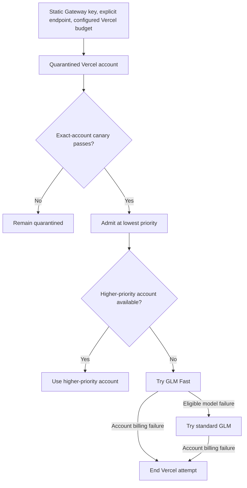
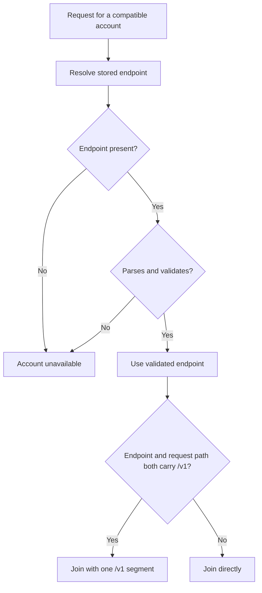

# Direct Vercel Gateway Key Lane - Plan

## Goal Capsule

- **Objective:** Claude Code can use the user's Vercel AI Gateway capacity as a safe last-resort fallback after higher-priority accounts are exhausted.
- **Means:** Harden the generic API-key-compatible lane, then configure one lowest-priority Vercel account that tries GLM Fast before standard GLM (KTD1, KTD5).
- **Authority:** Requirements win on product behavior; Key Technical Decisions win on implementation mechanism inside those requirements. The user is the operator and decides the Vercel API-key budget and whether the account stays enabled.
- **Execution profile:** Six units across providers, http-api, core, openai-formats, proxy tests, and docs. U1 and U2 are independent, U3 follows U1, U4 follows U2, U5 follows U2 and U4, and U6 is independent. No database migration. U1-U3 change shared compatible-lane behavior; U4-U6 are additive.
- **Stop conditions:** Stop and ask if hardening would change behavior for a provider beyond the xAI, Qwen, and Kilo paths U2 already covers, if the endpoint audit in U2 finds an account depending on the accidental default, or if proving a unit would require traffic that R11 forbids.
- **Tail ownership:** The implementer runs the Verification Contract and lands the work; the operator owns creating the Vercel account, setting its Vercel-side budget, and running the admission canary.
- **Open blockers:** None. A Gateway API key and its Vercel-side budget are deployment prerequisites, not planning blockers.

---

## Product Contract

Product Contract preservation: no scope change. Requirements, actors, and acceptance examples keep their original meaning and IDs. Four edits: planning answered all four Deferred to Planning questions as KTD1, KTD2, KTD7, and KTD8, and the two that leave a residual implementation-time confirmation moved to Deferred to Implementation; two Scope Boundaries bullets now cite R11 and the priority ceiling instead of restating rules owned elsewhere; F1's outcome and F3's Covers list were corrected to match the mechanism KTD6 chose and the requirement set F3 exercises; and a success criterion for R15 was added.

### Summary

A hardened generic API-key lane will admit one Vercel AI Gateway account as the final catch-all for every Claude Code model family.
The account enters normal fallback routing only after a forced, fail-closed canary validates Claude Code behavior against non-Anthropic GLM traffic.

### Problem Frame

The user's Vercel team currently provides valuable GLM capacity through fx, including substantial locally observed zero-cost usage, but fx is not the user's primary coding client.
Claude Code already reaches heterogeneous fallback accounts through better-ccflare, so reproducing fx authentication and session behavior would add carrying cost without improving the primary workflow.

The existing generic compatible-provider lane is close to sufficient but is not safe enough for unattended last-resort routing.
Its creation surfaces persist static credentials differently, its refresh contract conflicts with one of those row shapes, and missing or invalid endpoints can fall through to OpenAI rather than failing closed.
These defects apply to every generic compatible account, not only Vercel.

### Actors

- A1. **Operator:** Adds the Vercel account, configures its external budget, runs the admission canary, and controls whether it stays enabled.
- A2. **Claude Code client:** Sends ordinary Claude-family requests without knowing the Vercel account exists.
- A3. **better-ccflare router:** Preserves higher-priority routing, selects the Vercel account only as the last eligible fallback, and enforces canary isolation.
- A4. **Vercel AI Gateway:** Authenticates the static key, serves GLM Fast or standard GLM, and enforces the key's external budget.

### Key Decisions

- **Use a static Gateway key instead of fx feature parity.** (session-settled: user-directed — chosen over fx OAuth and native fx behavior: the user primarily uses Claude Code and uses fx only to reach the Vercel compute.) Governs R1, R2, R12.
- **Harden the generic lane instead of adding a named Vercel provider.** (session-settled: user-approved — chosen over configuration-only and a thin Vercel provider: reusable safety fixes are needed, while provider-specific scope is not yet justified.) Governs R1-R3, R13.
- **Make Vercel the all-family, lowest-priority catch-all.** (session-settled: user-directed — chosen over tier-specific or route-profile-only use: the account should behave like mac-studio or Grok after all preferred capacity is exhausted.) Governs R4-R6.
- **Try GLM Fast before standard GLM.** (session-settled: user-approved — chosen over Fast-only or standard-first routing: prefer accelerated compute while retaining a same-account fallback.) Governs R7, R8.
- **Allow paid fallback within the Vercel key budget.** (session-settled: user-approved — chosen over free-only pause or abandoning the key path: zero-cost entitlement portability is beneficial but not required.) Governs R10-R12.
- **Require an exact-account admission canary.** (session-settled: user-approved — chosen over immediate normal-pool admission: validation must not escape to another account or provider.) Governs R9-R11.

### Requirements

**Generic static-key safety**

- R1. Every supported creation surface must produce equivalent non-expiring static-key behavior for a generic API-key-compatible account.
- R2. A generic API-key-compatible account must authenticate from its canonical static API key without requiring OAuth-shaped refresh credentials or synthetic expiry.
- R3. A missing, malformed, or invalid custom endpoint must make the account unavailable and must never redirect the request to a default upstream.

**Catch-all account contract**

- R4. The Vercel account must be eligible for every Claude Code logical model family.
- R5. The Vercel account must have lower routing precedence than every preferred cloud or local account intended to serve the same request.
- R6. Ordinary traffic must reach the Vercel account only after no higher-priority eligible account can serve it.
- R7. Every eligible logical family must resolve first to `zai/glm-5.2-fast` and then to `zai/glm-5.2` within the same Vercel account.
- R8. A model-scoped Fast failure may advance to standard GLM, while an account-wide billing failure must end that account attempt without trying another physical model.

**Admission canary**

- R9. Before normal fallback admission, the operator must force-route a canary to the exact Vercel account and the selected account must not escape to another account on failure.
- R10. The canary must demonstrate a complete streamed Claude Code turn, including xhigh reasoning intent, function-tool round trip, terminal usage, and normal stream termination.
- R11. The canary must demonstrate the Fast-primary and standard-fallback order using non-Anthropic routes or deterministic fixtures without sending scripted traffic to an Anthropic-backed account.

**Economic boundary and ongoing behavior**

- R12. The operator must configure a Vercel-side API-key budget before the account may enter normal fallback routing.
- R13. A canary remains economically successful whether Vercel bills it at zero or debits the configured balance, provided the charge stays within the external key budget.
- R14. A Vercel 402 billing response must remove the account from the current request and allow the existing outer routing behavior to continue; when no account remains, the request must end with the existing stable route-unavailable response.
- R15. Internally estimated cost for an unknown Gateway model must not be presented as authoritative Vercel billing truth.

**Compatibility**

- R16. Hardening must preserve valid existing generic compatible endpoints, bearer-auth replacement, request conversion, tool conversion, response conversion, and SSE behavior.
- R17. Existing generic compatible accounts must retain their configured routing precedence and model mappings unless their stored endpoint or credential state violates R1-R3.

### Key Flows

- F1. **Account setup and quarantine**
  - **Trigger:** A1 adds the Vercel Gateway account.
  - **Actors:** A1, A3, A4.
  - **Steps:** The operator supplies a static key, explicit endpoint, lowest fallback priority, all-family model order, and external key budget; the account remains outside normal routing.
  - **Outcome:** The account is configured and paused, so it receives no traffic at all; admission requires the canary in F2, and KTD6 states the exposure that exists while it is unpaused for that canary.
  - **Covers:** R1-R7, R12.

- F2. **Admission canary**
  - **Trigger:** A1 explicitly starts validation for the quarantined account.
  - **Actors:** A1, A2, A3, A4.
  - **Steps:** A3 pins the request to the Vercel account; the turn exercises streaming, reasoning intent, and a function tool; Fast and standard behavior are validated without alternate-account escape.
  - **Outcome:** The account is admitted only when routing and fidelity conditions pass; zero-cost billing is recorded as evidence but is not a gate.
  - **Covers:** R9-R13.

- F3. **Last-resort fallback**
  - **Trigger:** A2 sends a request that no higher-priority eligible account can serve.
  - **Actors:** A2, A3, A4.
  - **Steps:** A3 selects the Vercel account, tries Fast, and uses standard GLM only for an eligible model-scoped fallback.
  - **Outcome:** The request completes through Vercel or continues through existing failure handling without changing preferred-account behavior.
  - **Covers:** R4-R8, R15, R16, R17.

- F4. **Budget exhaustion**
  - **Trigger:** A4 returns an account-wide billing failure.
  - **Actors:** A2, A3, A4.
  - **Steps:** A3 ends the Vercel account attempt and applies existing outer failover behavior.
  - **Outcome:** Another eligible account serves the request, or the client receives the existing terminal route-unavailable response.
  - **Covers:** R8, R14.

### Admission Flow

The diagram illustrates R5-R14; the requirements remain authoritative.

### Acceptance Examples

- AE1. **Covers R1, R2, R16.** Given equivalent valid generic account input through CLI and dashboard/API, when each account sends a request, then both use the same canonical static-key semantics and bearer-auth behavior.
- AE2. **Covers R3, R9.** Given a forced Vercel canary with a missing or malformed endpoint, when routing begins, then the request fails closed on that account and does not reach OpenAI or another account.
- AE3. **Covers R9, R10.** Given a valid forced Vercel canary, when Claude Code requests xhigh reasoning and invokes a function tool over a stream, then the client receives the tool round trip, terminal usage, and normal message termination from that exact account.
- AE4. **Covers R7, R8, R11.** Given Fast returns an eligible model-scoped failure, when the account attempts its configured fallback, then standard GLM is tried before the Vercel account is abandoned.
- AE5. **Covers R8, R14.** Given Vercel returns an account-wide 402, when the account attempt is classified, then standard GLM is not tried and the outer router proceeds to the next eligible account or terminal route-unavailable behavior.
- AE6. **Covers R12, R13.** Given the external key budget is configured and the canary is billed, when fidelity and routing checks pass, then the account may still be admitted as a paid last-resort fallback.
- AE7. **Covers R4-R6.** Given at least one higher-priority eligible account can serve a request, when normal routing runs, then the Vercel catch-all is not selected for any Claude family.
- AE8. **Covers R15.** Given a Vercel model lacks authoritative internal price data, when better-ccflare displays or records its estimate, then the value is distinguishable from confirmed upstream billing.

### Success Criteria

- All generic account creation surfaces yield the same static-key lifetime and refresh behavior.
- Invalid endpoint state cannot send a request to an unintended default upstream.
- The forced canary completes the required streamed reasoning and tool behavior without alternate-account escape.
- The admitted account is reachable for all Claude families only after preferred capacity is unavailable.
- Fast is attempted before standard GLM for eligible model-scoped failures.
- Charged traffic remains bounded by the operator-configured Vercel API-key budget, and 402 uses existing account-wide failover behavior.
- An unknown Gateway model's cost is never presented as confirmed Vercel billing.

### Scope Boundaries

- No fx OAuth import, fx refresh/session reuse, local fx broker, team-header emulation, or native fx transport.
- No named `vercel-ai-gateway` provider or provider-specific setup surface.
- No Vercel Gateway receipt ingestion, account-wide spend report, dollar-accurate internal budget enforcement, or automatic free-entitlement detection.
- No native Messages/Responses fan-out or full protocol-parity campaign beyond the Claude Code behaviors required by R10 and R11.
- No changes to the priority or routing policy of existing preferred accounts, and no change to the shared priority ceiling.
- No canary traffic beyond what R11 permits.

### Dependencies / Assumptions

- The operator can obtain a static AI Gateway API key for the same Vercel team used by fx.
- The operator can configure a Vercel-side budget for that key before admission.
- Vercel continues to expose `zai/glm-5.2-fast` and `zai/glm-5.2` through its compatible API surface.
- Zero-cost entitlement portability from fx OAuth to the static key is unknown and does not block the feature.
- The existing generic converter remains the product authority for the supported Claude Code behavior in this slice.

### Outstanding Questions

**Resolve Before Planning**

- None.

**Deferred to Implementation**

- Confirm how the PostgreSQL change-notification trigger behaves for a static-key row that no longer mirrors the key into `refresh_token` and `access_token` (U1).
- Confirm the live Vercel success shape before freezing its fixture, and record which failure fixtures were constructed rather than observed (U5).
- Confirm that downstream cost recording accepts an absent value before removing the fallback estimate (U6).
- Record whether an observed Vercel 429 carries billing-exhaustion evidence; if it does, widening the account-wide failure definition becomes a follow-up decision rather than part of this plan (U5).

### Sources / Research

- `apps/cli/src/main.ts` — generic account mode and interactive compatible-provider setup.
- `packages/cli-commands/src/commands/account.ts` — static-key creation, priority, endpoint, and family model mappings.
- `packages/http-api/src/handlers/accounts.ts` — dashboard/API account creation behavior.
- `packages/providers/src/providers/openai/provider.ts` — generic endpoint, bearer auth, response conversion, usage, pricing, and refresh behavior.
- `packages/openai-formats/src/converters.ts` — reasoning, tool, model, and response translation.
- `packages/openai-formats/src/stream.ts` — streamed tool-call and terminal-event behavior.
- `packages/proxy/src/handlers/account-selector.ts` — exact-account fail-closed routing.
- `packages/proxy/src/handlers/proxy-operations.ts` — generic 402 scope and outer failover.
- `docs/ideation/2026-08-20-vercel-ai-gateway-integration-ideation.html` — upstream ideation and external Vercel/fx evidence.

---

## Planning Contract

### Key Technical Decisions

- KTD1. **Give the Vercel account priority 100, the platform maximum.** `validatePriority` in `packages/core/src/validation.ts` caps priority at 100 on every creation and update path, so 100 is the floor of the ladder, not a chosen midpoint. The live ladder is codex 25, Anthropic 30, xAI 50, mac-studio 75, OpenRouter 100, so 100 places Vercel strictly below every active account and ties only with the paused OpenRouter account; existing stable ordering resolves that tie if OpenRouter is ever resumed. Raising the cap is out of scope. Governs R5, R6.
- KTD2. **Align HTTP account creation to the static-key row shape with an INSERT-only change.** `createMuseSparkAccountAddHandler` in `packages/http-api/src/handlers/accounts.ts` already writes the canonical shape for a static-key provider, and `deriveComboRouteClass` in `packages/providers/src/request-capabilities.ts` already treats mirrored and non-mirrored rows as one class, so no routing, migration, or sibling-provider change is required. Governs R1.
- KTD3. **Resolve the compatible endpoint once and fail closed.** Replace all five default-to-OpenAI branches: four in `packages/providers/src/providers/openai/provider.ts` — `buildUrl`'s no-account path, `buildUrl`'s catch, `transformRequestBody`'s initializer, and `transformRequestBody`'s catch — plus the default inside `getEndpointUrl` in `packages/core/src/model-mappings.ts`. A partial fix leaves a silent default behind. Governs R3.
- KTD4. **Read static-key credentials from `api_key`, tolerating the legacy mirrored row.** `refreshToken` currently requires `refresh_token`, which a CLI-created account never has. Reading `api_key` first and falling back to the mirrored value fixes the contract without breaking existing rows. Governs R2.
- KTD5. **Write the Vercel model mappings explicitly at account creation.** The CLI's displayed defaults are prompt text only — accepting them persists no mapping, and an unmapped Claude model is forwarded to the gateway unchanged. Ordered arrays are already supported per family. Governs R7.
- KTD6. **Quarantine by pausing the account, and admit it through a bounded unpause window rather than a new admission flag.** A paused account is unavailable, and exact-account routing fails closed on unavailable accounts, so the canary cannot reach a paused account: the operator resumes it, runs the canary immediately, and pauses it again on failure. During that window the account is an ordinary priority-100 last resort, which is its intended steady state; the residual exposure is bounded by the Vercel-side key budget. Governs R9.
- KTD7. **Capture only the success shape live; construct the failure shapes.** One live force-routed session inside KTD6's unpause window captures the streamed tool turn, because that is what admission actually gates on. The 402, 429, and model-scoped failures are built from the provider's documented error shapes rather than provoked live: deliberately forcing a 402 would mean exhausting the budget the operator just set under R12. Every routing, ordering, and failure assertion runs offline and must respect R11. Governs R10, R11.
- KTD8. **Record no cost for an unknown gateway model instead of a default-priced estimate.** An absent value is honestly unknown, while the current fallback price produces a confident wrong number. This changes cost display for every compatible account, not only Vercel's. Governs R15.
- KTD9. **Leave generic rate-limit classification unchanged.** `parseRateLimit` reports no rate limit for compatible accounts, so a Vercel 429 continues to behave as a model-unavailable signal rather than benching the account. Reclassifying it would alter every other compatible provider. U5 captures a real 429 and records whether it carries billing-exhaustion evidence, so a later decision can revisit this without widening scope now. Governs R8.

### High-Level Technical Design

Endpoint resolution is the riskiest change because the current default is reached from five independent places. KTD3 routes them through one resolver.

Today the `No` branches return the default OpenAI host instead of reaching `Account unavailable`. The requirements remain authoritative; this diagram shows only where the four branches converge.

### Assumptions

- The credential divergence is latent rather than active: request-time auth already resolves `api_key` for compatible accounts, and compatible accounts sit outside both reactive and proactive refresh eligibility. U1 and U3 are consistency and prevention work, not an outage fix.
- Base URL `https://ai-gateway.vercel.sh/v1` combined with the existing single-`/v1` de-duplication guard yields one `/v1` segment. U2 pins this.
- No schema change is needed; SQLite and PostgreSQL already define every column this work uses.
- Existing compatible accounts hold valid endpoints. U2's audit verifies that before the fail-closed behavior lands.
- Zero-cost entitlement portability from the fx OAuth session to a static key is unverified and is recorded as canary evidence under R13.

### Implementation Constraints

- Honor the repository testing rule in `AGENTS.md`: scripted traffic must never reach an Anthropic-backed account. Force-route a non-Anthropic account or use fixtures. R11 states the canary-specific form of this rule.
- `typecheck` excludes test files, so grep call sites with `grep -a` after changing any shared signature.
- A fresh worktree must run `bun run build:cli` once before `bun test` can import.
- Never read, edit, or commit the four auto-generated inline worker files.
- Any future SQLite migration must be ported to PostgreSQL; this plan adds none.

### Sequencing

U1 and U2 are independent and may land in either order. U3 follows U1 so the auth contract and the row shape change together. U4 follows U2 because the recipe documents hardened behavior. U5 follows U2 and U4. U6 is independent and may land last.

---

## Implementation Units

### U1. Canonical static-key persistence in HTTP account creation

- **Goal:** Creating a compatible account through the HTTP API or dashboard stores the same credential shape the CLI already stores.
- **Requirements:** R1, R16, R17.
- **Dependencies:** none.
- **Files:**
  - `packages/http-api/src/handlers/accounts.ts`
  - `packages/http-api/src/handlers/__tests__/accounts-integration.test.ts`
- **Approach:**
  1. Change the compatible-account INSERT to store the key in `api_key` only, leaving `refresh_token`, `access_token`, and `expires_at` empty.
  2. Follow the existing Muse Spark handler in the same file as the precedent.
  3. Leave `deriveComboRouteClass` and every sibling API-key handler untouched (KTD2).
  4. Observe and record the PostgreSQL change-notification trigger's behavior for the new row shape.
- **Execution note:** Start with the row-shape parity test; it should fail before the INSERT change.
- **Patterns to follow:** the Muse Spark static-key handler in `packages/http-api/src/handlers/accounts.ts`; the temp-SQLite integration style in `packages/http-api/src/handlers/__tests__/accounts-integration.test.ts`.
- **Test scenarios:**
  - Covers AE1. Creating a compatible account through the HTTP handler with a valid key and endpoint stores the key in `api_key` and leaves `refresh_token`, `access_token`, and `expires_at` empty.
  - CLI-created and HTTP-created accounts built from identical input produce identical credential columns.
  - An existing row whose key is mirrored across all three columns still resolves to the same routing class.
  - Creating a non-compatible API-key account through its own handler is unaffected.
- **Verification:** Both creation surfaces produce the same credential row, and legacy mirrored rows still route.

### U2. Fail-closed endpoint resolution for compatible accounts

- **Goal:** A compatible account with a missing or invalid endpoint becomes unavailable instead of silently reaching the default OpenAI host.
- **Requirements:** R3, R16, R17.
- **Dependencies:** none.
- **Files:**
  - `packages/providers/src/providers/openai/provider.ts`
  - `packages/core/src/model-mappings.ts`
  - `packages/core/src/xai.ts`
  - `packages/providers/src/providers/xai/provider.ts`
  - `packages/providers/src/providers/openai/__tests__/provider.test.ts`
  - `packages/core/src/model-mappings.test.ts`
  - `packages/core/src/xai.test.ts`
  - `packages/providers/src/providers/xai/provider.test.ts`
- **Approach:**
  1. Audit stored endpoints first with a read-only query covering at least `provider IN ('openai-compatible', 'qwen', 'kilo')`, and record any account that would newly fail.
  2. Add one resolver that returns either a validated endpoint or a typed unavailability for compatible accounts.
  3. Replace all five default branches named in KTD3 with that resolver.
  4. Keep the default host only where a non-compatible account legitimately has no custom endpoint.
  5. Preserve the per-request endpoint derivation that DashScope cache-control and reasoning injection depend on.
  6. Check the other `getEndpointUrl` callers before changing it: `packages/core/src/xai.ts` and the xAI provider both call it and supply their own fallback; `QwenProvider` inherits the compatible provider's URL and request paths without overriding them; and `KiloProvider` overrides only `buildUrl`, so it inherits the request path this unit rewrites while relying on its own default endpoint.
- **Execution note:** Run the audit before changing behavior; a currently silent default becomes a loud failure.
- **Patterns to follow:** the existing typed force-route unavailability reasons in `packages/proxy/src/handlers/account-selector.ts`; the URL-building test style in `packages/providers/src/providers/openai/__tests__/provider.test.ts`.
- **Test scenarios:**
  - Covers AE2. A compatible account whose endpoint is missing, empty, or unparseable is unavailable, and no resolved URL points at the default OpenAI host.
  - A JSON endpoint blob that parses but carries no endpoint field is unavailable.
  - A valid endpoint ending in `/v1` joined with the Anthropic messages path yields exactly one `/v1` segment.
  - A valid plain-string endpoint and an equivalent JSON endpoint blob resolve identically.
  - A DashScope-style endpoint still receives cache-control and reasoning injection.
  - A non-compatible account with no custom endpoint keeps its existing default behavior.
  - An xAI account with a malformed stored endpoint resolves to the xAI default rather than the OpenAI host or an unhandled throw.
  - A Qwen account, which inherits these code paths, keeps its current endpoint behavior.
  - A Kilo account with no stored endpoint keeps working from its own default rather than becoming unavailable.
  - Covers R17. An existing compatible account's stored priority and model mappings are unchanged after this unit lands.
- **Verification:** No compatible-account code path can reach the default OpenAI host; xAI and Qwen behavior and existing valid endpoints are unchanged.

### U3. Align the compatible static-key auth contract

- **Goal:** Static-key authentication resolves from `api_key` and fails with a typed credential error when no key exists.
- **Requirements:** R2.
- **Dependencies:** U1.
- **Files:**
  - `packages/providers/src/providers/openai/provider.ts`
  - `packages/providers/src/providers/openai/__tests__/provider.test.ts`
- **Approach:**
  1. Resolve the credential from `api_key`, falling back to a mirrored `refresh_token` for legacy rows (KTD4).
  2. Raise a typed credential error when neither is present.
  3. Update the provider test fixture that currently encodes only the legacy mirrored shape.
  4. Confirm compatible accounts remain outside reactive and proactive refresh eligibility.
- **Patterns to follow:** the reactive-refresh provider allowlist in `packages/proxy/src/handlers/token-manager.ts`.
- **Test scenarios:**
  - An account holding only `api_key` authenticates successfully.
  - A legacy account whose key is mirrored into `refresh_token` still authenticates.
  - An account with neither raises the typed credential error rather than a generic failure.
  - Compatible accounts are absent from reactive and proactive refresh eligibility.
- **Verification:** Both row shapes authenticate, and no refresh path activates for compatible accounts.

### U4. Vercel catch-all recipe and provider documentation

- **Goal:** An operator can configure the Vercel catch-all correctly from the repository docs, including the mappings that the CLI defaults do not persist.
- **Requirements:** R4, R5, R6, R7, R12.
- **Dependencies:** U2.
- **Files:**
  - `docs/providers.md`
  - `packages/core/src/model-mappings.test.ts`
- **Approach:**
  1. Add a Vercel AI Gateway recipe beside the existing OpenAI-compatible usage examples, following the structure of the Muse Spark section.
  2. Record endpoint `https://ai-gateway.vercel.sh/v1`, priority 100, and explicit ordered mappings from every Claude family to `zai/glm-5.2-fast` then `zai/glm-5.2`.
  3. State that the account is created paused, resumed only for the bounded canary window, and paused again if the canary fails (KTD6).
  4. State that the operator sets the Vercel-side API-key budget before admission.
  5. Correct the legacy wording in the same document that describes compatible API keys as stored in `refresh_token`.
- **Patterns to follow:** the Muse Spark provider section and the OpenAI-compatible usage examples in `docs/providers.md`.
- **Test scenarios:**
  - A family mapped to an ordered array resolves to `zai/glm-5.2-fast` first and `zai/glm-5.2` second.
  - A family mapped to a single string still resolves to that model.
  - Every Claude family in the documented recipe resolves to a GLM target.
  - An account with no configured mapping still forwards the requested model unchanged.
  - The documented priority is accepted by the shared priority validator rather than rejected as out of range.
- **Verification:** The documented recipe resolves to the intended ordered targets in tests, the documented priority validates, and no stale credential wording remains in the touched sections.

### U5. Admission canary contract and fixtures

- **Goal:** The canary's routing, ordering, and failure behavior is provable offline from faithful Vercel payloads.
- **Requirements:** R8, R9, R10, R11, R13, R14.
- **Dependencies:** U2, U4.
- **Files:**
  - `packages/openai-formats/src/__tests__/stream.test.ts`
  - `packages/proxy/src/handlers/__tests__/proxy-operations-402-routing.test.ts`
  - `packages/proxy/src/__tests__/proxy-force-route-canary-catch.test.ts`
  - `packages/proxy/src/handlers/__tests__/account-selector.test.ts`
- **Approach:**
  1. The operator, who owns the canary, captures one live streamed tool turn inside KTD6's unpause window and hands the sanitized transcript to the implementer as a scratch file; the implementer converts it to a fixture (KTD7).
  2. Strip the credential, any authorization or key-bearing header, gateway request and trace identifiers, team identifiers, and billed amounts before the transcript becomes a committed fixture, and review the fixture diff before commit.
  3. Build the 402, 429, and model-scoped failure fixtures from the provider's documented error shapes rather than provoking them live, and record which shapes were constructed rather than observed.
  4. Pin the streamed turn's reasoning intent, tool round trip, terminal usage, and normal termination.
  5. Pin Fast advancing to standard GLM on a model-scoped failure, and no model advance on an account-wide 402.
  6. Pin the forced-account fail-closed path for a paused and for a missing account, which is also why the canary requires the unpause window.
  7. Pin a Vercel 429 as a model-scoped signal rather than an account bench, holding the existing classification, and record whether the observed 429 carried billing-exhaustion evidence (KTD9).
  8. Record the canary's billed outcome as evidence only, never as a pass condition.
- **Execution note:** Capture the live success shape before freezing its fixture; hand-built shapes have misled this repository before, so record explicitly which failure fixtures were constructed rather than observed.
- **Patterns to follow:** the SSE stream-reader helpers in `packages/openai-formats/src/__tests__/stream.test.ts`; the seam-test style in `packages/proxy/src/__tests__/proxy-force-route-canary-catch.test.ts`.
- **Test scenarios:**
  - Covers AE3. A streamed turn with xhigh reasoning intent and a function tool returns the tool round trip, terminal usage, and normal termination from the forced account.
  - Covers AE4. A model-scoped Fast failure advances to standard GLM within the same account.
  - Covers AE5. An account-wide 402 ends the account attempt without trying standard GLM and leaves outer failover unchanged.
  - Covers AE6. A billed canary result is recorded as evidence and does not fail admission.
  - Covers AE7. With a higher-priority eligible account present, ordinary unforced traffic for every Claude family selects that account rather than the Vercel catch-all.
  - A forced route to a paused or missing account returns the typed unavailable response instead of selecting another account.
  - A Vercel 429 is classified as model-scoped and does not bench the account (KTD9).
- **Verification:** Every canary assertion passes from fixtures, and live capture stays within R11.

### U6. Honest cost for unknown compatible models

- **Goal:** An unknown gateway model records no cost instead of a confident wrong estimate.
- **Requirements:** R15.
- **Dependencies:** none.
- **Files:**
  - `packages/providers/src/providers/openai/provider.ts`
  - `packages/providers/src/providers/openai/__tests__/provider.test.ts`
- **Approach:**
  1. Return no cost when a model has no known price, instead of applying the fallback rate (KTD8).
  2. Leave models with known prices unchanged.
  3. Confirm downstream cost recording already accepts an absent value.
- **Test scenarios:**
  - Covers AE8. A response for a model with no known price records no cost.
  - A response for a model with a known price records the same value as before.
  - An absent cost remains distinguishable from a recorded zero.
- **Verification:** Unknown-model responses carry no fabricated cost, and known-model costs are unchanged.

---

## Verification Contract

| Gate | Command | Applies to |
|---|---|---|
| Build once in a fresh worktree | `bun run build:cli` | All units |
| Lint | `bun run lint` | All units |
| Types | `bun run typecheck` | All units |
| Format | `bun run format` | All units |
| Full suite | `bun test` | All units |
| Account creation | `bun test packages/http-api/src/handlers/__tests__/accounts-integration.test.ts` | U1 |
| Provider endpoint, auth, and cost | `bun test packages/providers/src/providers/openai packages/providers/src/providers/xai packages/core/src/xai.test.ts` | U2, U3, U6 |
| Model mappings | `bun test packages/core/src/model-mappings.test.ts` | U4 |
| Streaming and routing | `bun test packages/openai-formats/src/__tests__/stream.test.ts packages/proxy/src` | U5 |

Additional gates:

- Run the read-only endpoint audit before U2's behavior change lands, and record the result.
- After changing any shared signature, grep call sites with `grep -a` because `typecheck` excludes test files.
- Every verification step stays inside the traffic rule in Implementation Constraints.

---

## Definition of Done

Global:

- Every requirement R1-R17 is satisfied, deferred with a stated reason, or covered by an explicit scope boundary.
- All Verification Contract gates pass, and the endpoint audit result is recorded.
- No compatible-account code path can resolve to the default OpenAI host.
- Existing compatible accounts keep their endpoints, credentials, mappings, and routing precedence.
- No database migration was added, and none of the four auto-generated inline worker files were touched.
- Abandoned or experimental code from approaches that did not work is removed before the work is declared done.

Per unit:

- U1: both creation surfaces write the same credential row, and the PostgreSQL trigger behavior is recorded.
- U2: all five default branches route through one resolver, invalid endpoints make the account unavailable, and xAI, Qwen, and Kilo behavior is unchanged.
- U3: both credential row shapes authenticate, and missing credentials raise a typed error.
- U4: the recipe documents endpoint, priority 100, ordered GLM mappings, paused creation with a bounded canary window, and the budget prerequisite, with stale credential wording corrected.
- U5: canary behavior is proven from fixtures, the live capture is limited to the success shape, constructed failure shapes are labelled as such, and billing is recorded as evidence only.
- U6: unknown-model responses record no cost while known-model costs are unchanged.
