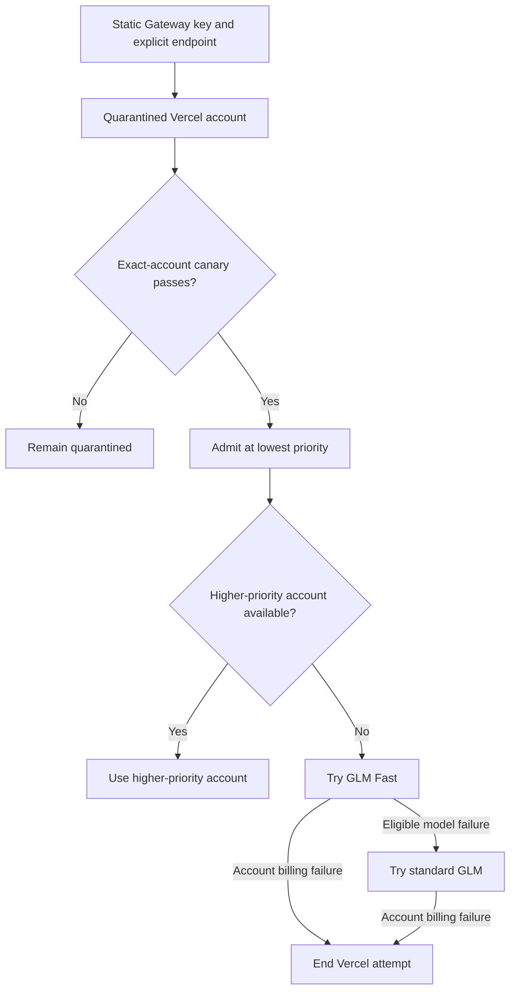

# Direct Vercel Gateway Key Lane - Plan

## Goal Capsule

- **Objective:** Claude Code can use the user's Vercel AI Gateway capacity as a safe last-resort fallback after higher-priority accounts are exhausted.
- **Means:** Harden the generic API-key-compatible lane, then configure one lowest-priority Vercel account that tries GLM Fast before standard GLM.
- **Product authority:** The user is the operator and decides the Vercel API-key budget and whether the account remains enabled.
- **Open blockers:** None for planning. A Gateway API key and its Vercel-side budget are deployment prerequisites.

---

## Product Contract

### Summary

A hardened generic API-key lane will admit one Vercel AI Gateway account as the final catch-all for every Claude Code model family.
The account enters normal fallback routing only after a forced, fail-closed canary validates Claude Code behavior against non-Anthropic GLM traffic.

### Problem Frame

The user's Vercel team currently provides valuable GLM capacity through fx, including substantial locally observed zero-cost usage, but fx is not the user's primary coding client.
Claude Code already reaches heterogeneous fallback accounts through better-ccflare, so reproducing fx authentication and session behavior would add carrying cost without improving the primary workflow.

The existing generic compatible-provider lane is close to sufficient but is not safe enough for unattended last-resort routing.
Its creation surfaces persist static credentials differently, its refresh contract conflicts with one of those row shapes, and missing or invalid endpoints can fall through to OpenAI rather than failing closed.
These defects apply to every generic compatible account, not only Vercel.

### Actors

- A1. **Operator:** Adds the Vercel account, configures its external budget, runs the admission canary, and controls whether it stays enabled.
- A2. **Claude Code client:** Sends ordinary Claude-family requests without knowing the Vercel account exists.
- A3. **better-ccflare router:** Preserves higher-priority routing, selects the Vercel account only as the last eligible fallback, and enforces canary isolation.
- A4. **Vercel AI Gateway:** Authenticates the static key, serves GLM Fast or standard GLM, and enforces the key's external budget.

### Key Decisions

- **Use a static Gateway key instead of fx feature parity.** (session-settled: user-directed — chosen over fx OAuth and native fx behavior: the user primarily uses Claude Code and uses fx only to reach the Vercel compute.) Governs R1, R2, R12.
- **Harden the generic lane instead of adding a named Vercel provider.** (session-settled: user-approved — chosen over configuration-only and a thin Vercel provider: reusable safety fixes are needed, while provider-specific scope is not yet justified.) Governs R1-R3, R13.
- **Make Vercel the all-family, lowest-priority catch-all.** (session-settled: user-directed — chosen over tier-specific or route-profile-only use: the account should behave like mac-studio or Grok after all preferred capacity is exhausted.) Governs R4-R6.
- **Try GLM Fast before standard GLM.** (session-settled: user-approved — chosen over Fast-only or standard-first routing: prefer accelerated compute while retaining a same-account fallback.) Governs R7, R8.
- **Allow paid fallback within the Vercel key budget.** (session-settled: user-approved — chosen over free-only pause or abandoning the key path: zero-cost entitlement portability is beneficial but not required.) Governs R10-R12.
- **Require an exact-account admission canary.** (session-settled: user-approved — chosen over immediate normal-pool admission: validation must not escape to another account or provider.) Governs R9-R11.

### Requirements

**Generic static-key safety**

- R1. Every supported creation surface must produce equivalent non-expiring static-key behavior for a generic API-key-compatible account.
- R2. A generic API-key-compatible account must authenticate from its canonical static API key without requiring OAuth-shaped refresh credentials or synthetic expiry.
- R3. A missing, malformed, or invalid custom endpoint must make the account unavailable and must never redirect the request to a default upstream.

**Catch-all account contract**

- R4. The Vercel account must be eligible for every Claude Code logical model family.
- R5. The Vercel account must have lower routing precedence than every preferred cloud or local account intended to serve the same request.
- R6. Ordinary traffic must reach the Vercel account only after no higher-priority eligible account can serve it.
- R7. Every eligible logical family must resolve first to `zai/glm-5.2-fast` and then to `zai/glm-5.2` within the same Vercel account.
- R8. A model-scoped Fast failure may advance to standard GLM, while an account-wide billing failure must end that account attempt without trying another physical model.

**Admission canary**

- R9. Before normal fallback admission, the operator must force-route a canary to the exact Vercel account and the selected account must not escape to another account on failure.
- R10. The canary must demonstrate a complete streamed Claude Code turn, including xhigh reasoning intent, function-tool round trip, terminal usage, and normal stream termination.
- R11. The canary must demonstrate the Fast-primary and standard-fallback order using non-Anthropic routes or deterministic fixtures without sending scripted traffic to an Anthropic-backed account.

**Economic boundary and ongoing behavior**

- R12. The operator must configure a Vercel-side API-key budget before the account may enter normal fallback routing.
- R13. A canary remains economically successful whether Vercel bills it at zero or debits the configured balance, provided the charge stays within the external key budget.
- R14. A Vercel 402 billing response must remove the account from the current request and allow the existing outer routing behavior to continue; when no account remains, the request must end with the existing stable route-unavailable response.
- R15. Internally estimated cost for an unknown Gateway model must not be presented as authoritative Vercel billing truth.

**Compatibility**

- R16. Hardening must preserve valid existing generic compatible endpoints, bearer-auth replacement, request conversion, tool conversion, response conversion, and SSE behavior.
- R17. Existing generic compatible accounts must retain their configured routing precedence and model mappings unless their stored endpoint or credential state violates R1-R3.

### Key Flows

- F1. **Account setup and quarantine**
  - **Trigger:** A1 adds the Vercel Gateway account.
  - **Actors:** A1, A3, A4.
  - **Steps:** The operator supplies a static key, explicit endpoint, lowest fallback priority, all-family model order, and external key budget; the account remains outside normal routing.
  - **Outcome:** The account is ready for an exact-account canary but cannot receive ordinary fallback traffic.
  - **Covers:** R1-R7, R12.

- F2. **Admission canary**
  - **Trigger:** A1 explicitly starts validation for the quarantined account.
  - **Actors:** A1, A2, A3, A4.
  - **Steps:** A3 pins the request to the Vercel account; the turn exercises streaming, reasoning intent, and a function tool; Fast and standard behavior are validated without alternate-account escape.
  - **Outcome:** The account is admitted only when routing and fidelity conditions pass; zero-cost billing is recorded as evidence but is not a gate.
  - **Covers:** R9-R13.

- F3. **Last-resort fallback**
  - **Trigger:** A2 sends a request that no higher-priority eligible account can serve.
  - **Actors:** A2, A3, A4.
  - **Steps:** A3 selects the Vercel account, tries Fast, and uses standard GLM only for an eligible model-scoped fallback.
  - **Outcome:** The request completes through Vercel or continues through existing failure handling without changing preferred-account behavior.
  - **Covers:** R4-R8, R16, R17.

- F4. **Budget exhaustion**
  - **Trigger:** A4 returns an account-wide billing failure.
  - **Actors:** A2, A3, A4.
  - **Steps:** A3 ends the Vercel account attempt and applies existing outer failover behavior.
  - **Outcome:** Another eligible account serves the request, or the client receives the existing terminal route-unavailable response.
  - **Covers:** R8, R14.

### Admission Flow

The diagram illustrates R5-R14; the requirements remain authoritative.

### Acceptance Examples

- AE1. **Covers R1, R2, R16.** Given equivalent valid generic account input through CLI and dashboard/API, when each account sends a request, then both use the same canonical static-key semantics and bearer-auth behavior.
- AE2. **Covers R3, R9.** Given a forced Vercel canary with a missing or malformed endpoint, when routing begins, then the request fails closed on that account and does not reach OpenAI or another account.
- AE3. **Covers R9, R10.** Given a valid forced Vercel canary, when Claude Code requests xhigh reasoning and invokes a function tool over a stream, then the client receives the tool round trip, terminal usage, and normal message termination from that exact account.
- AE4. **Covers R7, R8, R11.** Given Fast returns an eligible model-scoped failure, when the account attempts its configured fallback, then standard GLM is tried before the Vercel account is abandoned.
- AE5. **Covers R8, R14.** Given Vercel returns an account-wide 402, when the account attempt is classified, then standard GLM is not tried and the outer router proceeds to the next eligible account or terminal route-unavailable behavior.
- AE6. **Covers R12, R13.** Given the external key budget is configured and the canary is billed, when fidelity and routing checks pass, then the account may still be admitted as a paid last-resort fallback.
- AE7. **Covers R4-R6.** Given at least one higher-priority eligible account can serve a request, when normal routing runs, then the Vercel catch-all is not selected for any Claude family.
- AE8. **Covers R15.** Given a Vercel model lacks authoritative internal price data, when better-ccflare displays or records its estimate, then the value is distinguishable from confirmed upstream billing.

### Success Criteria

- All generic account creation surfaces yield the same static-key lifetime and refresh behavior.
- Invalid endpoint state cannot send a request to an unintended default upstream.
- The forced canary completes the required streamed reasoning and tool behavior without alternate-account escape.
- The admitted account is reachable for all Claude families only after preferred capacity is unavailable.
- Fast is attempted before standard GLM for eligible model-scoped failures.
- Charged traffic remains bounded by the operator-configured Vercel API-key budget, and 402 uses existing account-wide failover behavior.

### Scope Boundaries

- No fx OAuth import, fx refresh/session reuse, local fx broker, team-header emulation, or native fx transport.
- No named `vercel-ai-gateway` provider or provider-specific setup surface.
- No Vercel Gateway receipt ingestion, account-wide spend report, dollar-accurate internal budget enforcement, or automatic free-entitlement detection.
- No native Messages/Responses fan-out or full protocol-parity campaign beyond the Claude Code behaviors required by R10 and R11.
- No changes to the priority or routing policy of existing preferred accounts.
- No scripted canary traffic may reach an Anthropic-backed account.

### Dependencies / Assumptions

- The operator can obtain a static AI Gateway API key for the same Vercel team used by fx.
- The operator can configure a Vercel-side budget for that key before admission.
- Vercel continues to expose `zai/glm-5.2-fast` and `zai/glm-5.2` through its compatible API surface.
- Zero-cost entitlement portability from fx OAuth to the static key is unknown and does not block the feature.
- The existing generic converter remains the product authority for the supported Claude Code behavior in this slice.

### Outstanding Questions

**Resolve Before Planning**

- None.

**Deferred to Planning**

- Choose the exact numeric priority below the current preferred account set.
- Choose the shared implementation boundary that makes CLI and dashboard/API credential persistence obey R1 and R2.
- Choose the deterministic fixture and live non-Anthropic canary split needed to prove R10 and R11.
- Choose how estimated cost is labeled so R15 is true without introducing Gateway receipt scope.

### Sources / Research

- `apps/cli/src/main.ts` — generic account mode and interactive compatible-provider setup.
- `packages/cli-commands/src/commands/account.ts` — static-key creation, priority, endpoint, and family model mappings.
- `packages/http-api/src/handlers/accounts.ts` — dashboard/API account creation behavior.
- `packages/providers/src/providers/openai/provider.ts` — generic endpoint, bearer auth, response conversion, usage, pricing, and refresh behavior.
- `packages/openai-formats/src/converters.ts` — reasoning, tool, model, and response translation.
- `packages/openai-formats/src/stream.ts` — streamed tool-call and terminal-event behavior.
- `packages/proxy/src/handlers/account-selector.ts` — exact-account fail-closed routing.
- `packages/proxy/src/handlers/proxy-operations.ts` — generic 402 scope and outer failover.
- `docs/ideation/2026-08-20-vercel-ai-gateway-integration-ideation.html` — upstream ideation and external Vercel/fx evidence.
