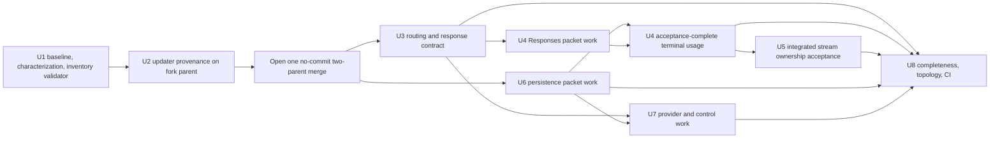
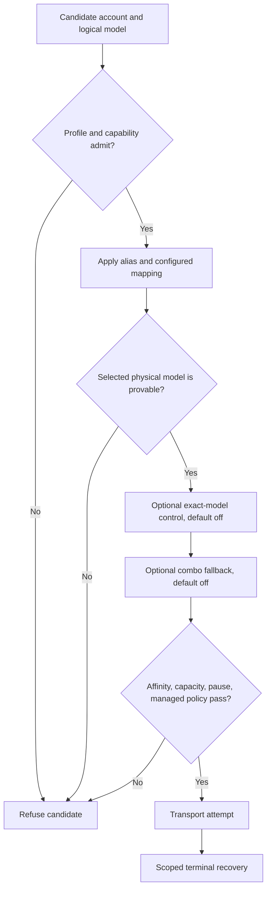
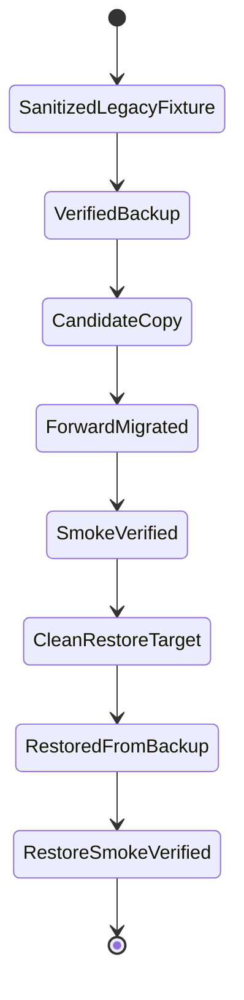

# Upstream v3.5.67 Product-Fork Synchronization - Plan

## Goal Capsule

- **Objective:** Synchronize tombii/better-ccflare v3.5.67 into the StartupBros product fork without losing fork-only routing, recovery, provider, usage, persistence, observability, or deployment behavior.
- **Means:** Characterize protected contracts first, harden fork-aware update provenance, then complete one topology-preserving merge of exact upstream commit `ebc904903dc828338cd2d5da707b0d3dd2d0922f` using a per-conflict semantic ledger and an all-upstream-commit completeness audit.
- **Authority:** Product Requirements govern behavior; Key Technical Decisions govern integration mechanics. The current post-PR #261 baseline is planning evidence, but execution starts by refreshing it against `origin/main`.
- **Execution profile:** Eight units. U1 and U2 create fork-parent safeguards. U3-U7 are semantic work packets inside one unresolved integration merge, not separate merge-resolution commits. U8 finalizes topology, provenance, documentation, review, and CI evidence.
- **Stop conditions:** Stop before source changes if issue staleness reveals that main already supersedes or invalidates issue #260; if target tag provenance does not peel to the pinned SHA; if PostgreSQL rehearsal cannot use a disposable loopback database whose name contains `test`; if a resolution would weaken a protected contract without explicit operator approval; or if verification would require scripted Anthropic-backed traffic.
- **Tail ownership:** The implementer owns the merge-ready candidate and evidence. The operator separately owns merging, canonical-main deployment rehearsal, production database handling, systemd restart, and live health verification.
- **Open blockers:** None for implementation planning. Production deployment remains deliberately unauthorized.

---

## Product Contract

### Summary

The StartupBros repository remains an intentional product fork, not a mutable mirror of tombii releases. It will ingest the complete pinned v3.5.67 source history while keeping the fork’s stricter routing, response-lifecycle, persistence, provider, and deployment contracts.

The normal dashboard, npm, binary, and Docker update recommendations are unsafe for managed-source fork installations because they point at mutable tombii artifacts. This synchronization therefore includes explicit installation provenance and fail-closed update guidance rather than treating a package update as source synchronization.

### Problem Frame

The fork and upstream share merge base `0ad2f93d9e0c75e7b575006d12433d33a358df50` (v3.5.55), but both sides changed the same high-coupling runtime paths. At the refreshed execution baseline, fork parent `8c60a1663a5b973b30d22828cb5205777ab2365a` includes PR #261 and the U1/U2 safeguards, the upstream target is `ebc904903dc828338cd2d5da707b0d3dd2d0922f`, the graph contains 801 fork-only and 120 upstream-only commits with zero patch-equivalent commits, and the regenerated trial merge reports 62 content conflicts, two add/add conflicts, one modify/delete conflict, and 42 clean two-sided shared paths. These figures are machine-validated execution evidence and must be regenerated if either parent changes.

A package-only update would discard reviewed fork behavior. A wholesale “ours” or “theirs” conflict policy would also be unsafe because explicit conflicts and clean shared hunks cross routing precedence, terminal response recovery, stream ownership, Codex Responses translation, dual-dialect migrations, canonical usage windows, and operator controls.

### Actors

- A1. **Fork implementer:** Refreshes the graph, writes characterization tests, resolves the integration, and records evidence.
- A2. **Operator/reviewer:** Confirms issue staleness, adjudicates any protected-contract conflict that cannot be composed, and authorizes later production effects.
- A3. **Claude Code client:** Depends on stable routing, response bytes, tool behavior, terminal usage, and cancellation semantics.
- A4. **Provider account:** Supplies model capability, usage, errors, and streams through Anthropic-native or compatible protocols.
- A5. **Persistence layer:** Preserves equivalent SQLite and PostgreSQL schemas, migrations, repositories, retention, and canonical usage-window behavior.
- A6. **Managed-source deployment:** Builds only from canonical main, identifies artifacts by Git SHA, and must not self-update from tombii’s mutable distribution channels.

### Key Decisions

- **Keep and minimize the product fork.** (session-settled: user-directed — chosen over retiring the fork or treating it as a mirror: the audit found material fork-only routing, recovery, usage, provider, and deployment value.) Governs R1-R14.
- **Synchronize the full pinned v3.5.67 source with preserved topology.** (session-settled: user-approved — chosen over package update, selective version bumps, rebase, squash, or tree replacement: the user approved a proper source merge after the audit.) Governs R1-R3, R18.
- **Protect the merged issue #251 response-provenance fix as the fork parent.** (session-settled: user-approved — chosen over merging from the pre-fix baseline: PR #261 is a prerequisite because it establishes final-attempt model provenance before stream teeing.) Governs R5.
- **Harden updater provenance in this synchronization.** (session-settled: user-approved — chosen over leaving the existing npm/tombii fallback in place: a managed-source fork must not recommend replacing itself with unreviewed upstream artifacts.) Governs R13.
- **Take the work through a CI-green, merge-ready candidate and hermetic provenance rehearsal only.** (session-settled: user-approved — chosen over stopping at source resolution or performing production deployment: the user approved fixture-only rehearsal while reserving the post-merge source gate and all live effects for separate authorization.) Governs R15-R17.

### Requirements

**Source and auditability**

- R1. The integration must merge exact peeled upstream commit `ebc904903dc828338cd2d5da707b0d3dd2d0922f` into the refreshed fork parent as a real two-parent merge commit.
- R2. Every textual conflict, rerere application, and clean two-sided shared path must have a machine-readable inventory entry and a linked human ledger disposition recording upstream intent, protected fork behavior, selected resolution, focused evidence, acceptance-complete evidence, and reviewer disposition.
- R3. Every upstream-only commit in the refreshed `merge-base..target` range must be classified as retained, semantically remapped, intentionally rejected with rationale, or already superseded by refreshed-main evidence; a validator must reject missing, duplicate, or unrecognized commit/path/conflict dispositions so no upstream behavior disappears silently.

**Routing and response behavior**

- R4. Routing must preserve this fail-closed precedence: route-profile and capability admission; logical alias and configured mapping; selected physical-model proof; default-off exact-model control; combo fallback; affinity, capacity, pause, and managed-policy fences; then scoped terminal recovery.
- R5. For the PR #261 OpenRouter case, `attemptedModel` must remain final-transport-attempt provenance and the order must remain terminal recovery, guarded model normalization, then `teeStream`, so collector and client receive identical normalized bytes.
- R6. Upstream exact-model, combo, strict-drain, and routing-observation controls must remain default-off where omitted and may not bypass an earlier fork fence; the internal-probe exception must remain authenticated and narrowly scoped.
- R7. Native OpenAI Responses support must compose custom tools, `additional_tools`, stream and non-stream output, model/account mapping, malformed catalog handling, the fork’s input-item taxonomy, privacy-safe session identity, and exactly-once terminal usage.
- R8. Stream cleanup must release reader locks, dispose unread retry clones without affecting the selected live response, abort only the transport registered to that response, prevent collector callbacks from cancelling or stalling client delivery, preserve one-shot semantic client cancellation, and settle terminal state exactly once.

**Persistence and providers**

- R9. Every adopted SQLite table, column, index, ALTER, backfill, or runtime query must have equivalent PostgreSQL new-install, upgrade, index, backfill, repository, and retention behavior.
- R10. Provider observations remain normalized to 0–100 usage. Inactive windows remain historical but cannot bind routing, trigger alerts, open or close a live value window, or affect value calculations.
- R11. The two xAI add/add paths must use the fork implementation as their behavioral base while importing narrowly verified upstream fixes. The upstream `muse-spark` → `meta` provider-identifier migration must preserve compatible existing accounts through idempotent SQLite and PostgreSQL backfill/rename and repository/API compatibility; compatible accounts must remain fail-closed and may never default to `https://api.openai.com` when endpoint state is missing or invalid.
- R12. Every adopted persisted control must be traced through configuration/types, database, HTTP/API, CLI, and dashboard serialization; omitted values retain their current disabled behavior.

**Operator and release safety**

- R13. Update guidance must come from one server-authoritative, provenance-first status contract. Trusted artifact provenance includes installation mode (`managed-source`, `package`, `binary`, `docker`, or `unknown`), producer/distribution identity, permitted update channel, source SHA/ref origin, and explicit precedence/conflict rules. `managed-source`, `unknown`, invalid/conflicting metadata, and any artifact without mode plus truthful source SHA must not perform a remote update lookup or emit a mutable update command.
- R14. A complete source merge must retain truthful v3.5.67 lineage in matching root and CLI manifests while identifying the fork artifact by build/runtime Git SHA and validated artifact provenance; it must not create a tag or perform an independent version bump.
- R15. A fresh candidate worktree must run `bun run build:cli` before Bun tests, run every affected test file in an isolated Bun process, sweep shared call sites with `grep -a`, and pass lint, typecheck, and format with no unintended diff.
- R16. No scripted request may reach an Anthropic-backed account. Provider and protocol evidence must use deterministic fixtures, mocks, sanitized databases, or an explicitly force-routed non-Anthropic account if a later authorized canary requires live traffic.
- R17. Issue #260 does not authorize full deployment, systemd mutation/restart, production database backup/restore, or live production health requests.
- R18. The candidate must exclude the four prohibited inline-worker files, `apps/cli/README.md`, and unrelated pre-existing work from all reads, searches, edits, staging, and commits.
- R19. If the refreshed merge touches Qwen provider or streaming-transform sources, implementation must compare against a local QwenLM/qwen-code checkout and record its path and revision; otherwise Qwen remains out of scope.

### Key Flows

- F1. **Refresh and authorize the baseline**
  - **Trigger:** A1 starts execution from issue #260.
  - **Steps:** Fetch the current refs, run the issue-staleness log, confirm with A2 that the issue still applies if newer relevant work exists, verify PR #261 containment and target tag provenance, and regenerate graph/conflict/clean-shared-path inventories.
  - **Outcome:** A refreshed fork parent and immutable upstream parent are recorded before source changes.
  - **Covers:** R1-R3, R18.

- F2. **Characterize, merge, and resolve**
  - **Trigger:** F1 passes.
  - **Steps:** Bootstrap generated modules, commit protected-contract/upstream-regression tests and updater hardening on the fork parent, open one no-commit/no-fast-forward merge, then resolve U3-U7 by semantic cluster while maintaining the ledger.
  - **Outcome:** One reviewable two-parent integration candidate retains the complete accepted behavior of both parents.
  - **Covers:** R1-R16, R18, R19.

- F3. **Route and deliver a request**
  - **Trigger:** A3 sends a request.
  - **Steps:** Routing applies R4 in order; the selected provider executes; scoped terminal recovery and PR #261 normalization run before the stream is teed; usage and terminal state settle once.
  - **Outcome:** The client and collector observe the same correct response without bypassing account/model fences or leaking stream resources.
  - **Covers:** R4-R8, R11, R12, R16.

- F4. **Rehearse migration and rollback**
  - **Trigger:** Persistence resolutions are complete.
  - **Steps:** Apply the shared guard before every connection or mutation; create sanitized fork-shaped SQLite and disposable loopback/test-named PostgreSQL sources plus separate per-run candidates and rollback targets; checksum backups; migrate candidates twice; validate the adopted-object manifest and repository reads; restore into clean targets; and compare immutable-source, candidate, and restored fingerprints.
  - **Outcome:** Live two-dialect forward compatibility and restore-based rollback are proven with target identities and checksums, without production data or invented reverse migrations.
  - **Covers:** R9, R10, R15, R17.

- F5. **Present update guidance**
  - **Trigger:** The dashboard asks for version/update information.
  - **Steps:** The backend validates trusted installation provenance; external distribution modes may use their own compatible release source; managed-source shows current fork SHA and controlled deployment guidance; unknown stays informational.
  - **Outcome:** A fork operator cannot accidentally replace managed source with mutable tombii artifacts.
  - **Covers:** R13, R14.

- F6. **Declare merge readiness**
  - **Trigger:** All semantic units are resolved.
  - **Steps:** Audit all upstream commits and merge-tree deltas, verify topology/version/provenance, run isolated tests and repository gates, obtain focused review, and wait for green CI.
  - **Outcome:** The candidate is merge-ready; production effects remain blocked pending separate authorization.
  - **Covers:** R1-R3, R14-R18.

### Acceptance Examples

- AE1. **Covers R1-R3.** Given a refreshed fork parent and the pinned target, when the integration commit and inventory are validated, then the commit has exactly those two parents and every refreshed upstream-only commit, explicit conflict, recorded rerere application, and clean two-sided shared path has exactly one recognized disposition linked to review evidence.
- AE2. **Covers R4, R6.** Given a route profile rejects an account or an account is paused/capacity-blocked, when exact-model or combo controls are enabled, then those later controls cannot make the account eligible.
- AE3. **Covers R5.** Given an OpenRouter Anthropic SSE `message_start.model` is literal `unknown` and the final attempted transport model is valid, when recovery and response handling complete, then collector and client receive identical bytes containing the bounded replacement; malformed or out-of-scope streams pass through.
- AE4. **Covers R7.** Given a native Responses request containing recognized and unknown input items plus custom and additional tools, when streaming and non-streaming paths execute, then known items map losslessly, unknown items warn and drop, tools survive, and terminal usage records once.
- AE5. **Covers R8.** Given a timeout, client cancellation, read error, or unread retry clone, when cleanup executes, then semantic cancellation runs once, collector callbacks cannot cancel or stall the single client stream, the registered transport alone is settled, reader locks are released, and the separate live response remains usable.
- AE6. **Covers R9.** Given equivalent legacy SQLite and PostgreSQL fixtures, when migrations run twice, then both dialects reach equivalent tables, columns, indexes, backfills, and repository results without duplicate effects.
- AE7. **Covers R9, R17.** Given sanitized backups, when a candidate migration succeeds and the backup is restored to a clean target, then pre-migration smoke reads work again without touching a production database.
- AE8. **Covers R10.** Given an inactive account-wide weekly window and an active model-scoped window, when routing and the value ledger evaluate state, then only the active window can bind or close the live period while both remain queryable as history.
- AE9. **Covers R11.** Given a compatible account with blank, malformed, or absent endpoint data, when URL resolution runs, then the account becomes unavailable and no branch resolves to the OpenAI default host.
- AE10. **Covers R12.** Given upstream controls are absent from persisted configuration, when config, repository, API, CLI, and dashboard state round-trip, then exact-model, combo, and observation behavior remains disabled.
- AE11. **Covers R13.** Given `managed-source`, `unknown`, failed provenance resolution, a mode/producer/channel conflict, or an artifact without source SHA, when update status is requested, then no registry/release/image lookup occurs and the UI shows fork-safe informational guidance. Only a validated producer/mode/channel/SHA combination may query and show its compatible distribution channel.
- AE12. **Covers R14.** Given the complete integration contains the v3.5.67 target, when manifests and health provenance are inspected, then root/CLI versions agree on plain `3.5.67` and runtime SHA identifies the fork build without claiming byte identity with upstream.
- AE13. **Covers R15, R18.** Given a fresh worktree, when verification runs, then bootstrap precedes tests, affected files run separately, required final gates pass, and no prohibited/generated/unrelated file enters the diff.
- AE14. **Covers R16.** Given provider protocol tests, when the suite runs, then every external call is mocked or force-routed to a non-Anthropic account; no scripted request can select `claude` or any other Anthropic-backed account.

### Success Criteria

- The candidate contains a two-parent merge of exact upstream v3.5.67 source and refreshed fork main.
- The machine-readable inventory and validator account exactly once for every conflict, recorded rerere result, clean two-sided shared path, and refreshed upstream-only commit; the human ledger links each item to semantic review evidence.
- Protected routing, response provenance, stream ownership, usage-window, endpoint, and deployment contracts pass focused regressions.
- SQLite and PostgreSQL parity includes live catalog constraints/indexes, backfills, runtime repository behavior, idempotence, guarded target identities, backup checksums, immutable-source proof, and restored fingerprint equivalence.
- Managed-source and every unproven provenance state make zero remote release lookups and cannot emit mutable upstream update instructions; proven external artifacts use only their validated producer/channel.
- Every affected test file passes in isolation; lint, typecheck, and format pass; required CI is green.
- Actual production deployment has not occurred.

### Scope Boundaries

- No moving upstream target beyond `ebc904903dc828338cd2d5da707b0d3dd2d0922f`; refreshed main changes only the fork parent and resolution inventory.
- No retirement of the StartupBros fork and no conversion to an automatically tracking mirror.
- No package-only, binary-only, Docker-only, rebase, squash, tree-replacement, or selective-release-cherry-pick substitute for the source merge.
- No independent version bump, prerelease suffix, or new Git tag.
- No scripted Anthropic-backed canary or diagnostic request.
- No changes to `apps/cli/README.md` or any prohibited inline-worker file.
- No unrelated cleanup or absorption of `docs/plans/2026-08-21-1945-arch-raw-first-usage-tracking-plan.md` or `scripts/weekly-api-value.py` from the original shared checkout.
- No production deploy, service restart, production database operation, or live production health check.

### Deferred to Follow-Up Work

- Production deployment and guarded live verification after this candidate merges and the operator grants separate authorization.
- Any new upstream release after v3.5.67.
- Qwen changes unless R19’s refreshed-path trigger fires.

### Dependencies / Assumptions

- PR #261 is merged as `f65e5768f842853e60fc1f411eedf5281b0bc52b`; execution verifies its final paths and behavior rather than trusting this planning snapshot.
- The existing PostgreSQL CI pattern supplies PostgreSQL 16 at `better_ccflare_test`; local rehearsal must use an equivalent loopback/test-named disposable database and sanitized data.
- `CONCEPTS.md` remains authoritative for canonical usage-window vocabulary and active/inactive semantics.
- The v3.5.67 annotated tag continues to peel to the pinned target SHA.
- If refreshed main changes any assumption, U1 records the delta before resolution begins.

### Outstanding Questions

**Resolve Before Implementation**

- None. U1’s repository-mandated staleness confirmation is an execution gate, not an unresolved product choice.

**Deferred to Implementation**

- Record the exact refreshed graph counts, conflict classes, and complete set of clean two-sided paths.
- Confirm which upstream controls require new SQLite/PostgreSQL schema after semantic reconciliation rather than assuming every target migration applies unchanged.
- If Qwen paths enter the refreshed diff, record the local qwen-code checkout path and revision before accepting those hunks.

### Sources / Research

- GitHub issue #260 and the completed v3.5.67 fork audit in this planning session.
- `AGENTS.md` — source-sync, testing, migration, worktree, and deployment constraints.
- `UPSTREAM.md` — product-fork posture and currently stale cherry-pick-only wording.
- `CONCEPTS.md` — canonical usage windows and active/inactive behavior.
- `packages/proxy/src/response-handler.ts` and `packages/proxy/src/__tests__/response-handler-worker-protocol.test.ts` — merged PR #261 containment contract.
- `packages/proxy/src/handlers/account-selector.ts`, `packages/proxy/src/handlers/proxy-operations.ts`, `packages/proxy/src/model-route-profiles.ts`, and `packages/proxy/src/stream-tee.ts` — routing and response lifecycle.
- `packages/openai-responses-adapter/src/` and `packages/providers/src/providers/codex/` — Responses/Codex vertical slice.
- `packages/providers/src/utils/stream-drain.ts` — owned transport cleanup.
- `packages/database/src/migrations.ts`, `packages/database/src/migrations-pg.ts`, and their tests — dual-dialect schema and safe live-PG patterns.
- `packages/http-api/src/services/usage-window-ledger.ts` and repository tests — active-window ledger behavior.
- `packages/core/src/build-provenance.ts`, `packages/http-api/src/handlers/version.ts`, `packages/proxy/src/proxy.ts`, and `packages/dashboard-web/src/components/navigation.tsx` — installation/update provenance.
- `scripts/deploy-ccflare.sh`, `scripts/deploy-ccflare-lib.sh`, and `scripts/__tests__/deploy-ccflare.test.ts` — canonical-main and runtime-SHA deployment gates.
- `docs/solutions/workflow-issues/typecheck-does-not-cover-test-call-sites.md` — isolated test and binary-safe caller-sweep requirements.

---

## Planning Contract

### Key Technical Decisions

- KTD1. **Rebaseline before branching or resolving.** Fetch current refs, run the issue-staleness command from issue creation date `2026-08-24`, verify PR #261 containment, peel the remote v3.5.67 tag, and recompute merge base, left/right and `--cherry-pick` counts, package versions, conflicts, add/add and modify/delete classes, and all clean two-sided paths. If new main work affects scope, stop for the required operator confirmation before code changes. Governs R1-R3, R18.
- KTD2. **Put safeguards on the fork parent before opening the merge.** Add characterization/upstream-regression tests, a machine-readable inventory plus human-ledger skeleton, its validator, and the self-contained updater provenance hardening as reviewable commits before one `git merge --no-ff --no-commit ebc9049…`. Derive commit and conflict sets from Git; define clean shared coverage as every non-conflicting path changed on both sides of the merge base; capture rerere applications separately. The validator rejects missing, duplicate, or unknown rows before resolution can complete. Governs R2, R3, R5, R13, R15.
- KTD3. **Resolve by semantic cluster, never file order.** U3-U7 are work packets inside the same unresolved merge; each updates its ledger rows and runs focused tests before the integration commit is finalized. Rerere is a textual accelerator only, and every auto-resolution receives `git diff --cc` review. Governs R2-R12.
- KTD4. **Hold the routing precedence in R4 as an executable contract.** Bring upstream `force_account_model`, combo, strict-drain, and routing-observation behavior in default-off and prove exact-model refusal before fallback. A forced model or combo cannot override profile, capability, mapping, affinity, capacity, pause, managed-policy, or degraded-replay fences. Governs R4, R6.
- KTD5. **Treat `attemptedModel` as transport provenance.** Resolve `response-handler.ts` and `proxy-operations.ts` together; preserve the PR #261 scope and terminal recovery → guarded normalization → tee order, with byte equality between collector and client. Governs R5.
- KTD6. **Integrate Codex/Responses end to end.** Resolve adapter translators, Codex provider, catalog, proxy operations, and usage collector as one vertical slice; retain the fork’s recognized input taxonomy and warn/drop behavior while adopting upstream native Responses, tools, catalog, and terminal fixes. Governs R7.
- KTD7. **Separate the four stream ownership contracts.** `teeStream` exposes one client-readable stream and collector observation callbacks, not two independently cancellable branches. Adopt upstream cleanup only where client cancellation propagates once through the semantic stream, collector callbacks cannot cancel or stall client delivery, unread retry-response clones are disposed without affecting the live response, and the WeakMap aborts only the transport registered to the selected response. Governs R8.
- KTD8. **Prove two-dialect migration and restore from executable manifests, not source-text parity.** Maintain an adopted-object manifest covering live SQLite and PostgreSQL types, defaults, nullability, constraints, indexes/predicates, backfill outcomes, repository behavior, retention, and idempotence after clean install and legacy upgrade. A mandatory guarded rehearsal harness applies one loopback/test-name/source-isolation policy to every source, candidate, generated child, and rollback target before any connection or mutation; it records immutable-source, backup checksum, schema/data fingerprint, forward-smoke, and restore-equivalence evidence. The PostgreSQL migration suite must use `DATABASE_URL`, integration suites use `BETTER_CCFLARE_TEST_POSTGRES_URL`, and a must-run signal makes a skipped live block fail. Never claim a reverse migration. Governs R9, R10, R17.
- KTD9. **Make artifact provenance explicit, conflict-detecting, and lookup-first.** Use one allowlisted distribution identity key, `CCFLARE_DISTRIBUTION`, from which shared provenance derives mode, producer, and permitted channel, together with source SHA/ref origin. Release builders embed their identity; the managed-source systemd pin supplies `startupbros-managed-source`; build/runtime identities may agree or be singly present through their allowed producer path, but any incompatible pair resolves to `unknown`. One server-authoritative update-status service resolves provenance before any network call, suppresses remote lookup for managed-source/unknown, caches external results by validated producer and channel, and feeds both compatibility routes and the dashboard. The current Dockerfile remains a tombii-produced upstream artifact unless a separate fork-controlled image builder proves its own producer/channel/SHA; `docker` alone is never trust. Governs R13, R14.
- KTD10. **Accept v3.5.67 manifests only as target lineage.** Resolve root and CLI manifests together to the target’s plain `3.5.67` as part of the complete merge, subject to the refreshed contained-tag check. Do not make a standalone bump, suffix, or tag; source SHA and validated distribution provenance distinguish the fork artifact. Governs R14.
- KTD11. **Use a mechanically checked bidirectional completeness audit.** Generate the inventory from both parents and the captured rerere record; validate exact-one dispositions and links to the human ledger; map every refreshed upstream-only commit to behavior/tests; compare the final tree and combined diff to both parents; retain or remap every target-only regression; and explain every fork-retained difference. Distinguish `focused-packet-pass` from `acceptance-complete` so dependency-gated units such as U4 cannot close on pre-persistence evidence. Conflict count or Markdown row count alone is not completeness evidence. Governs R2, R3.
- KTD12. **Separate pre-merge provenance rehearsal from the post-merge source gate.** Before merge, hermetic checkout/pin/runtime fixtures must prove provenance propagation without service, systemd, database, network-release, or health-endpoint effects. After merge, the operator may separately authorize `deploy-ccflare.sh --check`, which proves only canonical-main, clean-tree, and version/source eligibility—not built or runtime provenance. Full deployment, systemd mutation, production DB handling, restart, and live identity verification require a further authorization and a deferred-deployment handoff. Governs R17.

### High-Level Technical Design

These sketches communicate integration boundaries; Product Requirements remain authoritative and implementation may refine internal names.

#### Merge lifecycle and unit dependencies



Packet-level editing and focused tests may overlap while the merge is open, but acceptance status follows the arrows. The ledger records `focused-packet-pass` separately from `acceptance-complete`.

#### Routing precedence



#### Response and stream ownership sequence

```mermaid
sequenceDiagram
  participant P as Proxy operation
  participant T as Registered response transport
  participant R as Terminal recovery stream
  participant N as PR #261 normalizer
  participant S as teeStream observer wrapper
  participant C as Collector callbacks
  participant U as Single client-readable stream
  P->>T: execute final attempted model
  T-->>R: selected response stream
  R-->>N: recovered semantic stream
  N-->>S: bounded normalized bytes
  S-->>U: enqueue client bytes
  S-->>C: observe same chunk after enqueue
  U-->>R: cancellation propagates once
  Note over P,T: unread retry response disposal is separate from live response ownership
  Note over T,S: timeout aborts only the registered transport; reader locks release in finally
```

#### Migration and restore state machine



#### Installation provenance matrix

| Validated artifact provenance | Remote lookup | Dashboard behavior |
|---|---|---|
| `managed-source` + StartupBros producer + canonical fork SHA | None | Show fork SHA and reviewed source-deploy guidance; no mutable upstream command |
| `package` + known producer/channel + source SHA | Fixed producer package registry channel only | Show package-compatible guidance from the same validated channel |
| `binary` + known producer/channel + source SHA | Fixed producer release channel only | Show binary-compatible guidance from the same validated channel |
| `docker` + tombii producer + upstream SHA | Tombii image/release channel only | Identify the current upstream artifact; never represent it as a fork image |
| future fork `docker` + StartupBros producer + fork SHA | No channel until a fork image source is explicitly configured | Fail closed rather than infer tombii `:latest` |
| missing, conflicting, invalid, or SHA-less provenance | None | Resolve to `unknown`; informational state with no executable update command |

### Assumptions

- The post-PR #261 planning graph is accurate only until U1 refreshes it.
- The current add/add paths are `packages/core/src/xai.ts` and `packages/core/src/xai.test.ts`. Provider-transition review covers both legacy `packages/providers/src/providers/muse-spark/{provider.ts,index.ts,__tests__/provider.test.ts}` and successor `packages/providers/src/providers/meta/{provider.ts,index.ts,__tests__/provider.test.ts}` paths; U1 records any inventory delta.
- Static PostgreSQL parity remains necessary but insufficient because it does not prove indexes, data backfills, runtime SQL, ordering, or restore.
- A broad local `bun test` result may be diagnostic but is not acceptance evidence because mock-module leakage is known; CI’s per-file isolation is authoritative.

### Implementation Constraints

- Never read, search, edit, stage, or commit the four prohibited inline-worker files or `apps/cli/README.md`.
- Run `bun run build:cli` once before any Bun test in a fresh worktree; stage files explicitly because the build creates ignored outputs.
- Run every affected test file in its own Bun process. After shared signature changes, use `grep -a` over explicit permitted paths because root typecheck excludes tests and some source contains NUL delimiters.
- Use only deterministic fixtures, mocks, sanitized databases, or explicitly non-Anthropic force-routing; never script traffic to an Anthropic-backed account.
- Every SQLite migration change must be ported to PostgreSQL in the same unit.
- Do not push between partial merge resolutions. Batch the complete integration candidate for CI so a shared runner is not churned by superseded commits.
- Preserve root-only README policy; this plan does not require a README change.

### Risks and Operational Notes

- **Existing ledger concurrency is adjacent, not silently expanded scope.** Current window rollover is not protected by a database-enforced single-open-row constraint. Issue #260 must not weaken current close/open behavior; if an adopted upstream persistence change requires redesigning rollover transactions or uniqueness, stop and route that product/data change to a follow-up rather than inventing it inside the merge.
- **Raw history lacks an activity discriminator.** The separate raw-first usage plan is intentionally outside issue #260. U6 must preserve live `active:false` filtering and must not broaden historical rebuild semantics; if target code requires replaying activity from rows that cannot prove it, stop and defer the schema/backfill decision.
- **Updater metadata is a trust boundary.** Environment/build fields are inputs, not proof by themselves. Only an allowlisted producer/mode/channel/SHA combination may enable network lookup, and conflicts collapse to `unknown`.
- **Live PostgreSQL tests can skip silently.** U6 adds a must-run assertion and records the live-block result; green static parsing alone is a no-go.
- **Deployment evidence has two owners.** The implementer owns hermetic provenance fixtures and merge readiness. The operator owns the separately authorized post-merge source/version gate and every production-side decision.

### Sequencing

U1 establishes the only valid baseline. U2 lands self-contained fork safety before upstream source enters the tree. U3-U7 then execute within one open no-commit merge, but packet editing does not imply acceptance independence. U3 establishes routing/response provenance. U6 may be worked in parallel, but U4 cannot become acceptance-complete until U6 terminal-usage persistence passes. U4 acceptance then precedes U5’s integrated stream-lifecycle acceptance. U7 requires both U3 routing and U6 persistence. U8 accepts only units marked `acceptance-complete` and only after every inventory/ledger row validates.

---

## Implementation Units

### U1. Refresh the baseline, characterize protected contracts, and create the resolution ledger

- **Goal:** Start from current remote main with executable fork contracts and a complete integration inventory before opening the merge.
- **Requirements:** R1-R5, R8-R12, R15, R18, R19.
- **Dependencies:** none.
- **Files:**
  - `docs/plans/2026-08-24-issue-260-v3.5.67-resolution-ledger.md` (human review artifact)
  - `docs/plans/2026-08-24-issue-260-v3.5.67-resolution-inventory.json` (machine-readable execution inventory)
  - `scripts/verify-upstream-sync-ledger.ts` and its focused test (new validator)
  - `packages/proxy/src/__tests__/response-handler-worker-protocol.test.ts`
  - `packages/proxy/src/handlers/__tests__/account-selector.test.ts`
  - `packages/providers/src/utils/__tests__/stream-drain.test.ts`
  - `packages/database/src/migrations.test.ts`
  - `packages/database/src/migrations-pg.test.ts`
  - `packages/database/src/repositories/__tests__/usage-history.repository.test.ts`
  - `packages/http-api/src/services/__tests__/usage-window-ledger.test.ts`
- **Approach:**
  1. Fetch `origin/main` and upstream tags, run `git log origin/main --since='2026-08-24' --oneline --no-merges -- <relevant permitted paths>`, and obtain the repository-required operator confirmation if relevant commits appeared after issue creation (KTD1).
  2. Verify the final PR #261 merge and tests are contained by refreshed main; verify the remote `v3.5.67^{}` object equals the pinned SHA.
  3. Recompute merge base, raw and patch-equivalent divergence, trial-merge conflict classes, target-only tests, and the complete set of non-conflicting paths changed on both sides of the merge base.
  4. Run `bun run build:cli`, then add missing characterization tests before source resolution. Do not stage generated workers.
  5. Generate the machine inventory from Git evidence; capture rerere applications to a dedicated record during the merge. Link every inventory ID to a human ledger entry with upstream intent, fork contract, resolution, focused tests, acceptance-complete tests, combined-diff review, and disposition.
  6. Add a validator that regenerates expected commit/conflict/shared-path sets and rejects missing, duplicate, unrecognized, or dangling rows/links before U1 and U8 can pass.
- **Execution note:** Write characterization assertions first and demonstrate that they pass on the refreshed fork parent before opening the merge.
- **Patterns to follow:** PR #261 worker-protocol tests; current account-selector and drain seams; canonical-window tests; prior topology-preserving sync commits documented in Git history.
- **Test scenarios:**
  - Covers AE1. A refreshed baseline record contains exact fork SHA, target SHA, peeled tag, merge base, raw/cherry counts, conflict classes, versions, and all clean two-sided paths.
  - PR #261 split-frame, literal-only rewrite, malformed/pass-through, terminal-recovery order, cancellation, and collector/client byte-equality cases pass on the fork parent.
  - Account selection proves profile, capability, mapping, affinity, capacity, paused-state, and managed-policy fences before upstream exact-model/combo controls are introduced.
  - Stream drain proves exact registered-transport abort, deadline settlement, finite drain, one-shot semantic cancellation, and selected-response isolation.
  - Inactive usage windows remain historical and cannot open/close a live ledger window.
  - The validator rejects a missing commit, conflict, shared path, rerere record, duplicate ID, unknown disposition, dangling Markdown link, or an item marked acceptance-complete without required dependency evidence.
- **Verification:** The baseline is current and reproducible, protected tests pass before merge, and the generated inventory validates exactly against refreshed Git evidence and the linked ledger.

### U2. Harden trusted installation and update provenance on the fork parent

- **Goal:** Prevent managed-source and unknown installations from recommending mutable tombii artifacts before the upstream merge can affect updater code.
- **Requirements:** R13-R15, R18.
- **Dependencies:** U1.
- **Files:**
  - `packages/core/src/build-provenance.ts`
  - `packages/core/src/version.test.ts`
  - `packages/http-api/src/handlers/version.ts`
  - `packages/http-api/src/handlers/health.ts`
  - `packages/http-api/src/router.ts`
  - `packages/proxy/src/proxy.ts`
  - `packages/proxy/src/__tests__/system-update-status.test.ts` (new special-route contract test)
  - `packages/proxy/src/__tests__/cache-flight-cohort-seal.test.ts`
  - `packages/dashboard-web/src/api.ts`
  - `packages/dashboard-web/src/components/navigation.tsx`
  - `packages/dashboard-web/src/components/navigation.test.tsx` (new)
  - `Dockerfile`
  - `apps/cli/build-multi-arch.ts`
  - `scripts/deploy-ccflare.sh`
  - `scripts/deploy-ccflare-lib.sh`
  - `scripts/__tests__/deploy-ccflare.test.ts`
- **Approach:**
  1. Add strict `CCFLARE_DISTRIBUTION` parsing and derive artifact mode, producer, permitted channel, and validity from it plus source SHA/ref; missing, invalid, incompatible, forged, or SHA-less metadata becomes `unknown` (KTD9).
  2. Define and test a producer matrix: managed-source systemd pin supplies `startupbros-managed-source`; current Docker identifies a tombii upstream artifact; compiled binary/package builders embed their exact producer identity plus source SHA; a future fork image has no trusted channel until one is explicitly configured.
  3. Replace the unconditional version check with one server-authoritative update-status service. It resolves artifact provenance first, makes no remote request for managed-source/unknown, and keys any external cache by validated producer and channel.
  4. Keep `/api/version/check` as the aggregate route under its existing HTTP-router authentication policy. Preserve `/api/system/package-manager`’s existing unauthenticated compatibility posture only for a non-secret local subset already comparable to public health/version provenance; it delegates to the same resolver and can never perform a remote lookup. Add a proxy-level contract test because this route bypasses the HTTP router.
  5. Make navigation issue one atomic update-status request. Remove concurrent package-manager/version races, default npm state, and user-agent fallback; it renders only the server result.
  6. Preserve existing health fields while exposing the validated distribution identity/mode as non-secret provenance. Prove the managed-source pin carries `CCFLARE_DISTRIBUTION` into runtime; a restored legacy pin without it resolves to `unknown`.
  7. Add hermetic producer/build/pin/runtime fixtures for managed source, current upstream Docker, package, binary, missing metadata, forged metadata, and identity conflicts; include the hand-built provenance facade call sites such as the cache-flight cohort test in isolated verification.
- **Execution note:** Add backend parser/API and UI state tests first; managed-source and unknown cases should fail against the current npm default.
- **Patterns to follow:** `readBuildProvenance()` and health runtime tests; deploy pin rendering tests; typed API state in dashboard components.
- **Test scenarios:**
  - Covers AE11. Managed-source, unknown, failed resolution, missing SHA, and producer/mode/channel conflicts cause zero package-registry, release, or image lookups and return no executable command.
  - A validated package, binary, or tombii Docker artifact queries only its fixed producer channel; cache entries cannot cross producer/channel boundaries.
  - The current Dockerfile identifies an upstream tombii artifact rather than a fork image; a hypothetical StartupBros Docker identity without configured channel fails closed.
  - Dashboard rendering comes from one atomic server result and cannot transiently display npm/upstream guidance while provenance is unresolved.
  - `/api/system/package-manager` returns the typed non-secret compatibility subset for valid, absent, and invalid provenance, preserves its decided authentication posture, and cannot trigger remote lookup.
  - Managed-source distribution identity plus fork SHA survives deploy-pin rendering and runtime health/update status; a restored pre-mode pin resolves to unknown while unrelated environment entries retain existing behavior.
  - Package/binary producer fixtures expose source SHA and mode together; a producer incapable of doing so is not treated as proven.
  - Existing health `version`, `git_sha`, `git_ref`, and `build_date` fields and hand-constructed provenance facades remain compatible or their affected tests are updated explicitly.
- **Verification:** Every producer path is explicit and observable from hermetic fixtures; unproven states make no remote lookup and fail closed; proxy, API, deploy, builder, health, and dashboard tests prove no fork-replacement recommendation.

### U3. Open the pinned merge and resolve routing, model selection, and terminal response provenance

- **Goal:** Integrate upstream routing controls without weakening fork precedence, scoped recovery, or PR #261 response identity.
- **Requirements:** R1-R6, R11, R12, R15, R16, R18.
- **Dependencies:** U1, U2.
- **Files:**
  - `packages/proxy/src/model-route-profiles.ts`
  - `packages/proxy/src/handlers/account-selector.ts`
  - `packages/proxy/src/handlers/proxy-operations.ts`
  - `packages/proxy/src/response-handler.ts`
  - `packages/proxy/src/proxy.ts`
  - `packages/proxy/src/stream-tee.ts`
  - `packages/core/src/model-mappings.ts`
  - `packages/core/src/force-account-model.ts`
  - `packages/config/src/index.ts`
  - `packages/load-balancer/src/strategies/`
  - corresponding proxy/load-balancer tests imported or retained from both parents
- **Approach:**
  1. Start one `git merge --no-ff --no-commit ebc904903dc828338cd2d5da707b0d3dd2d0922f`; record every conflict and rerere result before editing (KTD2, KTD3).
  2. Resolve selector, model mapping, route profile, load-balancer, proxy operation, and response handler as one precedence cluster (KTD4).
  3. Bring exact-model control in default-off, allow only the authenticated internal-probe exception, and refuse unsupported physical models before combo/fallback substitution.
  4. Preserve model/family/account hold scope, durations, response headers, finite recovery metadata, and degraded-replay fences.
  5. Preserve the exact PR #261 attempted-model scope and ordering (KTD5).
  6. Inspect every clean shared hunk and `git diff --cc` result, updating ledger rows before accepting the unit.
- **Execution note:** Import/retain target-only routing regression tests before accepting their implementation hunks; run each file separately while the merge remains open.
- **Test scenarios:**
  - Covers AE2. Exact-model and combo controls cannot bypass profile, capability, mapping, affinity, capacity, pause, managed-policy, or recovery fences.
  - Exact-model is disabled when omitted; an unsupported selected physical model refuses before fallback; only an authenticated internal probe receives the exemption.
  - Combo fallback preserves fork priority, managed membership, and capacity behavior.
  - Strict active-session drain ordering does not remap a healthy affinity-owned session.
  - Covers AE3. OpenRouter unknown-model normalization remains bounded, literal-only, after terminal recovery, and before teeing; client and collector bytes match.
  - Scoped terminal recovery preserves response headers, hold scope, duration, and terminal semantics on retryable and non-retryable cases.
- **Verification:** The R4 pipeline is executable in tests, PR #261 behavior is unchanged, and every touched routing/response ledger row has combined-diff approval.

### U4. Resolve the Codex catalog and OpenAI Responses vertical slice

- **Goal:** Adopt complete upstream native Responses improvements while retaining fork request taxonomy, context-capacity truth, session/privacy controls, and exactly-once accounting.
- **Requirements:** R7, R12, R15, R16, R18.
- **Dependencies:** U3 for packet work; U6 must pass before terminal-usage and overall U4 acceptance can be marked complete.
- **Files:**
  - `packages/openai-responses-adapter/src/handler.ts`
  - `packages/openai-responses-adapter/src/request-translator.ts`
  - `packages/openai-responses-adapter/src/response-translator.ts`
  - `packages/openai-responses-adapter/src/stream-translator.ts`
  - `packages/openai-responses-adapter/src/__tests__/handler.test.ts`
  - `packages/providers/src/providers/codex/provider.ts`
  - `packages/providers/src/providers/codex/provider.responses.test.ts`
  - `packages/providers/src/providers/codex/provider.fidelity.test.ts`
  - `packages/providers/src/providers/codex/provider.test.ts`
  - `packages/proxy/src/codex-model-catalog.ts`
  - `packages/proxy/src/usage-collector.ts`
  - `packages/proxy/src/handlers/proxy-operations.ts`
  - corresponding Codex catalog and usage lifecycle tests
- **Approach:**
  1. Map upstream commits `086f7dea`, `b9e3d8ed`, `78599f29`, `72d554a3`, `94e0ff40`, and `4a8f2615` to exact refreshed-range intent in the ledger.
  2. Resolve request, response, stream, provider, catalog, proxy, and collector paths together (KTD6).
  3. Keep recognized input items lossless and unknown item types warn-and-drop; retain current Codex context-window/catalog metadata and route admission.
  4. Adopt native non-stream Responses, custom tools, `additional_tools`, account/model mapping, malformed model-list handling, and upstream terminal fixes.
  5. Prove privacy-safe session identity and one terminal usage record across success, recovery, and failure.
- **Execution note:** Freeze stream and non-stream fidelity fixtures before accepting translator/provider hunks; all tests are offline.
- **Test scenarios:**
  - Covers AE4. Recognized local-shell, agent-message, reasoning, compaction, and other supported items map according to the fork taxonomy; unknown items emit a warning and are dropped.
  - Custom and additional tools survive request translation in both native stream and non-stream modes.
  - Native non-stream Responses JSON, streamed terminal events, and recovery-header filtering match their protocol contracts.
  - Malformed model-list bodies fail safely; valid account/model mapping preserves fork context-capacity metadata.
  - Success, recovery, cancellation, and error paths emit terminal usage at most once.
  - No test sends live traffic to any provider account.
- **Verification:** Adapter/provider/catalog focused tests may earn `focused-packet-pass` after U3; U4 becomes `acceptance-complete` only after U6 persistence is available and the combined collector lifecycle proves no context-capacity or accounting regression.

### U5. Compose reader-lock, retry-clone, tee, and cancellation ownership

- **Goal:** Import upstream resource cleanup without regressing fork semantic-stream cancellation or exact transport ownership.
- **Requirements:** R5, R7, R8, R15, R16, R18.
- **Dependencies:** U3, U4.
- **Files:**
  - `packages/providers/src/utils/stream-drain.ts`
  - `packages/providers/src/utils/__tests__/stream-drain.test.ts`
  - `packages/proxy/src/stream-tee.ts`
  - `packages/proxy/src/response-handler.ts`
  - `packages/proxy/src/handlers/proxy-operations.ts`
  - `packages/proxy/src/__tests__/stream-reader-lock-release-382.test.ts`
  - `packages/proxy/src/handlers/__tests__/proxy-operations-529-retry-clone-regression.test.ts`
  - `packages/proxy/src/handlers/__tests__/proxy-operations-529-retry-header-tagging.test.ts`
- **Approach:**
  1. Map the upstream stream-resource series (`2344d63d`, `920cd128`, `5485e997`, `84b22061`, `bd71fbbb`, `befee251`, `aa439ec9`, `4683a28e`) to exact ledger intent.
  2. Treat the fork drain helper and response-to-transport WeakMap as transport ownership; treat `teeStream` separately as one client stream plus collector observation callbacks (KTD7).
  3. Add reader-lock release in `finally`; dispose unread retry-response clones without touching the selected live response or transferring its owner incorrectly.
  4. Retain one-shot client cancellation propagation over the semantic recovery stream. Collector callbacks cannot independently cancel or stall client delivery, and deadline/error/cancel paths cannot double-abort or double-settle usage.
- **Execution note:** Use deterministic Web Stream fixtures; a clean hunk or benchmark is not ownership evidence.
- **Test scenarios:**
  - Covers AE5. Success, read error, deadline, explicit cancel, and terminal synthesis each release a reader lock and settle once.
  - A deadline aborts only the transport registered to the selected response, including after ownership transfer.
  - Discarding an unread 529 retry response releases its reader/resources without cancelling or detaching the selected live response.
  - Cancelling the single client-readable output invokes semantic cancellation exactly once.
  - Collector callbacks observe enqueued bytes but cannot independently cancel, backpressure, or stall the client path.
  - Retry headers remain correctly tagged after clone cleanup.
  - PR #261 byte equality still passes after stream-lifecycle composition.
- **Verification:** No leaked reader, retained unread clone, wrong-owner abort, observer-induced cancellation/stall, repeated semantic cancellation, or duplicate terminal accounting remains.

### U6. Reconcile persistence, canonical usage windows, and restore-based rollback

- **Goal:** Integrate upstream persistence changes with complete SQLite/PostgreSQL parity and preserve canonical active-window and value-ledger behavior.
- **Requirements:** R7, R9, R10, R12, R15, R17, R18.
- **Dependencies:** U1; must finish before U4 terminal-usage verification is accepted.
- **Files:**
  - `packages/database/src/migrations.ts`
  - `packages/database/src/migrations-pg.ts`
  - `packages/database/src/migrations.test.ts`
  - `packages/database/src/migrations-pg.test.ts`
  - `packages/database/src/database-operations.ts`
  - `packages/database/src/repositories/usage-history.repository.ts`
  - `packages/database/src/repositories/__tests__/usage-history.repository.test.ts`
  - `packages/database/src/__tests__/usage-history-cleanup.test.ts`
  - `packages/database/src/__tests__/managed-routing-postgres.integration.test.ts`
  - `packages/http-api/src/services/usage-window-ledger.ts`
  - `packages/http-api/src/services/__tests__/usage-window-ledger.test.ts`
  - legacy and successor provider-transition paths: `packages/providers/src/providers/muse-spark/` and `packages/providers/src/providers/meta/`
  - affected account repository/API compatibility tests
  - `.github/workflows/managed-routing-postgres.yml`
  - `docs/plans/2026-08-24-issue-260-v3.5.67-database-acceptance.json` (adopted-object and fingerprint manifest)
  - `scripts/rehearse-upstream-sync-migrations.ts` and its focused safety test (mandatory guarded harness)
- **Approach:**
  1. Inventory target persistence commits and map each table/column/index/backfill/repository intent before resolving source.
  2. Build sanitized fork-shaped legacy fixtures containing accounts, managed/combo exclusions, device jobs, snapshots, active model-scoped windows, inactive account-wide history, usage windows, and ledger aggregates. Record schema/data fingerprints before any copy or migration.
  3. Maintain an adopted-object acceptance manifest for clean-install and legacy-upgrade catalogs in both dialects: types, defaults, nullability, primary/unique/check/foreign-key constraints, indexes and partial predicates, expected backfill rows, repository operations, and retention outcomes.
  4. Adopt the v3.5.67 `muse-spark` → `meta` provider-id migration through SQLite `ensureSchema` and upgrade logic plus PostgreSQL `ensureSchemaPg` and upgrade/backfill/index logic (KTD8). Test existing `muse-spark` account backfill/rename to `meta`, re-running each dialect migration without duplicate or destructive effects, and preserve repository/API compatibility for legacy persisted accounts. Preserve normalized 0–100 values and live `active:false` filtering without broadening raw-history rebuild semantics.
  5. Make live execution explicit: `migrations-pg.test.ts` receives a fresh safe `DATABASE_URL`; integration suites receive `BETTER_CCFLARE_TEST_POSTGRES_URL`; a must-run flag/assertion makes a skipped live block fail and its execution is recorded.
  6. Implement the mandatory rehearsal harness before dump/restore work. It derives per-run source, candidate, generated child, and rollback target identities; requires loopback plus `test` in every database name; rejects malformed/ambiguous URLs, pre-existing destructive targets, and any attempt to select the source as a destructive target before opening a connection.
  7. Run forward migration twice for idempotence. Rehearse verified backup → separate candidate migration → catalog/repository/API smoke, including legacy `muse-spark` account compatibility after migration → clean rollback-target restore → fingerprint/smoke equivalence for both dialects. Record target identities, backup checksums, immutable source fingerprint, candidate acceptance-manifest result, and restored fingerprint.
- **Execution note:** Add legacy-fixture and parity assertions before accepting migration source; a static column comparison does not complete this unit.
- **Test scenarios:**
  - Covers AE6. Live clean-install and legacy-upgrade catalogs in SQLite and PostgreSQL match every adopted-object manifest entry, including types, defaults, nullability, constraints, indexes/predicates, and expected backfills.
  - Legacy fixtures upgrade twice without duplicate rows, overwritten fork fields, or repeated backfill effects; existing `muse-spark` accounts become `meta` exactly once and remain readable and writable through repository and API compatibility surfaces in both dialects.
  - The PostgreSQL migration live block is observed as executed under `DATABASE_URL`, not reported green through a skip; integration tests execute separately under `BETTER_CCFLARE_TEST_POSTGRES_URL`.
  - Covers AE8. Inactive weekly/account-wide history stays queryable but cannot bind routing, alerts, ledger closure, or value calculations; upstream reconciliation does not make activity-ambiguous historical rows newly actionable.
  - Unique window anchors and valuation retain their existing idempotent restart/replay behavior; if target changes require a new atomic rollover or raw-activity schema, U6 stops for the documented follow-up decision.
  - Covers AE7. The source fingerprint is unchanged after candidate migration; the candidate satisfies the acceptance manifest; a verified backup restores into a clean rollback target; the restored schema/data fingerprint equals the recorded source fingerprint.
  - The harness rejects remote hosts, non-test names, malformed/ambiguous URLs, generated child names outside policy, pre-existing destructive targets, and source-as-target selection before any connection or mutation.
- **Verification:** Live catalog, data, repository, retention, idempotence, active-window, immutable-source, forward-migration, and restore-equivalence evidence passes against sanitized disposable targets only; a skipped PostgreSQL live block or absent guard harness fails U6.

### U7. Compose xAI add/add paths, Meta provider transition, and adopted controls through operator surfaces

- **Goal:** Preserve fork provider safety while integrating the two xAI add/add paths, the `muse-spark` → `meta` provider transition, and complete end-to-end control serialization.
- **Requirements:** R6, R11, R12, R15, R16, R18, R19.
- **Dependencies:** U3, U6.
- **Files:**
  - `packages/core/src/model-mappings.ts`
  - `packages/core/src/xai.ts`
  - `packages/core/src/xai.test.ts`
  - legacy transition paths: `packages/providers/src/providers/muse-spark/provider.ts`, `packages/providers/src/providers/muse-spark/index.ts`, and `packages/providers/src/providers/muse-spark/__tests__/provider.test.ts`
  - successor paths: `packages/providers/src/providers/meta/provider.ts`, `packages/providers/src/providers/meta/index.ts`, and `packages/providers/src/providers/meta/__tests__/provider.test.ts`
  - `packages/config/src/index.ts`
  - `packages/http-api/src/router.ts`
  - `packages/http-api/src/handlers/__tests__/routing-observations.test.ts`
  - `packages/dashboard-web/src/components/AccountsTab.managed-routing.test.tsx`
  - `packages/dashboard-web/src/components/combos/CombosTab.managed-routing.test.tsx`
  - affected CLI/API/dashboard files identified by U1’s control trace
- **Approach:**
  1. Resolve the two xAI add/add paths from the fork implementation, importing upstream fixes assertion by assertion rather than choosing a whole side.
  2. Review the `muse-spark` and `meta` provider paths together: adopt the upstream identifier/path rename, retain fork provider behavior, and rely on U6's idempotent dual-dialect existing-account migration rather than orphaning persisted accounts.
  3. Preserve `resolveCompatibleEndpoint` fail-closed semantics across every caller and any account-edit surface touched by the merge.
  4. Map the upstream modify/delete capacity test onto current profile, selector, managed-routing, and capacity suites instead of reviving an obsolete file.
  5. Trace every adopted exact-model/combo/observation setting and the `meta` provider identifier through type, persistence, repository, HTTP/API, CLI, and dashboard; omitted controls remain off and legacy persisted accounts remain compatible.
  6. If U1 identifies Qwen source changes, perform and record the required local qwen-code comparison before resolution.
- **Execution note:** Retain fork tests as the base, then add upstream regressions one behavior at a time.
- **Test scenarios:**
  - Covers AE9. Missing, blank, malformed, and unparsable compatible endpoints fail closed; valid endpoints preserve provider-specific paths; no invalid state reaches OpenAI.
  - xAI add/add paths retain fork defaults and import only verified context/cache-token corrections.
  - `muse-spark` → `meta` construction, catalog/default mapping, pricing, and account-edit behavior include the union of verified parent regressions; migrated existing accounts remain available through repository and API surfaces after a second migration pass.
  - Covers AE10. Omitted exact-model, combo, and observation controls remain disabled through full serialization.
  - Enabled controls round-trip without widening route eligibility or losing database parity.
  - The obsolete capacity assertion remains covered by current architecture tests.
- **Verification:** Add/add paths preserve fork behavior plus verified upstream fixes, compatible endpoints remain fail-closed, and adopted controls are complete and default-off end to end.

### U8. Finalize topology, version lineage, documentation, completeness review, and merge readiness

- **Goal:** Produce an auditable v3.5.67 integration commit with truthful fork provenance, complete documentation, passing verification, and no production effects.
- **Requirements:** R1-R3, R13-R19.
- **Dependencies:** U3, U4, U5, U6, U7.
- **Files:**
  - `package.json`
  - `apps/cli/package.json`
  - `packages/core/src/version.ts`
  - `packages/dashboard-web/src/lib/version.ts`
  - `UPSTREAM.md`
  - `docs/plans/2026-08-24-issue-260-v3.5.67-resolution-ledger.md`
  - `docs/plans/2026-08-24-issue-260-v3.5.67-resolution-inventory.json`
  - `docs/plans/2026-08-24-issue-260-v3.5.67-database-acceptance.json`
  - `.github/workflows/release.yml`
  - `.github/workflows/release-dispatch.yml`
  - `scripts/deploy-ccflare.sh`
  - all changed test files and CI workflows from U1-U7
- **Approach:**
  1. Resolve root and CLI manifests together under KTD10; preserve runtime Git-SHA identity and do not create a tag.
  2. Update `UPSTREAM.md` to preserve intentional product-fork divergence while documenting the pinned topology-preserving release-sync exception, protected contracts, ledger, and future sync protocol.
  3. Finish every inventory and ledger row, audit every refreshed upstream-only commit, compare the merge tree/combined diff to both parents, classify all target-only tests, and require `acceptance-complete` rather than packet-only evidence for dependency-gated units (KTD11).
  4. Finalize the single integration commit and verify its parents are the refreshed fork parent and exact target SHA.
  5. Run explicit caller sweeps, isolated affected tests, the machine validators, hermetic provenance rehearsal, lint, typecheck, format, diff review, and affected-test reruns. Push once for CI and obtain focused independent review.
  6. Write a non-executable deferred-deployment handoff containing candidate SHA, manifest version, expected distribution identity/mode, hermetic provenance evidence, source-gate prerequisites, pre-restart stop conditions, post-restart identity fields, and operator-owned rollback decision points. This is evidence, not authorization.
  7. After merge only, the operator may separately authorize `scripts/deploy-ccflare.sh --check` from clean canonical main equal to `origin/main`. Record it only as a canonical-main source/version eligibility gate; it does not prove a built artifact, runtime mode, systemd pin, or health identity. Do not invoke full deployment (KTD12).
- **Execution note:** Completeness and topology assertions run before commit and again at the final candidate SHA; formatter changes are reviewed before restaging.
- **Patterns to follow:** prior v3.5.41/v3.5.44/v3.5.48/v3.5.50/v3.5.55 merge topology; deploy SHA tests; current per-file CI loop.
- **Test scenarios:**
  - Covers AE1. Final commit exposes exactly two required parents; regenerated inventory validates every refreshed upstream-only commit, explicit conflict, captured rerere application, and clean two-sided path exactly once; linked ledger rows carry focused and acceptance-complete evidence.
  - Covers AE12. Root and CLI manifests agree on target lineage; contained-tag gates pass; hermetic build/pin/runtime fixtures expose matching source SHA plus distribution identity for every proven mode.
  - `UPSTREAM.md` describes manual pinned release merges without promising automatic upstream tracking or losing intentional-divergence language.
  - Covers AE13. Bootstrap, isolated suites, caller sweeps, lint, typecheck, and format pass; the final diff contains no prohibited/generated/unrelated files.
  - Required CI jobs pass on the final merge candidate and independent review finds no unresolved routing, Responses/stream, migration, updater, topology, or provenance defect.
  - Covers AE14. Verification logs contain no scripted Anthropic-backed request.
  - The deferred-deployment handoff names operator ownership and separates pre-restart stop from post-restart rollback evidence without granting deployment authority.
  - No production service, systemd unit, production database, or live health endpoint was mutated or queried.
- **Verification:** The candidate is CI-green and merge-ready with validated topology/inventory/ledger, database-manifest, and hermetic provenance evidence; production remains unchanged, and any later `--check` result is labelled only as source/version eligibility.

---

## Verification Contract

### Start and topology gates

| Gate | Command / evidence | Applies to |
|---|---|---|
| Refresh refs | `git fetch origin refs/heads/main && git fetch upstream refs/tags/v3.5.67` | U1 |
| Issue staleness | `git log origin/main --since='2026-08-24' --oneline --no-merges -- <explicit relevant permitted paths>` plus required operator confirmation if relevant commits exist | U1 |
| Target identity | `git rev-parse 'refs/tags/v3.5.67^{}'` equals `ebc904903dc828338cd2d5da707b0d3dd2d0922f` | U1 |
| Refreshed graph | Record `git merge-base`, left/right counts, `--cherry-pick` counts, manifests, conflicts, and clean shared paths | U1 |
| Bootstrap | `bun run build:cli` before the first Bun test | U1-U8 |
| Merge topology | `git show -s --format='%P' <integration-sha>` yields refreshed fork parent then exact target parent | U8 |
| Commit completeness | Regenerated machine inventory matches refreshed commits, conflicts, captured rerere applications, and every clean two-sided path; validator proves exact-one recognized dispositions and linked evidence; `git diff --cc` reviewed | U1-U8 |

### Focused isolated test gates

Run each listed file in a separate command/process; do not combine them into one Bun process.

| Area | Representative command | Applies to |
|---|---|---|
| PR #261 response protocol | `bun test --timeout 15000 packages/proxy/src/__tests__/response-handler-worker-protocol.test.ts` | U1, U3, U5 |
| Account routing | `bun test --timeout 15000 packages/proxy/src/handlers/__tests__/account-selector.test.ts` and imported exact-model/combo files one at a time | U1, U3, U7 |
| Strict drain | Run each `packages/load-balancer/src/strategies/__tests__/session-drain-*.test.ts` file separately | U3 |
| Responses adapter | `bun test --timeout 15000 packages/openai-responses-adapter/src/__tests__/handler.test.ts` | U4 |
| Codex provider/catalog | Run each Codex provider, fidelity, Responses, catalog, and usage-lifecycle test file separately | U4 |
| Stream ownership | `bun test --timeout 15000 packages/providers/src/utils/__tests__/stream-drain.test.ts` plus each reader-lock/retry-clone file separately | U5 |
| SQLite migrations | `bun test --timeout 15000 packages/database/src/migrations.test.ts` | U6 |
| PostgreSQL migration contract | Run `packages/database/src/migrations-pg.test.ts` with a fresh safe `DATABASE_URL` plus the new must-run-live signal; evidence must show the live block executed rather than skipped | U6 |
| PostgreSQL integration | Run `packages/database/src/__tests__/managed-routing-postgres.integration.test.ts` with a separate safe `BETTER_CCFLARE_TEST_POSTGRES_URL`; record its disposable database identity | U6, U7 |
| Usage history and ledger | Run usage-history repository, cleanup, and usage-window-ledger files separately | U6 |
| xAI and Meta transition | `bun test --timeout 15000 packages/core/src/xai.test.ts`, each `meta` provider test, and legacy-account migration/repository/API compatibility tests separately | U6, U7 |
| Updater provenance | Run build-provenance/version/health, special proxy route, cache-flight facade, every producer/builder fixture, deploy-pin, aggregate API, and `navigation.test.tsx` separately; assert zero remote calls for every unproven state | U2, U8 |

### Migration rehearsal gates

- The mandatory harness applies one guard before any connection or mutation to every source, candidate, generated child, and rollback target: loopback host, unambiguous URL, database name containing `test`, non-pre-existing destructive target, and target identity different from source.
- SQLite: fingerprint the seeded legacy source; create and checksum a verified backup; migrate a separate candidate twice; validate the adopted-object catalog and repository/ledger smoke reads; restore into a clean rollback file; prove source unchanged and restored schema/data fingerprint equal to source.
- PostgreSQL: fingerprint the sanitized disposable source; `pg_dump` and checksum it; restore into a separate guarded candidate; run migrations twice and validate live catalog/repository smoke reads; restore the original dump into a new guarded rollback target; prove source unchanged and restored schema/data fingerprint equal to source.
- Record tool versions, sanitized fixture revision, target identities, acceptance-manifest revision, backup checksums, source/candidate/restored fingerprints, live-block execution, migration result, restore result, and smoke outputs in the ledger. A skip, missing guard, missing checksum, or fingerprint mismatch fails the gate.

### Static and final gates

| Gate | Command / evidence | Applies to |
|---|---|---|
| Shared caller sweep | `git grep -a -n '<changed symbol>' -- <explicit permitted production and test paths>` for every shared signature | U2-U7 |
| Lint | `bun run lint` | U8 |
| Types | `bun run typecheck` | U8 |
| Format | `bun run format` followed by diff review | U8 |
| Clean intended diff | `git diff --check`, explicit `git status --short`, and prohibited/unrelated path absence | U8 |
| Post-format regressions | Re-run every test file changed by format in its own Bun process | U8 |
| CI | All required checks green at the final candidate SHA; no superseding push while the run is queued/in flight | U8 |
| Focused review | Independent review of routing precedence, PR #261 order, Responses/streams, SQLite/PG parity, updater provenance, merge topology, and parent deltas | U8 |
| Hermetic provenance rehearsal | Before merge, fixture-only checkout/build/pin/runtime evidence proves distribution identity plus SHA without service, systemd, database, remote-release, or health-endpoint effects | U2, U8 |
| Post-merge source gate | Separately authorized `scripts/deploy-ccflare.sh --check` from clean canonical `refs/heads/main == origin/main`; label result only as source/version eligibility, never runtime provenance | U8 |
| Deployment boundary | Deferred handoff recorded; no full deploy, pin mutation, restart, production DB operation, or live health request | U8 |

A broad `bun test` may be collected diagnostically but cannot replace the isolated gates above. Root `typecheck` does not cover test files.

---

## Definition of Done

Global:

- Every requirement R1-R19 is satisfied, conditionally discharged, or explicitly deferred by its stated trigger.
- Exact target `ebc904903dc828338cd2d5da707b0d3dd2d0922f` is one parent of a real two-parent integration commit whose other parent is refreshed fork main.
- The regenerated machine inventory validates exact-one recognized dispositions for every refreshed upstream-only commit, explicit conflict, captured rerere application, and clean two-sided path, with non-dangling links to focused and acceptance-complete human-ledger evidence.
- Every pre-merge candidate gate in the Verification Contract passes, including observed live PostgreSQL execution, guarded two-dialect rehearsal, database acceptance-manifest validation, immutable-source and restored-fingerprint proofs, hermetic provenance rehearsal, green CI, and focused independent review with no unresolved finding; the post-merge source gate is recorded only if the operator separately authorizes it after merge.
- Root and CLI manifests truthfully carry target lineage while build/runtime SHA and validated distribution identity, producer, mode, and channel distinguish the artifact; unproven states make no remote lookup.
- No forbidden inline-worker file, `apps/cli/README.md`, unrelated shared-checkout file, secret, or production data entered the work.
- No scripted Anthropic-backed traffic, remote release lookup during unproven provenance tests, production deployment effect, live production health request, or production database operation occurred.
- The deferred-deployment handoff records candidate identity, evidence, later source-gate prerequisites, stop conditions, and operator-owned rollback decisions without granting deployment authority.
- Abandoned resolutions, stale rerere output, temporary fixtures, and experimental code are removed before readiness.

Per unit:

- U1: refreshed graph/staleness/tag evidence is recorded; protected contracts pass on the fork parent; the generated inventory and validator exactly match Git-derived commit, conflict, rerere, and clean two-sided path sets.
- U2: strict distribution parsing, producer/mode/channel/SHA conflict handling, server-authoritative atomic status, producer-scoped caches, every builder/pin fixture, and compatibility routes pass; managed-source and all unproven states perform zero remote lookup and emit no mutable upstream command.
- U3: routing precedence, exact-model refusal, combo/default-off behavior, scoped recovery, and PR #261 recovery → normalization → observation-wrapper order all pass.
- U4: native Responses stream/non-stream behavior, tools, taxonomy, catalog mapping, context capacity, session privacy, and exactly-once usage are acceptance-complete only after U6 persistence passes.
- U5: reader locks and unread retry responses are released without affecting the selected response, client cancellation propagates exactly once, collector callbacks cannot cancel or stall delivery, only the registered transport is aborted, and terminal state settles once.
- U6: live SQLite/PostgreSQL catalogs and data satisfy the adopted-object manifest after clean install and legacy upgrade; live PG execution is observed; guarded targets, checksummed backups, immutable sources, idempotent forward migration, repository/retention behavior, active-window semantics, idempotent `muse-spark` → `meta` existing-account backfill/rename with repository/API compatibility, and restored fingerprint equivalence all pass.
- U7: xAI add/add and `muse-spark` → `meta` provider-transition behaviors compose both parents, compatible endpoints remain fail-closed, adopted controls and provider identity round-trip while omitted controls remain default-off, and any triggered Qwen comparison is recorded.
- U8: topology, version lineage, documentation, all-commit and parent-delta completeness, acceptance-complete unit evidence, isolated tests, hermetic provenance, lint, typecheck, format, review, CI, and deferred-deployment handoff are complete; production remains untouched.
