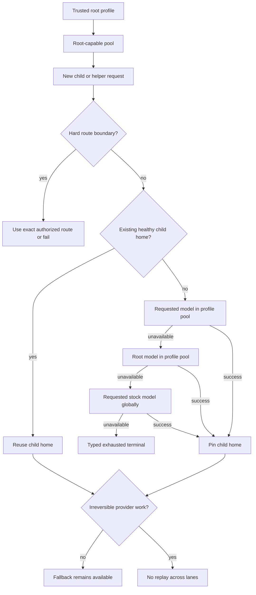
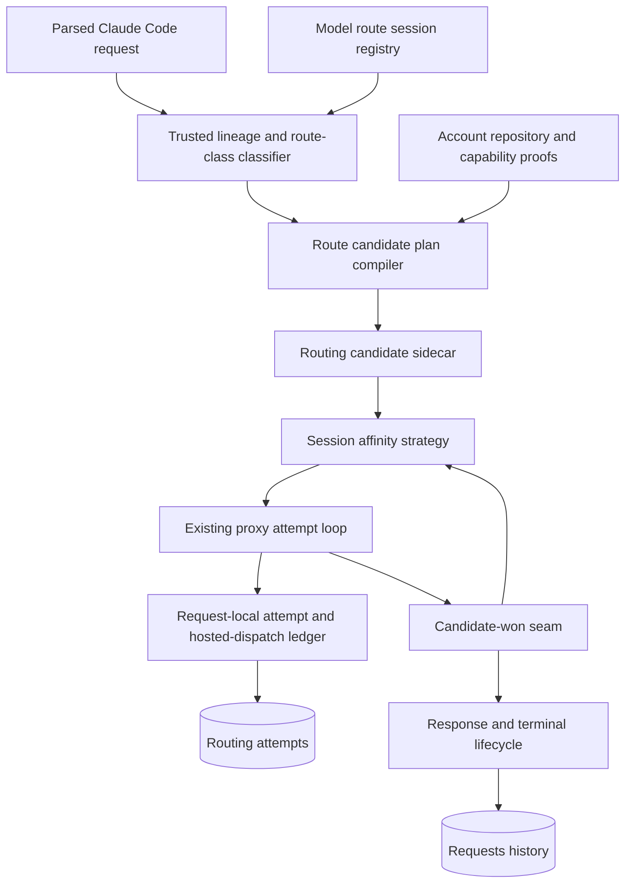
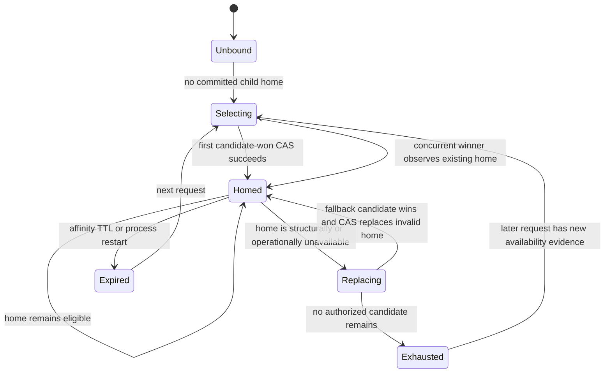
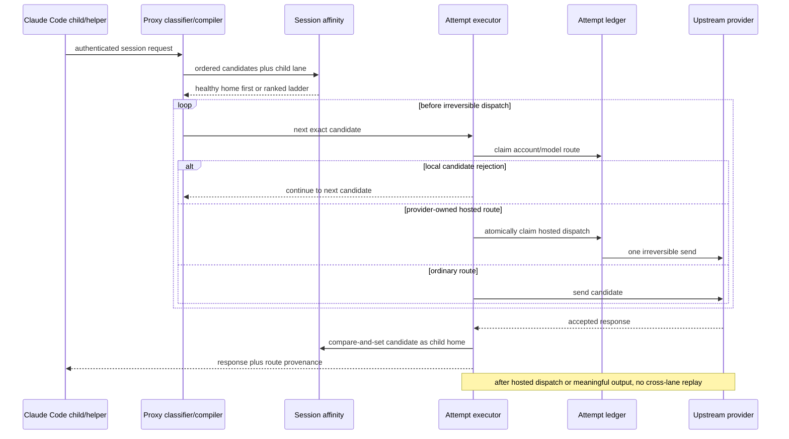
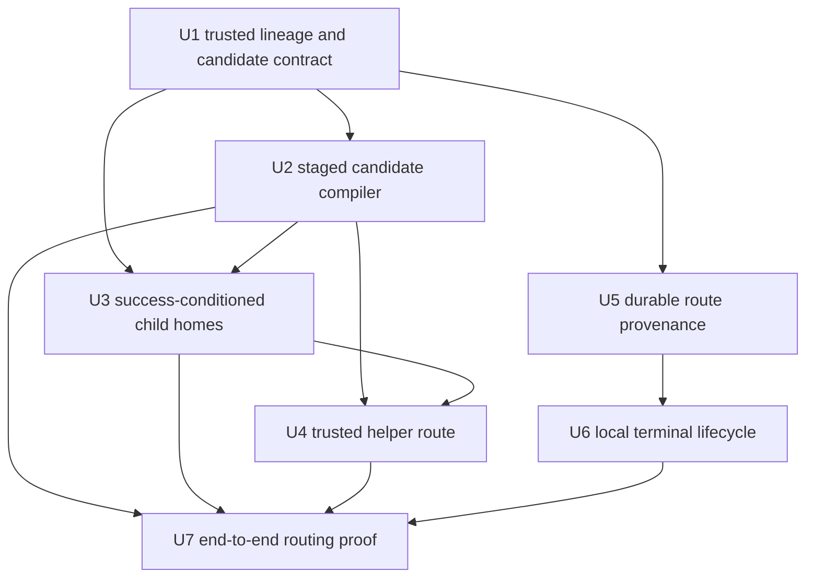

# Commit-Bound Capability Profile Descendant Routing - Plan

> **Closed implementation record (2026-09-01).** The route-profile contract shipped in [PR #286](https://github.com/StartupBros-com/better-ccflare/pull/286) (`30158015`) and the Hosted WebSearch compatibility tail shipped through [PR #287](https://github.com/StartupBros-com/better-ccflare/pull/287) and PRs [#290](https://github.com/StartupBros-com/better-ccflare/pull/290)–[#306](https://github.com/StartupBros-com/better-ccflare/pull/306). The merged implementation was deployed from `refs/heads/main` as version 3.5.70 / runtime `a1ae9169`, and naturally initiated Claude Code WebSearch completed on the exact Codex/Sol proof route. Natural route-profile observation covered about 23.9 hours and 26,526 requests across every fallback rung and home action; the operator elected a qualified early close rather than wait for the remaining interval. The final 48-minute post-success report recorded 424 successful `pro-primary-sol` Codex/Sol requests, zero persisted matching server-tool/Anthropic request errors, and 12 pre-dispatch overload warnings absorbed by routing. The operator report was reviewed locally and intentionally not committed because its bounded warning samples contain private account topology. Issue #279 remains open for its separate seven-day telemetry and reporter-confirmation condition; it is not a blocker on this plan's implementation status.

The requirements, decisions, implementation units, and verification contract below are retained as historical design authority. Current runtime guidance lives in [Account Routing Architecture](../routing-architecture.md#claude-code-model-route-profiles), and the reusable invariant is captured in [Authorization-Before-Ranking and Success-Conditioned Route Ownership](../solutions/architecture-patterns/commit-bound-routing.md).

## Goal Capsule

- **Objective:** Claude Code helpers and descendant agents complete whenever a safe route exists, without sacrificing cache continuity, hard route boundaries, server-tool at-most-once behavior, or truthful route provenance.
- **Means:** Use commit-bound routing through one candidate plan and one success-conditioned child route home (KTD1-KTD3).
- **Authority:** Product Contract requirements and session-settled decisions override the Planning Contract; runtime discoveries may refine mechanisms but cannot weaken R2, R3, or R13.
- **Execution profile:** Implement test-first with fake transports and isolated concurrency tests; use only naturally initiated Claude Code traffic for post-deploy subscription-route proof.
- **Stop conditions:** Stop and return to planning if stable child lineage cannot be derived, exact capability proofs would need widening, or SQLite/PostgreSQL provenance parity cannot be preserved.
- **Tail ownership:** The executor owns implementation, targeted review, mutation proof, and the PR/CI tail; production deployment remains an explicit operator action.

---

## Product Contract

### Summary

Capability profiles define a preferred root-capable account pool rather than a physical-model pin for every descendant.
Implementation extends the existing route-candidate plan, session affinity, request lifecycle, and request-history surfaces instead of adding parallel routing authority.
Before a child's first dispatch, better-ccflare follows an availability ladder; after success, it keeps that child on a soft sticky home until the lane is unavailable.
Trusted internal helpers use exact proven capability routes, and every fallback or local terminal remains visible to operators without changing model prompts.

### Problem Frame

Two production failures exposed one missing distinction in route-profile semantics.
A Claude Code WebSearch side query carried authenticated session lineage but no child marker, so it lost the active Sol profile and reached a permanent capability-gap terminal.
Workflow agents explicitly pinned to Sonnet inherited the Sol profile, but the proxy applied the root physical-model constraint to the child mapping and rejected Sonnet-to-Terra before transport.

The failures stopped work without protecting an irreversible boundary.
The affected agents produced zero tokens and zero tool calls while Claude Code retried local rejections for roughly nine to eighteen minutes.
A six-agent diagnostic Workflow reproduced the same zero-work failure on every child.
At the same time, typed local terminals bypassed normal request persistence, leaving thousands of guard-level 503 observations without the profile/model reason needed for diagnosis.

### Actors

- A1. **Operator:** Selects a route profile and expects the session tree to complete without hidden provider or model changes.
- A2. **Root Claude Code session:** Establishes the preferred capability profile and its root-capable pool.
- A3. **Descendant agent:** Requests a logical model and owns an independent conversation/cache lineage.
- A4. **Trusted internal helper:** Performs a provider-owned operation such as WebSearch using authenticated caller and session lineage, even when Claude Code supplies no child marker.
- A5. **better-ccflare:** Enforces hard route boundaries, ranks pre-dispatch fallbacks, preserves child continuity, and records route provenance.

### Key Decisions

- **Capability profiles bind descendants to a root-capable pool, not one physical model.** (session-settled: user-directed — chosen over a physical Sol pin: explicit child model choices must remain meaningful inside the selected pool.) Governs R1, R5, R6.
- **Trusted helpers inherit an active compatible profile.** (session-settled: user-directed — chosen over a global-first helper lane: the operator-selected tree gets first authority.) Governs R10, R11.
- **Capability descendants use staged global fallback.** (session-settled: user-directed — chosen over profile-local failure: completion is preferred while safe routes remain.) Governs R5, R6, R8.
- **A child route is sticky until unavailable.** (session-settled: user-directed — chosen over per-turn reselection: cache and conversation continuity outweigh opportunistic route changes.) Governs R7-R9.
- **Routing becomes strict at the first irreversible boundary.** (session-settled: user-approved — chosen over a general global availability resolver: fallback is safe while candidates are hypothetical, not after provider work may have happened.) Governs R7, R12, R13.
- **Fallback visibility is out-of-prompt.** (session-settled: user-approved — chosen over silent fallback or injected warnings: operators need truthful provenance without polluting prompts and cache prefixes.) Governs R14-R17.

### Requirements

**Profile semantics and authority**

- R1. A capability profile's root logical model, expected provider, and expected physical model define the root-capable account pool used by its descendants.
- R2. An exact-account, force-routed, or bounded profile remains a hard route boundary and never gains descendant escape behavior from this work.
- R3. Ordinary stock-Claude root traffic without explicit route intent remains governed by PR #285's same-model integrity fence.
- R4. Profile inheritance requires the existing authenticated caller and session identity; client-supplied model, profile, helper, or child assertions alone cannot establish lineage.

**Descendant availability and continuity**

- R5. Before a capability-profile descendant's first dispatch, routing tries the requested logical model inside the root-capable pool, then the profile root model inside that pool, then the requested stock model through the ordinary global pool.
- R6. The global fallback rung preserves the requested stock model and cannot use an unrelated provider mapping merely because that account is available.
- R7. The first successful descendant lane becomes that child lineage's preferred home; the parent and sibling lineages choose independently.
- R8. A preferred home changes only when current route eligibility, capacity, or credential evidence says it cannot serve the request; priority edits and newly recovered preferred routes do not remap a healthy child.
- R9. After a genuine home failure, routing resumes at the nearest semantically equivalent candidate, continues through R5's ladder, and makes the first successful fallback the new home without snapping back during that child's lifetime.

**Trusted helpers and provider-owned tools**

- R10. A replay-authenticated same-session helper with an active capability profile is treated as a profile descendant even when Claude Code supplies no subagent marker or substitutes a helper model.
- R11. A trusted helper uses the active profile's exact proven server-tool route first; before dispatch, an unavailable capability profile may continue to the global proven capability lane, and a profile-less helper starts there, while R2 profiles cannot escape their hard boundary.
- R12. Helper-model substitution is not an operator model choice and cannot prevent selection of the exact physical model required by the proven provider-owned capability.
- R13. Once a provider-owned server tool crosses its irreversible dispatch boundary, no model fallback, account failover, or guard replay may execute that operation again within the inbound request; cross-request deduplication requires a stable authenticated invocation identifier that Claude Code does not currently provide.

**Failure and observability**

- R14. Every descendant/helper selection records requested logical model, active profile, selected provider and physical model, fallback rung, served route, and any re-pin reason using existing privacy-safe identity conventions.
- R15. Typed local server-tool, profile, and force-route terminals pass through the normal durable terminal-observability seam without exposing private account topology.
- R16. Responses expose requested, applied, and served model provenance plus fallback status through non-prompt metadata; no routing warning is injected into model-visible conversation content.
- R17. When R5 or R11 exhausts every authorized candidate before dispatch, the client receives one typed terminal that distinguishes permanent incompatibility from temporary unavailability and does not invite an unsafe retry.
- R18. Operators can distinguish profile-local success, root-model substitution, global escape, child re-pin, and exhausted fallback in aggregate and per-request diagnostics.

**Compatibility, migration, and proof**

- R19. Existing profile identifiers, discovery entries, caller headers, model mappings, and ordinary root behavior remain compatible; no current configuration surface is removed or narrowed.
- R20. Deployment requires no durable route-home backfill: process restart clears the current in-memory bindings, and each descendant establishes a home through the new rules on its next request.
- R21. Verification uses unit/integration tests with fake transports plus naturally initiated Claude Code traffic after a main-only deployment; no scripted request may target an Anthropic-backed or Codex subscription account.

### Routing Lifecycle

### Key Flows

- F1. **Capability-profile root admission**
  - **Trigger:** A2 selects a capability profile.
  - **Actors:** A1, A2, A5
  - **Steps:** Validate the explicit root route, establish the root-capable pool, and commit the session binding only after admission succeeds.
  - **Outcome:** Descendants can inherit pool authority without inheriting one physical model.
  - **Covers:** R1, R3, R4.

- F2. **New descendant chooses a home**
  - **Trigger:** A3 sends its first request with an explicit or default logical model.
  - **Actors:** A3, A5
  - **Steps:** Apply R5's ordered ladder before dispatch and record the first successful lane as this child's home.
  - **Outcome:** Work starts whenever a safe route exists, with one stable lane for later turns.
  - **Covers:** R5-R7, R14.

- F3. **Child home becomes unavailable**
  - **Trigger:** A5 has concrete evidence that the current home cannot serve the next request.
  - **Actors:** A3, A5
  - **Steps:** Preserve equivalent model/provider routes first, continue through the remaining ladder, and re-pin only after success.
  - **Outcome:** The child recovers without per-turn route churn or sibling remapping.
  - **Covers:** R8, R9, R16.

- F4. **Trusted WebSearch helper**
  - **Trigger:** A4 sends an exact server-tool declaration with valid authenticated replay lineage.
  - **Actors:** A2, A4, A5
  - **Steps:** Prefer the active profile's proven capability route, ignore the helper model as routing authority, and claim at-most-one dispatch.
  - **Outcome:** WebSearch works inside compatible profile sessions and never executes twice after dispatch.
  - **Covers:** R10-R13.

- F5. **No authorized route remains**
  - **Trigger:** Every pre-dispatch candidate allowed by the relevant hard boundary and fallback ladder is unavailable or incompatible.
  - **Actors:** A3 or A4, A5
  - **Steps:** Stop before provider I/O, record the complete local decision, and return one typed terminal.
  - **Outcome:** Failure is rare, bounded, truthful, and diagnosable.
  - **Covers:** R15-R18.

### Acceptance Examples

- AE1. **Covers R1, R5, R7.** Given a Sol capability profile whose root-capable Codex accounts map Sonnet to Terra, when a new child requests Sonnet, then Terra serves the request and becomes that child's home.
- AE2. **Covers R5, R7, R14.** Given no available Terra lane but an available Sol lane in the profile pool, when a Sonnet child starts, then Sol serves it and provenance records root-model substitution.
- AE3. **Covers R5, R6, R14.** Given the complete profile pool is unavailable but native global Sonnet is eligible, when the child starts, then native Sonnet serves it and provenance records global escape.
- AE4. **Covers R7-R9.** Given a child is homed on Terra and that lane remains eligible, when priorities change or Sol recovers, then later turns remain on Terra; when Terra becomes unavailable, the first successful fallback becomes the new home.
- AE5. **Covers R7-R9.** Given two sibling agents, when one falls back from Terra to Sol, then the parent's and sibling's homes do not change.
- AE6. **Covers R10-R13.** Given an active Sol capability profile and a same-session WebSearch helper with no child marker, when replay identity validates, then the helper uses the proven Sol hosted-search route regardless of its helper model.
- AE7. **Covers R11, R13.** Given no active profile, or an active capability profile whose exact proven route is unavailable before dispatch, when a trusted WebSearch helper arrives, then it may use the global proven hosted-search lane; after dispatch, no other lane executes the search within that inbound request.
- AE8. **Covers R2, R11.** Given an exact-account, force-routed, or bounded profile whose route cannot execute WebSearch, when its helper arrives, then the helper fails inside that hard boundary and never escapes globally.
- AE9. **Covers R3.** Given an ordinary stock Opus root with no explicit profile, combo, force route, or agent preference, when a higher-priority mapped Codex account exists, then that account remains ineligible and the request is not silently rewritten.
- AE10. **Covers R15-R18.** Given any pre-dispatch profile/helper terminal or successful fallback, when an operator queries request diagnostics, then the typed reason and route provenance are present without private topology or prompt content.

### Success Criteria

- The reported same-session WebSearch request succeeds through one proven hosted-search dispatch under the Sol capability profile.
- Sonnet-pinned Workflow children no longer terminate with pre-dispatch `model_mapping_mismatch` when Terra, profile-root Sol, or native global Sonnet is safely available.
- A healthy child home does not change across turns because of priority edits, preferred-route recovery, or sibling fallback.
- Every fallback rung, child re-pin, and typed local terminal is queryable with requested/applied/served model provenance.
- Ordinary stock-Claude root regression coverage proves PR #285's same-model fence is unchanged.
- Exact-account, bounded-profile, and post-dispatch server-tool regressions prove availability fallback never weakens hard boundaries.

### Scope Boundaries

- The `1m` profile hint versus Sol's raw/effective context limit is a separate investigation and is not changed here.
- This work does not create a general per-profile policy language; semantics follow the existing capability, exact-account, force-route, and bounded profile classes.
- This work does not change Claude Code's UI labels, helper-model experiment, or client retry implementation; better-ccflare provides truthful provenance for surfaces that consume it.
- WebFetch and new provider-owned tool types remain outside scope.
- Cross-request server-tool deduplication remains outside scope until Claude Code supplies a stable authenticated invocation identity; repeated inbound WebSearch calls are distinct operations.
- No version bump, generated worker change, or scripted subscription-account canary is included.

### Dependencies and Assumptions

- Claude Code continues to send stable authenticated caller identity and `x-claude-code-session-id` on helper requests that require private replay authority.
- Provider-owned capability proofs remain exact code-reviewed authority; availability fallback cannot manufacture support for an unproven tuple.
- Child conversations have stable lineage distinct from their parent and siblings.
- Existing routing evidence can classify whether a home remains eligible without treating priority movement as unavailability.

### Sources and Research

- `docs/plans/2026-07-29-001-fix-provider-server-tool-capability-architecture-plan.md` — exact hosted-search admission, at-most-one dispatch, replay authority, and ordinary-path invariance.
- `packages/proxy/src/model-route-profiles.ts` — current profile classes and authenticated session binding.
- `packages/proxy/src/claude-code-request.ts` — current descendant classification signals.
- `packages/proxy/src/handlers/account-selector.ts` — capability-pool matching, ordinary model integrity, and profile constraints.
- `packages/proxy/src/handlers/proxy-operations.ts` — concrete physical-model revalidation and route-change continuity behavior.
- `packages/providers/src/providers/codex/server-tools.ts` — Sol-only hosted-search capability proof.
- `packages/proxy/src/server-tool-replay-runtime.ts` — authenticated request-private replay audience and lineage.
- PR #282 / commit `5d110c48` — permanent server-tool capability-gap terminal.
- PR #285 / commit `087c0809` — ordinary root model-integrity fence and exact physical route-profile enforcement.
- `packages/load-balancer/src/strategies/session-affinity.ts` — bounded sticky owner state, route circuits, anti-thrash, and success-conditioned owner commit precedent.
- `packages/proxy/src/response-handler.ts` — definitive serving-route seam and response metadata projection.
- `docs/solutions/workflow-issues/typecheck-does-not-cover-test-call-sites.md` — shared signature changes require explicit test-call-site sweeps and affected-suite execution.

---

## Planning Contract

**Product Contract preservation:** Clarified, no scope change: R11 and AE7 now make the approved capability-helper global fallback explicit; R13 states the already-intended inbound-request boundary; AE8 names force-routed profiles already covered by R2. All other R/A/F/AE meaning is unchanged.

### Key Technical Decisions

- KTD1. **Compile one ordered route-candidate plan.** Extend `RoutingCandidateMetadata` with the route-profile fallback rung and effective logical model, then execute every rung through the existing candidate sidecar and request-local attempt ledger. Do not recursively call account selection or build a second fallback queue. This instantiates R1, R5, R6, R11, and R12.
- KTD2. **Derive a server-trusted descendant lane.** Build the affinity lane from authenticated caller scope, Claude Code session, bounded child-agent identity, route profile, protocol, and requested logical model. Parent and sibling identities cannot share a child route home. A marker-only descendant without stable identity can use request-local fallback but cannot create shared controlling state. This instantiates R4, R7, and R9.
- KTD3. **Commit child homes at the existing candidate-acceptance boundary.** Reuse `SessionAffinityStrategy` storage, bounds, and route circuits, but add a descendant mode that defers owner assignment until `settleRoutedResponse` accepts an irreversible route, an eligible successful response, or the final committed candidate. This is earlier than full stream completion and later than response headers alone. A later empty/truncated stream opens the route circuit for the next request but never replays the committed response. Compare-and-set semantics let the first concurrent winner establish the home and prevent later completions from overwriting it. This instantiates R7-R9.
- KTD4. **Treat route-class changes as re-pins, not upgrades.** A healthy child home remains first regardless of priority changes or preferred-rung recovery. Only structural removal, hard exclusion, account unavailability, model-capacity evidence, credential failure, or an open route circuit can authorize a new home. Existing ordinary affinity snapback and pressure behavior stays unchanged outside descendant mode. This instantiates R8 and R9.
- KTD5. **Classify helpers provisionally, prove them exactly.** Detect a server-tool declaration before profile resolution only to choose the inherited helper route class. An active capability profile tries its exact proven candidates before the global proven lane; exact-account, force-routed, and bounded profiles cannot escape. The existing replay audience, session-lineage validation, exact capability tuple, proof revalidation, and request-local hosted-dispatch claim remain the authority before transport. This instantiates R10-R13.
- KTD6. **Separate attempt provenance from final outcome provenance.** Keep `original_model` and `applied_model` semantics unchanged. Append one fallback-rung/candidate snapshot per physical or local attempt, but freeze final/live/response provenance only from the accepted winner or typed terminal. Add bounded route-provenance fields with matching SQLite and PostgreSQL migrations. This instantiates R14-R18 and R20.
- KTD7. **Record local terminals through the existing lifecycle coordinator.** Route server-tool, profile, and force-route local responses through `recordRoutingTerminalRequest` after request metadata is complete. The lifecycle coordinator remains the single-start/single-end guard, and local records never fabricate a serving account or physical attempt. This instantiates R15 and R17.
- KTD8. **Keep hard profiles and ordinary roots on their current selectors.** The fallback-plan compiler activates only for inherited capability descendants and trusted helpers. Exact-account, force, bounded, combo, stored agent rewrite, internal probe, and ordinary stock-root behavior retain their existing authority unless a requirement names them. This instantiates R2, R3, R19, and R21.
- KTD9. **Aggregate exhaustion conservatively.** A terminal is permanent only when no authorized structural candidate has a proven implementation. If any authorized implementation exists but is unavailable because of capacity, credentials, circuit state, or incomplete evidence, the request returns the existing temporary class with the earliest safe recovery hint. Hard-route mismatch and retained authoritative upstream terminals keep their existing precedence. This instantiates R17.
- KTD10. **Project provenance by trust surface.** Client response metadata exposes only coarse requested/routed model and fallback status. Internal worker messages carry the bounded complete snapshot. Existing authenticated operator request APIs and routing-attempt APIs may expose provider, account, candidate, and re-pin detail. Raw child identity, credentials, replay material, and proof keys never leave internal routing state. This instantiates R14-R18.

### High-Level Technical Design

#### Component and data ownership

The model-route registry owns root profile inheritance. The candidate sidecar owns the ordered request-local plan. Session affinity owns the bounded child route home. The attempt ledger owns duplicate-send and hosted-dispatch safety. Request persistence owns durable operator provenance.

#### Descendant home lifecycle

Selection never commits an attempted candidate. Candidate acceptance commits the home. Post-commit stream failures open the existing route circuit; the next request observes that circuit as home unavailability and may re-pin without replaying the committed response.

#### Fallback and irreversible-dispatch sequence

### Implementation Constraints

- Preserve account secrecy in client errors and logs; durable operator records may use existing internal account and candidate identifiers only through current authenticated request-history surfaces (KTD10).
- Bound all new lineage and provenance strings before they enter maps, logs, response headers, or database rows.
- Keep the affinity map's current TTL, lazy sweep, and entry cap unless implementation evidence requires a narrower descendant bound.
- Never infer a successful home from candidate order, credential acquisition, response headers alone, or an attempted physical route; use KTD3's accepted-candidate boundary.
- Keep fallback-rung order authoritative over account priority; priority and pressure only order candidates inside one rung.
- Do not reuse capability-profile route intent to bypass PR #285 on the global requested-model rung; that rung applies the ordinary same-model eligibility fence.
- Preserve `ServerToolRoutingError`, `ForceRouteUnavailableError`, and route-unavailable taxonomy, and apply KTD9 when mixed candidate evidence exists.
- Add every request-table migration and routing-attempt migration to both `migrations.ts` and `migrations-pg.ts` for new installs and upgrades.
- Treat schema expansion as a startup prerequisite: nullable columns must exist before new producers emit provenance, and legacy readers/producers must tolerate their absence from older messages and rows.
- Do not modify or search generated inline worker files. Run the repository build only when a fresh worktree needs generated database workers for tests, and never stage those outputs.

### Sequencing

### System-Wide Impact

- **Routing authority:** Root profile binding remains in the model-route registry. Candidate plan order becomes the only fallback authority. Session affinity stores only the winning child home. This prevents three components from independently deciding provider/model fallback.
- **Authentication and trust:** Child and helper classification can influence account/provider selection, so all controlling state stays scoped by authenticated caller plus session. Raw client headers remain evidence within that scope, not global authorization.
- **Cache and turn continuity:** Physical model or account changes invalidate Codex turn-state reuse. KTD3-KTD4 minimize those changes and ensure the response route, affinity home, and trace provenance identify the same winning candidate.
- **Persistence and APIs:** Additive nullable fields affect shared TypeScript types, worker messages, SQLite, PostgreSQL, request repositories, routing attempts, REST responses, and live summaries. Legacy rows and producers remain valid.
- **Failure propagation:** Pre-dispatch incompatibility can continue to another rung. A claimed hosted dispatch or meaningful provider output is terminal for cross-lane replay. Later route health evidence affects only the next request.
- **Operations:** Existing request history becomes the operator source for fallback and terminal diagnosis. No new dashboard is required, but logs and docs must show how to distinguish profile-local success, substitution, global escape, re-pin, and exhaustion.
- **Performance:** Candidate construction is bounded by configured accounts times three rungs and deduplicates account/model routes before strategy selection. Child-home state reuses the existing bounded affinity map and adds no durable session-state table.

### Risks and Mitigations

| Risk | Consequence | Mitigation and proof |
|---|---|---|
| A forged or malformed child identifier controls another conversation's home | Cross-session route hijack or cache contamination | Scope lineage by authenticated caller and session, bound/opaque the identifier, and cover caller/session/sibling isolation in U1. |
| Selection commits a candidate before it serves | A failed route strands later turns or creates false provenance | Defer mutation until the candidate-won seam and use compare-and-set concurrency tests in U3. |
| The global rung inherits profile bypass authority | Ordinary stock traffic silently reaches a mapped provider, regressing PR #285 | Apply the ordinary same-model fence per candidate rung and retain the ordinary-root regression in U2/U7. |
| A server tool retries after its side effect may have happened | Duplicate WebSearch execution and inconsistent replay history | Keep exact proof revalidation and one hosted-dispatch claim; mutation-test the post-dispatch branch in U4/U7. |
| Home recovery triggers snapback | Physical-model churn loses cache/turn continuity | Descendant mode treats recovery and priority movement as ordering signals only; KTD4 names the only replacement evidence. |
| Concurrent child requests choose different first homes | Completion order overwrites a valid cache lane nondeterministically | First candidate-won CAS establishes the home; later winners cannot replace a healthy home. |
| SQLite and PostgreSQL schemas drift | One deployment backend loses provenance or fails startup | Pair every schema/upgrade change and run both migration suites plus repository round trips in U5. |
| New provenance changes legacy rewrite semantics | Existing alerts and API consumers misinterpret unchanged requests as rewrites | Add separate route fields, keep swap-only `original_model`/`applied_model`, and pin legacy protocol/API tests. |
| Local terminal recording duplicates lifecycle rows | Inflated failure counts and conflicting request outcomes | Funnel through the lifecycle coordinator and assert one start/end row with zero physical attempts in U6. |
| Client-facing metadata exposes internal topology | Account/candidate/child identity leaks to ordinary callers | Enforce KTD10's field allowlist per response, worker, operator API, and persistence surface; add unauthorized-read tests in U5-U6. |
| A cross-request retry repeats hosted search | Duplicate external work after response loss | Keep R13 explicitly request-local and do not infer retry identity from query text; add cross-request dedup only when the client supplies a stable authenticated invocation ID. |
| Mixed candidate evidence chooses the wrong terminal | Clients stop permanently during a recoverable outage or retry a true capability gap | Aggregate with KTD9 and test mixed structural/temporary outcomes in U2, U4, and U6. |
| Candidate multiplication increases selection cost | Higher pre-transport latency during large account pools | Cap at the three Product Contract rungs, deduplicate before strategy work, and avoid recursive selection/database reads. |

---

## Implementation Units

### U1. Trusted descendant lineage and route-candidate contract

- **Goal:** Give routing one server-derived child lane and one candidate metadata contract for fallback and provenance.
- **Requirements:** R4, R7, R14, R19; A2-A5; F2.
- **Dependencies:** None.
- **Files:**
  - `packages/types/src/api.ts`
  - `packages/proxy/src/claude-code-request.ts`
  - `packages/proxy/src/handlers/proxy-types.ts`
  - `packages/proxy/src/handlers/account-selector.ts`
  - `packages/proxy/src/__tests__/claude-code-request.test.ts`
  - `packages/proxy/src/handlers/__tests__/account-selector.test.ts`
- **Approach:**
  1. Add bounded route-lineage, fallback-rung, effective logical model, and route-home metadata to the shared request/candidate types.
  2. Derive child identity from Claude Code agent headers inside the authenticated caller/session scope; never let the child header act as global authority.
  3. Include the child identity in profile-scoped affinity lanes while retaining the current lane encoding for ordinary traffic.
  4. Keep helper identity separate from child-agent identity so a WebSearch side query cannot overwrite an agent's home.
- **Patterns to follow:** `routeCallerIdentity` and `ModelRouteSessionRegistry.bindingKey` for caller scoping; `deriveAffinityLaneKey` for versioned lane encoding; request-private replay bounds for hostile-string handling.
- **Execution note:** Start with failing identity/isolation tests before extending shared types; grep every production and test caller because root typecheck excludes tests.
- **Test scenarios:**
  - Covers AE5. Two sibling agent headers under one session derive distinct profile lanes, and parent traffic derives neither child lane.
  - The same child ID under different authenticated callers or sessions cannot share a lane.
  - A `cc_is_subagent=true` request without stable child identity is classified as a descendant but does not create a reusable child-home key.
  - Empty, control-character, and oversized agent IDs are rejected or reduced to the bounded opaque representation without entering metadata verbatim.
  - Ordinary non-profile lane keys remain byte-for-byte compatible with current tests.
- **Verification:** All shared-type callers compile; explicit test-call-site sweep finds no stale fixtures; lineage tests prove sibling and caller isolation.

### U2. Staged capability-descendant candidate plan

- **Goal:** Compile the three authorized descendant fallback rungs into one deterministic candidate sidecar consumed by the existing proxy loop.
- **Requirements:** R1-R6, R8, R17, R19; F1, F2, F5; AE1-AE3, AE9.
- **Dependencies:** U1.
- **Files:**
  - `packages/proxy/src/model-route-profiles.ts`
  - `packages/proxy/src/handlers/account-selector.ts`
  - `packages/proxy/src/proxy.ts`
  - `packages/proxy/src/handlers/proxy-operations.ts`
  - `packages/proxy/src/__tests__/model-route-profiles.test.ts`
  - `packages/proxy/src/__tests__/proxy-model-route-profiles.test.ts`
  - `packages/proxy/src/__tests__/proxy-model-first-routing.test.ts`
  - `packages/proxy/src/handlers/__tests__/account-selector.test.ts`
  - `packages/proxy/src/handlers/__tests__/proxy-operations-model-observability.test.ts`
- **Approach:**
  1. Split root-capable pool membership from per-request physical-model validation for inherited capability descendants; keep exact roots on the current strict check.
  2. Build candidates in R5 order, deduplicated by account plus physical model, with rung order ahead of priority/pressure order.
  3. Generalize proxy execution to read `modelOverride` and rung provenance from aligned candidate metadata rather than only combo sidecars.
  4. Apply the ordinary same-model policy when compiling the global requested-model rung even though the session retains profile provenance.
  5. Preserve one request-local attempt budget, retained terminal precedence, pacing crossover, capacity evidence, and candidate-finality calculations across all rungs; aggregate exhausted candidate evidence through KTD9.
- **Patterns to follow:** Combo candidate IDs and model overrides; deferred model-route waves in `proxy-model-first-routing.test.ts`; `alignRouteCandidateIds`; request-local `RoutingAttemptLedger` duplicate-route claims.
- **Execution note:** Replace the current child mismatch expectation test-first; do not weaken the explicit-root mismatch tests that protect PR #285.
- **Test scenarios:**
  - Covers AE1. Sonnet maps to Terra on a root-Sol-capable Codex account and is attempted in the first rung without a root physical mismatch.
  - Covers AE2. When every requested-model profile candidate is unavailable, root Sol candidates run before any global account.
  - Covers AE3. When the profile pool is unavailable, native global Sonnet is eligible while mapped non-Sonnet providers remain fenced.
  - Covers AE9. An ordinary stock Opus root still skips higher-priority mapped Codex accounts.
  - Exact profile roots and explicit picker children still reject a concrete model outside the declared physical boundary before transport.
  - Duplicate account/model candidates across rungs execute once; repeated account with different physical models retains distinct candidate identity.
  - Rung ordering survives strategy priority changes, capacity-deferred routes, probe suppression, and crossover pacing.
  - Exhaustion with only structural incompatibility is permanent, only temporary blockers is retryable, and mixed incompatibility plus any authorized temporary blocker follows KTD9's temporary classification and recovery hint.
- **Verification:** Fake transports show the exact account/model attempt sequence for each rung; ordinary-root and hard-profile regression suites remain unchanged.

### U3. Success-conditioned soft child route homes

- **Goal:** Keep each child on its first winning lane until that lane is unavailable, without snapback or cross-sibling remapping.
- **Requirements:** R7-R9, R14; F2, F3; AE4, AE5.
- **Dependencies:** U1, U2.
- **Files:**
  - `packages/core/src/strategy.ts`
  - `packages/load-balancer/src/strategies/session-affinity.ts`
  - `packages/load-balancer/src/strategies/__tests__/session-affinity.test.ts`
  - `packages/proxy/src/proxy.ts`
  - `packages/proxy/src/response-handler.ts`
  - `packages/proxy/src/__tests__/proxy-model-route-profiles.test.ts`
- **Approach:**
  1. Add a descendant selection mode that orders an existing healthy home first but defers new/replacement owner mutation during selection.
  2. Return a bounded commit token or equivalent compare-and-set evidence with the selected candidate, current-home state, and invalidation basis.
  3. Commit at KTD3's existing accepted-candidate seam before downstream delivery; first concurrent winner installs the home and later different winners observe but do not overwrite it.
  4. Treat a header-only, empty, truncated, or post-commit stream failure as route-health evidence for the next request, never as permission to replay the committed response.
  5. Authorize replacement only from KTD4 unavailability evidence; do not treat a better rung, priority edit, or recovered preferred candidate as a reason to snap back.
  5. Keep current ordinary affinity, at-home guard, displaced-owner snapback, and anti-thrash behavior unchanged when descendant mode is absent.
- **Patterns to follow:** `commitAffinityOwner`, `snapshotAffinityOwner`, bounded affinity entries, route-circuit failure/success reports, and `settleRoutedResponse().candidateWon`.
- **Execution note:** Implement state-machine and concurrency tests before wiring proxy success callbacks.
- **Test scenarios:**
  - Covers AE4. A healthy Terra home remains first after Sol recovers, priority changes, and account utilization changes.
  - Covers AE4. A paused, rate-limited, credential-blocked, capacity-blocked, structurally removed, or circuit-open home permits a re-pin to the first winning fallback.
  - Covers AE5. One sibling's re-pin does not alter parent or sibling homes.
  - Two concurrent first requests select different candidates; the first candidate-won commit establishes the home and the later success cannot overwrite it.
  - A candidate rejected before dispatch, a failed credential lookup, and an upstream error before candidate acceptance do not create a home.
  - An accepted header-only response establishes the home; if its stream is empty, truncated, or fails later, the route circuit opens, no same-request replay occurs, and the next turn may re-pin.
  - A final non-success candidate accepted only because no retained terminal outranks it follows the existing `settleRoutedResponse` winner decision rather than inventing a second success predicate.
  - TTL expiry and process restart erase homes and let the next request select afresh.
  - Existing ordinary-affinity snapback, at-home, anti-thrash, and map-cap tests remain green.
- **Verification:** Strategy health counts remain bounded; transition telemetry distinguishes retain, initial commit, invalidation, and re-pin; concurrency tests are deterministic with an injected clock/barrier.

### U4. Trusted helper inheritance and exact hosted dispatch

- **Goal:** Route same-session WebSearch through an active compatible profile or global proven lane without granting capability from helper metadata.
- **Requirements:** R4, R10-R13, R17; F4, F5; AE6-AE8.
- **Dependencies:** U1-U3.
- **Files:**
  - `packages/proxy/src/request-body-context.ts`
  - `packages/proxy/src/proxy.ts`
  - `packages/proxy/src/server-tool-replay-runtime.ts`
  - `packages/proxy/src/__tests__/proxy-model-route-profiles.test.ts`
  - `packages/proxy/src/__tests__/server-tool-routing.integration.test.ts`
  - `packages/proxy/src/server-tool-replay-runtime.test.ts`
  - `packages/providers/src/providers/codex/provider.server-tools.test.ts`
- **Approach:**
  1. Add a side-effect-free server-tool presence classification after agent interception and before profile resolution; leave exact finalized requirements as the later authority.
  2. Resolve a trusted helper against the authenticated caller/session profile binding even without a child header, but do not create or clear child route homes.
  3. Compile the active capability profile's exact proven candidates first, then the global proven capability lane when every profile candidate is unavailable before dispatch; profile-less helpers start on the global lane.
  4. Preserve request-private replay binding, proof revalidation, and the single hosted-dispatch claim immediately before HTTP or WebSocket transport.
  5. Keep exact-account, force-routed, and bounded helpers inside their hard boundary and persist a typed pre-transport terminal when that route cannot prove support.
  6. Scope the hosted-dispatch claim to one inbound request. Do not suppress a later inbound request by hashing query text or session metadata because those values cannot distinguish an intentional repeated search from a response-loss retry.
- **Patterns to follow:** `deriveServerToolRequirement`, request-private replay authority, `resolveExactServerToolCapability`, and `claimHostedDispatch` at irreversible transport boundaries.
- **Execution note:** Use fake provider plans only; no scripted subscription-account request is permitted.
- **Test scenarios:**
  - Covers AE6. A same-session WebSearch helper without child headers inherits the Sol capability profile and dispatches once through the exact Codex proof.
  - Covers AE7. A profile-less helper starts on the global proven capability route; an active capability profile reaches that same lane only after all exact profile candidates are unavailable before dispatch.
  - Covers AE8. Exact-account, force-routed, and bounded-profile helpers never escape globally and persist one typed local terminal.
  - A forged session without the authenticated caller binding cannot inherit another session's profile.
  - Invalid replay audience, missing writer lease, proof drift, wrong physical model, query-bearing endpoint, and unsupported declaration all stop before transport.
  - HTTP/WebSocket races and every retry path inside one inbound request cannot claim hosted dispatch twice.
  - Two distinct inbound requests with the same session and query remain distinct until the client provides a stable authenticated invocation ID.
  - Ordinary client functions named `WebSearch` do not trigger provider-owned helper routing.
- **Verification:** Integration tests assert one hosted transport and zero fallback transports after claim; existing server-tool contract fixtures remain exact.

### U5. Durable route provenance across SQLite and PostgreSQL

- **Goal:** Make requested, selected, served, fallback, and re-pin outcomes queryable without changing legacy rewrite semantics.
- **Requirements:** R14, R16, R18-R20; AE10.
- **Dependencies:** U1.
- **Files:**
  - `packages/types/src/request.ts`
  - `packages/proxy/src/worker-messages.ts`
  - `packages/proxy/src/response-handler.ts`
  - `packages/proxy/src/usage-collector.ts`
  - `packages/database/src/migrations.ts`
  - `packages/database/src/migrations-pg.ts`
  - `packages/database/src/repositories/request.repository.ts`
  - `packages/database/src/repositories/routing-attempt.repository.ts`
  - `packages/database/src/database-operations.ts`
  - `packages/database/src/migrations.test.ts`
  - `packages/database/src/migrations-pg.test.ts`
  - `packages/database/src/routing-attempt-migrations.test.ts`
  - `packages/database/src/repositories/__tests__/request-model-rewrite.test.ts`
  - `packages/database/src/repositories/__tests__/routing-attempt.repository.test.ts`
  - `packages/proxy/src/__tests__/worker-messages.test.ts`
  - `packages/proxy/src/__tests__/response-handler-worker-protocol.test.ts`
  - `packages/proxy/src/__tests__/usage-collector-lifecycle.test.ts`
- **Approach:**
  1. Define bounded enums/fields for route profile, requested logical model, selected/routed provider and physical model, fallback rung, home action, re-pin reason, and candidate identity.
  2. Append candidate/rung facts to routing attempts at classification time, but project final/live/response provenance only from KTD3's accepted winner or KTD7's typed terminal.
  3. Freeze winner/terminal provenance on the lifecycle's first authoritative final snapshot; later usage finalization may add token/model usage but cannot replace route identity.
  4. Add nullable columns to both schemas and both upgrade paths; verify schema expansion before new producers start, and retain current `original_model`/`applied_model` swap-only behavior.
  5. Add fallback rung and candidate identity to routing attempts so failed rungs can be reconstructed without storing request payloads.
  6. Apply KTD10's visibility matrix: coarse provenance on client response metadata, complete bounded snapshots inside worker messages, and internal topology only on existing authenticated operator APIs.
  7. Bound and sanitize every persisted/client-visible value; never include raw child identity, credentials, replay authority, prompt content, or private proof keys.
- **Patterns to follow:** Agent/project attribution tri-state persistence, `client_session_id` sanitization, request model rewrite tests, routing-attempt `upstream_evidence` parity, and `withResponseMetadataHeaders`.
- **Execution note:** Write migration and repository tests first; after every signature change, run an all-callers `rg -a` sweep because test call sites are outside typecheck.
- **Test scenarios:**
  - Covers AE10. Profile-local requested-model, root substitution, global escape, retained home, and re-pin each persist distinct provenance.
  - Local terminal rows persist requested/profile/fallback evidence with null serving account and no fabricated physical model.
  - Successful rows expose the same route provenance in REST and live summary responses.
  - Legacy rows and legacy `StartMessage` shapes read with null/undefined provenance and do not fail.
  - Request UPSERT finalization cannot erase accepted-winner or typed-terminal route fields; failed-attempt facts remain isolated in routing-attempt rows.
  - Client response headers omit provider, account, candidate, and raw child-lineage identifiers; existing authenticated operator APIs expose only their documented internal fields.
  - Unauthorized request-history callers cannot read new operator-only provenance through list, detail, live-summary, or routing-attempt surfaces.
  - SQLite and PostgreSQL fresh-install and upgrade schemas contain equivalent columns, bounds, and indexes needed by operator queries.
  - New producers start only after nullable schema expansion; legacy rows, readers, and optional worker-message fields remain compatible during deployment and rollback.
  - Routing-attempt summaries remain compatible and cleanup/reset paths include the added nullable columns without behavioral drift.
- **Verification:** Schema parity tests, repository round trips, worker protocol tests, and request API mapper tests agree on one provenance vocabulary.

### U6. Typed local terminal lifecycle and operator reads

- **Goal:** Persist every pre-dispatch server-tool/profile/force terminal exactly once and expose route provenance through existing request surfaces.
- **Requirements:** R15-R18; F5; AE10.
- **Dependencies:** U5.
- **Files:**
  - `packages/proxy/src/routing-terminal-recorder.ts`
  - `packages/proxy/src/proxy.ts`
  - `packages/proxy/src/server-tool-routing-errors.ts`
  - `packages/proxy/src/__tests__/routing-terminal-observability.test.ts`
  - `packages/proxy/src/__tests__/server-tool-routing.integration.test.ts`
  - `packages/http-api/src/handlers/requests.ts`
  - `packages/http-api/src/handlers/__tests__/requests.test.ts`
  - `packages/http-api/src/handlers/__tests__/routing-observations.test.ts`
- **Approach:**
  1. Route early typed responses through one helper that records the terminal with completed request metadata, then preserves the response body, status, and existing guard/retry semantics while adding only KTD10-authorized non-prompt provenance.
  2. Use the request lifecycle coordinator to prevent duplicate start/end records when pacing, rescue, guard handling, or nested catches observe the same terminal.
  3. Record zero physical attempts and a null serving account for local terminals; aggregate mixed candidate evidence through KTD9 before freezing the typed permanent/temporary reason.
  4. Project the new final-request provenance through the existing authenticated request list/detail API; do not add a dashboard redesign or a second observability store.
- **Patterns to follow:** `recordRoutingTerminalRequest`, lifecycle coordinator claim semantics, `routing-terminal-observability.test.ts`, and current request-row API mapping.
- **Execution note:** Begin with tests that prove today's terminal is absent from persistence, then make all early-return sites converge on the shared recorder.
- **Test scenarios:**
  - Permanent server-tool no-implementation, temporary server-tool unavailability, replay unavailability, child fallback exhaustion, and force-route mismatch each produce one request row.
  - Mixed structural incompatibility and temporary availability evidence follows KTD9 and emits one temporary terminal with the safe recovery hint.
  - A local terminal never creates a routing-attempt row that claims physical transport.
  - Pacing re-selection and nested exception handling cannot double-record the same terminal.
  - Account IDs and proof topology remain redacted from client bodies while authenticated operator rows retain allowed internal provenance.
  - Existing response bodies, guard headers, and retry guidance remain unchanged while additive coarse route metadata follows KTD10.
- **Verification:** Terminal observability tests prove one lifecycle, one row, zero upstream sends, preserved response semantics, and only authorized additive metadata.

### U7. End-to-end regression, documentation, and rollout proof

- **Goal:** Prove the full commit-bound lifecycle and document the operator-visible semantics without scripted subscription traffic.
- **Requirements:** R2, R3, R13, R18-R21; F1-F5; AE1-AE10.
- **Dependencies:** U2-U6.
- **Files:**
  - `packages/proxy/src/__tests__/proxy-model-route-profiles.test.ts`
  - `packages/proxy/src/__tests__/proxy-model-first-routing.test.ts`
  - `packages/proxy/src/__tests__/server-tool-routing.integration.test.ts`
  - `packages/proxy/src/__tests__/routing-terminal-observability.test.ts`
  - `packages/load-balancer/src/strategies/__tests__/session-affinity.test.ts`
  - `docs/configuration.md`
  - `docs/routing-architecture.md`
  - `CONCEPTS.md`
- **Approach:**
  1. Add one fake-transport integration matrix covering the complete ladder, child-home lifecycle, helper route, hard boundaries, and terminal persistence.
  2. Update route-profile documentation to distinguish root-capable pool, child route home, fallback rungs, and commit boundary; keep the `1m` context issue excluded.
  3. Add health/log query guidance for profile-local success, root substitution, global escape, re-pin, and exhausted fallback using the persisted fields from U5.
  4. After merge and operator-authorized deployment from `main`, validate only through naturally initiated Claude Code root, Workflow child, and WebSearch activity; correlate runtime SHA and persisted provenance.
- **Patterns to follow:** Existing route-profile integration harnesses, `CONCEPTS.md` vocabulary, health `git_sha`, and deployment restrictions in `AGENTS.md`.
- **Execution note:** Treat fake-transport tests as the implementation gate; live activity is post-deploy observation, never scripted traffic.
- **Test scenarios:**
  - Covers AE1-AE5. Workflow-shaped root/child fixtures traverse requested, root, and global rungs, then retain/re-pin per child without sibling effects.
  - Covers AE6-AE8. Helper fixtures prove active-profile preference, global proven fallback after capability-profile unavailability, profile-less global selection, and exact-account/force-routed/bounded hard-boundary failure.
  - Covers AE9. Ordinary stock roots never gain mapped-provider eligibility.
  - Covers AE10. Every success and terminal has winner/terminal provenance on final surfaces, per-candidate provenance on attempt rows, and KTD10-compliant field visibility.
  - A manual mutation that reverses rung order, removes child identity from the lane, permits post-dispatch hosted replay, or restores the inherited physical mismatch must make at least one named regression test fail.
- **Verification:** All acceptance examples map to passing tests; documentation matches final field names and behavior; live observation records the serving route without a diagnostic request to any subscription provider.

---

## Verification Contract

| Gate | Applies to | Command / method | Required outcome |
|---|---|---|---|
| Fresh-worktree bootstrap | Test environment only when generated database workers are absent | `bun run build:cli` | Required ignored workers exist for test imports; generated files remain unstaged. |
| Descendant/profile routing | U1-U4, U7 | `bun test packages/proxy/src/__tests__/claude-code-request.test.ts packages/proxy/src/__tests__/model-route-profiles.test.ts packages/proxy/src/__tests__/proxy-model-route-profiles.test.ts packages/proxy/src/__tests__/proxy-model-first-routing.test.ts packages/proxy/src/handlers/__tests__/account-selector.test.ts` | All fake-transport routes and hard-boundary regressions pass. |
| Child-home state | U3, U7 | `bun test packages/load-balancer/src/strategies/__tests__/session-affinity.test.ts` | Sticky, concurrency, re-pin, TTL, and unchanged ordinary-affinity cases pass. |
| Server-tool safety | U4, U6, U7 | `bun test packages/proxy/src/__tests__/server-tool-routing.integration.test.ts packages/proxy/src/server-tool-replay-runtime.test.ts packages/providers/src/providers/codex/provider.server-tools.test.ts packages/proxy/src/__tests__/routing-terminal-observability.test.ts` | Exact proof/replay tests pass with one-or-zero physical dispatch as specified. |
| Persistence parity | U5-U6 | `bun test packages/database/src/migrations.test.ts packages/database/src/migrations-pg.test.ts packages/database/src/routing-attempt-migrations.test.ts packages/database/src/repositories/__tests__/request-model-rewrite.test.ts packages/database/src/repositories/__tests__/routing-attempt.repository.test.ts` | SQLite and PostgreSQL schema contracts and repository round trips pass. |
| Worker/API provenance | U5-U6 | `bun test packages/proxy/src/__tests__/worker-messages.test.ts packages/proxy/src/__tests__/response-handler-worker-protocol.test.ts packages/proxy/src/__tests__/usage-collector-lifecycle.test.ts packages/http-api/src/handlers/__tests__/requests.test.ts packages/http-api/src/handlers/__tests__/routing-observations.test.ts` | Legacy and new protocol shapes agree across live and persisted surfaces. |
| Test call-site contract | Every shared type/repository signature change | `rg -a` over the changed symbol names across `packages` and `apps`, followed by every containing suite | No stale test caller is hidden by root `tsconfig.json` exclusions; gated skips are reported as skips. |
| Required repository gates | Whole diff | `bun run lint`, `bun run typecheck`, then `bun run format` | Commands complete; warnings are itemized; format leaves only intended files changed. |
| Targeted mutation proof | Routing integrity rules | Temporarily invert each load-bearing branch named in U7 and run its named regression test, restoring the source after each probe | Every mutation is killed by at least one test; no mutation survives silently. |
| Natural live observation | After merge and explicit operator deployment only | Use a real interactive Claude Code session, Workflow child, and WebSearch; inspect health SHA and persisted route provenance | No scripted Anthropic/Codex traffic; child and helper complete with truthful route fields and no duplicate hosted dispatch. |

### Verification Notes

- Run affected test files individually when `mock.module` isolation makes a batch-only failure suspect; CI isolates files by process.
- Do not call the full test suite green if PostgreSQL-gated blocks skipped. Record pass, fail, and skip counts separately.
- Production deployment is not part of implementation completion unless the operator explicitly requests it. Merge alone does not deploy.
- Do not version-bump packages or stage generated inline worker files.

---

## Definition of Done

### Global

- Product behavior satisfies R1-R21, and each acceptance example has a named automated test or an explicitly operator-only natural observation.
- The Product Contract remains unchanged unless a new brainstorm decision is recorded before implementation continues.
- Ordinary stock roots, exact-account routes, bounded profiles, and post-dispatch hosted tools retain their hard boundaries.
- Every successful fallback and typed local terminal is visible in response provenance and durable request history without exposing credentials, replay authority, or prompts.
- SQLite and PostgreSQL schemas, migrations, repositories, shared types, worker messages, REST mapping, and tests use one route-provenance vocabulary.
- Required lint, typecheck, format, targeted suites, call-site sweeps, and mutation proofs pass; all skips and pre-existing warnings are reported.
- No scripted traffic reaches an Anthropic-backed or Codex subscription account.
- No version bump, generated worker, unrelated refactor, abandoned experiment, debug logging, or scratch artifact remains in the diff.
- Documentation and `CONCEPTS.md` match the shipped semantics and field names.

### Per Unit

- U1 is done when descendant lanes are caller/session/child isolated and ordinary lane encoding is unchanged.
- U2 is done when one candidate plan executes all rungs in order and PR #285 regressions remain green.
- U3 is done when candidate-won compare-and-set homes survive priority/recovery changes and re-pin only on named unavailability evidence.
- U4 is done when profile-bound and profile-less helpers dispatch exactly once through proven routes and hard profiles cannot escape.
- U5 is done when dual-database migrations and every persistence/API layer round-trip the same route provenance.
- U6 is done when each local typed terminal records exactly one request lifecycle and zero physical attempts.
- U7 is done when the acceptance matrix, mutation proof, documentation, and operator-safe live-observation procedure are complete.
