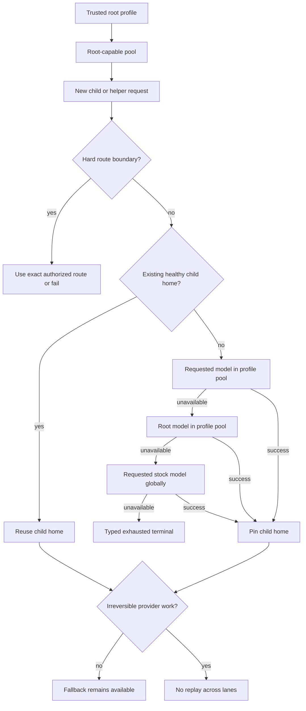

# Commit-Bound Capability Profile Descendant Routing - Plan

## Goal Capsule

- **Objective:** Claude Code helpers and descendant agents complete whenever a safe route exists, without sacrificing cache continuity, exact-route boundaries, server-tool at-most-once behavior, or truthful route provenance.
- **Means:** Use commit-bound routing: staged pre-dispatch fallback for capability-profile descendants, followed by a soft sticky home for each child lineage.
- **Product authority:** Preserve PR #285's ordinary-root model-integrity contract and the exact hosted-search capability contract in `docs/plans/2026-07-29-001-fix-provider-server-tool-capability-architecture-plan.md`.
- **Open blockers:** None. Planning may choose mechanisms for route-home storage, eligibility classification, and provenance projection without changing this Product Contract.

---

## Product Contract

### Summary

Capability profiles define a preferred root-capable account pool rather than a physical-model pin for every descendant.
Before a child's first dispatch, better-ccflare follows an availability ladder; after success, it keeps that child on a soft sticky home until the lane is unavailable.
Trusted internal helpers use exact proven capability routes, and every fallback or local terminal remains visible to operators without changing model prompts.

### Problem Frame

Two production failures exposed one missing distinction in route-profile semantics.
A Claude Code WebSearch side query carried authenticated session lineage but no child marker, so it lost the active Sol profile and reached a permanent capability-gap terminal.
Workflow agents explicitly pinned to Sonnet inherited the Sol profile, but the proxy applied the root physical-model constraint to the child mapping and rejected Sonnet-to-Terra before transport.

The failures stopped work without protecting an irreversible boundary.
The affected agents produced zero tokens and zero tool calls while Claude Code retried local rejections for roughly nine to eighteen minutes.
A six-agent diagnostic Workflow reproduced the same zero-work failure on every child.
At the same time, typed local terminals bypassed normal request persistence, leaving thousands of guard-level 503 observations without the profile/model reason needed for diagnosis.

### Actors

- A1. **Operator:** Selects a route profile and expects the session tree to complete without hidden provider or model changes.
- A2. **Root Claude Code session:** Establishes the preferred capability profile and its root-capable pool.
- A3. **Descendant agent:** Requests a logical model and owns an independent conversation/cache lineage.
- A4. **Trusted internal helper:** Performs a provider-owned operation such as WebSearch using authenticated caller and session lineage, even when Claude Code supplies no child marker.
- A5. **better-ccflare:** Enforces hard route boundaries, ranks pre-dispatch fallbacks, preserves child continuity, and records route provenance.

### Key Decisions

- **Capability profiles bind descendants to a root-capable pool, not one physical model.** (session-settled: user-directed — chosen over a physical Sol pin: explicit child model choices must remain meaningful inside the selected pool.) Governs R1, R5, R6.
- **Trusted helpers inherit an active compatible profile.** (session-settled: user-directed — chosen over a global-first helper lane: the operator-selected tree gets first authority.) Governs R10, R11.
- **Capability descendants use staged global fallback.** (session-settled: user-directed — chosen over profile-local failure: completion is preferred while safe routes remain.) Governs R5, R6, R8.
- **A child route is sticky until unavailable.** (session-settled: user-directed — chosen over per-turn reselection: cache and conversation continuity outweigh opportunistic route changes.) Governs R7-R9.
- **Routing becomes strict at the first irreversible boundary.** (session-settled: user-approved — chosen over a general global availability resolver: fallback is safe while candidates are hypothetical, not after provider work may have happened.) Governs R7, R12, R13.
- **Fallback visibility is out-of-prompt.** (session-settled: user-approved — chosen over silent fallback or injected warnings: operators need truthful provenance without polluting prompts and cache prefixes.) Governs R14-R17.

### Requirements

**Profile semantics and authority**

- R1. A capability profile's root logical model, expected provider, and expected physical model define the root-capable account pool used by its descendants.
- R2. An exact-account, force-routed, or bounded profile remains a hard route boundary and never gains descendant escape behavior from this work.
- R3. Ordinary stock-Claude root traffic without explicit route intent remains governed by PR #285's same-model integrity fence.
- R4. Profile inheritance requires the existing authenticated caller and session identity; client-supplied model, profile, helper, or child assertions alone cannot establish lineage.

**Descendant availability and continuity**

- R5. Before a capability-profile descendant's first dispatch, routing tries the requested logical model inside the root-capable pool, then the profile root model inside that pool, then the requested stock model through the ordinary global pool.
- R6. The global fallback rung preserves the requested stock model and cannot use an unrelated provider mapping merely because that account is available.
- R7. The first successful descendant lane becomes that child lineage's preferred home; the parent and sibling lineages choose independently.
- R8. A preferred home changes only when current route eligibility, capacity, or credential evidence says it cannot serve the request; priority edits and newly recovered preferred routes do not remap a healthy child.
- R9. After a genuine home failure, routing resumes at the nearest semantically equivalent candidate, continues through R5's ladder, and makes the first successful fallback the new home without snapping back during that child's lifetime.

**Trusted helpers and provider-owned tools**

- R10. A replay-authenticated same-session helper with an active capability profile is treated as a profile descendant even when Claude Code supplies no subagent marker or substitutes a helper model.
- R11. A trusted helper uses the active profile's exact proven server-tool route first; without an active profile it may use the global proven capability lane, while R2 profiles cannot escape their hard boundary.
- R12. Helper-model substitution is not an operator model choice and cannot prevent selection of the exact physical model required by the proven provider-owned capability.
- R13. Once a provider-owned server tool crosses its irreversible dispatch boundary, no model fallback, account failover, guard replay, or client retry authorization may execute that operation again for the inbound request.

**Failure and observability**

- R14. Every descendant/helper selection records requested logical model, active profile, selected provider and physical model, fallback rung, served route, and any re-pin reason using existing privacy-safe identity conventions.
- R15. Typed local server-tool, profile, and force-route terminals pass through the normal durable terminal-observability seam without exposing private account topology.
- R16. Responses expose requested, applied, and served model provenance plus fallback status through non-prompt metadata; no routing warning is injected into model-visible conversation content.
- R17. When R5 or R11 exhausts every authorized candidate before dispatch, the client receives one typed terminal that distinguishes permanent incompatibility from temporary unavailability and does not invite an unsafe retry.
- R18. Operators can distinguish profile-local success, root-model substitution, global escape, child re-pin, and exhausted fallback in aggregate and per-request diagnostics.

**Compatibility, migration, and proof**

- R19. Existing profile identifiers, discovery entries, caller headers, model mappings, and ordinary root behavior remain compatible; no current configuration surface is removed or narrowed.
- R20. Deployment requires no durable route-home backfill: process restart clears the current in-memory bindings, and each descendant establishes a home through the new rules on its next request.
- R21. Verification uses unit/integration tests with fake transports plus naturally initiated Claude Code traffic after a main-only deployment; no scripted request may target an Anthropic-backed or Codex subscription account.

### Routing Lifecycle

### Key Flows

- F1. **Capability-profile root admission**
  - **Trigger:** A2 selects a capability profile.
  - **Actors:** A1, A2, A5
  - **Steps:** Validate the explicit root route, establish the root-capable pool, and commit the session binding only after admission succeeds.
  - **Outcome:** Descendants can inherit pool authority without inheriting one physical model.
  - **Covers:** R1, R3, R4.

- F2. **New descendant chooses a home**
  - **Trigger:** A3 sends its first request with an explicit or default logical model.
  - **Actors:** A3, A5
  - **Steps:** Apply R5's ordered ladder before dispatch and record the first successful lane as this child's home.
  - **Outcome:** Work starts whenever a safe route exists, with one stable lane for later turns.
  - **Covers:** R5-R7, R14.

- F3. **Child home becomes unavailable**
  - **Trigger:** A5 has concrete evidence that the current home cannot serve the next request.
  - **Actors:** A3, A5
  - **Steps:** Preserve equivalent model/provider routes first, continue through the remaining ladder, and re-pin only after success.
  - **Outcome:** The child recovers without per-turn route churn or sibling remapping.
  - **Covers:** R8, R9, R16.

- F4. **Trusted WebSearch helper**
  - **Trigger:** A4 sends an exact server-tool declaration with valid authenticated replay lineage.
  - **Actors:** A2, A4, A5
  - **Steps:** Prefer the active profile's proven capability route, ignore the helper model as routing authority, and claim at-most-one dispatch.
  - **Outcome:** WebSearch works inside compatible profile sessions and never executes twice after dispatch.
  - **Covers:** R10-R13.

- F5. **No authorized route remains**
  - **Trigger:** Every pre-dispatch candidate allowed by the relevant hard boundary and fallback ladder is unavailable or incompatible.
  - **Actors:** A3 or A4, A5
  - **Steps:** Stop before provider I/O, record the complete local decision, and return one typed terminal.
  - **Outcome:** Failure is rare, bounded, truthful, and diagnosable.
  - **Covers:** R15-R18.

### Acceptance Examples

- AE1. **Covers R1, R5, R7.** Given a Sol capability profile whose root-capable Codex accounts map Sonnet to Terra, when a new child requests Sonnet, then Terra serves the request and becomes that child's home.
- AE2. **Covers R5, R7, R14.** Given no available Terra lane but an available Sol lane in the profile pool, when a Sonnet child starts, then Sol serves it and provenance records root-model substitution.
- AE3. **Covers R5, R6, R14.** Given the complete profile pool is unavailable but native global Sonnet is eligible, when the child starts, then native Sonnet serves it and provenance records global escape.
- AE4. **Covers R7-R9.** Given a child is homed on Terra and that lane remains eligible, when priorities change or Sol recovers, then later turns remain on Terra; when Terra becomes unavailable, the first successful fallback becomes the new home.
- AE5. **Covers R7-R9.** Given two sibling agents, when one falls back from Terra to Sol, then the parent's and sibling's homes do not change.
- AE6. **Covers R10-R13.** Given an active Sol capability profile and a same-session WebSearch helper with no child marker, when replay identity validates, then the helper uses the proven Sol hosted-search route regardless of its helper model.
- AE7. **Covers R11, R13.** Given no active profile, when a trusted WebSearch helper arrives, then it may use the global proven hosted-search lane; after dispatch, no other lane executes the search.
- AE8. **Covers R2, R11.** Given an exact-account or bounded profile whose route cannot execute WebSearch, when its helper arrives, then the helper fails inside that hard boundary and never escapes globally.
- AE9. **Covers R3.** Given an ordinary stock Opus root with no explicit profile, combo, force route, or agent preference, when a higher-priority mapped Codex account exists, then that account remains ineligible and the request is not silently rewritten.
- AE10. **Covers R15-R18.** Given any pre-dispatch profile/helper terminal or successful fallback, when an operator queries request diagnostics, then the typed reason and route provenance are present without private topology or prompt content.

### Success Criteria

- The reported same-session WebSearch request succeeds through one proven hosted-search dispatch under the Sol capability profile.
- Sonnet-pinned Workflow children no longer terminate with pre-dispatch `model_mapping_mismatch` when Terra, profile-root Sol, or native global Sonnet is safely available.
- A healthy child home does not change across turns because of priority edits, preferred-route recovery, or sibling fallback.
- Every fallback rung, child re-pin, and typed local terminal is queryable with requested/applied/served model provenance.
- Ordinary stock-Claude root regression coverage proves PR #285's same-model fence is unchanged.
- Exact-account, bounded-profile, and post-dispatch server-tool regressions prove availability fallback never weakens hard boundaries.

### Scope Boundaries

- The `1m` profile hint versus Sol's raw/effective context limit is a separate investigation and is not changed here.
- This work does not create a general per-profile policy language; semantics follow the existing capability, exact-account, force-route, and bounded profile classes.
- This work does not change Claude Code's UI labels, helper-model experiment, or client retry implementation; better-ccflare provides truthful provenance for surfaces that consume it.
- WebFetch and new provider-owned tool types remain outside scope.
- No version bump, generated worker change, or scripted subscription-account canary is included.

### Dependencies and Assumptions

- Claude Code continues to send stable authenticated caller identity and `x-claude-code-session-id` on helper requests that require private replay authority.
- Provider-owned capability proofs remain exact code-reviewed authority; availability fallback cannot manufacture support for an unproven tuple.
- Child conversations have stable lineage distinct from their parent and siblings.
- Existing routing evidence can classify whether a home remains eligible without treating priority movement as unavailability.

### Outstanding Questions

**Deferred to Planning**

- Which existing route eligibility and capacity reasons constitute genuine home unavailability for R8, and which remain ordering signals only?
- Which existing response headers, request records, routing attempts, and operator surfaces should project R14-R18 without duplicating provenance authority?
- How should the route-home lifecycle share or extend current session/profile binding and affinity mechanisms while retaining bounded memory and restart behavior?

### Sources and Research

- `docs/plans/2026-07-29-001-fix-provider-server-tool-capability-architecture-plan.md` — exact hosted-search admission, at-most-one dispatch, replay authority, and ordinary-path invariance.
- `packages/proxy/src/model-route-profiles.ts` — current profile classes and authenticated session binding.
- `packages/proxy/src/claude-code-request.ts` — current descendant classification signals.
- `packages/proxy/src/handlers/account-selector.ts` — capability-pool matching, ordinary model integrity, and profile constraints.
- `packages/proxy/src/handlers/proxy-operations.ts` — concrete physical-model revalidation and route-change continuity behavior.
- `packages/providers/src/providers/codex/server-tools.ts` — Sol-only hosted-search capability proof.
- `packages/proxy/src/server-tool-replay-runtime.ts` — authenticated request-private replay audience and lineage.
- PR #282 / commit `5d110c48` — permanent server-tool capability-gap terminal.
- PR #285 / commit `087c0809` — ordinary root model-integrity fence and exact physical route-profile enforcement.
