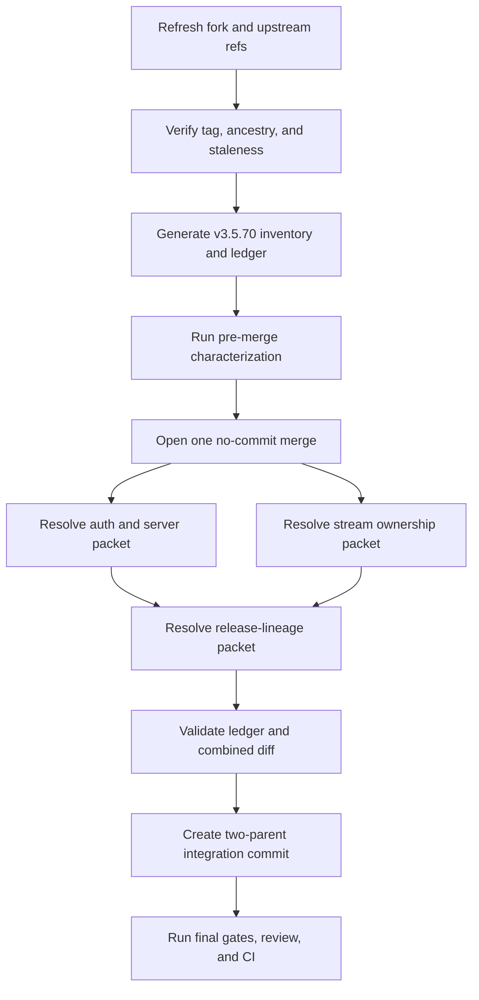
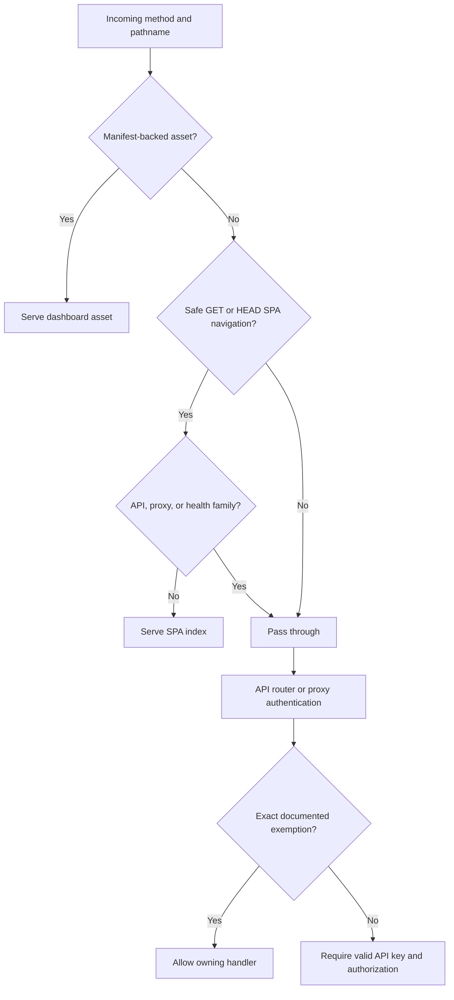
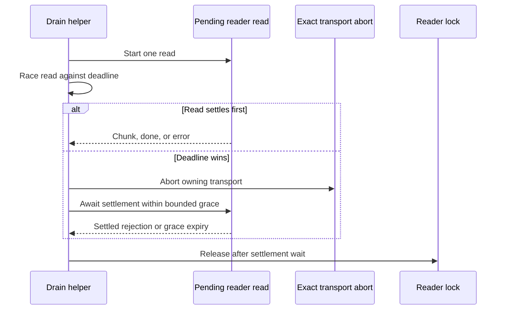

# Upstream v3.5.70 Product-Fork Synchronization - Plan

## Goal Capsule

- **Objective:** Operators receive all upstream v3.5.70 security, stream-lifecycle, and release-lineage behavior without losing the StartupBros fork's stricter authentication boundaries, routing behavior, provider behavior, or build provenance.
- **Means:** Integrate annotated tag `v3.5.70` as the exact second parent of one real merge, resolve overlap by behavior, and validate every upstream commit, conflict, and clean shared path through the existing upstream-sync inventory and ledger mechanism (KTD1-KTD5).
- **Authority:** Product Requirements govern behavior. Key Technical Decisions govern merge mechanics. `UPSTREAM.md` remains the standing fork contract.
- **Execution profile:** Four units. U1 freezes the current parents and pre-merge evidence. U2 and U3 are semantic packets inside one unresolved merge. U4 resolves release lineage, completes the ledger, finalizes topology, and obtains CI evidence.
- **Stop conditions:** Stop if the tag object or peeled commit changes, the prior v3.5.69 integration is absent from refreshed main, issue staleness invalidates an assumed resolution, a protected fork behavior cannot compose with upstream intent, or verification would require scripted traffic to an Anthropic-backed account.
- **Tail ownership:** The implementer owns a tested, reviewed, CI-green merge candidate. Production deployment, systemd mutation, production database work, and issue closure remain separate operator-owned actions.

---

## Product Contract

### Summary

Synchronize the complete source history of tombii/better-ccflare v3.5.70 into the StartupBros product fork. Preserve completed v3.5.67, v3.5.68, and v3.5.69 planning and resolution artifacts as immutable historical checkpoints. Record v3.5.70 as a new incremental checkpoint.

### Problem Frame

The prior integration merged upstream v3.5.69 commit `4d27cb226f383a39e12aea530e83d2f9896999ce` through merge commit `20c3e1930b701df5fdf923abbe3a4936bdacacc9`. Current fork main contains that integration through PR merge `2062a02a7b221233916d4badc8670e438660194f`.

At planning time, annotated tag object `e0fa06882167e0462041df141b4c8aad89342be2` peels to `09cf070533de989a255cb2fcbd49580d794ed6f0`, which is also `upstream/main`. The incremental range contains five commits and nine changed paths. A synthetic merge into fork commit `087c080998df6c11d3736e31c86a931186af490f` reports five content conflicts.

The upstream authentication fix overlaps fork commit `a96aca6412fa6ea570abb928402af45c235ca245`, which already closes the same OAuth and arbitrary-path bypasses with stricter exact-path behavior and an extracted `resolveDashboardRoute` seam. Upstream follow-up `8bb74ed0a3f16bcc276201f73430ee485e729559` still exposes a real drift: the current fork's dashboard classifier treats bare `/v1` differently from `AuthService`. The upstream stream-drain fix is not present and addresses a pending-read ownership race that also exists in the fork's sibling drain helper.

### Key Decisions

- **Create a new incremental v3.5.70 checkpoint.** (session-settled: user-directed — chosen over revising the v3.5.69 addendum: completed integration evidence must remain historically stable.) Governs R1-R3.
- **Merge the complete upstream source range.** Selective cherry-picks or version-only updates cannot prove that all upstream intent survives. Governs R1-R4.
- **Preserve stricter fork behavior when it subsumes upstream intent.** Upstream code is not preferred over current fork code merely because it is newer. Governs R4-R9.

### Requirements

**Source integrity and auditability**

- R1. The integration must use the exact annotated tag `refs/tags/v3.5.70`, tag object `e0fa06882167e0462041df141b4c8aad89342be2`, and peeled commit `09cf070533de989a255cb2fcbd49580d794ed6f0`, after refreshing and re-verifying them at execution time.
- R2. The completed v3.5.67 plan, v3.5.67 inventory and ledger, v3.5.68 addendum, and v3.5.69 addendum must remain unchanged.
- R3. A new v3.5.70 machine inventory and generated human ledger must account exactly once for every upstream-only commit, content conflict, clean two-sided shared path, and rerere application.
- R4. The final integration must be one real two-parent merge whose first parent is refreshed fork main and whose second parent is the exact peeled v3.5.70 target.

**Authentication and server routing**

- R5. Once API-key authentication is enabled, every OAuth setup, mutation, list, and durable job read must require normal admin authentication except exact read-only `GET /api/oauth/{qwen,codex}/status/:id` polling; initial setup with no configured keys must still work.
- R6. Dashboard SPA and manifest-backed assets may bypass authentication only when the dashboard is available and the request is a real asset or safe navigation; API, health, proxy, unknown non-navigation, and bare path-family roots must pass through to their owning authenticated handlers.
- R7. Server SPA classification and `AuthService` path-family classification must derive from one shared rule so `/api`, `/v1`, and `/messages` boundaries cannot drift again.
- R8. Existing exact session-account exemption, internal-probe secret, local-control secret, logs-stream token, cache-debug authentication, and API-key authorization behavior must remain unchanged.

**Stream ownership and memory safety**

- R9. A drain deadline that wins while `reader.read()` is pending must abort the exact owning transport, give the losing read a bounded chance to settle, and release the reader lock only after that settlement wait completes.
- R10. Both shared drain helpers must enforce R9 while retaining their existing differences in error propagation, best-effort behavior, pre-drain reconciliation, finite-drain completion, deadline bounds, clone isolation, and exact-response transport ownership.
- R11. No stream cleanup may abort a live sibling response, hang indefinitely on an unabortable source, emit an unhandled rejection from the losing read, or double-settle terminal usage.

**Release lineage and fork provenance**

- R12. Root and CLI manifests must report `3.5.70` as upstream release lineage without changing fork-only scripts, package surfaces, or distribution provenance.
- R13. `CLAUDE_CLI_VERSION` must adopt upstream value `2.1.250` while preserving build-time Git-SHA injection, runtime SHA lookup, client-version tracking, and current version fallbacks.
- R14. `CODEX_VERSION` must adopt upstream value `0.150.1` while preserving the fork's Codex endpoint, model catalog, request headers, prompt-cache behavior, routing, turn-state, orchestration, usage, and server-tool behavior.

**Verification and operational safety**

- R15. A fresh worktree must run `bun run build:cli` before Bun tests, run every affected test file in an isolated Bun process, sweep shared callers with binary-safe search, and pass lint, typecheck, format, diff, and CI gates.
- R16. Verification must use deterministic streams, local fixtures, and mocks only; no scripted request may reach an Anthropic-backed account.
- R17. The work must not deploy, restart services, mutate production data, create a release tag, bump beyond v3.5.70, or close issue #260.
- R18. The work must not read, search, edit, stage, or commit `apps/cli/README.md` or any prohibited inline-worker file.

### Acceptance Examples

- AE1. **Covers R1-R4.** Given refreshed fork main and the pinned tag, when the final merge is inspected, then its parents are exactly refreshed fork main followed by `09cf070533de989a255cb2fcbd49580d794ed6f0`, and the regenerated inventory has no missing, duplicate, unknown, or pending item.
- AE2. **Covers R5-R8.** Given API-key authentication is enabled, when a caller sends an unauthenticated OAuth mutation, list, durable job read, arbitrary path, or non-GET status request, then authentication fails; exact Qwen/Codex GET status polling and no-key bootstrap retain their intended behavior.
- AE3. **Covers R6-R8.** Given the dashboard is available, when requests target `/`, a real manifest asset, `/api`, `/api/...`, `/v1`, `/v1/...`, `/messages`, `/messages/...`, `/health`, or an unknown POST path, then only the real asset and safe SPA navigation are served before auth.
- AE4. **Covers R9-R11.** Given a pending read loses to a drain deadline, when the owning transport abort settles the read, then lock release occurs afterward; if the read never settles, bounded grace expires and cleanup still completes without an unhandled rejection.
- AE5. **Covers R9-R11.** Given a cloned discard body has no registered transport, when its drain deadline expires, then the selected live sibling remains un-aborted and readable.
- AE6. **Covers R12-R14.** Given the completed integration, when manifests and user-agent headers are inspected, then lineage reports `3.5.70`, Claude reports `2.1.250`, Codex reports `0.150.1`, and runtime Git SHA still identifies the fork build.

### Success Criteria

- All five upstream commits and all nine changed paths have a documented, tested disposition.
- Auth behavior is at least as strict as current fork main and fixes the bare path-family drift identified by upstream.
- Deadline cleanup proves abort → bounded pending-read settlement → lock release for both drain helpers.
- Root and CLI versions agree on `3.5.70`; Claude, Codex, and Git-SHA provenance remain truthful.
- Isolated affected suites, repository gates, final inventory validation, combined-diff review, focused independent review, and required CI all pass.
- Production remains unchanged.

### Scope Boundaries

- Do not reopen the completed v3.5.67-v3.5.69 integration artifacts or regenerate their historical inventories.
- Do not redesign authentication roles, OAuth APIs, dashboard visibility, stream architecture, provider routing, model mappings, or deployment provenance beyond what the v3.5.70 composition requires.
- Do not use a package-only update, rebase, squash, cherry-pick replay, tree replacement, blanket `ours`, or blanket `theirs` as a substitute for the source merge.

### Deferred to Follow-Up Work

- Production deployment and runtime health verification after the integration is merged and separately authorized.
- General auth-path normalization for percent-encoded or dot-segment paths if current URL parsing tests reveal a distinct vulnerability outside the v3.5.70 path-family mismatch.
- Any later upstream release after v3.5.70.

### Sources / Research

- `UPSTREAM.md` — protected fork contracts and release synchronization protocol.
- `docs/plans/2026-08-24-1701-chore-upstream-v3-5-67-sync-plan.md` — original complete product-fork synchronization contract.
- `docs/plans/2026-08-25-issue-260-v3.5.68-incremental-addendum.md` and `docs/plans/2026-08-26-issue-260-v3.5.69-incremental-addendum.md` — incremental checkpoint pattern.
- `scripts/verify-upstream-sync-ledger.ts` and `scripts/__tests__/verify-upstream-sync-ledger.test.ts` — generic bidirectional commit/conflict/shared-path inventory validation.
- Fork commits `a96aca6412fa6ea570abb928402af45c235ca245` and `041fcda3b3f121b616729ab923065b5571a1da2c` — current authentication behavior that subsumes and tightens upstream's bypass fix.
- Upstream commits `f3a5c498ca1b557708b4a7242cb78231f1aaad12`, `8bb74ed0a3f16bcc276201f73430ee485e729559`, `a6b84e4b575b0cb62693926820fab562625d7588`, `1e343ddd8e60d1bef743d0a008ba1d5050ccb963`, and `09cf070533de989a255cb2fcbd49580d794ed6f0` — complete v3.5.70 intent.
- `docs/solutions/workflow-issues/typecheck-does-not-cover-test-call-sites.md` — isolated test and binary-safe caller-sweep requirement.

---

## Planning Contract

### Key Technical Decisions

- KTD1. **Rebaseline before opening the merge.** Refresh both remotes, rerun issue-staleness history from 2026-08-26 over the nine permitted paths, verify the v3.5.69 integration ancestry, and regenerate all counts and conflict classes. New overlapping main work pauses implementation for the repository-required operator confirmation. Governs R1-R4, R15.
- KTD2. **Reuse the generic inventory and ledger validator.** Generate new v3.5.70 artifacts from `scripts/verify-upstream-sync-ledger.ts`; do not edit historical artifacts or create a second audit mechanism. Governs R2-R4.
- KTD3. **Resolve auth overlap through one path-family classifier.** Preserve the fork's exact OAuth and special-exemption policy, retain `resolveDashboardRoute` as the server seam, and move only the common `/api`, `/v1`, `/messages`, and health classification into one pure rule consumed by both server routing and `AuthService`. Governs R5-R8.
- KTD4. **Apply the stream fix at the shared root cause.** Track each outstanding read promise, abort the exact transport on deadline, await that promise against bounded settlement grace, observe its rejection, and release the lock in final cleanup. Apply this to both `drainReader` and `drainReaderWithDeadline`, not only the upstream-touched helper. Governs R9-R11.
- KTD5. **Treat version hunks as lineage, not tree ownership.** Update only the four upstream-owned version constants while retaining current first-parent code around them, especially Git-SHA provenance in core and the fork's Codex provider implementation. Governs R12-R14.
- KTD6. **Resolve by semantic packet within one open merge.** U2-U4 update inventory dispositions and focused evidence while the merge remains unresolved. Final acceptance requires combined-diff review against both parents and a complete final ledger. Governs R3-R4, R15.

### High-Level Technical Design

#### Integration lifecycle

#### Request path ownership

#### Deadline drain ownership

### Assumptions

- Execution starts from a refreshed fork parent, not the planning snapshot `087c080998df6c11d3736e31c86a931186af490f`.
- The planning-time incremental facts are five commits, nine paths, five content conflicts, three clean two-sided shared paths, and one upstream-only added test path; U1 regenerates the authoritative set rather than trusting these counts.
- The v3.5.70 range does not touch Qwen provider or streaming-transform sources, so no qwen-code comparison is triggered unless refreshed evidence changes the path set.
- External adversarial research was attempted twice but returned no usable report because the first fleet failed at model routing and the resumed retry was stopped at session boundaries. All load-bearing claims in this plan come from local Git objects, current source, tests, and repository contracts.

### Implementation Constraints

- Never read, search, edit, stage, or commit the prohibited inline-worker files or `apps/cli/README.md`.
- Run `bun run build:cli` before the first Bun test in a fresh worktree. Stage explicit files only.
- Run affected test files one process at a time. Root typecheck excludes tests.
- Use binary-safe caller searches over explicit permitted paths after changing a shared classifier or drain contract.
- Do not push partial conflict resolutions. Push the complete candidate once to avoid wasting shared CI capacity.
- Do not send live provider traffic. This plan requires no live canary.

### System-Wide Impact

- **Security:** Authentication changes affect every dashboard, API, OAuth, and proxy request path. Existing narrow exemptions are compatibility surfaces and must be regression-tested.
- **Memory and transport lifecycle:** The drain helper is shared by Anthropic recovery, Codex, discarded retry bodies, and proxy cleanup. Lock ordering changes can prevent native-buffer growth but can also extend cleanup latency if the grace bound is wrong.
- **Client identity:** Claude and Codex version constants alter upstream user-agent and model-catalog requests. Fork runtime identity remains the embedded Git SHA, not package version alone.
- **Operations:** The merge changes source lineage only. Deployment remains disconnected from merge completion.

### Risks and Mitigations

- **Clean textual merges can still lose fork behavior.** Inventory every clean shared path and compare the final tree against both parents.
- **Auth prefix consolidation can widen exemptions.** Share only path-family classification; keep method-aware and exact-route exemptions owned by `AuthService`.
- **Pending reads can reject after the helper returns.** Attach rejection observation before the settlement race and test for absence of unhandled rejections.
- **Settlement grace can double cleanup latency.** Keep grace bounded, deterministic in tests, and no larger than the established drain budget unless evidence justifies a tighter cap.
- **Version conflict resolution can erase Git-SHA provenance or Codex features.** Apply scalar constant changes inside current first-parent files rather than selecting a whole side.

### Sequencing

U1 is the gate for all later work. U2 opens the exact merge after characterization passes. U2 and U3 may be resolved as separate semantic packets while the merge is open. U4 depends on both packets, accepts release lineage, completes every ledger row, finalizes the merge commit, and runs the all-up verification.

---

## Implementation Units

### U1. Refresh immutable inputs and generate the v3.5.70 audit packet

- **Goal:** Establish the only valid fork parent, upstream parent, expected item set, and pre-merge behavioral baseline.
- **Requirements:** R1-R4, R15-R18.
- **Dependencies:** none.
- **Files:**
  - `docs/plans/2026-08-30-issue-260-v3.5.70-resolution-inventory.json` (new)
  - `docs/plans/2026-08-30-issue-260-v3.5.70-resolution-ledger.md` (new)
  - `scripts/verify-upstream-sync-ledger.ts`
  - `scripts/__tests__/verify-upstream-sync-ledger.test.ts`
  - `__tests__/api-auth.test.ts`
  - `apps/server/src/server.test.ts`
  - `packages/http-api/src/services/__tests__/auth-service-session-account-exemption.test.ts`
  - `packages/http-api/src/services/__tests__/auth-service-internal-probe.test.ts`
  - `packages/providers/src/utils/__tests__/stream-drain.test.ts`
- **Approach:**
  1. Refresh refs and verify R1 plus the prior v3.5.69 integration chain `20c3e193...` → `4d27cb22...` is contained by refreshed main.
  2. Run the issue-staleness history required by KTD1. If relevant post-plan commits exist, obtain confirmation that issue #260 still applies before source changes.
  3. Generate the new inventory and ledger through KTD2 using refreshed full SHAs.
  4. Record dispositions for all five commits: auth hardening, path-prefix follow-up, PR merge topology, stream-drain race fix, and release bump.
  5. Run existing auth, server-route, and drain characterization tests before opening the merge.
- **Execution note:** Establish and record the passing first-parent behavior before any conflict resolution.
- **Patterns to follow:** The v3.5.67 inventory schema and generated ledger; the v3.5.68-v3.5.69 incremental addenda; current isolated-test policy.
- **Test scenarios:**
  - Covers AE1. The generated packet records refreshed fork parent, required prior integration ancestor, exact tag, peeled target, merge base, raw and patch-equivalent counts, versions, conflicts, clean shared paths, and Qwen trigger.
  - The validator rejects a missing commit, conflict, shared path, rerere item, duplicate ID, stale ledger record, unrecognized disposition, or dangling evidence reference.
  - Pre-merge auth tests prove the current exact OAuth, session-account, internal-probe, local-control, and arbitrary-path policies.
  - Pre-merge server tests prove the current protected cases; source inspection records bare `/v1` as the failing test-first case U2 must add before changing classification.
  - Pre-merge drain tests prove exact transport ownership, finite drain completion, and live-sibling isolation before U3 changes lock ordering.
- **Verification:** The refreshed packet validates against Git, characterization evidence is attached to the ledger, and no source merge has started until the staleness gate is clear.

### U2. Compose authentication and dashboard path ownership

- **Goal:** Retain the fork's stricter auth policy while adopting upstream's no-drift path-family fix.
- **Requirements:** R4-R8, R15-R18.
- **Dependencies:** U1.
- **Files:**
  - `__tests__/api-auth.test.ts`
  - `apps/server/src/server.ts`
  - `apps/server/src/server.test.ts`
  - `packages/http-api/src/index.ts`
  - `packages/http-api/src/services/auth-service.ts`
  - `packages/http-api/src/services/auth-paths.ts` (new shared pure classifier; final name may follow local convention)
  - `packages/http-api/src/services/__tests__/auth-service-static-exemption-bypass.test.ts` (upstream-added)
  - `packages/http-api/src/services/__tests__/auth-service-session-account-exemption.test.ts`
  - `packages/http-api/src/services/__tests__/auth-service-internal-probe.test.ts`
  - `packages/http-api/src/services/__tests__/auth-service-logs-stream-token.test.ts`
  - `packages/http-api/src/services/__tests__/cache-debug-auth.test.ts`
- **Approach:**
  1. Open one no-commit merge of the exact target and capture conflicts or rerere applications before editing.
  2. Resolve the auth and server conflicts under KTD3. Preserve exact OAuth status matching and all fork-only exemptions.
  3. Make the shared classifier describe path families only. Do not move authentication decisions or method-aware exemptions into the server.
  4. Retain the upstream-added focused regression test, adapting any expectation that is weaker than R5.
  5. Mark `f3a5c498...` as semantically remapped to the stricter fork policy and `8bb74ed0...` as semantically remapped through the shared classifier.
- **Execution note:** Add the bare-root and prefix-boundary cases before changing the classifier, then resolve source until every security case passes.
- **Patterns to follow:** `resolveDashboardRoute` as a pure server seam; `isSessionAccountPath` exact-shape matching; secret-gated internal and local control exemptions.
- **Test scenarios:**
  - Covers AE2. OAuth mutation, init, reauth, callback, list, and durable job reads fail without an API key when auth is enabled; no-key bootstrap succeeds.
  - Covers AE2. Exact GET Qwen/Codex status polling is exempt; POST, DELETE, extra-segment, missing-ID, other-provider, and prefix-lookalike paths are not.
  - Covers AE3. `/api`, `/api/...`, `/v1`, `/v1/...`, `/messages`, `/messages/...`, and `/health` pass through for GET and HEAD instead of rendering the SPA.
  - Covers AE3. `/`, dashboard routes, and manifest-backed assets retain intended rendering; unknown POST/PUT/DELETE paths pass through to authentication.
  - Session-account exemption remains exact and GET-only, including encoded valid IDs and encoded-slash rejection.
  - Correct internal-probe and local-control secrets retain only their allowlisted routes; missing or wrong secrets fail closed.
  - Logs SSE accepts its single-use stream token without widening any other route.
- **Verification:** The auth/server packet passes in isolated files, classifier callers are enumerated with binary-safe search, and the ledger records the resolved conflict and commit dispositions.

### U3. Enforce pending-read settlement before lock release

- **Goal:** Adopt upstream's native-buffer safety fix across the complete shared drain abstraction without weakening transport ownership.
- **Requirements:** R4, R9-R11, R15-R18.
- **Dependencies:** U1; may proceed after the merge is open in U2.
- **Files:**
  - `packages/providers/src/utils/stream-drain.ts`
  - `packages/providers/src/utils/__tests__/stream-drain.test.ts`
  - `packages/providers/src/providers/codex/provider-stream-abandonment.test.ts`
  - `packages/providers/src/providers/codex/provider.test.ts`
  - `packages/proxy/src/__tests__/anthropic-terminal-recovery.test.ts`
  - `packages/proxy/src/__tests__/stream-reader-lock-release-382.test.ts`
  - `packages/proxy/src/__tests__/response-handler-anthropic-terminal-recovery.test.ts`
  - `packages/proxy/src/handlers/__tests__/proxy-operations-529-retry-clone-regression.test.ts`
- **Approach:**
  1. Resolve the clean shared `stream-drain.ts` hunk under KTD4 rather than accepting it without review.
  2. Preserve the current response-to-transport WeakMap and same-body ownership transfer rules.
  3. Make each helper retain and observe the pending read promise before a deadline can win.
  4. Preserve `beforeDrain` behavior and `swallowErrors` ownership in `drainReaderWithDeadline`; preserve best-effort swallowing in `drainReader`.
  5. Mark `1e343ddd...` as semantically remapped because its fix is retained and extended to the sibling helper with the same defect shape.
- **Execution note:** Use deterministic Web Stream tests with explicit event ordering. Do not use live fetches or provider traffic.
- **Patterns to follow:** Existing exact transport registration and clone-isolation tests; Anthropic terminal recovery and Codex stream-abandonment tests.
- **Test scenarios:**
  - Covers AE4. A deadline aborts the exact transport before lock release; a read that rejects from abort is observed and settles first.
  - Covers AE4. A source that ignores abort exits after bounded grace and releases its lock without hanging.
  - A read rejection in propagating mode reaches the caller; `swallowErrors` and best-effort mode retain current non-throwing behavior.
  - `beforeDrain` deadline wins without touching the reader, aborts the transport, and releases only the lock state the helper owns.
  - Finite reads drain to done without abort and release the lock once.
  - Covers AE5. Clone cleanup cannot abort or consume the live sibling response.
  - Anthropic recovery cancellation, Codex abandonment, retry-clone cleanup, and response-handler terminal recovery remain single-owner and exactly-once.
  - No process-level `unhandledrejection` is emitted after the helper returns.
- **Verification:** Both drain helpers prove R9 ordering, all direct and integration tests pass in isolation, and the ledger includes focused and acceptance-complete stream evidence.

### U4. Accept release lineage and finalize the integration

- **Goal:** Complete truthful v3.5.70 lineage, validate all parent deltas, and produce a merge-ready candidate without production effects.
- **Requirements:** R1-R4, R12-R18.
- **Dependencies:** U2, U3.
- **Files:**
  - `package.json`
  - `apps/cli/package.json`
  - `packages/core/src/version.ts`
  - `packages/core/src/version.test.ts`
  - `packages/providers/src/providers/codex/provider.ts`
  - `packages/providers/src/providers/codex/provider.test.ts`
  - `docs/plans/2026-08-30-issue-260-v3.5.70-resolution-inventory.json`
  - `docs/plans/2026-08-30-issue-260-v3.5.70-resolution-ledger.md`
- **Approach:**
  1. Apply the scalar lineage values under KTD5. Preserve all surrounding first-parent code and tests.
  2. Treat `a6b84e4b...` as retained merge topology and `09cf0705...` as retained lineage with semantically resolved file conflicts.
  3. Complete every inventory item with upstream intent, protected behavior, selected resolution, focused evidence, acceptance evidence, combined-diff evidence where applicable, and reviewer disposition.
  4. Compare the final tree and combined diff against both parents. Explain every target-side change not visible in the first-parent diff and every retained fork-side difference on the nine paths.
  5. Finalize one integration commit and verify exact parent order before any later fix commit.
  6. Run all affected suites, static gates, final inventory validation, focused independent review, and required CI on one pushed candidate.
- **Execution note:** Resolve version constants last so green package lineage cannot hide incomplete auth or stream evidence.
- **Patterns to follow:** Build-time Git-SHA tests, Codex header tests, previous topology-preserving integration commits, and final-phase ledger validation.
- **Test scenarios:**
  - Covers AE6. Root and CLI manifests equal `3.5.70` and preserve fork scripts and package metadata.
  - Covers AE6. Claude fallback/user-agent value equals `2.1.250`; compiled and environment Git-SHA behavior remains unchanged.
  - Covers AE6. Codex model-list URLs, `Version`, and `User-Agent` use `0.150.1`; prompt-cache, routing, turn-state, usage, orchestration, and server-tool suites retain current behavior.
  - Covers AE1. Final merge has exactly the refreshed fork parent and target parent in that order.
  - Final inventory validation observes the authoritative rerere capture and rejects any pending item or missing combined-diff evidence.
  - The final diff contains only intended source, tests, and new v3.5.70 evidence; no excluded, generated, historical-plan, or unrelated path is present.
  - Verification logs contain no scripted Anthropic-backed request, deployment action, production mutation, or issue closure.
- **Verification:** The candidate is CI-green and independently reviewed; topology, lineage, inventory, ledger, auth, and stream contracts all pass; production remains unchanged.

---

## Verification Contract

### Baseline and audit gates

| Gate | Evidence | Applies to |
|---|---|---|
| Tag identity | Annotated object and peeled commit match R1 | U1 |
| Prior integration | Refreshed first parent contains merge `20c3e193...` and upstream parent `4d27cb22...` | U1 |
| Issue staleness | Relevant post-2026-08-26 commits are reviewed and operator confirmation is recorded when required | U1 |
| Inventory derivation | Generic validator regenerates commits, conflicts, clean shared paths, versions, and Qwen trigger | U1, U4 |
| Rerere capture | Final inventory exactly matches the authoritative capture | U2-U4 |
| Parent topology | Final merge parent order matches R4 | U4 |
| Parent-delta review | Combined diff and both parent comparisons account for every one of the nine target paths | U4 |

### Isolated affected suites

Run each test file in its own Bun process after `bun run build:cli`.

| Area | Required files | Applies to |
|---|---|---|
| Inventory validator | `scripts/__tests__/verify-upstream-sync-ledger.test.ts` | U1, U4 |
| Authentication integration | `__tests__/api-auth.test.ts` | U1, U2 |
| Server path routing | `apps/server/src/server.test.ts` | U1, U2 |
| Auth service | Upstream-added bypass test plus session-account, internal-probe, logs-token, cache-debug, and core auth-service suites | U2 |
| Drain helper | `packages/providers/src/utils/__tests__/stream-drain.test.ts` | U1, U3 |
| Codex drain and identity | `provider-stream-abandonment.test.ts` and affected `provider.test.ts` cases | U3, U4 |
| Proxy stream ownership | Anthropic recovery, reader-lock release, response-handler recovery, and retry-clone regression files listed in U3 | U3 |
| Core version provenance | `packages/core/src/version.test.ts` | U4 |

### Static and final gates

| Gate | Required outcome |
|---|---|
| Shared caller sweep | Binary-safe search enumerates every path classifier, drain-helper, `CLAUDE_CLI_VERSION`, and `CODEX_VERSION` caller, including tests excluded from typecheck |
| Lint | `bun run lint` passes with no unintended rewrite |
| Types | `bun run typecheck` passes |
| Format | `bun run format` passes; formatter diff is reviewed; changed tests are rerun in isolation |
| Diff hygiene | `git diff --check` and explicit status contain no prohibited, generated, historical, secret, or unrelated path |
| Final ledger | Generic validator passes in final phase with complete evidence and authoritative rerere capture |
| Review | Focused independent review accepts auth boundaries, stream ordering, version provenance, and parent deltas |
| CI | Required checks pass on the final candidate SHA with no superseding push in flight |
| Operational boundary | No deploy, systemd change, production data operation, live provider canary, tag creation, or issue closure occurs |

---

## Definition of Done

### Global

- Every R1-R18 requirement is satisfied and every AE1-AE6 example is covered by passing evidence.
- Exact upstream target `09cf070533de989a255cb2fcbd49580d794ed6f0` is the second parent of a real two-parent integration commit.
- All five upstream commits, five predicted conflicts, clean two-sided shared paths, and rerere applications have exact-one final dispositions in the v3.5.70 inventory and ledger.
- The final tree retains the stricter fork auth model, shared path-family classification, corrected pending-read cleanup, v3.5.70 lineage, Git-SHA provenance, and all unrelated fork behavior.
- All isolated affected suites, lint, typecheck, format, diff checks, focused review, and required CI pass.
- No excluded file, historical checkpoint, unrelated work, secret, production data, live Anthropic traffic, deployment effect, release tag, or issue closure enters the work.
- Abandoned resolutions, temporary fixtures, stale rerere output, and experimental code are absent from the final diff.

### Per unit

- U1: Refreshed immutable inputs and the generated v3.5.70 audit packet validate; staleness and characterization gates are clear.
- U2: Auth and server routing compose upstream intent with stricter fork policy, including bare path-family roots and every existing narrow exemption.
- U3: Both shared drain helpers prove abort → bounded pending-read settlement → lock release without wrong-owner abort, hang, or unhandled rejection.
- U4: Version constants, exact parent topology, final inventory/ledger, combined diff, isolated tests, static gates, independent review, and CI are complete; production remains unchanged.
