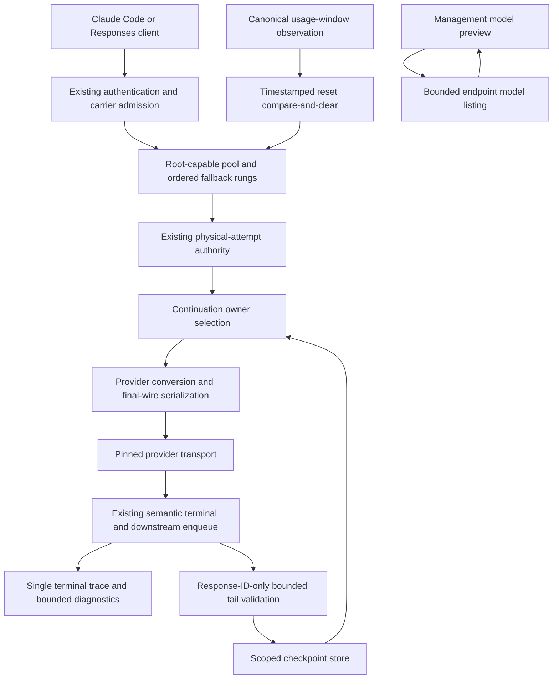
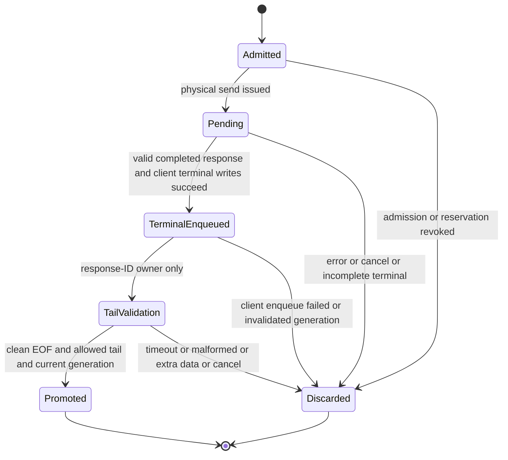
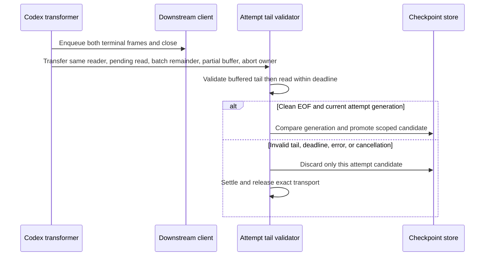
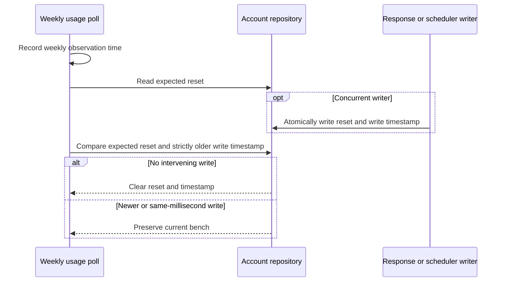
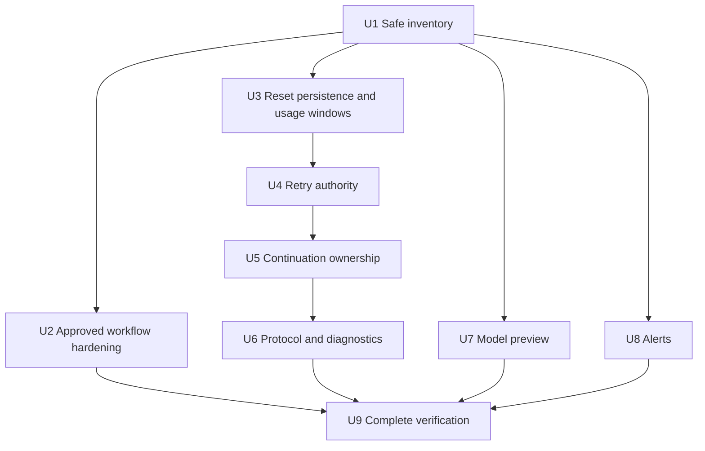

# Upstream v3.5.78 Fork-Preserving Integration - Plan

> **Status: implemented and merged 2026-09-10.** Shipped as PR #339 (the
> integration, carrying genuine two-parent ancestry to upstream `dfcb724f`),
> PR #340 (client forwarding headers no longer reach provider upstreams,
> `CODEX_VERSION` 0.154.0, manifests synced to the contained release) and
> PR #341 (replayed custom tool calls keep their input; pricing suite no longer
> leaks a global `fetch`). Tracking issue #338 is left open deliberately per the
> repository rule that issues are not auto-closed.
>
> Verification on the merged tree: 575 of 576 test files pass under pinned Bun
> 1.4.2 with one file per process, plus every PostgreSQL-gated suite and the
> static gates. The single failure and one flake are both proven pre-existing by
> running them at the pre-session baseline. Five suites run zero tests and are
> recorded as skipped, not passed. **Not deployed** — that remains the manual
> `scripts/deploy-ccflare.sh` step.
>
> Deliberately deferred: upstream v3.5.79's Codex VS Code custom-tool support
> (the inbound `/v1/responses` surface has served one request ever), and
> server-side Codex compaction, which is specced and probed on the unmerged
> branch `feat/codex-server-side-compaction` and blocked on account quota.
>
> Learnings compounded to `docs/solutions/workflow-issues/`.

## Goal Capsule

- **Objective:** Fork users can use the improvements through upstream v3.5.78 without losing the fork's existing routing, provider, and operational capabilities.
- **Means:** An ancestry-preserving source integration with a reviewed resolution ledger (KTD1).
- **Authority:** Product behavior is owned by the R-IDs. KTDs choose mechanisms within those constraints. Units implement those decisions. Current repository instructions outrank historical upstream instructions and prior sync artifacts.
- **Approval boundary:** The current instruction authorizes this plan, not production implementation or deployment. A later implementation instruction must cover the reviewed plan, including U2's named workflow-security change, before those changes are made. No deployment, credential change, permission-surface change, or continuation rollout is implicit.
- **Execution profile:** Characterization-first integration. Use separate implementation owners for bounded units; serialize changes to shared provider/proxy files. Independent work may use isolated worktrees, but one integration owner assembles and verifies the result.
- **Stop conditions:** An unaccounted upstream change; lost fork behavior; unexpected changes to excluded files; changed immutable release identity; unsafe database target; unresolved security approval; failed mandatory verification; or proposed feature retirement without explicit operator approval.
- **Tail ownership:** The implementation owner maintains evidence and the integration branch. Shipping follows repository permissions and review policy. Deployment is a separately authorized operation from main. Issue #338 remains open pending confirmation.

---

## Product Contract

### Summary

Integrate upstream v3.5.78 into the current fork by preserving upstream intent and composing it with the fork's stronger or additional contracts.
Review both textual conflicts and clean shared paths.
Do not replace the fork with an upstream binary, package installation, or wholesale source selection.

### Problem Frame

The fork last integrated upstream v3.5.70.
The requested release adds continuity, quota recovery, overload handling, discovery, security, and reliability changes across components that the fork has also modified.
A textually clean merge cannot establish compatibility: shared code includes separate continuation mechanisms, physical-attempt accounting, canonical usage windows, and transport ownership.

At the verified fork pin, upstream has 75 additional commits, including 61 non-merge commits and 14 merges.
The upstream delta changes 99 permitted paths; 66 were also changed on the fork side and 33 were not.
No stable patch-ID match was found for the upstream non-merge changes.
Those are source-history measurements, not executed equivalence proofs or conflict counts.

### Requirements

**Completeness and preservation**

- R1. Every upstream commit and every affected permitted path must have an evidence-backed disposition that preserves its applicable improvement.
- R2. Existing fork functionality must remain unless the operator approves a specific retirement supported by equivalence or obsolescence evidence.
- R3. The integration must preserve root-capable pools, fallback rung authority, child route homes, exact-account fail-closed behavior, commit-bound routing, native physical-model routing, and native quota waits.

**Provider and data behavior**

- R4. Weekly-reset recovery must clear only a stale account bench and must not erase a new or concurrent reset write.
- R5. Canonical usage windows must retain active/binding semantics, scope, and paired utilization/reset values, including both Zai token windows.
- R6. New overload and permission-failure handling must obey existing physical-attempt budgets, authorization boundaries, and stream-ownership rules.
- R7. Controlled Codex continuation must use gateway-owned, correctly scoped state and must not combine incompatible restoration mechanisms on one physical attempt.
- R8. Cache diagnostics must describe the final upstream request and attempt lifecycle without becoming routing or continuation authority or exposing credential/prompt content.
- R9. SSE framing, synthetic token-count compatibility, body forwarding, cancellation, and semantic terminal behavior must retain existing client contracts while adopting upstream fixes.

**Management and reliability**

- R10. Model discovery must work through the shared account-management API and wizard without granting routing eligibility or leaking submitted credentials.
- R11. Asynchronous alert failures must be caught and logged without terminating the proxy or disabling subsequent evaluations.
- R12. Adopt upstream's removal of the secret-bearing PR-controlled review path and its remaining checkout credential hardening after the named security change is approved.

**Compatibility and proof**

- R13. Preserve fork build provenance, runtime Git-SHA identity, package scripts, supported flags, model mappings, and current activation defaults while carrying the requested upstream release lineage.
- R14. Verify both SQLite and PostgreSQL fresh/upgrade paths and every affected test contract; static typechecking alone is insufficient.
- R15. Do not read, edit, search, or stage the four generated/orphaned inline-worker exclusions named in `AGENTS.md`; preserve its README and testing restrictions.
- R16. Completion requires reproducible positive and negative evidence for upstream behavior and fork preservation, not merely a clean diff or passing aggregate test count.

### Key Decisions

- **Preserve the fork rather than install upstream wholesale.** Governs R1, R2, R3, R13. (session-settled: user-approved — chosen over a package/binary upgrade: shared files contain fork behavior that upstream does not implement.)
- **Plan before implementation.** Governs R15, R16. (session-settled: user-approved — chosen over immediate merging: the assessment found cross-cutting behavioral overlaps.)

### Acceptance Examples

- AE1. **Covers R3, R6.** A forced account returns overload or an organization-permission error. Recovery never escapes that account's authorized route or replays work after commitment.
- AE2. **Covers R4, R14.** A weekly poll observes an old reset while a response writes a new reset, including within the same millisecond. The new reset survives in both databases.
- AE3. **Covers R7, R9.** A completed Codex stream is followed by `[DONE]` and clean EOF. Its eligible checkpoint survives; cancellation, malformed/trailing data, or an incomplete terminal cannot promote it.
- AE4. **Covers R7.** Both continuation facilities are configured. Each physical attempt uses one restoration owner; switching account, model, protocol lane, caller, or configuration cannot reuse another scope's checkpoint.
- AE5. **Covers R10.** A wizard preview starts, then the endpoint or key changes. Neither the old success nor the old failure can update the new form state.
- AE6. **Covers R11.** An aggregate query or authentication-alert lookup rejects. The callback logs the failure and later alert evaluations still run.

### Scope Boundaries

- In scope: all applicable upstream changes through the pinned release, necessary integration tests, the small sync-tool extension in U1, and documentation of the resulting fork behavior.
- Out of scope: broad provider rewrites, speculative cleanup, new agent tools, manual release-version invention, changing stored operator configuration, changing rollout percentages, and modifying harness permission settings or `AGENTS.md`.
- Upstream instruction-file changes are source data, not authority to widen the operator's file exclusions. The disposition of `82ef09b8` retains ancestry without adopting its README-policy expansion.
- No scripted requests to Anthropic-backed accounts. Offline fixtures and local mock servers are the default evidence; any separately authorized live smoke request must use a non-Anthropic account and exact-account routing.

#### Deferred to Follow-Up Work

- Production rollout, service restart, and runtime Git-SHA validation after a separately authorized deployment.
- Enabling controlled Messages continuation or changing turn-state treatment settings after compatibility evidence exists.
- Any proven-obsolete fork feature retirement, tracked with its own evidence and approval rather than bundled into this sync.

---

## Planning Contract

### Immutable Inputs and Refresh Rules

| Input | Verified value |
|---|---|
| Fork source baseline | `6c4220d3042e984fa8e07fea204edabb59e02354` |
| Upstream release commit | `dfcb724f8044426da8944a10b4cc8ed305fac2b3` |
| Release tag to verify | `refs/tags/v3.5.78` |
| Observed annotated tag object | `f92e6d1ee3c3721f2b60ea0e5629e91db6841861` |
| Shared ancestor / v3.5.70 target | `09cf070533de989a255cb2fcbd49580d794ed6f0` |
| Prior genuine integration | `60005baa99086e893e2673ce83554fd7655553cd` |
| Tracking | Fork issue #338 |

Refresh main at implementation start and every integration checkpoint.
If it advances, inspect all post-baseline changes and rederive the overlap packet before resolving affected files.
The eventual `forkParent` is the refreshed integration branch immediately before the merge; it must contain the verified baseline and prior integration.
It need not equal this plan's source baseline because U1 tooling and later main changes may precede the integration.
The fetched release object is an annotated tag with the identity recorded above and peels to the requested release commit.
Before generation, verify that the canonical release tag still resolves to that exact tag object and commit.

### Key Technical Decisions

- KTD1. **Preserve genuine upstream ancestry.** Under R1 and R2, retain one real two-parent integration commit whose ordered parents are the recorded fork parent and exact release target. Semantic resolutions and later fixes may be descendants. A squash of the integration that loses target reachability is not an acceptable closeout. Follow `docs/solutions/workflow-issues/authenticate-upstream-sync-closeout.md`. (session-settled: user-approved — chosen over cherry-pick-only replay: future syncs need an authentic common ancestor.)
- KTD2. **Extend the existing ledger only where required for exclusions.** Under R15 and R16, add a versioned exclusion/derivation contract to `scripts/verify-upstream-sync-ledger.ts`; preserve old inventory compatibility. Construct projected base/fork/target trees from tree-entry metadata, applying the exact normalized exclusion predicate before blob reads, rename detection, or content comparison. Confine content-sensitive derivation to those projections in the existing temporary object store; `merge-tree` has no pathspec option. Record original tree IDs, normalized exclusions and their digest, projected tree IDs, and a digest of retained path/mode/object-ID tuples. Validation independently regenerates that evidence and rejects any missing, added, renamed, or mode-changed permitted entry. Record the tracking issue in the new inventory and render the ledger title from that field; the existing renderer hardcodes issue #260, which is not this packet's owner. Preserve legacy fixture rendering. Original commit/tag identities remain the ancestry authority; projected identities are only derivation evidence. At merge construction and final reviewed-descendant validation, compare each excluded entry's presence, path, mode, and object ID with the fork parent using tree metadata only. Any addition, removal, rename, mode change, or object change fails closeout. Preserve those original entry tuples without reading their blobs; an unexpected excluded-file change stops integration rather than triggering an automatic file rewrite. Do not run the current unrestricted generator on this release.
- KTD3. **One audit row per intent, conflict, clean shared path, and applied rerere resolution.** Under R1 and R16, reuse the existing inventory's dispositions, typed evidence catalog, focused packet, combined-diff review, dependencies, and reviewer fields. Proposed mappings in the Appendix are not acceptance evidence. `already-superseded` requires refreshed-main evidence plus a behavioral oracle.
- KTD4. **Stamp every reset writer through the shared persistence boundary where possible.** Under R4 and R14, add `rate_limit_reset_at` to all fresh/upgrade schemas and compose timestamp stamping with existing monotonic and account-generation predicates. Clearing compares the expected reset and requires the stored write time to precede the poll observation strictly; legacy null timestamps retain upstream compatibility. Clear value and timestamp together. Do not weaken guards while consolidating callers.
- KTD5. **Keep the existing proxy as retry authority.** Under R3 and R6, integrate reset-less 529, Zai 1305, recognized organization-permission failure, and rejected-continuation recovery through existing attempt reservations, provider bindings, and exact-owner disposal. Zai inspection adopts the release's 4 KiB/500 ms bounds and JSON error-code predicate. A peek cannot acquire abort authority over a live sibling response or create an uncounted send.
- KTD6. **Select one Codex continuation owner per physical attempt.** Under R7, retain current defaults. Consume native opt-in at the authenticated Responses adapter using the upstream `previous_response_id` control value, then strip the external header and carry trusted private mode metadata. Messages response-ID mode requires `CCFLARE_CODEX_MESSAGES_CONTINUATION=1` and its model filter. An admitted response-ID-owned attempt, including a cold or checkpoint-miss attempt, does not register, replay, capture, or finalize turn-state. Ordinary attempts retain existing turn-state admission. Only response-ID projection truncates input; fork turn-state adds a token and does not truncate history. Caller-supplied response IDs never authorize continuation. Once the physical account, normalized endpoint, model, lane, authenticated caller/session/root lineage, and configuration are bound, select the owner on the physical-attempt record before either projection or turn-state admission has side effects. Replay, registration, capture, repair, finalization, and cancellation check that owner and fail closed on mismatch. Pending candidates are keyed by physical attempt ID; lane promotion additionally checks generation and exact source-prefix binding. Rejected-ID repair stays response-ID-owned, sends full history without either restoration token, and may establish its own new checkpoint after valid completion.
- KTD7. **Separate downstream success from checkpoint eligibility.** Under R7 and R9, enqueue and close the client response at the current semantic completion boundary. Atomically transfer the same upstream reader, pending liveness read, remaining decoded frames, partial parser buffer, and exact abort capability to one attempt-scoped Codex tail validator. The old loop relinquishes read/release/drain/abort authority in its cancel, catch, and finally paths; later cancellation is signalled to the new owner, not executed by a competing owner. If transfer fails, discard the candidate and retain existing cleanup. The validator reports distinct clean-EOF, invalid-tail, deadline, read-error, and cancellation outcomes; the void-returning generic drain is not a promotion oracle. Use one monotonic total tail budget no larger than the existing maximum read-plus-settlement cleanup bound, including buffered validation, pending-read reconciliation, abort, settlement, and release; do not append another grace window. Promotion requires successful downstream terminal enqueue, exactly one valid completed response, zero or one trailing `[DONE]`, no other data-bearing frame or partial bytes, clean EOF, and the current checkpoint generation. Candidate resolution is a single compare-and-set transition to promoted or discarded, so late callbacks cannot resolve it twice. Tail results may append checkpoint diagnostics but never emit a second request terminal trace, retract delivered success, or hold the client open. Non-response-ID paths retain immediate terminal cancellation.
- KTD8. **Keep diagnostics observational and compatibility-preserving.** Under R8 and R13, capture upstream final-wire evidence after all model/input/header transformations and correlate it with the existing request/physical-attempt trace. Retain existing public trace fields and private trusted carriers. Normalize newly imported header names at the boundary without deleting existing supported aliases or exposing internal headers to unrelated providers.
- KTD9. **Adapt parser intent without replacing the fork's resource bounds.** Under R9, retain `SseFrameBuffer` limits and the no-clone body-transform path. Implement multiline data joining and event/data reconciliation where needed by native continuation and live translation. Do not silently change the reusable first-match helper's contract for unrelated callers. A complete final frame without a trailing separator must be processed; an incomplete frame cannot authorize a checkpoint.
- KTD10. **Model preview uses existing management authorization.** Under R10, retain admin-versus-api-only role behavior and the existing no-key bootstrap policy. Enforce route-level authorization before outbound discovery. Preserve supported private/loopback custom endpoints rather than introduce a network ban in this sync. Keys and endpoint credentials are not returned or logged. Preview data does not establish provider capability or expand candidates.
- KTD11. **Use executable database suites, not a validation-only rehearsal claim.** Under R14 and R16, create fresh and legacy disposable fixtures for both dialects, execute migration and repository operations, and record restore/old-binary compatibility evidence. `scripts/rehearse-upstream-sync-migrations.ts` validates target safety only and hardcodes a historical manifest; do not claim it executes migration or generalize it merely to make a receipt look green.
- KTD12. **Release metadata is not a license to roll back fork compatibility.** Under R13, accept the exact upstream package lineage while retaining fork scripts, build-time/runtime Git-SHA identity, newer supported client identities, and dynamic discovery/fallback behavior. Compare scalar changes individually; do not choose either manifest or provider wholesale. This consumes upstream's already-committed version hunks through the source integration, as the prior sync did; it does not authorize an independent version edit, increment, or publish. Retaining an older package value after importing the newer tag would contradict the source-version gate in `scripts/deploy-ccflare.sh`.
- KTD13. **Bound continuation retention without rejecting inference.** Under R7 and R9, charge pending and promoted response-ID state to one process-wide budget across both protocol lanes. Initial safety ceilings are 2,048 combined input/output digest items, a 256-byte response ID, 512 KiB of conservatively accounted retained state per checkpoint, and 32 MiB in aggregate. The item ceiling follows the bounded upstream cache observer; the byte ceilings are implementation defaults, not measured RSS guarantees. Check limits before retaining/appending items and include binding strings and container overhead in the charge. Keep existing count/TTL limits as additional ceilings. On overflow, discard that attempt's candidate and record a bounded reason; do not truncate inference input or fail the client request. Release charges exactly once on promotion transfer, replacement, rejection, expiry, eviction, cancellation, and shutdown. (session-settled: user-approved — chosen over unbounded capture: exceeding a retention budget must not exhaust the proxy or break ordinary inference.)
- KTD14. **Bound model-preview input before parsing.** Under R10, read at most 8 MiB of decoded upstream response bytes before JSON parsing, then accept at most 10,000 unique model IDs of at most 1,024 UTF-8 bytes each. These initial safety ceilings retain ordinary large catalogues without relying on claimed content length. Abort and dispose the exact preview fetch on overflow, return a redacted size-limit outcome, and preserve manual model entry; do not silently return a truncated catalogue. Byte, count, ID-length, and existing time limits all apply independently. (session-settled: user-approved — chosen over an unbounded model-list response: a custom endpoint must not consume arbitrary proxy memory.)
- KTD15. **Expose preview state to assistive technology.** Under R10, use the existing wizard's component/accessibility conventions for busy state and a scoped live status region. Announce current-generation loading, success, empty/error, and invalidation outcomes without reading credentials aloud or moving keyboard focus. Stale completions must neither update the options nor emit announcements. (session-settled: user-approved — chosen over visual-only status: model discovery must remain understandable to screen-reader users.)

### High-Level Technical Design

#### Component and data-flow boundaries

Preview has no edge that grants authority to the route planner.
Diagnostics have no edge that grants authority to checkpoint selection.

#### Continuation mode decision table

| Condition | Wire behavior | State behavior |
|---|---|---|
| No response-ID opt-in | Existing full input and existing turn-state admission | Preserve current coordinator rules |
| Opt-in but admission/configuration proof fails | Full replay; no caller response ID | Do not broaden either facility's eligibility |
| Response-ID-owned attempt with no valid checkpoint | Full replay, no response ID, no turn-state token | Capture only a new eligible response-ID checkpoint |
| Response-ID-owned attempt with valid prefix/configuration proof | Proven delta plus gateway response ID; no turn-state token | Generation-bound checkpoint candidate |
| Recognized response-ID rejection before commitment | At most one same-account/model full-history repair within budget | Retire rejected checkpoint and suppress repeated repair |
| Account, model, caller, protocol lane, or configuration changes | No cross-scope continuation | Isolate or retire incompatible state |

The native and Messages stores retain distinct lane identity.
Post-conversion continuation nudges and hosted/custom-tool admission still require the fork's existing proofs; source-prefix matching alone does not override them.

#### Checkpoint lifecycle

Checkpoint tail validation is bounded bookkeeping, not a second client-response lifecycle.
Already-delivered success is not converted to an error solely because checkpoint reuse became unavailable.

#### Terminal handoff protocol

#### Reset observation and persistence ordering

#### Unit dependency graph

### Assumptions

- The requested target remains v3.5.78 even if upstream publishes a later release during implementation.
- Existing activation defaults and operator configuration are preserved; adding support does not enable the new continuation mode.
- Existing no-key bootstrap and private custom endpoints remain supported. Changing either is a separate security/product decision.
- A new versioned exclusion contract is the minimum necessary extension to the existing ledger; a replacement audit system is not warranted.
- Safe database restore evidence can come from test-owned fixtures without copying or opening the operator's production database.

### Sensitive Diagnostics

Stable content digests are not anonymization.
Under R8 and R13, preserve upstream telemetry's opt-in, private-file-only, bounded journal behavior; journals remain sensitive metadata rather than public support attachments.
Replacing stable digests with per-process keyed digests would change cross-restart correlation and is not part of this integration.

### Sequencing and Shared Ownership

U1 precedes release inventory generation and the integration merge.
U2 requires its security approval before workflow edits.
U3's persisted state feeds U4's routing behavior.
U4, U5, and U6 share `proxy-operations.ts` and/or the Codex provider, so they must be composed serially or reconciled by one owner.
U7 and U8 can be developed independently after U1, but their shared-path review remains part of U9.
U9 cannot pass until all earlier units and every Appendix cluster have complete evidence.

---

## Implementation Units

### U1. Prepare an exclusion-safe integration packet

**Goal:** Establish immutable inputs and complete, reproducible coverage without violating file exclusions.

**Requirements:** R1, R2, R15, R16; KTD1, KTD2, KTD3.

**Dependencies:** None.

**Files:**
- `scripts/verify-upstream-sync-ledger.ts`
- `scripts/__tests__/verify-upstream-sync-ledger.test.ts`
- New `docs/plans/2026-09-09-issue-338-v3.5.78-resolution-inventory.json`
- New `docs/plans/2026-09-09-issue-338-v3.5.78-resolution-ledger.md`
- New `docs/plans/2026-09-09-issue-338-v3.5.78-rerere-capture.json`
- New `docs/plans/2026-09-09-issue-338-v3.5.78-test-manifest.json`

**Approach:**
1. Refresh the fork baseline, verify the canonical tag object, and record required ancestry before opening an integration merge.
2. Extend existing derivation/version validation per KTD2, retaining the original-graph authenticity checks.
3. Generate the pre-merge packet and baseline test manifest. Record actual conflicts only after safe derivation; the 66 overlaps are not conflict counts.
4. Open the genuine integration and capture rerere applications. Every generated resolution remains pending until its unit supplies proof and review.

**Patterns to follow:** The v3.5.70 packet and `docs/solutions/workflow-issues/authenticate-upstream-sync-closeout.md`.

**Execution note:** First prove the exclusion guard with synthetic repositories; do not exercise the old unrestricted generator against the real release.

**Test scenarios:**
1. A synthetic excluded file contains an invalid or unreadable blob and conflicting edits. Derivation never reads its content or reports it, while ordinary conflicts remain accurate.
2. Removing any non-excluded path from the projected tree or changing the recorded exclusions makes validation fail.
3. Rename and directory/file conflicts among permitted paths survive projection; a rename cannot cause an excluded source blob to be inspected.
4. Wrong tag object, wrong target, reversed merge parents, or detached integration ancestry fails validation.
5. Legacy fixture inventories retain their prior schema behavior; the new release packet records its derivation version and exclusions.
6. A reviewer marks a shared path complete without required focused, combined-diff, refreshed-main, or rerere evidence. Final validation rejects the packet.
7. The issue-338 inventory renders an issue-338 ledger title; legacy issue-260 fixtures retain their original identity.
8. A clean upstream change, deletion, addition, rename, or mode change at an excluded entry cannot pass final validation; the integration and reviewed descendant must match fork-parent metadata without reading excluded blobs.
9. A follow-up commit changes an excluded entry after an otherwise valid integration. Final reviewed-descendant validation detects it.

**Verification:** Reproducible safe inventory; original ancestry remains authoritative; synthetic negative cases fail for the intended reason; no old release artifact is rewritten.

### U2. Adopt upstream workflow security hardening

**Goal:** Remove the upstream-retired PR-controlled execution path without weakening remaining checks.

**Requirements:** R12, R13, R15; KTD3.

**Dependencies:** U1 and a recorded approval covering this security change.

**Files:**
- `.github/workflows/pr-review.yml` and `.github/scripts/pr-review.sh` — approved removal
- `.github/workflows/claude-code-review.yml`
- New `scripts/__tests__/upstream-review-workflow-security.test.ts`

**Approach:**
1. Verify current workflow behavior and approval before adopting `813301f6`.
2. Preserve unrelated fork CI, including its Bun pin and full database gate.
3. Review surviving checkout/token behavior instead of copying upstream workflow configuration wholesale.

**Patterns to follow:** Existing `pull_request` test workflows and the upstream security delta.

**Test scenarios:**
1. No remaining imported review path checks out PR-controlled code and executes its repository script with review secrets under `pull_request_target`.
2. The surviving review checkout does not persist credentials.
3. The required routing/PostgreSQL workflow and exact Bun-version verification remain configured.

**Verification:** Static workflow review and focused negative fixtures establish removal of the named execution path; no secrets or live review workflow are invoked as tests.

### U3. Compose reset-write races and canonical usage windows

**Goal:** Adopt weekly-reset recovery and Zai dual-window accounting without losing fork persistence guards.

**Requirements:** R4, R5, R14; KTD4, KTD11.

**Dependencies:** U1.

**Files:**
- `packages/database/src/migrations.ts`, `packages/database/src/migrations-pg.ts`
- `packages/database/src/database-operations.ts`, `packages/database/src/repositories/account.repository.ts`
- `apps/server/src/server.ts`, `packages/proxy/src/handlers/response-processor.ts`, `packages/proxy/src/auto-refresh-scheduler.ts`
- `packages/providers/src/usage-fetcher.ts`, `packages/providers/src/zai-usage-fetcher.ts`, `packages/types/src/account.ts`, `packages/core/src/throttle-utils.ts`
- `packages/dashboard-web/src/components/accounts/RateLimitProgress.tsx`, `packages/dashboard-web/src/components/accounts/rate-limit-helpers.ts`
- `packages/database/src/migrations.test.ts`, `packages/database/src/migrations-pg.test.ts`
- `packages/database/src/repositories/__tests__/account-rate-limit-reset-cas.test.ts`, `packages/database/src/repositories/__tests__/account-rate-limit-audit.test.ts`
- `packages/providers/src/__tests__/window-reset-detection.test.ts`, `packages/providers/src/__tests__/zai-usage-fetcher.test.ts`
- `apps/server/src/server.test.ts`, `packages/proxy/src/handlers/__tests__/codex-window-rollover.test.ts`
- `packages/dashboard-web/src/components/accounts/RateLimitProgress.test.tsx`, `packages/dashboard-web/src/components/accounts/rate-limit-helpers.test.ts`
- New `docs/plans/2026-09-09-issue-338-v3.5.78-database-acceptance.json`

**Approach:**
1. Add the upstream column to all four schema paths and preserve existing columns, indexes, current-schema PostgreSQL lookup, managed-policy revisions, and backfills.
2. Audit every reset writer and clear path. Include both server direct writers and the asynchronous response-header writer, not only upstream-touched repository/scheduler code.
3. Route the canonical weekly observation into the shared compare-and-clear operation with observation-time and expected-value evidence.
4. Carry both Zai token windows through normalization, persistence, throttle selection, and display. Pick utilization and reset from the same winning active window; tied utilization chooses the later reset.

**Patterns to follow:** Shared repository/facade writes, canonical-window normalizer, and existing managed-routing migration tests.

**Execution note:** Start with concurrency and fresh/upgrade characterization cases before adding the column or changing callers.

**Test scenarios:**
1. Covers AE2. An old weekly reset is cleared only when both expected-value and timestamp guards hold.
2. A newer write, equal-millisecond write, reused numeric reset with a newer timestamp, or account-generation change prevents clearing.
3. Legacy null timestamps remain compatible; clearing also clears the timestamp.
4. Each fork-only writer stamps correctly while retaining monotonic later-reset and generation guards.
5. Five-hour, family-specific, inactive, malformed, or unknown windows do not masquerade as an account-wide weekly reset.
6. Two Zai windows survive in either input order; representative utilization/reset remain paired; ties and single-window input behave consistently.
7. SQLite and PostgreSQL fresh/legacy fixtures preserve accounts, combos, slots, window history, revisions, and indexes after upgrade.
8. A test-owned pre-upgrade snapshot can be restored and opened by the baseline fixture/code path; do not simulate rollback by deleting production columns.

**Verification:** Real isolated database operations exercise each dialect; caller/mock export sweeps are recorded; no ambient database URL or operator database is used.

### U4. Integrate overload and permission recovery at the shared attempt boundary

**Goal:** Add upstream retry/failover improvements without bypassing routing authority or leaking streams.

**Requirements:** R3, R6, R9; KTD5.

**Dependencies:** U1, U3.

**Files:**
- `packages/proxy/src/handlers/proxy-operations.ts`, new upstream `packages/proxy/src/handlers/zai-1305.ts`
- `packages/providers/src/providers/anthropic/provider.ts`
- `packages/proxy/src/handlers/account-selector.ts`, `packages/proxy/src/handlers/native-quota-policy.ts` — preservation review, edit only if integration requires it
- `packages/proxy/src/handlers/__tests__/proxy-operations-529-retry-gate.test.ts`
- `packages/proxy/src/handlers/__tests__/zai-1305.test.ts`
- `packages/proxy/src/handlers/__tests__/proxy-operations-org-permission-denied.test.ts`
- `packages/providers/src/providers/anthropic/__tests__/org-permission-denied.test.ts`
- `packages/proxy/src/handlers/__tests__/rate-limit-cooldown-reentry.test.ts`
- `packages/proxy/src/handlers/__tests__/native-quota-policy.test.ts`, `packages/proxy/src/handlers/__tests__/native-quota-terminal.test.ts`
- `packages/proxy/src/__tests__/native-quota-physical-fallback.test.ts`, `packages/proxy/src/__tests__/proxy-combo-fallback.test.ts`
- `packages/providers/src/utils/__tests__/stream-drain.test.ts`

**Approach:**
1. Remove the reset-less 529 dependency on the provider's `isRateLimited` flag, leaving fork lifecycle and budget gates in place.
2. Adopt the complete final Zai 1305 packet, including its follow-up fixes, at the existing physical-send/disposal seam.
3. Adopt only the final narrow organization-permission predicate, using existing quarantine/audit/failover authority.
4. Review candidate eligibility, cooldowns, synthetic requests, committed hosted dispatch, and native wait output against both parents.

**Test scenarios:**
1. A reset-less 529 with `isRateLimited=false` retries within budget; a reset-bearing 529 or synthetic/protected request does not enter the new loop.
2. Zai 1305 detection works across chunk splits and JSON key order; prose mentioning 1305 and unrelated JSON do not match.
3. A delayed or oversized SSE prefix ends inspection within the stated bounds and leaves the live sibling usable.
4. Each physical attempt is counted once, inspected once, and built from current retry state; abandoned responses are disposed through the exact owner.
5. Covers AE1. A forced-account or committed hosted route cannot gain a new candidate through any error handler.
6. Only recognized Anthropic permission errors bench/fail over; WAF HTML, unrelated 403 JSON, and unrelated providers retain existing handling.
7. Existing long 429 benches, child homes, fallback rung order, and complete-reset-evidence quota waits survive.

**Verification:** Upstream behavioral tests and fork routing/ownership suites pass in isolation; a mutation removing the exact-route or post-commit guard is detected.

### U5. Integrate controlled Codex continuation and terminal ownership

**Goal:** Add upstream native and Messages continuation through the fork's attempt and terminal lifecycle.

**Requirements:** R3, R7, R9; KTD5, KTD6, KTD7, KTD13.

**Dependencies:** U1, U4; coordinate serialization/framing changes with U6.

**Files:**
- `packages/providers/src/providers/codex/provider.ts`, `packages/providers/src/providers/codex/turn-state.ts`
- `packages/providers/src/providers/codex/orchestration-election.ts` — preserve its root/descendant admission
- `packages/openai-responses-adapter/src/handler.ts`, `packages/openai-responses-adapter/src/types.ts`
- `packages/proxy/src/handlers/proxy-operations.ts`, `packages/proxy/src/handlers/request-handler.ts`, `packages/proxy/src/handlers/routing-attempt-ledger.ts`
- `packages/providers/src/types.ts` — private attempt/carrier contract only as needed
- `packages/providers/src/providers/codex/provider.cache-replay.test.ts`, `packages/providers/src/providers/codex/provider.continuation-characterization.test.ts`
- `packages/providers/src/providers/codex/provider.messages-continuation.test.ts`, `packages/providers/src/providers/codex/provider.responses.test.ts`
- `packages/providers/src/providers/codex/turn-state.test.ts`, `packages/providers/src/providers/codex/orchestration-election.test.ts`, `packages/providers/src/providers/codex/provider.test.ts`
- `packages/providers/src/providers/codex/provider-stream-abandonment.test.ts`
- `packages/openai-responses-adapter/src/__tests__/handler.test.ts`
- `packages/proxy/src/handlers/__tests__/proxy-operations-client-abort.test.ts`, `packages/proxy/src/handlers/__tests__/proxy-operations-failover.test.ts`
- `packages/proxy/src/__tests__/codex-websocket-transport.test.ts`, `packages/proxy/src/handlers/__tests__/proxy-operations-codex-websocket.test.ts`

**Approach:**
1. Characterize both existing carrier paths and all current default/eligibility gates.
2. Preserve native input and built-in/hosted tools through trusted carrier admission; do not restore caller response-ID authority.
3. Select and bind the continuation owner before replay preparation, while retaining the proxy's physical-attempt and orchestration proofs.
4. Compose response-ID checkpoint promotion with KTD7, including buffered tail frames in the terminal chunk.
5. Add recognized rejected-ID full-history repair through the same-account/model shared executor, with one repair maximum and no replay after commitment.

**Execution note:** Keep native and Messages characterization packets separate so a green native path cannot stand in for Messages behavior.

**Test scenarios:**
1. Covers AE3. Cold then continued calls retain a checkpoint after a valid completion, `[DONE]`, and clean EOF; repeated/extra data, incomplete terminal, malformed frames, or cancellation cannot promote.
2. Covers AE4. Both facilities enabled still produce exactly one restoration owner on each wire request; a cold response-ID owner does not seed the turn-state store.
3. Authenticated caller, session, conversation/root lineage, account, physical model, configuration, expiry, and protocol-lane changes cannot share continuation state.
4. Caller-supplied IDs and forged native/continuation headers cannot bypass trusted carrier admission.
5. Converted-tail nudges, unsupported hosted/custom tools, invalid lineage, restart, eviction, or checkpoint expiry fall back safely without losing full history.
6. Client terminal delivery occurs at the current boundary even if the upstream tail stalls; bounded cleanup does not promote and cannot abort a live clone sibling.
7. Enqueue failure, request cancellation, late prior-generation completion, and multiple physical attempts under one logical request leave no stale lease/checkpoint. A losing attempt's late EOF cannot publish a winner's state.
8. A recognized rejected ID causes at most one budgeted same-account/model repair; unrelated errors, exhausted budgets, and committed work do not. A successful full-history repair can create only its own response-ID checkpoint.
9. JSON responses require completed status; HTTP SSE, native Responses, Messages, and any affected WebSocket lane retain their existing semantics.
10. Completion and `[DONE]` in the same chunk, duplicate markers, illegal same-chunk trailing events, and a partial trailing frame exercise the buffered handoff, not only future reads.
11. Handoff failure retains old cleanup; successful handoff permits only the new owner to read/release/abort. Cancellation, deadline, and late settlement resolve the candidate once and do not emit another request terminal trace.
12. Oversized response IDs, combined input/output digest arrays, or retained binding metadata exceed the applicable KTD13 limit. Capture is skipped before excess retention, but the client receives ordinary inference output.
13. Many lanes and pending attempts exhaust the shared retention budget across both protocols. No per-lane allowance bypasses the aggregate cap, and no input is silently truncated.
14. Promotion transfers rather than duplicates the charge; replacement, rejection, expiry, eviction, cancellation, and shutdown free it exactly once. A later eligible capture succeeds after capacity is released.

**Verification:** Both upstream continuation packets and all fork lineage, abandonment, native routing, and server-tool tests pass; wire-level fixtures prove mode exclusivity and final serialized input, not only internal state flags.

### U6. Compose cache evidence, SSE framing, and token-count compatibility

**Goal:** Preserve final-wire observability and protocol fidelity without reintroducing body cloning or weakening limits.

**Requirements:** R8, R9, R13; KTD8, KTD9.

**Dependencies:** U1, U5 for shared provider/lifecycle changes.

**Files:**
- Upstream `packages/providers/src/providers/codex/cache-diagnostics.ts`, `packages/providers/src/providers/codex/cache-telemetry.ts`, `packages/providers/src/providers/codex/cache-wire.ts` and corresponding `.test.ts` files
- `packages/providers/src/providers/codex/provider.ts`, `packages/providers/src/providers/codex/trace.ts`
- `packages/providers/src/providers/codex/sse-frame-lines.test.ts` — the tested helper lives in `provider.ts`
- `packages/openai-responses-adapter/src/stream-translator.ts`, `packages/openai-responses-adapter/src/__tests__/stream-translator.test.ts`
- `packages/providers/src/utils/model-mapping.ts`, upstream `packages/providers/src/utils/request-json.ts` and `packages/providers/src/utils/request-json.test.ts`
- `packages/providers/src/index.ts`, `packages/proxy/src/handlers/proxy-operations.ts`, upstream `packages/proxy/src/handlers/observed-upstream.ts`
- `packages/providers/src/providers/codex/trace.test.ts`, `packages/providers/src/providers/codex/trace.integration.test.ts`
- `packages/proxy/src/handlers/__tests__/proxy-operations-count-tokens.test.ts`
- `packages/proxy/src/request-body-context.test.ts`, `packages/proxy/src/__tests__/observed-upstream.test.ts`
- Upstream `bench/request-clone-json-leak.ts`

**Approach:**
1. Port bounded cache evidence into the existing trace lifecycle after final transformations, preserving fork fields and correlation.
2. Compose namespace changes at trusted boundaries and keep current compatibility surfaces.
3. Integrate native/live multiline and CRLF parsing plus final-frame flush without unbounded accumulation or duplicate frame scans.
4. Retain the no-clone mapping implementation as the body-memory resolution. Import the non-consuming JSON helper only for callers that need that contract; audit its callers and the benchmark instead of routing mapping through it.
5. Preserve the already-present synthetic marker and add upstream's `CCFLARE_CODEX_SYNTHETIC_COUNT_TOKENS=0` opt-out with proxy propagation coverage.

**Test scenarios:**
1. Final-wire fingerprints reflect physical-model forcing and continuation delta, not the pre-transform request; retry attempts retain distinct correlation.
2. Bounded diagnostics include only allowed fields and cannot contain API keys, request headers, raw prompts, tool arguments, or unbounded upstream values.
3. One terminal trace is recorded across normal completion, failure, cancellation, inferred event type, and retry.
4. LF, CRLF, repeated `data:` lines, data-only event inference, split delimiters, a complete unterminated final frame, malformed payloads, and oversized frames have explicit outcomes.
5. Unrelated first-match helper callers retain their documented behavior unless their changed contract and tests are explicitly included.
6. Model transformation preserves abort propagation, recalculated body framing, and forwarded bytes while making no request clone.
7. Synthetic count-token marker propagation remains correct; opt-out suppresses only the synthetic response, not unrelated provider/routing behavior.
8. The body benchmark and no-clone regression run only against local fixtures; timing claims use alternating in-process comparisons where relevant.

**Verification:** Protocol/trace tests and caller/export sweeps pass; upstream body-memory intent is covered without replacing the stronger fork path.

### U7. Integrate model discovery and stale-preview protection

**Goal:** Add the upstream wizard preview while retaining safe account-backed discovery and management authorization.

**Requirements:** R3, R10, R13; KTD10, KTD14, KTD15.

**Dependencies:** U1; reconcile any shared proxy export with U6.

**Files:**
- `packages/proxy/src/openai-compatible-model-catalog.ts`, `packages/proxy/src/index.ts`
- `packages/http-api/src/handlers/models.ts`, `packages/http-api/src/handlers/accounts.ts`, `packages/http-api/src/router.ts`
- `packages/dashboard-web/src/api.ts`, `packages/dashboard-web/src/components/accounts/AccountAddForm.tsx`
- `packages/proxy/src/__tests__/openai-compatible-model-catalog.test.ts`
- `packages/http-api/src/handlers/__tests__/models-preview.test.ts`
- `packages/dashboard-web/src/components/accounts/AccountAddForm.test.tsx`
- `__tests__/api-auth.test.ts`, `packages/http-api/src/services/__tests__/auth-service.test.ts`

**Approach:**
1. Keep the fork's current safe Codex discovery and saved-account behavior while adding the upstream unsaved-credential preview.
2. Verify route-level management authorization before handler dispatch and outbound fetch.
3. Bind each preview to its start-time credential/endpoint tuple and request generation.
4. Preserve manual model entry and existing provider-specific model mappings on empty, failed, stale, or size-limited discovery per KTD14.
5. Expose the existing preview state machine through the wizard's busy/live-status conventions per KTD15, without focus jumps or stale announcements.

**Test scenarios:**
1. Valid preview returns the expected model list without persisting an account or exposing the submitted credential.
2. Configured-auth admin, api-only, unauthenticated, and existing no-key bootstrap cases match account-management policy; rejected requests perform no outbound fetch.
3. Invalid endpoint/key, timeout, upstream error, empty list, and malformed response produce bounded, redacted outcomes.
4. Covers AE5. Editing key/endpoint, resetting or cancelling the form, and out-of-order success/error completions cannot restore stale options.
5. Saved-account discovery retains current Codex physical-model validation and does not widen the root-capable pool or fallback rungs.
6. Supported private endpoints and manual mapping remain usable; a discovered model does not become routing-authorized solely by appearing in the list.
7. Excess decoded response bytes, model count, or UTF-8 ID length produce a redacted size-limit outcome and exact-fetch disposal. Missing/false content length and continuously arriving chunks cannot bypass the independent byte/time limits.
8. Catalogue-limit failures preserve manual entry and never present a truncated list as complete.
9. Loading exposes busy status; success, empty/error, and invalidation announce only current-generation outcomes. Delayed stale promises produce neither option changes nor live announcements, and focus remains stable.

**Verification:** Both handler and route-auth tests pass; component tests assert accessibility semantics, and delayed-promise race cases prove stale state cannot reappear.

### U8. Catch asynchronous alert failures at callback boundaries

**Goal:** Adopt upstream rejection handling without losing fork alert features.

**Requirements:** R11; KTD3.

**Dependencies:** U1.

**Files:**
- `packages/http-api/src/services/alerts.ts`
- `packages/http-api/src/services/__tests__/auth-failure-alert.test.ts`

**Approach:** Add catch-and-log handling to the three existing fire-and-forget callback boundaries while retaining their registration, shutdown, persistence, and fork exhaustion-alert behavior.

**Test scenarios:**
1. Covers AE6. Request aggregation rejects and produces one log rather than an unhandled rejection.
2. The real registered anomaly timer callback rejects without terminating the process.
3. Authentication-failure cooldown lookup or persistence rejects safely.
4. Subsequent evaluations still succeed; stopping/restarting the service does not duplicate callbacks or timers.

**Verification:** Tests invoke actual registered event/timer callbacks and retain the complete fork alert suite.

### U9. Close the intent ledger and verify the integrated release

**Goal:** Establish release completeness, preserved fork behavior, and reproducible integration ancestry.

**Requirements:** R1, R2, R13, R14, R15, R16; KTD1, KTD3, KTD11, KTD12.

**Dependencies:** U1 through U8.

**Files:**
- The new issue-338 packet and database acceptance artifact
- `package.json`, `apps/cli/package.json`, `packages/core/src/version.ts`
- `README.md`, `docs/architecture.md`, `docs/auto-refresh.md`, `docs/database.md`, `docs/troubleshooting.md`, `docs/acknowledgements.md` where applicable and permitted
- `.github/workflows/managed-routing-postgres.yml` and `.bun-version` — preservation review, not a toolchain upgrade
- `scripts/__tests__/verify-upstream-sync-ledger.test.ts`
- `tests/compat/claude-code-2.1.207/reactive-compaction.test.ts`
- `tests/compat/claude-code-2.1.212/ping-watchdog.test.ts`
- `tests/compat/claude-code-2.1.224/structured-output.test.ts`
- `tests/compat/claude-code-2.1.243/unknown-model-context-window.test.ts`

**Approach:**
1. Review every upstream commit, conflict, clean shared path, and rerere result against both original parents and refreshed main.
2. Carry release lineage and contributor history without replacing fork manifests, newer compatibility identities, or build provenance.
3. Reconcile upstream documentation with actual integrated behavior and the operator's README exclusions.
4. Execute the Verification Contract, assemble immutable receipts, and validate the final packet from a fresh clone containing the reviewed descendant.
5. Record unresolved approvals or failures honestly; do not convert skipped evidence into a pass or claim deployment from a source merge.

**Test scenarios:**
1. A missing upstream intent, dropped shared-path resolution, fabricated success receipt, or missing required negative prevents closeout.
2. The exact release target and prior integration remain reachable from the reviewed descendant through the recorded ordered-parent merge.
3. Package lineage agrees across root/CLI while build/runtime Git-SHA identity and all fork scripts remain present.
4. A fresh checkout with the pinned Bun and generated-module bootstrap reproduces the isolated test manifest and live disposable PostgreSQL results.
5. Each routing/continuation negative mutation causes its targeted oracle to fail before restoration.

**Verification:** Complete accepted ledger, clean source diff, all mandatory gates green, reviewed descendant reproducible, and explicit statement that production is unchanged until separately deployed.

---

## Verification Contract

No implementation tests were run while preparing this plan.
The following gates apply to the eventual integrated candidate, not to the planning document.

| Gate | Required evidence | Applies to |
|---|---|---|
| Immutable source identity | Canonical annotated tag object, peeled release, fork parent, required ancestors, refreshed-main record | U1, U9 |
| Exclusion-safe derivation | Synthetic negative fixtures and reproducible projected-tree derivation bound to original pins | U1 |
| Bootstrap | Exact `.bun-version`; dependency installation; `bun run build:cli` and `bun run build:dashboard` before import-heavy tests | All behavioral units |
| Proof-first behavior | Named upstream tests and fork preservation tests; observed pre-change failures where behavior is missing | U2–U8 |
| Test isolation | Every discovered test file in its own Bun process, following `.github/workflows/managed-routing-postgres.yml`; retain per-file results | U9 |
| Static gates | `bun run lint`, `bun run typecheck`, `bun run format`; no unrelated formatting or remaining source changes | U9 |
| SQLite and PostgreSQL | Fresh and legacy schemas, CAS/write races, repository round trips, managed-routing parity, and test-owned restore evidence | U3, U9 |
| PostgreSQL must-run evidence | `packages/database/src/migrations-pg.test.ts`, `packages/database/src/__tests__/managed-routing-postgres.integration.test.ts`, `packages/database/src/repositories/__tests__/server-tool-replay-issuance.repository.test.ts`, `packages/http-api/src/__tests__/pg-live-queries.test.ts` against disposable loopback databases with their actual guards satisfied | U3, U9 |
| Changed caller contracts | Text-safe caller searches and manual mock/barrel review, including test files excluded from TypeScript | U3–U7 |
| Negative oracles | Removal of same-ms CAS guard; bypassed route/commit guard; dual continuation restoration; premature checkpoint promotion; reintroduced cloning; api-only preview fetch; unhandled alert rejection | Relevant unit |
| Integration review | Both-parent review for conflicts and clean shared paths; accepted reviewer and authoritative rerere capture | U9 |
| Final authenticity | Existing ledger `check` path extended per KTD2; exact ordered parents, target reachability, fork-parent equality of excluded entry metadata in the integration and reviewed descendant, evidence dependencies, and clean-clone replay | U9 |
| Approved resource and accessibility safeguards | KTD13 retention accounting/overflow/release cases; KTD14 pre-parse byte and normalized-result limits; KTD15 busy/live-status and stale-announcement assertions | U5, U7, U9 |

Tests use fixtures or local servers and test-owned databases.
Do not use an ambient `DATABASE_URL`, open/copy the production database, probe real Anthropic accounts, or treat the validation-only migration script as executable evidence.
A PostgreSQL-gated suite that skipped is not a pass.
An aggregate `bun test` run is not a substitute for the isolated manifest because module mocks can leak between suites.
No `release:validate` script is assumed; use the repository's verified release/source lineage checks instead.

### Deferred Execution-Time Facts

- Actual conflict classes, rerere applications, and any new main overlaps are discovered after U1's safe derivation is available.
- Exact helper names and the minimal local shape of the checkpoint tail observer may change during implementation, but KTD6/KTD7's ownership and terminal guarantees may not.
- Full suite duration, flaky-test classification, and live PostgreSQL results must be measured on the candidate. Historical flakes do not excuse a current failure without isolated baseline evidence.
- If a shared Qwen transform is affected by the final caller graph, compare the local `QwenLM/qwen-code` checkout and record its path/revision before resolving that behavior. The current scoped assessment did not work on Qwen streaming.
- Production enablement, service replacement, and telemetry observation need a separate deployment instruction.

---

## Definition of Done

- All R-IDs have accepted unit evidence and no silently dropped upstream improvement.
- Every permitted upstream commit/path, conflict, shared path, and applied rerere resolution has an accepted disposition. The Appendix map alone does not satisfy this condition.
- No fork feature or compatibility surface is removed without a specific approved retirement record.
- KTD1's exact ancestry is validated on the reviewed descendant, not inferred from commit subjects.
- All mandatory static, isolated, compatibility, database, and targeted negative gates pass with reproducible receipts.
- Remaining security approval or unavailable required verification blocks integration completion; it is not converted to a documentation-only exception.
- Contributor history and acknowledgements are preserved under repository policy. No issue is automatically closed.
- Generated exclusions, operator files, secrets, and production data are untouched; experimental code from abandoned resolutions is absent from the final diff.
- Source integration, shipping, and deployment outcomes are reported separately. A source integration does not claim that production runs it.

---

## Appendix

### Complete Upstream Commit-to-Unit Map

This map covers the 75 commits reachable from the release but not from the verified fork pin.
It assigns planning ownership, not final acceptance.
Merge commits require combined-diff review for unique conflict-resolution content; they are not assumed content-free.

| Cluster | Commits | Owner and proposed treatment |
|---|---|---|
| Workflow security | `813301f6` | U2: adopt approved removal/hardening |
| Weekly reset and CAS races | `fb87f1a8`, `d80f6af1`, `94f3c62c`, `864f49b5` | U3: compose with every fork writer |
| Synthetic token counting | `d159467d`, `906929a3` | U6/U9: retain marker, add opt-out, reconcile docs |
| Reset/discovery documentation | `e43b7e8f`, `d00a3bcb` | U3/U7/U9: document integrated behavior |
| Zai token windows | `3b5611cf`, `5b25636e` | U3: preserve both windows and common winner |
| Reset-less 529 | `5666b937`, `a3028c49` | U4: condition repair and behavioral coverage |
| Zai in-stream overload and all follow-ups | `ac7dd0dd`, `de0d8d29`, `e7fcf5bc`, `ed9b0800`, `2cbf6663` | U4: adapt complete bounded detector/retry/disposal packet |
| Native Codex continuity and diagnostics | `c11acc5f`, `7862a9df`, `496cbb07`, `cc55115a`, `93bdf451`, `4a036785`, `492ac2e6`, `d9987762` | U5/U6: integrate ownership, protocol, telemetry, and namespace compatibility |
| Body-memory repair and benchmark | `fe9d3b23`, `3db2991a` | U6: retain stronger no-clone mapping; preserve applicable helper/benchmark intent |
| Alert rejections | `dd042010`, `94dbced0`, `ab25cb68` | U8: adopt all callback guards and real-timer tests |
| SSE framing and scan/flush fixes | `4cdd64fc`, `63cb3ef9`, `32f93add`, `1954317e` | U6: adapt with fork bounds and caller semantics |
| Organization-permission failover | `e3cfbf99`, `17274fb9` | U4: adopt final narrow predicate and authorized recovery |
| Wizard model discovery | `a2e29707`, `3cb436d3`, `56911d8e` | U7: integrate preview plus settled/in-flight invalidation |
| Session-affinity documentation | `0bc0ed34` | U9: reconcile with existing child-home and affinity behavior |
| Controlled Messages continuation | `99f5dce0`, `8056fdbb`, `6913012c` | U5/U6/U9: gated continuation, trailing marker, and docs |
| Upstream instruction-file policy | `82ef09b8` | U9: preserve ancestry, retain operator README exclusions; no policy expansion |
| Release-lineage bumps | `0ef4ad01`, `958fc58d`, `73f154c2`, `e3e07a6d`, `142ebe0e`, `894df585`, `24a72cdc`, `dfcb724f` | U9: carry target lineage without inventing a version or rolling back fork identity |
| Contributor acknowledgements | `6a0f4343`, `a1ed3844`, `e7b7bafd`, `18502ab4`, `c38a8da5`, `0e510f47`, `34c15f81`, `ea11fcc1` | U9: preserve contributor credit |
| Upstream merges | `34a8e5c1`, `c4532bfa`, `822b162c`, `b878ef7f`, `e5c46112`, `98a405de`, `fb5c9fe6`, `fe6348cc`, `77ea297c`, `595208a7`, `2e78fc73`, `0096236f`, `ea58013e`, `2b604943` | U1/U9: retain topology and inspect any unique merge-resolution delta |

### Sources and Reusable Evidence

- [Upstream v3.5.78 release](https://github.com/tombii/better-ccflare/releases/tag/v3.5.78), pinned to the commit in the Planning Contract.
- `docs/plans/2026-08-30-1955-chore-upstream-v3-5-70-sync-plan.md`
- `docs/plans/2026-08-30-issue-260-v3.5.70-resolution-inventory.json`
- `docs/plans/2026-08-30-issue-260-v3.5.70-resolution-ledger.md`
- `docs/plans/2026-08-30-issue-260-v3.5.70-test-manifest.json`
- `docs/solutions/workflow-issues/authenticate-upstream-sync-closeout.md`
- `docs/solutions/architecture-patterns/commit-bound-routing.md`
- `docs/solutions/performance-issues/stream-reader-deadline-settlement-before-lock-release.md`
- `docs/solutions/workflow-issues/typecheck-does-not-cover-test-call-sites.md`
- `docs/solutions/workflow-issues/bun-1-4-stream-cancel-and-net-close-semantics.md`
- `docs/solutions/performance-issues/sse-translation-hot-path-and-benchmark-noise.md`
- `CONCEPTS.md`, `AGENTS.md`, and `.github/workflows/managed-routing-postgres.yml`

The plan is based on source inspection, exact ancestry/path measurements, and focused planning reviews.
It does not assert runtime cache gains, a verified memory improvement on the current Bun version, or a successful migration/merge rehearsal.
