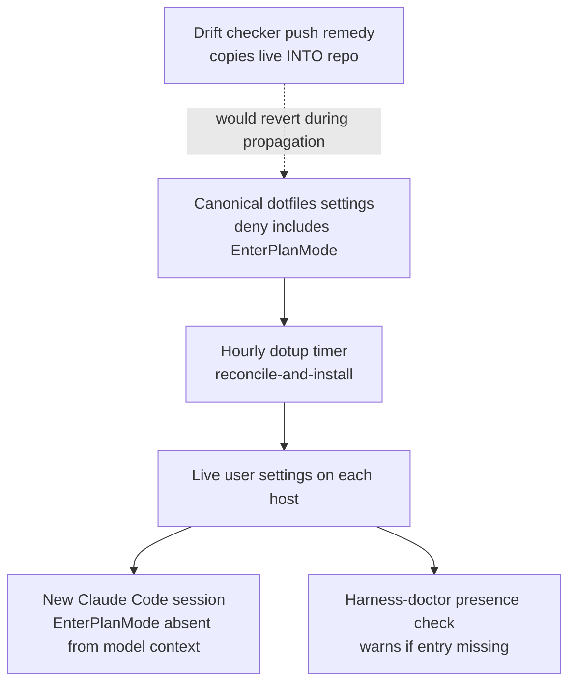

# Disable Model-Initiated Plan Mode - Plan

## Goal Capsule

- **Objective:** A Claude Code session on any operator host, on any provider lane, can no longer be put into plan mode by the model itself, so no session silently loses `--dangerously-bypass-permissions` to an uninvited plan-mode entry. The operator's own planning paths (keyboard plan mode and `/ce-plan`) work exactly as before.
- **Means:** A bare-name `EnterPlanMode` entry in the deny list of the user-level Claude Code settings, propagated to every host through the existing hourly reconcile-and-install path, with a standing harness-doctor check that the entry is present.
- **Product authority:** The operator, who plans with `/ce-plan` and never wants model-initiated plan mode on any provider, and who asked for the change to be done right and future-proofed for one developer rather than done fast. The change lands in the dotfiles harness, not in better-ccflare; this plan lives in the better-ccflare repository because it descends from the Codex-parity ideation recorded there.
- **Open blockers:** None. Three behaviors the documentation leaves implicit are carried as assumptions with acceptance examples that verify them after rollout (see Dependencies / Assumptions).

---

## Product Contract

### Summary

Deny `EnterPlanMode` by bare tool name in the user-level Claude Code settings so the model never sees the tool, reach every host through the reconciler that already runs hourly, and keep a harness-doctor check that proves the entry survives settings rewrites. `ExitPlanMode`, Shift+Tab plan mode, and `/ce-plan` are untouched. No proxy change.

### Problem Frame

When better-ccflare routes a Claude Code session to a Codex account, the model sometimes calls `EnterPlanMode` on its own. Over 21 days of production traffic labeled by exact request-to-transcript join, `EnterPlanMode` was called 0 times across 133,269 Anthropic-served turns and 6 times across 10,441 Codex-served turns; `ExitPlanMode` 0 versus 7. Each uninvited entry costs the session its bypass-permissions state, and the documented way back is a manual choice in the plan-approval dialog, so the operator ends up approving every small action for the rest of that instance. The operator never uses model-initiated plan mode: planning happens through `/ce-plan`, and keyboard plan mode via Shift+Tab remains available for the rare manual case. The capability being removed has no legitimate use on this harness.

### Key Decisions

- KD1. **Disable model-initiated plan mode everywhere, on the client, rather than only on Codex-routed traffic.** (session-settled: user-directed — chosen over a Codex-scoped proxy filter plus a provider-keyed harness hook: the operator plans with `/ce-plan` and never wants the model to call `EnterPlanMode` on any provider.) Governs R1, R4.
- KD2. **A settings-level bare-name deny, not a PreToolUse hook.** A bare name removes the tool from the model's context and is enforced by the permission engine; a hook leaves the tool visible and is subject to this harness's documented mid-session hook failure, which would need monitoring to compensate. Governs R1, R8.
- KD3. **Deny `EnterPlanMode` only; leave `ExitPlanMode` allowed.** `ExitPlanMode` is how a keyboard-entered plan is submitted for approval, so denying it would break the manual path the operator keeps. Governs R2, R3.
- KD4. **The user-level settings layer, not the root-owned managed policy floor.** The managed file was rescoped on 2026-07-03 to catastrophic-only denies; a preference-level entry there would be scope creep against that standing decision. Governs R4.
- KD5. **Reuse the existing hourly reconcile-and-install propagation; build no new sync mechanism.** The same repo-to-live merge already lands the auto-mode policy on every host; this adds an idempotent array element to that path. Governs R5, R6.
- KD6. **A standing harness-doctor presence check, not a one-time check.** (session-settled: user-approved — proposed with the tradeoff that it is a permanent check; the operator assented.) Claude Code rewrites the settings file atomically on updates, which is the main way the entry could vanish. Consumer: the weekly harness report. Deletion condition: Claude Code ships a native setting that disables model-initiated plan mode. Governs R8.
- KD7. **Restoring bypass permissions after plan mode is out of scope.** No documented hook output sets `permission_mode`; hooks can only observe it. The plan-approval dialog's "switch to bypass" option remains the manual path. Prevention is the fix.
- KD8. **Proxy-side tool stripping and the provider-signal hook helper stay documented and unbuilt.** The proxy never sees a tool the client does not advertise, and its only tool-name filter is Codex-specific. Reconsider only if `EnterPlanMode` calls survive after propagation has converged.

### Requirements

**Enforcement**

- R1. In every Claude Code session started on an operator host after rollout, on any provider lane, the model cannot call `EnterPlanMode`, because a bare-name deny entry in the user-level settings removes the tool from the model's context.
- R2. `ExitPlanMode` remains available to the model.
- R3. Keyboard plan-mode entry (Shift+Tab) and `/ce-plan` behave exactly as before the change.
- R4. The deny entry lives in the mutable user-level settings layer; the root-owned managed policy floor is not modified.

**Propagation**

- R5. The deny entry reaches every already-configured host through the existing hourly reconcile-and-install path, merged so that repeated runs never duplicate it.
- R6. The rollout instructions state two things a solo operator must not skip: do not run the drift checker's push remedy while the entry is still propagating, because that remedy copies live state into the canonical repository and would revert the entry; and restart any session that was open when the change landed, because sessions cache settings at start.
- R7. The native-fallback settings overlay that the `claude` wrapper uses when the proxy health probe fails also results in `EnterPlanMode` being absent from the model; if the overlay does not inherit the user-level deny, it carries its own entry.

**Verification**

- R8. A standing harness-doctor check confirms the deny entry is present in both the canonical repository copy and the live settings file on the host, and warns by name when it is absent.

### Actors

- A1. **Operator** — edits the canonical settings, commits, restarts open sessions, reads harness-doctor output.
- A2. **Claude Code session** — loads settings at start; the model inside it never sees `EnterPlanMode`; Shift+Tab and `ExitPlanMode` still work.
- A3. **Dotfiles reconciler** — the hourly install path that merges canonical settings into each host's live settings.
- A4. **Harness-doctor** — the weekly check runner that reports the entry's presence.

### Key Flows

- F1. Rollout
  - **Trigger:** Operator adds the deny entry to the canonical settings and commits.
  - **Actors:** A1, A3, A4
  - **Steps:** The hourly timer runs install; the reconciler merges the entry into live settings on each host; harness-doctor's drift check may report a mismatch until convergence; the operator does not run the push remedy; the operator restarts open sessions; the presence check goes green; the operator runs the one-time checks in AE2, AE5, and AE7.
  - **Outcome:** Every host's live settings carry the entry once; new sessions never expose `EnterPlanMode`.
  - **Covered by:** R1, R4, R5, R6
- F2. Session start after rollout
  - **Trigger:** A Claude Code session starts on any host, on any provider lane, including the native-fallback overlay path.
  - **Actors:** A2
  - **Steps:** The CLI loads settings; the bare-name deny removes `EnterPlanMode` from the model's tool context; the model proceeds without it; Shift+Tab still enters plan mode and `ExitPlanMode` still submits a plan.
  - **Outcome:** No model-initiated plan mode; manual plan mode intact.
  - **Covered by:** R1, R2, R3, R7
- F3. Claude Code update
  - **Trigger:** A CLI update rewrites the live settings file.
  - **Actors:** A2, A3, A4
  - **Steps:** If the entry survives, nothing happens; if it is missing, the next hourly install re-merges it and the next harness-doctor run warns if it is still absent.
  - **Outcome:** The entry is restored or the operator is told it is missing.
  - **Covered by:** R5, R8

### Acceptance Examples

- AE1. **Covers R1.** Given a new session on any provider after propagation, when the operator asks the model to list or search for a plan-mode tool, then `EnterPlanMode` is absent and cannot be called, including when tools are loaded lazily on request.
- AE2. **Covers R2, R3.** Given the operator presses Shift+Tab, when plan mode is entered and the model drafts a plan, then `ExitPlanMode` presents it for approval as before and the approval dialog still offers the bypass option.
- AE3. **Covers R5.** Given a host that has not run install since the change, when the hourly timer fires twice, then the live settings contain the entry exactly once.
- AE4. **Covers R6.** Given harness-doctor reports a permissions mismatch during the propagation window, when the operator follows the rollout note, then no push is run and the canonical entry survives.
- AE5. **Covers R7.** Given the proxy health probe fails and the wrapper launches with the fallback overlay, when the operator asks the model to search for `EnterPlanMode`, then it is absent.
- AE6. **Covers R8.** Given a CLI update has removed the entry from the live settings, when harness-doctor next runs, then it warns naming the missing entry.
- AE7. **Covers R1.** Given a throwaway project-level settings file that allows `EnterPlanMode`, when a session starts in that project, then the tool is still absent because the user-level deny wins.
- AE8. **Covers R6.** Given a session was open before the change landed, when the operator does not restart it, then that session may still expose `EnterPlanMode` until restarted; this is expected and is why the rollout note requires restarts.

### Success Criteria

- The presence check passes on every host immediately after a manual install run, without waiting for the timer.
- AE2, AE5, and AE7 are each exercised once by the operator in a live interactive session after rollout; no scripted traffic is sent to any Anthropic-backed account.
- Over the following 21-day window, `EnterPlanMode` calls on Codex-served turns fall from the baseline of 6 to 0, measured by the same transcript-join method the ideation used; `ExitPlanMode` calls are not expected to reach 0 and are not a regression if they do not.
- The canonical repository history shows the entry was never reverted by a push during propagation.
- After the next Claude Code update on any host, either the presence check still passes or harness-doctor warned.

### Scope Boundaries

- Proxy-side stripping of plan-mode tool declarations in better-ccflare: documented, unbuilt fallback (KD8).
- A PreToolUse deny hook with redirect messaging and a synthetic self-test: rejected as a weaker enforcement point (KD2).
- Editing the root-owned managed policy floor (KD4).
- Automatic restoration of bypass permissions after plan mode (KD7).
- Standing telemetry, alerting, or dashboards for plan-mode calls beyond the harness-doctor presence check.
- The provider-signal hook helper and rendering the provider in the statusline: no longer needed for this work.
- The other Codex-parity ideas (root-demotion de-ratchet, translation-loss ledger, reasoning-effort mapping, authority layer, conformance harness): separate work.

<!-- ce-section: work-relationships -->
### How This Work Fits Together

This plan covers one of six directions in the Codex-parity ideation at `docs/ideation/2026-09-24-codex-routed-claude-code-parity-ideation.html`. That breakdown is the current understanding, not a committed roadmap.

- Root-demotion de-ratchet and callout (ideation idea 1) — Can proceed independently of this plan; lands in better-ccflare.
- Behavior ledger and parity floors (idea 3) — Enables measuring this plan's success criteria per request instead of by transcript mining; not required for it.
- Reasoning-effort mapping and authority layer (ideas 4 and 5) — Can proceed independently; the provider-signal helper this plan dropped is not needed by them either.
- Codex conformance harness (idea 6) — Shares nothing with this plan; the plan-mode control is client-side and never reaches the proxy.

### Dependencies / Assumptions

- **Assumption: Shift+Tab plan-mode entry is a UI action, not a tool call, so the deny does not affect it.** The documentation describes Shift+Tab as a keyboard shortcut and never ties it to `EnterPlanMode`, but does not state the independence outright. Verified by AE2.
- **Assumption: the fallback overlay is an additional settings layer, so the user-level deny still applies under it.** The overlay currently carries only environment and model keys. Verified by AE5; if false, R7's own entry applies.
- **Assumption: a user-level deny beats a project-level allow.** The documentation states rules are evaluated deny-then-ask-then-allow regardless of specificity, but does not spell out cross-layer cases. Verified by AE7.
- **Assumption: lazily loaded tools are covered by the deny.** Undocumented. Verified by AE1.
- **Assumption: the telemetry baseline is stable.** The 0-versus-6 baseline was derived from transcripts on 2026-09-24 and cannot be re-derived from the proxy database, which does not retain request bodies.
- **Dependency:** the hourly dotup timer and the install path's reconciler run on every host the operator uses.
- **Dependency:** editing the user-level settings permissions surface is a security-posture change under the operator's own rules; this plan, confirmed by the operator, is the recorded approval.

### Outstanding Questions

**Resolve Before Planning**

- None.

**Deferred to Planning**

- Whether the array merge extends the existing runtime-environment reconciler in place or lives in a small sibling function it calls; both ride the same hourly path.
- Whether the presence check is a new numbered harness-doctor check or an extension of the existing settings-parity check, and its exact warning text.
- Whether the fallback overlay needs its own entry; decided by the result of AE5.

### Sources / Research

- `docs/ideation/2026-09-24-codex-routed-claude-code-parity-ideation.html` — the ideation this plan descends from (idea 2), including the telemetry method and baseline.
- Claude Code documentation: permissions (bare-name deny removes the tool from context; deny evaluated first regardless of specificity), permission modes (Shift+Tab entry, plan approval with the bypass option), tools reference (`EnterPlanMode` and `ExitPlanMode` accept only bare names), hooks reference (`permission_mode` is input-only; no output sets it), settings (layer precedence).
- Dotfiles repository, paths relative to its root: `claude/settings.json` (user-level permissions block, 71 deny entries today, none bare-name), `claude/managed-settings.json` (catastrophic-only floor), `claude/sync.sh` (the runtime-environment reconciler near line 996 and its unconditional call from install near line 2238; the note that active sessions cache settings), `claude/systemd/dotup-refresh.timer` (hourly, randomized delay), `claude/scripts/harness-doctor.sh` (settings-parity check 11 near line 932 and its push-direction remedy), `.bashrc` (the `claude()` wrapper's fallback overlay near lines 177-227), `claude/hooks/PreToolUse/settings-guard.js` (asks before settings edits).
- better-ccflare: `packages/providers/src/providers/codex/provider.ts` line 4366 (the only tool-name filter in the proxy, Codex-specific, Agent and Task only) — why no proxy change is involved.
