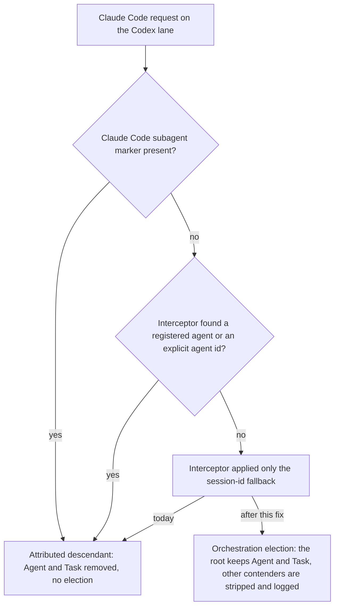
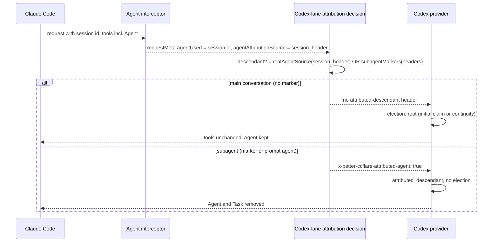

# Restore Agent Delegation on Codex-Routed Root Sessions - Plan

## Goal Capsule

- **Objective:** A Claude Code main conversation that better-ccflare routes to a Codex account can delegate to subagents again, as it does when routed to Anthropic, while a spawned subagent still cannot spawn further subagents.
- **Means:** On the Codex lane, treat a request as a subagent for containment only when a real agent identity or Claude Code's own subagent markers identify it, never because of the proxy's session-id attribution fallback (KTD1); pin that boundary with regression tests; measure the effect in production for a week before deciding whether the election ratchet needs work.
- **Product authority:** The operator, who chose to fix this regression first and to plan any election change from the demotion data the fixed system produces, and who wants the work done right rather than fast.
- **Execution profile:** One small proxy change plus tests, landed on the existing draft PR #381 for issue #380, reviewed through the operator's review ladder, merged by the implementing agent when green. The production deploy and the measurement week are the operator's actions after merge (R8 to R10) and are not part of this plan's Definition of Done.
- **Stop conditions:** Stop and report if the fix would require changing the agent interceptor, the persisted attribution fields, or the Codex provider's classification code; if any existing provider or election test needs weakening to pass; or if the measurement prerequisites in Documentation / Operational Notes cannot be met.
- **Open blockers:** None.

---

## Product Contract

### Summary

Correct the Codex-lane attribution decision so that the session-id fallback the proxy applies to every Claude Code request no longer marks a main conversation as a subagent. Root turns then go through orchestration election and keep their Agent and Task tools, while real subagents are still stripped. Regression tests cover both directions at the proxy and provider boundaries, and a one-week production measurement decides the follow-up.

### Problem Frame

On 2026-07-14 the Codex provider gained a single-orchestration-root containment after a recursive subagent storm: a request marked as an attributed descendant loses its Agent and Task tool declarations without election, and any other conversation in the session that is not the elected root loses them too. The proxy marks a request as an attributed descendant when its agent interceptor reports an agent, or when Claude Code's subagent markers are present.

On 2026-07-31 the interceptor gained a session-id fallback for the runaway-loop alert: when no registered agent matches, it reports the Claude Code session id as the agent so the alert can key on per-session identity. The fallback deliberately skips model rewrites, but the Codex attribution decision was not updated, so from that day every Claude Code main conversation routed to Codex has looked like a subagent.

The effect is total and silent. Over the last 21 days, 62,772 of 64,649 Codex-served Claude Code requests carried the session-header attribution. The production trace for September 13 to 24 classifies 34,692 requests as attributed descendants and 15 as root, with the Agent tool stripped on every attributed turn, and none of 70,911 Codex responses called Agent while 1,043 called Workflow. Attributed descendants never log a demotion, so the warn line built to expose demotions had nothing to report, and the same-day ideation blamed the election ratchet instead. The operator experiences it as subagents failing to launch under Codex routing.

### Key Decisions

- KD1. **Fix the attribution regression first; plan any election change afterwards from real demotion data.** (session-settled: user-directed — chosen over one combined fix-and-de-ratchet plan and over fix-plus-announcement: election has never run for a main conversation since 2026-07-31, so there is no production demotion data to design a de-ratchet from.) Governs R1, R9, R10.
- KD2. **Change the decision that misreads the flag, not the flag itself.** The session-id fallback's second meaning is load-bearing for the runaway-loop alert and for persisted attribution, and the attribution source already distinguishes a real agent from the fallback. Governs R1, R5.
- KD3. **A subagent, for Codex containment, is a request identified by a registered agent matched on its prompt, by an explicit agent-id header, or by Claude Code's own subagent markers.** The session-id fallback identifies a session, not an agent, and never counts. Governs R1, R2.
- KD4. **Keep depth-only containment and accept parallel spawn width from the root.** (session-settled: user-approved — proposed with the tradeoff that a root can again issue eight to ten parallel spawns in one response, as GPT did in July; the operator assented with the runaway-loop alert as the backstop.) Governs R3, R4.
- KD5. **Measure with signals that already exist; add no per-request column in this fix.** (session-settled: user-approved — proposed with the tradeoff that the admission ledger stays deferred; the operator assented.) The production trace records the admission classification and the stripped tool names on every Codex turn, the demotion warn line covers rejected contenders, and the request-to-transcript join labels sessions by provider. Governs R9, R10.
- KD6. **Production takes the fix only through the operator's manual deploy from main.** This is the repository's standing rule; the measurement window starts at that deploy, not at merge. Governs R8.



### Requirements

**Attribution**

- R1. On the Codex lane, a request whose only attribution is the session-id fallback is not an attributed descendant; it enters orchestration election like any unattributed request.
- R2. A request identified by a registered agent matched on its prompt, by the proxy's own explicit agent-id header, or by any of Claude Code's subagent markers is an attributed descendant exactly as today.
- R3. Orchestration election, the stripping of non-root contenders, and the demotion warn line are unchanged for requests that are not attributed descendants.
- R4. No other containment is loosened: the fix does not touch parallel tool calling or any fan-out limit.
- R5. Every other reader of the session-id fallback keeps its current behavior: the runaway-loop alert still keys on the session id, persisted attribution fields still record the fallback, and model-preference rewrites still apply only to real agents.

**Verification**

- R6. Regression tests at the proxy boundary show that a Claude Code request with only session-id attribution receives no attributed-descendant marker on the Codex lane, while a prompt-matched agent, an explicit agent-id header, and each Claude Code subagent marker still receive it.
- R7. A regression test at the provider boundary shows that an unmarked request offering Agent is classified by election and keeps Agent as root.
- R8. The fix reaches production through the standard deploy from main, run by the operator, and the measurement window in R9 starts at that deploy.

**Measurement**

- R9. Over the first week after deploy, the production trace and the request-to-transcript join show Codex-routed main conversations classified as root and calling Agent, judged by the metric and countermetric in Success Criteria.
- R10. The election de-ratchet decision is made from that week's demotion evidence, counted as non-root classifications in the trace and demotion warn lines with real request ids, after splitting them between subagents that carried no marker and main conversations that were falsely demoted: zero falsely demoted roots drops the de-ratchet; any more than zero produce a follow-up plan written from those records.

### Actors

- A1. **Operator** — merges the fix, runs the deploy, reads the measurement, decides the follow-up.
- A2. **Main conversation** — a Claude Code session's root conversation, routed to Codex, whose requests carry the session id and no subagent marker.
- A3. **Subagent** — a conversation Claude Code spawns through Agent or Workflow; carries Claude Code's subagent markers or matches a registered agent on its prompt.
- A4. **Proxy** — better-ccflare's agent interceptor, Codex attribution decision, and Codex provider containment, plus the runaway-loop alert that keys on the session id.

### Key Flows

- F1. Root turn after the fix
  - **Trigger:** A2 sends a turn that offers the Agent tool.
  - **Actors:** A2, A4
  - **Steps:** The interceptor applies the session-id fallback as today; the Codex attribution decision finds no real agent identity and no subagent marker and sets no descendant marker; the provider runs election; the conversation is root by initial claim or continuity; Agent and Task stay in the tool list; the model may delegate.
  - **Outcome:** Delegation works on Codex as on Anthropic.
  - **Covered by:** R1, R3, R5
- F2. Subagent turn after the fix
  - **Trigger:** A3 sends a turn that offers the Agent tool.
  - **Actors:** A3, A4
  - **Steps:** Claude Code's subagent markers, or a prompt match to a registered agent, identify the request; the descendant marker is set; the provider removes Agent and Task without election.
  - **Outcome:** A subagent cannot spawn subagents; depth-one containment holds.
  - **Covered by:** R2, R4
- F3. Rollout and measurement
  - **Trigger:** The fix merges to main.
  - **Actors:** A1, A4
  - **Steps:** A1 deploys; over a week the trace records root classifications and Agent calls for Codex main conversations; A1 reads the metric, the countermetric, and the demotion evidence; A1 drops or plans the de-ratchet.
  - **Outcome:** The follow-up is decided from observed data.
  - **Covered by:** R8, R9, R10

### Acceptance Examples

- AE1. **Covers R1, R3, R6, R7.** Given a main-conversation request on the Codex lane whose only attribution is the session-id fallback and whose tools include Agent, when the proxy prepares the upstream request, then no descendant marker is present, the provider classifies the turn by election as root, and Agent remains in the tool list.
- AE2. **Covers R2, R6.** Given a request carrying Claude Code's parent-agent header, and separately one carrying Claude Code's own agent-id marker header (not the proxy's explicit agent-id header, which the interceptor already reports as a header-attributed agent), and separately one whose billing header marks a subagent, when prepared for Codex, then the descendant marker is present and Agent and Task are removed without election.
- AE3. **Covers R2, R6.** Given a request whose system prompt matches a registered agent, when prepared for Codex, then the descendant marker is present and Agent and Task are removed.
- AE4. **Covers R3.** Given a session whose root is already elected, when a second unmarked conversation with a different system prompt and no shared tool-call lineage sends a turn that offers Agent, then it is classified non-root, Agent and Task are removed, a demotion line is logged with the request id, and the root's state is unchanged.
- AE5. **Covers R5.** Given a session-id-attributed request after the fix, when it is processed, then the runaway-loop alert key still contains the session id and the persisted attribution source still reads as the session fallback.
- AE6. **Covers R9.** Given one week of production traffic after deploy, when the trace is read, then Codex main-conversation turns show root classification, Codex responses show Agent calls, and no attributed-descendant response shows an Agent call.
- AE7. **Covers R10.** Given the same week, when non-root classifications and real-request-id demotion lines are counted and split, then the de-ratchet is dropped at zero falsely demoted roots or a follow-up plan is written from the records at more than zero.

### Success Criteria

- Metric: the share of Codex-labeled Claude Code sessions (a provider serving at least 90 percent of a session's requests) with at least one Agent call in a Codex response over the week after deploy is in the same range as the Anthropic share over the same week.
- Countermetric: zero Agent calls in attributed-descendant responses over the same week, and no runaway-loop alert attributable to a Codex session, read together with the alert threshold recorded at deploy, because alert silence proves only that no session burst reached that threshold.
- Handoff: the implementing agent can land the units from this plan without inventing behavior, scope, or the measurement method.

### Scope Boundaries

**Deferred for later**

- Election de-ratchet: stable root identity across prompt drift, and re-promotion after a quiet period. Decided by R10.
- A one-line announcement injected when Agent and Task are stripped, so a worker knows to delegate through Workflow or work inline.
- A per-request admission column and the parity floors of the ledger idea.
- Parallel tool calling limits when Agent is exposed, designed in July and never shipped.
- Dashboard display of session ids in the agent column, a cosmetic side effect of the fallback.

**Outside this fix**

- The session-id fallback itself and the runaway-loop alert it serves.
- The Anthropic and xAI lanes, which never set the descendant marker.
- The plan-mode deny, which lives in the dotfiles harness.

### Deferred to Follow-Up Work

- A committed measurement script. The read-only queries in Documentation / Operational Notes are run by hand for this one window; a script earns its place only if the ledger idea does not land first.

<!-- ce-section: work-relationships -->
### How This Work Fits Together

This plan covers one area of the Codex-parity work: restoring delegation on Codex roots. The breakdown below is the current understanding, not a committed roadmap.

- Election de-ratchet and demotion announcement (ideation idea 1 as originally framed)
  - Depends on this fix: election has never run for a main conversation in production, so its drift behavior is unobserved.
  - Still to decide: whether it is needed at all, per R10.
- Codex behavior ledger and parity floors (ideation idea 3)
  - Can proceed independently of this fix; its admission column would replace the trace as the measurement source.
- Plan-mode deny (ideation idea 2, dotfiles PR #1393)
  - Can proceed independently of this fix; different repository.
- Reasoning-effort mapping, authority and persistence layer, conformance harness (ideation ideas 4 to 6)
  - Can proceed independently of this fix.

### Dependencies / Assumptions

- Assumption: Claude Code sends at least one subagent marker on every subagent request kind, including agents spawned by Workflow. If a kind carries none, election still classifies it non-root once a root exists (AE4), so containment holds, and the split in R10 attributes those lines to unmarked subagents rather than to falsely demoted roots.
- Assumption: the production trace stays enabled through the measurement window; it is switched on by a local service drop-in rather than the unit file, so a drop-in change would blind R9. The runbook checks it at deploy, day 1, and day 7.
- Dependency: the standard deploy from main, run by the operator (R8).
- Dependency: the request-to-transcript join labels a session by the provider that served at least 90 percent of its requests; a transcript grep over those sessions also counts Agent calls made on their non-Codex turns, so the trace's per-response tool-use record is the provider-exact source for R9.

### Sources

- `docs/ideation/2026-09-24-codex-routed-claude-code-parity-ideation.html` — the ideation this plan descends from; its idea 1 card carries the superseded premise.
- `CONCEPTS.md` — the attributed-descendant entry states the post-fix rule and lands with the fix (U2); identical text is on the docs PR #379.
- `packages/proxy/src/handlers/agent-interceptor.ts` — the session-id fallback (commit 490a5bc55, 2026-07-31) and the prompt and header agent paths.
- `packages/proxy/src/handlers/proxy-operations.ts` — the Codex-lane attribution decision and the descendant marker header (2026-07-14, commits 527c4e7b6 and 9100ad34e).
- `packages/proxy/src/proxy.ts` — copies the interceptor result into request metadata; calls the session governor for every request.
- `packages/proxy/src/claude-code-request.ts` — Claude Code subagent markers (2026-08-04, commit 62df1f4e).
- `packages/proxy/src/session-governor.ts` — the only mechanism that rejects requests by session volume: warns at 300 requests per hour by default and rejects only when a per-hour budget is configured, which it is not by default.
- `packages/http-api/src/services/alerts.ts` — the runaway-loop anomaly key, composed from account, model, project, and the persisted agent field (issue #367); `packages/http-api/src/services/anomaly-insights.ts` documents why the key carries both project and agent. `packages/config/src/index.ts` sets the alert's minimum at 25 requests in a five-minute window by default.
- `packages/proxy/src/handlers/account-selector.ts` — the only other semantic reader, which also requires a model rewrite.
- `packages/providers/src/providers/codex/provider.ts` — descendant marker read, classification, strip, demotion warn line, trace write.
- `packages/providers/src/providers/codex/trace.ts` — the fan-out warn line logged when one response spawns 8 or more subagents (env-configurable threshold).
- `packages/providers/src/providers/codex/orchestration-election.ts` — the election store; rejection mutates nothing (commit 25377e00a, 2026-07-14; continuity fixes in PRs #39, #132, #170). `packages/core/src/constants.ts` sets its five-hour TTL.
- Existing tests: `packages/proxy/src/handlers/__tests__/agent-interceptor.header.test.ts` (session-header source), `packages/proxy/src/handlers/__tests__/proxy-operations-count-tokens.test.ts` (descendant marker), `packages/providers/src/providers/codex/provider.test.ts` (strip and unmarked root), `packages/providers/src/providers/codex/orchestration-election.test.ts` (election).
- Production evidence, all read-only: requests table attribution counts over 21 days; the Codex trace directory configured by the service's local drop-in, September 13 to 24; demotion lines in the shared application log, all carrying test-fixture request ids.
- `docs/solutions/integration-issues/codex-cache-affinity-needs-session-id-header.md` — the session signal is deliberately shared by the root and every descendant thread, which is why it cannot identify a subagent.
- `docs/solutions/workflow-issues/typecheck-does-not-cover-test-call-sites.md` and `docs/solutions/workflow-issues/verify-fix-ancestry-before-citing-a-measured-rate.md` — the test call-site sweep and the deploy-SHA discipline.
- `docs/plans/2026-09-24-1835-fix-disable-model-initiated-plan-mode-plan.md` — sibling plan for ideation idea 2.

**Product Contract preservation:** changed: R10 — clarified that the demotion count is split between unmarked subagents and falsely demoted roots before deciding (no scope change); AE7 mirrors the clarification. Success Criteria — the countermetric now says the alert threshold is recorded with it, because alert silence alone proves less than the sentence implied (no scope change). Sources — corrected the runaway-loop consumer from a nonexistent proxy alerts module to the HTTP API alert services. Outstanding Questions removed: all three deferred questions are answered by KTD2, KTD3, and KTD5.

---

## Planning Contract

### Key Technical Decisions

- KTD1. **Allowlist on the attribution source, matched exhaustively, OR'd with the unchanged Claude Code subagent-marker check.** A request is an attributed descendant on the Codex lane when its attribution source is `prompt_agent` or `header_agent`, or when the subagent markers are present; `session_header`, `none`, and an absent source are not. The match is exhaustive over the closed source union, so a future source value fails typecheck until it is classified. Election stays the backstop for any real subagent the allowlist misses: once a root exists, a different-prompt contender is rejected as non-root (R3); the exposure when no root exists yet is bounded and stated in Risks & Dependencies. Cites KD2, KD3; governs R1, R2.
- KTD2. **The predicate is a pure exported function beside the subagent-marker check, and the Codex-lane decision is its single call site.** One guard in the shared module rather than string comparisons at the call site; the module stays import-light, taking the source type as a type-only import. Answers the brainstorm's placement question. Governs R1, R6.
- KTD3. **No change to the Codex provider or its tests.** The provider consumes the marker as a plain boolean and already proves that an unmarked request offering Agent keeps Agent as root and that a rejected contender is stripped and logged; those existing tests are the provider-boundary proof for R7. Governs R3, R7.
- KTD4. **Test-first in the proxy suite that already houses the descendant-marker cases, with one fixture made explicit.** The session-fallback case is written first and observed failing against the old expression. The existing descendant-marker test declares only the agent field today and is the one assertion that flips under KTD1, so it gains an explicit `prompt_agent` source in the same commit, the source that matches the registered agent its agent field names; the change makes the fixture state its intent, it does not weaken the assertion. A mutation check confirms the new test fails when the old expression is restored. Governs R6.
- KTD5. **Measurement from the per-turn trace joined to the requests table, recorded on issue #380 with the deployed SHA and the effective alert and governor settings.** (session-settled: user-approved — instantiates KD5: measure with existing signals; chosen over adding an admission column now.) The trace's request records carry the admission classification and stripped tool names, its response records carry the tools the model called, and the two join on request id; the requests table joins request id to the Claude Code session id for the metric's denominator. The deployed SHA comes from the health endpoint so a stale binary cannot be mistaken for the fix; the alert threshold and governor budget are recorded beside it so a later reader knows what alert silence proved. Governs R9, R10.

### High-Level Technical Design

The decision sits between two components that do not change. The sequence below is the request path for one Claude Code turn on the Codex lane after the fix.



Directional sketch of the predicate's shape, not implementation specification:

```text
realAgentSource(source):
  prompt_agent  -> true
  header_agent  -> true
  session_header -> false
  none          -> false
  (absent)      -> false
  any other value -> compile-time error until classified
```

### Assumptions

- The four-value attribution-source union in the shared types package is the complete set today; the exhaustive match depends on it staying a closed union.
- The count-tokens proxy suite's describe-level fetch save/restore covers new tests added to its Codex block, so no bespoke teardown is needed.
- Claude Code subagent markers arrive on every subagent kind (Product Contract assumption); if not, election contains them and R10's split attributes the lines correctly.
- The production service's local drop-in keeps the trace directory set for the whole measurement window; the runbook re-checks it rather than assuming it.

### Implementation Constraints

- Never modify `packages/proxy/src/inline-worker.ts` or the generated `packages/database/src/inline-*-worker.ts` files.
- Never send scripted traffic to an Anthropic-backed account; every proof here is a unit test or a read-only query.
- The typecheck excludes test files, so a grep sweep of test call sites accompanies the change even though no signature changes.
- Run `bun run lint && bun run typecheck && bun run format` after the change.

### Sequencing

U1 (predicate and its tests) → U2 (decision, proxy-boundary tests, glossary entry) → U3 (provider-boundary proof, no change). U1 and U2 land as one commit if the implementer prefers; U3 is verification only.

### System-Wide Impact

- Only the Codex lane sets the descendant marker, so the Anthropic and xAI lanes are unaffected by construction.
- The token-count preflight returns before classification and never reaches election; the responses-adapter path deletes the marker unconditionally and is independent of this decision.
- Persistence, the dashboard, the usage collector, and the runaway-loop alert read the attribution fields as pass-through values and do not branch on them; the fix changes only how one Codex-lane decision interprets them. The session governor keys on the client session id and is unaffected.

### Risks & Dependencies

- A second unmarked conversation that is not a subagent but shares a session id (a headless child, or a subagent kind with no marker) is demoted first-come once a root exists; across a proxy restart or after the election TTL the first writer wins, which can be the subagent. The exposure is bounded: the wrong root keeps Agent and Task, and the true root is locked out as non-root, for up to the five-hour election TTL or until the session ends, with no automatic re-election. The operator accepts that window knowingly; R10's split is the detector and the de-ratchet follow-up is the remedy.
- A root can now issue eight to ten parallel spawns per response (KD4), and nothing blocks that width in production by default. The runaway-loop alert observes after the fact and fires only when a session key reaches 25 requests in a five-minute window (env-configurable); the session governor, the only mechanism that rejects requests, warns at 300 requests per hour and rejects only when a per-hour budget is configured, which it is not by default. The provider's fan-out warn line, logged when one response spawns 8 or more subagents (env-configurable), is the real-time signal. The operator decides before the window whether to configure a session budget.
- The runaway-loop alert key joins account, model, project, and the persisted agent field with a delimiter it does not escape, so field values containing the delimiter can collide. This is a known limitation of the alert, unchanged by this fix; it must not be read as collision-proof for the traffic this fix newly routes through it.
- If the trace directory is unset at any point in the window, R9 has no source for that span; the runbook checks it at deploy, day 1, and day 7.
- The measured week must run on the deployed SHA that contains the fix; record it from the health endpoint, per the repository's learning on citing measured rates.

---

## Implementation Units

### U1. Add the attributed-descendant source predicate

- **Goal:** A pure, exhaustively matched predicate that says whether an attribution source identifies a real agent, living beside the Claude Code subagent-marker check.
- **Requirements:** R1, R2 (KD3), KTD1, KTD2
- **Dependencies:** None
- **Files:**
  - `packages/proxy/src/claude-code-request.ts` (modify: add the exported predicate)
  - `packages/proxy/src/__tests__/claude-code-request.test.ts` (modify: add its cases)
  - `packages/types/src/request.ts` (read only: the attribution-source union the predicate matches)
- **Approach:**
  1. Add an exported pure function that takes an attribution source, possibly absent, and returns whether it denotes a real agent per KTD1.
  2. Match exhaustively over the union with a never-typed default, so a new source value fails typecheck here.
  3. Document the trust boundary in the same style as the neighboring subagent-marker check: the session-id fallback identifies a session, not an agent.
- **Execution note:** Test-first; write the predicate cases before the function.
- **Patterns to follow:** The neighboring pure function on headers in the same file, with its doc comment stating what "trusted Claude Code request metadata" means.
- **Test scenarios:**
  - `prompt_agent` returns true.
  - `header_agent` returns true.
  - `session_header` returns false.
  - `none` returns false.
  - An absent source returns false.
  - Type-level: the exhaustive match compiles against the current union (proved by typecheck, not a runtime test).
- **Verification:** The predicate's test file passes; typecheck is clean.

### U2. Use the predicate at the Codex-lane decision and pin the boundary with tests

- **Goal:** The Codex branch sets the descendant marker only for real agents or Claude Code subagent markers, with the boundary pinned in both directions, and the shared vocabulary lands with the behavior it describes.
- **Requirements:** R1, R2, R3, R5, R6; AE1, AE2, AE3, AE5; KD1 (governs R1), KD2, KD3; KTD1, KTD2, KTD4
- **Dependencies:** U1
- **Files:**
  - `packages/proxy/src/handlers/proxy-operations.ts` (modify: the Codex-branch decision that sets or deletes the descendant marker header)
  - `packages/proxy/src/handlers/__tests__/proxy-operations-count-tokens.test.ts` (modify: extend the Codex describe block)
  - `CONCEPTS.md` (modify: the attributed-descendant entry, already present in the working tree, is committed with this unit so the glossary never describes behavior the code does not yet have)
- **Approach:**
  1. Replace the agent-field truthiness in the decision with the U1 predicate applied to the request metadata's attribution source, OR'd with the unchanged subagent-marker check on the request headers.
  2. Leave the header set and delete branches, and the stripping of client-supplied copies, exactly as they are.
  3. In the existing descendant-marker test, declare a `prompt_agent` attribution source on its request metadata, since its agent field names a registered agent matched on the prompt (KTD4); the dedicated `header_agent` case below covers the proxy's explicit header.
  4. Add the session-fallback case and the per-marker cases below, using the block's request-metadata, account, and context helpers and its per-test fetch mock.
  5. Commit the glossary entry alongside the code and tests.
- **Execution note:** Write the session-fallback test first and watch it fail against the old expression. After the change, restore the old expression once to confirm that test fails, then put the fix back and note the observation in the PR.
- **Patterns to follow:** The Codex describe block's helpers and describe-level fetch save/restore; the existing table-driven case for billing-metadata descendant containment as the shape for the per-marker cases.
- **Test scenarios:**
  - Covers AE1. Request metadata with the agent field set to a session id and source `session_header`, no Claude Code headers, tools including Agent and Read: the captured upstream request has no descendant marker header and its tool list still includes Agent.
  - Covers AE3. Source `prompt_agent` with the agent field set: the marker is present and the upstream tool list has Agent and Task removed (the existing test, now with its source declared).
  - Covers AE2. Source `header_agent` (what the interceptor reports for the proxy's own explicit agent header, `x-better-ccflare-agent-id` or the legacy `x-anthropic-agent-id`): the marker is present.
  - Covers AE2. Source `session_header` plus Claude Code's parent-agent header `x-claude-code-parent-agent-id`; plus Claude Code's own agent-id marker `x-claude-code-agent-id` (not the proxy's explicit agent header, which would flip the source to `header_agent`); plus a billing header containing the subagent field set to true: the marker is present in each case, proving the subagent predicate is still consulted when the interceptor reports only the session fallback.
  - Edge: no agent field and source `none` (the existing unattributed test) still passes unchanged.
  - Edge: agent field set with the source absent: no marker, documenting that the source decides, not the agent field.
  - Covers AE5. For the session-fallback request, the request metadata handed to persistence still carries source `session_header` and the session id in the agent field; assert on the save payload if the block exposes it, otherwise the interceptor suite's unchanged session-header cases are the proof.
  - Integration: a request on a non-Codex account never receives the marker regardless of source (the existing non-Codex path), proving the change is Codex-only.
- **Verification:** The count-tokens suite passes with the new cases; the interceptor suite passes unchanged; the mutation check was observed; a grep of test call sites for the marker header and the source field finds no other fixture that relied on agent-field truthiness; the glossary entry is in the same PR.

### U3. Prove the provider boundary and the containment backstop without changing the provider

- **Goal:** Show that R3, R4, and R7 hold with the provider and election store untouched.
- **Requirements:** R3, R4, R7; AE4; KTD3
- **Dependencies:** U2
- **Files:**
  - `packages/providers/src/providers/codex/provider.test.ts` (run; change expected only if step 3 finds a gap)
  - `packages/providers/src/providers/codex/orchestration-election.test.ts` (run)
  - `packages/providers/src/providers/codex/provider.ts` (no change)
- **Approach:**
  1. Run both suites unchanged and cite, in the PR, the two existing provider tests that prove an unmarked request offering Agent keeps Agent as root: the stable-root election test and the test that an attributed descendant cannot claim the empty root slot.
  2. Confirm the election suite's rejection cases (changed identity with changed instructions; matching instructions but unrelated lineage) plus the provider's demotion-log assertion cover AE4's non-root path.
  3. Only if the AE4 shape is not covered end to end in the provider suite, add one case there: an elected root, then a second unmarked conversation with different instructions and no shared lineage, asserting non-root classification, stripped tools, and the demotion log line carrying the request id.
- **Test expectation:** Existing coverage; add a test only if step 3 finds a gap.
- **Verification:** Both suites green; no diff under the provider package unless step 3 added a test.

---

## Verification Contract

| Check | Command | Applies to | Done signal |
|---|---|---|---|
| Predicate and proxy boundary | `bun test packages/proxy/src/__tests__/claude-code-request.test.ts packages/proxy/src/handlers/__tests__/proxy-operations-count-tokens.test.ts packages/proxy/src/handlers/__tests__/agent-interceptor.header.test.ts` | U1, U2 | All pass; the session-fallback case exists and the existing descendant-marker case declares its source |
| Provider boundary | `bun test packages/providers/src/providers/codex/provider.test.ts packages/providers/src/providers/codex/orchestration-election.test.ts` | U3 | All pass with no provider source change |
| Quality gates | `bun run lint && bun run typecheck && bun run format` | All | Clean |
| Test call-site sweep | `grep -a -rn "attributed-agent\|agentAttributionSource" packages --include=*.test.ts` | U2 | Every fixture that asserts the marker declares an attribution source |
| Mutation check | Restore the old decision expression locally; run the count-tokens suite; the session-fallback case fails; put the fix back | U2 | Observed once and stated in the PR |
| Fresh-worktree bootstrap | `bun install --no-save` then `bun run build:cli` before the first test run | All | Suites import cleanly |
| Review | Adversarial-first review, then code review with a security lens on the containment, per the operator's review ladder | PR #381 | Findings addressed or recorded; gate outcomes stated in the PR |

## Definition of Done

- U1 through U3 complete; every Verification Contract row shows its done signal.
- No changes to the agent interceptor, persistence, the HTTP API alert services, the session governor, or the Codex provider source.
- The existing descendant-marker test declares its attribution source; the session-fallback test exists and was observed failing against the old expression.
- The attributed-descendant glossary entry is committed in the same PR as the code.
- PR #381 references issue #380, states the mutation-check observation, cites the two provider tests that prove the unmarked-root path, and carries no abandoned or experimental code.
- Not part of done: the production deploy and the measurement week (R8 to R10) are the operator's actions after merge, tracked on issue #380 with the runbook below.

---

## Documentation / Operational Notes

Rollout and measurement runbook for the operator, all steps read-only except the deploy itself and any rollback.

1. **Deploy** from a fresh clone of main with the repository's deploy script; record the SHA the health endpoint reports as the deployed build, the effective runaway-loop alert minimum (25 requests in five minutes unless the env override is set), and whether a session-governor per-hour budget is configured (off by default; decide before the window whether to set one). The measurement clock starts here (R8).
2. **Prerequisites, checked at deploy and again on day 1 and day 7:** the service's active environment still carries the Codex trace directory (read the local drop-in or the unit's shown environment); the demotion warn line reaches both the journal (headless serve mode turns console logging on for WARN and ERROR, the same path the fan-out warn line takes) and the logger's file sink under the temp directory; search the file sink when a read spans the whole window, since the journal is easier to lose to rotation.
3. **Day 1 and day 7 reads** (trace files newer than the deploy; each trace line is one JSON object, so use `jq` with the snake_case keys for the admission distribution, the Agent-call join, and the session metric, and reserve `rg -N` for the plain-text warn lines in the application log; a 2026-09-25 check parsed all sixteen production trace files with zero errors):
   - Fan-out check: the provider's "Possible recursive fan-out" warn line in the application log, which fires in real time when one response spawns 8 or more subagents and does not depend on the trace directory.
   - Admission distribution: counts of `orchestration_admission` values; expect root classifications for main conversations and attributed descendants for subagents.
   - Agent calls: response records whose `new_tool_use_by_name` includes Agent, joined by `request_id` to their request record; the countermetric is the count of those whose request record is an attributed descendant, which must be zero.
   - Session metric: join response request ids to the requests table, extract the session id from the client session field, and compute the share of Codex-labeled sessions with at least one Agent call against the Anthropic share over the same window.
   - Demotion evidence for R10: `non_root` request records and warn lines carrying a UUID request id; split each by whether its session's transcript is a main conversation.
   - Runaway-loop and governor check: no `anomaly_runaway_loop` alert attributable to a Codex session, and any session-governor warning, in the window; read both against the thresholds recorded in step 1.
4. **Stop or go after day 1:** stop the week and roll back to the previous pinned build (the deploy script keeps a pin backup) if any attributed-descendant response called Agent, a fan-out warn line traces to a Codex session, or a runaway-loop alert fired for a Codex session; otherwise continue to day 7.
5. **Record** the numbers, the deployed SHA, the thresholds, and the R10 decision on issue #380; if falsely demoted roots are more than zero, open the de-ratchet follow-up plan from those records.
