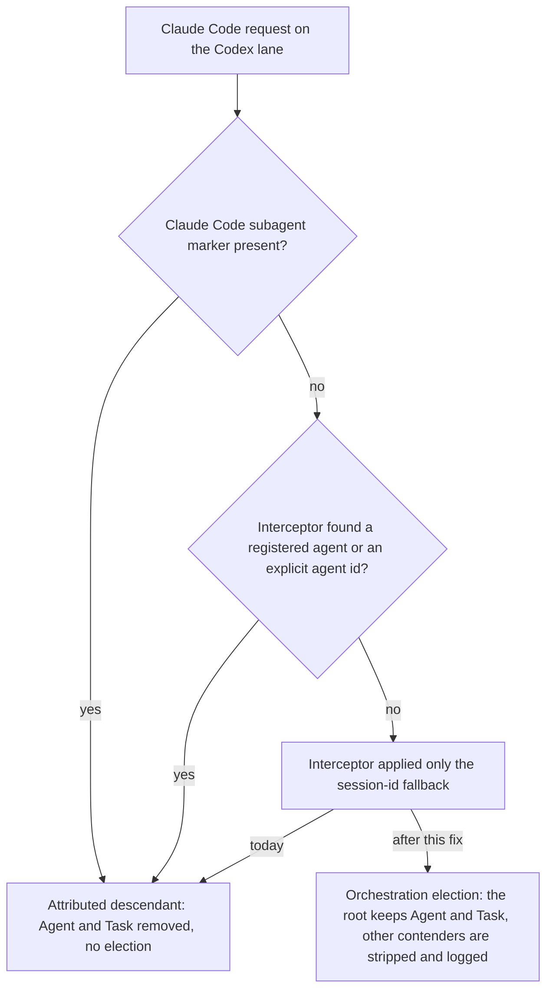

# Restore Agent Delegation on Codex-Routed Root Sessions - Plan

## Goal Capsule

- **Objective:** A Claude Code main conversation that better-ccflare routes to a Codex account can delegate to subagents again, as it does when routed to Anthropic, while a spawned subagent still cannot spawn further subagents.
- **Means:** On the Codex lane, treat a request as a subagent for containment only when a real agent identity or Claude Code's own subagent markers identify it, never because of the proxy's session-id attribution fallback; pin that boundary with regression tests; measure the effect in production for a week before deciding whether the election ratchet needs work.
- **Product authority:** The operator, who chose to fix this regression first and to plan any election change from the demotion data the fixed system produces, and who wants the work done right rather than fast.
- **Open blockers:** None.

---

## Product Contract

### Summary

Correct the Codex-lane attribution decision so that the session-id fallback the proxy applies to every Claude Code request no longer marks a main conversation as a subagent. Root turns then go through orchestration election and keep their Agent and Task tools, while real subagents are still stripped. Regression tests cover both directions at the proxy and provider boundaries, and a one-week production measurement decides the follow-up.

### Problem Frame

On 2026-07-14 the Codex provider gained a single-orchestration-root containment after a recursive subagent storm: a request marked as an attributed descendant loses its Agent and Task tool declarations without election, and any other conversation in the session that is not the elected root loses them too. The proxy marks a request as an attributed descendant when its agent interceptor reports an agent, or when Claude Code's subagent markers are present.

On 2026-07-31 the interceptor gained a session-id fallback for the runaway-loop alert: when no registered agent matches, it reports the Claude Code session id as the agent so the alert can key on per-session identity. The fallback deliberately skips model rewrites, but the Codex attribution decision was not updated, so from that day every Claude Code main conversation routed to Codex has looked like a subagent.

The effect is total and silent. Over the last 21 days, 62,772 of 64,649 Codex-served Claude Code requests carried the session-header attribution. The production trace for September 13 to 24 classifies 34,692 requests as attributed descendants and 15 as root, with the Agent tool stripped on every attributed turn, and none of 70,911 Codex responses called Agent while 1,043 called Workflow. Attributed descendants never log a demotion, so the warn line built to expose demotions had nothing to report, and the same-day ideation blamed the election ratchet instead. The operator experiences it as subagents failing to launch under Codex routing.

### Key Decisions

- KD1. **Fix the attribution regression first; plan any election change afterwards from real demotion data.** (session-settled: user-directed — chosen over one combined fix-and-de-ratchet plan and over fix-plus-announcement: election has never run for a main conversation since 2026-07-31, so there is no production demotion data to design a de-ratchet from.) Governs R1, R9, R10.
- KD2. **Change the decision that misreads the flag, not the flag itself.** The session-id fallback's second meaning is load-bearing for the runaway-loop alert and for persisted attribution, and the attribution source already distinguishes a real agent from the fallback. Governs R1, R5.
- KD3. **A subagent, for Codex containment, is a request identified by a registered agent matched on its prompt, by an explicit agent-id header, or by Claude Code's own subagent markers.** The session-id fallback identifies a session, not an agent, and never counts. Governs R1, R2.
- KD4. **Keep depth-only containment and accept parallel spawn width from the root.** (session-settled: user-approved — proposed with the tradeoff that a root can again issue eight to ten parallel spawns in one response, as GPT did in July; the operator assented with the runaway-loop alert as the backstop.) Governs R3, R4.
- KD5. **Measure with signals that already exist; add no per-request column in this fix.** (session-settled: user-approved — proposed with the tradeoff that the admission ledger stays deferred; the operator assented.) The production trace records the admission classification and the stripped tool names on every Codex turn, the demotion warn line covers rejected contenders, and the request-to-transcript join labels sessions by provider. Governs R9, R10.
- KD6. **Production takes the fix only through the operator's manual deploy from main.** This is the repository's standing rule; the measurement window starts at that deploy, not at merge. Governs R8.

### Requirements

**Attribution**

- R1. On the Codex lane, a request whose only attribution is the session-id fallback is not an attributed descendant; it enters orchestration election like any unattributed request.
- R2. A request identified by a registered agent matched on its prompt, by an explicit agent-id header, or by any of Claude Code's subagent markers is an attributed descendant exactly as today.
- R3. Orchestration election, the stripping of non-root contenders, and the demotion warn line are unchanged for requests that are not attributed descendants.
- R4. No other containment is loosened: the fix does not touch parallel tool calling or any fan-out limit.
- R5. Every other reader of the session-id fallback keeps its current behavior: the runaway-loop alert still keys on the session id, persisted attribution fields still record the fallback, and model-preference rewrites still apply only to real agents.

**Verification**

- R6. Regression tests at the proxy boundary show that a Claude Code request with only session-id attribution receives no attributed-descendant marker on the Codex lane, while a prompt-matched agent, an explicit agent-id header, and each Claude Code subagent marker still receive it.
- R7. A regression test at the provider boundary shows that an unmarked request offering Agent is classified by election and keeps Agent as root.
- R8. The fix reaches production through the standard deploy from main, run by the operator, and the measurement window in R9 starts at that deploy.

**Measurement**

- R9. Over the first week after deploy, the production trace and the request-to-transcript join show Codex-routed main conversations classified as root and calling Agent, judged by the metric and countermetric in Success Criteria.
- R10. The election de-ratchet decision is made from that week's demotion evidence: zero non-root classifications and zero demotion lines with real request ids drop it; any more than zero produce a follow-up plan written from those records.

### Actors

- A1. **Operator** — merges the fix, runs the deploy, reads the measurement, decides the follow-up.
- A2. **Main conversation** — a Claude Code session's root conversation, routed to Codex, whose requests carry the session id and no subagent marker.
- A3. **Subagent** — a conversation Claude Code spawns through Agent or Workflow; carries Claude Code's subagent markers or matches a registered agent on its prompt.
- A4. **Proxy** — better-ccflare's agent interceptor, Codex attribution decision, and Codex provider containment, plus the runaway-loop alert that keys on the session id.

### Key Flows

- F1. Root turn after the fix
  - **Trigger:** A2 sends a turn that offers the Agent tool.
  - **Actors:** A2, A4
  - **Steps:** The interceptor applies the session-id fallback as today; the Codex attribution decision finds no real agent identity and no subagent marker and sets no descendant marker; the provider runs election; the conversation is root by initial claim or continuity; Agent and Task stay in the tool list; the model may delegate.
  - **Outcome:** Delegation works on Codex as on Anthropic.
  - **Covered by:** R1, R3, R5
- F2. Subagent turn after the fix
  - **Trigger:** A3 sends a turn that offers the Agent tool.
  - **Actors:** A3, A4
  - **Steps:** Claude Code's subagent markers, or a prompt match to a registered agent, identify the request; the descendant marker is set; the provider removes Agent and Task without election.
  - **Outcome:** A subagent cannot spawn subagents; depth-one containment holds.
  - **Covered by:** R2, R4
- F3. Rollout and measurement
  - **Trigger:** The fix merges to main.
  - **Actors:** A1, A4
  - **Steps:** A1 deploys; over a week the trace records root classifications and Agent calls for Codex main conversations; A1 reads the metric, the countermetric, and the demotion evidence; A1 drops or plans the de-ratchet.
  - **Outcome:** The follow-up is decided from observed data.
  - **Covered by:** R8, R9, R10

### Acceptance Examples

- AE1. **Covers R1, R3, R6, R7.** Given a main-conversation request on the Codex lane whose only attribution is the session-id fallback and whose tools include Agent, when the proxy prepares the upstream request, then no descendant marker is present, the provider classifies the turn by election as root, and Agent remains in the tool list.
- AE2. **Covers R2, R6.** Given a request carrying Claude Code's parent-agent header, and separately one carrying the agent-id header, and separately one whose billing header marks a subagent, when prepared for Codex, then the descendant marker is present and Agent and Task are removed without election.
- AE3. **Covers R2, R6.** Given a request whose system prompt matches a registered agent, when prepared for Codex, then the descendant marker is present and Agent and Task are removed.
- AE4. **Covers R3.** Given a session whose root is already elected, when a second unmarked conversation with a different system prompt and no shared tool-call lineage sends a turn that offers Agent, then it is classified non-root, Agent and Task are removed, a demotion line is logged with the request id, and the root's state is unchanged.
- AE5. **Covers R5.** Given a session-id-attributed request after the fix, when it is processed, then the runaway-loop alert key still contains the session id and the persisted attribution source still reads as the session fallback.
- AE6. **Covers R9.** Given one week of production traffic after deploy, when the trace is read, then Codex main-conversation turns show root classification, Codex responses show Agent calls, and no attributed-descendant response shows an Agent call.
- AE7. **Covers R10.** Given the same week, when non-root classifications and real-request-id demotion lines are counted, then the de-ratchet is dropped at zero or a follow-up plan is written from the records at more than zero.

### Success Criteria

- Metric: the share of Codex-labeled Claude Code sessions (a provider serving at least 90 percent of a session's requests) with at least one Agent call in a Codex response over the week after deploy is in the same range as the Anthropic share over the same week.
- Countermetric: zero Agent calls in attributed-descendant responses, and no runaway-loop alert attributable to a Codex session, over the same week.
- Handoff: planning can produce implementation units from this contract without inventing behavior, scope, or the measurement method.

### Scope Boundaries

**Deferred for later**

- Election de-ratchet: stable root identity across prompt drift, and re-promotion after a quiet period. Decided by R10.
- A one-line announcement injected when Agent and Task are stripped, so a worker knows to delegate through Workflow or work inline.
- A per-request admission column and the parity floors of the ledger idea.
- Parallel tool calling limits when Agent is exposed, designed in July and never shipped.
- Dashboard display of session ids in the agent column, a cosmetic side effect of the fallback.

**Outside this fix**

- The session-id fallback itself and the runaway-loop alert it serves.
- The Anthropic and xAI lanes, which never strip tools.
- The plan-mode deny, which lives in the dotfiles harness.

<!-- ce-section: work-relationships -->
### How This Work Fits Together

This plan covers one area of the Codex-parity work: restoring delegation on Codex roots. The breakdown below is the current understanding, not a committed roadmap.

- Election de-ratchet and demotion announcement (ideation idea 1 as originally framed)
  - Depends on this fix: election has never run for a main conversation in production, so its drift behavior is unobserved.
  - Still to decide: whether it is needed at all, per R10.
- Codex behavior ledger and parity floors (ideation idea 3)
  - Can proceed independently of this fix; its admission column would replace the trace as the measurement source.
- Plan-mode deny (ideation idea 2, dotfiles PR #1393)
  - Can proceed independently of this fix; different repository.
- Reasoning-effort mapping, authority and persistence layer, conformance harness (ideation ideas 4 to 6)
  - Can proceed independently of this fix.

### Dependencies / Assumptions

- Assumption: Claude Code sends at least one subagent marker on every subagent request kind, including agents spawned by Workflow. If a kind carries none, election still classifies it non-root once a root exists (AE4), so containment holds, and the demotion lines counted in R10 would reveal it during the measurement week.
- Assumption: the production trace stays enabled through the measurement window; it is switched on by a local service drop-in rather than the unit file, so a drop-in change would blind R9.
- Dependency: the standard deploy from main, run by the operator (R8).
- Dependency: the request-to-transcript join labels a session by the provider that served at least 90 percent of its requests; a transcript grep over those sessions also counts Agent calls made on their non-Codex turns, so the trace's per-response tool-use record is the provider-exact source for R9.

### Outstanding Questions

**Resolve Before Planning**

- None.

**Deferred to Planning**

- Where the "real agent" predicate lives: a shared helper next to the subagent-marker check, or inline at the Codex attribution decision.
- Whether the provider-boundary test extends the existing request-transformation suite or the election suite.
- Whether the R9 measurement is a one-off query set or a small reusable script.

### Sources

- `docs/ideation/2026-09-24-codex-routed-claude-code-parity-ideation.html` — the ideation this plan descends from; its idea 1 card carries the superseded premise.
- `packages/proxy/src/handlers/agent-interceptor.ts` — the session-id fallback (commit 490a5bc55, 2026-07-31) and the prompt and header agent paths.
- `packages/proxy/src/handlers/proxy-operations.ts` — the Codex-lane attribution decision and the descendant marker header (2026-07-14, commits 527c4e7b6 and 9100ad34e).
- `packages/proxy/src/proxy.ts` — copies the interceptor result into request metadata.
- `packages/proxy/src/claude-code-request.ts` — Claude Code subagent markers (2026-08-04, commit 62df1f4e).
- `packages/proxy/src/alerts.ts` — the runaway-loop alert keyed on the reported agent (issue #367).
- `packages/proxy/src/handlers/account-selector.ts` — the only other semantic reader, which also requires a model rewrite.
- `packages/providers/src/providers/codex/provider.ts` — descendant marker read, classification, strip, demotion warn line, trace write.
- `packages/providers/src/providers/codex/orchestration-election.ts` — the election store; rejection mutates nothing (commit 25377e00a, 2026-07-14; continuity fixes in PRs #39, #132, #170).
- Existing tests: `packages/proxy/src/handlers/__tests__/agent-interceptor.header.test.ts` (session-header source), `packages/proxy/src/handlers/__tests__/proxy-operations-count-tokens.test.ts` (descendant marker), `packages/providers/src/providers/codex/provider.test.ts` (strip), `packages/providers/src/providers/codex/orchestration-election.test.ts` (election).
- Production evidence, all read-only: requests table attribution counts over 21 days; the Codex trace directory configured by the service's local drop-in, September 13 to 24; demotion lines in the shared application log, all carrying test-fixture request ids.
- `docs/plans/2026-09-24-1835-fix-disable-model-initiated-plan-mode-plan.md` — sibling plan for ideation idea 2.
