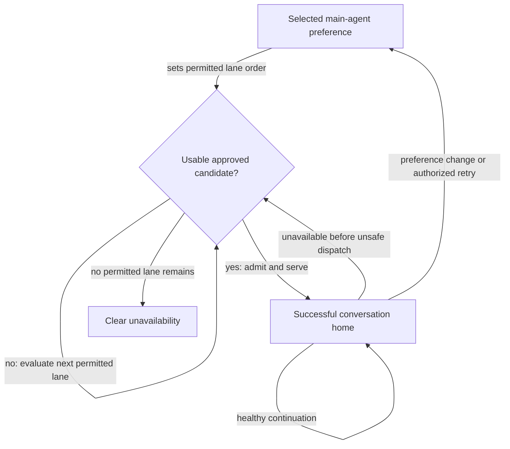
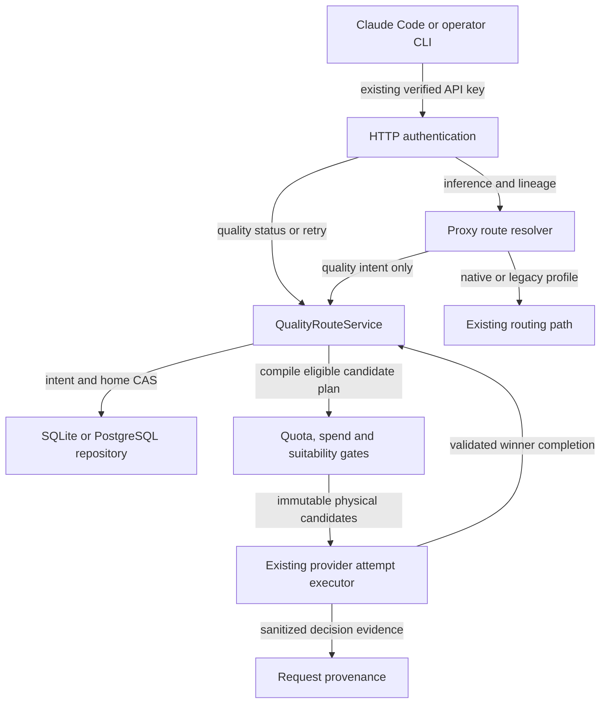
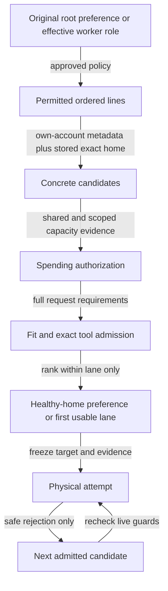
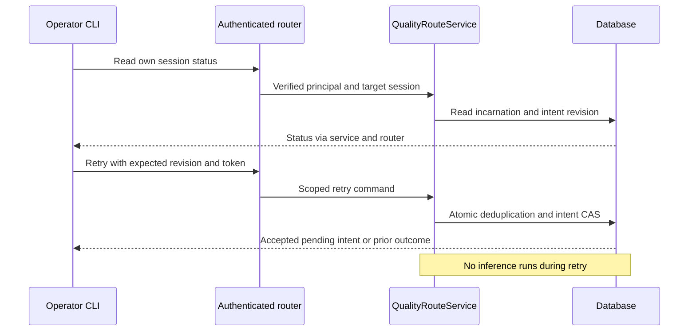
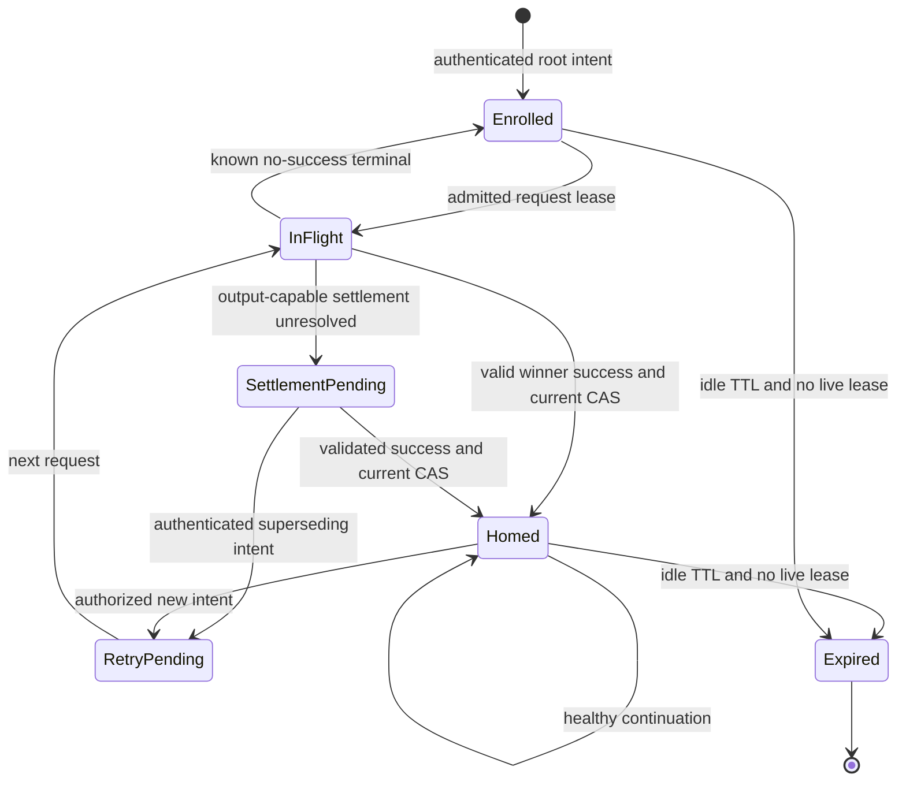

# Auto Quality Routing - Plan

## Goal Capsule

- **Objective:** Operators can choose the main agent's preferred quality in Claude Code and keep working predictably as subscription capacity changes.
- **Means:** An explicitly enrolled quality-route service, durable conversation ownership and shared admission/dispatch boundaries (KTD1-KTD8).
- **Product authority:** This Product Contract, approved on 2026-09-29; R-IDs own product behavior, KTDs own implementation choices, and units override neither.
- **Execution profile:** Test-first implementation in isolated development state; no scripted Anthropic traffic and no production activation under this plan alone.
- **Stop conditions:** Do not substitute invented capacity evidence, widen manual routing authority, or claim the GPT-5.6 cleanup without identifying its source. Missing per-model evidence blocks that lane's activation, not independent implementation units.
- **Completion ownership:** The implementation owner supplies the Verification Contract evidence and independent review; the operator separately authorizes deployment and policy activation.

---

## Product Contract

### Summary

Add Auto and explicit main-agent preferences to Claude Code's model picker.
One approved-model policy governs main-agent fallback, suitable worker models and subscription eligibility.
The policy can evolve without changing the meaning of the choices or moving healthy conversations unexpectedly.

### Problem Frame

At source and production revision `8c80da579371dd4b6aa04061b81753d4249e1f3b`, Codex family defaults come from catalog positions: Fable and Opus use the first model, Sonnet the second, and Haiku the third.
The recent catalog promotion moved Opus-profile traffic to `gpt-6.1-sol` and Sonnet-role traffic to `gpt-6-astra`.
That behavior proves catalog following, not the suitability of Astra for Sonnet work.
Historical picker IDs can also name a model that the current route no longer serves.

The operator wants Astra available as a frontier alternative to native Fable, followed by approved Opus-level fallback when those allowances are unavailable.
Shared account limits, model-family limits and session continuity make physical-model selection alone insufficient.
An unwanted GPT-5.6 picker entry was reported, but its origin was not found in the checked running profiles, settings, launcher or model-only process environment.

### Key Decisions

- **Policy-driven Auto.** Reuse the routing system and make its choices tunable instead of adding a learned model selector. Governs R1, R20. (session-settled: user-approved — chosen over a per-request learned router: predictable behavior is the first-version priority.)
- **Approved quality lanes.** Provider promotion order is discovery evidence, not intelligence classification. Governs R2-R5. (session-settled: user-approved — chosen over positional tier assignment: Astra must not become a Sonnet default merely by moving down the catalog.)
- **Preferences with bounded fallback.** Main-agent choices express quality intent rather than guaranteeing one immutable physical version. Governs R2, R3, R14. (session-settled: user-approved — chosen over exact-model-only pins: useful work should continue through approved subscription fallback.)
- **Efficient workers remain independent.** A main-agent preference is not a request to run every worker on that model. Governs R10. (session-settled: user-approved — chosen over frontier models throughout: suitable lower-tier workers preserve capacity.)
- **Stable accepted homes.** Continuity takes precedence over immediate promotion when capacity returns. Governs R11-R13. (session-settled: user-approved — chosen over returning on the next available turn: avoid unnecessary model changes and cache loss.)
- **Provider-specific eligibility.** Treat the reported Fable restriction as an entitlement question, not a universal percentage formula. Governs R6-R8. (session-settled: user-approved — chosen over a fixed 50% account-weekly cutoff: actual account and family limits can differ.)
- **Concrete initial model assignments.** Start from named approved lines, leaving additional cross-provider worker mappings unapproved. Governs R4, R5, R10. (session-settled: user-approved — chosen over leaving assignments open: planning must not invent model-quality equivalence.)
- **Observable retry intent.** Provide a supported operator action rather than assuming repeated model IDs signal a new selection. Governs R12, R21. (session-settled: user-approved — chosen over relying on same-row picker reselection: continuation and retry must remain distinguishable.)
- **Evidence before dispatch.** Unknown request capacity is not proof that a fallback fits. Governs R9. (session-settled: user-approved — chosen over unknown-capacity fail-open: do not trade away context or output silently.)

### Actors

- A1. **Operator:** Chooses Auto or a main-agent preference and approves policy changes.
- A2. **Main agent:** Conducts the root conversation under the selected preference and permitted fallback.
- A3. **Worker agents:** Perform delegated work under suitable requested or approved roles.
- A4. **Better CC Flare:** Evaluates approved models, request requirements, provider eligibility and conversation continuity.

### Requirements

**Choices and quality policy**

- R1. Offer Auto, Fable-preferred, Astra-preferred and Opus-latest main-agent choices with understandable routing semantics.
- R2. The default Auto policy uses the main-agent ladder native Fable, then approved Astra, then latest approved Opus-level models, considering eligible accounts within a preferred lane before descending.
- R3. Explicit main-agent preferences enter that approved ladder at their named lane and never silently select an earlier lane.
- R4. Assign quality lanes through the initial approved model policy below rather than provider catalog positions; every additional model-line or cross-role assignment requires operator approval.
- R5. Automatically follow an available, supported successor only when provider catalog or authoritative release evidence establishes the same approved model line on that account, not merely a higher catalog rank or unfamiliar name.

The following table is the initial policy owned by R4; it assigns model lines, not permanent version pins or measured intelligence equivalence.

| Role | Approved model lines | Position or use |
|---|---|---|
| Preferred main | Native Claude Fable | First main-agent lane |
| Frontier alternative | GPT Astra | Second main-agent lane |
| Opus-level main fallback | Native Claude Opus; GPT Sol | Third main-agent lane |
| Standard worker | Native Claude Sonnet | Default standard-worker target |
| Lightweight worker | Native Claude Haiku | Default lightweight-worker target |
| Explicit higher-tier worker | Native Claude Fable; GPT Astra; native Claude Opus; GPT Sol | Corresponding explicitly requested higher-tier role |

Worker targets follow their named roles, not the main ladder's sequence; R10 owns worker fallback.
R2 and R3 own main-agent fallback order; neither the table row order nor catalog rank adds a new fallback.
A discoverable but unclassified model can remain available to existing intentional manual routes under R19 without entering Auto.

**Eligibility and request suitability**

- R6. Auto must enforce applicable shared and family-specific limits for each account/model candidate regardless of optional legacy enforcement settings, using active state, freshness and resets independently from the spending authorization in R15.
- R7. A Fable-only restriction must not exclude otherwise usable models on the same account.
- R8. Missing, inactive, stale or expired limit data must not manufacture exhaustion, including through a legacy mirror of a present authoritative window; independently valid rejection evidence remains actionable.
- R9. Skip candidates without sufficient evidence that the full input, requested output budget, modalities and required tools are supported, without silently truncating input, reducing output or removing tools solely to make a fallback fit.

**Workers and continuity**

- R10. Route workers within the approved role they request, reporting unavailability when that role has no usable candidate rather than implicitly upgrading to the parent's model or dropping to another role.
- R11. Retain each conversation's successful, healthy model/account home until genuine unavailability or an explicit operator selection requires reconsideration.
- R12. New sessions, a change of preference and an authenticated explicit retry-preferred action evaluate policy from the selected starting lane, while an unchanged model ID alone remains continuation.
- R13. Change routes only at a safe request boundary, never replaying work after irreversible dispatch or meaningful response output.

**Boundaries and explanation**

- R14. When every permitted main-agent lane is unusable, report clear unavailability rather than silently falling below the approved Opus-level floor.
- R15. Auto must have affirmative operator authorization before spending outside approved subscription allowances; provider-enabled or unknown overage is not authorization.
- R16. Authenticated explanations must identify the requested preference, selected quality lane, served physical model and why a preferred lane was skipped, including initial selection when no previous home exists.
- R17. Picker labels must describe current routing meaning rather than imply a fixed physical model from a historical route name.
- R18. Correct the unintended GPT-5.6 picker entry only after identifying its source, preserving intentional older-model choices.
- R19. Explicitly enroll the new quality-policy routes without weakening existing route IDs, hard force-route guarantees, native-model compatibility or unrelated manual configuration.
- R20. Allow routing priorities and approved role assignments to improve over time using observed outcomes, without requiring a learned per-request classifier or covert production model experiments.

**Intent and account identity**

- R21. Preference changes and retry actions must be authorized for the caller's session, and an older request completion must not reinstate superseded routing intent.
- R22. Discovery evidence, quota evidence and inference must refer to the selected upstream account identity, including each fallback attempt rather than inheriting stale caller account headers.

### Key Flows

- F1. **Start or explicitly change a main conversation.**
  - **Trigger:** A1 starts a session, changes the main-agent preference, or invokes retry-preferred.
  - **Steps:** A4 evaluates the selected starting lane, filters account/model candidates for eligibility and request suitability, then chooses within the first usable permitted lane.
  - **Outcome:** A2 receives an accepted route whose preference and fallback provenance can be inspected.
  - **Covers:** R1-R9, R12, R14-R17, R21, R22.

The following flow illustrates F1 and continuity under R11-R14; the prose remains authoritative.

- F2. **Delegate work.**
  - **Trigger:** A2 creates A3 for a task.
  - **Steps:** A4 resolves the worker's supported preference or approved role, checks eligibility and request suitability, and establishes that worker conversation's own home.
  - **Outcome:** Worker routing does not change the main conversation's preference or successful home.
  - **Covers:** R6-R11, R13, R15, R16, R19.

- F3. **Exhaustion and recovery.**
  - **Trigger:** A provider's valid limit or availability evidence makes a current lane unusable.
  - **Steps:** A4 distinguishes shared from family-only restrictions and evaluates permitted fallback at a safe boundary.
  - **Outcome:** Recovery follows R11-R14; unrelated usable account/model combinations remain eligible per R7.
  - **Covers:** R6-R9, R11-R16.

### Acceptance Examples

These are hypothetical acceptance scenarios, not claims that new routing behavior has been exercised.

- AE1. **Preferred lane and explicit control.** Covers R1-R3, R12.
  - **Given:** Fable, Astra and approved Opus candidates are all eligible.
  - **When:** A new session selects Auto, Fable-preferred, Astra-preferred or Opus-latest.
  - **Then:** Its main agent starts on the respective preferred lane, with fallback constrained by that choice.

- AE2. **Family-only Fable exhaustion.** Covers R2, R6, R7.
  - **Given:** An account has authoritative Fable-only unavailability while remaining eligible for other families, no other eligible and request-suitable Fable candidate is available, and an approved Astra candidate is usable.
  - **When:** A Fable-preferred main request needs a route.
  - **Then:** It uses the Astra fallback; the account remains a candidate for otherwise eligible worker models.

- AE3. **Provider-specific weekly boundary.** Covers R6-R8.
  - **Given:** Provider evidence declares Fable unavailable at a plan-specific weekly boundary while Opus remains usable.
  - **When:** Eligibility is evaluated.
  - **Then:** The Fable restriction is honored without benching the entire account; a generic 50% reading alone is not fabricated proof of that restriction.

- AE4. **Inactive or stale evidence.** Covers R6-R8.
  - **Given:** A stored Fable window reads 100% but is inactive, stale or already reset, with no separate valid exhaustion evidence.
  - **When:** Routing evaluates that account.
  - **Then:** That row alone does not exclude its Fable lane or other families.

- AE5. **Catalog promotion.** Covers R4, R5, R17.
  - **Given:** Astra is approved for the frontier lane, and a new supported Sol generation is promoted above it in the catalog.
  - **When:** Catalog discovery refreshes.
  - **Then:** The approved Sol line can update without reclassifying Astra as Sonnet; an unclassified model does not gain an Auto quality assignment from rank alone.

- AE6. **Recovery without bouncing.** Covers R11, R12, R16.
  - **Given:** A session has successfully fallen back to Astra, which remains healthy, and Fable capacity returns.
  - **When:** The session continues with the same profile ID, a new session starts, or the operator invokes authenticated retry-preferred.
  - **Then:** Continuation keeps its home; the new session or explicit retry evaluates the current preferred ladder.

- AE7. **Independent worker role.** Covers R4, R9-R11.
  - **Given:** The main agent uses Astra and a worker requests a supported Sonnet-level role.
  - **When:** The worker is routed.
  - **Then:** It uses an eligible native Sonnet candidate under the initial policy, or reports worker-role unavailability; it does not inherit Astra from the parent or catalog position, and the parent's home remains unchanged.

- AE8. **Fallback cannot fit.** Covers R9, R14, R15.
  - **Given:** Remaining fallback candidates cannot fit the request's context or required capabilities.
  - **When:** The preferred lane becomes unavailable.
  - **Then:** Routing reports unavailability without truncating content, dropping required tools, selecting a below-floor main model or enabling unapproved paid rescue.

- AE9. **No replay after work.** Covers R13.
  - **Given:** Hosted-tool dispatch or meaningful response output has made replay unsafe.
  - **When:** A later provider failure occurs.
  - **Then:** Routing does not replay the request on another model or account.

- AE10. **Picker cleanup and compatibility.** Covers R17-R19.
  - **Given:** The affected client's GPT-5.6 row has been traced to an unintended stale source, while intentional legacy routes also exist.
  - **When:** Picker cleanup is applied.
  - **Then:** The unintended row is corrected without breaking accepted historical route IDs, intentional pins or explicit force routing.

- AE11. **Policy tuning without remapping.** Covers R3, R10-R12, R20.
  - **Given:** Main and worker conversations have healthy, eligible homes, and the operator adjusts approved routing priorities.
  - **When:** Existing conversations continue and new routing decisions are needed.
  - **Then:** Existing homes remain stable; new sessions and worker conversations evaluate the updated policy without changing the meaning of explicit preferences.

- AE12. **Unknown fit and output budget.** Covers R9, R13, R14.
  - **Given:** A candidate has unknown context capacity, unsupported modalities, or insufficient capacity for the full input plus requested output budget.
  - **When:** Auto evaluates the candidate before dispatch.
  - **Then:** It skips that candidate without trimming the request; an upstream rejection can lead to another attempt only while R13 still permits replay.

- AE13. **Inactive generic window with an exhausted mirror.** Covers R6-R8.
  - **Given:** A fresh authoritative weekly limit is explicitly inactive while its legacy flat mirror reports 100% utilization and a future reset.
  - **When:** Auto evaluates capacity.
  - **Then:** The mirror does not turn that inactive window into account-wide exhaustion; any other independently valid capacity blocker still applies.

- AE14. **Overage availability without spending permission.** Covers R6, R15.
  - **Given:** Fresh evidence exhausts a model family's included allowance, the provider reports overage enabled or unknown, and the operator has not approved extra spending.
  - **When:** Auto evaluates that account/model combination.
  - **Then:** Optional legacy enforcement settings and provider overage availability cannot authorize the attempt outside the exhausted allowance.

- AE15. **Retry and late completion.** Covers R11-R13, R21.
  - **Given:** An older request is in flight when an authorized operator changes preference or invokes retry-preferred for that session.
  - **When:** The older request later succeeds.
  - **Then:** Its completion cannot restore the superseded routing intent; another caller's retry cannot change this session's preference.

- AE16. **First-request fallback explanation.** Covers R2, R6, R16.
  - **Given:** A new Auto session has no route home, all preferred Fable candidates are unusable for a known reason, and Astra is eligible.
  - **When:** The first request is served by Astra.
  - **Then:** Authenticated observability distinguishes the requested Auto preference, selected frontier lane, physical model and reason Fable was skipped without requiring a prior-home repin event.

- AE17. **Consistent selected account.** Covers R6, R19, R22.
  - **Given:** A request falls back between two accounts whose catalog entitlement and remaining quota differ, and the inbound request contains the earlier account's identity header.
  - **When:** Auto admits and dispatches the second candidate.
  - **Then:** Its catalog evidence, quota decision and upstream inference identity all belong to the selected second account, not the stale caller header.

### Scope Boundaries

- This work owns the end-to-end meaning of Claude Code model choices and the resulting main/worker routing policy.
- A learned task classifier, automatic production experiments and a separate optimization dashboard are deferred; R20 defines the first-version tuning scope.
- Existing manual provider choices and deliberate hard pins remain outside Auto unless explicitly enrolled in its policy, per R15 and R19.
- Deployment, credential changes and new paid provider enrollment are not authorized by this requirements document.

### Dependencies / Assumptions

- **Astra classification:** Its frontier placement is an operator-approved policy choice under R4, not independently measured equivalence to native Fable.
- **Fable allowance:** The operator reports provider-enforced Fable availability tied to approximately half the Anthropic weekly allowance. The precise provider-specific relationship is unverified; R6-R8 govern behavior without assuming a universal numeric ratio.
- **Telemetry identity:** Existing successful request records identify the proxy's recorded routed model, not an independent upstream model attestation.
- **Picker provenance:** The GPT-5.6 row remains unexplained after the bounded settings, running-profile and launcher checks; R18 cannot be claimed delivered without tracing the affected client.
- **Validation safety:** `AGENTS.md` prohibits scripted traffic to Anthropic-backed accounts. Future routing validation must use offline tests, non-Anthropic forced routes, or a real interactive Claude Code session for that lane.

### Outstanding Questions

**Deferred to Implementation**

- Capture the reported Fable restriction through the scoped evidence path specified by KTD5; no universal 50% rule is authorized. If available provider evidence cannot identify the restriction, retain an explicit unknown result instead of manufacturing an account bench.
- Establish the missing exact-model and subscription-endpoint capability evidence identified in KTD6 before enabling affected candidates. Astra/Sol output-capacity evidence remains an activation gate; small successful requests and token estimates cannot establish unknown model limits or capabilities. Token accounting may use trusted provider/model-specific counts where supported, or documented conservative local estimates with explicit headroom under KTD6; estimates must be labeled as estimates, not exact guarantees.
- Observe the affected native client's GPT-5.6 picker row and identify its source in U8. The checked profiles, environment overrides and `modelPicker` setting did not establish it; cleanup remains incomplete until that observation is available.

The remaining architecture, persistence, authorization, upgrade, explanation and test-design questions are resolved by KTD1-KTD8 and U1-U8 below.

### Sources / Research

Initial source and production observations were made at `8c80da579371dd4b6aa04061b81753d4249e1f3b`.
The implementation worktree was advanced to `7f0f61e61b9eb7478f516af5e213c458fadd82cd`, and the review below checked source at that revision, retaining the selected-account inference fix `9a3fca9e`.
These facts describe the starting point, not a completed feature or a claim that production matches the worktree.

- `packages/proxy/src/codex-model-catalog.ts:304-356,514-525`: catalog normalization and positional family defaults.
- `packages/proxy/src/model-route-profiles.ts:228-234,405-416,603-610`: configured public IDs, display labels and discovery metadata.
- `packages/proxy/src/model-route-profiles.ts:663-759` and `packages/proxy/src/proxy.ts:1222-1263,2607-2626`: admission-conditioned root intent and ordinary descendant model handling.
- `packages/proxy/src/handlers/account-selector.ts:2482-2542,2578-2643`: capability-descendant fallback rungs and eligibility; descendants are not universally confined to the root pool.
- `packages/proxy/src/handlers/usage-throttling.ts:80-157,485-590`: active/fresh/reset-aware account and family exhaustion checks.
- `packages/proxy/src/handlers/native-quota-policy.ts:263-318,378-409`: existing proof-conditioned native Fable-to-Opus backup, distinct from the proposed cross-provider ladder.
- `docs/solutions/integration-issues/route-profile-expected-physical-model-checked-before-provider-defaults.md`: prior migration from physical pins to automatic catalog roles and its compatibility constraints.
- `packages/proxy/src/model-route-profiles.ts:466-481,617-635,707-749`: request resolution lacks a same-choice reselection discriminator; admission-time root generations are distinct from successful-response home updates.
- `packages/load-balancer/src/strategies/session-affinity.ts:462-518,969-1021`: descendant owner comparison and prior-home repin reasons do not by themselves establish retry-intent fencing or complete initial-lane explanations.
- `packages/config/src/index.ts:1929-1942` and `packages/proxy/src/handlers/account-selector.ts:1298-1338`: ordinary model-family capacity enforcement defaults off; Auto must not inherit that opt-out.
- `packages/proxy/src/handlers/usage-throttling.ts:84-161,415-428,519-563`: inactive generic windows can be supplemented from flat mirrors, and provider overage availability affects legacy family exclusion. These are reuse hazards for R6, R8 and R15, not authorization to change unrelated manual routes.
- `packages/proxy/src/handlers/proxy-operations.ts:979-1009`: the current Codex context-admission path can fail open when capacity is unknown; R9 deliberately requires sufficient evidence for Auto.
- `packages/providers/src/providers/codex/provider.ts:2623-2652`, `packages/providers/src/providers/codex/api-usage.ts:62-96,205-266` and `packages/proxy/src/codex-model-catalog.ts:364-388`: inference clears stale caller account headers and binds the selected token's account; usage and discovery identity need end-to-end consistency checks.
- `packages/types/src/request.ts:55-64`, `packages/database/src/repositories/request.repository.ts:183-188,240-247,285-294` and both migration files: existing winner/attempt provenance can be reused before adding new persistence.
- [Claude Code model configuration](https://code.claude.com/docs/en/model-config), [gateway protocol](https://code.claude.com/docs/en/llm-gateway-protocol) and [SDK hook reference](https://code.claude.com/docs/en/agent-sdk/hooks): documented discovery, explicit picker configuration and model-switch hooks do not establish a gateway-visible same-value reselection event.
- Related issue [#370](https://github.com/StartupBros-com/better-ccflare/issues/370) concerns existing catalog freshness and capability metadata, not the new quality-tier Auto policy.
- Read-only production observations on 2026-09-29: Opus-profile traffic changed to `gpt-6.1-sol`, while Sonnet-role traffic continued on `gpt-6-astra`; those observations motivated R4 but do not establish intelligence equivalence.

---

## Planning Contract

**Product Contract preservation:** R1-R22, A1-A4, F1-F3, AE1-AE17 and all settled product decisions are unchanged; planning questions are classified and resolved in place.

**Operator amendment — 2026-09-30:** The operator selected conservative estimates for request accounting: use trusted provider/model-specific counts where supported and explicitly conservative local estimates with headroom otherwise, labeled as estimates rather than exact guarantees. Implementation must choose and document the policy, test its boundaries and report accounting source/headroom; no numerical margin is prescribed here. Preserve the full input, original requested output reserve, modalities/tools, spending authorization, replay safety and all model-lane/session constraints. Unknown model context, output limits or required tool capability remain unavailable. This changes technical accounting only; all other activation gates remain, fixtures are not live evidence, and no production activation or inference is authorized.

**Research base:** `7f0f61e61b9eb7478f516af5e213c458fadd82cd`, including the selected-account inference fix `9a3fca9e`.
All new files, fields and operations named below are proposed additions, not existing APIs.

### Key Technical Decisions

- KTD1. **Add a separate quality-route service.** Introduce `QualityRouteService` and a discriminated quality-route intent alongside native and legacy profile resolution, injected once into the API router and proxy by the server. New public IDs use `claude-bccf-quality-` with `auto`, `fable`, `astra` and `opus` choices; do not reinterpret existing `claude-bccf-route-` IDs. A validated `quality_routing_policy` config value, with an environment JSON override following existing config precedence, explicitly enables the service; absence leaves legacy discovery and routing unchanged. Invalid nonempty policy fails startup rather than silently enabling defaults. Implements R1-R5, R19-R20.
- KTD2. **Compile a versioned policy into ordered candidates.** The normalized policy contains the R4 model-line assignments, explicit enrolled account IDs, approved same-line upgrade rules, within-lane ordering and separate spend grants. Compute an immutable policy revision from the validated content. Keep catalog revisions separate from policy approval: a catalog can supply availability and successor evidence, not approval for a new line. Resolve native family versions from validated native metadata and Codex targets from each account's own listing, preserving last-good evidence only within its documented validity. Use existing account-priority/usage ordering within one lane; it cannot cross the R2/R3 ladder. Materialize and re-admit a stored exact account/model home independently of the newest target in its line: a successor's arrival does not remove an eligible predecessor from continuation candidates. New intent and genuine unavailability use current successor resolution. Capture model, account, policy revision, catalog evidence and capability evidence per candidate. Implements R2-R6, R10-R11, R15, R20, R22.
- KTD3. **Persist intent separately from successful homes.** Add repository-backed quality-session and quality-home state rather than extend the in-memory legacy registry's meaning. A session key combines the verified API-key principal and Claude Code session ID; a never-reused incarnation distinguishes a new enrollment after expiry. Root and trusted child conversations have independent intent revisions and successful-home versions. Reserve a durable root-order ticket at authenticated ingress before body/interception awaits; serialize reservation submission per session within a process, with database reservation order defining the cross-instance linearization point. Enrollment/change/leave-Auto acceptance must compare that ticket with the latest accepted intent watermark. Retry commands advance the same watermark transactionally, so a late-resolved older request cannot become a new selection. Invalid/withdrawn reservations do not erase accepted intent. Mutating controls and accepted inference activity refresh the configured session idle TTL; status reads do not. Bounded in-flight leases protect long requests until terminal completion or timeout. Restart preserves live state; cleanup removes expired state, never evicts active homes to make room. State unavailability rejects new Auto work locally. Implements R11-R13, R21. (session-settled: user-approved — chosen over memory-only Auto homes: service restarts must not silently promote healthy fallback sessions.)
- KTD4. **Use explicit authenticated control requests.** Register read-only `GET /v1/quality-routing/sessions/:sessionId` and `POST /v1/quality-routing/sessions/:sessionId/retry-preferred` in the API router. Require a verified `apiKeyId`, even when ordinary auth permits bootstrap or exempt requests; API-only keys may control only their own principal/session namespace. POST carries the current incarnation, expected intent revision and an idempotency token. One transaction records the token and payload digests, advances intent and saves the response: exact redelivery returns the original result, different payload reuse conflicts. Unknown/expired sessions are not enrolled by controls. The CLI is a thin loopback-only wrapper using an explicitly named environment variable containing the same existing inference credential; no key discovery, key creation, local-control-secret substitution or credential arguments. Retry changes next-request intent only, never launches inference or grants spend permission. Implements R12, R16, R21. (session-settled: user-approved — chosen over hooks or assumed picker events: a supported API/CLI action makes retry observable without changing the client harness.)
- KTD5. **Separate canonical quota evidence from Auto permission.** Extend the core normalization boundary to produce source-aware capacity evidence while retaining the existing history projection's compatibility. For the Auto evidence view, presence of an authoritative generic window suppresses its flat mirror even when inactive or invalid; invalid is unknown, not zero usage. Evaluate account, family and exact-model blockers separately, using the existing freshness/reset and authoritative rejection rules. Auto invokes scoped checks unconditionally, independent of legacy opt-out flags. A second spending guard requires affirmative operator policy for billable rescue; enabled/unknown provider overage is never a grant. When subscription-only execution cannot be established, skip with an authorization/evidence reason, not fabricated exhaustion. Recheck both gates immediately before physical dispatch. Implements R6-R8, R15; does not silently alter manual-route billing or pacing policy.
- KTD6. **Make suitability evidence explicit and conservative.** Add one provider-level Auto admission result with `admit`, `reject` and `unknown`, plus a bounded reason and evidence reference. Preserve capability-bearing input before translation, then validate the final concrete attempt against account entitlement, model context, requested output budget, modalities, local tools and exact hosted-tool proof. Known failure and unknown evidence both skip a candidate, but remain distinct in provenance. Use exact-model capability records with source/revision metadata; do not infer successor capacities from name prefixes. Use trusted provider/model-specific counts where supported, otherwise an explicitly conservative local estimate with documented headroom covering the final provider envelope and original requested output reserve. Report the accounting source and headroom, label estimates as estimates and never present the existing low-confidence heuristic or an estimate as an exact guarantee. Unknown model context/output limits or required tool capability remain unavailable; an estimate cannot supply missing capability evidence. A model line enters Auto only after its records and documented accounting policy admit a representative supported request and reject the documented boundaries. Implements R5, R9, R14; evidence gates are detailed below.
- KTD7. **Use one candidate plan and three separate outcome decisions.** A quality candidate compiler feeds the existing provider-attempt machinery, freezing the physical target across asynchronous token refresh and catalog changes. Reuse hosted-dispatch and deterministic-failure ledgers. Decide independently whether another attempt is safe, whether the current home is genuinely unavailable, and whether the winning response completed successfully. Only the last decision permits a home CAS; replacing an existing home also requires the second or explicit new intent. A pre-dispatch transient can serve a request-only alternative without permanently replacing a healthy home. Nonstream success must be validated; streams require the provider's valid terminal-success marker, not HTTP 200. Failed, cancelled, truncated and losing responses cannot install a home. Before output-capable dispatch, persist the concrete candidate and conditional settlement identity in a durable unresolved-attempt record. A failed/ambiguous settlement retries only the conditional persistence operation, never inference; continuation remains locally blocked while settlement is unresolved, including after restart. Lease expiry alone cannot erase that fence or pretend the conversation never had a dispatch. An authenticated explicit retry with new intent can supersede the unresolved attempt without replaying it; an old completion remains fenced. A post-output database failure never triggers replay. Implements R9-R14, R21-R22.
- KTD8. **Extend provenance without overloading legacy fields.** Keep existing requested/served model fields, descendant fallback rungs and repin reasons intact. Add a bounded typed quality-decision envelope containing policy revision, requested preference/worker role, selected lane, physical model and ordered skipped-lane reason summaries. Store it in a nullable request column with SQLite/PG fresh-and-upgrade parity; old rows map to no quality decision. Exclude prompts, credentials and raw quota payloads. Winner and zero-send terminal recorders both populate it, preserving late-save merge semantics. Expose it only through authenticated quality status and existing authorized request-history paths; the unauthenticated account badge does not gain these fields. Implements R16-R17, R19.

### High-Level Technical Design

**Component boundary (KTD1-KTD8).** Existing legacy paths remain beside, not inside, the new quality compiler.

**Candidate data flow (KTD2, KTD5-KTD7).** One plan is shared by account selection and physical attempts; lower layers may reject its candidates but cannot invent new ones.

**Control protocol (KTD3, KTD4).** A lost response cannot create a second retry transition.

**Conversation lifecycle (KTD3, KTD7).** Enrollment exists before the first root stream completes, so workers can inherit the policy without inheriting its model.

**Durable objects and expiry (KTD3-KTD4).** Store opaque identity, route facts and control digests only.

| Proposed object | Key and authoritative state | Lifetime and concurrency |
|---|---|---|
| `quality_route_sessions` | Principal namespace, session ID, incarnation, root preference, enrollment flag, root intent revision, idle expiry | Transactional enrollment/change; never reuse an expired incarnation |
| `quality_route_homes` | Session incarnation plus root or trusted child conversation key; requested role, conversation revision, home version, account/model/line and evidence revisions | Conditional success write; root retry does not reset independent child homes |
| `quality_route_commands` | Incarnation plus idempotency-token digest, payload digest and saved outcome | Retained for the incarnation's control lifetime; duplicates do not refresh activity |
| In-flight and settlement state | Incarnation, conversation/revision, concrete candidate, expected home version and bounded lease | Leases expire, but unresolved output-capable dispatch remains fenced until conditional settlement or explicit superseding intent |
| Request quality decision | Request ID and KTD8 envelope | Existing request-history retention; independent of live session cleanup |

Use database-side atomic conditions in both adapters, not a read/then-unconditional-write facade sequence.
Idempotency retention and active-session bounds must reject excess new commands/enrollments rather than delete live fences.
Successful homes are not bearer capabilities; every continuation still passes current authorization and admission.

**Authority and precedence (KTD1, KTD3-KTD5).**

| Input state | Planned result |
|---|---|
| Feature absent/disabled, native or legacy request | Existing behavior unchanged |
| Enabled quality ID, verified key and valid session | Enroll or continue scoped quality intent |
| Quality ID without verified principal or stable root session | Local error; no guessed cross-request state or inference fallthrough |
| Quality ID plus hard account override or conflicting route demand | Reject before intent mutation or dispatch |
| Unknown reserved quality ID or malformed control path | Local typed rejection; never forward to a provider |
| Root changes between quality preferences | Advance root intent; retain independent child homes and fence old root completion |
| Root selects native/manual | Record leave-Auto root intent; new children no longer inherit Auto, already enrolled children keep their independent authorized lifecycle |
| Child without stable trusted identity | Request-only quality resolution; never share a guessed home |
| Control authenticated only through bootstrap/exemption/local-control secret | Deny quality control; preserve old endpoint exemptions exactly |

Existing clients sharing one API key share one authenticated principal; this plan does not claim per-human separation within that key.
Descendant inference fields cannot change root intent.
Possession of the principal's control-capable API key authorizes its scoped control API regardless of which local process holds it; this is not a separately authenticated human-versus-child boundary.

**Public control contracts (KTD4, KTD8).** These are new contracts, not descriptions of existing routes.

| Operation | Inputs | Success | Failure behavior |
|---|---|---|---|
| Quality discovery | Existing authenticated model-discovery request | Add enabled quality choices with stable semantic labels | Omit disabled choices; no provider inference |
| Session status | Verified key plus session ID | Current intent, pending versus last-successful home, bounded quality explanation | Unknown/expired is explicit; no write or TTL refresh |
| Retry preferred | Same scope plus incarnation, expected revision and idempotency token | Saved pending-intent outcome | Conflict for stale revision/token reuse, denied for wrong principal; no new session |
| CLI status | Explicit session and loopback origin, selected credential environment-variable name | Structured status | Missing credential is an actionable local failure, not secret discovery |
| CLI retry | Same inputs, status-derived revision and generated operation token | Structured pending-intent outcome | Retries reuse the token; redirects and credential-bearing URLs rejected |

### Admission Evidence and Activation Gates

KTD6 separates approval of a quality line from capability evidence and the accounting policy used to assess whether a particular request fits its current physical model; conservative estimates are operational admission evidence, not exact fit guarantees.
The following public limits are source facts, not proof of a subscription account's entitlement.

| Initial line | Model-capacity source | Additional admission evidence |
|---|---|---|
| Native Fable | Official Fable 5.1 metadata: 1M context, 128K synchronous API output | Selected-account availability; applicable endpoint/beta restrictions; forced-tool-choice veto |
| Native Opus | Official Opus 5.5 metadata: 1M context, 128K synchronous API output | Same account and endpoint qualification, not blanket version-prefix inheritance |
| Native Sonnet | Official Sonnet 5.5 metadata: 1M context, 128K synchronous API output | Worker-role membership and current tool-choice rules |
| Native Haiku | Official Haiku 4.5 metadata: 200K context, 64K synchronous API output | Exact dated/alias resolution and supported requested tools |
| GPT Astra | Selected account's own model listing for context capacity and effective percentage | Sourced exact-model/subscription output and modality/tool support; currently incomplete in inspected metadata |
| GPT Sol | Same account-local evidence, never copied from `gpt-5.6-sol` | Same output/capability evidence gate; public Sol 6.1 description is not a limit declaration |

Native metadata must retain the Models API's `max_input_tokens`, `max_tokens` and capability fields when already supplied by approved catalog acquisition, rather than reducing all listings to IDs and labels.
No new scripted requests to Anthropic accounts are authorized for planning or validation; public documentation and existing approved metadata can seed the exact known model records.
API-only limits do not establish broader subscription access.
For Codex, preserve richer own-listing fields when actually present and source exact missing fields from an authoritative applicable contract; absence remains unknown.

Input accounting remains a release gate, using trusted provider/model-specific counts where supported and explicitly conservative local estimates with headroom otherwise.
Implementation must choose and document an explicit conservative policy for the final provider envelope, including framing, tool schemas, every supported modality and the full original requested output reserve; this plan prescribes no numerical margin.
Report the accounting source, policy and applied headroom, distinguishing trusted counts from estimates; conservative estimates are not exact guarantees. The existing character/byte heuristic alone is insufficient without the documented conservative policy and headroom.
Each supported modality needs applicable accounting under that policy; unsupported image/document inputs or inputs without a defensible conservative accounting policy produce `unknown` rather than an invented count. Unknown model context/output limits or required tool capability remain unavailable regardless of the input estimate.
Boundary tests must cover trusted counts and conservative estimates against known model limits without truncating input, reducing the output reserve or removing modalities/tools to make a request fit.
For subscription Codex, dropping unsupported `max_output_tokens` on the wire does not justify ignoring the requested output reserve or claiming an enforced output cap.

These gaps do not prevent implementing the typed evidence/admission path or other units, but affected lanes must remain unavailable and the overall routing feature must not be declared operational until their positive admission cases have real supporting evidence.

### Alternatives and Risk Boundaries

- **Broaden existing capability profiles:** rejected because their one-provider assertions and hard-pin behavior are existing contracts. KTD1 provides additive opt-in authority instead.
- **Infer retry from repeated picker IDs:** rejected because the current proxy sees the same inputs on continuation. KTD4 does not depend on unverified same-value hook behavior.
- **Memory-only homes:** rejected under the confirmed restart-durability choice in KTD3. New persistent state adds migration/CAS work but avoids silent remapping on service recycling.
- **Use catalog rank or a global provider default:** rejected by R4/R5; KTD2 admits only approved lines using own-account evidence.
- **Build a generalized optimizer or provider framework:** deferred. The current decisions have concrete consumers in Auto selection and controls; no speculative optimizer is needed.

No bake-off is required: the rejected mechanisms violate established boundaries or the confirmed persistence/control choice; they are not two unresolved designs needing parallel development.

### System-Wide Impact

- **Authentication:** pass verified request-local identity to the controller; never mutate shared `APIContext.auth` per request. The existing logs-token route is the forwarding precedent.
- **Startup:** construct the service before both API/proxy consumers, or use the existing startup-unavailable callback pattern. No second registry or hidden process singleton.
- **Database:** new state and provenance need SQLite/PG fresh-install, upgrade, transaction and cleanup parity. Store failures are not permission to route statelessly.
- **Streaming:** install a winner-owned asynchronous completion callback in the existing response lifecycle without buffering whole streams or adding transport retries.
- **Attribution:** reuse source-aware root/descendant classification; a session ID is not evidence that a request is a subagent.
- **Compatibility:** config disabled must preserve discovery payloads, native routing, hard overrides, the account badge and all current manual profiles.
- **Operations:** implementation defaults remain disabled. Deployment and activation require separate authorization, applicable capability evidence and a reversible config change; rollback disables only the new routes and leaves additive data readable.

### Research That Changes the Design

- `docs/solutions/architecture-patterns/commit-bound-routing.md`: authority precedes ranking and successful ownership is separate from irreversible dispatch; governs KTD2/KTD7.
- `docs/solutions/integration-issues/codex-lane-session-attribution-fallback-mistaken-for-agent-evidence.md`: source-aware classification must be verified at its consumer, not only a helper predicate.
- `docs/solutions/validate-against-live-payloads.md` and `docs/solutions/rate-limit-scope-and-duration.md`: realistic mixed payloads and scope-matched reset evidence inform KTD5.
- `docs/solutions/workflow-issues/typecheck-does-not-cover-test-call-sites.md` and `per-unit-gates-hide-cross-unit-regressions.md` in that directory: inspect test callers and run affected PG and isolated cross-unit suites.
- [Claude model overview](https://platform.claude.com/docs/en/models/overview): exact native context/output facts and Models API metadata; these do not grant account entitlement.
- [Codex models](https://learn.chatgpt.com/docs/models): names/descriptions for Astra and Sol, but no subscription output-limit evidence in the inspected page.
- [Claude Code model configuration](https://code.claude.com/docs/en/model-config): model-switch hooks and picker configuration exist, but the plan deliberately does not depend on a same-value selection signal.

---

## Implementation Units

All feature work starts with failing behavioral or characterization tests.
File names marked **new** are proposed; existing paths name integration seams rather than permission to refactor whole modules.

### U1. Define approved policy and quality-route contracts

- **Goal:** Make Auto enrollment, quality assignments and upgrade approval a validated deterministic input.
- **Requirements:** R1-R5, R10, R15, R19-R20; AE1, AE5, AE11.
- **Dependencies:** None.
- **Files:** `packages/types/src/quality-routing.ts` (**new**), `packages/types/src/index.ts`, `packages/core/src/quality-routing-policy.ts` (**new**), `packages/core/src/index.ts`, `packages/config/src/index.ts`, `packages/core/src/quality-routing-policy.test.ts` (**new**), `packages/config/src/__tests__/quality-routing-policy.test.ts` (**new**).
- **Approach:**
  1. Define typed policy revision, approved line, root preference, worker role, admission reason and control/provenance contracts per KTD1/KTD2/KTD8.
  2. Add strict policy parsing and the disabled-by-absence config surface, keeping existing profile parsing separate.
  3. Compile the R4 initial assignments and validate account enrollment, duplicate/unknown lines, spend grants and acyclic permitted fallbacks.
- **Patterns:** Existing strict route-profile parsing and config precedence; no hidden default changes.
- **Test scenarios:**
  1. Covers AE1. Each main preference produces its exact permitted suffix; worker roles produce only their approved lines.
  2. Covers AE5. Catalog order changes do not change role approval; a same-line successor requires the KTD2 evidence predicate.
  3. Empty/absent config disables new choices, malformed nonempty config fails clearly, and unknown fields cannot silently grant spending or provider scope.
  4. Deterministic policy revision ignores irrelevant serialization order but changes when an effective assignment or authorization changes.
  5. Covers AE11. A policy-priority update does not itself issue a session retry or mutate a home.
- **Verification:** Pure contract tests distinguish disabled, invalid, approved and unapproved policy inputs without loading production state.

### U2. Preserve selected-account catalog and capability evidence

- **Goal:** Produce account-specific concrete model candidates with sourced capability metadata.
- **Requirements:** R4-R6, R9, R22; AE5, AE12, AE17.
- **Dependencies:** U1.
- **Files:** `packages/proxy/src/codex-model-catalog.ts`, `packages/proxy/src/model-catalog.ts`, `packages/providers/src/providers/codex/api-usage.ts`, `packages/providers/src/providers/codex/provider.ts`, `packages/providers/src/index.ts`, `packages/providers/src/auto-model-capabilities.ts` (**new**), `packages/providers/src/request-capabilities.ts`, `packages/proxy/src/__tests__/codex-model-catalog.test.ts`, `packages/proxy/src/__tests__/model-catalog.test.ts`, `packages/providers/src/auto-model-capabilities.test.ts` (**new**), `packages/providers/src/providers/codex/provider.test.ts`, `packages/providers/src/providers/codex/api-usage.test.ts`.
- **Approach:**
  1. Reuse/export the safe selected-token account claim extractor and add consistent account binding to catalog discovery without regressing inference header replacement.
  2. Preserve actual native/Codex capability fields and their provenance in account-local metadata; shared catalogs remain advisory.
  3. Resolve approved exact model-line targets and capability records under KTD2/KTD6, freezing each candidate's evidence revision.
- **Patterns:** Own-versus-borrowed catalog contracts, last-good generation fencing and existing selected-account tests from the current base.
- **Test scenarios:**
  1. Covers AE17. Two interleaved accounts with different entitlements produce distinct discovery/usage/inference identities, including stale inbound account headers.
  2. Missing, malformed or header-unsafe account claims never preserve an earlier attempt's header.
  3. A borrowed catalog cannot authorize a target; token refresh/deletion and out-of-order refresh cannot republish an obsolete account generation.
  4. Covers AE5. A new Sol generation leaves Astra's assignment unchanged; unknown line or unsupported capability metadata stays unavailable.
  5. Covers AE12. Malformed context/output metadata remains unknown rather than inheriting a predecessor's or static prefix's limit.
- **Verification:** Mocked transport tests capture real constructed headers and normalized records. Sourced metadata fixtures are labeled as fixtures; activation evidence is evaluated separately under KTD6.

### U3. Implement Auto quota, spend and request-fit admission

- **Goal:** Admit only candidates authorized and suitable for the concrete request.
- **Requirements:** R6-R9, R14-R15; AE2-AE4, AE8, AE12-AE14.
- **Dependencies:** U1, U2.
- **Files:** `packages/core/src/usage-windows.ts`, `packages/core/src/usage-windows.test.ts`, `packages/types/src/quality-routing.ts`, `packages/proxy/src/handlers/usage-throttling.ts`, `packages/proxy/src/handlers/quality-route-admission.ts` (**new**), `packages/providers/src/auto-request-admission.ts` (**new**), `packages/providers/src/request-capabilities.ts`, `packages/providers/src/server-tool-capabilities.ts`, `packages/proxy/src/handlers/__tests__/quality-route-admission.test.ts` (**new**), `packages/proxy/src/handlers/__tests__/usage-throttling.test.ts`, `packages/providers/src/auto-request-admission.test.ts` (**new**), `packages/providers/src/request-capabilities.test.ts`.
- **Approach:**
  1. Add the source-aware normalization/evidence result at the core boundary; keep the existing history projection and manual-policy callers compatible.
  2. Build mandatory Auto capacity and independent spending decisions from that evidence per KTD5, retaining unknown and scope-specific reasons.
  3. Evaluate KTD6 against preserved request requirements and the concrete candidate; use the same result at selection and the immediate pre-dispatch recheck.
- **Patterns:** Canonical usage windows, exact hosted-tool proof, existing admission three-way result and physical-plan validation.
- **Test scenarios:**
  1. Covers AE2/AE3. Family-only Fable exhaustion excludes Fable but preserves other models; no fixed 50% account rule appears.
  2. Covers AE4/AE13. Inactive generic limits with exhausted flat mirrors, malformed generic values, stale/past resets and duplicate scoped rows retain correct authority and scope.
  3. Covers AE14. Legacy scoped checks off and provider overage enabled/unknown cannot bypass Auto's spend or family decision; manual characterization remains unchanged.
  4. Covers AE8/AE12. Trusted provider/model-specific counts and conservative local estimates with explicit headroom exercise input plus the original requested output reserve below, at and beyond the documented admission boundary against known model limits. Unsupported modalities, absent capability/accounting evidence, forced-tool vetoes and exact hosted-tool mismatch remain distinct admission outcomes; no fit decision truncates input, reduces output or removes required modalities/tools.
  5. Normal supported text/tool requests for each activated initial role have an evidence-backed positive case under the documented accounting policy, with source/headroom reported and estimates labeled rather than claimed exact; a fixture assertion alone cannot satisfy the activation gate or establish live entitlement.
  6. Evidence expires or spending permission changes during credential preparation: the physical attempt is rejected before transport.
- **Verification:** No rejected or unknown-fit candidate reaches the mocked transport; reasons distinguish exhaustion, authorization, unknown capacity and incompatibility. Tests verify conservative policy boundaries and source/headroom reporting without presenting estimates as exact guarantees or inventing unknown model context/output/tool capabilities.

### U4. Persist session intent, homes and retry outcomes

- **Goal:** Preserve accepted routing across restart and make stale writes harmless.
- **Requirements:** R11-R12, R21; AE6, AE11, AE15.
- **Dependencies:** U1.
- **Files:** `packages/database/src/repositories/quality-route.repository.ts` (**new**), `packages/database/src/database-operations.ts`, `packages/database/src/migrations.ts`, `packages/database/src/migrations-pg.ts`, `packages/database/src/index.ts`, `packages/proxy/src/quality-route-service.ts` (**new**), `packages/proxy/src/index.ts`, `packages/database/src/repositories/__tests__/quality-route.repository.test.ts` (**new**), `packages/database/src/__tests__/quality-route-postgres.integration.test.ts` (**new**), `packages/database/src/migrations-pg.test.ts`, `packages/proxy/src/__tests__/quality-route-service.test.ts` (**new**).
- **Approach:**
  1. Add KTD3/KTD4 state through adapter-backed repository operations with atomic conditional mutations and mirrored creation/upgrade DDL.
  2. Separate root enrollment, conversation role/intent, pending retry, successful home and in-flight lease state.
  3. Implement ingress-order reservations, accepted-intent watermarks, idempotent control transactions and winner-home CAS under KTD3/KTD4.
  4. Retain unresolved dispatch settlement separately from lease cleanup under KTD7.
  5. Add expiry/lease cleanup using existing service lifecycle facilities; no unbounded tables or independent persistence timer installation.
- **Patterns:** Existing repository/facade and migration conventions; profile generation tests as adversarial cases, not a copied memory-only implementation.
- **Test scenarios:**
  1. Covers AE6. Reconstruct the service against the same SQLite/PG data and retain a healthy fallback across restart.
  2. Covers AE15. Late success after retry, changed preference, expired/recreated incarnation or a newer winning home cannot overwrite current state.
  3. Lost retry response followed by restart and exact redelivery returns one saved outcome; different payload with the same token conflicts.
  4. Concurrent retries and concurrent first successes commit at most one current transition/home on both databases.
  5. Status reads do not refresh TTL; valid activity does; a bounded active stream lease prevents premature expiry while an abandoned lease eventually releases cleanup.
  6. State-store failure and live-state capacity pressure reject new Auto enrollment without evicting active homes or routing statelessly.
  7. Delay old root parsing across a newer preference, retry or leave-Auto; its later resolution cannot supersede the accepted watermark, including separate database connections.
  8. Successful output followed by failed settlement and restart retains a blocking unresolved record; persistence recovery settles conditionally without replay, and lease cleanup cannot erase the fence.
- **Verification:** SQLite and PG execute the same behavioral repository contract, including fresh installs, upgrades and conflict outcomes; no process-local lock is presented as cross-process CAS.

### U5. Integrate shared candidate selection and response lifecycle

- **Goal:** Route main and worker requests through one authorized physical plan without unsafe replay.
- **Requirements:** R2-R3, R6-R15, R19, R21-R22; F1-F3; AE1-AE9, AE11, AE15, AE17.
- **Dependencies:** U1-U4.
- **Files:** `packages/proxy/src/quality-route-candidates.ts` (**new**), `packages/proxy/src/proxy.ts`, `packages/proxy/src/handlers/account-selector.ts`, `packages/proxy/src/handlers/proxy-types.ts`, `packages/proxy/src/handlers/proxy-operations.ts`, `packages/proxy/src/handlers/routing-attempt-ledger.ts`, `packages/proxy/src/claude-code-request.ts`, `packages/providers/src/provider-attempt-plan.ts`, `packages/types/src/api.ts`, `packages/types/src/context.ts`, `packages/proxy/src/__tests__/proxy-quality-routes.test.ts` (**new**), `packages/proxy/src/handlers/__tests__/quality-route-candidates.test.ts` (**new**), `packages/proxy/src/handlers/__tests__/proxy-operations-failover.test.ts`, `packages/proxy/src/__tests__/server-tool-routing.integration.test.ts`, `packages/providers/src/provider-attempt-plan.test.ts`.
- **Approach:**
  1. Reserve root order at authenticated ingress, then resolve original root preference and post-interception worker role under that reservation before legacy profile rewrites; accepted enrollment remains independent of successful home.
  2. Compile fixed candidate plans with KTD2 ordering and U3 admission, keeping legacy/native paths untouched when not enrolled.
  3. Revalidate captured intent/evidence before dispatch and carry the immutable physical model through existing retry/transport boundaries.
  4. Add a generic winner-owned completion observer for nonstream and terminal-success streaming outcomes, then invoke U4's conditional home update.
- **Patterns:** Commit-bound routing, source-aware attribution, immutable provider attempt plans and hosted-dispatch terminal handling.
- **Test scenarios:**
  1. Covers AE1/AE2. Exhaust all eligible candidates within a preferred lane before descending; numeric account priority cannot jump lanes.
  2. Covers AE7. A worker starts while the root's first stream is still running, retains its own approved role, and never takes legacy parent-model fallback.
  3. Root leaves Auto while a child continues: new child enrollment stops, existing enrolled children remain scoped, and old root completion cannot restore Auto.
  4. Covers AE5/AE6/AE11. Recovery, priority changes and successor discovery retain an eligible exact predecessor home; new sessions/retry use the successor, and a transient pre-dispatch fallback can remain request-only.
  5. Covers AE9. Hosted dispatch, meaningful output, ambiguous transport completion, stream error, premature EOF and cancellation never produce a replay or false successful home.
  6. Two competing first responses and a database failure after output exercise ownership independently from delivery; no second transport is invented to repair persistence.
  7. Conflicting force headers, descendants without an authorized parent enrollment, unresolved worker roles, missing principal/session authorization and unknown quality IDs fail locally; existing manual force routes keep their previous contracts.
  8. An otherwise authorized descendant with a resolvable approved role but no stable child-conversation identity routes request-only and creates no shared or durable home.
- **Verification:** Integrated offline traces show concrete dispatch count, physical model, caller/child scope and ownership outcome, not only selector mocks.

### U6. Expose authenticated controls and additive discovery

- **Goal:** Give operators a usable scoped status/retry path without changing the harness.
- **Requirements:** R1, R12, R16-R17, R19, R21; F1; AE6, AE10, AE15.
- **Dependencies:** U4, U5.
- **Files:** `apps/server/src/server.ts`, `packages/types/src/context.ts`, `packages/http-api/src/router.ts`, `packages/http-api/src/types.ts`, `packages/http-api/src/handlers/quality-routes.ts` (**new**), `packages/proxy/src/proxy.ts`, `apps/cli/src/main.ts`, `packages/http-api/src/__tests__/router-quality-route-control.test.ts` (**new**), `packages/http-api/src/services/__tests__/auth-service.test.ts`, `packages/http-api/src/services/__tests__/auth-service-session-account-exemption.test.ts`, `apps/cli/src/__tests__/quality-route-control.test.ts` (**new**), `packages/proxy/src/__tests__/proxy-quality-routes.test.ts` (**new in U5**).
- **Approach:**
  1. Inject one live service into API/proxy startup; pass verified identity as request-local data, following the existing logs-token route precedent.
  2. Add the KTD4 exact control routes and reject malformed sibling paths before generic inference fallthrough.
  3. Add CLI status/retry options with explicit session, origin and credential-environment source; reuse redirect rejection and structured-result ergonomics, not local-control-secret authority.
  4. Compose enabled quality entries into authenticated discovery without changing existing profile IDs or saving a Claude Code default.
- **Patterns:** Request-local identity forwarding in the logs-token route, exact auth-exemption tests, and the CLI's injectable-fetch/redirect-rejection pattern.
- **Test scenarios:**
  1. Correct key controls its own session; another principal with the same session string, spoofed caller fields, revoked key, bootstrap auth and local-control secret cannot.
  2. API-only keys can use their scoped `/v1/` operations without gaining administrative or cross-caller authority.
  3. Status read is side-effect free; retry success means pending intent, not completed inference or new spending permission.
  4. CLI and raw API return the same accepted, duplicate, stale, unknown and denied outcomes; no credentials appear in logs or redirected requests.
  5. Discovery enabled/disabled coexistence preserves old bytes/labels where required; no account/provider work is triggered by metadata discovery.
  6. Existing unauthenticated account-badge behavior stays unchanged and never acquires private quality decisions or mutation authority.
- **Verification:** Router/CLI integration exercises the same service instance and actual auth decisions with a fake upstream that records zero control-triggered inference.

### U7. Persist and expose initial routing explanations

- **Goal:** Explain the chosen quality lane and skipped preferences on both successes and terminals.
- **Requirements:** R16-R17, R19; AE6, AE16.
- **Dependencies:** U1, U5, U6.
- **Files:** `packages/types/src/request.ts`, `packages/proxy/src/response-handler.ts`, `packages/proxy/src/routing-terminal-recorder.ts`, `packages/proxy/src/worker-messages.ts`, `packages/proxy/src/usage-collector.ts`, `packages/database/src/database-operations.ts`, `packages/database/src/repositories/request.repository.ts`, `packages/database/src/migrations.ts`, `packages/database/src/migrations-pg.ts`, `packages/http-api/src/handlers/requests.ts`, `packages/database/src/repositories/__tests__/request-model-rewrite.test.ts`, `packages/database/src/__tests__/quality-route-postgres.integration.test.ts` (**new in U4**), `packages/http-api/src/handlers/__tests__/requests.test.ts`, `packages/proxy/src/__tests__/routing-terminal-observability.test.ts`, `packages/proxy/src/__tests__/response-handler-worker-protocol.test.ts`.
- **Approach:**
  1. Define the bounded quality-decision envelope and strict row-to-type sanitizer per KTD8.
  2. Carry it through worker messages, usage collection and repository persistence for winning and zero-send terminal requests.
  3. Add one nullable quality-decision column in both database fresh/upgrade paths and extend authenticated summary/detail/control views.
- **Patterns:** Existing `RouteProvenance`, accounting's served-model precedence and late-save `COALESCE` preservation.
- **Test scenarios:**
  1. Covers AE16. First-request Astra fallback persists and returns Fable's skip reason without a prior home or repin.
  2. All candidates rejected before send produces a bounded terminal explanation without fabricated upstream evidence.
  3. Streaming winner, request-only transient fallback and delayed accounting save preserve the same selected model and policy revision.
  4. Missing old-row fields, malformed/unknown JSON and oversized reason input map safely without casts or leaking raw payloads.
  5. SQLite and PG insertion/readback plus authenticated API serialization agree, and unauthenticated badge responses remain unchanged.
- **Verification:** Request ID joins prove round-trip provenance through the real repository and API layers, not only object construction.

### U8. Integrate verification, diagnose picker residue and document activation

- **Goal:** Prove the whole routing contract and make activation reversible and honest.
- **Requirements:** R1-R22; F1-F3; AE1-AE17.
- **Dependencies:** U1-U7.
- **Files:** `packages/proxy/src/__tests__/quality-routing.integration.test.ts` (**new**), `packages/http-api/src/__tests__/quality-routing.integration.test.ts` (**new**), `packages/database/src/__tests__/quality-route-postgres.integration.test.ts` (**new in U4**), `docs/configuration.md`, `docs/routing-architecture.md`, `docs/cli.md`, `docs/troubleshooting.md`, `CONCEPTS.md`; change a picker-source file only after its actual source is identified, never `apps/cli/README.md`.
- **Approach:**
  1. Exercise complete request/control/storage lifecycles with synthetic accounts, isolated SQLite/PG and non-Anthropic fake transports.
  2. Reproduce the reported GPT-5.6 row in the affected client, trace discovery/settings/client state, and correct only the identified unintended source.
  3. Document the new policy and controller contracts, explicit limits/unknowns, model-line evidence gates, safe activation and disabling procedure.
  4. Run the final isolated cross-unit suite and independent review before any separately authorized deployment.
- **Patterns:** Existing scratch-provider integration tests, root per-process test preload, PostgreSQL CI isolation and the deployment-source contract in `AGENTS.md`.
- **Test scenarios:**
  1. Full main fallback, independent workers, quota mirrors, spend denial, request fit, authenticated retry and stream completion produce the expected dispatch/ownership/provenance together.
  2. Restart and interleaved controls preserve homes and dedup outcomes on both databases.
  3. Covers AE10. The observed unintended picker row disappears after the targeted correction while intentional old models and accepted IDs remain usable; if no source can be observed, report this part as blocked rather than complete.
  4. Disabled policy and older rows preserve native/manual discovery, force routing, auth exemptions and account-header behavior.
  5. A mutation that restores positional roles, bypasses scoped quota, resurrects an inactive mirror, drops the selected-account header or removes intent fencing is caught by its corresponding behavioral test.
- **Verification:** All unit outcomes and the cross-layer matrix below pass at one recorded revision; mock evidence is not labeled live provider entitlement or production activation.

---

## Verification Contract

This plan did not run application tests or send inference traffic.
The following checks are obligations of implementation, not completed evidence.

| Gate | Scope | Required evidence |
|---|---|---|
| Fresh-worktree bootstrap | All units | Install workspace dependencies using the repository's Bun convention; run `bun run build:cli` before importing tests that need generated workers. Never read, hand-edit or commit the excluded generated files |
| Unit and caller coverage | U1-U7 | Run affected `bun test <test-file>` suites in separate processes from the repository root, including test callers excluded from TypeScript checking |
| Static checks | Whole change | `bun run lint`, `bun run typecheck`, `bun run format`; inspect write-mode changes and keep unrelated formatting out |
| PostgreSQL parity | U4, U7, U8 | Disposable PG with `DATABASE_URL` set; fresh/upgrade schemas, CAS races, state expiry, request readback and authenticated HTTP round trip; skipped PG tests are not a pass |
| Integrated routing | U5-U8 | Scratch accounts/databases and captured fake transports; no copied production credentials; assert emitted physical model, account identity, dispatch count and persisted decision |
| Stream and replay | U5 | Terminal-success, EOF, error, cancellation, hosted dispatch and late DB failure cases through actual stream adapters |
| Capability activation | U2, U3, U8 | Sourced per-model/endpoint capability records plus trusted provider/model-specific counts where supported or a documented conservative local estimation/headroom policy otherwise; positive and boundary cases for every enabled role preserve full input and original output reserve and report accounting source/headroom, labeling estimates as estimates; unknown context/output/tool capability, including missing Codex output evidence, blocks affected activation; fixtures are not live evidence |
| Compatibility | U6-U8 | Disabled feature, all current manual profiles, hard headers, stock model requests, old request rows and exact badge exemptions retain their contracts |
| Picker correction | U8 | Observe the affected client before/after and identify its source; a settings search returning no match is not resolution |
| Independent final review | Complete diff | Review the exact integrated revision, including security, durable-state races, admitted-candidate authority and persistence parity |

Use the current per-test-process CI pattern from `.github/workflows/managed-routing-postgres.yml` and the root preload in `scripts/test-preload.ts`.
Do not replace failures with narrower tests, assume typecheck covers test call sites, or hide a missing PG environment.
No version bump is included; release validation applies only if implementation later changes a release surface.
The native Anthropic lane may be observed only through a real interactive Claude Code session under `AGENTS.md`; no script, harness, direct request or proxy request may automate it.

### Acceptance Coverage

| Acceptance cases | Primary units | End-to-end proof |
|---|---|---|
| AE1, AE5 | U1, U2, U5 | Correct preference/line choices despite catalog reorder |
| AE2-AE4, AE13-AE14 | U3, U5 | Scoped limit and spend decisions drive actual dispatch/no-dispatch |
| AE6, AE11, AE15 | U4-U6 | Durable continuation, explicit retry and stale-completion rejection |
| AE7 | U1, U5 | Worker role is independent of parent model and inherited legacy fallback |
| AE8-AE9, AE12 | U2, U3, U5 | Full request fit and commit-bound replay behavior |
| AE10 | U6, U8 | Additive discovery plus observed targeted stale-entry correction |
| AE16 | U7 | Initial fallback explanation survives repository/API round trip |
| AE17 | U2, U5, U8 | Discovery, quota evidence and each inference attempt agree on selected account |

---

## Definition of Done

- U1-U8 satisfy their verification outcomes at one recorded integrated revision, with R1-R22 and AE1-AE17 covered as mapped above.
- No unapproved model line, account, spending route or worker escalation can enter the physical candidate plan, including retries and helper requests.
- Durable intent/home and idempotency behavior passes on SQLite and PostgreSQL; old completions and restarts cannot silently change current intent.
- All enabled model lines have the capability evidence and documented accounting policy required by KTD6, with tested boundaries and source/headroom reporting; conservative estimates are labeled as estimates, not exact guarantees. Unknown model context/output/tool capability remains unavailable. A disabled or evidence-blocked Astra/Sol lane is not counted as delivered fallback capability.
- The GPT-5.6 picker report is either demonstrably corrected at its source or remains explicitly incomplete; no broad configuration deletion substitutes for diagnosis.
- Required lint, typecheck, formatting, isolated suites and PG tests pass; all skipped or unavailable validation remains visible.
- Independent review cites the exact revision, abandoned-attempt code is removed, and no generated workers, credentials or unrelated config changes enter the diff.
- The build is ready for an operator-authorized deployment and activation decision; a merge alone neither deploys nor enables Auto.
