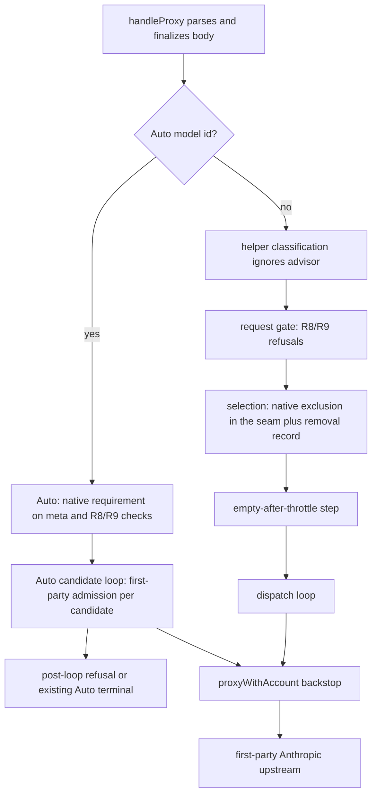
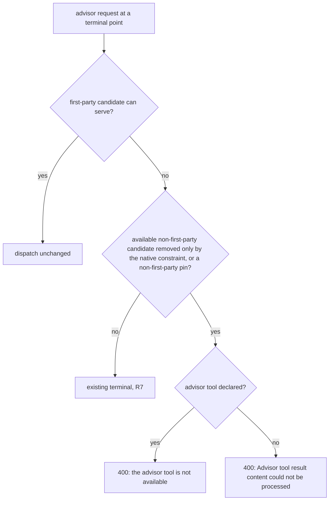
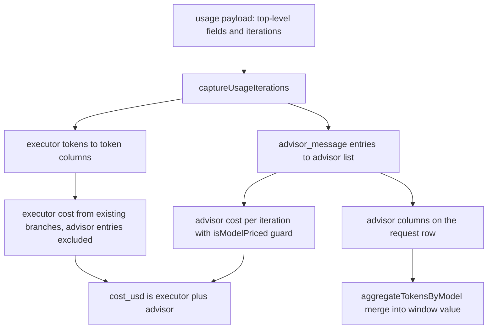

# Advisor Native Passthrough - Plan

## Goal Capsule

- **Objective:** A Claude Code user who turns on `/advisor` while routed through better-ccflare gets advisor answers whenever a first-party Anthropic account can serve the conversation, and otherwise keeps working without advisor instead of every request failing.
- **Means:** treat `advisor_20260301` as a native passthrough requirement enforced at account selection, dispatch, and Auto admission, with refusals Claude Code recovers from (KTD1, KTD4, KTD5).
- **Authority:** Product Contract R-IDs win on behavior; KTDs win on mechanism; units override neither. `AGENTS.md` outranks the plan: no scripted traffic to Anthropic-backed accounts, every SQLite migration ported to PostgreSQL, no version bumps, never touch the `inline-*worker*.ts` files.
- **Stop conditions:** stop and report instead of improvising when any of these holds:
  - a test shows advisor content reaching a non-first-party upstream through a path neither the selection seam nor the dispatch backstop covers;
  - the installed Claude Code no longer carries the recovery strings KTD5 relies on;
  - a U8 schema change cannot be made identical on SQLite and PostgreSQL.
- **Execution profile:** test-first, one fresh subagent per unit (`AGENTS.md` Plan Execution), in worktree `.claude/worktrees/advisor-server-tool` on branch `advisor-server-tool`, tracked by StartupBros-com/better-ccflare#425.
- **Finish and ship:** the implementing agent opens the PR against `StartupBros-com/better-ccflare`, clears review and CI, and merges. Deploy happens only on operator instruction via `scripts/deploy-ccflare.sh`; the live check is the operator using `/advisor` in an interactive Claude Code session.

---

## Product Contract

### Summary

better-ccflare will send requests that carry Claude Code's advisor tool only to accounts that talk directly to `api.anthropic.com`, forwarding the tool, its beta header, and its history unchanged. When no such account can serve and the request would otherwise land on a gateway, Codex, or xAI account, the proxy refuses locally with the wording Claude Code uses to drop advisor and retry, so the conversation continues on the fallback. Auto routing follows the same contract. Advisor spend is priced into request cost and counted in plan-window value.

### Problem Frame

On 2026-10-03 a Claude Code 2.1.288 session ran `/advisor`, and every later request returned `400 The requested server-tool semantics are not supported.` Production `4f43ec39` recorded these as `server_tool_unsupported_requirement` from 20:43Z to 21:02Z with zero upstream attempts. `/advisor off` did not help, because Claude Code keeps the advisor declaration until `/clear` or `/compact`.

The classifier in `packages/providers/src/server-tool-capabilities.ts` accepts only `web_search_20250305` and rejects every other typed tool before routing. Un-gating advisor alone would still fail in five ways:

- only the Codex provider implements the capability proof seam, so first-party Anthropic candidates would draw `no_implementation`;
- the replay scanner treats any `server_tool_use` history block as a proxy replay requirement;
- advisor requests are misclassified as trusted helpers;
- Auto rejects advisor on every lane with an unrecorded 503;
- advisor iterations are never priced.

None of these errors carry text Claude Code recovers from, so a session stays wedged.

### Key Decisions

- **Advisor runs only on first-party Anthropic accounts, never on a gateway or another provider, including as a fallback.** (session-settled: user-approved — chosen over admitting anthropic-compatible and custom-endpoint anthropic accounts such as mac-studio: only `api.anthropic.com` executes the advisor tool) Governs R1, R5.
- **Refuse recoverably instead of stripping advisor and forwarding.** (session-settled: user-approved — chosen over silently removing the tool and its history before sending to a fallback: Claude Code owns the decision to drop advisor) Governs R5, R8.
- **When first-party accounts are exhausted and a fallback is up, refuse so the chat continues without advisor.** (session-settled: user-approved — chosen over holding the request on a 503 or 529 until Anthropic recovers: the user keeps working) Governs R5, R7, R12.
- **Only `advisor_20260301` passes; other typed tools stay rejected.** (session-settled: user-approved — chosen over a general native-passthrough allowlist: each tool type needs its own review) Governs R9, R17.
- **Advisor cost accounting ships with the fix.** (session-settled: user-approved — chosen over leaving advisor spend unpriced) Governs R13, R14, R15.
- **Correctness over unsticking the wedged chat; no hotfix.** (session-settled: user-directed — chosen over a quick deploy of a narrow un-gate: "no rush to unstuck this specific agent")

### Requirements

**Admission and passthrough**

- R1. A `/v1/messages` request that declares `advisor_20260301`, carries advisor history (`server_tool_use` named `advisor`, or `advisor_tool_result`), or both, is dispatched only to first-party Anthropic accounts: provider `anthropic` whose endpoint is the default or `https://api.anthropic.com`, with no port or credentials.
- R2. On a first-party account, the advisor tool object (including `model` and its options), the `advisor-tool-2026-03-01` `anthropic-beta` value, and advisor history blocks reach upstream unchanged, streaming and non-streaming.
- R3. Advisor content never makes a request a trusted helper, never creates a proxy server-tool requirement, and never binds request-private replay.
- R4. On an advisor request, upstream Anthropic errors keep the proxy's existing handling, with any failover confined to first-party accounts. A request-rejection error the proxy already passes through, such as the advisor-pairing 400 `cannot be used as an advisor`, reaches the client unchanged after one fetch, with no failover and no bench, cooldown, pause, or rate-limit state written. A 429 keeps writing its usual rate-limit state, so later advisor requests skip that first-party account.

**Refusal**

- R5. When no first-party account can serve an advisor request and the proxy would otherwise have used a non-first-party account, it sends nothing upstream and returns HTTP 400. The message contains `the advisor tool is not available` when the tool is declared, and `Advisor tool result content could not be processed` when only history is present.
  - "Would otherwise have used" means: a force route or route profile pinned to a non-first-party account; a pool or combo whose only candidates are non-first-party; or first-party candidates that are all unavailable or throttled while an available non-first-party candidate passed every other eligibility check.
- R6. Refusal messages never contain `not available for this organization` or `Input tag`, and a refusal on a route-profile request reveals no account id.
- R7. When first-party candidates are all unavailable and no non-first-party candidate would have served, the existing terminal is returned unchanged (native quota wait, `pool_exhausted`, `route_unavailable`, usage-throttle 529, force-route 503).
- R8. A request carrying advisor content together with a proxy-hosted server tool (a `web_search_20250305` declaration or web-search replay history) is refused with the R5 text before replay binding or any upstream send.
- R9. A declared tool whose type starts with `advisor_` but is not `advisor_20260301` draws the R5 declaration refusal instead of `server_tool_unsupported_requirement`.
- R10. Every refusal writes no account state and is recorded as a local routing terminal whose kind starts with `server_tool_`.

**Auto routing**

- R11. Auto admits advisor content, history included, only on candidates whose account is first-party Anthropic.
- R12. When an Auto request carries advisor content, no first-party candidate dispatches, and a non-first-party candidate was rejected only because of advisor, Auto returns the R5 refusal and records it. Otherwise Auto's existing terminal stands.

**Accounting**

- R13. An advisor response's `cost_usd` is the executor cost plus each `advisor_message` iteration priced at that iteration's model, with no double counting when a fallback billing split also applies.
- R14. Executor token columns stay executor-only; advisor tokens are persisted separately and counted in plan-window value under the advisor model.
- R15. When an advisor model is unpriced, or the iteration snapshot is stale or truncated, the row is marked billing-incomplete and logged rather than recorded as a confident zero.

**Unchanged behavior**

- R16. Requests without advisor content route, price, and record exactly as before. Hosted WebSearch exact-proof routing is unchanged, and `count_tokens` requests that declare advisor are neither filtered nor refused.
- R17. Other typed server tools, such as `code_execution_20250825`, still return `server_tool_unsupported_requirement`.

### Acceptance Examples

- AE1. Covers R1, R2.
  - **Given:** a pool holding a first-party OAuth account and a Codex account, both serving the requested model.
  - **When:** a streaming request declares advisor with `anthropic-beta: advisor-tool-2026-03-01`.
  - **Then:** only the first-party account receives it, with the tool object and beta value intact.
- AE2. Covers R5, R6.
  - **Given:** a route profile pinned to a Codex account.
  - **When:** a request declares advisor.
  - **Then:** zero upstream fetches occur, and the 400 message contains `the advisor tool is not available` and no account id.
- AE3. Covers R5.
  - **Given:** advisor history but no declaration, and a pool where only an anthropic-compatible account is available.
  - **Then:** the 400 message contains `Advisor tool result content could not be processed`.
- AE4. Covers R5, R7.
  - **Given:** a mixed combo (first-party tier 1, Codex tier 10) with the first-party account rate-limited.
  - **Then:** an advisor request is refused.
  - **Given:** the same combo without the Codex member.
  - **Then:** the existing pool terminal is returned.
- AE5. Covers R13, R14.
  - **Given:** a response whose usage carries executor tokens at top level and one `advisor_message` iteration on a different model.
  - **Then:** `cost_usd` equals executor price plus advisor price, and the token columns hold executor tokens only.

### Scope Boundaries

Non-goals, considered and not built:

- Executor rewrites on first-party accounts (combo slots, model mappings) that Anthropic may reject as an advisor pairing. They are forwarded unchanged; Anthropic's `cannot be used as an advisor` 400 passes through (R4) and Claude Code drops advisor. Reconsider if prod shows advisor rows with `original_model != model` failing that way.
- Refusing Auto conversations homed on a Codex target to keep them on their home. Advisor turns are served on an available first-party lane instead (see Open Questions).
- Replacing a retained upstream 429 in the combo-fallback wave with the refusal. The next request meets first-party accounts already marked limited and draws the refusal at selection.
- Cache-keepalive changes. Advisor bodies are only served, and so only cached, on first-party accounts, so replays stay first-party. Reconsider if keepalive failures appear for advisor bodies; whether `max_tokens: 1` is accepted with advisor declared is unverified.
- Empty-pool passthrough (`CCFLARE_PASSTHROUGH_ON_EMPTY_POOL=1`). When no refusal fires it forwards to the default Anthropic URL with the client's own credentials, which is first-party.
- Skipping `clearSession` on refusal. It only feeds the status-line account badge (`packages/proxy/src/session-account-observer.ts`), so refusals keep the standard terminal handling.
- Advisor combined with another unsupported typed tool. Dropping advisor would not make the request routable, so it keeps the R17 error.
- Advisor spend on streams aborted before `message_delta`. Those iterations never arrive and cannot be priced.

### Deferred to Follow-Up Work

- The WebSearch `server_tool_no_implementation` 400s on prod (1,754 since 2026-08-31) are a separate issue.
- `scanHistoricalReplay` demands every replay mode once traversal passes 4,096 messages or 16,384 blocks, which pushes very long conversations onto the Codex replay path. It needs its own investigation.
- Consolidating the inline `api.anthropic.com` checks in `packages/core/src/native-quota-route-shape.ts` and `packages/proxy/src/handlers/account-selector.ts` onto the new predicate.

### Open Questions

Neither blocks implementation; the plan proceeds on the stated default.

- **Auto conversation homed on Codex with advisor declared.** The default serves advisor turns on an available first-party lane without re-homing (R11). The alternative refuses so the conversation stays on its Codex home without advisor.
- **Plan-window value including advisor tokens (U8).** The default includes them, because tokens never recorded cannot be backfilled later. U8 is self-contained, so the operator can split it out and keep cost-only accounting.

---

## Planning Contract

### Key Technical Decisions

- KTD1. **Advisor is a native passthrough requirement, separate from `ServerToolRequirements`.** Joining the hosted server-tool layer would demand the exact-tuple proof only Codex implements, bind replay leases, and reclassify main-chain requests as helpers. The 2026-07-29 server-tool plan scopes that layer to hosted WebSearch and requires ordinary-path invariance. A sibling derivation feeds a separate request field. Governs R3.
- KTD2. **One predicate, `isFirstPartyAnthropicAccount` in `packages/core/src/model-mappings.ts`, decides first-party status.** It requires provider `anthropic` and reads the endpoint through `getEndpointUrl`, defaulting to `https://api.anthropic.com`. The endpoint must be `https:` with hostname `api.anthropic.com`, no port and no userinfo, and any parse failure returns false. It mirrors `isOfficialXaiEndpoint`. A provider string alone is not enough, because Auto and the ordinary pool can both hold anthropic accounts with custom endpoints. Implements R1.
- KTD3. **Advisor history detection fails closed.** When traversal hits the existing visit caps, `hasHistory` is true, matching `scanHistoricalReplay`. The replay scanner's `server_tool_use` carve-out is scoped to the name `advisor`, so web-search history still produces its replay requirement. Unknown `advisor_*` declarations are recorded on the native requirement rather than pushed into `unsupported` (R9).
- KTD4. **Native-only is enforced inside selection through the provider-exclusion seam, not by filtering selection's output.** A post-filter would leak in three ways:
  - `SessionAffinityStrategy.select` writes sticky ownership during selection.
  - Capacity-deferred routes and the native-quota member queue are attempted outside the returned list.
  - `routingCandidates` is index-aligned with that list.

  `getExcludedProviders` / `isProviderExcludedForRequest` already reach the ordinary, combo, capability-pool, native-quota, and server-tool paths, so the native constraint joins them as a synthetic exclusion evaluated with KTD2. To separate R5 from R7, each selection records the non-first-party accounts the constraint removed after they passed every other eligibility check and `isAccountAvailable`. The request field is required on `RequestMeta`, not optional, so no constructor silently defaults to the unsafe value.
- KTD5. **Two new `ServerToolRoutingError` reasons, one per signal, carry the refusal.** Claude Code 2.1.288 recovers from a 400 whose message includes `the advisor tool is not available` only while the advisor tool is still declared. It then removes the tool, strips advisor content from the history, and retries once. It recovers from `Advisor tool result content could not be processed` by stripping advisor history. `not available for this organization` widens the drop to the whole process, and an `Input tag 'advisor_…` match widens it to the host. Wording therefore follows the signal:
  - tool declared, with or without history: the first phrase;
  - history only: the second phrase.

  Each phrase lives in `ERROR_SPEC.message`, which the constructor suffixes with the requested tools. `ERROR_SPEC`'s exhaustive `satisfies` makes registration a single-file change, and the existing `instanceof ServerToolRoutingError` catches at the three selection call sites in `proxy.ts` serialize and record the new reasons with no new plumbing. Governs R5, R6, R10.
- KTD6. **The refusal fires wherever a native-filtered pool empties, ahead of that site's own terminal.** Each site applies the R7 condition from KTD4:
  1. the forced branch, immediately after its `not_found` check and before the force-model, route-intent, provider-excluded, and profile-constraint 503s;
  2. capability-profile pool exhaustion;
  3. the `selectAccountsForRequest` wrapper, when internal selection returns nothing and no first-party deferred route remains;
  4. the empty-after-throttle step in `handleProxy`, ahead of every terminal there, including native quota, model-pool 503, usage-throttle 529, and empty-pool passthrough;
  5. the request gate, for R8 and R9.
- KTD7. **A dispatch backstop rejects any non-first-party account at `proxyWithAccount` entry for an advisor request.** It reuses the non-terminal candidate rejection (`ServerToolCandidateCapabilityError`, reason `provider_unavailable`), so callers move to the next candidate. It logs at error level, because reaching it means a selection site missed. One guard covers the main loop, deferred routes, the native-quota queue, fallback waves, and Auto. Supports R1.
- KTD8. **Auto decides advisor admission per candidate account and refuses after the loop.**
  - `evaluateAutoRequestAdmission` takes the candidate's first-party status from KTD2 instead of `provider === "anthropic"`.
  - `clientTools` admits the advisor declaration, and `modalities` admits advisor history blocks, only for first-party candidates.
  - The refusal is emitted after the candidate loop, because `lastAdmissionReason` is overwritten per candidate. It is recorded through `recordRoutingTerminalRequest`, like Auto's existing fall-through terminal.
  - Non-first-party skips reuse the `tools-unsupported` admission reason, so the closed reason lists in `packages/types/src/quality-routing.ts` stay unchanged.

  Governs R11, R12.
- KTD9. **Advisor cost is an explicit per-iteration sum added to the executor cost.** `captureUsageIterations` keeps `advisor_message` entries in their own bounded list. Finalize prices each one at its own model through `estimateCostUSD`, guarded by `isModelPriced`. The existing fallback split and per-model aggregate skip `advisor_message` entries, so a response carrying both signals is not double counted. Staleness follows the existing `iterationsSeq === usagePayloadSeq` rule. Governs R13, R15.
- KTD10. **Advisor tokens persist in five nullable `requests` columns:** `advisor_model` plus input, output, cache-read, and cache-creation token counts, in both `migrations.ts` and `migrations-pg.ts`. `aggregateTokensByModel` merges a second grouping over these columns into the advisor model's line, adding no request count. Tokens never recorded cannot be recovered later, so the columns ship with the fix. There is no `VALUE_PRICING_VERSION` bump, because rows written before deploy hold no advisor data to re-price. Governs R14.

No bake-off ran. KTD4 was the one structurally consequential choice, and the code evidence refuted the post-filter alternative without needing a developed comparison.

### High-Level Technical Design

Where advisor requests are checked, by request path:

The refusal decision applied at each KTD6 site:

Accounting data flow:

### Assumptions

- Advisor `usage.iterations` entries carry `type: "advisor_message"`, `model`, and the four token counts, and top-level usage is executor-only. The comments in `packages/proxy/src/usage-collector.ts` record this from Anthropic's advisor-tool docs; it has not been checked against a live capture.
- Claude Code's WebSearch keeps `web_search` server-tool blocks inside its helper side-request, so main-chain advisor requests do not carry web-search replay history. R8 covers the case if one ever does.
- Claude Code's SDK error `message` includes the serialized error body, so the nested `error.message` phrase satisfies its `includes` checks. This is consistent with today's prod error surfacing `The requested server-tool semantics are not supported.` verbatim.
- Anthropic subscription (OAuth) accounts accept the advisor beta through better-ccflare. This cannot be tested here without scripted Anthropic traffic. If they reject it, R4 passes Anthropic's error through and Claude Code applies its own recovery.

### Deferred to Implementation

- Where each selection branch takes the KTD4 removal record, so it counts only accounts that passed every other eligibility gate. The R7 condition and U3's scenarios pin the semantics.
- Exact names for the request field, the error reasons, and the columns.
- Whether `proxyWithAccount` entry or the `materializeAttemptPlan` closure is the cleaner backstop site, once every caller is confirmed to treat the rejection as a skip.
- How `beforeDispatch` / `check()` in `packages/proxy/src/quality-route-candidates.ts` hand the candidate's first-party status into admission.
- Iterations in one response naming more than one advisor model. This is not expected, because one tool declares one model: cost stays exact per iteration, and the columns record the first model seen, with a log line.
- Every production `RequestMeta` construction site, beyond `createRequestMetadata` in `packages/proxy/src/handlers/request-handler.ts`, that the required field forces to state its value.

### System-Wide Impact

- **Routing:** every selection branch gains the native constraint. Advisor main-chain requests stop being recorded with `origin: trusted_helper` and stop resolving route profiles as child requests.
- **Observability:** refusals appear as request rows with status 400 and `server_tool_*` terminal kinds, which map to routing-decision reason `server_tool_denied`. The Codex-specific exclusion warning in `applyExclusions` becomes generic so it does not misfire on every advisor request.
- **Cost and value:** `cost_usd`, which feeds dashboards and the daily-spend alert, includes advisor spend. Plan-window value includes advisor tokens from deploy forward. Cache-hit metrics stay executor-only.
- **Schema:** five nullable columns are added to `requests` in both dialects, with no backfill.

### Risks & Dependencies

| Risk | Mitigation |
|---|---|
| A future Claude Code changes its recovery strings, turning refusals into visible hard errors (not retry loops). | The phrases live in `ERROR_SPEC` with tests citing the 2.1.288 predicates, and `docs/routing-architecture.md` records the version they came from. |
| A selection site the seam misses sends advisor content to a non-first-party upstream. | The KTD7 backstop at dispatch, plus zero-fetch tests per branch. |
| Anthropic rejects advisor for a subscription account or a model pairing. | R4 passes the error through so Claude Code applies its own recovery; the operator's post-deploy `/advisor` session is the live check. |
| An advisor model missing from the pricing catalog records a false zero. | The KTD9 `isModelPriced` guard marks the row billing-incomplete (R15). |
| A subagent's refusal drops advisor for its parent conversation (Claude Code scope semantics, unverifiable here). | Accepted: the refusal fires only where advisor cannot run anyway. |
| The existing `server-tool-capabilities` test fixture is time-bombed (`revalidateAfter` 2026-09-04). | New advisor tests build their own fixtures (`docs/solutions/workflow-issues/bun-1-4-stream-cancel-and-net-close-semantics.md`). |

### Sources & Research

- `docs/plans/2026-07-29-001-fix-provider-server-tool-capability-architecture-plan.md`: hosted server-tool scope and ordinary-path invariance (KTD1).
- `docs/routing-architecture.md`, "Hosted WebSearch routing contract": the section the new contract sits beside (U9).
- `docs/solutions/architecture-patterns/commit-bound-routing.md`: compile the eligible set before ranking (KTD4).
- `docs/solutions/rate-limit-scope-and-duration.md`: refusals must not write bench state, and safety flags are required rather than optional (R10, KTD4).
- `docs/solutions/integration-issues/route-profile-expected-physical-model-checked-before-provider-defaults.md`: profile pins fail closed (KTD6).
- `docs/solutions/workflow-issues/typecheck-does-not-cover-test-call-sites.md`: typecheck skips test files.
- `packages/proxy/src/handlers/account-selector.ts`: `getExcludedProviders`, `isProviderExcludedForRequest`, `selectAccountsForRequest`, and `filterCountHelperAccounts`, the precedent for a stage-observed filter that throws a typed error only when the pool empties.
- `packages/core/src/xai.ts`, `isOfficialXaiEndpoint`: predicate shape for KTD2.
- Claude Code 2.1.288 binary:
  - recovery predicates `mMe` (tool refused), `pMe` (history unprocessable) and `AEt` (scope);
  - the handler that removes the tool, strips advisor content, marks the advisor refused, and retries once (KTD5).

---

## Implementation Units

Phases:
- **A, Detection:** U1, U2.
- **B, Routing:** U3, U4, U5.
- **C, Auto:** U6.
- **D, Accounting:** U7, U8.
- **E, Documentation:** U9.

U7 depends on nothing and can run alongside Phase B.

### U1. Advisor detection and first-party predicate

- **Goal:** derive a native advisor requirement from the request body, and decide an account's first-party status, without touching hosted server-tool requirements.
- **Requirements:** R1, R3, R9, R17; KTD1, KTD2, KTD3.
- **Dependencies:** none.
- **Files:** `packages/core/src/model-mappings.ts`, `packages/core/src/index.ts`, `packages/core/src/model-mappings.test.ts`, `packages/providers/src/server-tool-capabilities.ts`, `packages/providers/src/server-tool-capabilities.test.ts`, `packages/types/src/provider-capabilities.ts`.
- **Approach:**
  1. Start from the uncommitted worktree changes to these six files. Keep what matches KTD1-KTD3 and discard the rest.
  2. Flip truncated traversal to `hasHistory: true`, and invert the existing test that asserts the opposite.
  3. Record unknown `advisor_*` declared types on the native requirement and keep them out of `unsupported`.
- **Patterns to follow:** `isOfficialXaiEndpoint` in `packages/core/src/xai.ts`; the bounded traversal in `scanHistoricalReplay`.
- **Execution note:** implement test-first. The partial tests are input, not proof.
- **Test scenarios:**
  - Predicate: anthropic with null `custom_endpoint` is true; `https://api.anthropic.com` and `https://api.anthropic.com/v1` are true.
  - Predicate: each of these endpoints is false: `https://api.anthropic.com.evil.test`, `https://api.anthropic.com:8443`, `https://user@api.anthropic.com`, `http://api.anthropic.com`, an unparsable endpoint, and a LAN host such as the mac-studio account's.
  - Predicate: providers `anthropic-compatible`, `codex`, `xai`, and `openai-compatible` are false.
  - Derivation: tools `[advisor_20260301]` yields declared `[advisor_20260301]`, and `deriveServerToolRequirement` returns undefined.
  - Derivation: advisor plus a client function tool yields the advisor requirement and no server-tool requirement.
  - Derivation: history only (`server_tool_use` named `advisor`, then `advisor_tool_result` holding each of `advisor_result`, `advisor_redacted_result`, `advisor_tool_result_error`) yields `hasHistory: true` and no replay requirement.
  - Derivation: a dangling `server_tool_use` named `advisor` with no result (a `pause_turn` resume) yields `hasHistory: true`.
  - Derivation: advisor history placed past the message visit cap yields `hasHistory: true`.
  - Derivation: a `server_tool_use` named `web_search` still produces its replay requirement.
  - Derivation: a declared `advisor_20270101` is recorded as an unknown advisor type and is not in `unsupported`.
  - Derivation: `code_execution_20250825` stays in `unsupported` (R17).
  - Derivation: advisor plus `web_search_20250305` yields both requirements.
- **Verification:** both derivations are pure, return frozen values, and agree on traversal caps. Existing web_search derivation tests pass unchanged.

### U2. Request wiring, refusal reasons, and gate checks

- **Goal:** carry the native requirement on every non-count request, register the refusal reasons, and refuse R8/R9 conflicts before selection.
- **Requirements:** R3, R5, R6, R8, R9, R10, R16; KTD1, KTD4, KTD5, KTD6.
- **Dependencies:** U1.
- **Files:** `packages/proxy/src/request-body-context.ts`, `packages/proxy/src/request-body-context.test.ts`, `packages/types/src/api.ts`, `packages/proxy/src/handlers/request-handler.ts`, `packages/proxy/src/proxy.ts`, `packages/proxy/src/server-tool-routing-errors.ts`, `packages/proxy/src/server-tool-routing-errors.test.ts`, `packages/proxy/src/__tests__/server-tool-routing.integration.test.ts`.
- **Approach:**
  1. Add a sibling finalize to `RequestBodyContext` on the same `serverToolRequirementsFinalized` latch, so mutation after finalize still throws.
  2. Add the required `RequestMeta` field, null when absent. Set it in `handleProxy` next to `serverToolRequirements`, and leave it null for count helpers.
  3. Keep advisor out of `previewServerToolRequirements`, so helper classification ignores it.
  4. Register the two reasons in `ERROR_SPEC` as 400 `invalid_request_error`, carrying the KTD5 phrases.
  5. In the gate, before replay binding, refuse when the native requirement coexists with a hosted requirement (R8) or names an unknown `advisor_*` type (R9).
- **Patterns to follow:**
  - `finalizeServerToolRequirements`;
  - the zero-upstream assertion pattern in `server-tool-routing.integration.test.ts`;
  - both `it.each` lists in `server-tool-routing-errors.test.ts`.
- **Test scenarios:**
  - Error shape: each new reason serializes as 400 `invalid_request_error` and keeps its phrase in `message` after the `Requested server tool(s)` suffix. It contains neither `not available for this organization` nor `Input tag`, and carries no pool-status, recovery-scope, or retry-after header.
  - Context: finalizing after a model rewrite records the advisor requirement, and mutation after finalize throws.
  - Admission: an advisor-only request with one first-party account reaches upstream in exactly one fetch.
  - Gate: advisor plus `web_search_20250305` returns the 400 declaration phrase. There are zero fetches, no replay binding and no account mutations, and the terminal is `server_tool_<reason>`.
  - Gate: advisor history plus web-search replay history, with no declaration, returns the 400 history phrase.
  - Gate: a declared `advisor_20270101` returns the 400 declaration phrase, not `server_tool_unsupported_requirement`.
  - Gate: `code_execution_20250825` still returns `server_tool_unsupported_requirement`.
  - Classification: an advisor-only main-chain request is a root with no `trusted_helper` origin; a `web_search_20250305` request is still a helper.
  - `count_tokens` with advisor declared leaves the requirement null, draws no refusal, and routes as before.
- **Verification:** reverting U1's classifier change makes the admission scenario fail with `server_tool_unsupported_requirement` (planted negative).

### U3. Native-only selection with refusal

- **Goal:** keep advisor requests on first-party accounts in every selection branch, and turn native-caused emptiness into the refusal.
- **Requirements:** R1, R5, R6, R7, R10; KTD4, KTD6.
- **Dependencies:** U2.
- **Files:** `packages/proxy/src/handlers/account-selector.ts`, `packages/proxy/src/handlers/routing-terminal.ts`, `packages/proxy/src/handlers/__tests__/account-selector.test.ts`, `packages/proxy/src/__tests__/server-tool-routing.integration.test.ts`, `packages/proxy/src/__tests__/proxy-model-route-profiles.test.ts`.
- **Approach:**
  1. Teach `getExcludedProviders` / `isProviderExcludedForRequest` the native constraint. The ordinary, combo, capability-pool, native-quota, and server-tool paths then inherit it.
  2. Per selection, record the available non-first-party accounts the constraint removed after the other eligibility gates. Reset the record wherever `routingCandidates` is reset.
  3. In the forced branch, refuse immediately after `not_found` when the forced account is not first-party. This covers header and profile pins alike, and the refusal carries no account id.
  4. When the record is non-empty and no first-party deferred route remains, turn capability-profile pool exhaustion and the wrapper's empty result into the refusal.
  5. Pass the constraint into `filterRequestCompatibleAccounts`, so terminal bodies and the `pool_exhausted` classification ignore non-first-party accounts.
  6. Make the Codex-specific `applyExclusions` warning generic.
- **Patterns to follow:** `filterCountHelperAccounts` (a stage-observed filter that throws a typed error when the pool empties); `getClientVisibleServerToolAccountId`.
- **Test scenarios:**
  - A pool of first-party OAuth, first-party API key, anthropic with a custom endpoint, anthropic-compatible, Codex, and xAI, all serving the requested model: the strategy receives only the two first-party accounts. Covers AE1.
  - A header force to a Codex account with advisor returns the refusal with zero fetches.
  - A route profile pinned to Codex, to xAI, or to a custom-endpoint anthropic account returns the refusal before any force-route 503, with no `account_id`. Covers AE2.
  - A header force to a first-party account serves the request. When that account is paused, the force-route 503 is unchanged.
  - A capability profile over a Codex pool returns the refusal, not `ForceRouteUnavailableError`.
  - A combo whose only members are Codex and xAI returns the refusal with no unknown-member warnings.
  - A mixed combo whose first-party member is rate-limited and whose Codex member is available returns the refusal. The same combo without the Codex member returns the existing terminal. Covers AE4.
  - A stock-model request where Codex fails the stock-model fence and every first-party account is rate-limited returns the existing terminal. Fence-excluded accounts are never counted.
  - A native-quota combo with only first-party members, all exhausted, returns the native quota terminal unchanged.
  - Each refusal case above with history only returns the history phrase. Covers AE3.
  - Refusals leave affinity owners and bench, cooldown, and pause state untouched.
  - A non-advisor request through each branch selects exactly as the baseline does.
- **Verification:** the account-selector, route-profile, and server-tool integration suites pass per file, and no branch returns a non-first-party account for an advisor request.

### U4. Empty-after-throttle refusal in handleProxy

- **Goal:** refuse when post-selection throttling empties a native-filtered list, ahead of the terminals that would otherwise answer.
- **Requirements:** R5, R7; KTD6.
- **Dependencies:** U3.
- **Files:** `packages/proxy/src/proxy.ts`, `packages/proxy/src/__tests__/server-tool-routing.integration.test.ts`.
- **Approach:** consult the U3 removal record at the empty-pool step, ahead of the native-quota terminal, `createModelPoolExhaustedResponse`, `createUsageThrottledResponse`, and the `CCFLARE_PASSTHROUGH_ON_EMPTY_POOL` branch. Those terminals keep their current order when the record is empty.
- **Test scenarios:**
  - First-party account predictively throttled while Codex is available: refusal, not 529.
  - First-party account reactively model-depleted while Codex is available: refusal, not the model-pool 503.
  - The same two cases with no Codex account: the 529 and the 503 are unchanged.
  - `CCFLARE_PASSTHROUGH_ON_EMPTY_POOL=1` with a non-empty record: refusal with zero fetches.
- **Verification:** the integration suite passes, and the existing non-advisor throttle tests are unchanged.

### U5. Dispatch backstop and passthrough fidelity

- **Goal:** make it impossible for any attempt to send advisor content to a non-first-party account, and prove first-party dispatch forwards everything unchanged.
- **Requirements:** R1, R2, R4; KTD7.
- **Dependencies:** U2.
- **Files:** `packages/proxy/src/handlers/proxy-operations.ts`, `packages/proxy/src/handlers/__tests__/proxy-operations-failover.test.ts`, `packages/proxy/src/__tests__/server-tool-routing.integration.test.ts`.
- **Approach:** reject at `proxyWithAccount` entry per KTD7. Confirm that every caller treats the rejection as a skip: the main loop, capacity-deferred routes, the native-quota queue, the fallback waves, and Auto.
- **Test scenarios:**
  - A direct `proxyWithAccount` call with an advisor request and a Codex account is rejected with zero fetches and an error log.
  - A capacity-deferred route that points at a non-first-party account is never attempted for an advisor request.
  - Streaming and non-streaming first-party dispatch: the upstream tools array (including `model`, `max_uses`, `caching`) and the history blocks deep-equal the client's, and `anthropic-beta` carries `advisor-tool-2026-03-01` alongside the OAuth beta. Covers AE1.
  - An upstream 400 containing `cannot be used as an advisor` reaches the client with status and body verbatim, after one fetch, with no failover and no bench, cooldown, or pause.
  - An upstream 429 on one first-party account fails over only to another first-party account.
- **Verification:** the failover and integration suites pass per file.

### U6. Auto admission and refusal

- **Goal:** admit advisor on first-party Auto candidates only, and refuse recoverably when only non-first-party candidates could serve.
- **Requirements:** R5, R6, R8, R9, R10, R11, R12; KTD5, KTD8.
- **Dependencies:** U2.
- **Files:** `packages/providers/src/auto-request-admission.ts`, `packages/providers/src/auto-request-admission.test.ts`, `packages/proxy/src/quality-route-candidates.ts`, `packages/proxy/src/handlers/quality-route-admission.ts`, `packages/proxy/src/__tests__/proxy-quality-routes.test.ts`.
- **Approach:**
  1. Set the native requirement on `meta` where Auto already sets `serverToolRequirements`, and apply the R8/R9 gate checks there, recorded.
  2. Extend the admission input with the candidate's first-party status. Admit the advisor declaration in `clientTools`, and advisor history blocks in `modalities`, only when it is true.
  3. Track whether a non-first-party candidate was skipped solely for advisor. After the loop, when that holds and nothing dispatched, emit and record the refusal.
- **Patterns to follow:** the fall-through terminal recording at the end of `routeQualityRequest`; `recordSkip`.
- **Test scenarios:**
  - An Auto fable lane with an enrolled first-party account dispatches an advisor request there with tools unchanged, passing the `isDeepStrictEqual` preservation check.
  - An Auto request carrying only advisor history is admitted on an available first-party lane (it is `modality-unsupported` today).
  - An Auto astra worker lane, which is Codex-only, with advisor declared returns a recorded 400 refusal with zero fetches.
  - An Auto ladder whose first-party candidates are at capacity, with a gpt-sol candidate available, returns the refusal.
  - An Auto ladder where every candidate is unavailable returns the existing `quality_route_unavailable` terminal.
  - An enrolled anthropic account with a custom endpoint is not admitted for advisor.
  - Admission for non-advisor Auto requests is unchanged.
- **Verification:** the quality-route and admission suites pass per file, and refusal rows carry a quality decision whose `skippedLanes` explains each skip.

### U7. Advisor iteration pricing

- **Goal:** price advisor iterations into `cost_usd` without changing the executor token columns.
- **Requirements:** R13, R15, R16; KTD9.
- **Dependencies:** none.
- **Files:** `packages/proxy/src/usage-collector.ts`, `packages/proxy/src/__tests__/usage-collector-lifecycle.test.ts`, `packages/proxy/src/__tests__/usage-collector-cache-health.test.ts`.
- **Approach:**
  1. In `captureUsageIterations`, keep `advisor_message` entries in their own list, replaced per snapshot and cleared in `freeRequestState`.
  2. Exclude those entries from the fallback split and the per-model aggregate.
  3. Add the advisor sum at finalize, and extend `billingIncomplete` and the finalize log line to cover advisor cases.
- **Patterns to follow:** `useDeterministicModelPricing` and `harness()` in the lifecycle test; add the advisor model to its factor table.
- **Test scenarios:**
  - A streaming response with executor top-level usage and one advisor iteration: `cost_usd` is executor plus advisor price, and the token columns are executor-only. Covers AE5.
  - The equivalent non-streaming JSON response gives the same result.
  - A response with both advisor and `fallback_message` iterations counts advisor once.
  - An advisor iteration on an unpriced model is marked billing-incomplete and logged, and the executor cost is kept.
  - A stale or truncated iteration snapshot holding advisor entries is marked billing-incomplete.
  - An advisor tool-result error with zero advisor tokens costs the same as the executor alone.
  - The cache-hit outcome is computed from executor tokens only.
  - A response without iterations costs exactly what it does on the baseline.
- **Verification:** the lifecycle and cache-health suites pass per file.

### U8. Advisor usage persistence and window value

- **Goal:** persist advisor tokens per request and count them in plan-window value.
- **Requirements:** R14; KTD10.
- **Dependencies:** U7.
- **Files:** `packages/database/src/migrations.ts`, `packages/database/src/migrations-pg.ts`, `packages/database/src/repositories/request.repository.ts`, `packages/database/src/database-operations.ts`, `packages/database/src/repositories/__tests__/request-aggregate-tokens-by-model.test.ts`, `packages/proxy/src/usage-collector.ts`.
- **Approach:**
  1. Follow the five-step migration rule in `AGENTS.md`: SQLite create and alter, then PostgreSQL create and `columnsToAdd`.
  2. Carry the advisor fields on `RequestData["usage"]`, and extend the `save` insert and conflict lists.
  3. Merge an advisor grouping into `aggregateTokensByModel`.
- **Test scenarios:**
  - Fresh SQLite and PostgreSQL schemas contain the five columns. An upgraded database gains them, with existing rows left null.
  - Saving a request with advisor usage round-trips all five fields; saving one without advisor stores nulls.
  - `aggregateTokensByModel` over a window with executor rows on model A and advisor tokens on model B leaves line A unchanged and gives line B the advisor tokens with request count 0.
  - A window with no advisor rows produces output identical to the baseline.
  - Advisor tokens on an API-key (non-plan) account are excluded, like other non-plan rows.
- **Verification:** the repository and migration suites pass on SQLite. The PostgreSQL suites pass where `DATABASE_URL` is set, and are otherwise reported as not run.

### U9. Routing contract documentation

- **Goal:** document the advisor contract where operators and future agents look.
- **Requirements:** R1, R5, R7, R11, R13, R14.
- **Dependencies:** U3, U6, U7.
- **Files:** `docs/routing-architecture.md`.
- **Approach:** add `### Advisor native routing contract` beside the hosted WebSearch contract, covering detection, first-party eligibility, the refusal phrases with the Claude Code version they came from, Auto behavior, and accounting. End it with a `*Source:*` line, and cross-reference it from the Auto section and the table of contents.
- **Test expectation:** none -- documentation only.
- **Verification:** the section quotes each refusal phrase exactly as `ERROR_SPEC` defines it.

---

## Verification Contract

| Gate | Check | Applies to |
|---|---|---|
| Fresh worktree bootstrap | `bun run build:cli` once to generate the gitignored inline workers; `bun install --no-save` if the worktree has no `node_modules` | before any test run |
| Focused suites | `bun test <file>`, one process per affected file (CI isolates per file, and batch-only `mock.module` failures are artifacts) | every unit |
| Baseline comparison | the same files at `origin/main`. Counts captured 2026-10-03 (pass/fail): account-selector 193/0, server-tool-routing.integration 36/0, proxy-quality-routes 132/0, proxy-model-route-profiles 98/0, proxy-operations-failover 70/0, server-tool-capabilities 63/0, server-tool-routing-errors 13/0, request-body-context 11/0 | U1-U6 |
| Static gates | `bun run lint && bun run typecheck && bun run format`, then check the diff for unrelated files biome reformatted | every unit |
| Test call-site sweep | `grep -a` across test files for the changed signatures: `RequestMeta`, `RequestBodyContext`, the admission input, `ServerToolRoutingErrorReason`, `RequestData["usage"]` | U2, U6, U8 |
| PostgreSQL | migration and repository suites with `DATABASE_URL` set, or reported as not run | U8 |
| Full suite | `bun test` | before the PR |
| Planted negatives | reverting U1's classifier makes the admission test fail with `server_tool_unsupported_requirement`; a Codex-only pool asserts zero fetches and the declaration phrase; `code_execution_20250825` still returns `server_tool_unsupported_requirement`; a `web_search` history block still yields its replay requirement | U1-U3 |
| Live check | nothing scripted. The operator runs `/advisor` in an interactive Claude Code session after an operator-instructed deploy | after merge |

---

## Definition of Done

- Each of R1-R17 is covered by a passing test named in its unit, and every AE has a covering test.
- Static gates are clean. Each affected suite passes in its own process with pass counts at or above baseline. The full `bun test` run is green, with the known flakes (`incrementalVacuumAdaptive`, `run-ccflare-stack`) rerun to green.
- The planted negatives behave as the Verification Contract states.
- The uncommitted partial changes are either part of U1's committed result or removed. No abandoned-attempt code remains, and no `inline-*worker*.ts` file is staged.
- `docs/routing-architecture.md` carries the advisor contract. The acceptance criteria and no-claim boundary of issue #425 match this plan, with advisor pricing now in scope.
- The PR is merged to `main` on `StartupBros-com/better-ccflare`. Deploy and the live `/advisor` check remain with the operator.
- Per unit, its Verification line holds and its listed suites pass per file.
