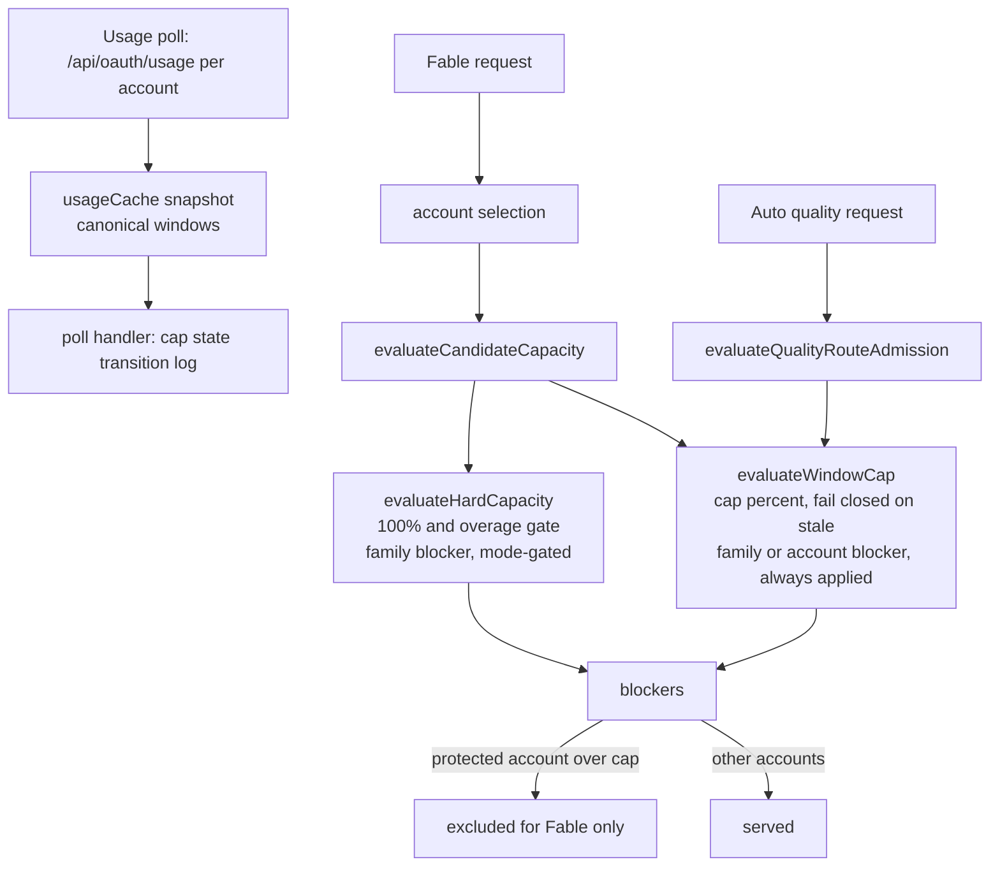

# Account Usage-Window Cap - Plan

> **Superseded 2026-10-05 by #450. The cap was reverted.** The premise below is wrong. In Claude Code 2.1.289, the usage-credits consent dialog is armed by a process-wide latch, and only `/v1/messages` responses set it. Every such response passes through this proxy:
>
> - a Fable 200 carrying `anthropic-ratelimit-unified-overage-in-use: true`, or
> - a `credits_required` 429.
>
> The signed-in account's own weekly window never feeds that latch. Capping that account only held back capacity. The guard now drops the header at the last hop (`scripts/ccflare-guard.mjs`). The `requests.unified_ratelimit_headers` capture from this plan is kept.

## Goal Capsule

- **Objective:** A background Claude Code session on Fable, routed through better-ccflare, finishes on Fable. Its signed-in account never reaches an exhausted weekly allowance, the state that makes Claude Code open the usage-credits consent dialog, so no unattended session switches to Opus 5.5.
- **Means:** a per-account, per-usage-window soft cap in the shared candidate-capacity path that keeps the signed-in account's weekly Fable and all-models allowances below 100% (KTD1, KTD2, KTD8), plus bounded capture of the rate-limit headers Claude Code sees on successful Fable responses (KTD5).
- **Authority:** Product Contract R-IDs win on behavior; KTDs win on mechanism; units override neither. `AGENTS.md` outranks the plan: no scripted traffic to Anthropic-backed accounts, every SQLite schema change has a PostgreSQL twin, generated inline workers are never touched.
- **Stop conditions:** stop and report instead of improvising when any of these holds:
  - the live `/api/accounts` payload for the protected account carries no Fable window in either its flat fields or its `limits[]` rows, so the payload shape does not expose the window the cap needs (R2 cannot be met); a transiently missing or stale snapshot in a supported payload is the ordinary R4 case, not this stop;
  - a schema change for U4 cannot be made identical on SQLite and PostgreSQL;
  - a test shows the cap benching an account for a model family it did not name.
- **Execution profile:** test-first, one fresh subagent per unit, in worktree `.claude/worktrees/fable-weekly-cap` on branch `fable-weekly-cap`, tracked by StartupBros-com/better-ccflare issue #444.
- **Finish and ship:** the implementing agent opens the PR against `StartupBros-com/better-ccflare`, clears lint, typecheck, format, the affected suites and review, and merges. Deploy is a separate operator act via `scripts/deploy-ccflare.sh` from `origin/main`, followed by the config edit and restart in the Operational Notes.

---

## Product Contract

### Summary

better-ccflare gains a configurable per-account usage-window cap. When an account's latest fresh usage snapshot shows a capped window at or above its percent, the proxy stops selecting that account for the window's model family, on every routing path, while the account keeps serving everything else. The proxy also records the unified rate-limit headers it forwards on successful Fable responses, so the next consent incident can be matched to what Claude Code saw. The operator applies the cap to the signed-in account so its weekly Fable stays below 100%.

### Problem Frame

Claude Code 2.1.289 on a Max subscription asks for consent before a Fable request bills usage credits. In a background session nobody answers; after `dialogExpiry` (five minutes) the turn ends and the session switches to Opus 5.5 (transcript event `model_consent_fallback`). The dialog is keyed to the weekly Fable allowance of the account Claude Code is signed in as (usage window `seven_day_fable`, rate-limit claim `7d_oi`, shown as "Current week (Fable)" in `/usage`).

That account is pool member `max-secondary-wmgm` (c8a3bf6a). The `session-drain-soonest` strategy ran its weekly Fable from 0% to 100% between 2026-10-01 18:00Z and 2026-10-02 21:00Z (2,236 Fable responses that day), and its all-models weekly window to 100% an hour later, then kept it serving Opus and Sonnet while the other four accounts served the client's Fable calls. Both weekly windows were at 100% at both incidents, so the evidence does not say which one Claude Code reads before it asks for consent. Claude Code reads its own account's state, not the pool's, so the pool looked healthy while the signed-in account was exhausted. Two sessions flipped in 84 Fable sessions since 2026-10-01; the proxy returned only 200s to both.

The existing levers do not cover this. `quality_routing_policy.accounts[].lines` governs only `claude-bccf-quality-*` routes, and Claude Code sends native `claude-fable-5-1`. `evaluateHardCapacity` excludes a family only at 100% and only once overage is confirmed unavailable, which is the state that trips the dialog. `usage_throttling_weekly_enabled` paces against elapsed time rather than holding a ceiling.

### Requirements

**Soft cap**

- R1. The operator can declare, per account id and usage window key, a utilization percent at or above which the proxy stops selecting that account for that window's scope, with a scoped weekly key (`seven_day_<family>`) excluding one model family and an account-wide key (`five_hour`, `seven_day`) excluding the account.
- R2. The cap is evaluated from the account's latest fresh usage snapshot and applies on every candidate selection path: ordinary, capability, combo, force, and the Auto quality path.
- R3. The cap applies regardless of `model_scoped_capacity_routing` and regardless of whether the account can bill overage.
- R4. A capped window whose snapshot is missing or stale counts as over cap for that account; accounts without a cap keep today's fail-open behavior.
- R5. The cap releases when a fresh snapshot shows the window below the cap or the window's reset time passes.
- R6. An invalid cap declaration refuses startup with a message naming the key and value, the same way an invalid `quality_routing_policy` does.
- R7. Each cap engagement and release emits one structured log line naming account, window, utilization and cap, once per state transition, and an engaged capped window that reaches cap plus 10 points emits one cap-leak warning line per window per cycle, since usage that still climbs after the proxy stopped selecting the account is coming from somewhere the cap does not govern.

**Diagnostic capture**

- R8. For a successful response whose served model is in the Fable family, the proxy stores the `anthropic-ratelimit-unified-*` headers it forwarded, bounded in count and size, on the request record, on both SQLite and PostgreSQL.

**Operator rollout**

- R9. Production configuration caps account `c8a3bf6a-0a5e-41ca-8796-81f5dd4f41de` (`max-secondary-wmgm`, written `c8a3bf6a` elsewhere in this plan as a display shorthand only) at 80% of `seven_day_fable` and 90% of `seven_day`, and the plan records how the operator verifies both caps held across one weekly cycle without sending scripted traffic to any Anthropic account.

### Key Decisions

- **Keep the claude.ai login as the client identity** (session-settled: user-directed — chosen over an API key, which would remove the consent class: Artifacts, DesignSync, cloud routines and connectors depend on the subscription login). Governs R9.
- **The signed-in account stays in the pool and is capped, not removed** (session-settled: user-approved — chosen over a dedicated login seat outside the pool: a fifth of pool Fable capacity is worth more than the simplicity of a spare seat). Governs R1, R9.
- **A loud failure is acceptable, a silent model switch is not** (session-settled: user-directed — chosen over letting Claude Code fall back: an unattended job that ends on a 503 can be retried by the runner, one that finishes on Opus cannot be detected). Governs R4, R9.

### Success Criteria

- Over the first full weekly cycle that starts after the caps are live (the first `seven_day_fable` reset for c8a3bf6a after deploy, config and restart; 2026-10-08 18:00Z if rollout lands before it), `usage_snapshots.seven_day_fable` and `usage_snapshots.seven_day` for c8a3bf6a both plateau below 100 while the other four accounts continue to serve Fable.
- That cycle counts only if it exercised the cap: `requests` shows Fable 200s on c8a3bf6a before the cap engaged, the structured log shows the engagement transition, and `requests` shows no Fable 200 on c8a3bf6a between engagement and the next reset.
- No `model_consent_fallback` event appears in local Claude Code transcripts for that cycle, and at least one background Fable session ran during it.

### Scope Boundaries

- The load-balancer strategy is unchanged. The cap sits in capacity evaluation, which every strategy consults.
- Client-facing stripping of `anthropic-ratelimit-unified-*` headers is considered and not built. The trigger channel is unproven, 61 of 204 sessions received exhausted-account headers without flipping, and Claude Code uses those headers for its own limit messaging; a captured incident (R8) showing the headers as the trigger would reopen it.
- A cap-specific alert type is considered and not built. The cap engagement log line (R7) plus a cap-leak warning line when an engaged capped window keeps rising (R7, U3) cover the operator's need; the existing `usage_window_threshold` alert is a single global percent over every window of every account, so lowering it would page on every account's weekly climb, against the standing rule that Discord carries only actionable incidents.
- A dashboard badge for a capped account is considered and not built. The structured log and `/api/accounts` payload are the operator's read; the dashboard is a single-operator surface here.
- Claude Code's `CLAUDE_CODE_NO_MODEL_FALLBACK` is not part of this plan. It is undocumented, and until the proxy's `model_pool_exhausted` 503 behavior under Claude Code is observed, making every swap an error could end unattended jobs for a different reason.
- Seeding the in-memory usage cache from `usage_snapshots` at startup is considered and not built. After a restart the fail-closed window in R4 lasts one poll interval (about 90 s); during a poll outage it lasts as long as the outage. Either way it excludes one account from Fable only, which the pool absorbs, and the transition log (R7) makes a long exclusion visible.

#### Deferred to Follow-Up Work

- A `/ce-compound` learning on the signed-in-account coupling once the cap has held for one cycle.
- A second debug-logged cycle if the first capped cycle records no background Fable session.

---

## Planning Contract

### Key Technical Decisions

- KTD1. **The cap is a separate pure evaluator next to `evaluateHardCapacity`, not an extension of it.** `evaluateHardCapacity` is shared with combo policy (`packages/proxy/src/handlers/native-quota-policy.ts`) and the health view (`packages/http-api/src/services/account-routing-operations.ts`); a new exclusion inside it would leak into both. The new helper reads the same `collectWindows` output and returns a blocker with its own kind, so routing diagnostics label a cap distinctly from exhaustion. Mirrors the learning that overlapping availability predicates caused four benching incidents (`docs/solutions/rate-limit-scope-and-duration.md`).
- KTD2. **The cap blocker bypasses the `enforcesModelScopedCapacity` gate in `evaluateCandidateCapacity`.** Family-scoped blockers are dropped today when `model_scoped_capacity_routing` is `off` and the route is not forced. The cap is pushed unconditionally, so R3 holds and flipping the mode cannot silently disable it.
- KTD3. **Fail closed for capped accounts only** (session-settled: user-approved — chosen over the codebase's fail-open norm: a stale-snapshot admit is the exact leak the cap exists to prevent, and the exposure is one account for about one poll interval). Snapshot freshness reuses `DEFAULT_CAPACITY_SNAPSHOT_FRESHNESS_MS` (3 min) in `packages/proxy/src/handlers/usage-throttling.ts`.
- KTD9. **The cap evaluates an inactive scoped window.** `CONCEPTS.md` "Binding limit" keeps inactive windows out of routing because an inactive window is one the provider is not currently enforcing. A cap is a ceiling the operator set on headroom, not an enforcement signal, so it reads the window's utilization regardless of `active`; the live Fable row is inactive almost always (6,492 of 7,001 polls last week for c8a3bf6a), and a cap that honored the flag would fail closed on the protected account for most of every week. The glossary records the exception (U5).
- KTD10. **The cap is appended in the native-quota combo branch and recognized by the native terminal.** Production Fable traffic is a `native_quota_wait` combo whose selection branch replaces `evaluateCandidateCapacity`'s blockers with the native policy's own capacities, which come from `evaluateHardCapacity` and cannot see the cap. The cap blocker is appended after that replacement (U3), and a lane that the cap alone empties returns the `model_pool_exhausted` 503 rather than the native quota-wait 429, which `CLAUDE_CODE_RETRY_WATCHDOG` would retry until the reset (Key Decision 3).
- KTD8. **The cap percent is the only margin; no in-flight reservation.** The cap reads a snapshot up to one poll old (90 s observed, 291 s worst case this week), so admitted work can overshoot it. The overshoot bound comes from the data: the largest single-poll rise in c8a3bf6a's `seven_day_fable` during the 2026-10-01 drain was 4 points at the pool's full parallel load, so a cap of 80 leaves about five polls of headroom before 100. A reservation or concurrency budget is considered and not built; the reopening condition is a recorded poll-to-poll rise above 10 points or a snapshot above 95 with the cap live.
- KTD4. **Forced routes honor the cap.** The force lane already fails closed on hard capacity (`CONCEPTS.md` "Force route"); a pinned Fable job on the protected account would recreate the drain, and the protected account is the one account where that must not happen.
- KTD5. **Capture goes on a bounded `requests` column populated in `usage-collector.ts`, not in `request_payloads` or `routing_attempts`.** Production runs with `STORE_PAYLOADS=false` (the systemd runner), so `request_payloads` is empty; `routing_attempts.upstream_evidence` is failure-only and capped at 12 headers and 2048 characters, which truncates the unified set. `usage-collector.ts` already reads `anthropic-ratelimit-unified-overage-*` from the start message for every response, so it is the success-path hook.
- KTD6. **Configuration follows `quality_routing_policy`: strict JSON map, env overrides file, compiled and validated at load.** Shape: `account_window_caps` as `{ "<accountId>": { "<windowKey>": <1..99> } }`, env `CCFLARE_ACCOUNT_WINDOW_CAPS_JSON`. Window keys are the canonical set from `packages/core/src/usage-windows.ts` (`five_hour`, `seven_day`, `seven_day_<family>`); other keys, percents outside 1 to 99, and malformed JSON refuse startup (R6). An account id with no matching account row logs a warning and is kept, so a renamed account cannot take the proxy down.
- KTD7. **Transition-based logging computed at poll time.** The per-candidate path runs per request per account; emitting there floods. The evaluator exposes the cap state, and the usage snapshot handler in `apps/server/src/server.ts` compares it with the previous poll and logs on change (R7).

### High-Level Technical Design

Where the cap sits relative to the existing capacity predicates. Prose is authoritative where they disagree.

### Assumptions

- Proxy-routed selection is the dominant drain on the signed-in account. Advisor calls and pinned jobs pass through candidate capacity (KTD4), so the cap covers them. Use of the same login outside the proxy (claude.ai chat, cloud routines and sessions, Artifacts, connectors) does not pass through the proxy and draws on the headroom the caps leave; the cap-leak warning (R7) is how that draw becomes visible.
- The live usage payload for the protected account carries its Fable window as a `weekly_scoped` row in `limits[]` and no flat `seven_day_fable` field; the recorded `usage_snapshots` rows (active=0 in 6,492 of 7,001 polls last week) match that shape. The `docs/solutions/validate-against-live-payloads.md` check against the live `/api/accounts` payload is U1's first step; the first stop condition fires if the window is absent from both sources.

### Sequencing

U1 (evaluator) before U2 (config) before U3 (wiring); U4 (capture) is independent of U1 to U3; U5 (docs and rollout) last. U1 to U3 ship together as one behavior; U4 can land in the same PR or a second one.

---

## Implementation Units

### U1. Pure window-cap evaluator

- **Goal:** a function that, given a usage snapshot, the request's model family, the cap map entry for the account, and `now`, returns no blocker, a family-scoped blocker, or an account-scoped blocker, with the cap's reason, utilization and expiry.
- **Requirements:** R1, R3, R4, R5.
- **Dependencies:** none.
- **Files:** `packages/proxy/src/handlers/usage-throttling.ts` (new exported evaluator beside `evaluateHardCapacity`); `packages/proxy/src/handlers/__tests__/usage-throttling.test.ts`.
- **Approach:**
  1. Read the capped window from the canonical windows that `normalizeProviderUsageWindows(snapshot.data, "anthropic")` in `packages/core/src/usage-windows.ts` produces, the same normalizer the `usage_snapshots` recorder uses, and evaluate the cap on that window's utilization whether or not it is `active` (KTD9). Do not use `collectWindows`: it reads scoped windows only from active `limits[]` rows, and the live payload carries the Fable window only as a `limits[]` row that is inactive whenever another window is binding, which is the normal state below 100% (6,492 of 7,001 polls for c8a3bf6a in the last week).
  2. Derive scope from the key: `seven_day_<family>` gives a family blocker for `getModelFamily(requestModel)`; `five_hour` and `seven_day` give an account blocker.
  3. A missing snapshot, a snapshot older than `DEFAULT_CAPACITY_SNAPSHOT_FRESHNESS_MS`, or a capped key with no canonical window at all (absent from both the flat fields and `limits[]`) returns the blocker with a `stale` reason (KTD3); expiry is the next expected poll.
  4. Before the stale and threshold checks, if the capped window's last known reset time has already passed, return no blocker (R5): the allowance has renewed and the pre-reset snapshot is no longer evidence against it.
  5. A fresh row at or above cap returns the blocker with expiry `min(window resetsAt, snapshot freshness expiry)`, matching how existing exclusions clear (R5).
  6. Expose the cap state (engaged or not, with utilization) for KTD7's transition log.
- **Patterns to follow:** `evaluateHardCapacity` option shape and its family filter; `RoutingCapacityBlocker` and `snapshotBlocker` in `packages/proxy/src/handlers/account-selector.ts`; `CanonicalUsageWindow` consumption in `AlertService.evaluateUsageSnapshot` (`packages/http-api/src/services/alerts.ts`).
- **Test scenarios:**
  - Fresh snapshot, `seven_day_fable` at 85 with cap 80, request model `claude-fable-5-1`: family blocker for Fable, expiry at the window reset.
  - Same snapshot, request model `claude-opus-5-5`: no blocker.
  - `seven_day_fable` at 79 with cap 80: no blocker.
  - Exactly at cap (80): blocker (at-or-above).
  - Snapshot 4 minutes old with cap on `seven_day_fable`: stale blocker; snapshot 2 minutes old: evaluated normally.
  - No snapshot at all for a capped account: stale blocker; no snapshot for an account with no cap entry: no blocker.
  - Live-shaped payload (flat `five_hour` and `seven_day` only, Fable present as a `weekly_scoped` `limits[]` row with `is_active: false` because `seven_day` is binding) with the Fable row at 40: no blocker; the same payload with the row at 85: family blocker (per `validate-against-live-payloads.md`).
  - Payload with no Fable window in either the flat fields or `limits[]`: stale blocker.
  - Cap on `seven_day` at 90 with the account at 92: account-scoped blocker regardless of request model.
  - Cap on `five_hour` at 90 with the account at 95: account-scoped blocker regardless of request model; the same cap with a 4-minute-old snapshot: stale account-scoped blocker.
  - Fresh snapshot at 100 whose `seven_day_fable` reset time is one minute in the past: no blocker; a 4-minute-old snapshot whose reset time has passed: no blocker (reset release precedes the stale check).
  - Account with extra usage enabled and `seven_day_fable` at 100: blocker still returned (R3).
- **Verification:** the unit suite passes with fixtures built through `normalizeProviderUsageWindows(payload, "anthropic")` rather than hand-shaped windows.

### U2. Cap configuration key

- **Goal:** `account_window_caps` is declared, validated, env-overridable and exposed with its source, following `quality_routing_policy`.
- **Requirements:** R1, R6.
- **Dependencies:** none.
- **Files:** `packages/config/src/index.ts`; `packages/types/src/` (cap map type beside the quality-routing types); `packages/config/src/account-window-caps.test.ts` (new, beside `model-scoped-capacity-routing.test.ts`); `packages/http-api/src/handlers/config.ts` (read-only source exposure).
- **Approach:**
  1. Parse `CCFLARE_ACCOUNT_WINDOW_CAPS_JSON` else the file key, strict JSON with the same size and depth guard `parseQualityRoutingPolicy` uses (KTD6).
  2. Validate account ids as non-empty strings, window keys against the canonical set, percents as integers 1 to 99; throw `ValidationError` naming key and value on failure.
  3. Getter plus `getAccountWindowCapsSource()` returning `env` | `file` | `default`; include in the settings snapshot enumeration.
  4. Unknown account ids are validated lazily at proxy start against the account repository and logged as a warning, not rejected (KTD6).
- **Patterns to follow:** `quality_routing_policy` declaration, `resolveEnvFileSetting`, the `model_scoped_capacity_routing` getter/setter/source trio, `packages/config/src/model-scoped-capacity-routing.test.ts`.
- **Test scenarios:**
  - No key set: empty map, source `default`.
  - File map with one account and `seven_day_fable: 80`: parsed, source `file`.
  - Env JSON present alongside a file map: env wins, source `env`.
  - Percent 0, 100, or 150: `ValidationError` naming the account, window and value.
  - Unknown window key `weekly_fable`: `ValidationError`.
  - Malformed JSON in env: startup error, not a silent empty map.
- **Verification:** config suite passes; `docs/configuration.md` row and env-table row exist (written in U5).

### U3. Wire the cap into candidate selection and Auto admission

- **Goal:** every selection path consults the evaluator, the cap is applied regardless of mode, and forced routes honor it.
- **Requirements:** R2, R3, R7.
- **Dependencies:** U1, U2.
- **Files:** `packages/proxy/src/handlers/account-selector.ts` (`evaluateCandidateCapacity` and the native-quota combo branch); `packages/proxy/src/proxy.ts` (`nativeQuotaTerminal` derivation); `packages/proxy/src/handlers/quality-route-admission.ts` and `packages/proxy/src/quality-route-candidates.ts` (where `evaluateAutoCapacity` is consulted); `apps/server/src/server.ts` (poll handler transition log); `packages/proxy/src/handlers/__tests__/account-selector-model-scoped-capacity-routing.test.ts`; `packages/proxy/src/__tests__/native-quota-physical-fallback.test.ts`; `packages/proxy/src/__tests__/proxy-quality-routes.test.ts`; `packages/proxy/src/__tests__/pool-exhausted.test.ts`.
- **Approach:**
  1. In `evaluateCandidateCapacity`, after the hard-capacity blockers, call the evaluator with the account's cap entry and push its blocker unconditionally, outside the `enforcesModelScopedCapacity` branch (KTD2); `blockedUntil` keeps its existing maximum over all blockers, now including the cap blocker's expiry.
  1a. In the native-quota combo branch of `account-selector.ts` (the `nativeEvaluation` block that rebuilds `blockers` from the native policy's capacities for each combo member), append the cap evaluator's blocker for `member.logical_model` after that rebuild, so a capped slot lands in `capacityExclusions`. Production Fable traffic runs entirely through the `native-fable-quota-wait` combo with exhaustion policy `native_quota_wait` (4,048 of 4,048 Fable 200s since 2026-10-04), so without this step the cap never applies to the live path (KTD10).
  2. All `routeIntent` values including `force` receive the blocker (KTD4). Synthetic probes are treated like any other request.
  3. In Auto admission, treat a cap blocker as `account-not-eligible` for the line, alongside the existing capacity verdict, at each of the three `evaluateAutoCapacity` call sites (one in `quality-route-admission.ts`, two in `quality-route-candidates.ts`); none of them passes through `evaluateCandidateCapacity`.
  4. In the poll handler, compute cap state per capped account and window and log on transition (KTD7); while engaged, log the cap-leak warning once per window per reset when utilization reaches cap plus 10 (R7).
- **Patterns to follow:** existing blocker push and `observeRoutingCapacity` labeling in `account-selector.ts`; `evaluateQualityRouteAdmission` verdict shapes; `AlertService.evaluateUsageSnapshot` for the per-poll hook location.
- **Test scenarios:**
  - Mode `off`, protected account at 85 with cap 80, Fable request: account excluded; Opus request on the same account: admitted.
  - Mode `exhausted`, same fixture: identical outcome.
  - Force route to the protected account for Fable while over cap: rejected closed, no fallback to another account.
  - Legacy combo intent with the protected account as a Fable slot: slot skipped.
  - `native_quota_wait` Fable combo (fixture shape already in `account-selector-model-scoped-capacity-routing.test.ts`) with c8a3bf6a's Fable slot over cap and the native policy admitting it: that slot is excluded with the cap blocker, the other Fable slots serve, and its Opus backup slot is not admitted (the cap is not family-exhaustion evidence).
  - Auto quality request for the Fable line with the protected account enrolled and over cap: admission excludes it for that line only.
  - Every Fable-capable account over cap on the ordinary path: `model_pool_exhausted` 503 with `Retry-After` from the earliest cap expiry.
  - Every Fable slot of the `native_quota_wait` combo over cap, Opus backups untouched (end-to-end in `packages/proxy/src/__tests__/native-quota-physical-fallback.test.ts`): the request returns the `model_pool_exhausted` 503, not the native quota-wait 429, because the native terminal in `proxy.ts` (`nativeQuotaTerminal`) is derived from the native policy evaluation and must treat a lane emptied only by cap blockers as pool-exhausted (KTD10).
  - Two consecutive polls crossing 80 upward then downward: exactly two transition log lines.
  - Engaged cap at 80, polls reading 85, 91, 93 before the reset: exactly one cap-leak warning line, at the first poll at or above 90; after the reset and a new climb to 90: a second one.
- **Verification:** the selector, quality-route and pool-exhausted suites pass; grep test call sites of `evaluateCandidateCapacity` and `HardCapacityOptions` after any signature change, since typecheck excludes tests.

### U4. Capture unified rate-limit headers on successful Fable responses

- **Goal:** each successful Fable-family response stores the forwarded `anthropic-ratelimit-unified-*` headers, bounded, on its `requests` row.
- **Requirements:** R8.
- **Dependencies:** none.
- **Files:** `packages/proxy/src/usage-collector.ts` (near the existing overage-header read); `packages/database/src/migrations.ts`; `packages/database/src/migrations-pg.ts`; `packages/database/src/repositories/request.repository.ts`; `packages/database/src/migrations.test.ts`; `packages/database/src/migrations-pg.test.ts`; `packages/proxy/src/__tests__/` (collector test beside the existing usage-collector coverage).
- **Approach:**
  1. Add a nullable TEXT column `unified_ratelimit_headers` to `requests` on both engines, following the `quality_decision` pattern (`ensureSchema` plus guarded `ALTER`, PG `columnsToAdd`).
  2. In the collector, when the served model's family is Fable and the status is 2xx, select headers with the `anthropic-ratelimit-unified-` prefix in header order, apply the sensitive-name denylist from `proxy-operations.ts`, truncate each value to 128 characters, then add headers one at a time while the serialized JSON stays under 4096 characters and the count stays at or below 32; the first bound reached ends the capture, and a `truncated: true` marker is written when any header was left out. Write the result on the request row.
  3. Non-Fable and non-2xx responses leave the column null.
- **Patterns to follow:** `isUpstreamEvidenceHeader` and `serializeUpstreamEvidence` bounds in `packages/proxy/src/handlers/proxy-operations.ts`; the `quality_decision` column plumbing.
- **Test scenarios:**
  - Fable 200 with twelve unified headers: all twelve stored, JSON parses, no non-unified header present.
  - Fable 200 with forty unified headers: first thirty-two stored in header order, `truncated: true` present.
  - Fable 200 with twenty unified headers whose values are each 128 characters: entries stop at the last one that keeps the JSON under 4096 characters, `truncated: true` present, JSON parses.
  - Sonnet 200 with unified headers: column null.
  - Fable 429 with unified headers: column null (failure evidence stays in `routing_attempts`).
  - Migration test asserts the column on SQLite and PostgreSQL source text, mirroring `routing-attempt-migrations.test.ts`.
- **Verification:** database and collector suites pass; a local run against a mock upstream on a scratch DB (per `docs/solutions/workflow-issues/verify-capacity-exhausted-provider-lane-fixes-against-a-mock-upstream.md`) shows the column populated for a Fable-family 200 and null for a 429.

### U5. Documentation, glossary and operator rollout

- **Goal:** the cap is documented where operators look, the glossary distinguishes a soft cap from hard capacity, and the rollout and verification steps are written down.
- **Requirements:** R9.
- **Dependencies:** U1 to U4.
- **Files:** `docs/configuration.md`; `docs/routing-architecture.md` (model-capacity routing section); `CONCEPTS.md`; `README.md` (root only).
- **Approach:**
  1. Config table row for `account_window_caps` and env row for `CCFLARE_ACCOUNT_WINDOW_CAPS_JSON`, with the production example.
  2. Routing-architecture section describing the cap as the third capacity predicate and its fail-closed exception.
  3. Glossary entry "Usage-window cap" referencing "Canonical usage window" and "Binding limit", stating the KTD9 exception: a cap reads headroom, so it evaluates an inactive scoped window that the binding-limit rule keeps out of routing and alerting.
  4. Operational notes below.
- **Test expectation:** none -- documentation only.
- **Verification:** the docs name the same key, env var and bounds the config tests assert.

---

## Verification Contract

| Gate | Command or observation | Applies to |
|---|---|---|
| Lint, typecheck, format | `bun run lint && bun run typecheck && bun run format` | all units |
| Unit and integration suites | `bun test packages/proxy packages/config packages/database packages/http-api` | U1 to U4 |
| Test call sites | `grep -a` for `evaluateCandidateCapacity`, `HardCapacityOptions` in `__tests__` after signature changes | U3 |
| Fresh worktree build | `bun run build:cli` once before `bun test` (gitignored inline workers) | all |
| Live payload shape | the U1 evaluator, run in a test over the read-only `GET /api/accounts` payload for c8a3bf6a captured from the running proxy, reads its Fable utilization from the inactive `weekly_scoped` row | U1 precondition |
| Deployed | health endpoint `git_sha` equals the merged commit | rollout |
| Caps held | `usage_snapshots` for c8a3bf6a over the first full weekly cycle after rollout stays below 100 on both `seven_day_fable` and `seven_day` while the other four accounts record Fable 200s in `requests` | Success Criteria |
| Cap exercised | `requests` shows Fable 200s on c8a3bf6a before the engagement log line and none after it until the reset | Success Criteria |
| No flip | zero `model_consent_fallback` events in `~/.claude/projects/**/*.jsonl` for the same cycle, with at least one background Fable session in it | Success Criteria |

No scripted request reaches an Anthropic-backed account at any gate; end-to-end checks use a mock upstream on a scratch DB and config, and production verification is observational.

---

## Definition of Done

- Every unit's test scenarios pass and the three quality gates are green on the PR head.
- U3's mode-`off` scenario, the force-route scenario and the `native_quota_wait` combo scenarios pass, proving the cap is independent of `model_scoped_capacity_routing`, honored by forced routes, and applied on the production combo path.
- The SQLite and PostgreSQL migrations for U4 are identical in effect and both tests pass.
- Docs and glossary name the shipped key, env var and bounds.
- Abandoned attempts and scratch code are removed from the diff.
- The PR is merged; deployment, the config edit and the restart are recorded as operator steps, not claimed as done by the implementer.

---

## Documentation / Operational Notes

Rollout order after merge:

1. Deploy from `origin/main` with `scripts/deploy-ccflare.sh`; confirm the health `git_sha`.
2. Edit `~/.config/better-ccflare/better-ccflare.json`: add `"account_window_caps": { "c8a3bf6a-0a5e-41ca-8796-81f5dd4f41de": { "seven_day_fable": 80, "seven_day": 90 } }`. Leave the alert settings alone.
3. Restart `ccflare-stack.service`. The first poll lands within about 90 s; until then the protected account is excluded from every model (the `seven_day` cap fails closed account-wide), which the pool absorbs.
3a. For the first capped cycle, launch background Claude Code jobs with `DEBUG=1` and `CLAUDE_CODE_DEBUG_LOG_LEVEL=debug` so a recurrence leaves a client-side record of the trigger; delete the debug logs after the cycle.
4. Watch the structured log for the first cap transition in the first full weekly cycle after the restart (the reset on 2026-10-08 18:00Z if everything above lands before it), then the Success Criteria over that cycle. A cycle that starts before the restart does not count.

Rollback: remove the `account_window_caps` key (or set the env var to `{}`) and restart; no data migration is involved. The U4 column is additive and nullable, so an older binary ignores it.

Expected steady state: c8a3bf6a serves Fable until it reaches 80% of its weekly Fable allowance, then serves Opus, Sonnet and Haiku until its all-models weekly window reaches 90%, then nothing until the reset. The headroom left on both windows is the budget for the same login's use outside the proxy. Pool capacity drops by a fifth of one account's Fable and a tenth of its general allowance, not a whole account.

---

## Sources / Research

- Diagnosis memory: `~/.claude/projects/-home-will-dotfiles/memory/fable-usage-credits-consent-fallback-behind-ccflare.md` (incidents, usage-window evidence, login-account mapping).
- Claude Code docs: `model-config.md` "Fable and usage credits" (consent, `dialogExpiry`, unattended behavior); `settings-reference.md` `dialogExpiry`; `env-vars.md` (no documented switch disables the consent prompt).
- `docs/solutions/rate-limit-scope-and-duration.md`: model-scoped windows must never bench the account; a fourth divergent availability predicate is the risk KTD1 avoids.
- `docs/solutions/validate-against-live-payloads.md`: only the binding `limits[]` row is active; fixtures must be real-shaped.
- `docs/solutions/workflow-issues/verify-codex-credit-drain-by-balance-delta.md`: the stale-snapshot admit is the leak KTD3 closes.
- `docs/solutions/workflow-issues/verify-capacity-exhausted-provider-lane-fixes-against-a-mock-upstream.md` and `never-poll-an-unknown-path-against-a-local-ccflare.md`: verification without Anthropic traffic.
- Code anchors: `evaluateCandidateCapacity` and `enforcesModelScopedCapacity` in `packages/proxy/src/handlers/account-selector.ts`; `evaluateHardCapacity` and `DEFAULT_CAPACITY_SNAPSHOT_FRESHNESS_MS` in `packages/proxy/src/handlers/usage-throttling.ts`; `normalizeProviderUsageWindows` in `packages/core/src/usage-windows.ts`; `evaluateQualityRouteAdmission` in `packages/proxy/src/handlers/quality-route-admission.ts`; the overage-header read in `packages/proxy/src/usage-collector.ts`; `quality_routing_policy` parsing and `model_scoped_capacity_routing` resolution in `packages/config/src/index.ts`; `quality_decision` column plumbing in `packages/database/src/migrations.ts` and `request.repository.ts`.
