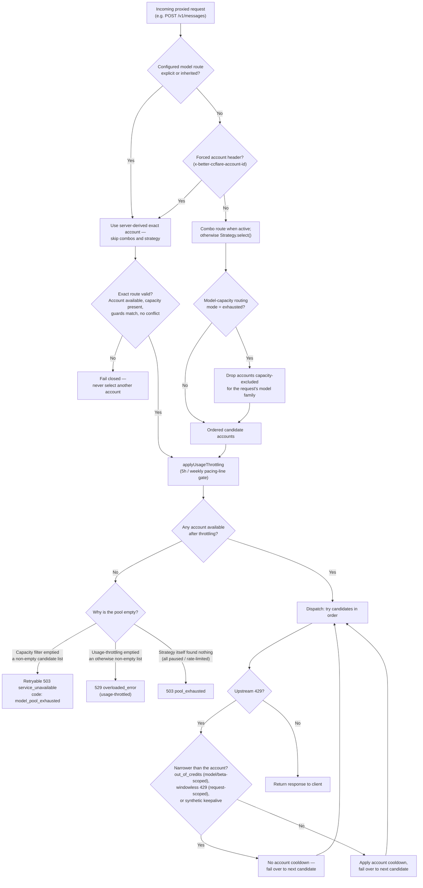
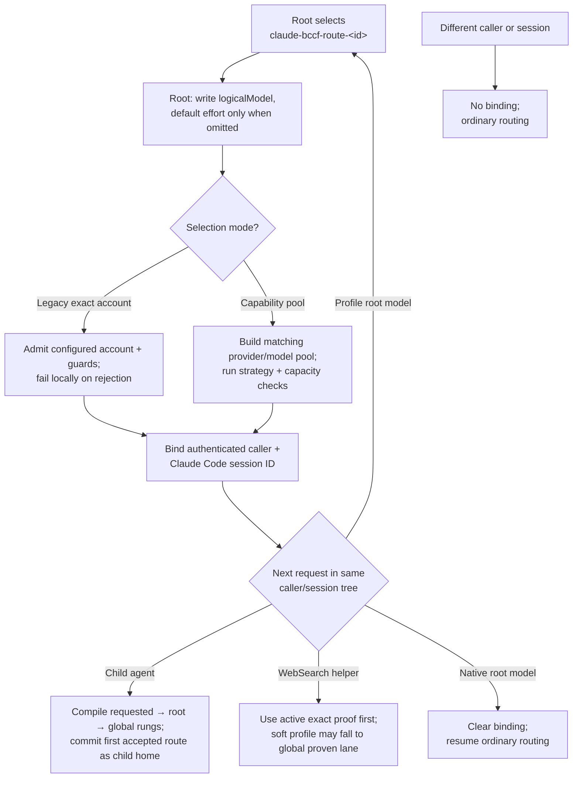
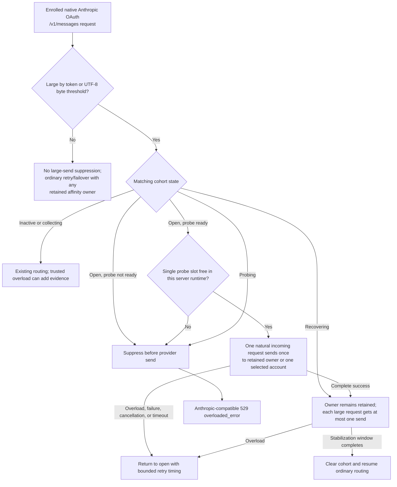
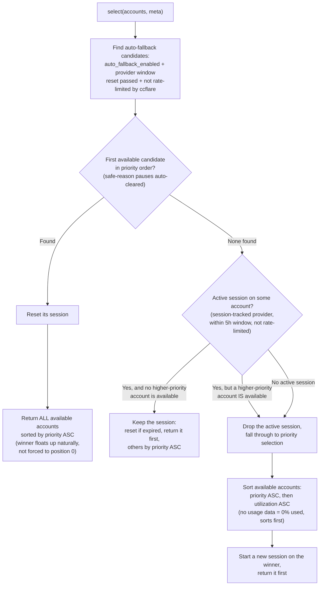
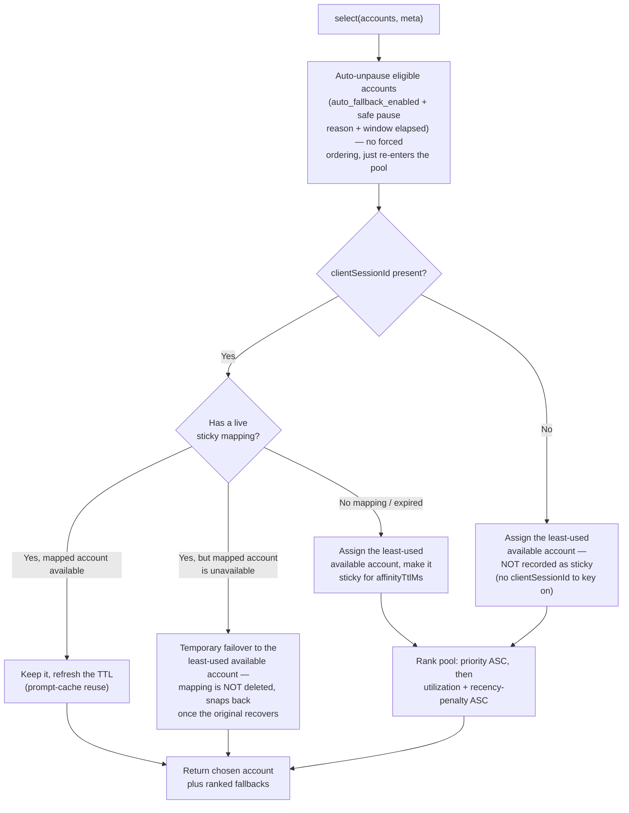
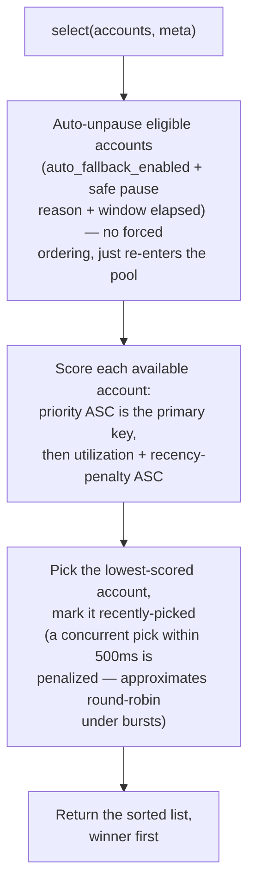
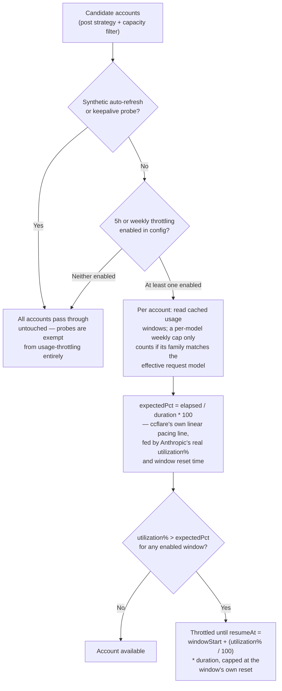
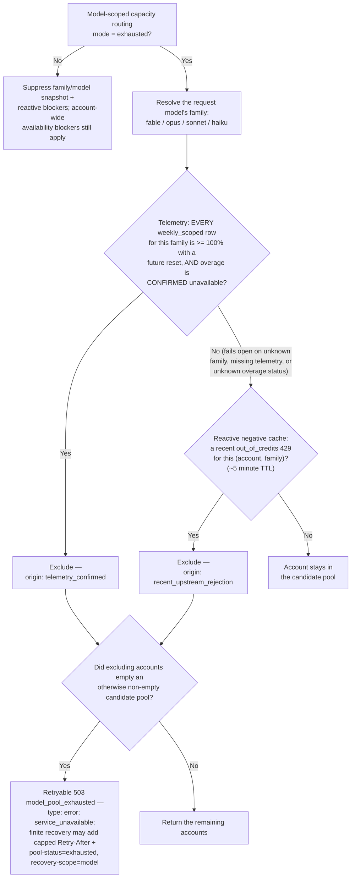
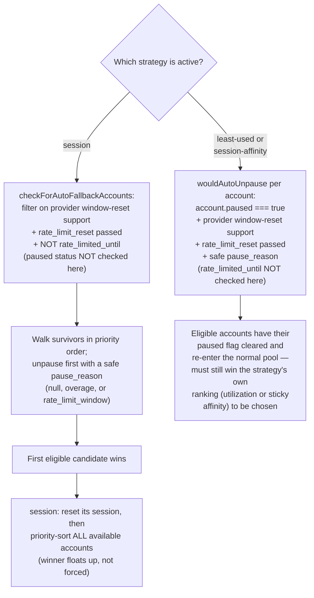

# Account Routing Architecture

This document explains how better-ccflare picks an account for each proxied request: the master pipeline, Claude Code model route profiles, the four load-balancing strategies, usage-throttling, model-family capacity routing, and auto-fallback. It is a technical reference for understanding *why* a given request landed on a given account — for user-facing setup guides see [Load Balancing](./load-balancing.md), [Auto-Fallback Configuration](./auto-fallback.md), [Combos](./combos.md), and [Configuration](./configuration.md).

> **Fork note.** This reference was ported from upstream (`tombii/better-ccflare`) and adjusted for this fork. The `session-drain-soonest` strategy is available as an explicit opt-in and preserves this fork's session-affinity/route-profile safeguards. Model-capacity routing is independently controlled by `model_scoped_capacity_routing` or its environment override — see [Model-Capacity Routing](#model-capacity-routing). This document also describes only the strategy layer; when a [Combo](./combos.md) or managed family routing is active, this fork runs an additional authoritative routing layer above it.

## Table of Contents

1. [Overview: Three Orthogonal Axes](#overview-three-orthogonal-axes)
2. [Master Pipeline](#master-pipeline)
3. [Claude Code Model Route Profiles](#claude-code-model-route-profiles)
4. [Anthropic Degraded Mode](#anthropic-degraded-mode)
5. [The Four Load-Balancing Strategies](#the-four-load-balancing-strategies)
   - [session](#session-sessionstrategy)
   - [session-affinity](#session-affinity-sessionaffinitystrategy)
   - [session-drain-soonest](#session-drain-soonest-sessiondrainsooneststrategy)
   - [least-used](#least-used-leastusedstrategy)
6. [Usage Throttling](#usage-throttling)
7. [Model-Capacity Routing](#model-capacity-routing)
8. [Selection Diagnostics](#selection-diagnostics)
9. [Auto-Fallback](#auto-fallback)

## Overview: Three Orthogonal Axes

Ordinary account routing is controlled by three independent runtime controls: the **load-balancing strategy** (`lb_strategy` — which of the four strategies below picks the candidate order), **usage-throttling** (`usage_throttling_five_hour_enabled` / `usage_throttling_weekly_enabled` — an optional pacing gate applied after strategy selection), and **model-family capacity routing** (`model_scoped_capacity_routing` — a default-off, per-model-family exclusion filter that is active only in `exhausted` mode). Any runtime "combination" you observe (e.g. `least-used` with weekly throttling and model-capacity routing enabled) is not a special combined mode — it is simply the master pipeline below with its configured controls. Understanding the pipeline once is enough to reason about every valid combination. An explicit or inherited [Claude Code model route profile](#claude-code-model-route-profiles) is a profile-scoped override above those ordinary candidate-order mechanisms: legacy profiles select one exact account, while capability profiles build a constrained account pool before applying the normal strategy and capacity checks.

## Master Pipeline

Every proxied inference request first resolves any configured model route profile and the `x-better-ccflare-account-id` force-route header (used both for manual force-routing and by internal auto-refresh/keepalive probes). A legacy profile creates a server-derived exact-account directive; a capability profile creates a root-capable provider/model pool. Neither profile fabricates or forwards the public force-route header. Conflicting profile and public directives fail closed. A valid exact-account directive bypasses combos and the configured strategy.

A capability root bypasses combos and restricts selection to accounts matching its root provider plus first physical-model mapping. A descendant compiles one ordered candidate plan: requested model inside that root-capable pool, root model inside the pool, then requested stock model through ordinary same-model routing. The candidate rung outranks account priority; priority and pressure order accounts only inside one rung. The first accepted child candidate becomes a success-conditioned, process-local home for that child/model lane. A healthy home stays first through priority changes and preferred-rung recovery, and replacement occurs only after structural, availability, capacity, credential, or route-circuit evidence proves it unusable.

A request without a profile runs combo routing when applicable and otherwise the strategy's `select()`. For ordinary, capability-profile, combo, and fallback lanes, model-capacity state enters through the fork's account-selector seam. `off` suppresses family/model snapshots and reactive model blockers in those lanes, while account-wide blockers still apply. `exhausted` applies both model-scoped signals before the optional usage-throttling gate. Exact forced routes retain fail-closed admission and never fall through to another account. If the ordinary candidate pool is empty afterwards, the response depends on *why* it emptied — the capacity filter and usage-throttling empty the pool for mutually exclusive reasons on a given request (the capacity filter runs first and, if it excludes everyone, usage-throttling never sees any accounts to throttle), so the code checks them in a fixed priority order: a capacity exclusion is reported first as retryable `503` JSON (`type: error`, `error.type: service_unavailable`, `error.code: model_pool_exhausted`), a throttling exclusion second (as a 529), and a strategy-level "nothing available at all" last (as a generic 503). When finite model recovery is known, the capacity terminal may also include capped `Retry-After`, `x-better-ccflare-pool-status: exhausted`, and `x-better-ccflare-recovery-scope: model`; `Retry-After` is not guaranteed. The default-off [Anthropic degraded-mode](#anthropic-degraded-mode) admission gate sits below selection at every physical-send boundary; in `off` and `observe` the diagram remains behaviorally unchanged, while `enforce` can retain an owner for a matching session and can return a protected 529 before dispatching a matching large request.



Three classes of 429 are narrower than the account and therefore fail over per
request with the account left in rotation — no cooldown, no
`consecutive_rate_limits` increment:

- **`out_of_credits`** — credits/overage depleted for one model or beta (e.g. context-1m); the account's other models still work.
- **`windowless_429`** — `x-should-retry: true` with no rate-limit metadata at all (no `retry-after`, no `anthropic-ratelimit-*` / `x-ratelimit-*` header). Measured on a production install as **request**-scoped: the same account served 200s two seconds before and 38 seconds after on the same model, retries spanning 11.2s returned identical bare 429s without ever clearing, and the next account rejected the same client request the same way. Benching for it drained the pool one account per failover attempt. The check is fail-closed — any header that reports window state, known name or not, is treated as a real limit and benched as before.
- **Synthetic keepalive replays** — the keepalive scheduler's own parallel burst trips a per-IP limit; no request-history row is written either.

The `windowless_429` exemption is not universal: it is evaluated only on the
no-fallback path (the requested model has no multi-entry mapping). An account
**with** multi-entry model mappings walks its fallback list first, and when every
mapped model has 429ed the request ends at `all_models_exhausted_429`, which
**does** apply an account cooldown — even if each individual 429 reported no
window.

*Source: `packages/proxy/src/proxy.ts` (`handleProxy`, `applyUsageThrottling`), `packages/proxy/src/model-route-profiles.ts`, `packages/proxy/src/handlers/account-selector.ts` (`selectAccountsForRequest`), and `packages/proxy/src/handlers/proxy-operations.ts` + `packages/proxy/src/handlers/retryable-429.ts` (the three no-bench 429 classes).*

## Claude Code Model Route Profiles

Model route profiles let an operator expose exact-account or capability-pool routes in Claude Code's native `/model` picker without putting an account UUID in the public model ID. Profiles are disabled when `CCFLARE_MODEL_ROUTE_PROFILES_JSON` is absent or blank. When enabled, an authenticated `GET /v1/models` is answered locally with the reserved `claude-bccf-route-<profile-id>` IDs and display names. It performs no provider fetch and no account selection. See [Configuration](./configuration.md#claude-code-model-route-profiles) for the strict schema and Claude Code environment variables.

An explicit root request using a profile's public model ID performs three operations in order. The profile's selection mode determines whether admission targets one account or a live capability pool:

1. Replace the root request's public model ID with the profile's `logicalModel`, apply `defaultEffort` only if neither `output_config.effort` nor `reasoning.effort` was supplied, and stage a server-derived exact-account directive for a legacy profile or a provider/model capability predicate for a capability profile.
2. Admit the route locally. Legacy admission checks one account's availability, capacity, provider, and first-physical-model mapping. Capability admission builds the current account pool from `expectedProvider` plus the first physical model mapped from the profile's root `logicalModel`, then applies the existing strategy, availability, and capacity checks. A rejected route makes no provider request and does not create or replace a binding.
3. After admission and before provider dispatch, bind the profile to the authenticated caller plus `X-Claude-Code-Session-Id` when both identities are available.

The caller's explicit effort is authoritative, including `xhigh` or `max`; a profile default never overwrites it. The account's ordinary model mapping runs after the logical root model is set, so one profile can say “select this account with this logical model” while the mapping determines the physical provider model.

Child-agent inheritance is scoped by authenticated caller, Claude Code session, and a bounded opaque child identity. A child inherits a legacy profile's exact account or a capability profile's root-capable pool. Its requested logical model is preserved and compiled into the three-rung candidate plan described above. Selection does not create a child home: the proxy commits the accepted candidate after request-local fallback settles. Each sibling has an independent home, and a marker-only descendant without stable identity gets request-local fallback but no reusable home. A native **root** request in the same caller/session clears the profile binding. An explicit profile request without a usable caller/session identity still routes that one request but cannot create a tree binding.

Provider-owned helpers are classified separately from child agents. A replay-authenticated same-session WebSearch request can inherit an active profile even when Claude Code supplies no child marker or substitutes a helper model. The helper uses the profile's exact reviewed capability proof first; a soft capability profile may fall to the global proven lane before dispatch, while exact-account, force-routed, and bounded routes remain fail-closed.

### Hosted WebSearch routing contract

Hosted WebSearch is admitted and routed as a provider-owned capability, not as an ordinary client function or a post-selection model adaptation. The request must contain exactly one valid `web_search_20250305` declaration. Tool choice may be the admitted automatic shape, or the exact forced `{ "type": "tool", "name": "web_search" }` shape when no client functions are present; unsupported fields or choice shapes fail locally. Claude Code's exact `/v1/messages?beta=true` endpoint is a semantic alias for capability admission and attempt planning, while any other query-bearing route remains distinct and must carry its own exact proof.

Eligibility is established before ranking. A trusted same-session helper may inherit an active soft capability profile, but helper classification grants no capability by itself. Every candidate must materialize the reviewed tuple covering provider, OAuth subscription route, normalized endpoint, physical model, declaration/options profile, response and mixed-tool modes, replay row, contract/decoder revision, and request/response transports. A soft profile may try another globally proven Hosted WebSearch lane only while dispatch remains hypothetical. Exact-account, public force-routed, bounded, mismatched, or proofless routes fail closed with zero provider sends.

Immediately before transport, the proxy revalidates the immutable capability and claims the request-local hosted-dispatch ledger synchronously. The first claim owns the one irreversible HTTP fetch or WebSocket `response.create` write; the claim is never released. After that point, model fallback, account failover, guard replay, in-process retry, WebSocket-to-HTTP rescue, cancellation recovery, and ambiguous transport recovery cannot execute another hosted operation for the same inbound request.

The Codex request mapper retains one native hosted-search tool and maps a forced declaration to Responses `tool_choice: "required"`; it does not send unsupported `max_tool_calls` or the non-official `web_search_call.action.sources` include. On the response path, `response.output_item.done` is authoritative for the final action. The bounded decoder accepts semantic `search` actions with one query or a query array, optional native sources, plus auxiliary `open_page` and `find_in_page` actions. When native search sources are absent, URL citations synthesize the source set and attach to the latest completed source-less semantic search; earlier source-less searches close honestly with empty results. Unknown, malformed, contradictory, out-of-order, or incomplete lifecycles terminate as translation errors rather than leaking raw provider events or inventing success.

*Source: `packages/providers/src/server-tool-capabilities.ts`, `packages/providers/src/providers/codex/server-tools.ts`, `packages/providers/src/providers/codex/server-tool-attempt-plan.ts`, `packages/providers/src/providers/codex/server-tool-response.ts`, `packages/proxy/src/handlers/account-selector.ts`, `packages/proxy/src/handlers/proxy-operations.ts`, and `packages/proxy/src/handlers/routing-attempt-ledger.ts`. Historical design and rollout evidence: [Codex Native Hosted Web Search Plan](./plans/2026-07-29-001-fix-provider-server-tool-capability-architecture-plan.md) and [Commit-Bound Capability Profile Descendant Routing Plan](./plans/2026-08-30-1854-fix-route-profile-descendant-routing-plan.md).*



Hard profile routes remain fail-closed. For legacy exact-account, public force-routed, and bounded profiles, a missing/stale account ID, manual pause, unavailable or rate-limited account, model-family quota exhaustion, provider guard mismatch, physical-model mismatch, or conflicting public force-route header returns an error instead of consulting another account. A capability root also fails closed when its root-capable pool cannot serve it. Capability descendants differ: before dispatch they may continue through the profile root and global same-model rungs, then return one typed terminal only when every authorized candidate is exhausted. A newly added account joins the root-capable pool only when its provider and root first physical mapping satisfy the predicate. Matching is exact, so an OpenRouter account mapped to `fusion` does not join a profile expecting `codex` and `gpt-5.6-sol`.

The binding registry is process-local and capped at 10,000 session entries. Entries expire after the configured `session_duration_ms` of inactivity, oldest entries are evicted at the cap, and every restart clears the registry. Consequently, all requests in a pinned tree must reach the same better-ccflare server process; sharing SQLite or PostgreSQL across replicas does not share these bindings. Other authenticated callers and other Claude Code sessions are isolated and continue to use ordinary routing.

*Source: `packages/proxy/src/model-route-profiles.ts`, `packages/proxy/src/proxy.ts` (`routeCallerIdentity`, `applyExplicitModelRoute`, `handleProxy`), and `packages/proxy/src/handlers/account-selector.ts` (`selectAccountsForRequest`).*

## Anthropic Degraded Mode

This restart-scoped feature protects large-context sessions after better-ccflare has evidence of a provider-cohort overload. It is `off` by default and does not replace the ordinary per-account cooldown or failover paths.

### Eligibility and cohort scope

Enrollment is deliberately narrow. An account must use the native `anthropic` provider, have no API key, have a nonblank refresh token, and resolve to the OAuth-subscription route class. Anthropic API-key accounts, access-token-only accounts, Anthropic-compatible providers, Codex accounts, and other providers are excluded. Runtime enforcement currently enrolls only native Anthropic `/v1/messages` requests.

The physical cohort-key abstraction can represent either a `/messages` or `/responses` path class and is built from bounded, allowlisted route facts: endpoint scheme and host, path class, Claude model family, request protocol, and canonical beta-feature signature. The current runtime enrollment above does not yet apply degraded-mode enforcement to `/responses`. Unsupported or ambiguous route facts fail open. This keeps unrelated endpoints, protocols, model families, and beta lanes from sharing outage state.

A cohort opens only after trusted pre-commit overload outcomes from the configured quorum of distinct underlying account IDs inside the evidence window. The default quorum is two. A faithful HTTP 529 and a pre-commit Anthropic semantic `overloaded_error` qualify. Aliases and repeated sends through one account still count as one source; authentication, authorization, quota, 429, transport, cancellation, and post-commit failures do not qualify. A force-routed outcome cannot establish or refresh shared evidence, but an eligible force-routed request still obeys an already-open matching cohort.

### Replay risk, ownership, and admission

Replay risk is classified once from the final normalized Anthropic body after interception and before account-specific transforms. A request is large when its best nonthrowing input-token estimate meets the token threshold **or** its actual UTF-8 body length meets the byte threshold; estimator failure leaves the byte check authoritative. Small requests retain ordinary validity checks, cooldowns, retries, failover, and send admission, and the large-request gate never suppresses them. During active degradation, however, an existing retained authoritative owner can still influence `session-affinity` candidate ordering.

For a protected large request, `session-affinity` supplies a side-effect-free owner snapshot when one exists, and the first qualifying snapshot is retained across transient overload. If that owner remains valid, a probe can target only that owner. If no valid owner exists, assignment is deferred and at most one policy-selected account can be committed as the owner, only after a terminal success. Non-overload invalidation can remove a stale owner, but it does not grant another send to the same protected request.



The recovery probe always comes from normal incoming traffic; better-ccflare never creates a synthetic Anthropic probe. A committed probe succeeds only after a nonstream body is fully consumed or an Anthropic stream reaches `message_stop` and then clean EOF. The lease watchdog aborts a stuck transport before releasing its fenced lease, so a late completion cannot close the cohort or overlap a successor. A successful probe enters the bounded recovering window; another qualifying overload reopens protection.

`observe` uses isolated shadow ownership and the same pure classification to report would-retain, would-probe, and would-suppress decisions. It changes no candidate order, owner mapping, transport count, response, or retry. Restarting into `enforce` starts with empty enforcement state; observe evidence is never promoted.

### Protected terminal response and topology boundary

Local suppression and semantic overload use the canonical body:

```json
{"type":"error","error":{"type":"overloaded_error","message":"Overloaded"}}
```

The response status is 529. Its headers are rebuilt from a narrow allowlist: canonical JSON content type, a numeric `Retry-After`, and a syntactically safe bounded upstream `x-request-id` when one exists. Trusted upstream 529 bodies are transferred without eager reads, but unapproved upstream headers are still removed. Coordinator retry timing uses the configured min/fallback/max values; the client-visible protected terminal applies a narrower 5–60 second safety clamp. The front guard treats 529 as terminal and performs no request-body replay.

The single-probe guarantee is process-local. `enforce` is supported only when every affected request reaches one server-process coordinator. A second server process, worker, pod, or replica owns independent in-memory state and may elect its own probe; sharing SQLite or PostgreSQL does not change that boundary. State, leases, retained owners, and shadow state all clear on restart.

*Source: `packages/proxy/src/anthropic-degraded-eligibility.ts`, `packages/proxy/src/anthropic-degraded-mode.ts`, `packages/proxy/src/degraded-owner-overlay.ts`, `packages/proxy/src/handlers/proxy-operations.ts`, and `packages/proxy/src/handlers/routing-terminal.ts`. Configuration and safe bounds are documented in [Configuration](./configuration.md#anthropic-degraded-mode).*

## The Load-Balancing Strategies

`lb_strategy` selects one of the implementations in `packages/load-balancer/src/strategies/` (all constructed in `apps/server/src/server.ts`; the two drain-soonest entries share one class in different modes). All of them return an ordered list of candidate accounts; the first entry is tried first, the rest are failover order.

### session (SessionStrategy)

The default strategy pins a client to one account for the configured session duration (5h by default) so prompt caches stay warm, and only rotates to a new account once that session expires, the account becomes unavailable, or a higher-priority account frees up. An active session *can* be preempted — but only by a strictly higher-priority account, never by a same-or-lower-priority one. Auto-fallback candidates are checked first on every call; if one becomes eligible, its session is reset but it is not force-ranked to the top — it is simply included in a fresh priority-sorted list, avoiding a priority inversion if an even-higher-priority account is already available.



*Source: `packages/load-balancer/src/strategies/index.ts` (`SessionStrategy.select`, `checkForAutoFallbackAccounts`).*

### session-affinity (SessionAffinityStrategy)

A hybrid of `session` and `least-used`, keyed on the *client's* session id (the request body's `metadata.user_id`) rather than a single account-level session: the first request from a new client is routed to the least-loaded account, and that client→account mapping then stays sticky for `affinityTtlMs`. This spreads many concurrent client-sessions across the whole pool (instead of `session`'s single account taking all traffic until it rate-limits), while each individual client still keeps its prompt-cache locality. A request with no `clientSessionId` at all is still routed to the least-used account, but since there is no client id to key on, no sticky mapping is recorded for it — the next such request is scored fresh. Auto-fallback here only auto-*unpauses* eligible accounts so they re-enter the pool — it never forces a pick, unlike `session`.



*Source: `packages/load-balancer/src/strategies/session-affinity.ts`.*

### session-drain-soonest (SessionDrainSoonestStrategy)

This is an explicit opt-in variant of `session-affinity`, not a replacement
for the account-level `session` strategy. It keeps the inherited per-client
and per-lane owner map, temporary failover/snapback behavior, anti-thrash
guard, route circuits, and candidate sidecar identity. A request with no
`clientSessionId` still receives a fresh order and records no sticky owner.

Only a fresh assignment or an account-level failover invokes the drain ranking. Structural routing classes remain authoritative: reset urgency cannot cross a provider/model/tier or route-profile boundary. Within one authorized class, eligible auto-fallback candidates are considered first; otherwise candidates are ordered by the earliest known **future** all-model weekly reset, then account priority, utilization, the bounded recency score, and stable candidate identity. Missing, malformed, stale, or past reset telemetry is unknown and sorts after a known future reset; if every reset is unknown, the ordinary affinity ordering is effectively retained. Explicit retain-owner and route-circuit decisions remain authoritative. The provider-neutral usage helper accepts only the
canonical flat `seven_day` or `limits[].weekly_all` shapes, so unrelated
provider credit windows cannot become drain signals.

`peek()` uses the same fresh-candidate hook as `select()` for dashboard parity;
it has no client key and therefore does not mutate affinity. Existing sticky
owners remain authoritative even when another account's weekly reset is sooner.

*Source: `packages/load-balancer/src/strategies/session-drain-soonest.ts`, the
protected ranking hook in `session-affinity.ts`, and
`packages/providers/src/usage-fetcher.ts`.*

### least-used (LeastUsedStrategy)

The simplest strategy: no session stickiness at all, every request independently picks the account with the lowest effective utilization (upstream utilization plus a short recency penalty so concurrent bursts spread across the pool instead of piling onto the same "emptiest" account). It trades prompt-cache reuse for better burst tolerance — a spike of N concurrent requests is spread across all healthy accounts rather than funneled into one, reducing the chance of several accounts hitting per-account rate limits at once. Like `session-affinity`, its auto-fallback handling only auto-unpauses eligible accounts; it never forces a pick.



*Source: `packages/load-balancer/src/strategies/least-used.ts`.*

## Usage Throttling

Independent of which strategy picked the candidate order, usage-throttling (`usage_throttling_five_hour_enabled` / `usage_throttling_weekly_enabled`) can hold an account back even though it isn't rate-limited yet. For each enabled window class, ccflare computes its own linear **pacing line** — the percentage of the window's duration that has elapsed — and compares it against Anthropic's real reported utilization: if the account is "ahead of pace" it is throttled until the point where reported usage and the pacing line would realign. A per-model weekly cap only counts against the request's own model family for normal requests — but combo-routed requests assign their per-slot model later in the pipeline, so `applyUsageThrottling` passes no request model for them and model-scoped weekly windows are skipped entirely (only the flat, non-scoped windows and the reactive `out_of_credits` cache still apply). Internal auto-refresh/keepalive probes (identified by the `x-better-ccflare-auto-refresh` / `x-better-ccflare-keepalive` request headers) are exempted from this gate entirely — they exist specifically to hit the real endpoint and observe state changes (window resets, recovered accounts), and without the exemption a throttled-but-healthy account's own probe would get our own 529 back, which the auto-refresh scheduler previously misread as an endpoint failure and counted toward its consecutive-failure pause threshold.



*Source: `packages/proxy/src/handlers/usage-throttling.ts` (`getUsageThrottleStatus`), `packages/proxy/src/proxy.ts` (`applyUsageThrottling`).*

## Model-Capacity Routing

Model-capacity routing is `off` by default. The resolved mode uses the first valid source in this order: `MODEL_SCOPED_CAPACITY_ROUTING`, then the `model_scoped_capacity_routing` config-file field, then the default `off`. While the environment variable is the active source, the dashboard setting is locked read-only; `force_account_model` remains a separate config-file-only control and does not affect this mode. For ordinary, capability-profile, combo, and fallback lanes, `off` suppresses family/model snapshots and reactive blockers at the account-selector seam, while account-wide availability blockers still run. Exact forced routes remain fail-closed and never consult another account. In `exhausted` mode, accounts whose weekly per-model-family cap (e.g. a Fable/Opus/Sonnet-specific quota) is provably exhausted are excluded from those lanes for requests of that family. Exclusion has two independent signals: a **telemetry-confirmed** one (the account's own usage payload shows every relevant weekly-scoped row at ≥100% with a future reset, and pay-as-you-go overage is confirmed unavailable) and a **reactive** one (a recently observed `out_of_credits` 429 sidelines the account for that family for a short, fixed TTL to bridge the telemetry poll interval). The filter fails open on any ambiguity — an unknown model family, missing/dropped telemetry rows, or an unresolved overage signal never causes an exclusion — because a false exclusion removes a working account while a false pass only costs one extra 429 round-trip. Only when excluding accounts empties an otherwise non-empty candidate pool does the fork return retryable HTTP `503` JSON with `type: error`, `error.type: service_unavailable`, and `error.code: model_pool_exhausted` instead of falling through to the generic pool-exhausted path. When finite model recovery is known, it may also include capped `Retry-After`, `x-better-ccflare-pool-status: exhausted`, and `x-better-ccflare-recovery-scope: model`; `Retry-After` is not guaranteed.



*Source: this fork implements the filter inline rather than in upstream's standalone `model-capacity.ts` module — see `packages/proxy/src/handlers/account-selector.ts` (`getReactiveModelCapacityBlocker`, the hard-capacity exclusion path), `packages/proxy/src/handlers/usage-throttling.ts` (`evaluateHardCapacity`), `packages/proxy/src/handlers/routing-terminal.ts` (the `model_pool_exhausted` terminal outcome), and `packages/proxy/src/handlers/proxy-operations.ts` (the `out_of_credits` 429 handler that feeds the reactive cache — distinct from the unrelated `all_models_exhausted_429` per-account cooldown reason used when an account's own configured model-fallback list is exhausted`).*

## Selection Diagnostics

When selection ends without an upstream dispatch, the proxy emits a bounded `routing_diagnostics` object in the `route_unavailable` error and records the same shape in structured logs. It contains only candidate counts and policy/profile flags — never account IDs, names, headers, request bodies, or provider messages. Selection-origin terminals always include `attempted_routes: 0`; this is the authoritative distinction between “no route was sent” and a terminal produced after upstream attempts.

| Field | Meaning |
|---|---|
| `mode` | Restart-scoped implicit fallback mode: `off`, `observe`, or `enforce`. |
| `structural_candidate_count` | Bounded candidates entering the relevant implicit selection lane. |
| `eligible_candidate_count` | Candidates remaining after policy and structural admission. |
| `excluded_candidate_count` | Structural minus eligible candidates. |
| `selected_candidate_count` | Candidates returned by the final strategy ordering. |
| `zero_attempt_reason` | `policy_excluded`, `no_eligible_candidates`, `all_unavailable`, or `selection_timeout`. |
| `forced_route`, `capability_profile`, `route_profile` | Boolean indicators that explain whether an explicit route/profile boundary was present. |

Interpret the reason conservatively. `policy_excluded` is emitted only when the enforce filter itself removed every implicit candidate. `all_unavailable` covers a structurally known pool whose accounts were paused, rate-limited, or capacity-blocked; `no_eligible_candidates` means no structural candidate was available to describe; and `selection_timeout` means the bounded selection phase expired before it completed. A 503 with `attempted_routes: 0` is therefore a local routing decision, not evidence of a provider 403/503.

## Auto-Fallback

The same per-account `auto_fallback_enabled` flag drives two different mechanisms depending on which strategy is active, and the two mechanisms do **not** share one eligibility rule — they diverge on exactly which state an account must be in. `session` runs a dedicated `checkForAutoFallbackAccounts` pass: it filters candidates on provider window-reset support (Anthropic, Codex, or Zai) with `rate_limit_reset` passed AND not currently rate-limited by ccflare — deliberately checking paused status nowhere, so both paused and already-unpaused accounts can win this pass — then walks the survivors in priority order and unpauses the first one whose `pause_reason` is safe (`null`, `overage`, or `rate_limit_window` — never `manual` or `failure_threshold`), letting it float up in a fresh priority sort. `least-used` and `session-affinity` instead only auto-*unpause* eligible accounts via the shared `wouldAutoUnpause` predicate, which requires `account.paused === true` (unlike the other pass, an already-unpaused account is simply skipped here — there's nothing to unpause) plus the same provider/window-reset/safe-pause-reason checks, but does **not** check `rate_limited_until` at all; the account re-enters the normal pool but must still win that strategy's own ranking (utilization score or sticky affinity) to actually be chosen, and neither strategy force-picks it.



*Source: `packages/load-balancer/src/strategies/peek-availability.ts` (`wouldAutoUnpause`, shared by `least-used` and `session-affinity`), `packages/load-balancer/src/strategies/index.ts` (`checkForAutoFallbackAccounts`).*
