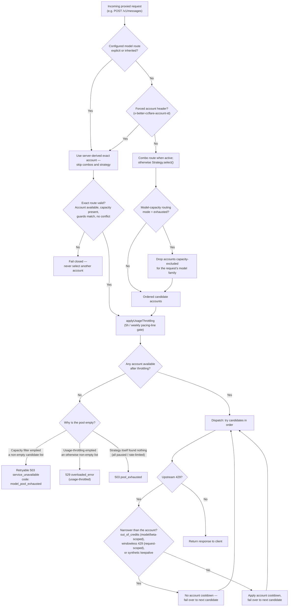
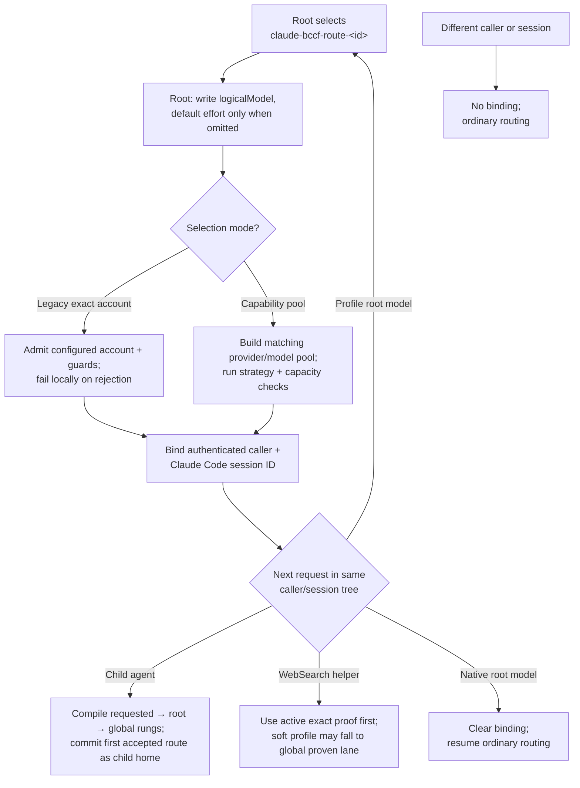
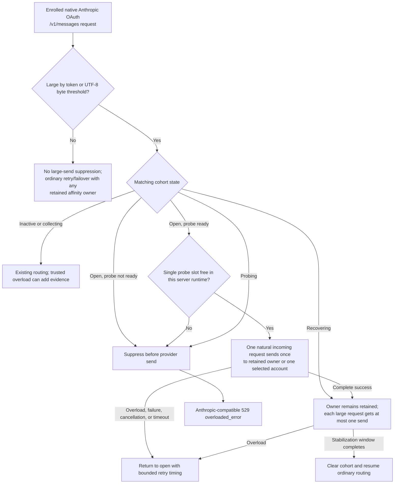
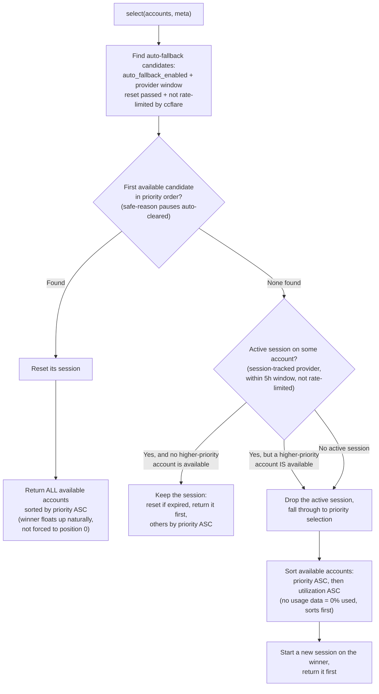
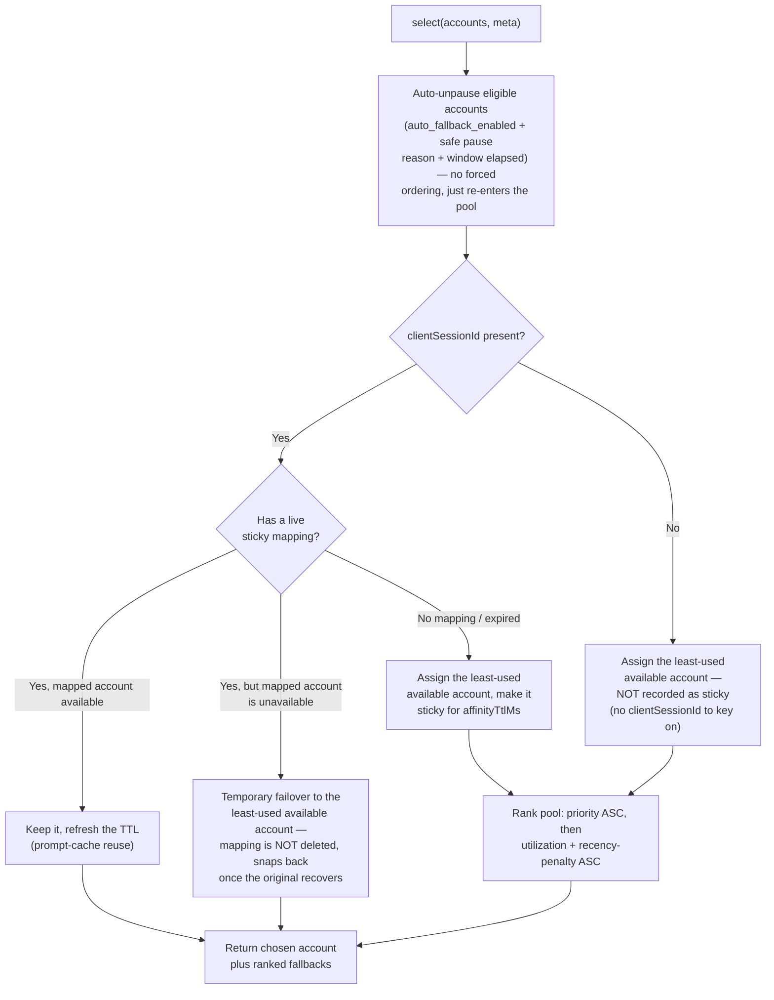
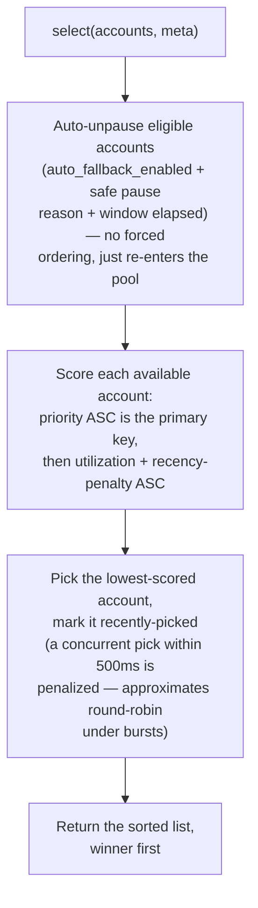
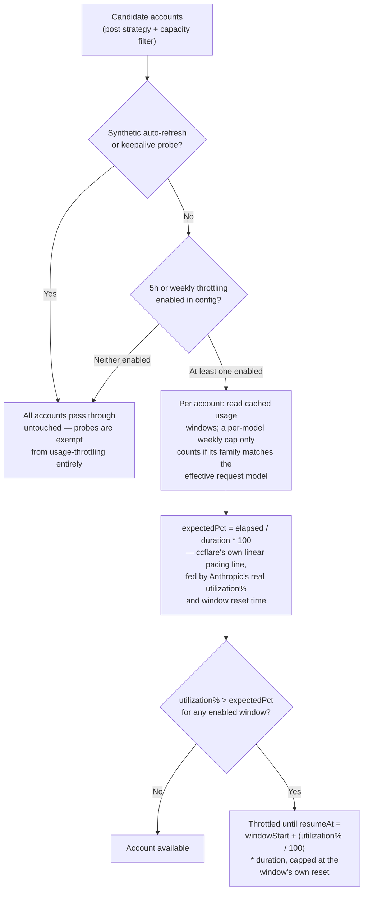
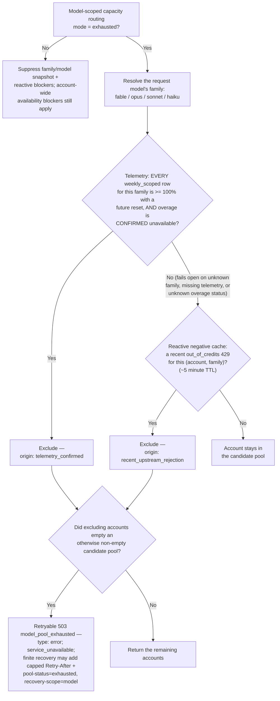
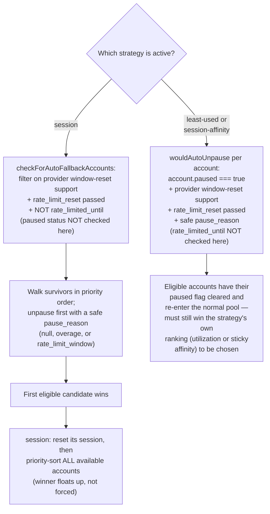

# Account Routing Architecture

This document explains how better-ccflare picks an account for each proxied request: the master pipeline, Claude Code model route profiles, the four load-balancing strategies, usage-throttling, model-family capacity routing, and auto-fallback. It is a technical reference for understanding *why* a given request landed on a given account — for user-facing setup guides see [Load Balancing](./load-balancing.md), [Auto-Fallback Configuration](./auto-fallback.md), [Combos](./combos.md), and [Configuration](./configuration.md).

> **Fork note.** This reference was ported from upstream (`tombii/better-ccflare`) and adjusted for this fork. The `session-drain-soonest` strategy is available as an explicit opt-in and preserves this fork's session-affinity/route-profile safeguards. Model-capacity routing is independently controlled by `model_scoped_capacity_routing` or its environment override — see [Model-Capacity Routing](#model-capacity-routing). This document also describes only the strategy layer; when a [Combo](./combos.md) or managed family routing is active, this fork runs an additional authoritative routing layer above it.

## Table of Contents

1. [Overview: Three Orthogonal Axes](#overview-three-orthogonal-axes)
2. [Master Pipeline](#master-pipeline)
3. [Claude Code Model Route Profiles](#claude-code-model-route-profiles)
   - [Hosted WebSearch routing contract](#hosted-websearch-routing-contract)
   - [Advisor native routing contract](#advisor-native-routing-contract)
4. [Anthropic Degraded Mode](#anthropic-degraded-mode)
5. [The Four Load-Balancing Strategies](#the-four-load-balancing-strategies)
   - [session](#session-sessionstrategy)
   - [session-affinity](#session-affinity-sessionaffinitystrategy)
   - [session-drain-soonest](#session-drain-soonest-sessiondrainsooneststrategy)
   - [least-used](#least-used-leastusedstrategy)
6. [Usage Throttling](#usage-throttling)
7. [Model-Capacity Routing](#model-capacity-routing)
   - [Per-account usage-window caps](#per-account-usage-window-caps)
8. [Selection Diagnostics](#selection-diagnostics)
9. [Auto-Fallback](#auto-fallback)

## Overview: Three Orthogonal Axes

Ordinary account routing is controlled by three independent runtime controls: the **load-balancing strategy** (`lb_strategy` — which of the four strategies below picks the candidate order), **usage-throttling** (`usage_throttling_five_hour_enabled` / `usage_throttling_weekly_enabled` — an optional pacing gate applied after strategy selection), and **model-family capacity routing** (`model_scoped_capacity_routing` — a default-off, per-model-family exclusion filter that is active only in `exhausted` mode). Any runtime "combination" you observe (e.g. `least-used` with weekly throttling and model-capacity routing enabled) is not a special combined mode — it is simply the master pipeline below with its configured controls. Understanding the pipeline once is enough to reason about every valid combination. An explicit or inherited [Claude Code model route profile](#claude-code-model-route-profiles) is a profile-scoped override above those ordinary candidate-order mechanisms: legacy profiles select one exact account, while capability profiles build a constrained account pool before applying the normal strategy and capacity checks.

## Master Pipeline

Every proxied inference request first resolves any configured model route profile and the `x-better-ccflare-account-id` force-route header (used both for manual force-routing and by internal auto-refresh/keepalive probes). A legacy profile creates a server-derived exact-account directive; a capability profile creates a root-capable provider/model pool. Neither profile fabricates or forwards the public force-route header. Conflicting profile and public directives fail closed. A valid exact-account directive bypasses combos and the configured strategy.

A capability root bypasses combos and restricts selection to accounts matching its root provider plus first physical-model mapping. A descendant compiles one ordered candidate plan: requested model inside that root-capable pool, root model inside the pool, then requested stock model through ordinary same-model routing. The candidate rung outranks account priority; priority and pressure order accounts only inside one rung. The first accepted child candidate becomes a success-conditioned, process-local home for that child/model lane. A healthy home stays first through priority changes and preferred-rung recovery, and replacement occurs only after structural, availability, capacity, credential, or route-circuit evidence proves it unusable.

A request without a profile runs combo routing when applicable and otherwise the strategy's `select()`. For ordinary, capability-profile, combo, and fallback lanes, model-capacity state enters through the fork's account-selector seam. `off` suppresses family/model snapshots and reactive model blockers in those lanes, while account-wide blockers still apply. `exhausted` applies both model-scoped signals before the optional usage-throttling gate. Exact forced routes retain fail-closed admission and never fall through to another account. If the ordinary candidate pool is empty afterwards, the response depends on *why* it emptied — the capacity filter and usage-throttling empty the pool for mutually exclusive reasons on a given request (the capacity filter runs first and, if it excludes everyone, usage-throttling never sees any accounts to throttle), so the code checks them in a fixed priority order: a capacity exclusion is reported first as retryable `503` JSON (`type: error`, `error.type: service_unavailable`, `error.code: model_pool_exhausted`), a throttling exclusion second (as a 529), and a strategy-level "nothing available at all" last (as a generic 503). When finite model recovery is known, the capacity terminal may also include capped `Retry-After`, `x-better-ccflare-pool-status: exhausted`, and `x-better-ccflare-recovery-scope: model`; `Retry-After` is not guaranteed. The default-off [Anthropic degraded-mode](#anthropic-degraded-mode) admission gate sits below selection at every physical-send boundary; in `off` and `observe` the diagram remains behaviorally unchanged, while `enforce` can retain an owner for a matching session and can return a protected 529 before dispatching a matching large request.


```mermaid
flowchart TD
    A["Incoming proxied request<br/>(e.g. POST /v1/messages)"] --> R{"Configured model route<br/>explicit or inherited?"}
    R -->|"Yes"| C["Use server-derived exact account —<br/>skip combos and strategy"]
    R -->|"No"| B{"Forced account header?<br/>(x-better-ccflare-account-id)"}
    B -->|"Yes"| C
    B -->|"No"| D["Combo route when active;<br/>otherwise Strategy.select()"]
    C --> C2{"Exact route valid?<br/>Account available, capacity present,<br/>guards match, no conflict"}
    C2 -->|"No"| C3["Fail closed —<br/>never select another account"]
    C2 -->|"Yes"| H["applyUsageThrottling<br/>(5h / weekly pacing-line gate)"]
    D --> E{"Model-capacity routing<br/>mode = exhausted?"}
    E -->|"Yes"| F["Drop accounts capacity-excluded<br/>for the request's model family"]
    E -->|"No"| G["Ordered candidate accounts"]
    F --> G
    G --> H
    H --> I{"Any account available<br/>after throttling?"}
    I -->|"No"| J{"Why is the pool empty?"}
    J -->|"Capacity filter emptied<br/>a non-empty candidate list"| K["Retryable 503 service_unavailable<br/>code: model_pool_exhausted"]
    J -->|"Usage-throttling emptied<br/>an otherwise non-empty list"| L["529 overloaded_error<br/>(usage-throttled)"]
    J -->|"Strategy itself found nothing<br/>(all paused / rate-limited)"| M["503 pool_exhausted"]
    I -->|"Yes"| N["Dispatch: try candidates in order"]
    N --> O{"Upstream 429?"}
    O -->|"Yes"| P{"Narrower than the account?<br/>out_of_credits (model/beta-scoped),<br/>windowless 429 (request-scoped),<br/>or synthetic keepalive"}
    P -->|"Yes"| P2["No account cooldown —<br/>fail over to next candidate"]
    P -->|"No"| P3["Apply account cooldown,<br/>fail over to next candidate"]
    P2 --> N
    P3 --> N
    O -->|"No"| Q["Return response to client"]
```

Three classes of 429 are narrower than the account and therefore fail over per
request with the account left in rotation — no cooldown, no
`consecutive_rate_limits` increment:

- **`out_of_credits`** — credits/overage depleted for one model or beta (e.g. context-1m); the account's other models still work.
- **`windowless_429`** — `x-should-retry: true` with no rate-limit metadata at all (no `retry-after`, no `anthropic-ratelimit-*` / `x-ratelimit-*` header). Measured on a production install as **request**-scoped: the same account served 200s two seconds before and 38 seconds after on the same model, retries spanning 11.2s returned identical bare 429s without ever clearing, and the next account rejected the same client request the same way. Benching for it drained the pool one account per failover attempt. The check is fail-closed — any header that reports window state, known name or not, is treated as a real limit and benched as before.
- **Synthetic keepalive replays** — the keepalive scheduler's own parallel burst trips a per-IP limit; no request-history row is written either.

The `windowless_429` exemption is not universal: it is evaluated only on the
no-fallback path (the requested model has no multi-entry mapping). An account
**with** multi-entry model mappings walks its fallback list first, and when every
mapped model has 429ed the request ends at `all_models_exhausted_429`, which
**does** apply an account cooldown — even if each individual 429 reported no
window.

*Source: `packages/proxy/src/proxy.ts` (`handleProxy`, `applyUsageThrottling`), `packages/proxy/src/model-route-profiles.ts`, `packages/proxy/src/handlers/account-selector.ts` (`selectAccountsForRequest`), and `packages/proxy/src/handlers/proxy-operations.ts` + `packages/proxy/src/handlers/retryable-429.ts` (the three no-bench 429 classes).*

## Claude Code Model Route Profiles

Model route profiles let an operator expose exact-account or capability-pool routes in Claude Code's native `/model` picker without putting an account UUID in the public model ID. Profiles are disabled when `CCFLARE_MODEL_ROUTE_PROFILES_JSON` is absent or blank. When enabled, an authenticated `GET /v1/models` is answered locally with the reserved `claude-bccf-route-<profile-id>` IDs and display names. It performs no provider fetch and no account selection. See [Configuration](./configuration.md#claude-code-model-route-profiles) for the strict schema and Claude Code environment variables.

An explicit root request using a profile's public model ID performs three operations in order. The profile's selection mode determines whether admission targets one account or a live capability pool:

1. Replace the root request's public model ID with the profile's `logicalModel`, apply `defaultEffort` only if neither `output_config.effort` nor `reasoning.effort` was supplied, and stage a server-derived exact-account directive for a legacy profile or a provider/model capability predicate for a capability profile.
2. Admit the route locally. Legacy admission checks one account's availability, capacity, provider, and first-physical-model mapping. Capability admission builds the current account pool from `expectedProvider` plus the first physical model mapped from the profile's root `logicalModel`, then applies the existing strategy, availability, and capacity checks. A rejected route makes no provider request and does not create or replace a binding.
3. After admission and before provider dispatch, bind the profile to the authenticated caller plus `X-Claude-Code-Session-Id` when both identities are available.

The caller's explicit effort is authoritative, including `xhigh` or `max`; a profile default never overwrites it. The account's ordinary model mapping runs after the logical root model is set, so one profile can say “select this account with this logical model” while the mapping determines the physical provider model.

Child-agent inheritance is scoped by authenticated caller, Claude Code session, and a bounded opaque child identity. A child inherits a legacy profile's exact account or a capability profile's root-capable pool. Its requested logical model is preserved and compiled into the three-rung candidate plan described above. Selection does not create a child home: the proxy commits the accepted candidate after request-local fallback settles. Each sibling has an independent home, and a marker-only descendant without stable identity gets request-local fallback but no reusable home. A native **root** request in the same caller/session clears the profile binding. An explicit profile request without a usable caller/session identity still routes that one request but cannot create a tree binding.

Provider-owned helpers are classified separately from child agents. A `/v1/messages` request that declares a hosted server tool (the `web_search_20250305` WebSearch helper; advisor alone does not count) and no client function tools gets helper lineage, whatever its model and child markers say. A request that also declares client functions is a real turn: it is a helper only in the stock-model, non-child shape, and a picker-model or child request keeps its root or descendant lineage. Claude Code sends three shapes: the main-loop model as sent, which in a profile session is the picker id `claude-bccf-route-<id>`; a stock model with no child marker; and a child request from a subagent or workflow agent. Lineage and profile resolution are separate decisions. A picker-model helper resolves its profile explicitly by that id. A child helper inherits as a child does. A stock-model helper inherits the session binding even when Claude Code supplies no child marker. An inherited helper's model is set to the profile's `logicalModel`. The helper uses the profile's exact reviewed capability proof first; a soft capability profile may fall to the global proven lane before dispatch (for WebSearch that includes the native passthrough lane below), while exact-account, force-routed, and bounded routes remain fail-closed. A helper never commits or clears a profile binding or root intent, on the ordinary path or the quality route, so a helper served from outside the profile pool never rebinds the session.

### Hosted WebSearch routing contract

Hosted WebSearch is admitted and routed as a provider-owned capability, not as an ordinary client function or a post-selection model adaptation. The request must contain exactly one valid `web_search_20250305` declaration. Tool choice may be the admitted automatic shape, or the exact forced `{ "type": "tool", "name": "web_search" }` shape when no client functions are present; unsupported fields or choice shapes fail locally. Claude Code's exact `/v1/messages?beta=true` endpoint is a semantic alias for capability admission and attempt planning, while any other query-bearing route remains distinct and must carry its own exact proof.

Eligibility is established before ranking. A trusted same-session helper may inherit an active soft capability profile, but helper classification grants no capability by itself. Every candidate must materialize the reviewed tuple covering provider, OAuth subscription route, normalized endpoint, physical model, declaration/options profile, response and mixed-tool modes, replay row, contract/decoder revision, and request/response transports. A soft profile may try another globally proven Hosted WebSearch lane only while dispatch remains hypothetical. A hosted candidate that cannot materialize a proven tuple (mismatched, proofless, or a declaration carrying `search_profile`) is never served by the hosted lane, and exact-account, public force-routed, and bounded routes stay fail-closed for it with zero provider sends. Hosted proof is one of two lanes; the other is the native passthrough below.

**Two lanes.** A web_search requirement is served by either lane, and strategy and priority order decide between them (no lane is ranked ahead of the other).

- **Hosted lane** (Codex, unchanged). Everything above and below this list: reviewed tuple, replay authority, hosted-dispatch ledger, response decoder. It stays fail-closed.
- **Native passthrough lane.** `api.anthropic.com` executes `web_search_20250305` itself, so a first-party Anthropic account (`isFirstPartyAnthropicAccount`, computed from the live account, never from the request) serves it with no tuple, no proof, no replay envelopes and no hosted-dispatch claim. The declaration and body are forwarded as sent, the inbound query (`?beta=true`) is kept (a hosted candidate still gets an empty query), and ordinary retry, refresh and failover apply. Anthropic-compatible accounts, Anthropic accounts on custom endpoints, Codex, xAI and every other provider are not native candidates.

**Shared predicate.** `isNativeWebSearchPassthroughEligible(requirements, firstPartyAnthropic)` (`packages/providers/src/server-tool-capabilities.ts`) is used by selection, dispatch, Auto admission and the Auto candidate loop. It is true only for a first-party account with defined requirements, no `invalid` or `unsupported` entries, exactly one declaration of type `web_search_20250305`, and replay input and output atoms that are empty or only `native-Anthropic`. Any `proxy-evidence-v1` atom (Codex-hosted `bccf...` history Anthropic cannot read) excludes the native lane, and so does a truncated history scan, which forces every atom on. A history-only request (no declaration) and a second typed tool beside web_search are excluded. The predicate takes requirements only, so advisor beside web_search is refused by the caller's native-requirement gate (see the advisor contract), not by the predicate.

**Selection.** A native candidate is `proven` with `lane: "native_passthrough"`, a sentinel proof key (`native-passthrough:web_search_20250305`, not a tuple digest), empty replay modes and replay status `not_required`, but only when the candidate's physical-model preview is non-null; the logical model is never substituted, so a `gpt-*` helper is not admitted onto Anthropic. Native candidates count as proven: no first-party account in the pool answers `no_implementation` (400), and first-party accounts that are all unavailable answer `temporary_unavailable` (503, `route_unavailable`). A forced account (`x-better-ccflare-account-id`) is admitted when first-party and stays `forced_incapable` otherwise.

**Replay bind.** When the request's replay keyring cannot bind (`handleProxy`) and the request is native-eligible and the account inventory holds a first-party Anthropic account, the request continues with `requestMeta.serverToolReplayBound = false`: selection marks every proven non-native candidate replay-ineligible (`output_unavailable`), so only native candidates can serve, and a hosted-only pool answers `replay_unavailable`. Otherwise the bind failure stays terminal with `replay_unavailable` before selection, with zero sends. Production has a replay keyring (`CCFLARE_SERVER_TOOL_REPLAY_KEYS_FILE`), so the bind succeeds there and this path is only the degraded case. A natively served request still binds, so it burns one replay counter range that it never uses; the request-private claimant is an in-memory closure, so nothing is left to release.

**One search per request.** The routing-attempt ledger records native physical sends (`nativeSearchDispatchState`, monotonic like the hosted claim). Once a native send has begun, hosted candidates are skipped; once a hosted dispatch is claimed, native candidates are skipped. No current route reaches that second arm and it has no test of its own: a claimed hosted dispatch ends the request, on success or through `createHostedDispatchTerminalResponse` on any error, so no later candidate is tried. It stays as the invariant check because that guarantee lives in a different code path (the hosted terminal handler), not in the resolver itself. Both are the existing per-candidate skip (`ServerToolCandidateCapabilityError`, reason `other_lane_dispatched`), never a terminal error, and the hosted claim-time recheck applies the same rule. In the Auto candidate loop only a capability error with reason `other_lane_dispatched` becomes the per-candidate `tools-unsupported` skip; every other capability reason (for example `proof_drift`) keeps the pre-native `attempt-unavailable` outcome and ends the attempt, so a drifting proof is never papered over by serving the next candidate. Native-to-native failover keeps ordinary semantics. A non-first-party account that is not hosted-proven and reaches dispatch (for example a capacity-deferred route that bypassed selection) throws its capability error and is never fetched. On the hosted path a failed bind leaves no request-private replay authority, so `resolveExactServerToolCapability`'s `!replay` check throws `replay_unavailable` at dispatch.

**Known limits.**

- Any native send, including one that ends in a 429 or 5xx before a search executed, makes hosted candidates skip for the rest of the request. This loses availability (a hosted lane that could have served is not tried) but can never produce a second search.
- A natively served request still reserves one request-private replay range at bind, as it did before this branch, because the bind precedes selection. It issues no envelope.
- Native server-tool results are very likely bound to the Anthropic organization that produced them. That is verified for advisor results (#439) and inferred for web search: Claude Code ships "invalid encrypted_content in search_result block" detectors and a `[web-search-strip]` retry. A request whose history already carries native `web_search_tool_result` blocks, such as a `pause_turn` continuation, is native-eligible. If it fails over or moves to a different first-party account, upstream may answer 400. The helper's normal single-turn request carries no such blocks. This lane does not prefer the producing account or strip foreign results; that per-attempt seam is #439's.

**Forced-choice demotion.** The Claude Code helper forces `tool_choice: {"type": "tool", "name": "web_search"}`, and Anthropic rejects forced choice on models for which `supportsForcedToolChoice` (`packages/core/src/models.ts`) is false. On the native lane only, `demoteForcedWebSearchChoice` rewrites a `tool_choice` that is exactly that two-key shape to `{"type": "auto"}` when the model in the bytes about to be sent (after the provider's model mapping, on every retry and fallback transport) does not support forced choice. Nothing else in the body changes, and the replay body, cache identity and client body are untouched. It logs once per request at warn level with the model name, since production runs `LOG_LEVEL=warn`. Every other forced choice is not demoted.

**`search_profile`.** `normalizeExactDeclaration` accepts an optional `search_profile` string (1-64 printable ASCII characters; anything else is `invalid_options`) and stores it as `searchProfile`. It enters the option profile id only when present, so ids for declarations without it are unchanged. The Codex `matchCompiledContract` returns no tuple for a declaration carrying it, so the hosted lane never proves it; the native lane forwards it untouched. Independently of `search_profile`, the Codex hosted contract proves only physical model `gpt-5.6-sol` (`CODEX_SERVER_TOOL_MODEL`), so a Codex account on any other model has no hosted WebSearch proof.

Out of scope: pricing `usage.server_tool_use.web_search_requests`, and cache-keepalive staging (the helper sends no `cache_control`).

Immediately before transport, the proxy revalidates the immutable capability and claims the request-local hosted-dispatch ledger synchronously. The first claim owns the one irreversible HTTP fetch or WebSocket `response.create` write; the claim is never released. After that point, model fallback, account failover, guard replay, in-process retry, WebSocket-to-HTTP rescue, cancellation recovery, and ambiguous transport recovery cannot execute another hosted operation for the same inbound request.

The Codex request mapper retains one native hosted-search tool and maps a forced declaration to Responses `tool_choice: "required"`; it does not send unsupported `max_tool_calls` or the non-official `web_search_call.action.sources` include. On the response path, `response.output_item.done` is authoritative for the final action. The bounded decoder accepts semantic `search` actions with one query or a query array, optional native sources, plus auxiliary `open_page` and `find_in_page` actions. When native search sources are absent, URL citations synthesize the source set and attach to the latest completed source-less semantic search; earlier source-less searches close honestly with empty results. Unknown, malformed, contradictory, out-of-order, or incomplete lifecycles terminate as translation errors rather than leaking raw provider events or inventing success.

*Source: `packages/providers/src/server-tool-capabilities.ts`, `packages/providers/src/providers/codex/server-tools.ts`, `packages/providers/src/providers/codex/server-tool-attempt-plan.ts`, `packages/providers/src/providers/codex/server-tool-response.ts`, `packages/providers/src/auto-request-admission.ts`, `packages/proxy/src/proxy.ts`, `packages/proxy/src/quality-route-candidates.ts`, `packages/proxy/src/server-tool-routing-errors.ts`, `packages/proxy/src/handlers/account-selector.ts`, `packages/proxy/src/handlers/proxy-operations.ts`, and `packages/proxy/src/handlers/routing-attempt-ledger.ts`. Native lane design: [Serve Claude Code WebSearch natively on first-party Anthropic accounts](./plans/2026-10-04-1733-fix-websearch-native-anthropic-passthrough-plan.md). Historical design and rollout evidence: [Codex Native Hosted Web Search Plan](./plans/2026-07-29-001-fix-provider-server-tool-capability-architecture-plan.md) and [Commit-Bound Capability Profile Descendant Routing Plan](./plans/2026-08-30-1854-fix-route-profile-descendant-routing-plan.md).*

### Advisor native routing contract

Claude Code's `/advisor` declares the typed tool `advisor_20260301`. Only `api.anthropic.com` executes it, so the proxy treats it as a native passthrough requirement: it constrains which accounts may serve the request, and it is never translated, stripped, or forwarded to another provider. It is a separate mechanism from the hosted WebSearch contract above.

**Detection.** `deriveNativeAnthropicToolRequirement` (`packages/providers/src/server-tool-capabilities.ts`) returns a requirement when the body declares `advisor_20260301`, declares any other `advisor_*` type (recorded as `unknownDeclaredTypes`), or carries advisor history: a `server_tool_use` block named `advisor`, or an `advisor_tool_result` block. History traversal is exact and uncapped: it visits every message and top-level content block and stops at the first advisor block. A capped scan would mark every long conversation advisor-bound, and with `scanHistoricalReplay`'s own truncation requirement that combination is refused on every route with no recoverable history to strip. Advisor never enters `ServerToolRequirements` (`deriveServerToolRequirement` skips every `advisor_*` declaration), so it never binds server-tool replay and grants no hosted-tool capability. `RequestBodyContext.finalizeNativeAnthropicToolRequirement` memoizes the result and `handleProxy` stores it on `requestMeta.nativeAnthropicToolRequirement`. `/v1/messages/count_tokens` is neither filtered nor refused: `handleProxy` leaves the requirement undefined for it.

**First-party eligibility.** `isFirstPartyAnthropicAccount` (`packages/core/src/model-mappings.ts`) admits an account only when its provider is `anthropic` and its endpoint is the default or `https://api.anthropic.com` over `https:` with no port and no userinfo. OAuth and API-key accounts both qualify. Anthropic accounts on custom endpoints, `anthropic-compatible`, Codex, xAI and every other provider are excluded, as is any unparsable endpoint.

**Enforcement layers.** Each layer assumes the one before it can miss.

1. **Request gate** (`handleProxy` in `packages/proxy/src/proxy.ts`). Advisor declared beside a proxy-hosted tool, or an unknown `advisor_*` type, cannot be served by any single route and is refused before replay binding. A request already `invalid_requirement` or `unsupported_requirement` keeps that error, since dropping advisor would not make it routable.
2. **Selection** (`packages/proxy/src/handlers/account-selector.ts`). The constraint travels as a synthetic entry (`NATIVE_ANTHROPIC_ONLY_EXCLUSION`) in the same list as the `x-better-ccflare-exclude-providers` header, so `isProviderExcludedForRequest` removes non-first-party accounts on the ordinary, combo, capability-pool, native-quota and server-tool paths alike. A NUL byte cannot arrive through the header, so a client cannot spell it. Per selection, `recordNativeConstraintRemoval` records each available non-first-party account that passed every other gate (not paused or rate-limited, no capacity blocker); `getNativeConstraintRemovedAccountIds` reads that record, and selection restarts reset it.
3. **Refusal sites.** A refusal is raised where the constraint empties a pool: the forced-account branch (a header or profile pin on a non-first-party account, checked after `not_found`); the capability-profile exhaustion sites (root and descendant); the `selectAccountsForRequest` wrapper, which refuses an empty result when the removal record is non-empty and no first-party route is deferred for capacity; and `handleProxy` (`nativeConstraintEmptyPoolRefusal`), wherever predictive throttling or reactive model depletion empties a native-filtered list while the removal record is non-empty: the empty-after-throttle step, ahead of the native-quota, model-pool 503, usage-throttle 529 and empty-pool passthrough terminals; the combo-fallback wave; and the final throttle terminals, only while no attempt has reached an upstream.
4. **Dispatch backstop** (`proxyWithAccount` in `packages/proxy/src/handlers/proxy-operations.ts`). Before any refresh, transform or fetch, a non-first-party account with a native requirement logs an error (`Advisor dispatch backstop: refusing non-first-party account ...`) and throws `ServerToolCandidateCapabilityError` with reason `provider_unavailable`. Every caller treats that as a skip of the candidate, never a request failure. Reaching it means a selection site missed.

**Refusal rule.** A refusal fires only when the constraint caused the emptiness: an available non-first-party account would otherwise have served (a pin, a pool or combo with only non-first-party candidates, or first-party candidates all unavailable or throttled while one passed every other gate). When first-party accounts are unavailable and no non-first-party account would have served, the existing terminal stands unchanged (native quota wait, `pool_exhausted`, `route_unavailable`, usage-throttle 529, force-route 503). Removed accounts never reach `applyUsageThrottling`, so `handleProxy` registers a per-request usage gate (`setNativeRemovalUsageGate`) that applies the same predictive-throttle and reactive-depletion checks inside `isServableNativeRemoval`. A removed account the gate would drop does not count as one that would have served, including a forced pin. When the pool empties, the empty-pool site merges those accounts (`getNativeConstraintUsageBlockedRemovals`) into its throttled and depleted lists, so the request gets the same 529 or `model_pool_exhausted` terminal a non-advisor request would. Terminal bodies and the `pool_exhausted` classification ignore accounts that could never have served the request (`filterRequestCompatibleAccounts` with `nativeAnthropicOnly`).

**Refusal phrases.** `createNativeAnthropicToolRoutingError` (`packages/proxy/src/server-tool-routing-errors.ts`) is the single refusal every site uses. A declared or unknown `advisor_*` type selects the declaration reason; history alone selects the history reason, so Claude Code strips only what it must. Both are HTTP 400 `invalid_request_error` and are recorded with terminal kind `server_tool_<reason>`. The names and messages come from `ERROR_SPEC`:

| Signal | Reason / code | `message` |
|---|---|---|
| Declared or unknown `advisor_*` type | `advisor_declaration_unavailable` / `server_tool_advisor_declaration_unavailable` | `No route for this request can run advisor: the advisor tool is not available here.` followed by ` Requested server tool(s): <types>.` |
| History only | `advisor_history_unavailable` / `server_tool_advisor_history_unavailable` | `Advisor tool result content could not be processed by this route.` |

The phrases match Claude Code 2.1.288's advisor recovery substrings: `the advisor tool is not available` makes it drop the tool and retry, and `Advisor tool result content could not be processed` makes it strip advisor history. Neither message may ever contain `not available for this organization` or `Input tag`; those widen Claude Code's drop from the conversation to the process or host.

**Auto.** `routeQualityRequest` (`packages/proxy/src/quality-route-candidates.ts`) runs before `handleProxy`'s gate, so it sets `meta.nativeAnthropicToolRequirement` itself and applies the same advisor-beside-hosted-tool and unknown-type gate, recording `server_tool_<reason>`. Admission (`evaluateAutoRequestAdmission`, `packages/providers/src/auto-request-admission.ts`) applies one advisor-specific rejection before the native Anthropic path, which otherwise admits what stock routing sends (only proven rejections skip a lane): advisor content, history included, is rejected as `tools-unsupported` unless the candidate's provider is `anthropic` and the caller passed `firstPartyAnthropic: true`. Stock routing refuses advisor on a non-first-party account as well, so this does not refuse anything stock would send. In the loop, a candidate that passed availability and capacity but is not first-party is skipped as `tools-unsupported` before any wire is built; a dispatch-backstop rejection is skipped the same way. After the loop, Auto refuses with the advisor error only when a candidate was skipped for advisor and nothing dispatched; otherwise its existing terminal stands. See [Durable Auto quality routing](#durable-auto-quality-routing).

**Accounting.** In `packages/proxy/src/usage-collector.ts`, `usage.iterations` entries of type `advisor_message` are kept apart from the fallback iterations. At finalize, `cost_usd` is the executor cost plus each billable advisor iteration (`output_tokens > 0`) priced at its own model, so a fallback billing split is not double counted. Executor token columns stay executor-only. Advisor tokens persist per model in `advisor_usage` on `requests`: a JSON array with one entry per advisor model (`model`, `inputTokens`, `outputTokens`, `cacheReadInputTokens`, `cacheCreationInputTokens`), summed over every billable advisor iteration of a current snapshot. `cost_usd` prices only the first 64 advisor iterations it retains; past that, or when pricing cannot finish, the row is billing-incomplete and its advisor tokens still count in full. A stale snapshot persists no advisor tokens. Advisor models past 16 distinct named models in one response are stored under `model: null` (with a warning), so their tokens are counted as unpriced rather than dropped. The column is `TEXT`, created and migrated identically in `migrations.ts` (SQLite) and `migrations-pg.ts` (PostgreSQL). An iteration that names no model is stored with `model: null`. `aggregateTokensByModel` (`packages/database/src/repositories/request.repository.ts`) adds each entry's tokens to that model's line in plan-window value with no extra request count. A `null` model joins the `''` line, as an executor row with no model does, so window value counts those tokens in `unpricedTokens` instead of dropping them. An advisor iteration whose model the catalogue cannot price, a stale or overflowed iteration snapshot, or a pricing deadline that fired early marks the row billing-incomplete. That is a log flag (`billingIncomplete: true` on `anthropic_advisor_iterations`, with `unpricedAdvisorModels`, `iterationsStale` or `iterationsTruncated` as applicable), not a column. Streams aborted before `message_delta` never deliver their iterations and cannot be priced.

**Upstream errors.** Upstream responses use the existing handling, and failover stays inside first-party accounts because the selection seam and backstop apply to every attempt. A passed-through 400 such as `cannot be used as an advisor` reaches the client unchanged, and Claude Code applies its own recovery.

**Boundary.** Verified by unit and integration tests against mocked upstreams only. The live round trip is checked by the operator running `/advisor` in an interactive Claude Code session after deploy, never by scripted traffic: scripted requests to an Anthropic-backed account risk a ban.

*Source: `packages/providers/src/server-tool-capabilities.ts` (`deriveNativeAnthropicToolRequirement`), `packages/providers/src/auto-request-admission.ts`, `packages/core/src/model-mappings.ts` (`isFirstPartyAnthropicAccount`), `packages/proxy/src/server-tool-routing-errors.ts`, `packages/proxy/src/proxy.ts` (`handleProxy`), `packages/proxy/src/handlers/account-selector.ts`, `packages/proxy/src/handlers/proxy-operations.ts` (`proxyWithAccount`), `packages/proxy/src/quality-route-candidates.ts` (`routeQualityRequest`), `packages/proxy/src/usage-collector.ts`, and `packages/database/src/repositories/request.repository.ts`. Design and rationale: [Advisor Native Passthrough Plan](./plans/2026-10-03-1727-fix-advisor-native-passthrough-plan.md).*


```mermaid
flowchart TD
    A["Root selects<br/>claude-bccf-route-&lt;id&gt;"] --> C["Root: write logicalModel,<br/>default effort only when omitted"]
    C --> D{"Selection mode?"}
    D -->|"Legacy exact account"| D1["Admit configured account + guards;<br/>fail locally on rejection"]
    D -->|"Capability pool"| D2["Build matching provider/model pool;<br/>run strategy + capacity checks"]
    D1 --> B["Bind authenticated caller +<br/>Claude Code session ID"]
    D2 --> B
    B --> E{"Next request in same<br/>caller/session tree"}
    E -->|"Child agent"| F["Compile requested → root → global rungs;<br/>commit first accepted route as child home"]
    E -->|"WebSearch helper"| H2["Use active exact proof first;<br/>soft profile may fall to global proven lane"]
    E -->|"Native root model"| G["Clear binding;<br/>resume ordinary routing"]
    E -->|"Profile root model"| A
    H["Different caller or session"] --> I["No binding;<br/>ordinary routing"]
```

Hard profile routes remain fail-closed. For legacy exact-account, public force-routed, and bounded profiles, a missing/stale account ID, manual pause, unavailable or rate-limited account, model-family quota exhaustion, provider guard mismatch, physical-model mismatch, or conflicting public force-route header returns an error instead of consulting another account. A capability root also fails closed when its root-capable pool cannot serve it. Capability descendants differ: before dispatch they may continue through the profile root and global same-model rungs, then return one typed terminal only when every authorized candidate is exhausted. A newly added account joins the root-capable pool only when its provider and root first physical mapping satisfy the predicate. Matching is exact, so an OpenRouter account mapped to `fusion` does not join a profile expecting `codex` and `gpt-5.6-sol`.

The binding registry is process-local and capped at 10,000 session entries. Entries expire after the configured `session_duration_ms` of inactivity, oldest entries are evicted at the cap, and every restart clears the registry. Consequently, all requests in a pinned tree must reach the same better-ccflare server process; sharing SQLite or PostgreSQL across replicas does not share these bindings. Other authenticated callers and other Claude Code sessions are isolated and continue to use ordinary routing.

*Source: `packages/proxy/src/model-route-profiles.ts`, `packages/proxy/src/proxy.ts` (`routeCallerIdentity`, `applyExplicitModelRoute`, `handleProxy`), and `packages/proxy/src/handlers/account-selector.ts` (`selectAccountsForRequest`).*

### Implicit Codex routes

Physical Codex model IDs on `/v1/responses` have a fourth admission path alongside ordinary, combo, and manual capability routing. For a root request, the proxy reads the adapter's preserved physical model ID and derives an `implicit-codex:<id>` route for that request. An operator profile always takes precedence. Claude model IDs and family aliases keep their existing routing, and non-root requests cannot enter the implicit path.

Only `codex` accounts qualify. An account's own primed catalog is authoritative; without one, an explicit Claude family or exact Claude model mapping can establish support. If neither proves support, the proxy may prime the account's catalog within the account-selection deadline. Shared provider defaults alone never establish support. The existing capability selection applies availability, exclusion, capacity, and model-identity checks while skipping combos. Missing evidence or an unavailable matching pool fails closed; Claude OAuth remains excluded.

The proxy writes the requested physical ID into both the outgoing model and the route's expected physical model, so an account's family mapping cannot replace it. Implicit routes register no profiles or session bindings, and `/v1/models` discovery remains unchanged. Set `CCFLARE_CODEX_IMPLICIT_ROUTE=0` to disable this admission path; it is enabled by default. The `implicit-codex:` namespace is reserved and rejected in operator profile configuration.

Account pinning with `x-better-ccflare-account-id` is unavailable for implicit Codex routes; such a request returns a force-route conflict.

*Source: `packages/proxy/src/codex-implicit-route.ts`, `packages/proxy/src/proxy.ts`, and `packages/proxy/src/handlers/account-selector.ts`.*

## Anthropic Degraded Mode

This restart-scoped feature protects large-context sessions after better-ccflare has evidence of a provider-cohort overload. It is `off` by default and does not replace the ordinary per-account cooldown or failover paths.

### Eligibility and cohort scope

Enrollment is deliberately narrow. An account must use the native `anthropic` provider, have no API key, have a nonblank refresh token, and resolve to the OAuth-subscription route class. Anthropic API-key accounts, access-token-only accounts, Anthropic-compatible providers, Codex accounts, and other providers are excluded. Runtime enforcement currently enrolls only native Anthropic `/v1/messages` requests.

The physical cohort-key abstraction can represent either a `/messages` or `/responses` path class and is built from bounded, allowlisted route facts: endpoint scheme and host, path class, Claude model family, request protocol, and canonical beta-feature signature. The current runtime enrollment above does not yet apply degraded-mode enforcement to `/responses`. Unsupported or ambiguous route facts fail open. This keeps unrelated endpoints, protocols, model families, and beta lanes from sharing outage state.

A cohort opens only after trusted pre-commit overload outcomes from the configured quorum of distinct underlying account IDs inside the evidence window. The default quorum is two. A faithful HTTP 529 and a pre-commit Anthropic semantic `overloaded_error` qualify. Aliases and repeated sends through one account still count as one source; authentication, authorization, quota, 429, transport, cancellation, and post-commit failures do not qualify. A force-routed outcome cannot establish or refresh shared evidence, but an eligible force-routed request still obeys an already-open matching cohort.

### Replay risk, ownership, and admission

Replay risk is classified once from the final normalized Anthropic body after interception and before account-specific transforms. A request is large when its best nonthrowing input-token estimate meets the token threshold **or** its actual UTF-8 body length meets the byte threshold; estimator failure leaves the byte check authoritative. Small requests retain ordinary validity checks, cooldowns, retries, failover, and send admission, and the large-request gate never suppresses them. During active degradation, however, an existing retained authoritative owner can still influence `session-affinity` candidate ordering.

For a protected large request, `session-affinity` supplies a side-effect-free owner snapshot when one exists, and the first qualifying snapshot is retained across transient overload. If that owner remains valid, a probe can target only that owner. If no valid owner exists, assignment is deferred and at most one policy-selected account can be committed as the owner, only after a terminal success. Non-overload invalidation can remove a stale owner, but it does not grant another send to the same protected request.


```mermaid
flowchart TD
    A["Enrolled native Anthropic OAuth<br/>/v1/messages request"] --> B{"Large by token or UTF-8 byte threshold?"}
    B -->|"No"| C["No large-send suppression;<br/>ordinary retry/failover with any<br/>retained affinity owner"]
    B -->|"Yes"| D{"Matching cohort state"}
    D -->|"Inactive or collecting"| E["Existing routing; trusted overload can add evidence"]
    D -->|"Open, probe not ready"| F["Suppress before provider send"]
    D -->|"Open, probe ready"| G{"Single probe slot free in this server runtime?"}
    G -->|"No"| F
    G -->|"Yes"| H["One natural incoming request sends once<br/>to retained owner or one selected account"]
    D -->|"Probing"| F
    D -->|"Recovering"| I["Owner remains retained;<br/>each large request gets at most one send"]
    H -->|"Complete success"| I
    H -->|"Overload, failure, cancellation, or timeout"| J["Return to open with bounded retry timing"]
    I -->|"Overload"| J
    I -->|"Stabilization window completes"| K["Clear cohort and resume ordinary routing"]
    F --> L["Anthropic-compatible 529 overloaded_error"]
```

The recovery probe always comes from normal incoming traffic; better-ccflare never creates a synthetic Anthropic probe. A committed probe succeeds only after a nonstream body is fully consumed or an Anthropic stream reaches `message_stop` and then clean EOF. The lease watchdog aborts a stuck transport before releasing its fenced lease, so a late completion cannot close the cohort or overlap a successor. A successful probe enters the bounded recovering window; another qualifying overload reopens protection.

`observe` uses isolated shadow ownership and the same pure classification to report would-retain, would-probe, and would-suppress decisions. It changes no candidate order, owner mapping, transport count, response, or retry. Restarting into `enforce` starts with empty enforcement state; observe evidence is never promoted.

### Protected terminal response and topology boundary

Local suppression and semantic overload use the canonical body:

```json
{"type":"error","error":{"type":"overloaded_error","message":"Overloaded"}}
```

The response status is 529. Its headers are rebuilt from a narrow allowlist: canonical JSON content type, a numeric `Retry-After`, and a syntactically safe bounded upstream `x-request-id` when one exists. Trusted upstream 529 bodies are transferred without eager reads, but unapproved upstream headers are still removed. Coordinator retry timing uses the configured min/fallback/max values; the client-visible protected terminal applies a narrower 5–60 second safety clamp. The front guard treats 529 as terminal and performs no request-body replay.

The single-probe guarantee is process-local. `enforce` is supported only when every affected request reaches one server-process coordinator. A second server process, worker, pod, or replica owns independent in-memory state and may elect its own probe; sharing SQLite or PostgreSQL does not change that boundary. State, leases, retained owners, and shadow state all clear on restart.

*Source: `packages/proxy/src/anthropic-degraded-eligibility.ts`, `packages/proxy/src/anthropic-degraded-mode.ts`, `packages/proxy/src/degraded-owner-overlay.ts`, `packages/proxy/src/handlers/proxy-operations.ts`, and `packages/proxy/src/handlers/routing-terminal.ts`. Configuration and safe bounds are documented in [Configuration](./configuration.md#anthropic-degraded-mode).*

## The Load-Balancing Strategies

`lb_strategy` selects one of the implementations in `packages/load-balancer/src/strategies/` (all constructed in `apps/server/src/server.ts`; the two drain-soonest entries share one class in different modes). All of them return an ordered list of candidate accounts; the first entry is tried first, the rest are failover order.

### session (SessionStrategy)

The default strategy pins a client to one account for the configured session duration (5h by default) so prompt caches stay warm, and only rotates to a new account once that session expires, the account becomes unavailable, or a higher-priority account frees up. An active session *can* be preempted — but only by a strictly higher-priority account, never by a same-or-lower-priority one. Auto-fallback candidates are checked first on every call; if one becomes eligible, its session is reset but it is not force-ranked to the top — it is simply included in a fresh priority-sorted list, avoiding a priority inversion if an even-higher-priority account is already available.


```mermaid
flowchart TD
    A["select(accounts, meta)"] --> B["Find auto-fallback candidates:<br/>auto_fallback_enabled + provider window<br/>reset passed + not rate-limited by ccflare"]
    B --> C{"First available candidate<br/>in priority order?<br/>(safe-reason pauses auto-cleared)"}
    C -->|"Found"| D["Reset its session"]
    D --> E["Return ALL available accounts<br/>sorted by priority ASC<br/>(winner floats up naturally,<br/>not forced to position 0)"]
    C -->|"None found"| F{"Active session on some account?<br/>(session-tracked provider,<br/>within 5h window, not rate-limited)"}
    F -->|"Yes, and no higher-priority<br/>account is available"| G["Keep the session:<br/>reset if expired, return it first,<br/>others by priority ASC"]
    F -->|"Yes, but a higher-priority<br/>account IS available"| H["Drop the active session,<br/>fall through to priority selection"]
    F -->|"No active session"| H
    H --> I["Sort available accounts:<br/>priority ASC, then utilization ASC<br/>(no usage data = 0% used, sorts first)"]
    I --> J["Start a new session on the winner,<br/>return it first"]
```

*Source: `packages/load-balancer/src/strategies/index.ts` (`SessionStrategy.select`, `checkForAutoFallbackAccounts`).*

### session-affinity (SessionAffinityStrategy)

A hybrid of `session` and `least-used`, keyed on the *client's* session id (the request body's `metadata.user_id`) rather than a single account-level session: the first request from a new client is routed to the least-loaded account, and that client→account mapping then stays sticky for `affinityTtlMs`. This spreads many concurrent client-sessions across the whole pool (instead of `session`'s single account taking all traffic until it rate-limits), while each individual client still keeps its prompt-cache locality. A request with no `clientSessionId` at all is still routed to the least-used account, but since there is no client id to key on, no sticky mapping is recorded for it — the next such request is scored fresh. Auto-fallback here only auto-*unpauses* eligible accounts so they re-enter the pool — it never forces a pick, unlike `session`.


```mermaid
flowchart TD
    A["select(accounts, meta)"] --> B["Auto-unpause eligible accounts<br/>(auto_fallback_enabled + safe pause<br/>reason + window elapsed) — no forced<br/>ordering, just re-enters the pool"]
    B --> C{"clientSessionId present?"}
    C -->|"No"| F0["Assign the least-used<br/>available account —<br/>NOT recorded as sticky<br/>(no clientSessionId to key on)"]
    C -->|"Yes"| C2{"Has a live<br/>sticky mapping?"}
    C2 -->|"Yes, mapped account available"| D["Keep it, refresh the TTL<br/>(prompt-cache reuse)"]
    C2 -->|"Yes, but mapped account<br/>is unavailable"| E["Temporary failover to the<br/>least-used available account —<br/>mapping is NOT deleted, snaps back<br/>once the original recovers"]
    C2 -->|"No mapping / expired"| F["Assign the least-used<br/>available account, make it<br/>sticky for affinityTtlMs"]
    F --> G["Rank pool: priority ASC, then<br/>utilization + recency-penalty ASC"]
    F0 --> G
    D --> H["Return chosen account<br/>plus ranked fallbacks"]
    E --> H
    G --> H
```

*Source: `packages/load-balancer/src/strategies/session-affinity.ts`.*

`session-affinity` and `least-used` are intentionally not offered in the dashboard's strategy selector (`packages/dashboard-web/src/components/overview/RoutingCard.tsx`) — both spread requests per-request/per-client rather than pinning one account-level session, which can trip provider anti-abuse systems when used with OAuth accounts. They remain fully valid values for `LB_STRATEGY`, the config file, and the HTTP configuration endpoint; the dashboard only hides the *dropdown option*, and shows either as a disabled "(current)" entry if already active out-of-band.

### session-drain-soonest (SessionDrainSoonestStrategy)

This is an explicit opt-in variant of `session-affinity`, not a replacement
for the account-level `session` strategy. It keeps the inherited per-client
and per-lane owner map, temporary failover/snapback behavior, anti-thrash
guard, route circuits, and candidate sidecar identity. A request with no
`clientSessionId` still receives a fresh order and records no sticky owner.

Fresh assignments and account-level failovers use drain ranking. Structural routing classes remain authoritative for placement: reset urgency cannot cross a provider/model/tier or route-profile boundary. Within one authorized class, candidates are ordered by the earliest known **future** all-model weekly reset, then account priority, utilization, the bounded recency score, and stable candidate identity. Missing, malformed, stale, or past reset telemetry is unknown and sorts after a known future reset; if every reset is unknown, the ordinary affinity ordering is effectively retained. Explicit retain-owner and route-circuit decisions remain authoritative. The provider-neutral usage helper accepts only the
canonical flat `seven_day` or `limits[].weekly_all` shapes, so unrelated
provider credit windows cannot become drain signals.

In sticky mode, an existing eligible Codex owner or temporary fallback retains
its exact candidate identity despite a more urgent quota-pressure band within
the same tier and fallback rung. A pressure-only recovered route cannot take a
probe ahead of that healthy owner. Usage-window rollovers reset account session
counters without releasing the conversation's owner. New placement remains
quota-aware; exclusions, unavailable owners, and existing better-tier/rung
recovery rules still apply. Non-Codex behavior and `session-drain-soonest-strict`
are unchanged. The map remains process-local with an idle TTL; restarts and new
session/lane identities can produce new assignments (see [affinity lifetime
limits](load-balancing.md#account-and-client-stickiness)).

For Anthropic accounts specifically, a past-reset `rate_limit_reset` that would otherwise sort as "stale telemetry" is also cleared proactively: `accounts.rate_limit_reset_at` (set whenever `rate_limit_reset` is written) lets a compare-and-set update (`clearStaleRateLimitReset`) reset `rate_limit_status`/`rate_limit_reset` back to `allowed` the moment usage polling observes zero utilization with no active weekly window — an out-of-band weekly reset the account's own reset timestamp hadn't caught up to yet. This reduces how often the ranking above has to fall back to "unknown" for an Anthropic account whose window has genuinely rolled over. See [Automatic Recovery](auto-refresh.md#troubleshooting) for the polling side of this.

`peek()` uses the same fresh-candidate hook as `select()` for dashboard parity;
it has no client key and therefore does not mutate affinity. Existing sticky
owners remain authoritative even when another account's weekly reset is sooner.

*Source: `packages/load-balancer/src/strategies/session-drain-soonest.ts`, the
protected ranking hook in `session-affinity.ts`, and
`packages/providers/src/usage-fetcher.ts`.*

### least-used (LeastUsedStrategy)

The simplest strategy: no session stickiness at all, every request independently picks the account with the lowest effective utilization (upstream utilization plus a short recency penalty so concurrent bursts spread across the pool instead of piling onto the same "emptiest" account). It trades prompt-cache reuse for better burst tolerance — a spike of N concurrent requests is spread across all healthy accounts rather than funneled into one, reducing the chance of several accounts hitting per-account rate limits at once. Like `session-affinity`, its auto-fallback handling only auto-unpauses eligible accounts; it never forces a pick.


```mermaid
flowchart TD
    A["select(accounts, meta)"] --> B["Auto-unpause eligible accounts<br/>(auto_fallback_enabled + safe pause<br/>reason + window elapsed) — no forced<br/>ordering, just re-enters the pool"]
    B --> C["Score each available account:<br/>priority ASC is the primary key,<br/>then utilization + recency-penalty ASC"]
    C --> D["Pick the lowest-scored account,<br/>mark it recently-picked<br/>(a concurrent pick within 500ms is<br/>penalized — approximates round-robin<br/>under bursts)"]
    D --> E["Return the sorted list,<br/>winner first"]
```

*Source: `packages/load-balancer/src/strategies/least-used.ts`.*

## Usage Throttling

Independent of which strategy picked the candidate order, usage-throttling (`usage_throttling_five_hour_enabled` / `usage_throttling_weekly_enabled`) can hold an account back even though it isn't rate-limited yet. For each enabled window class, ccflare computes its own linear **pacing line** — the percentage of the window's duration that has elapsed — and compares it against Anthropic's real reported utilization: if the account is "ahead of pace" it is throttled until the point where reported usage and the pacing line would realign. A per-model weekly cap only counts against the request's own model family for normal requests — but combo-routed requests assign their per-slot model later in the pipeline, so `applyUsageThrottling` passes no request model for them and model-scoped weekly windows are skipped entirely (only the flat, non-scoped windows and the reactive `out_of_credits` cache still apply). Internal auto-refresh/keepalive probes (identified by the `x-better-ccflare-auto-refresh` / `x-better-ccflare-keepalive` request headers) are exempted from this gate entirely — they exist specifically to hit the real endpoint and observe state changes (window resets, recovered accounts), and without the exemption a throttled-but-healthy account's own probe would get our own 529 back, which the auto-refresh scheduler previously misread as an endpoint failure and counted toward its consecutive-failure pause threshold.


```mermaid
flowchart TD
    A["Candidate accounts<br/>(post strategy + capacity filter)"] --> A2{"Synthetic auto-refresh<br/>or keepalive probe?"}
    A2 -->|"Yes"| C["All accounts pass through<br/>untouched — probes are exempt<br/>from usage-throttling entirely"]
    A2 -->|"No"| B{"5h or weekly throttling<br/>enabled in config?"}
    B -->|"Neither enabled"| C
    B -->|"At least one enabled"| D["Per account: read cached usage<br/>windows; a per-model weekly cap only<br/>counts if its family matches the<br/>effective request model"]
    D --> E["expectedPct = elapsed / duration * 100<br/>— ccflare's own linear pacing line,<br/>fed by Anthropic's real utilization%<br/>and window reset time"]
    E --> F{"utilization% > expectedPct<br/>for any enabled window?"}
    F -->|"No"| G["Account available"]
    F -->|"Yes"| H["Throttled until resumeAt =<br/>windowStart + (utilization% / 100)<br/>* duration, capped at the<br/>window's own reset"]
```

*Source: `packages/proxy/src/handlers/usage-throttling.ts` (`getUsageThrottleStatus`), `packages/proxy/src/proxy.ts` (`applyUsageThrottling`).*

## Model-Capacity Routing

Model-capacity routing is `off` by default. The resolved mode uses the first valid source in this order: `MODEL_SCOPED_CAPACITY_ROUTING`, then the `model_scoped_capacity_routing` config-file field, then the default `off`. While the environment variable is the active source, the dashboard setting is locked read-only; `force_account_model` remains a separate config-file-only control and does not affect this mode. For ordinary, capability-profile, combo, and fallback lanes, `off` suppresses family/model snapshots and reactive blockers at the account-selector seam, while account-wide availability blockers still run. Exact forced routes remain fail-closed and never consult another account. In `exhausted` mode, accounts whose weekly per-model-family cap (e.g. a Fable/Opus/Sonnet-specific quota) is provably exhausted are excluded from those lanes for requests of that family. Exclusion has two independent signals: a **telemetry-confirmed** one (the account's own usage payload shows every relevant weekly-scoped row at ≥100% with a future reset, and pay-as-you-go overage is confirmed unavailable) and a **reactive** one (a recently observed `out_of_credits` 429 sidelines the account for that family for a short, fixed TTL to bridge the telemetry poll interval). The filter fails open on any ambiguity — an unknown model family, missing/dropped telemetry rows, or an unresolved overage signal never causes an exclusion — because a false exclusion removes a working account while a false pass only costs one extra 429 round-trip. Only when excluding accounts empties an otherwise non-empty candidate pool does the fork return retryable HTTP `503` JSON with `type: error`, `error.type: service_unavailable`, and `error.code: model_pool_exhausted` instead of falling through to the generic pool-exhausted path. When finite model recovery is known, it may also include capped `Retry-After`, `x-better-ccflare-pool-status: exhausted`, and `x-better-ccflare-recovery-scope: model`; `Retry-After` is not guaranteed.


```mermaid
flowchart TD
    A["Model-scoped capacity routing<br/>mode = exhausted?"] -->|"No"| B["Suppress family/model snapshot +<br/>reactive blockers; account-wide<br/>availability blockers still apply"]
    A -->|"Yes"| C["Resolve the request model's family:<br/>fable / opus / sonnet / haiku"]
    C --> D{"Telemetry: EVERY weekly_scoped row<br/>for this family is >= 100% with a<br/>future reset, AND overage is<br/>CONFIRMED unavailable?"}
    D -->|"Yes"| E["Exclude —<br/>origin: telemetry_confirmed"]
    D -->|"No (fails open on unknown<br/>family, missing telemetry, or<br/>unknown overage status)"| F{"Reactive negative cache:<br/>a recent out_of_credits 429<br/>for this (account, family)?<br/>(~5 minute TTL)"}
    F -->|"Yes"| G["Exclude —<br/>origin: recent_upstream_rejection"]
    F -->|"No"| H["Account stays in<br/>the candidate pool"]
    E --> I{"Did excluding accounts empty an<br/>otherwise non-empty candidate pool?"}
    G --> I
    I -->|"Yes"| J["Retryable 503 model_pool_exhausted —<br/>type: error; service_unavailable;<br/>finite recovery may add capped Retry-After +<br/>pool-status=exhausted, recovery-scope=model"]
    I -->|"No"| K["Return the remaining accounts"]
```

*Source: this fork implements the filter inline rather than in upstream's standalone `model-capacity.ts` module — see `packages/proxy/src/handlers/account-selector.ts` (`getReactiveModelCapacityBlocker`, the hard-capacity exclusion path), `packages/proxy/src/handlers/usage-throttling.ts` (`evaluateHardCapacity`), `packages/proxy/src/handlers/routing-terminal.ts` (the `model_pool_exhausted` terminal outcome), and `packages/proxy/src/handlers/proxy-operations.ts` (the `out_of_credits` 429 handler that feeds the reactive cache — distinct from the unrelated `all_models_exhausted_429` per-account cooldown reason used when an account's own configured model-fallback list is exhausted`).*

### Per-account usage-window caps

`account_window_caps` is the third capacity predicate, beside hard capacity and the reactive markers, and the only one an operator sets. A cap is not provider exhaustion: its blocker carries `source: "window_cap"` so the routing capacity context and pool-floor events label it apart from `usage_snapshot` and `reactive_marker` evidence. Configuration and operator behavior are in [the configuration guide](./configuration.md#account-usage-window-caps).

- **Evaluation.** `evaluateWindowCaps` reads the canonical windows from `normalizeProviderUsageWindows`, including inactive ones (see "Usage-window cap" in `CONCEPTS.md`, the one exception to the binding-limit rule), and fails closed for a capped account whose snapshot is missing, stale, or lacks the window. A passed window reset releases before the staleness check.
- **Enforcement.** `evaluateCandidateCapacity` appends cap blockers for every route intent, outside the `model_scoped_capacity_routing` gate and even without a snapshot. The `native_quota_wait` combo branch rebuilds its blockers from the native policy, which cannot see caps, so it appends them again before its admission check; a capped Fable slot is then a capacity exclusion and is not family-exhaustion evidence, so no Opus backup opens on its account. `isNativeQuotaRouteAllowed`, the gate every native dispatch wave passes, refuses a capped account and model. Auto quality routing applies the same check at its three admission sites and rejects with `account-window-cap`.
- **Terminal.** `modelOnlyCapacity` treats a cap blocker as lane-scoped even for an account-wide window, so a lane emptied only by caps returns the retryable `model_pool_exhausted` 503; `finiteCandidateRecovery` takes its recovery from the cap's evidence expiry, so `Retry-After` points at the next poll, not the weekly reset.
- **Observability.** Transitions are computed at poll time and on a 30-second sweep of the cached snapshot routing reads, never per request: `apps/server/src/window-cap-transitions.ts` logs one line per engage or release and one cap-leak warning per window per reset cycle at the cap plus 10 points. The sweep covers what no poll callback sees, a snapshot aging past freshness during a poll outage, and only for accounts a poll has already observed.

*Source: `packages/proxy/src/handlers/usage-throttling.ts` (`evaluateWindowCaps`, `getWindowCapStates`), `packages/proxy/src/handlers/account-selector.ts` (`evaluateAccountWindowCapBlockers`, `isNativeQuotaRouteAllowed`), `packages/proxy/src/handlers/routing-terminal.ts`, `packages/proxy/src/handlers/quality-route-admission.ts` (`evaluateAccountWindowCapAdmission`), and `apps/server/src/window-cap-transitions.ts`.*

## Per-account Codex credit drain

`codex_credit_drain_enabled` (default off, "keep") lets an operator mark a Codex
account to keep serving after its `five_hour` / `seven_day` subscription window
reaches 100%, so OpenAI bills the overflow to purchased credits. It is opt-in per
account because it spends money.

**What it relaxes.** When `isCodexCreditDrainActive` is true, `evaluateHardCapacity`
stops excluding the account for spent `session` and `weekly_all` windows
(`creditDrainActive`, honored only for provider `codex`). It is resolved in the
ordinary, capability/route-profile, forced-account and combo candidate paths
(`evaluateCandidateCapacity`) and in the managed-routing preview
(`isLogicalModelExhausted`), so previews match runtime. Predictive pacing
(`getAccountUsageThrottleUntil`, which resolves drain itself) skips windows at
>= 100% but still paces windows with headroom.

**Evidence.** Drain is active only with fresh, poll-verified credit evidence:
`hasCredits === true || unlimited === true` from the source-owned usage poll.
`balance` is display-only and never counts; `rate_limit.allowed` /
`limit_reached` are never consulted. The evidence lives in a side map in
`UsageCache`, written only when a real poll binds an owned observation, so
passive response-header writes, `usageCache.set` and manual refresh can neither
create nor clear it. It expires after the capacity snapshot freshness window
(3 minutes), and is dropped on `delete`, `stopPolling` and `clear`. Missing or
stale evidence means the account is treated exactly like a "keep" account.
Drain therefore needs owned usage polls at most 3 minutes apart. The default
90-second poll interval (`USAGE_POLL_INTERVAL_MS` / `usage_poll_interval_ms`)
qualifies. A longer interval makes drain intermittent. Selection stays
consistent, because the hard-capacity snapshot goes stale on the same clock and
fails open. Pacing has no freshness bound, so it resumes pacing spent windows
once the evidence expires. Both cases fail closed: no credits are spent without
fresh evidence.

**What it does not change.** Auto/quality routes (`evaluateAutoCapacity`) still
reject spent subscription windows, `weekly_scoped` family exclusions are
unchanged, and internal probes never ride drain: `evaluateCandidateCapacity`
skips the relaxation for keepalive (`syntheticProbe`) and authenticated
auto-refresh requests, so a probe to a spent opted-in account still fails closed
with `account_capacity_exhausted` instead of spending credits. When credits run out, the next upstream 429 benches the account through
the normal reactive rate-limit path.

## Durable Auto quality routing

This opt-in path is separate from legacy strategy selection and the fail-open manual model-capacity filter above. No policy means no Auto enrollment or discovery entries. Enabled semantic choices are `claude-bccf-quality-auto`, `claude-bccf-quality-fable`, `claude-bccf-quality-astra`, and `claude-bccf-quality-opus`; they are intent IDs, never physical upstream model names. Discovery (`/v1/models`) lists Auto, Astra and Opus. `claude-bccf-quality-fable` runs the same ladder as Auto, so it is not listed, but a client that already sends it is still routed as an explicit Fable preference. Main Auto starts on Fable → Astra → Opus. An explicit main preference starts on that suffix. Standard and lightweight children use their own approved lanes and independent homes, including while a root response streams. A child that sends a quality intent ID (normally because it inherited the main session's picker choice) is routed as a standard worker, so a main preference never upgrades workers; a child gets a higher-tier or lightweight role by naming that model (for example `claude-opus-5-5` or `claude-haiku-4-5`), or the physical model ID of an enrolled line such as Astra. A trusted request-only child without a stable conversation key does not acquire a guessed durable home. Each discovery entry carries a generated one-line `description` of its flow: the ladder's enrolled lines in assignment-priority order (for example `Fable → Astra → Opus → Sol`), then error, the sticky last working home, and whether spend grants allow paid use or only the subscription. It describes enrollment, not live availability: a listed step is still skipped on a request when its account is missing or unavailable, lacks current catalog evidence, or fails capacity admission.

Advisor (`advisor_20260301`) is admitted only on first-party Anthropic candidates, and Auto refuses recoverably when only other candidates remain; see the [Advisor native routing contract](#advisor-native-routing-contract). WebSearch (`web_search_20250305`) has two lanes: `evaluateAutoRequestAdmission` admits it on a first-party Anthropic target without tuple proof when the shared predicate holds, including the forced `web_search` choice that dispatch demotes to `auto` (every other forced choice keeps the veto, and advisor beside it stays refused), while non-first-party Anthropic targets and Codex rungs stay tuple-proven only. A replay-bind failure continues native-only when the request is native-eligible and a first-party account exists (non-first-party candidates are then skipped as `tools-unsupported`); otherwise it stays `tool-replay-unavailable`. A `ServerToolCandidateCapabilityError` on a web_search request is a per-candidate skip, not a whole-request failure. See [Hosted WebSearch routing contract](#hosted-websearch-routing-contract).

One server-owned `QualityRouteService` connects inference, HTTP controls and the durable repository. The principal is a verified inference API-key identity, not an unverified header, local-control secret or bootstrap authentication exemption. The session string alone is not authority. SQLite and PostgreSQL persist a bounded aggregate with compare-and-swap updates: accepted intent/revision, ingress ordering watermark, per-conversation homes, leases, unresolved dispatches and idempotent control outcomes. Restart reconstructs that state rather than repicking every session.

1. Reserve ingress before accepting a potentially delayed body. Reject conflicting hard routes and unknown intent IDs rather than weakening existing exact-route contracts.
2. Compile explicitly enrolled account/line candidates. A healthy exact predecessor remains eligible after recovery or successor discovery; catalog order, account priority edits and a newly released model do not themselves displace it.
3. Recheck selected-account owned catalog, credential epoch, mandatory scoped quota/spend authority and original/final request suitability after preparation. On a native Anthropic line, suitability is only what stock routing to the same account and model also enforces: the requested model, the forced `tool_choice` guard, a known output ceiling, an unshrunk `max_tokens`, and the hosted-tool materializer. On a translated Codex line, suitability is what the stock Codex adapter translates deterministically, refused only where it would silently lose content (images, documents, hosted-tool blocks, non-text system blocks) or where the shape is unknown; reasoning history the adapter drops by design is not loss. Context uses stock's estimate, reserve and window, but an estimated overflow skips the lane rather than deferring to the provider. Record a durable dispatch fence before the physical send. A quota or intent change during preparation must still prevent that send.
4. Settle a home only from validated completion. Proven no-work rejection may authorize the next candidate; ambiguous send, partial stream, cancellation, malformed completion or unproven rate-limit response cannot authorize replay. A request-only fallback does not relabel a healthy stored home. When no candidate is admitted, the 503 (`quality_route_unavailable`) names the most informative recorded skip reason, not the last one: a request-shape refusal on an account with room ranks above evidence that may refresh, then proven exhaustion, then configuration. `error.lanes` carries the bounded per-lane summary, and a paused, cooling-down or reauth-flagged account without catalog evidence is recorded as `account-unavailable`.
5. Before any main, identified-child or request-only output-capable dispatch, synchronously reserve one of **128 service-owned settlement slots**, including active responses, ambiguous sends awaiting a possible terminal callback, and observed outcomes awaiting persistence. Full capacity refuses inference; no live slot is evicted. The owner copies only the bounded lease identity, first observed outcome and sanitized explanation (at most 8 KiB, request ID at most 128 characters). After delivered output, three immediate conditional-write attempts are followed by **persistence-only** retries at 1, 2, 4, 8, 16, then at most every 30 seconds. Concurrent callbacks share one write; conflicting outcomes cannot replace the first observation. Only acknowledgment or repository-confirmed stale authority retires an observed outcome. A proven no-work rejection cannot advance to another provider until its failed settlement is acknowledged, not merely queued.
6. Recovery timers are unreferenced and service-owned; shutdown cancels timers and waits for current writes before database disposal, without clearing durable fences. This queue is **in-process, not crash-durable**. If every settlement write failed and the process dies, the terminal outcome is unknown: a target or HTTP 200 cannot reconstruct it. Restart-visible unresolved fences therefore remain fail-closed through lease expiry and cleanup. Authenticated root retry can supersede root/request-only intent, but does not reset an identified child's independent fence; no same-role child-reset endpoint is supplied. A fresh child/session is a different conversation, not recovery of that outcome. An ambiguous send with no terminal callback keeps its in-process reservation while its authority remains current; committed superseding intent reclaims older root/request-only ownership, not an identified child's independent authority. A superseded write already in flight retains its slot until the write settles. No outcome is invented to reclaim capacity.

Both `startServer()` handles (new and already-running listener) return an awaitable `stop()`: admission and listening stop immediately, active responses drain before settlement recovery stops, and repeated calls share completion. The handle captures its listener/service, so an old handle cannot stop a replacement. Programmatic stop does not exit, dispose the shared database, or stop all process schedulers. Signal shutdown shares the response drain, then drains usage, awaits recovery and disposes shared resources. The graceful budget is `CCFLARE_SHUTDOWN_DRAIN_MS` (default 60 seconds, maximum 15 minutes); deadline cancellation has a separate 1-second settlement budget, not an unlimited wait for hung source callbacks. Signal shutdown retains its additional 15-second watchdog margin. Awaiting programmatic stop waits for current persistence writes and can remain pending if a write hangs; it has no process-exit watchdog. Tests cover real streams and an in-memory SQLite outcome write, plus structural wiring guards; they do not establish full process/signal startup behavior.

Selecting the same semantic choice is continuation, not “retry preferred.” The authenticated retry command increments intent revision, fences previously reserved bodies/late completions and makes the next root inference reconsider the preferred suffix without making a provider request itself. Independent child homes survive root retry/leave. Exact idempotent command redelivery returns the saved result; stale revision or changed payload/token combinations fail instead of duplicating a change.

Marker-only authorized children use one internal **non-home request-only dispatch slot**, scoped to the verified principal, session incarnation and accepted parent intent revision. It is not a child conversation and never stores a successful model home. Without a stable child identity, concurrent request-only sends in that scope are conservatively serialized at dispatch: another send is locally rejected while a fence is unresolved, including after restart or lease/idle expiry. Valid terminal settlement reopens the slot; proven no-work failure can still advance to another candidate. An explicit parent retry or changed accepted root preference supersedes the slot and makes old completions stale; ordinary unchanged root continuation does not clear it. Identified children remain independent. A bounded tail of settlement acknowledgements (up to the repository's `maxCommands`) supports persistence-only retries; older acknowledgements fail stale rather than reopening or replaying an attempt. No request payload or prompt is stored.

### Completion and explanations

Nonstream validation examines the complete JSON response within an **8 MiB validation budget**, independently of the smaller analytics capture budget. The budget does not truncate delivered output. A larger body may reach the client intact but cannot establish a successful Auto home. Streaming requires actual terminal completion evidence; synthesized recovery or HTTP 200 alone is insufficient.

A bounded, strict, versioned `qualityDecision` (at most 8 KiB after sanitization) records requested intent, selected physical target, skipped-lane reason counts and labeled accounting. Zero-send rejection has no selected target. History uses the first writer's envelope across later usage updates; status distinguishes current/in-flight/pending decisions from the last successful decision/home. Credentials, prompt content and arbitrary provider messages are not explanation fields. Existing unauthenticated badges are not expanded into an authenticated-history bypass.

The current usage-collection path executes in-process; its historical `worker-messages` protocol name is not proof of a live worker thread. End-to-end tests exercise that actual collector/storage path. The former inference worker was retired, so a worker-thread transport roundtrip is **not established** by those tests.

See [configuration](configuration.md#opt-in-auto-quality-routing) for capability/estimate boundaries and separate activation gates, and [CLI controls](cli.md#auto-quality-session-controls) for authenticated operations.

## Selection Diagnostics

When selection ends without an upstream dispatch, the proxy emits a bounded `routing_diagnostics` object in the `route_unavailable` error and records the same shape in structured logs. It contains only candidate counts and policy/profile flags — never account IDs, names, headers, request bodies, or provider messages. Selection-origin terminals always include `attempted_routes: 0`; this is the authoritative distinction between “no route was sent” and a terminal produced after upstream attempts.

| Field | Meaning |
|---|---|
| `mode` | Restart-scoped implicit fallback mode: `off`, `observe`, or `enforce`. |
| `structural_candidate_count` | Bounded candidates entering the relevant implicit selection lane. |
| `eligible_candidate_count` | Candidates remaining after policy and structural admission. |
| `excluded_candidate_count` | Structural minus eligible candidates. |
| `selected_candidate_count` | Candidates returned by the final strategy ordering. |
| `zero_attempt_reason` | `policy_excluded`, `no_eligible_candidates`, `all_unavailable`, or `selection_timeout`. |
| `forced_route`, `capability_profile`, `route_profile` | Boolean indicators that explain whether an explicit route/profile boundary was present. |

Interpret the reason conservatively. `policy_excluded` is emitted only when the enforce filter itself removed every implicit candidate. `all_unavailable` covers a structurally known pool whose accounts were paused, rate-limited, or capacity-blocked; `no_eligible_candidates` means no structural candidate was available to describe; and `selection_timeout` means the bounded selection phase expired before it completed. A 503 with `attempted_routes: 0` is therefore a local routing decision, not evidence of a provider 403/503.

## Auto-Fallback

The same per-account `auto_fallback_enabled` flag drives two different mechanisms depending on which strategy is active, and the two mechanisms do **not** share one eligibility rule — they diverge on exactly which state an account must be in. `session` runs a dedicated `checkForAutoFallbackAccounts` pass: it filters candidates on provider window-reset support (Anthropic, Codex, or Zai) with `rate_limit_reset` passed AND not currently rate-limited by ccflare — deliberately checking paused status nowhere, so both paused and already-unpaused accounts can win this pass — then walks the survivors in priority order and unpauses the first one whose `pause_reason` is safe (`null`, `overage`, or `rate_limit_window` — never `manual` or `failure_threshold`), letting it float up in a fresh priority sort. `least-used` and `session-affinity` instead only auto-*unpause* eligible accounts via the shared `wouldAutoUnpause` predicate, which requires `account.paused === true` (unlike the other pass, an already-unpaused account is simply skipped here — there's nothing to unpause) plus the same provider/window-reset/safe-pause-reason checks, but does **not** check `rate_limited_until` at all; the account re-enters the normal pool but must still win that strategy's own ranking (utilization score or sticky affinity) to actually be chosen, and neither strategy force-picks it.


```mermaid
flowchart TD
    A{"Which strategy is active?"} -->|"session"| B["checkForAutoFallbackAccounts:<br/>filter on provider window-reset support<br/>+ rate_limit_reset passed<br/>+ NOT rate_limited_until<br/>(paused status NOT checked here)"]
    B --> C["Walk survivors in priority order;<br/>unpause first with a safe pause_reason<br/>(null, overage, or rate_limit_window)"]
    C --> D["First eligible candidate wins"]
    D --> E["session: reset its session, then<br/>priority-sort ALL available accounts<br/>(winner floats up, not forced)"]
    A -->|"least-used or<br/>session-affinity"| G["wouldAutoUnpause per account:<br/>account.paused === true<br/>+ provider window-reset support<br/>+ rate_limit_reset passed<br/>+ safe pause_reason<br/>(rate_limited_until NOT checked here)"]
    G --> H["Eligible accounts have their<br/>paused flag cleared and<br/>re-enter the normal pool —<br/>must still win the strategy's own<br/>ranking (utilization or sticky<br/>affinity) to be chosen"]
```

*Source: `packages/load-balancer/src/strategies/peek-availability.ts` (`wouldAutoUnpause`, shared by `least-used` and `session-affinity`), `packages/load-balancer/src/strategies/index.ts` (`checkForAutoFallbackAccounts`).*
